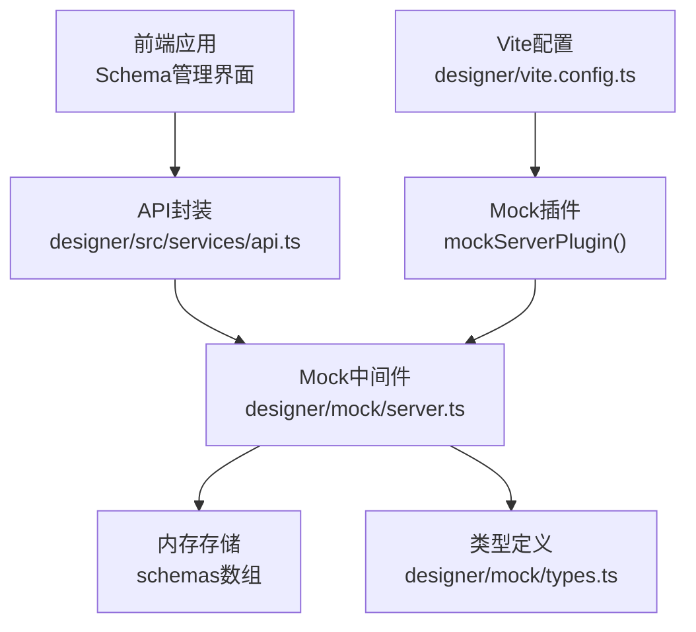
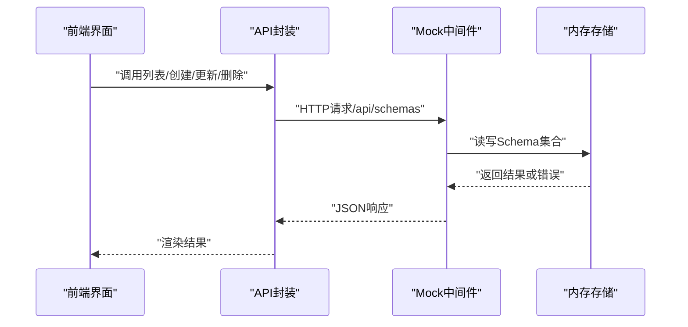
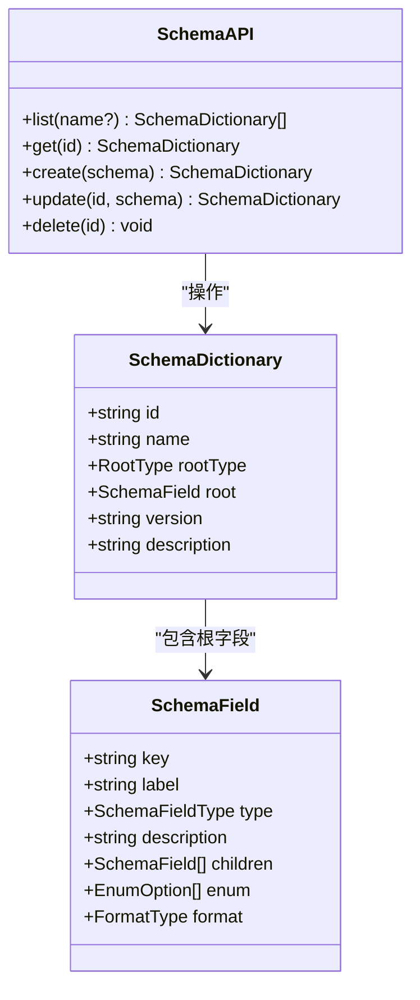

# Schema管理API

<cite>
**本文引用的文件**
- [designer/mock/schemas.ts](file://designer/mock/schemas.ts)
- [designer/mock/server.ts](file://designer/mock/server.ts)
- [designer/mock/types.ts](file://designer/mock/types.ts)
- [designer/mock/index.ts](file://designer/mock/index.ts)
- [designer/src/services/api.ts](file://designer/src/services/api.ts)
- [designer/src/pages/SchemaManagement/index.tsx](file://designer/src/pages/SchemaManagement/index.tsx)
- [designer/src/pages/AssetManagement/components/SchemaManagement/index.tsx](file://designer/src/pages/AssetManagement/components/SchemaManagement/index.tsx)
- [designer/src/utils/mockDataGenerator.ts](file://designer/src/utils/mockDataGenerator.ts)
- [designer/vite.config.ts](file://designer/vite.config.ts)
</cite>

## 更新摘要
**变更内容**
- 架构重构：从独立后端服务迁移到Vite集成的mock API
- API端点调整：从固定端口改为同源代理（/api/schemas）
- 开发环境配置：通过Vite插件集成Mock服务
- 类型定义集中：统一的类型定义文件位于mock目录
- 错误处理机制：简化为标准的错误响应格式

## 目录
1. [简介](#简介)
2. [项目结构](#项目结构)
3. [核心组件](#核心组件)
4. [架构概览](#架构概览)
5. [详细组件分析](#详细组件分析)
6. [依赖关系分析](#依赖关系分析)
7. [性能考量](#性能考量)
8. [故障排查指南](#故障排查指南)
9. [结论](#结论)
10. [附录](#附录)

## 简介
本文件为"Schema管理API"的权威技术文档，面向前端与后端开发者，系统化阐述数据模型定义的CRUD接口、Schema验证机制、版本控制策略、数据结构示例、错误处理与使用示例。该系统采用Vite集成的mock架构：前端通过同源代理访问Mock API；Mock服务基于Connect中间件提供REST风格接口；Schema数据在内存中维护，支持基本的增删改查与简单验证。

## 项目结构
- Mock服务位于 designer/mock 目录，提供 /api/schemas 路由，处理Schema的CRUD。
- Vite集成通过 mockServerPlugin() 插件在开发环境中自动挂载Mock API到 /api 路径。
- 前端位于 designer 目录，提供Schema管理界面与API封装，负责用户交互、Schema可视化、导入导出与基础校验。
- 类型定义统一于 designer/mock/types.ts，确保前后端一致的数据契约。

**图表来源**
- [designer/mock/server.ts:49-267](file://designer/mock/server.ts#L49-L267)
- [designer/src/services/api.ts:9](file://designer/src/services/api.ts#L9)
- [designer/vite.config.ts:10](file://designer/vite.config.ts#L10)

**章节来源**
- [designer/mock/server.ts:1-268](file://designer/mock/server.ts#L1-L268)
- [designer/src/services/api.ts:1-115](file://designer/src/services/api.ts#L1-L115)
- [designer/mock/types.ts:1-317](file://designer/mock/types.ts#L1-L317)
- [designer/vite.config.ts:1-19](file://designer/vite.config.ts#L1-L19)

## 核心组件
- Schema数据模型
  - 字段类型：string、number、boolean、date、datetime、object、array
  - 支持枚举值与格式化标记（如 date/datetime/money/percent）
  - 支持嵌套对象与数组，children定义子结构
- Schema字典
  - 包含标识、名称、根类型（object|array）、根字段、可选版本与描述
- 内置默认Schema
  - 提供一个销售出库单示例，展示多层嵌套与常用字段

**章节来源**
- [designer/mock/types.ts:5-52](file://designer/mock/types.ts#L5-L52)
- [designer/mock/schemas.ts:6-87](file://designer/mock/schemas.ts#L6-L87)
- [designer/mock/types.ts:18-33](file://designer/mock/types.ts#L18-L33)

## 架构概览
Schema管理API采用三层架构：
- 表现层：前端页面与API封装，负责用户交互与数据展示
- 应用层：Vite集成的Mock中间件，提供REST接口与业务逻辑
- 数据层：内存存储，维护Schema集合

**图表来源**
- [designer/src/services/api.ts:26-50](file://designer/src/services/api.ts#L26-L50)
- [designer/mock/server.ts:79-130](file://designer/mock/server.ts#L79-L130)

## 详细组件分析

### 1) Schema数据模型与类型定义
- 字段类型与格式
  - 基础类型：string、number、boolean、date
  - 复合类型：object、array
  - 格式化标记：date、datetime、money、percent
  - 枚举：enum字段提供值与标签映射
- 根节点约定
  - 根节点key必须为"root"
  - 根节点type必须为"object"
  - children定义子字段树
- 版本字段
  - SchemaDictionary.version为可选字符串，用于版本标识

**章节来源**
- [designer/mock/types.ts:5-52](file://designer/mock/types.ts#L5-L52)
- [designer/mock/types.ts:18-33](file://designer/mock/types.ts#L18-L33)
- [designer/src/pages/SchemaManagement/index.tsx:378-394](file://designer/src/pages/SchemaManagement/index.tsx#L378-L394)

### 2) CRUD接口定义

- 列表查询
  - 方法：GET /api/schemas
  - 查询参数：name（模糊匹配名称）
  - 返回：Schema数组
- 获取详情
  - 方法：GET /api/schemas/:id
  - 返回：单个Schema
  - 未找到：404，返回标准错误对象
- 创建Schema
  - 方法：POST /api/schemas
  - 请求体：SchemaDictionary（不含id），若未提供id则自动生成
  - 返回：新创建的Schema
- 更新Schema
  - 方法：PUT /api/schemas/:id
  - 请求体：SchemaDictionary（包含id）
  - 未找到：404，返回标准错误对象
- 删除Schema
  - 方法：DELETE /api/schemas/:id
  - 成功：204 No Content
  - 未找到：404，返回标准错误对象

**章节来源**
- [designer/mock/server.ts:79-130](file://designer/mock/server.ts#L79-L130)

### 3) 前端API封装与调用
- 前端通过 axios 客户端访问 /api（Vite同源代理）
- 提供 list/get/create/update/delete 方法
- 基础URL：import.meta.env.VITE_API_BASE_URL || '/api'
- 错误处理：统一捕获异常并提示

**章节来源**
- [designer/src/services/api.ts:9](file://designer/src/services/api.ts#L9)
- [designer/src/services/api.ts:26-50](file://designer/src/services/api.ts#L26-L50)

### 4) 前端Schema管理界面与验证
- 基础校验
  - 必填项：名称、版本
  - JSON格式：提交前进行JSON.parse校验
  - 根节点约束：key必须为"root"，type必须为"object"
- 可视化与辅助工具
  - Monaco编辑器支持JSON语法高亮
  - 智能生成：从Mock数据推断Schema结构
  - 导入/导出：支持单个与批量JSON导入导出
  - 预览：查看Schema结构与统计信息

**章节来源**
- [designer/src/pages/SchemaManagement/index.tsx:373-419](file://designer/src/pages/SchemaManagement/index.tsx#L373-L419)
- [designer/src/pages/SchemaManagement/index.tsx:169-181](file://designer/src/pages/SchemaManagement/index.tsx#L169-L181)
- [designer/src/pages/SchemaManagement/index.tsx:236-264](file://designer/src/pages/SchemaManagement/index.tsx#L236-L264)
- [designer/src/pages/SchemaManagement/index.tsx:266-297](file://designer/src/pages/SchemaManagement/index.tsx#L266-L297)

### 5) Schema验证机制
- 前端验证
  - 表单必填规则（名称、版本）
  - JSON语法校验
  - 根节点强制校验（key为"root"、type为"object"）
- 后端验证
  - 未找到资源时返回404与标准错误对象
  - 通用500错误由Mock中间件统一返回

**章节来源**
- [designer/src/pages/SchemaManagement/index.tsx:373-419](file://designer/src/pages/SchemaManagement/index.tsx#L373-L419)
- [designer/mock/server.ts:92-129](file://designer/mock/server.ts#L92-L129)

### 6) 版本控制与兼容性
- 版本字段
  - SchemaDictionary.version为可选字符串，用于标识Schema版本
- 兼容性建议
  - 保持根节点约定不变（key为"root"、type为"object"）
  - 新增字段时避免破坏既有字段语义
  - 通过版本号区分不同Schema形态
- 迁移策略
  - 建议在模板与Mock数据层面增加版本映射
  - 通过导入导出机制进行版本升级与回滚

**章节来源**
- [designer/mock/types.ts:48](file://designer/mock/types.ts#L48)
- [designer/src/pages/SchemaManagement/index.tsx:236-264](file://designer/src/pages/SchemaManagement/index.tsx#L236-L264)

### 7) 数据结构示例与使用示例
- 示例Schema（销售出库单）
  - 展示了根节点、嵌套对象、数组、枚举与格式化标记
- 使用步骤
  - 在前端界面创建或编辑Schema
  - 导入/导出JSON文件
  - 通过API进行CRUD操作

**章节来源**
- [designer/mock/schemas.ts:6-87](file://designer/mock/schemas.ts#L6-L87)
- [designer/src/pages/SchemaManagement/index.tsx:236-264](file://designer/src/pages/SchemaManagement/index.tsx#L236-L264)

### 8) 错误处理机制
- 404未找到：当查询或更新/删除不存在的Schema时返回标准错误对象
- 500内部错误：由Mock中间件统一返回标准错误对象
- 前端错误提示：对JSON格式错误、保存失败等进行用户提示

**章节来源**
- [designer/mock/server.ts:92-129](file://designer/mock/server.ts#L92-L129)
- [designer/src/pages/SchemaManagement/index.tsx:410-418](file://designer/src/pages/SchemaManagement/index.tsx#L410-L418)

## 依赖关系分析

**图表来源**
- [designer/mock/types.ts:18-52](file://designer/mock/types.ts#L18-L52)
- [designer/src/services/api.ts:26-50](file://designer/src/services/api.ts#L26-L50)

**章节来源**
- [designer/mock/types.ts:18-52](file://designer/mock/types.ts#L18-L52)
- [designer/src/services/api.ts:26-50](file://designer/src/services/api.ts#L26-L50)

## 性能考量
- 内存存储
  - 当前Schema集合存储在内存数组中，适合开发与小规模场景
  - 生产环境建议持久化到数据库，并引入缓存与分页
- 接口复杂度
  - CRUD均为O(n)遍历查找，建议在Schema数量较大时引入索引或数据库
- 前端渲染
  - 大型Schema树建议使用虚拟滚动与懒加载优化渲染性能

## 故障排查指南
- 404未找到
  - 确认id是否存在；检查路由参数是否正确
- 500内部错误
  - 查看浏览器控制台；检查Mock中间件输出
- JSON格式错误
  - 使用Monaco编辑器的语法高亮；确保JSON合法
- 根节点校验失败
  - 确保根节点key为"root"且type为"object"

**章节来源**
- [designer/mock/server.ts:92-129](file://designer/mock/server.ts#L92-L129)
- [designer/src/pages/SchemaManagement/index.tsx:378-394](file://designer/src/pages/SchemaManagement/index.tsx#L378-L394)

## 结论
Schema管理API提供了清晰的数据模型定义与CRUD能力，结合Vite集成的mock架构与前端可视化工具，能够高效地完成Schema的设计、导入导出与版本管理。建议在生产环境中引入数据库持久化、更严格的Schema校验与版本迁移策略，以提升系统的稳定性与可维护性。

## 附录

### A. 请求与响应规范

- 列表查询
  - GET /api/schemas?name=关键字
  - 成功：200 OK，返回Schema数组
- 获取详情
  - GET /api/schemas/:id
  - 成功：200 OK，返回Schema
  - 未找到：404 Not Found，返回标准错误对象
- 创建Schema
  - POST /api/schemas
  - 请求体：SchemaDictionary（不含id）
  - 成功：201 Created，返回创建的Schema
- 更新Schema
  - PUT /api/schemas/:id
  - 请求体：SchemaDictionary（包含id）
  - 成功：200 OK，返回更新后的Schema
  - 未找到：404 Not Found，返回标准错误对象
- 删除Schema
  - DELETE /api/schemas/:id
  - 成功：204 No Content
  - 未找到：404 Not Found，返回标准错误对象

**章节来源**
- [designer/mock/server.ts:79-130](file://designer/mock/server.ts#L79-L130)

### B. 数据模型定义

- SchemaField
  - key、label、type、description、children、enum、format
- SchemaDictionary
  - id、name、rootType、root、version、description

**章节来源**
- [designer/mock/types.ts:18-52](file://designer/mock/types.ts#L18-L52)

### C. 前端调用示例
- 列表：await schemaApi.list()
- 获取：await schemaApi.get(id)
- 创建：await schemaApi.create(payload)
- 更新：await schemaApi.update(id, payload)
- 删除：await schemaApi.delete(id)

**章节来源**
- [designer/src/services/api.ts:26-50](file://designer/src/services/api.ts#L26-L50)

### D. Mock数据生成（参考）
- 根据Schema类型生成示例数据，便于预览与测试
- 支持字符串、数字、布尔、日期、对象、数组等类型

**章节来源**
- [designer/src/utils/mockDataGenerator.ts:4-113](file://designer/src/utils/mockDataGenerator.ts#L4-L113)

### E. 开发环境配置
- Vite插件集成：mockServerPlugin()
- API基础URL：/api（同源代理）
- 环境变量：VITE_API_BASE_URL（可选）

**章节来源**
- [designer/vite.config.ts:10](file://designer/vite.config.ts#L10)
- [designer/src/services/api.ts:9](file://designer/src/services/api.ts#L9)