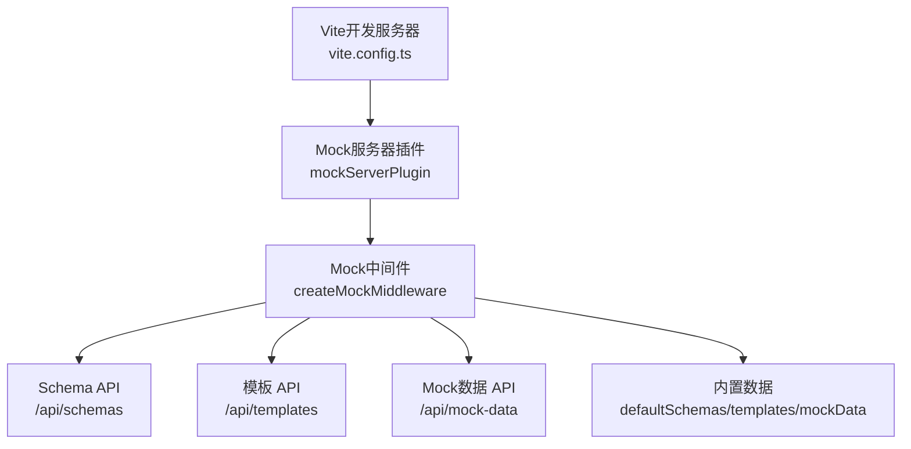
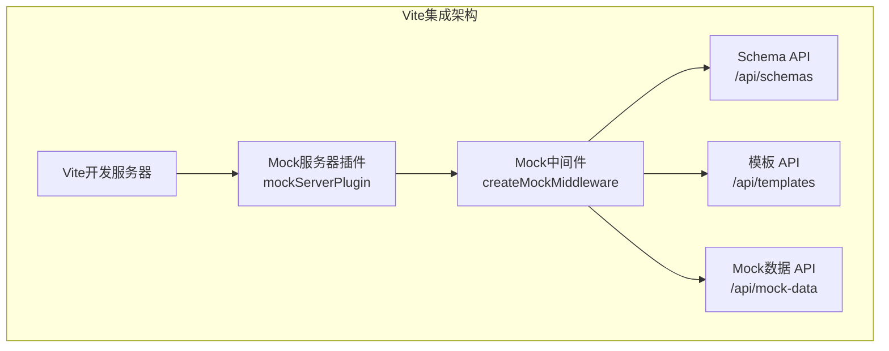
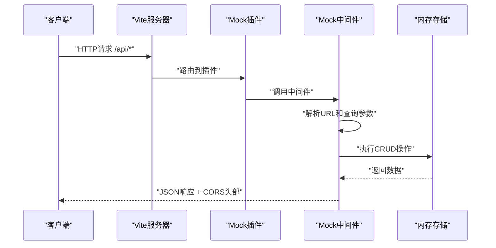

# 服务端API系统

<cite>
**本文引用的文件**
- [designer/vite.config.ts](file://designer/vite.config.ts)
- [designer/mock/index.ts](file://designer/mock/index.ts)
- [designer/mock/server.ts](file://designer/mock/server.ts)
- [designer/mock/types.ts](file://designer/mock/types.ts)
- [designer/mock/schemas.ts](file://designer/mock/schemas.ts)
- [designer/mock/templates.ts](file://designer/mock/templates.ts)
- [designer/mock/mockData.ts](file://designer/mock/mockData.ts)
- [designer/package.json](file://designer/package.json)
- [designer/src/services/api.ts](file://designer/src/services/api.ts)
- [README.md](file://README.md)
</cite>

## 更新摘要
**变更内容**
- 架构重构：从独立Node.js Express后端迁移到Vite集成mock服务器
- 移除传统RESTful API，采用Vite中间件插件形式的Mock API
- 保持相同的API接口和数据结构，确保向前兼容
- 内置默认数据，无需外部依赖即可运行

## 目录
1. [简介](#简介)
2. [项目结构](#项目结构)
3. [核心组件](#核心组件)
4. [架构总览](#架构总览)
5. [详细组件分析](#详细组件分析)
6. [依赖分析](#依赖分析)
7. [性能考量](#性能考量)
8. [故障排查指南](#故障排查指南)
9. [结论](#结论)
10. [附录](#附录)

## 简介
本服务端API系统已完全重构为Vite集成mock服务器，提供三类核心资源的RESTful API：
- Schema管理API：用于管理数据模型定义（Schema），支持CRUD与查询过滤。
- Mock数据管理API：用于管理模拟数据，支持CRUD、查询过滤与批量导入导出能力（示例数据内置）。
- 模板管理API：用于管理打印模板，支持CRUD、查询过滤与版本管理。

系统采用Vite中间件插件架构，通过mockServerPlugin集成到开发服务器中，所有API均返回标准JSON响应，支持CORS跨域访问。

## 项目结构
后端服务已完全集成到Vite开发服务器中，位于designer/mock目录：
- mockServerPlugin：Vite插件，负责注册Mock中间件。
- createMockMiddleware：核心中间件，实现完整的CRUD API。
- 内置数据：默认Schema、模板和Mock数据集合。
- 类型定义：完整的TypeScript类型系统。

**图表来源**
- [designer/vite.config.ts:1-19](file://designer/vite.config.ts#L1-L19)
- [designer/mock/server.ts:259-267](file://designer/mock/server.ts#L259-L267)
- [designer/mock/server.ts:49-254](file://designer/mock/server.ts#L49-L254)

**章节来源**
- [designer/vite.config.ts:1-19](file://designer/vite.config.ts#L1-L19)
- [designer/mock/server.ts:259-267](file://designer/mock/server.ts#L259-L267)
- [designer/mock/server.ts:49-254](file://designer/mock/server.ts#L49-L254)

## 核心组件
- Vite Mock服务器插件
  - mockServerPlugin：Vite插件，通过configureServer钩子注册中间件。
  - 监听/api路由前缀，拦截所有Mock API请求。
  - 自动注入CORS头部，支持跨域访问。
- Mock中间件
  - createMockMiddleware：核心中间件函数，处理所有HTTP请求。
  - 支持CORS预检请求（OPTIONS）。
  - 解析JSON请求体，发送JSON响应。
  - 实现完整的CRUD操作和查询过滤。
- 内置数据管理
  - defaultSchemas：默认Schema集合。
  - defaultTemplates：默认模板集合。
  - defaultMockData：默认Mock数据集合。
  - 内存存储，重启后恢复默认数据。

**章节来源**
- [designer/mock/server.ts:259-267](file://designer/mock/server.ts#L259-L267)
- [designer/mock/server.ts:49-254](file://designer/mock/server.ts#L49-L254)
- [designer/mock/schemas.ts:1-88](file://designer/mock/schemas.ts#L1-L88)
- [designer/mock/templates.ts:1-800](file://designer/mock/templates.ts#L1-L800)
- [designer/mock/mockData.ts:1-369](file://designer/mock/mockData.ts#L1-L369)

## 架构总览
系统采用"Vite插件 + 中间件"的全新架构，通过Vite的中间件机制集成Mock API服务。

**图表来源**
- [designer/mock/server.ts:259-267](file://designer/mock/server.ts#L259-L267)
- [designer/mock/server.ts:49-254](file://designer/mock/server.ts#L49-L254)

## 详细组件分析

### Schema管理API
- 资源说明
  - 管理数据模型定义（Schema），支持对象或数组根类型，字段类型覆盖常用基础类型与枚举。
  - 内置示例Schema：销售出库单，包含标题、公司信息、客户信息、明细列表、汇总等字段。
- 路由与方法
  - POST /api/schemas：创建Schema；若未提供id则自动生成UUID。
  - GET /api/schemas：查询Schema；支持name模糊过滤。
  - GET /api/schemas/:id：按id获取Schema；不存在时返回404及标准错误体。
  - PUT /api/schemas/:id：更新Schema；不存在时返回404。
  - DELETE /api/schemas/:id：删除Schema；不存在时返回404。
- 查询参数
  - name：字符串，用于按名称模糊匹配。
- 错误处理
  - 404：资源不存在。
  - 500：内部错误（统一中间件）。
- 请求/响应示例（路径）
  - 创建Schema：POST /api/schemas
  - 查询Schema：GET /api/schemas?name=销售
  - 获取单个Schema：GET /api/schemas/schema-demo-sales
  - 更新Schema：PUT /api/schemas/schema-demo-sales
  - 删除Schema：DELETE /api/schemas/schema-demo-sales

**章节来源**
- [designer/mock/server.ts:79-130](file://designer/mock/server.ts#L79-L130)
- [designer/mock/schemas.ts:1-88](file://designer/mock/schemas.ts#L1-L88)

### Mock数据管理API
- 资源说明
  - 管理模拟数据，支持与Schema关联（schemaId）与模板关联（templateId），数据结构灵活，可为对象或数组。
  - 内置示例Mock数据：标准样例（5条明细）、大数据量（39条明细）、最小数据集（1条明细）、批量打印测试数据（5份不同订单）。
- 路由与方法
  - POST /api/mock-data：创建Mock数据；若未提供id则自动生成UUID。
  - GET /api/mock-data：查询Mock数据；支持name、schemaId、templateId过滤。
  - GET /api/mock-data/:id：按id获取Mock数据；不存在时返回404及标准错误体。
  - PUT /api/mock-data/:id：更新Mock数据；不存在时返回404。
  - DELETE /api/mock-data/:id：删除Mock数据；不存在时返回404。
- 查询参数
  - name：字符串，用于按名称模糊匹配。
  - schemaId：字符串，按Schema ID过滤。
  - templateId：字符串，按模板ID过滤。
- 错误处理
  - 404：资源不存在。
  - 500：内部错误（统一中间件）。
- 请求/响应示例（路径）
  - 创建Mock数据：POST /api/mock-data
  - 查询Mock数据：GET /api/mock-data?name=销售&schemaId=schema-demo-sales
  - 获取单个Mock数据：GET /api/mock-data/mock-sales-001
  - 更新Mock数据：PUT /api/mock-data/mock-sales-001
  - 删除Mock数据：DELETE /api/mock-data/mock-sales-001

**章节来源**
- [designer/mock/server.ts:188-245](file://designer/mock/server.ts#L188-L245)
- [designer/mock/mockData.ts:1-369](file://designer/mock/mockData.ts#L1-L369)

### 模板管理API
- 资源说明
  - 管理打印模板，包含页面配置（尺寸、方向、边距）、布局模式（绝对/流式）、组件树（文本、图片、表格、线条、二维码、条形码、容器等）与数据绑定（路径、管道、回退值）。
  - 内置示例模板：订单打印模板、快递面单模板、产品标签模板。
- 路由与方法
  - POST /api/templates：创建模板；若未提供id则自动生成UUID。
  - GET /api/templates：查询模板；支持name、schemaId过滤。
  - GET /api/templates/:id：按id获取模板；不存在时返回404及标准错误体。
  - PUT /api/templates/:id：更新模板；不存在时返回404。
  - DELETE /api/templates/:id：删除模板；不存在时返回404。
- 查询参数
  - name：字符串，用于按名称模糊匹配。
  - schemaId：字符串，按Schema ID过滤。
- 错误处理
  - 404：资源不存在。
  - 500：内部错误（统一中间件）。
- 请求/响应示例（路径）
  - 创建模板：POST /api/templates
  - 查询模板：GET /api/templates?name=订单&schemaId=schema-demo-sales
  - 获取单个模板：GET /api/templates/template-demo-order
  - 更新模板：PUT /api/templates/template-demo-order
  - 删除模板：DELETE /api/templates/template-demo-order

**章节来源**
- [designer/mock/server.ts:132-186](file://designer/mock/server.ts#L132-L186)
- [designer/mock/templates.ts:1-800](file://designer/mock/templates.ts#L1-L800)

### Mock服务器中间件架构

**图表来源**
- [designer/mock/server.ts:55-253](file://designer/mock/server.ts#L55-L253)
- [designer/vite.config.ts:259-267](file://designer/vite.config.ts#L259-L267)

## 依赖分析
- 运行时依赖
  - axios：HTTP客户端，用于前端API调用。
  - @types/qrcode：二维码类型定义。
  - @types/jsbarcode：条形码类型定义。
- 开发依赖
  - vite：现代前端构建工具。
  - @vitejs/plugin-react：React插件。
  - typescript：TypeScript编译支持。
  - @types/react：React类型定义。
- Mock服务器依赖
  - connect：Vite中间件基础设施。
  - uuid：生成唯一ID。

**章节来源**
- [designer/package.json:1-43](file://designer/package.json#L1-L43)
- [designer/mock/server.ts:5-6](file://designer/mock/server.ts#L5-L6)

## 性能考量
- 当前实现
  - 所有数据均驻留在内存数组中，重启后恢复默认内置数据。
  - 路由层未实现分页与索引，查询复杂度与数据规模线性相关。
  - Vite中间件直接处理请求，无需额外进程开销。
- 建议优化
  - 引入数据库持久化与索引，提升查询性能。
  - 对查询结果增加分页与排序参数。
  - 对大型模板与Mock数据进行缓存与压缩。
  - 增加速率限制与并发控制，防止突发流量导致内存压力。

## 故障排查指南
- 常见错误码
  - 404 NOT_FOUND：请求的资源不存在（Schema/Mock数据/模板）。
  - 500 INTERNAL_ERROR：服务器内部错误（统一中间件返回）。
- 排查步骤
  - 确认请求路径与HTTP方法正确。
  - 检查请求体格式（application/json）与必填字段。
  - 核对资源ID是否存在。
  - 查看浏览器开发者工具Network面板确认CORS设置。
  - 检查Vite控制台输出的Mock服务器日志。
- 重置数据
  - 重启Vite开发服务器后，系统将自动恢复默认内置数据（Schema与Mock数据）。

**章节来源**
- [designer/mock/server.ts:249-252](file://designer/mock/server.ts#L249-L252)
- [designer/src/services/api.ts:9](file://designer/src/services/api.ts#L9)

## 结论
该服务端API系统已成功重构为Vite集成mock服务器架构，提供了Schema、Mock数据与模板的完整RESTful管理能力。新的架构通过Vite中间件机制实现了无缝集成，无需额外的后端进程，简化了开发部署流程。系统保持了原有的API接口和数据结构，确保了向前兼容性。后续可在数据持久化、查询性能与版本管理等方面持续演进。

## 附录

### API一览表
- Schema管理
  - POST /api/schemas
  - GET /api/schemas
  - GET /api/schemas/:id
  - PUT /api/schemas/:id
  - DELETE /api/schemas/:id
- Mock数据管理
  - POST /api/mock-data
  - GET /api/mock-data
  - GET /api/mock-data/:id
  - PUT /api/mock-data/:id
  - DELETE /api/mock-data/:id
- 模板管理
  - POST /api/templates
  - GET /api/templates
  - GET /api/templates/:id
  - PUT /api/templates/:id
  - DELETE /api/templates/:id

**章节来源**
- [designer/mock/server.ts:82-129](file://designer/mock/server.ts#L82-L129)
- [designer/mock/server.ts:191-244](file://designer/mock/server.ts#L191-L244)
- [designer/mock/server.ts:146-185](file://designer/mock/server.ts#L146-L185)

### 内置数据概览
- Schema
  - 销售出库单（schema-demo-sales）：包含标题、公司信息、客户信息、明细列表、汇总等字段。
- Mock数据
  - 标准样例（mock-sales-001）：5条明细。
  - 大数据量（mock-sales-002）：39条明细。
  - 最小数据集（mock-sales-003）：1条明细。
  - 批量打印测试（mock-batch-001）：5份不同订单。
- 模板
  - 订单打印模板、快递面单模板、产品标签模板。

**章节来源**
- [designer/mock/schemas.ts:6-87](file://designer/mock/schemas.ts#L6-L87)
- [designer/mock/mockData.ts:6-368](file://designer/mock/mockData.ts#L6-L368)
- [designer/mock/templates.ts:6-413](file://designer/mock/templates.ts#L6-L413)

### Vite集成配置
- Vite插件配置
  - mockServerPlugin()：注册Mock服务器插件。
  - 监听/api路由前缀。
  - 自动注入CORS支持。
- 环境变量支持
  - VITE_API_BASE_URL：可配置API基础URL。
  - 默认使用同源代理（/api）。

**章节来源**
- [designer/vite.config.ts:1-19](file://designer/vite.config.ts#L1-L19)
- [designer/src/services/api.ts:9](file://designer/src/services/api.ts#L9)