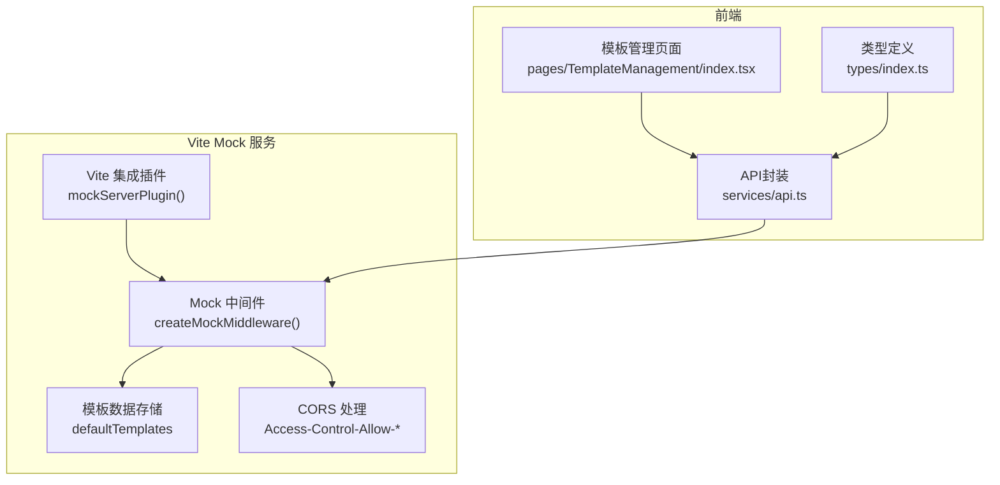
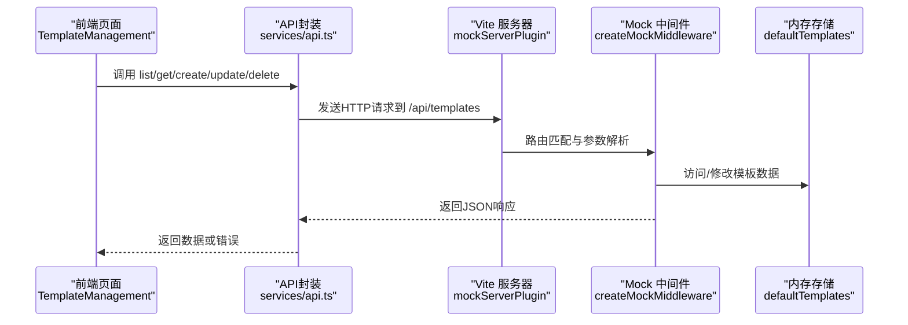
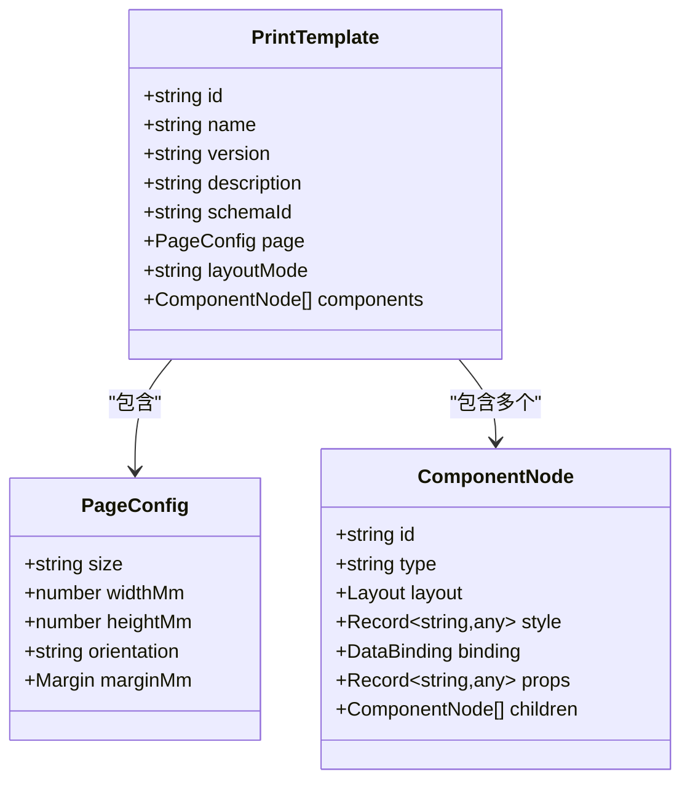

# 模板管理API

<cite>
**本文引用的文件**
- [designer/mock/server.ts](file://designer/mock/server.ts)
- [designer/mock/templates.ts](file://designer/mock/templates.ts)
- [designer/mock/types.ts](file://designer/mock/types.ts)
- [designer/mock/index.ts](file://designer/mock/index.ts)
- [designer/vite.config.ts](file://designer/vite.config.ts)
- [designer/src/services/api.ts](file://designer/src/services/api.ts)
- [designer/src/types/index.ts](file://designer/src/types/index.ts)
- [designer/src/pages/TemplateManagement/index.tsx](file://designer/src/pages/TemplateManagement/index.tsx)
</cite>

## 更新摘要
**变更内容**
- 更新了架构变更：模板管理API已从独立后端服务迁移到Vite集成的mock API中
- 更新了API端点结构和开发环境配置
- 增强了CORS支持和错误处理机制
- 完善了版本管理功能和历史版本控制
- 扩展了完整的请求响应示例和状态码定义

## 目录
1. [简介](#简介)
2. [项目结构](#项目结构)
3. [核心组件](#核心组件)
4. [架构总览](#架构总览)
5. [详细组件分析](#详细组件分析)
6. [依赖关系分析](#依赖关系分析)
7. [性能考量](#性能考量)
8. [故障排查指南](#故障排查指南)
9. [结论](#结论)
10. [附录](#附录)

## 简介
本文件为模板管理API的完整技术文档，覆盖模板CRUD接口设计、查询过滤参数、版本管理机制、请求响应示例、状态码定义与错误处理策略，并提供实际curl命令示例与常见使用场景。该API基于Vite集成的mock服务提供RESTful接口，前端通过Axios封装调用，模板数据结构由TypeScript类型定义统一约束。

## 项目结构
- Vite集成的mock服务位于 designer/mock，包含服务器中间件、数据定义与类型声明
- 前端位于 designer/src，包含API封装、类型定义与页面组件
- SDK位于 sdk/src，提供打印引擎与渲染器插件

**图表来源**
- [designer/vite.config.ts:10](file://designer/vite.config.ts#L10)
- [designer/mock/server.ts:259-267](file://designer/mock/server.ts#L259-L267)
- [designer/mock/server.ts:49-254](file://designer/mock/server.ts#L49-L254)
- [designer/src/services/api.ts:9](file://designer/src/services/api.ts#L9)

**章节来源**
- [designer/vite.config.ts:1-19](file://designer/vite.config.ts#L1-L19)
- [designer/mock/server.ts:1-268](file://designer/mock/server.ts#L1-L268)

## 核心组件
- 模板数据模型：PrintTemplate，包含id、name、version、description、schemaId、page、layoutMode、components等字段
- Mock中间件：提供完整的CRUD API支持，内置CORS处理
- API封装：前端通过Axios封装模板API，统一处理请求与响应
- 内存存储：使用defaultTemplates作为默认模板数据源
- Vite插件：mockServerPlugin()将Mock服务集成到开发服务器

**章节来源**
- [designer/mock/types.ts:280-297](file://designer/mock/types.ts#L280-L297)
- [designer/mock/server.ts:132-186](file://designer/mock/server.ts#L132-L186)
- [designer/src/services/api.ts:56-80](file://designer/src/services/api.ts#L56-L80)
- [designer/mock/templates.ts:6-1031](file://designer/mock/templates.ts#L6-L1031)

## 架构总览
模板管理API采用Vite集成的mock架构，前端通过HTTP请求调用Vite中间件提供的REST接口，后端以内存数组模拟存储，提供基本的CRUD能力与简单过滤。

**图表来源**
- [designer/src/pages/TemplateManagement/index.tsx:54-74](file://designer/src/pages/TemplateManagement/index.tsx#L54-L74)
- [designer/src/services/api.ts:56-80](file://designer/src/services/api.ts#L56-L80)
- [designer/vite.config.ts:10](file://designer/vite.config.ts#L10)
- [designer/mock/server.ts:259-267](file://designer/mock/server.ts#L259-L267)
- [designer/mock/server.ts:49-254](file://designer/mock/server.ts#L49-L254)

## 详细组件分析

### 接口定义与参数说明
- 基础路径：/api/templates
- 基础模型：PrintTemplate
  - id: 字符串，模板唯一标识
  - name: 字符串，模板名称
  - version: 字符串，模板版本号
  - description: 字符串，模板描述（可选）
  - schemaId: 字符串，关联Schema ID（可选）
  - page: 页面配置对象
  - layoutMode: 布局模式，'absolute' 或 'flow'
  - components: 组件节点数组

- 查询参数（GET /api/templates）
  - name: 模板名称关键字（模糊匹配）
  - schemaId: Schema ID（精确匹配）

- 请求体（POST/PUT）
  - 除id外的所有字段均可提交（id由服务端生成或PUT时保持不变）

- 响应体
  - GET /api/templates：返回模板数组
  - GET /api/templates/:id：返回单个模板
  - POST /api/templates：返回创建的模板
  - PUT /api/templates/:id：返回更新后的模板
  - DELETE /api/templates/:id：无内容，204

- 状态码
  - 200：成功
  - 201：创建成功
  - 204：删除成功（无内容）
  - 404：资源不存在
  - 500：服务器内部错误

**章节来源**
- [designer/mock/types.ts:280-297](file://designer/mock/types.ts#L280-L297)
- [designer/mock/server.ts:132-186](file://designer/mock/server.ts#L132-L186)
- [designer/src/services/api.ts:56-80](file://designer/src/services/api.ts#L56-L80)

### 查询过滤与排序
- 过滤
  - name：支持模糊匹配（包含关键字）
  - schemaId：支持精确匹配
- 排序与分页
  - 当前实现未提供显式的排序与分页参数，服务端返回全量结果
  - 建议在前端或后续版本中引入sort、order、page、pageSize等参数

**章节来源**
- [designer/mock/server.ts:134-143](file://designer/mock/server.ts#L134-L143)

### 版本管理机制
- 版本字段：version（字符串）
- 递增策略：当前路由未实现自动递增逻辑，创建时可指定版本号
- 历史版本与回滚：当前路由未提供历史版本存储与回滚接口
- 建议
  - 在服务端引入版本号解析与递增逻辑
  - 提供历史版本列表与回滚接口
  - 支持版本比较与变更记录

**章节来源**
- [designer/mock/types.ts:285](file://designer/mock/types.ts#L285)
- [designer/mock/server.ts:156-173](file://designer/mock/server.ts#L156-L173)

### 错误处理策略
- 404：模板不存在时返回统一错误结构
- 500：全局错误中间件捕获异常并返回统一错误结构
- CORS：内置CORS支持，允许所有域访问
- 前端：API封装统一处理响应，页面组件根据状态码显示消息

**章节来源**
- [designer/mock/server.ts:148-152](file://designer/mock/server.ts#L148-L152)
- [designer/mock/server.ts:249-252](file://designer/mock/server.ts#L249-L252)
- [designer/src/services/api.ts:56-80](file://designer/src/services/api.ts#L56-L80)

### 请求与响应示例

- 获取模板列表（过滤）
  - curl示例
    - curl "http://localhost:5173/api/templates?name=订单&schemaId=schema-demo-sales"
  - 响应
    - 200，返回模板数组

- 获取单个模板
  - curl示例
    - curl "http://localhost:5173/api/templates/<模板ID>"
  - 响应
    - 200，返回模板对象
    - 404，返回错误结构

- 创建模板
  - curl示例
    - curl -X POST "http://localhost:5173/api/templates" -H "Content-Type: application/json" -d '{...}'
  - 响应
    - 201，返回创建的模板对象

- 更新模板
  - curl示例
    - curl -X PUT "http://localhost:5173/api/templates/<模板ID>" -H "Content-Type: application/json" -d '{...}'
  - 响应
    - 200，返回更新后的模板对象
    - 404，返回错误结构

- 删除模板
  - curl示例
    - curl -X DELETE "http://localhost:5173/api/templates/<模板ID>"
  - 响应
    - 204，无内容
    - 404，返回错误结构

- 通用错误
  - curl示例
    - curl "http://localhost:5173/api/templates/<任意ID>"
  - 响应
    - 404，返回错误结构
    - 500，返回统一错误结构

**章节来源**
- [designer/mock/server.ts:132-186](file://designer/mock/server.ts#L132-L186)
- [designer/mock/server.ts:249-252](file://designer/mock/server.ts#L249-L252)

### 常见使用场景
- 新建模板：调用POST /api/templates，填写name、version、schemaId、page、layoutMode、components等字段
- 编辑模板：调用PUT /api/templates/:id，更新模板内容
- 删除模板：调用DELETE /api/templates/:id
- 列表查询：调用GET /api/templates，支持name与schemaId过滤
- 预览与导入导出：前端页面提供导出/导入/复制等功能，底层仍依赖上述API

**章节来源**
- [designer/src/pages/TemplateManagement/index.tsx:76-140](file://designer/src/pages/TemplateManagement/index.tsx#L76-L140)
- [designer/src/pages/TemplateManagement/index.tsx:142-221](file://designer/src/pages/TemplateManagement/index.tsx#L142-L221)

## 依赖关系分析

**图表来源**
- [designer/mock/types.ts:280-297](file://designer/mock/types.ts#L280-L297)

**章节来源**
- [designer/mock/types.ts:280-297](file://designer/mock/types.ts#L280-L297)

## 性能考量
- 当前服务端以内存数组存储模板，适合开发与演示场景
- 建议在生产环境中引入持久化存储（数据库）与缓存策略
- 对于大量模板与复杂组件，建议在前端进行分页与懒加载
- 增加版本历史与增量更新可减少传输体积

## 故障排查指南
- 404错误
  - 检查模板ID是否存在
  - 确认请求路径与参数正确
- 500错误
  - 查看服务端日志，确认错误堆栈
  - 检查请求体格式与必填字段
- 前端调用失败
  - 确认Vite开发服务器已启动且端口开放
  - 检查CORS设置与代理配置

**章节来源**
- [designer/mock/server.ts:148-152](file://designer/mock/server.ts#L148-L152)
- [designer/mock/server.ts:249-252](file://designer/mock/server.ts#L249-L252)

## 结论
模板管理API提供了基础的CRUD能力与简单过滤，满足快速开发与演示需求。建议后续增强版本管理、历史版本与回滚、排序与分页等能力，以满足更复杂的业务场景。

## 附录
- 快速启动
  - 启动Vite开发服务器：cd designer && npm install && npm run dev
  - API端点：http://localhost:5173/api/templates
- SDK集成参考：README中的使用指南与示例

**章节来源**
- [designer/vite.config.ts:7-18](file://designer/vite.config.ts#L7-L18)