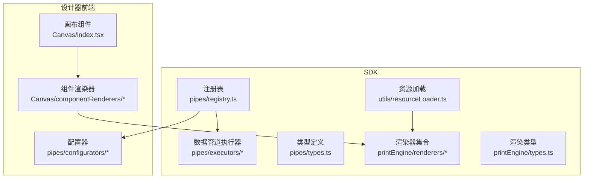
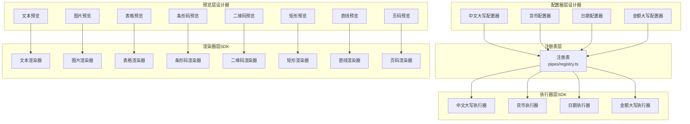
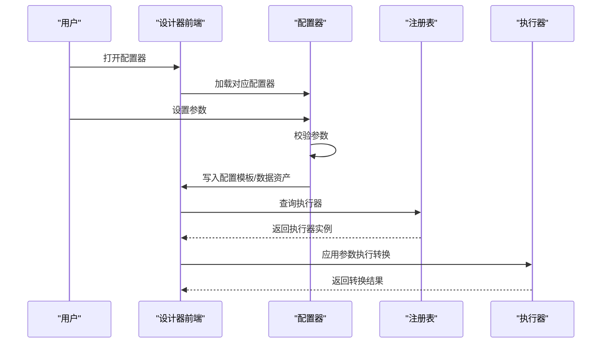
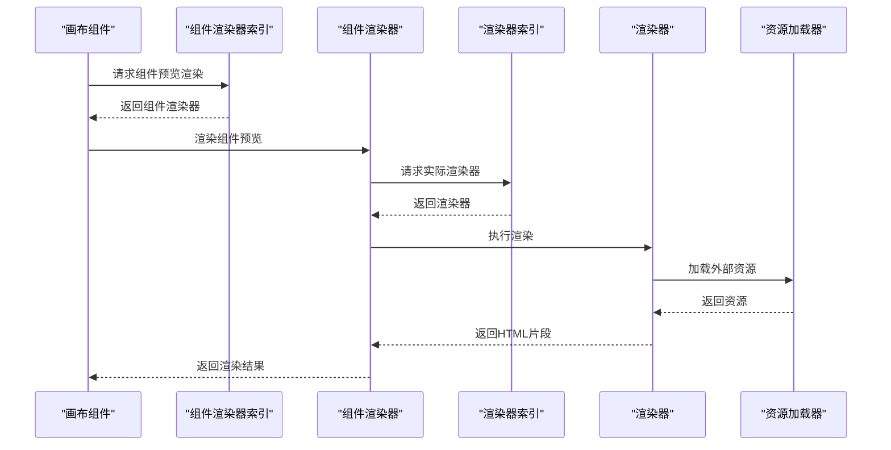
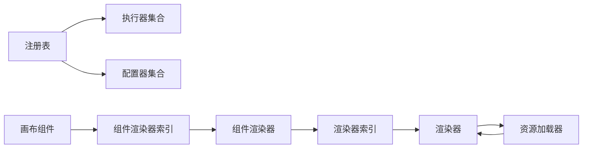

# 插件扩展系统

<cite>
**本文档引用的文件**
- [sdk/src/pipes/registry.ts](file://sdk/src/pipes/registry.ts)
- [sdk/src/pipes/executors/ChineseNumberPipe.ts](file://sdk/src/pipes/executors/ChineseNumberPipe.ts)
- [sdk/src/pipes/executors/CurrencyPipe.ts](file://sdk/src/pipes/executors/CurrencyPipe.ts)
- [sdk/src/pipes/executors/DatePipe.ts](file://sdk/src/pipes/executors/DatePipe.ts)
- [sdk/src/pipes/executors/MoneyPipe.ts](file://sdk/src/pipes/executors/MoneyPipe.ts)
- [sdk/src/pipes/types.ts](file://sdk/src/pipes/types.ts)
- [sdk/src/printEngine/renderers/index.ts](file://sdk/src/printEngine/renderers/index.ts)
- [sdk/src/printEngine/renderers/TextRenderer.ts](file://sdk/src/printEngine/renderers/TextRenderer.ts)
- [sdk/src/printEngine/renderers/ImageRenderer.ts](file://sdk/src/printEngine/renderers/ImageRenderer.ts)
- [sdk/src/printEngine/renderers/TableRenderer.ts](file://sdk/src/printEngine/renderers/TableRenderer.ts)
- [sdk/src/printEngine/renderers/BarcodeRenderer.ts](file://sdk/src/printEngine/renderers/BarcodeRenderer.ts)
- [sdk/src/printEngine/renderers/QRCodeRenderer.ts](file://sdk/src/printEngine/renderers/QRCodeRenderer.ts)
- [sdk/src/printEngine/renderers/RectRenderer.ts](file://sdk/src/printEngine/renderers/RectRenderer.ts)
- [sdk/src/printEngine/renderers/LineRenderer.ts](file://sdk/src/printEngine/renderers/LineRenderer.ts)
- [sdk/src/printEngine/renderers/PageNumberRenderer.ts](file://sdk/src/printEngine/renderers/PageNumberRenderer.ts)
- [sdk/src/printEngine/types.ts](file://sdk/src/printEngine/types.ts)
- [sdk/src/printEngine/htmlTemplate.ts](file://sdk/src/printEngine/htmlTemplate.ts)
- [sdk/src/utils/resourceLoader.ts](file://sdk/src/utils/resourceLoader.ts)
- [designer/src/pipes/configurators/ChineseNumberPipeConfigurator.tsx](file://designer/src/pipes/configurators/ChineseNumberPipeConfigurator.tsx)
- [designer/src/pipes/configurators/CurrencyPipeConfigurator.tsx](file://designer/src/pipes/configurators/CurrencyPipeConfigurator.tsx)
- [designer/src/pipes/configurators/DatePipeConfigurator.tsx](file://designer/src/pipes/configurators/DatePipeConfigurator.tsx)
- [designer/src/pipes/configurators/MoneyPipeConfigurator.tsx](file://designer/src/pipes/configurators/MoneyPipeConfigurator.tsx)
- [designer/src/pipes/index.ts](file://designer/src/pipes/index.ts)
- [designer/src/pages/Designer/components/Canvas/componentRenderers/index.ts](file://designer/src/pages/Designer/components/Canvas/componentRenderers/index.ts)
- [designer/src/pages/Designer/components/Canvas/componentRenderers/TextPreview.tsx](file://designer/src/pages/Designer/components/Canvas/componentRenderers/TextPreview.tsx)
- [designer/src/pages/Designer/components/Canvas/componentRenderers/ImagePreview.tsx](file://designer/src/pages/Designer/components/Canvas/componentRenderers/ImagePreview.tsx)
- [designer/src/pages/Designer/components/Canvas/componentRenderers/TablePreview.tsx](file://designer/src/pages/Designer/components/Canvas/componentRenderers/TablePreview.tsx)
- [designer/src/pages/Designer/components/Canvas/componentRenderers/BarcodePreview.tsx](file://designer/src/pages/Designer/components/Canvas/componentRenderers/BarcodePreview.tsx)
- [designer/src/pages/Designer/components/Canvas/componentRenderers/QRCodePreview.tsx](file://designer/src/pages/Designer/components/Canvas/componentRenderers/QRCodePreview.tsx)
- [designer/src/pages/Designer/components/Canvas/componentRenderers/RectPreview.tsx](file://designer/src/pages/Designer/components/Canvas/componentRenderers/RectPreview.tsx)
- [designer/src/pages/Designer/components/Canvas/componentRenderers/LinePreview.tsx](file://designer/src/pages/Designer/components/Canvas/componentRenderers/LinePreview.tsx)
- [designer/src/pages/Designer/components/Canvas/componentRenderers/PageNumberPreview.tsx](file://designer/src/pages/Designer/components/Canvas/componentRenderers/PageNumberPreview.tsx)
- [designer/src/pages/Designer/components/Canvas/componentRenderers/ComponentPreview.tsx](file://designer/src/pages/Designer/components/Canvas/componentRenderers/ComponentPreview.tsx)
- [designer/src/pages/Designer/components/Canvas/ComponentPreview.tsx](file://designer/src/pages/Designer/components/Canvas/ComponentPreview.tsx)
- [designer/src/pages/Designer/components/Canvas/index.tsx](file://designer/src/pages/Designer/components/Canvas/index.tsx)
- [designer/src/store/designer.ts](file://designer/src/store/designer.ts)
- [designer/src/services/api.ts](file://designer/src/services/api.ts)
- [designer/src/services/mockApi.ts](file://designer/src/services/mockApi.ts)
- [designer/src/types/index.ts](file://designer/src/types/index.ts)
</cite>

## 目录
1. [引言](#引言)
2. [项目结构](#项目结构)
3. [核心组件](#核心组件)
4. [架构总览](#架构总览)
5. [详细组件分析](#详细组件分析)
6. [依赖关系分析](#依赖关系分析)
7. [性能考虑](#性能考虑)
8. [故障排除指南](#故障排除指南)
9. [结论](#结论)
10. [附录](#附录)

## 引言
本文件系统性阐述打印设计器项目的插件扩展体系，重点覆盖两大插件域：组件渲染器插件系统与数据管道插件系统。前者通过统一的渲染器接口规范实现对不同组件类型的可插拔渲染；后者采用“执行器+配置器”的分离设计，实现数据处理逻辑与可视化配置的解耦，并提供注册表驱动的插件发现与加载机制。文档同时给出生命周期管理、安全与稳定性保障、最佳实践与扩展指南。

## 项目结构
围绕插件扩展系统的关键目录与文件：
- SDK侧（运行时与渲染）：
  - 数据管道插件：pipes/executors（执行器）、pipes/registry.ts（注册表）、pipes/types.ts（类型定义）
  - 渲染器插件：printEngine/renderers（渲染器集合）、printEngine/types.ts（渲染类型）
  - 资源加载：utils/resourceLoader.ts
- 设计器前端（可视化配置与预览）：
  - 管道配置器：pipes/configurators（各执行器对应的配置界面）
  - 组件渲染器：pages/Designer/components/Canvas/componentRenderers（设计器内预览渲染）
  - 画布与预览：pages/Designer/components/Canvas（集成渲染器与配置器）

图表来源
- [sdk/src/pipes/registry.ts](file://sdk/src/pipes/registry.ts)
- [sdk/src/pipes/executors/ChineseNumberPipe.ts](file://sdk/src/pipes/executors/ChineseNumberPipe.ts)
- [sdk/src/printEngine/renderers/index.ts](file://sdk/src/printEngine/renderers/index.ts)
- [designer/src/pipes/configurators/ChineseNumberPipeConfigurator.tsx](file://designer/src/pipes/configurators/ChineseNumberPipeConfigurator.tsx)
- [designer/src/pages/Designer/components/Canvas/componentRenderers/index.ts](file://designer/src/pages/Designer/components/Canvas/componentRenderers/index.ts)

章节来源
- [sdk/src/pipes/registry.ts](file://sdk/src/pipes/registry.ts)
- [sdk/src/printEngine/renderers/index.ts](file://sdk/src/printEngine/renderers/index.ts)
- [designer/src/pipes/configurators/ChineseNumberPipeConfigurator.tsx](file://designer/src/pipes/configurators/ChineseNumberPipeConfigurator.tsx)
- [designer/src/pages/Designer/components/Canvas/componentRenderers/index.ts](file://designer/src/pages/Designer/components/Canvas/componentRenderers/index.ts)

## 核心组件
- 数据管道执行器（SDK）：提供具体的数据转换能力，如中文大写、货币格式化、日期格式化等，每个执行器实现统一的接口并通过注册表集中管理。
- 数据管道配置器（设计器）：为每个执行器提供可视化配置界面，支持在设计器中调整参数并持久化到模板或数据资产。
- 组件渲染器（SDK）：负责将组件对象渲染为HTML片段，支持文本、图片、表格、条形码、二维码、矩形、直线、页码等。
- 组件渲染器（设计器）：在设计器画布中提供预览渲染，确保所见即所得的编辑体验。
- 注册表：集中注册与发现所有插件，提供统一的查询与加载入口。
- 资源加载器：为渲染器提供外部资源（如字体、样式）的加载与缓存能力。

章节来源
- [sdk/src/pipes/executors/ChineseNumberPipe.ts](file://sdk/src/pipes/executors/ChineseNumberPipe.ts)
- [sdk/src/pipes/executors/CurrencyPipe.ts](file://sdk/src/pipes/executors/CurrencyPipe.ts)
- [sdk/src/pipes/executors/DatePipe.ts](file://sdk/src/pipes/executors/DatePipe.ts)
- [sdk/src/pipes/executors/MoneyPipe.ts](file://sdk/src/pipes/executors/MoneyPipe.ts)
- [sdk/src/printEngine/renderers/TextRenderer.ts](file://sdk/src/printEngine/renderers/TextRenderer.ts)
- [sdk/src/printEngine/renderers/ImageRenderer.ts](file://sdk/src/printEngine/renderers/ImageRenderer.ts)
- [sdk/src/printEngine/renderers/TableRenderer.ts](file://sdk/src/printEngine/renderers/TableRenderer.ts)
- [sdk/src/printEngine/renderers/BarcodeRenderer.ts](file://sdk/src/printEngine/renderers/BarcodeRenderer.ts)
- [sdk/src/printEngine/renderers/QRCodeRenderer.ts](file://sdk/src/printEngine/renderers/QRCodeRenderer.ts)
- [sdk/src/printEngine/renderers/RectRenderer.ts](file://sdk/src/printEngine/renderers/RectRenderer.ts)
- [sdk/src/printEngine/renderers/LineRenderer.ts](file://sdk/src/printEngine/renderers/LineRenderer.ts)
- [sdk/src/printEngine/renderers/PageNumberRenderer.ts](file://sdk/src/printEngine/renderers/PageNumberRenderer.ts)

## 架构总览
整体架构以“注册表驱动 + 接口规范 + 可插拔执行器/渲染器”为核心，实现两端协同：
- SDK端：通过注册表集中管理执行器与渲染器，提供稳定的运行时接口与资源加载能力。
- 设计器前端：通过配置器与组件渲染器实现可视化配置与预览，二者均依赖SDK提供的注册表与类型定义。

图表来源
- [sdk/src/pipes/registry.ts](file://sdk/src/pipes/registry.ts)
- [sdk/src/pipes/executors/ChineseNumberPipe.ts](file://sdk/src/pipes/executors/ChineseNumberPipe.ts)
- [sdk/src/pipes/executors/CurrencyPipe.ts](file://sdk/src/pipes/executors/CurrencyPipe.ts)
- [sdk/src/pipes/executors/DatePipe.ts](file://sdk/src/pipes/executors/DatePipe.ts)
- [sdk/src/pipes/executors/MoneyPipe.ts](file://sdk/src/pipes/executors/MoneyPipe.ts)
- [sdk/src/printEngine/renderers/TextRenderer.ts](file://sdk/src/printEngine/renderers/TextRenderer.ts)
- [sdk/src/printEngine/renderers/ImageRenderer.ts](file://sdk/src/printEngine/renderers/ImageRenderer.ts)
- [sdk/src/printEngine/renderers/TableRenderer.ts](file://sdk/src/printEngine/renderers/TableRenderer.ts)
- [sdk/src/printEngine/renderers/BarcodeRenderer.ts](file://sdk/src/printEngine/renderers/BarcodeRenderer.ts)
- [sdk/src/printEngine/renderers/QRCodeRenderer.ts](file://sdk/src/printEngine/renderers/QRCodeRenderer.ts)
- [sdk/src/printEngine/renderers/RectRenderer.ts](file://sdk/src/printEngine/renderers/RectRenderer.ts)
- [sdk/src/printEngine/renderers/LineRenderer.ts](file://sdk/src/printEngine/renderers/LineRenderer.ts)
- [sdk/src/printEngine/renderers/PageNumberRenderer.ts](file://sdk/src/printEngine/renderers/PageNumberRenderer.ts)
- [designer/src/pipes/configurators/ChineseNumberPipeConfigurator.tsx](file://designer/src/pipes/configurators/ChineseNumberPipeConfigurator.tsx)
- [designer/src/pipes/configurators/CurrencyPipeConfigurator.tsx](file://designer/src/pipes/configurators/CurrencyPipeConfigurator.tsx)
- [designer/src/pipes/configurators/DatePipeConfigurator.tsx](file://designer/src/pipes/configurators/DatePipeConfigurator.tsx)
- [designer/src/pipes/configurators/MoneyPipeConfigurator.tsx](file://designer/src/pipes/configurators/MoneyPipeConfigurator.tsx)
- [designer/src/pages/Designer/components/Canvas/componentRenderers/TextPreview.tsx](file://designer/src/pages/Designer/components/Canvas/componentRenderers/TextPreview.tsx)
- [designer/src/pages/Designer/components/Canvas/componentRenderers/ImagePreview.tsx](file://designer/src/pages/Designer/components/Canvas/componentRenderers/ImagePreview.tsx)
- [designer/src/pages/Designer/components/Canvas/componentRenderers/TablePreview.tsx](file://designer/src/pages/Designer/components/Canvas/componentRenderers/TablePreview.tsx)
- [designer/src/pages/Designer/components/Canvas/componentRenderers/BarcodePreview.tsx](file://designer/src/pages/Designer/components/Canvas/componentRenderers/BarcodePreview.tsx)
- [designer/src/pages/Designer/components/Canvas/componentRenderers/QRCodePreview.tsx](file://designer/src/pages/Designer/components/Canvas/componentRenderers/QRCodePreview.tsx)
- [designer/src/pages/Designer/components/Canvas/componentRenderers/RectPreview.tsx](file://designer/src/pages/Designer/components/Canvas/componentRenderers/RectPreview.tsx)
- [designer/src/pages/Designer/components/Canvas/componentRenderers/LinePreview.tsx](file://designer/src/pages/Designer/components/Canvas/componentRenderers/LinePreview.tsx)
- [designer/src/pages/Designer/components/Canvas/componentRenderers/PageNumberPreview.tsx](file://designer/src/pages/Designer/components/Canvas/componentRenderers/PageNumberPreview.tsx)

## 详细组件分析

### 数据管道插件系统
- 执行器与配置器分离设计
  - 执行器：位于SDK的pipes/executors目录，封装具体的数据处理逻辑，通过注册表统一注册与发现。
  - 配置器：位于设计器的pipes/configurators目录，提供可视化的参数配置界面，与对应执行器一一对应。
- 注册机制
  - 注册表集中维护执行器映射，提供按名称检索与实例化能力，便于运行时动态加载。
- 配置持久化
  - 配置器将用户设置写入模板或数据资产，保存后可在渲染阶段生效。

图表来源
- [sdk/src/pipes/registry.ts](file://sdk/src/pipes/registry.ts)
- [sdk/src/pipes/executors/ChineseNumberPipe.ts](file://sdk/src/pipes/executors/ChineseNumberPipe.ts)
- [designer/src/pipes/configurators/ChineseNumberPipeConfigurator.tsx](file://designer/src/pipes/configurators/ChineseNumberPipeConfigurator.tsx)

章节来源
- [sdk/src/pipes/registry.ts](file://sdk/src/pipes/registry.ts)
- [sdk/src/pipes/executors/ChineseNumberPipe.ts](file://sdk/src/pipes/executors/ChineseNumberPipe.ts)
- [sdk/src/pipes/executors/CurrencyPipe.ts](file://sdk/src/pipes/executors/CurrencyPipe.ts)
- [sdk/src/pipes/executors/DatePipe.ts](file://sdk/src/pipes/executors/DatePipe.ts)
- [sdk/src/pipes/executors/MoneyPipe.ts](file://sdk/src/pipes/executors/MoneyPipe.ts)
- [designer/src/pipes/configurators/ChineseNumberPipeConfigurator.tsx](file://designer/src/pipes/configurators/ChineseNumberPipeConfigurator.tsx)
- [designer/src/pipes/configurators/CurrencyPipeConfigurator.tsx](file://designer/src/pipes/configurators/CurrencyPipeConfigurator.tsx)
- [designer/src/pipes/configurators/DatePipeConfigurator.tsx](file://designer/src/pipes/configurators/DatePipeConfigurator.tsx)
- [designer/src/pipes/configurators/MoneyPipeConfigurator.tsx](file://designer/src/pipes/configurators/MoneyPipeConfigurator.tsx)

### 组件渲染器插件系统
- 渲染器接口规范
  - 渲染器遵循统一的接口约定，接收组件数据与上下文，输出HTML片段，保证不同组件类型的渲染一致性。
- 插件注册机制
  - 渲染器集合通过索引导出，注册表负责按组件类型分派到对应渲染器。
- 动态加载策略
  - 设计器在画布中根据组件类型选择对应预览渲染器；SDK渲染器在运行时按需调用，资源由资源加载器统一管理。

图表来源
- [designer/src/pages/Designer/components/Canvas/componentRenderers/index.ts](file://designer/src/pages/Designer/components/Canvas/componentRenderers/index.ts)
- [designer/src/pages/Designer/components/Canvas/componentRenderers/TextPreview.tsx](file://designer/src/pages/Designer/components/Canvas/componentRenderers/TextPreview.tsx)
- [sdk/src/printEngine/renderers/index.ts](file://sdk/src/printEngine/renderers/index.ts)
- [sdk/src/printEngine/renderers/TextRenderer.ts](file://sdk/src/printEngine/renderers/TextRenderer.ts)
- [sdk/src/utils/resourceLoader.ts](file://sdk/src/utils/resourceLoader.ts)

章节来源
- [sdk/src/printEngine/renderers/index.ts](file://sdk/src/printEngine/renderers/index.ts)
- [sdk/src/printEngine/renderers/TextRenderer.ts](file://sdk/src/printEngine/renderers/TextRenderer.ts)
- [sdk/src/printEngine/renderers/ImageRenderer.ts](file://sdk/src/printEngine/renderers/ImageRenderer.ts)
- [sdk/src/printEngine/renderers/TableRenderer.ts](file://sdk/src/printEngine/renderers/TableRenderer.ts)
- [sdk/src/printEngine/renderers/BarcodeRenderer.ts](file://sdk/src/printEngine/renderers/BarcodeRenderer.ts)
- [sdk/src/printEngine/renderers/QRCodeRenderer.ts](file://sdk/src/printEngine/renderers/QRCodeRenderer.ts)
- [sdk/src/printEngine/renderers/RectRenderer.ts](file://sdk/src/printEngine/renderers/RectRenderer.ts)
- [sdk/src/printEngine/renderers/LineRenderer.ts](file://sdk/src/printEngine/renderers/LineRenderer.ts)
- [sdk/src/printEngine/renderers/PageNumberRenderer.ts](file://sdk/src/printEngine/renderers/PageNumberRenderer.ts)
- [sdk/src/printEngine/types.ts](file://sdk/src/printEngine/types.ts)
- [sdk/src/printEngine/htmlTemplate.ts](file://sdk/src/printEngine/htmlTemplate.ts)
- [sdk/src/utils/resourceLoader.ts](file://sdk/src/utils/resourceLoader.ts)
- [designer/src/pages/Designer/components/Canvas/componentRenderers/index.ts](file://designer/src/pages/Designer/components/Canvas/componentRenderers/index.ts)
- [designer/src/pages/Designer/components/Canvas/componentRenderers/TextPreview.tsx](file://designer/src/pages/Designer/components/Canvas/componentRenderers/TextPreview.tsx)
- [designer/src/pages/Designer/components/Canvas/componentRenderers/ImagePreview.tsx](file://designer/src/pages/Designer/components/Canvas/componentRenderers/ImagePreview.tsx)
- [designer/src/pages/Designer/components/Canvas/componentRenderers/TablePreview.tsx](file://designer/src/pages/Designer/components/Canvas/componentRenderers/TablePreview.tsx)
- [designer/src/pages/Designer/components/Canvas/componentRenderers/BarcodePreview.tsx](file://designer/src/pages/Designer/components/Canvas/componentRenderers/BarcodePreview.tsx)
- [designer/src/pages/Designer/components/Canvas/componentRenderers/QRCodePreview.tsx](file://designer/src/pages/Designer/components/Canvas/componentRenderers/QRCodePreview.tsx)
- [designer/src/pages/Designer/components/Canvas/componentRenderers/RectPreview.tsx](file://designer/src/pages/Designer/components/Canvas/componentRenderers/RectPreview.tsx)
- [designer/src/pages/Designer/components/Canvas/componentRenderers/LinePreview.tsx](file://designer/src/pages/Designer/components/Canvas/componentRenderers/LinePreview.tsx)
- [designer/src/pages/Designer/components/Canvas/componentRenderers/PageNumberPreview.tsx](file://designer/src/pages/Designer/components/Canvas/componentRenderers/PageNumberPreview.tsx)
- [designer/src/pages/Designer/components/Canvas/ComponentPreview.tsx](file://designer/src/pages/Designer/components/Canvas/ComponentPreview.tsx)
- [designer/src/pages/Designer/components/Canvas/index.tsx](file://designer/src/pages/Designer/components/Canvas/index.tsx)

### 类型与接口规范
- 数据管道类型：定义执行器输入输出、配置参数等接口约束，确保插件间契约一致。
- 渲染器类型：定义组件数据、上下文、HTML输出等接口约束，保证渲染一致性。

章节来源
- [sdk/src/pipes/types.ts](file://sdk/src/pipes/types.ts)
- [sdk/src/printEngine/types.ts](file://sdk/src/printEngine/types.ts)

## 依赖关系分析
- 执行器与配置器：配置器依赖注册表获取执行器信息，执行器由注册表统一管理与实例化。
- 渲染器与资源：渲染器依赖资源加载器进行外部资源的获取与缓存。
- 预览与运行时：设计器的组件渲染器用于预览，SDK渲染器用于最终渲染，二者通过统一接口对接。

图表来源
- [sdk/src/pipes/registry.ts](file://sdk/src/pipes/registry.ts)
- [sdk/src/printEngine/renderers/index.ts](file://sdk/src/printEngine/renderers/index.ts)
- [sdk/src/utils/resourceLoader.ts](file://sdk/src/utils/resourceLoader.ts)
- [designer/src/pages/Designer/components/Canvas/componentRenderers/index.ts](file://designer/src/pages/Designer/components/Canvas/componentRenderers/index.ts)

章节来源
- [sdk/src/pipes/registry.ts](file://sdk/src/pipes/registry.ts)
- [sdk/src/printEngine/renderers/index.ts](file://sdk/src/printEngine/renderers/index.ts)
- [sdk/src/utils/resourceLoader.ts](file://sdk/src/utils/resourceLoader.ts)
- [designer/src/pages/Designer/components/Canvas/componentRenderers/index.ts](file://designer/src/pages/Designer/components/Canvas/componentRenderers/index.ts)

## 性能考虑
- 按需加载：渲染器与执行器通过注册表按需实例化，避免一次性加载全部插件导致的内存与启动开销。
- 资源缓存：资源加载器对重复资源进行缓存，减少网络请求与解析成本。
- 渲染优化：渲染器输出HTML片段，建议在设计器与运行时均进行最小化DOM更新与批处理渲染。
- 配置器校验：在设计器端尽早进行参数校验，减少无效执行带来的性能损耗。

## 故障排除指南
- 插件未注册
  - 现象：执行器或渲染器无法被发现。
  - 处理：检查注册表是否正确注册了对应插件，确认名称与导出一致。
- 参数错误
  - 现象：配置器保存失败或执行器报错。
  - 处理：在配置器中增加参数校验与错误提示，确保输入符合类型定义。
- 资源加载失败
  - 现象：渲染器无法加载外部资源。
  - 处理：检查资源路径与跨域策略，确认资源加载器的缓存与重试机制。
- 预览不一致
  - 现象：设计器预览与最终渲染结果不一致。
  - 处理：核对渲染器接口实现与上下文传递，确保HTML模板与样式构建一致。

章节来源
- [sdk/src/pipes/registry.ts](file://sdk/src/pipes/registry.ts)
- [sdk/src/utils/resourceLoader.ts](file://sdk/src/utils/resourceLoader.ts)
- [sdk/src/printEngine/htmlTemplate.ts](file://sdk/src/printEngine/htmlTemplate.ts)

## 结论
该插件扩展系统通过注册表驱动与接口规范，实现了数据管道与组件渲染两大领域的高度可扩展性。执行器与配置器的分离设计提升了可维护性与用户体验，渲染器的统一接口与资源加载机制保障了运行时的稳定性与性能。配合完善的生命周期管理与安全策略，系统能够持续演进并满足复杂打印场景的需求。

## 附录
- 开发者指南
  - 新增执行器：在pipes/executors下新增执行器文件，实现接口并注册到注册表。
  - 新增配置器：在pipes/configurators下新增配置器组件，绑定对应执行器并实现参数持久化。
  - 新增渲染器：在printEngine/renderers下新增渲染器文件，实现接口并通过索引导出。
  - 预览集成：在Canvas/componentRenderers中新增组件预览渲染器并与SDK渲染器对接。
- 最佳实践
  - 严格遵守类型定义，确保输入输出契约清晰。
  - 在注册表中统一管理插件，避免硬编码与分散注册。
  - 在配置器中提供默认值与校验，提升用户体验与系统鲁棒性。
  - 使用资源加载器集中管理外部资源，避免重复下载与解析。
- 安全与稳定性
  - 输入参数校验与边界检查，防止异常数据导致崩溃。
  - 资源加载的跨域与内容安全策略配置，避免XSS与恶意资源。
  - 插件隔离与超时控制，避免单个插件影响整体系统稳定性。