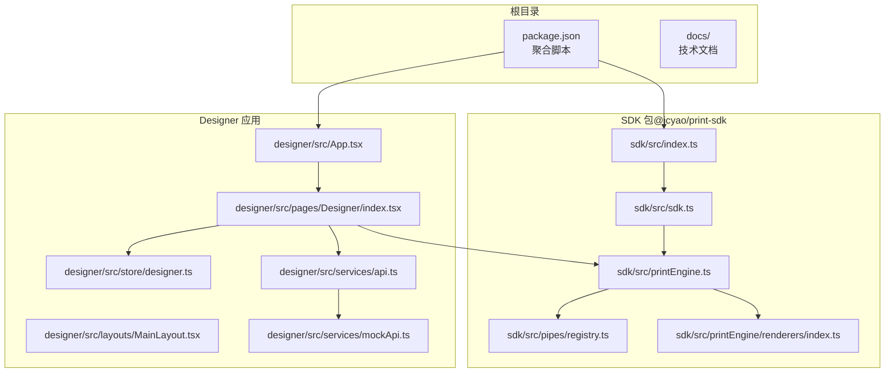
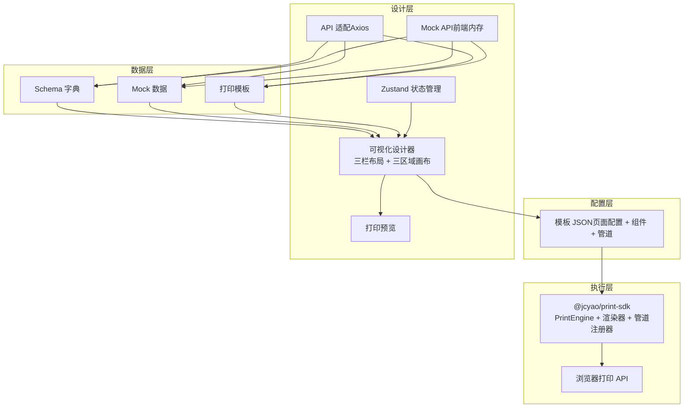
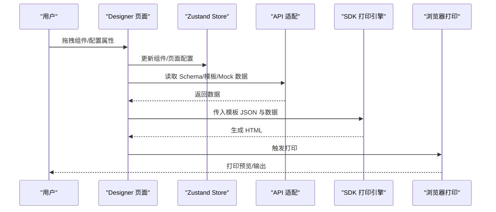
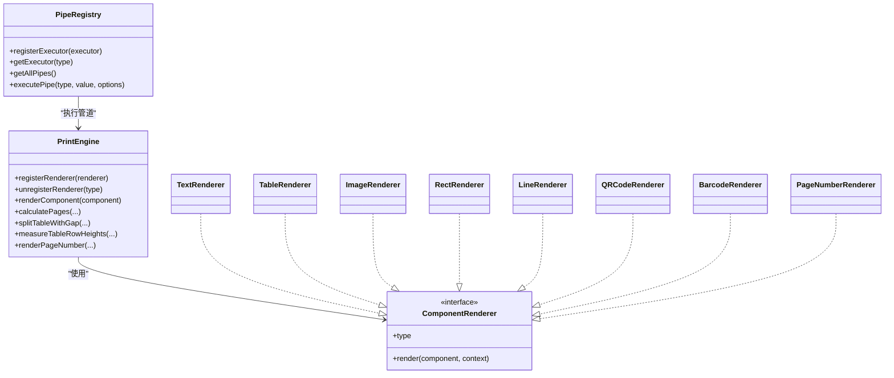
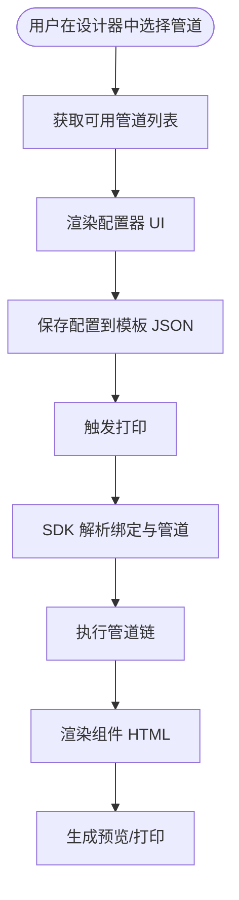
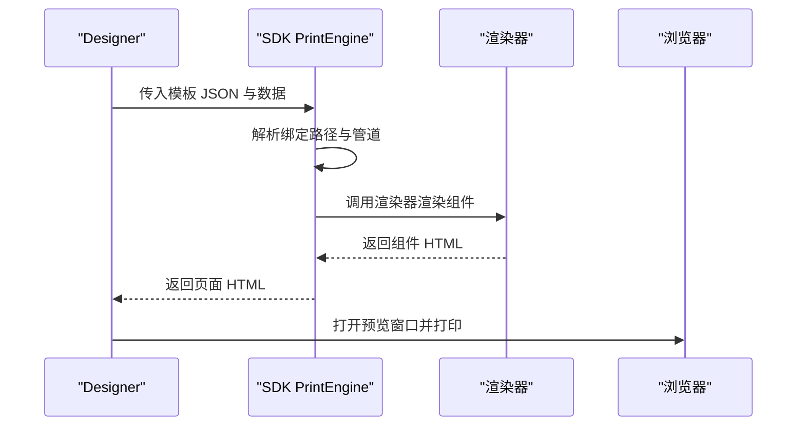
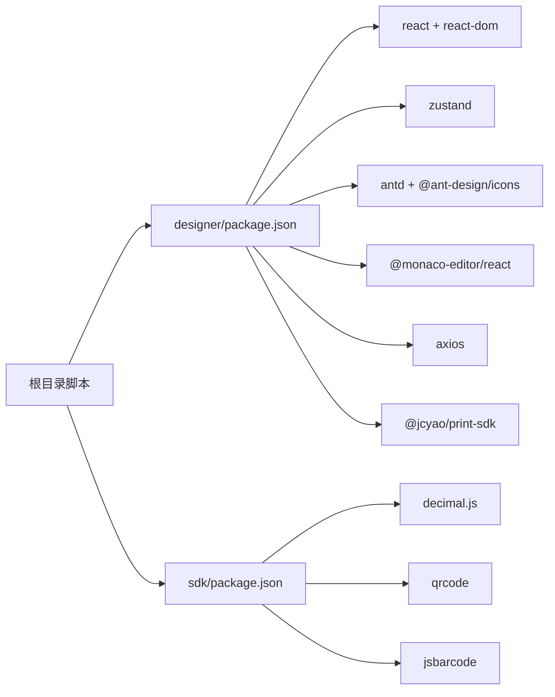

# 整体架构设计

<cite>
**本文引用的文件**
- [README.md](file://README.md)
- [package.json](file://package.json)
- [designer/package.json](file://designer/package.json)
- [sdk/package.json](file://sdk/package.json)
- [designer/src/App.tsx](file://designer/src/App.tsx)
- [designer/src/pages/Designer/index.tsx](file://designer/src/pages/Designer/index.tsx)
- [designer/src/store/designer.ts](file://designer/src/store/designer.ts)
- [designer/src/services/api.ts](file://designer/src/services/api.ts)
- [designer/src/services/mockApi.ts](file://designer/src/services/mockApi.ts)
- [designer/src/layouts/MainLayout.tsx](file://designer/src/layouts/MainLayout.tsx)
- [sdk/src/index.ts](file://sdk/src/index.ts)
- [sdk/src/sdk.ts](file://sdk/src/sdk.ts)
- [sdk/src/printEngine.ts](file://sdk/src/printEngine.ts)
- [sdk/src/printEngine/renderers/index.ts](file://sdk/src/printEngine/renderers/index.ts)
- [sdk/src/pipes/registry.ts](file://sdk/src/pipes/registry.ts)
- [docs/技术架构文档(仅参考).md](file://docs/技术架构文档(仅参考).md)
</cite>

## 目录
1. [简介](#简介)
2. [项目结构](#项目结构)
3. [核心组件](#核心组件)
4. [架构总览](#架构总览)
5. [详细组件分析](#详细组件分析)
6. [依赖分析](#依赖分析)
7. [性能考量](#性能考量)
8. [故障排查指南](#故障排查指南)
9. [结论](#结论)
10. [附录](#附录)

## 简介
本项目是一个面向浏览器的通用打印服务平台，采用“设计态配置化、运行态轻量化”的整体架构。系统分为四大核心层次：数据层、配置层、设计层、执行层；并通过 SDK 与 Designer 模块分离，实现逻辑与 UI 的彻底解耦。技术栈涵盖 React/Vite、TypeScript、Zustand、Ant Design、Monaco Editor 等，核心能力包括可视化模板设计器、插件化管道系统、高精度打印引擎与渲染器插件化。

## 项目结构
项目采用多包（monorepo）组织方式，主要目录与职责如下：
- sdk：独立打印 SDK 包，提供无 UI 依赖的打印引擎、渲染器、管道系统与类型定义，支持浏览器直接打印与批量打印。
- designer：React 可视化设计器，提供三栏布局（数据资产树、画布编辑器、属性面板）、三区域画布（页头/内容/页脚）、模板管理、Mock 数据管理、打印预览等功能。
- docs：技术文档与需求文档，包含架构设计与演进说明。
- 根目录：聚合脚本与顶层依赖管理，统一启动与构建命令。

**图表来源**
- [package.json:1-10](file://package.json#L1-L10)
- [designer/src/App.tsx:1-31](file://designer/src/App.tsx#L1-L31)
- [designer/src/pages/Designer/index.tsx:1-365](file://designer/src/pages/Designer/index.tsx#L1-L365)
- [designer/src/store/designer.ts:1-773](file://designer/src/store/designer.ts#L1-L773)
- [designer/src/services/api.ts:1-134](file://designer/src/services/api.ts#L1-L134)
- [designer/src/services/mockApi.ts:1-103](file://designer/src/services/mockApi.ts#L1-L103)
- [sdk/src/index.ts:1-22](file://sdk/src/index.ts#L1-L22)
- [sdk/src/sdk.ts:1-66](file://sdk/src/sdk.ts#L1-L66)
- [sdk/src/printEngine.ts:1-800](file://sdk/src/printEngine.ts#L1-L800)
- [sdk/src/printEngine/renderers/index.ts:1-13](file://sdk/src/printEngine/renderers/index.ts#L1-L13)
- [sdk/src/pipes/registry.ts:1-65](file://sdk/src/pipes/registry.ts#L1-L65)

**章节来源**
- [README.md:369-406](file://README.md#L369-L406)
- [package.json:1-10](file://package.json#L1-L10)

## 核心组件
- SDK 层（执行层）：提供 PrintEngine、渲染器插件集合、管道注册器、HTML 模板生成工具与类型定义，支持独立使用与浏览器打印。
- Designer 层（设计层）：提供可视化设计器、状态管理（Zustand）、API 适配（Axios）、Mock API（前端内存）、打印预览与模板管理。
- 配置层（Configuration）：由设计器生成的模板 JSON，描述页面配置、组件列表、数据绑定与管道配置。
- 数据层（Data）：Schema 字典、Mock 数据与模板实体，支持列表、查询、创建、更新、删除等 CRUD 操作。

**章节来源**
- [sdk/src/sdk.ts:1-66](file://sdk/src/sdk.ts#L1-L66)
- [sdk/src/printEngine.ts:1-800](file://sdk/src/printEngine.ts#L1-L800)
- [sdk/src/pipes/registry.ts:1-65](file://sdk/src/pipes/registry.ts#L1-L65)
- [designer/src/services/api.ts:1-134](file://designer/src/services/api.ts#L1-L134)
- [designer/src/services/mockApi.ts:1-103](file://designer/src/services/mockApi.ts#L1-L103)

## 架构总览
系统采用“模块分离 + 分层架构 + 插件化”的设计原则：
- 分离原则：SDK 无 UI 依赖，Designer 从 SDK 导入功能；管道执行器在 SDK，配置器在 Designer。
- 分层原则：数据层（Schema/Mock/Template）、配置层（模板 JSON）、设计层（设计器 UI）、执行层（SDK 打印引擎）。
- 插件化：渲染器与管道均采用注册器模式，便于扩展与维护。

**图表来源**
- [docs/技术架构文档(仅参考).md](file://docs/技术架构文档(仅参考).md#L21-L76)
- [designer/src/services/api.ts:1-134](file://designer/src/services/api.ts#L1-L134)
- [designer/src/services/mockApi.ts:1-103](file://designer/src/services/mockApi.ts#L1-L103)
- [sdk/src/sdk.ts:1-66](file://sdk/src/sdk.ts#L1-L66)

**章节来源**
- [docs/技术架构文档(仅参考).md](file://docs/技术架构文档(仅参考).md#L21-L76)

## 详细组件分析

### 设计器（Designer）组件
- 路由与布局：使用 React Router 管理路由，主布局提供侧边菜单导航，模板管理、Schema 管理、Mock 数据管理页面共享同一布局。
- 画布与面板：三栏布局（资产面板、画布、属性面板），支持组件树、对齐与分布工具、层级管理、撤销/重做、网格与缩放。
- 状态管理：Zustand Store 统一管理组件列表（含页头/页脚）、页面配置、选中状态、历史快照、复制粘贴、对齐与分布等。
- 打印预览：通过调用 SDK 生成 HTML 并在预览窗口中展示，支持页码、页头/页脚、连续纸等配置。
- API 适配：根据环境变量决定使用真实后端 API 或前端 Mock API，统一接口与错误结构。

**图表来源**
- [designer/src/pages/Designer/index.tsx:1-365](file://designer/src/pages/Designer/index.tsx#L1-L365)
- [designer/src/store/designer.ts:1-773](file://designer/src/store/designer.ts#L1-L773)
- [designer/src/services/api.ts:1-134](file://designer/src/services/api.ts#L1-L134)
- [sdk/src/sdk.ts:1-66](file://sdk/src/sdk.ts#L1-L66)

**章节来源**
- [designer/src/App.tsx:1-31](file://designer/src/App.tsx#L1-L31)
- [designer/src/layouts/MainLayout.tsx:1-56](file://designer/src/layouts/MainLayout.tsx#L1-L56)
- [designer/src/pages/Designer/index.tsx:1-365](file://designer/src/pages/Designer/index.tsx#L1-L365)
- [designer/src/store/designer.ts:1-773](file://designer/src/store/designer.ts#L1-L773)
- [designer/src/services/api.ts:1-134](file://designer/src/services/api.ts#L1-L134)
- [designer/src/services/mockApi.ts:1-103](file://designer/src/services/mockApi.ts#L1-L103)

### 打印引擎（SDK）组件
- PrintEngine：负责模板与数据绑定、管道链执行、虚拟分页计算、页头/页脚注入、页码渲染、表格跨页拆分与高度测量。
- 渲染器插件：Text/Table/Image/Rect/Line/QRCode/Barcode/PageNumber 等，统一通过注册表管理，支持扩展。
- 管道系统：注册器模式管理执行器，支持日期、货币、金额、中文数字、大小写、截取、默认值等内置管道。
- HTML 模板生成：生成打印样式与页面 HTML，支持批量打印合并与分页符。

**图表来源**
- [sdk/src/printEngine.ts:1-800](file://sdk/src/printEngine.ts#L1-L800)
- [sdk/src/printEngine/renderers/index.ts:1-13](file://sdk/src/printEngine/renderers/index.ts#L1-L13)
- [sdk/src/pipes/registry.ts:1-65](file://sdk/src/pipes/registry.ts#L1-L65)

**章节来源**
- [sdk/src/sdk.ts:1-66](file://sdk/src/sdk.ts#L1-L66)
- [sdk/src/printEngine.ts:1-800](file://sdk/src/printEngine.ts#L1-L800)
- [sdk/src/printEngine/renderers/index.ts:1-13](file://sdk/src/printEngine/renderers/index.ts#L1-L13)
- [sdk/src/pipes/registry.ts:1-65](file://sdk/src/pipes/registry.ts#L1-L65)

### 管道系统（插件化）
- 执行器（SDK 层）：实现具体格式化逻辑，注册到全局注册表。
- 配置器（Designer 层）：提供 UI 配置界面，将配置写入模板 JSON。
- 使用流程：Designer 从 SDK 导入可用管道列表，用户在 UI 中选择并配置，模板中保存配置，打印时由 SDK 执行器处理。

**图表来源**
- [docs/技术架构文档(仅参考).md](file://docs/技术架构文档(仅参考).md#L100-L176)
- [sdk/src/pipes/registry.ts:1-65](file://sdk/src/pipes/registry.ts#L1-L65)

**章节来源**
- [docs/技术架构文档(仅参考).md](file://docs/技术架构文档(仅参考).md#L100-L176)
- [sdk/src/pipes/registry.ts:1-65](file://sdk/src/pipes/registry.ts#L1-L65)

### 数据绑定与渲染流程
- 路径解析：支持点号路径（如 a.b.c）安全取值，自动兼容 root 前缀。
- 管道链：按顺序执行多个管道，支持选项配置。
- 渲染：根据组件类型调用对应渲染器，注入页头/页脚样式与内容，生成最终 HTML。

**图表来源**
- [sdk/src/printEngine.ts:74-125](file://sdk/src/printEngine.ts#L74-L125)

**章节来源**
- [sdk/src/printEngine.ts:74-125](file://sdk/src/printEngine.ts#L74-L125)

## 依赖分析
- 顶层脚本：统一启动与构建命令，分别进入 designer 与 sdk 子工程。
- 设计器依赖：React、Zustand、Ant Design、Monaco Editor、Axios、二维码/条形码等。
- SDK 依赖：decimal.js、qrcode、jsbarcode，用于高精度计算与同步渲染。
- 模块间依赖：Designer 通过 npm 包依赖 @jcyao/print-sdk，导入 PrintEngine、渲染器与管道。

**图表来源**
- [package.json:1-10](file://package.json#L1-L10)
- [designer/package.json:1-46](file://designer/package.json#L1-L46)
- [sdk/package.json:1-61](file://sdk/package.json#L1-L61)

**章节来源**
- [package.json:1-10](file://package.json#L1-L10)
- [designer/package.json:1-46](file://designer/package.json#L1-L46)
- [sdk/package.json:1-61](file://sdk/package.json#L1-L61)

## 性能考量
- 渲染后测量：表格真实渲染到隐藏 DOM，测量每行实际高度，避免估算误差导致的分页截断。
- 同步渲染：二维码/条形码采用同步生成 base64，消除 CDN 加载与异步等待，显著降低打印延迟。
- 相对间距模型：统一按相对间距处理，支持组件重叠与紧凑布局，简化分页与定位逻辑。
- 虚拟分页：按 yMm 排序与 gap 累加，表格跨页拆分，避免复杂分组逻辑。
- 资源加载：SDK 通过资源加载工具等待图片与打印资源准备，确保打印质量。

**章节来源**
- [docs/技术架构文档(仅参考).md](file://docs/技术架构文档(仅参考).md#L510-L554)
- [docs/技术架构文档(仅参考).md](file://docs/技术架构文档(仅参考).md#L633-L800)
- [sdk/src/printEngine.ts:622-756](file://sdk/src/printEngine.ts#L622-L756)
- [sdk/src/index.ts:17-22](file://sdk/src/index.ts#L17-L22)

## 故障排查指南
- Mock 模式切换：通过环境变量控制是否启用前端 Mock API，便于离线开发与演示。
- 错误结构：Mock API 抛出与真实 HTTP 一致的错误结构，便于统一处理。
- 网络与依赖：若二维码/条形码渲染异常，检查 SDK 依赖是否正确安装与打包。
- 打印预览：若预览空白或内容缺失，检查模板 JSON 的绑定路径、管道配置与页面尺寸。

**章节来源**
- [designer/src/services/api.ts:10-21](file://designer/src/services/api.ts#L10-L21)
- [designer/src/services/mockApi.ts:9-14](file://designer/src/services/mockApi.ts#L9-L14)
- [sdk/package.json:49-53](file://sdk/package.json#L49-L53)

## 结论
本项目通过“模块分离 + 分层架构 + 插件化”的设计，实现了设计器与打印引擎的彻底解耦，既保证了设计器的交互体验，又确保了 SDK 的可移植性与可扩展性。相对间距模型、渲染后测量与同步渲染等关键技术提升了打印精度与用户体验。未来可在分页符组件、孤行控制、模板版本管理、模板分享与导入导出等方面持续演进。

## 附录
- 版本与功能概览：参见项目 README 的版本说明与功能清单。
- 项目结构与模块职责：参见 README 的项目结构与模块说明。
- 未来规划：参见 README 的未来规划与待实现功能。

**章节来源**
- [README.md:409-547](file://README.md#L409-L547)