# 架构设计文档

<cite>
**本文档引用的文件**
- [README.md](file://README.md)
- [package.json](file://package.json)
- [designer/package.json](file://designer/package.json)
- [sdk/package.json](file://sdk/package.json)
- [designer/src/App.tsx](file://designer/src/App.tsx)
- [designer/src/pages/Designer/index.tsx](file://designer/src/pages/Designer/index.tsx)
- [designer/src/services/api.ts](file://designer/src/services/api.ts)
- [designer/src/store/designer.ts](file://designer/src/store/designer.ts)
- [sdk/src/index.ts](file://sdk/src/index.ts)
- [sdk/src/PrintSDK.ts](file://sdk/src/PrintSDK.ts)
- [sdk/src/printEngine.ts](file://sdk/src/printEngine.ts)
- [sdk/src/pipes/registry.ts](file://sdk/src/pipes/registry.ts)
- [sdk/src/printEngine/renderers/index.ts](file://sdk/src/printEngine/renderers/index.ts)
- [sdk/src/printEngine/renderers/TableRenderer.ts](file://sdk/src/printEngine/renderers/TableRenderer.ts)
</cite>

## 目录
1. [简介](#简介)
2. [项目结构](#项目结构)
3. [核心组件](#核心组件)
4. [架构概览](#架构概览)
5. [详细组件分析](#详细组件分析)
6. [依赖分析](#依赖分析)
7. [性能考虑](#性能考虑)
8. [故障排除指南](#故障排除指南)
9. [结论](#结论)
10. [附录](#附录)

## 简介

打印服务平台是一个基于浏览器的客户端打印解决方案，提供可视化模板设计器和独立的打印SDK。该平台采用模块化架构设计，支持多种组件类型的打印模板，并具备强大的数据绑定和管道转换能力。

### 系统目标
- 提供直观的可视化模板设计器
- 支持多种组件类型的打印模板
- 实现高精度的打印分页和布局
- 提供灵活的管道系统进行数据转换
- 支持批量打印和多模板打印

### 技术愿景
- 完全解耦的设计，不依赖外部服务
- 数据驱动的模板系统
- 无状态的打印引擎
- 插件化的组件渲染器架构

## 项目结构

项目采用多包架构，主要包含以下核心模块：

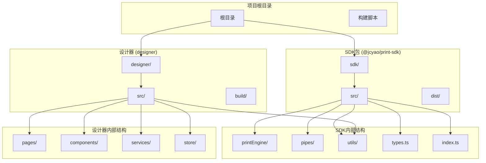

**图表来源**
- [README.md:369-406](file://README.md#L369-L406)
- [package.json:1-10](file://package.json#L1-L10)

### 模块职责划分

**SDK模块 (独立npm包)**
- 打印引擎核心实现
- 组件渲染器插件系统
- 管道转换系统
- 资源加载工具

**设计器模块 (React应用)**
- 可视化模板设计器
- 状态管理系统
- API服务层
- 用户界面组件

**图表来源**
- [sdk/src/index.ts:1-22](file://sdk/src/index.ts#L1-L22)
- [designer/src/App.tsx:1-31](file://designer/src/App.tsx#L1-L31)

**章节来源**
- [README.md:369-406](file://README.md#L369-L406)
- [package.json:1-10](file://package.json#L1-L10)

## 核心组件

### 打印SDK核心架构

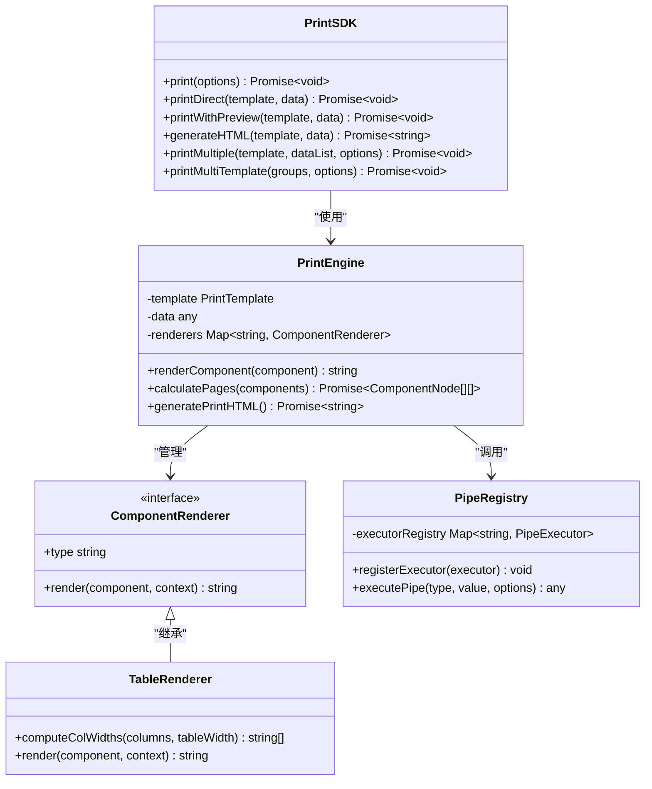

**图表来源**
- [sdk/src/PrintSDK.ts:100-477](file://sdk/src/PrintSDK.ts#L100-L477)
- [sdk/src/printEngine.ts:30-800](file://sdk/src/printEngine.ts#L30-L800)
- [sdk/src/pipes/registry.ts:1-65](file://sdk/src/pipes/registry.ts#L1-L65)
- [sdk/src/printEngine/renderers/TableRenderer.ts:147-200](file://sdk/src/printEngine/renderers/TableRenderer.ts#L147-L200)

### 设计器架构模式

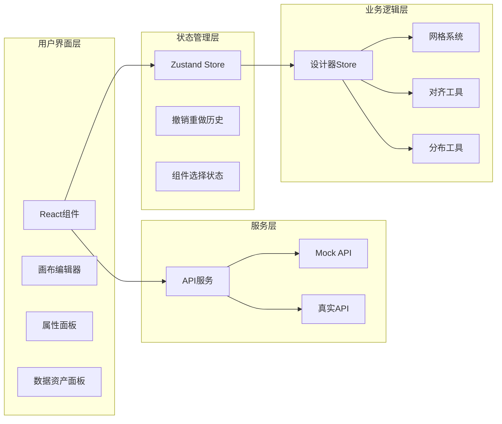

**图表来源**
- [designer/src/store/designer.ts:1-773](file://designer/src/store/designer.ts#L1-L773)
- [designer/src/services/api.ts:1-134](file://designer/src/services/api.ts#L1-L134)

**章节来源**
- [sdk/src/PrintSDK.ts:100-477](file://sdk/src/PrintSDK.ts#L100-L477)
- [sdk/src/printEngine.ts:30-800](file://sdk/src/printEngine.ts#L30-L800)
- [designer/src/store/designer.ts:1-773](file://designer/src/store/designer.ts#L1-L773)

## 架构概览

### 系统边界和集成模式

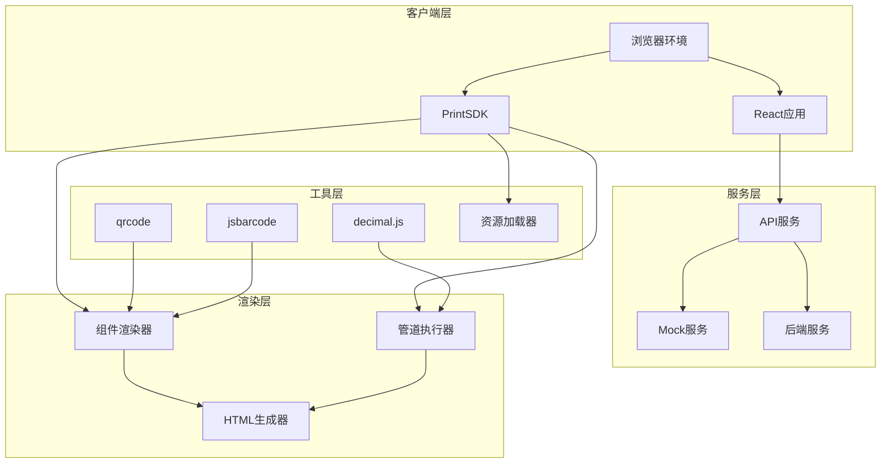

**图表来源**
- [sdk/src/PrintSDK.ts:100-477](file://sdk/src/PrintSDK.ts#L100-L477)
- [sdk/src/printEngine.ts:30-800](file://sdk/src/printEngine.ts#L30-L800)
- [designer/src/services/api.ts:1-134](file://designer/src/services/api.ts#L1-L134)

### 数据流和处理逻辑

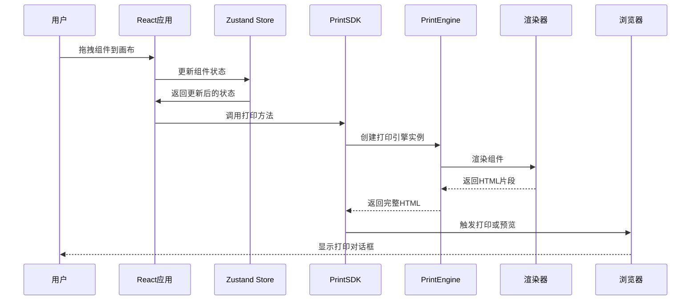

**图表来源**
- [designer/src/pages/Designer/index.tsx:17-200](file://designer/src/pages/Designer/index.tsx#L17-L200)
- [sdk/src/PrintSDK.ts:110-172](file://sdk/src/PrintSDK.ts#L110-L172)

**章节来源**
- [README.md:341-367](file://README.md#L341-L367)
- [sdk/src/PrintSDK.ts:100-477](file://sdk/src/PrintSDK.ts#L100-L477)

## 详细组件分析

### PrintSDK组件分析

PrintSDK是整个系统的核心，提供了完整的打印功能封装，采用无状态设计，完全解耦于外部服务。

#### 核心功能特性

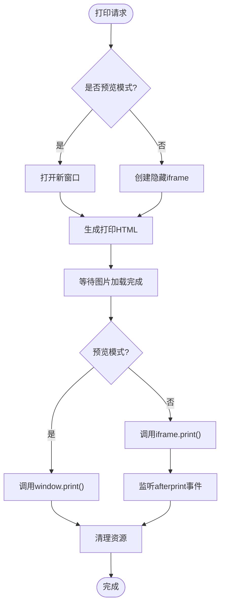

**图表来源**
- [sdk/src/PrintSDK.ts:110-172](file://sdk/src/PrintSDK.ts#L110-L172)

#### 批量打印实现

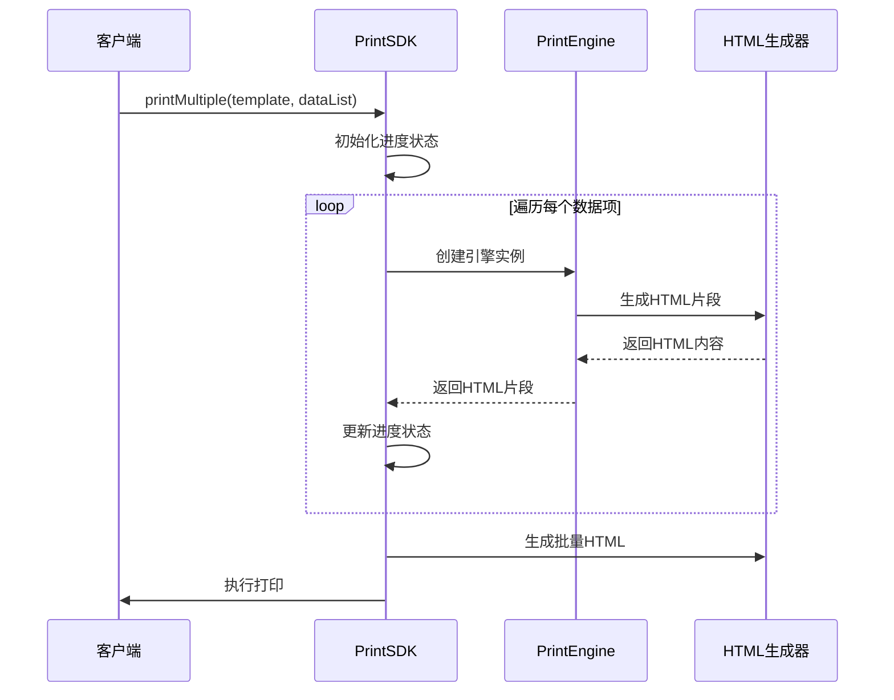

**图表来源**
- [sdk/src/PrintSDK.ts:210-322](file://sdk/src/PrintSDK.ts#L210-L322)

**章节来源**
- [sdk/src/PrintSDK.ts:100-477](file://sdk/src/PrintSDK.ts#L100-L477)

### PrintEngine组件分析

PrintEngine是打印引擎的核心，实现了插件化的组件渲染器架构，支持相对间距的虚拟分页计算。

#### 虚拟分页算法

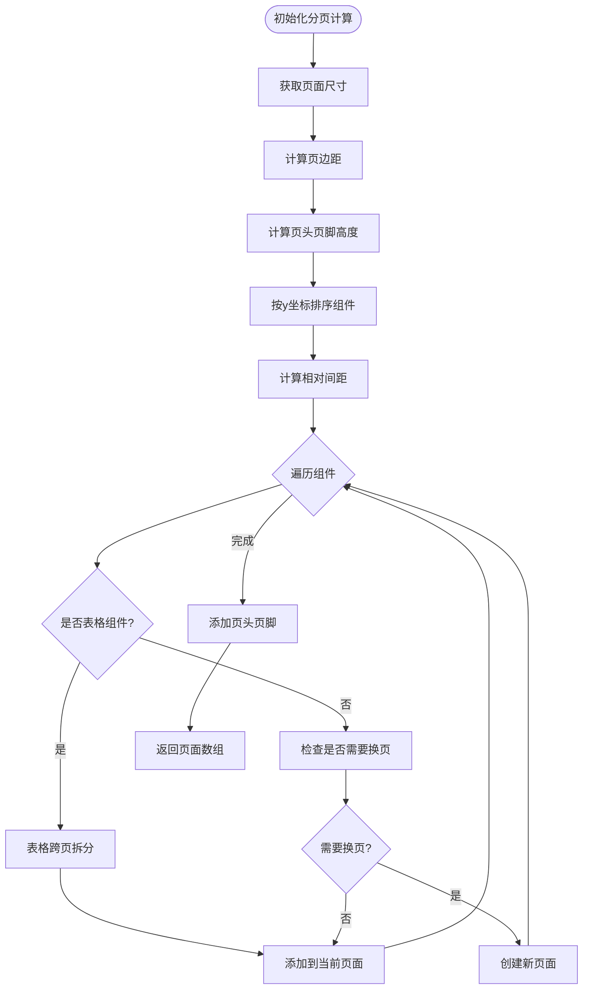

**图表来源**
- [sdk/src/printEngine.ts:418-620](file://sdk/src/printEngine.ts#L418-L620)

#### 表格渲染器分析

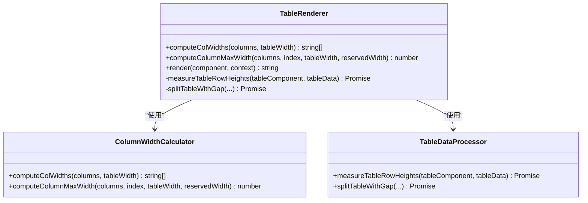

**图表来源**
- [sdk/src/printEngine/renderers/TableRenderer.ts:51-145](file://sdk/src/printEngine/renderers/TableRenderer.ts#L51-L145)

**章节来源**
- [sdk/src/printEngine.ts:30-800](file://sdk/src/printEngine.ts#L30-L800)
- [sdk/src/printEngine/renderers/TableRenderer.ts:147-200](file://sdk/src/printEngine/renderers/TableRenderer.ts#L147-L200)

### 管道系统分析

管道系统采用注册器模式，支持8种内置管道执行器，提供灵活的数据转换能力。

#### 管道执行流程

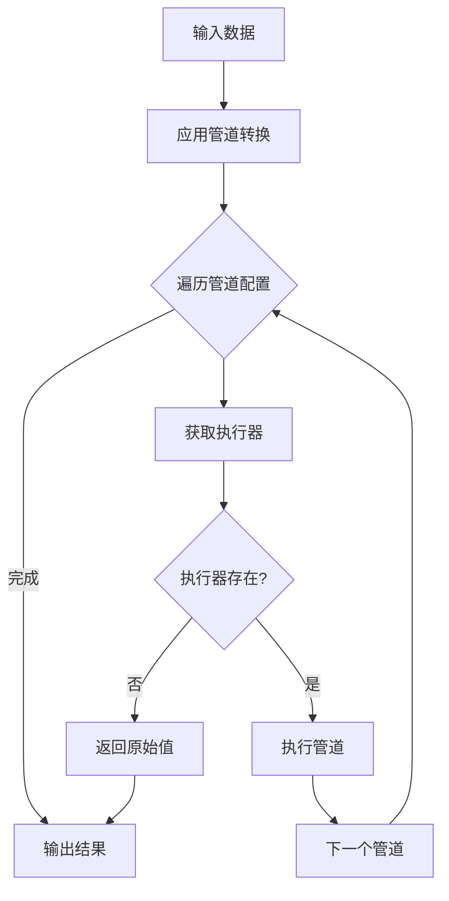

**图表来源**
- [sdk/src/printEngine.ts:109-125](file://sdk/src/printEngine.ts#L109-L125)
- [sdk/src/pipes/registry.ts:45-52](file://sdk/src/pipes/registry.ts#L45-L52)

#### 管道执行器注册

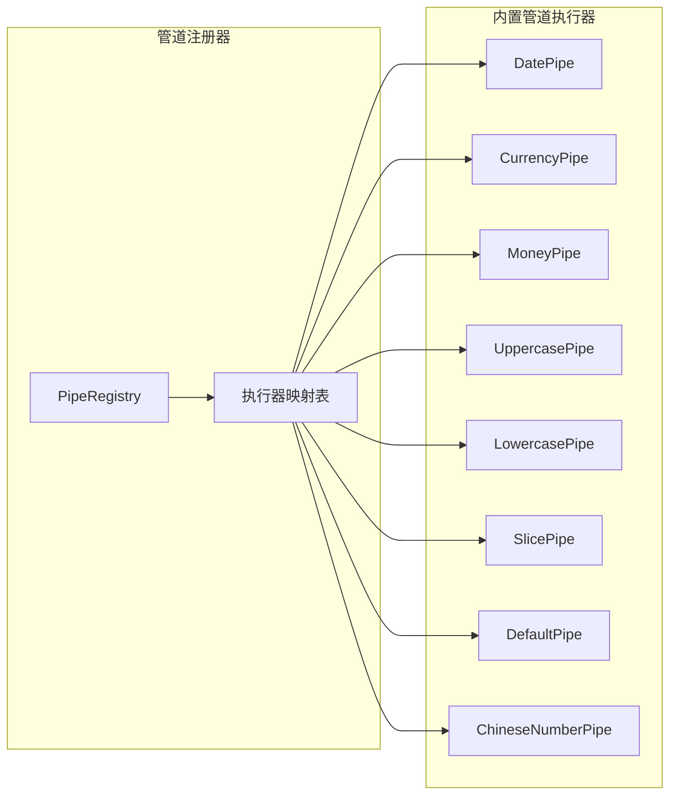

**图表来源**
- [sdk/src/pipes/registry.ts:54-65](file://sdk/src/pipes/registry.ts#L54-L65)
- [sdk/src/pipes/executors/index.ts:1-45](file://sdk/src/pipes/executors/index.ts#L1-L45)

**章节来源**
- [sdk/src/pipes/registry.ts:1-65](file://sdk/src/pipes/registry.ts#L1-L65)
- [sdk/src/printEngine.ts:109-125](file://sdk/src/printEngine.ts#L109-L125)

### 设计器组件分析

设计器采用React + Zustand的状态管理模式，提供了完整的可视化模板设计功能。

#### 状态管理架构

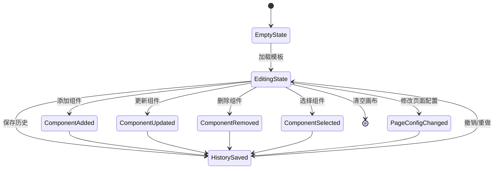

**图表来源**
- [designer/src/store/designer.ts:108-773](file://designer/src/store/designer.ts#L108-L773)

#### API服务层

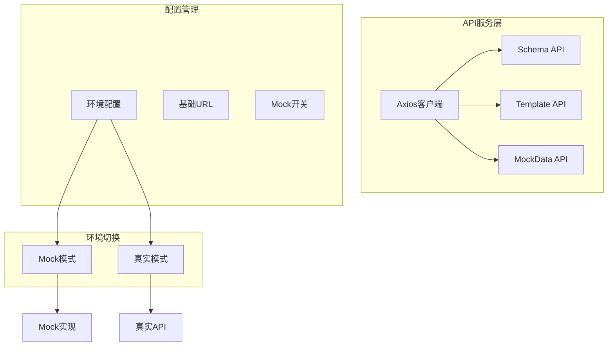

**图表来源**
- [designer/src/services/api.ts:131-134](file://designer/src/services/api.ts#L131-L134)

**章节来源**
- [designer/src/store/designer.ts:1-773](file://designer/src/store/designer.ts#L1-L773)
- [designer/src/services/api.ts:1-134](file://designer/src/services/api.ts#L1-L134)

## 依赖分析

### 技术栈和版本兼容性

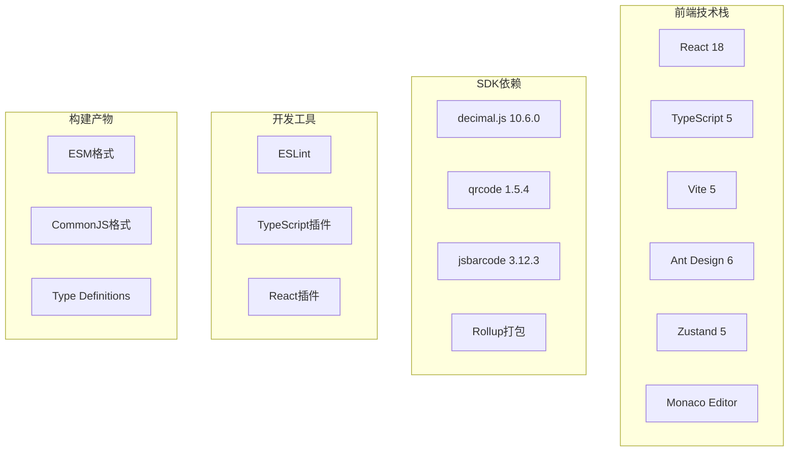

**图表来源**
- [README.md:343-359](file://README.md#L343-L359)
- [designer/package.json:13-46](file://designer/package.json#L13-L46)
- [sdk/package.json:49-61](file://sdk/package.json#L49-L61)

### 第三方依赖关系

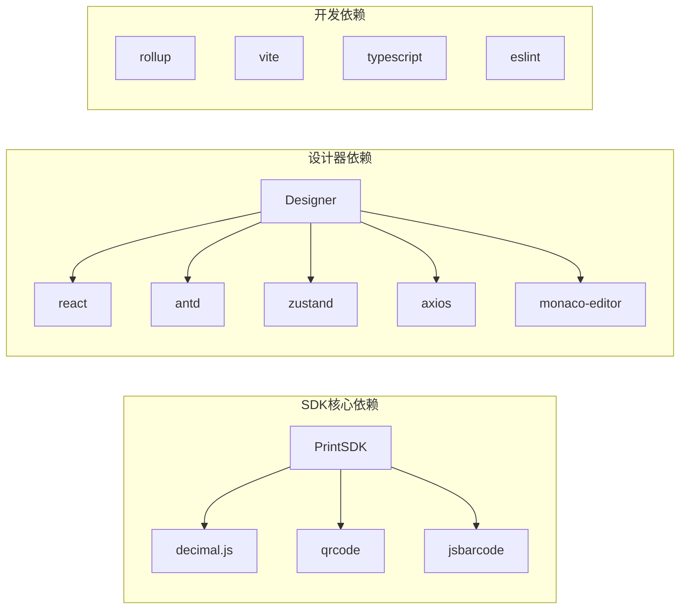

**图表来源**
- [sdk/package.json:49-61](file://sdk/package.json#L49-L61)
- [designer/package.json:13-46](file://designer/package.json#L13-L46)

**章节来源**
- [README.md:343-359](file://README.md#L343-L359)
- [sdk/package.json:1-61](file://sdk/package.json#L1-L61)
- [designer/package.json:1-46](file://designer/package.json#L1-L46)

## 性能考虑

### 打印性能优化策略

1. **异步渲染优化**
   - 使用DOMParser替代正则表达式提取HTML内容
   - 图片资源异步加载，等待加载完成后再触发打印
   - iframe生命周期管理，确保资源及时清理

2. **表格渲染优化**
   - 渲染后测量方案，准确计算表格行高
   - 跨页表格智能拆分，避免内容截断
   - 列宽计算优化，支持固定宽度和百分比混合

3. **内存管理**
   - 无状态设计，避免全局缓存
   - 组件渲染器插件化，按需加载
   - 撤销重做历史限制，最多保存20步

### 扩展性设计原则

1. **插件化架构**
   - 组件渲染器采用插件模式，易于扩展新组件类型
   - 管道执行器注册器模式，支持动态注册新管道
   - 渲染器注册表管理，支持运行时插拔

2. **数据驱动设计**
   - 模板数据驱动渲染，不依赖外部状态
   - 数据绑定系统支持嵌套路径访问
   - 管道系统支持链式转换

3. **环境适配**
   - Mock模式和真实API模式无缝切换
   - 环境变量配置，支持不同部署环境
   - 前后端分离，独立部署

## 故障排除指南

### 常见问题和解决方案

#### 打印相关问题

1. **打印内容偏移**
   - 检查CSS媒体查询配置
   - 确认页边距设置正确
   - 验证连续纸模式配置

2. **表格分页问题**
   - 确认表格数据格式正确
   - 检查表头重复配置
   - 验证列宽计算逻辑

3. **图片加载问题**
   - 确认图片资源可访问
   - 检查CORS配置
   - 验证Base64编码格式

#### 设计器相关问题

1. **组件拖拽问题**
   - 检查网格系统配置
   - 确认组件类型支持
   - 验证坐标转换逻辑

2. **状态同步问题**
   - 检查Zustand状态更新
   - 确认撤销重做历史
   - 验证组件选择状态

3. **API调用问题**
   - 检查网络连接
   - 验证API端点配置
   - 确认Mock模式设置

**章节来源**
- [sdk/src/PrintSDK.ts:110-172](file://sdk/src/PrintSDK.ts#L110-L172)
- [designer/src/store/designer.ts:508-548](file://designer/src/store/designer.ts#L508-L548)

## 结论

打印服务平台采用模块化、插件化的架构设计，成功实现了客户端打印解决方案的完整功能。系统具有以下优势：

1. **架构清晰**：模块职责明确，接口设计合理
2. **扩展性强**：插件化架构支持功能扩展
3. **用户体验好**：可视化设计器提供直观操作
4. **技术先进**：采用最新前端技术和最佳实践

未来发展方向包括：
- 大数据表格虚拟滚动优化
- 图片懒加载和预加载机制
- 打印队列管理和并发控制
- 模板版本管理和分享功能

## 附录

### 版本信息和兼容性

- **当前版本**：v1.5.0
- **生产就绪状态**：✅ 生产就绪
- **技术兼容性**：支持现代浏览器
- **Node.js版本**：>= 16.0.0

### 部署要求

1. **前端部署**
   - 静态文件托管
   - CDN加速支持
   - HTTPS配置

2. **SDK集成**
   - npm包安装
   - ES模块支持
   - 类型定义完整

3. **环境配置**
   - 环境变量配置
   - Mock模式切换
   - API基础URL设置

**章节来源**
- [README.md:520-547](file://README.md#L520-L547)