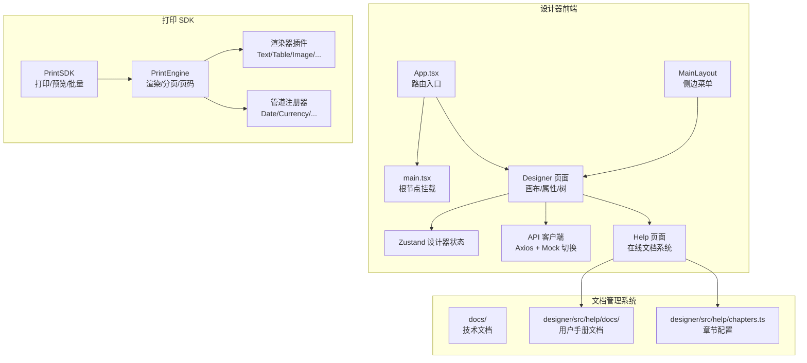
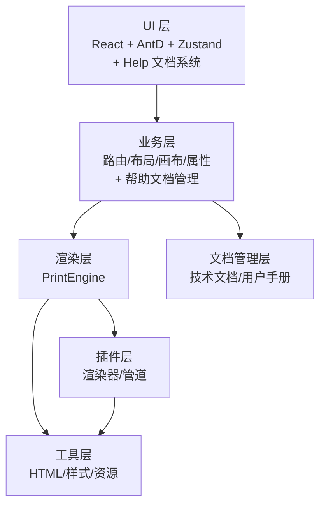
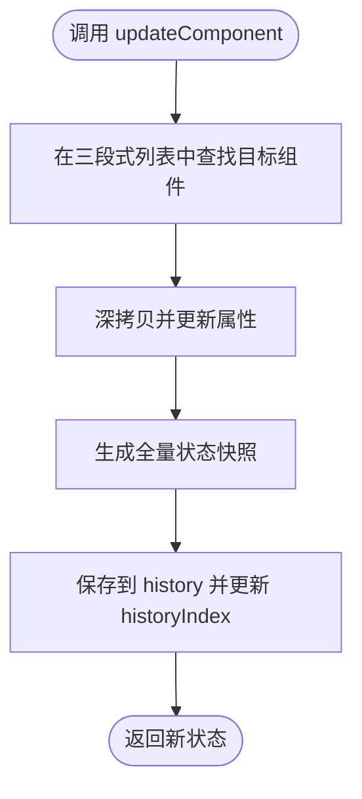
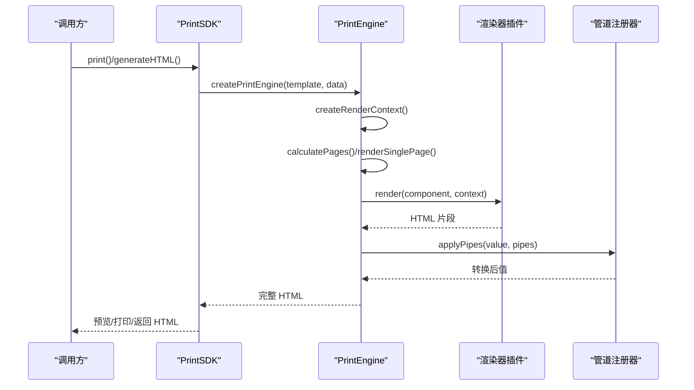
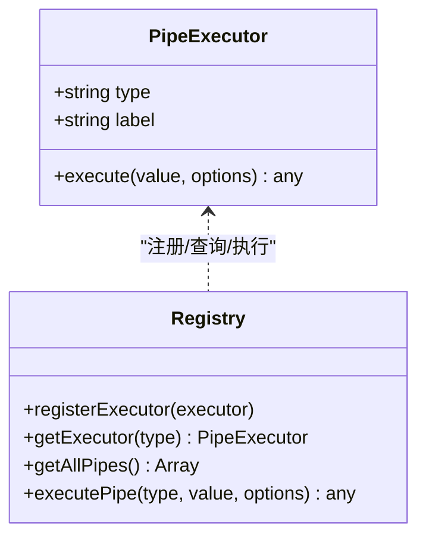
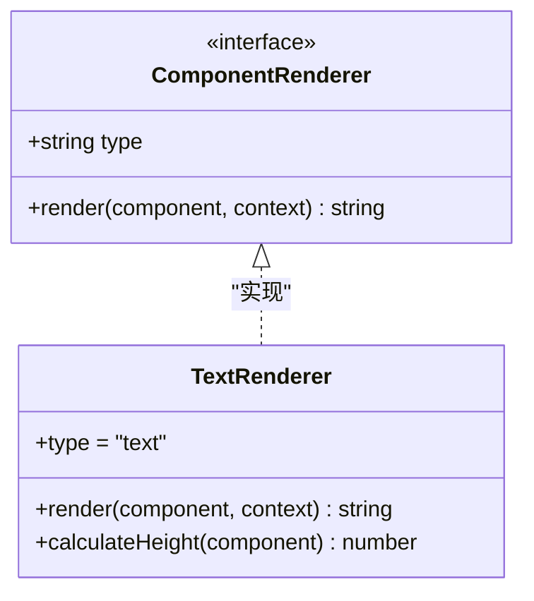
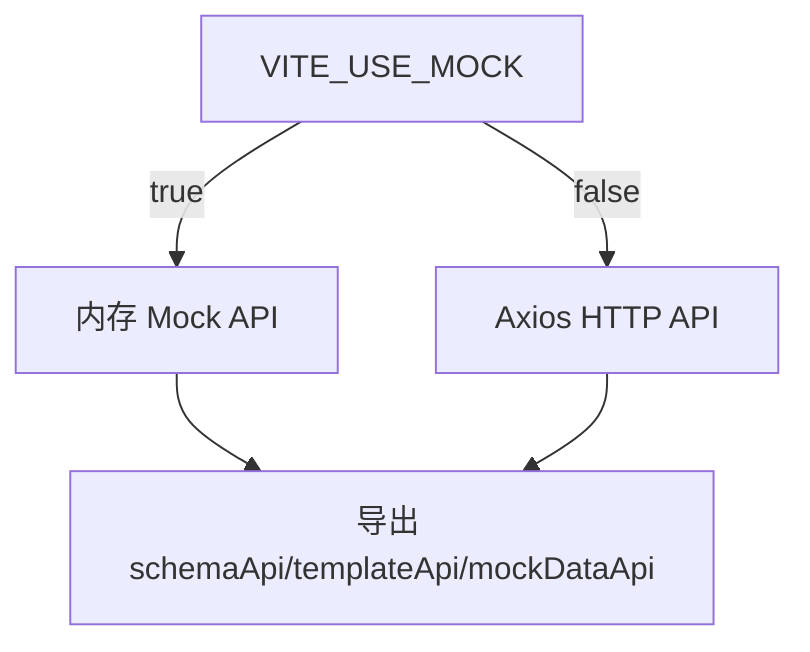
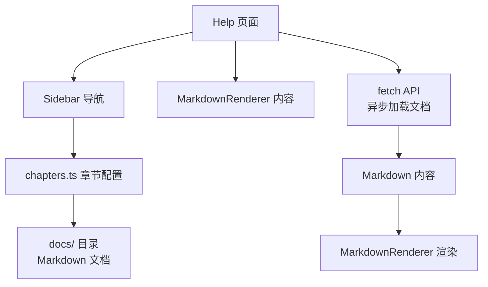
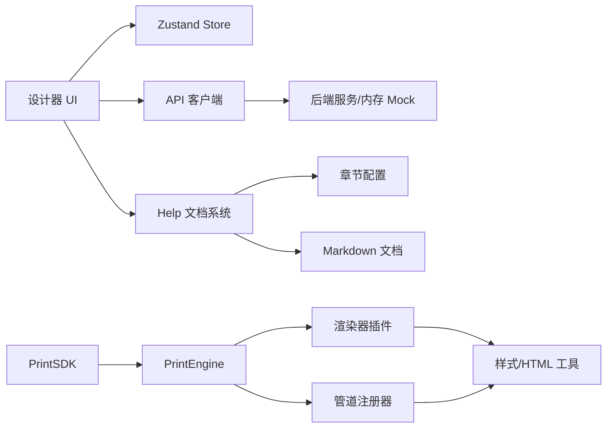

# 架构设计文档

<cite>
**本文档引用的文件**
- [designer/src/App.tsx](file://designer/src/App.tsx)
- [designer/src/main.tsx](file://designer/src/main.tsx)
- [designer/src/store/designer.ts](file://designer/src/store/designer.ts)
- [designer/src/pages/Designer/index.tsx](file://designer/src/pages/Designer/index.tsx)
- [designer/src/layouts/MainLayout.tsx](file://designer/src/layouts/MainLayout.tsx)
- [designer/src/services/api.ts](file://designer/src/services/api.ts)
- [designer/src/types/index.ts](file://designer/src/types/index.ts)
- [designer/src/pages/Help/index.tsx](file://designer/src/pages/Help/index.tsx)
- [designer/src/pages/Help/components/Sidebar.tsx](file://designer/src/pages/Help/components/Sidebar.tsx)
- [designer/src/help/chapters.ts](file://designer/src/help/chapters.ts)
- [sdk/src/printEngine.ts](file://sdk/src/printEngine.ts)
- [sdk/src/PrintSDK.ts](file://sdk/src/PrintSDK.ts)
- [sdk/src/printEngine/renderers/index.ts](file://sdk/src/printEngine/renderers/index.ts)
- [sdk/src/printEngine/renderers/TextRenderer.ts](file://sdk/src/printEngine/renderers/TextRenderer.ts)
- [sdk/src/pipes/registry.ts](file://sdk/src/pipes/registry.ts)
- [sdk/src/pipes/executors/ChineseNumberPipe.ts](file://sdk/src/pipes/executors/ChineseNumberPipe.ts)
- [package.json](file://package.json)
</cite>

## 更新摘要
**所做更改**
- 新增文档管理系统章节，详细说明帮助文档的组织结构和管理方式
- 更新项目结构图，反映新的文档目录结构
- 新增帮助文档系统的技术架构说明
- 更新系统边界和模块划分，包含文档管理功能

## 目录
1. [简介](#简介)
2. [项目结构](#项目结构)
3. [核心组件](#核心组件)
4. [架构总览](#架构总览)
5. [详细组件分析](#详细组件分析)
6. [文档管理系统](#文档管理系统)
7. [依赖关系分析](#依赖关系分析)
8. [性能考虑](#性能考虑)
9. [故障排查指南](#故障排查指南)
10. [结论](#结论)
11. [附录](#附录)

## 简介
本项目是一个"打印设计器 + 打印 SDK"的一体化解决方案，目标是通过可视化设计器设计打印模板，并由 SDK 将模板与数据渲染为可打印的 HTML，支持预览与直接打印。系统采用插件化架构（渲染器与管道执行器）、MVVM 风格的状态管理（Zustand）、分层架构（UI 层、业务层、渲染层、工具层）以及清晰的模块边界与扩展机制。**新增**：系统集成了完整的帮助文档管理系统，提供用户友好的在线文档查阅功能。

## 项目结构
项目采用多包结构，**更新**：新增文档管理系统：
- designer：React/Vite 前端设计器，负责模板设计、属性配置、画布渲染与状态管理
- sdk：打印引擎与 SDK，负责模板渲染、虚拟分页、表格跨页拆分、管道转换、页码渲染等
- docs：技术文档与问题追踪，包含架构文档和问题追踪
- **新增**：designer/src/help：帮助文档系统，提供在线用户手册和文档管理

**图表来源**
- [designer/src/App.tsx:1-31](file://designer/src/App.tsx#L1-L31)
- [designer/src/main.tsx:1-8](file://designer/src/main.tsx#L1-L8)
- [designer/src/pages/Designer/index.tsx:1-365](file://designer/src/pages/Designer/index.tsx#L1-L365)
- [designer/src/layouts/MainLayout.tsx:1-56](file://designer/src/layouts/MainLayout.tsx#L1-L56)
- [designer/src/store/designer.ts:1-773](file://designer/src/store/designer.ts#L1-L773)
- [designer/src/services/api.ts:1-134](file://designer/src/services/api.ts#L1-L134)
- [designer/src/pages/Help/index.tsx:1-81](file://designer/src/pages/Help/index.tsx#L1-L81)
- [designer/src/help/chapters.ts:1-63](file://designer/src/help/chapters.ts#L1-L63)
- [sdk/src/PrintSDK.ts:1-477](file://sdk/src/PrintSDK.ts#L1-L477)
- [sdk/src/printEngine.ts:1-1096](file://sdk/src/printEngine.ts#L1-L1096)
- [sdk/src/printEngine/renderers/index.ts:1-13](file://sdk/src/printEngine/renderers/index.ts#L1-L13)
- [sdk/src/pipes/registry.ts:1-65](file://sdk/src/pipes/registry.ts#L1-L65)

**章节来源**
- [designer/src/App.tsx:1-31](file://designer/src/App.tsx#L1-L31)
- [designer/src/main.tsx:1-8](file://designer/src/main.tsx#L1-L8)
- [designer/src/pages/Designer/index.tsx:1-365](file://designer/src/pages/Designer/index.tsx#L1-L365)
- [designer/src/layouts/MainLayout.tsx:1-56](file://designer/src/layouts/MainLayout.tsx#L1-L56)
- [designer/src/store/designer.ts:1-773](file://designer/src/store/designer.ts#L1-L773)
- [designer/src/services/api.ts:1-134](file://designer/src/services/api.ts#L1-L134)
- [designer/src/pages/Help/index.tsx:1-81](file://designer/src/pages/Help/index.tsx#L1-L81)
- [designer/src/help/chapters.ts:1-63](file://designer/src/help/chapters.ts#L1-L63)
- [sdk/src/PrintSDK.ts:1-477](file://sdk/src/PrintSDK.ts#L1-L477)
- [sdk/src/printEngine.ts:1-1096](file://sdk/src/printEngine.ts#L1-L1096)
- [sdk/src/printEngine/renderers/index.ts:1-13](file://sdk/src/printEngine/renderers/index.ts#L1-L13)
- [sdk/src/pipes/registry.ts:1-65](file://sdk/src/pipes/registry.ts#L1-L65)

## 核心组件
- 设计器前端（React + Zustand）
  - 路由与布局：App、MainLayout
  - 设计器页面：Designer（画布、资产面板、属性面板、组件树）
  - 状态管理：useDesignerStore（组件集合、选中、网格缩放、撤销重做、复制粘贴、层级管理、对齐分布）
  - API 客户端：schema/template/mock-data 的真实/内存 Mock 双模式
  - **新增**：帮助文档系统：Help 页面提供在线文档查阅功能
- 打印 SDK（插件化渲染引擎）
  - PrintSDK：打印/预览/批量/多模板打印的统一入口
  - PrintEngine：模板渲染、虚拟分页、表格跨页拆分、页码渲染、数据绑定与管道转换
  - 渲染器插件：TextRenderer、TableRenderer、ImageRenderer、RectRenderer、LineRenderer、QRCodeRenderer、BarcodeRenderer
  - 管道注册器：DatePipe、CurrencyPipe、MoneyPipe、ChineseNumberPipe 等执行器注册与执行
- **新增**：文档管理系统
  - docs 目录：技术架构文档、问题追踪文档
  - designer/src/help：用户手册文档系统，支持章节导航和在线查阅

**章节来源**
- [designer/src/pages/Designer/index.tsx:1-365](file://designer/src/pages/Designer/index.tsx#L1-L365)
- [designer/src/store/designer.ts:1-773](file://designer/src/store/designer.ts#L1-L773)
- [designer/src/services/api.ts:1-134](file://designer/src/services/api.ts#L1-L134)
- [designer/src/pages/Help/index.tsx:1-81](file://designer/src/pages/Help/index.tsx#L1-L81)
- [designer/src/help/chapters.ts:1-63](file://designer/src/help/chapters.ts#L1-L63)
- [sdk/src/PrintSDK.ts:1-477](file://sdk/src/PrintSDK.ts#L1-L477)
- [sdk/src/printEngine.ts:1-1096](file://sdk/src/printEngine.ts#L1-L1096)
- [sdk/src/printEngine/renderers/TextRenderer.ts:1-60](file://sdk/src/printEngine/renderers/TextRenderer.ts#L1-L60)
- [sdk/src/pipes/registry.ts:1-65](file://sdk/src/pipes/registry.ts#L1-L65)
- [sdk/src/pipes/executors/ChineseNumberPipe.ts:1-138](file://sdk/src/pipes/executors/ChineseNumberPipe.ts#L1-L138)

## 架构总览
系统采用"前端设计器 + 后端 SDK + 文档管理"的三层架构：
- UI 层（designer）：Ant Design + React，Zustand 管理设计器状态，Axios 封装 API 客户端，**新增**：Help 页面提供文档查阅
- 业务层（designer）：页面路由、布局、组件树、属性面板、画布交互、**新增**：帮助文档系统
- 渲染层（sdk）：PrintEngine 负责模板渲染、虚拟分页、表格跨页、页码；渲染器插件负责具体组件渲染；管道注册器负责数据转换
- 工具层（sdk）：资源加载、HTML 模板生成、样式构建、常量与类型定义
- **新增**：文档管理层：docs 目录管理技术文档，help 系统提供在线用户手册

**图表来源**
- [designer/src/pages/Designer/index.tsx:1-365](file://designer/src/pages/Designer/index.tsx#L1-L365)
- [designer/src/store/designer.ts:1-773](file://designer/src/store/designer.ts#L1-L773)
- [designer/src/pages/Help/index.tsx:1-81](file://designer/src/pages/Help/index.tsx#L1-L81)
- [sdk/src/printEngine.ts:1-1096](file://sdk/src/printEngine.ts#L1-L1096)
- [sdk/src/printEngine/renderers/index.ts:1-13](file://sdk/src/printEngine/renderers/index.ts#L1-L13)
- [sdk/src/pipes/registry.ts:1-65](file://sdk/src/pipes/registry.ts#L1-L65)

## 详细组件分析

### 设计器状态管理（Zustand MVVM）
- 状态模型
  - 组件集合：headerComponents/contentComponents/footerComponents
  - 选中与多选：selectedComponentId/selectedComponentIds
  - 模板信息：templateId/templateName/schemaId/pageConfig
  - 历史：history/historyIndex（全量快照，最多 20 步）
  - 画布操作：网格、缩放、对齐、分布、层级、复制粘贴、撤销重做
- 设计模式
  - MVVM：视图（React 组件）通过 Zustand Store 访问状态，Store 负责变更与历史管理
  - 插件化：Store 不直接耦合组件类型，通过区域感知与通用更新函数维护三段式组件树
- 关键流程
  - 组件增删改：统一通过 updateComponent，内部遍历三段式列表，返回新快照并保存历史
  - 撤销/重做：基于 history 快照，恢复 headerComponents/components/footerComponents
  - 对齐/分布：跨区域限制（垂直方向不允许跨区域），区域感知约束（content/header/footer）

**图表来源**
- [designer/src/store/designer.ts:126-136](file://designer/src/store/designer.ts#L126-L136)

**章节来源**
- [designer/src/store/designer.ts:1-773](file://designer/src/store/designer.ts#L1-L773)

### 打印引擎（插件化渲染 + 虚拟分页）
- 插件化架构
  - 渲染器：TextRenderer、TableRenderer、ImageRenderer、RectRenderer、LineRenderer、QRCodeRenderer、BarcodeRenderer
  - 管道：DatePipe、CurrencyPipe、MoneyPipe、ChineseNumberPipe 等，通过注册器集中管理
- 核心能力
  - 数据绑定：getValueByPath + applyPipes，支持嵌套路径与智能前缀跳过
  - 渲染上下文：resolveBinding/applyPipes/formatDate/mmToPx/pageInfo
  - 虚拟分页：基于相对间距的流式布局，表格跨页拆分（测量 + 估算双策略）
  - 页码：根据配置渲染固定位置页码，支持多种格式与偏移
- 关键流程
  - 生成 HTML：calculatePages -> renderSinglePage -> generatePrintHTML
  - 表格拆分：splitTableWithGap -> measureTableRowHeights（浏览器）/估算（SSR）

**图表来源**
- [sdk/src/PrintSDK.ts:110-172](file://sdk/src/PrintSDK.ts#L110-L172)
- [sdk/src/printEngine.ts:1003-1064](file://sdk/src/printEngine.ts#L1003-L1064)
- [sdk/src/printEngine/renderers/TextRenderer.ts:13-53](file://sdk/src/printEngine/renderers/TextRenderer.ts#L13-L53)
- [sdk/src/pipes/registry.ts:45-52](file://sdk/src/pipes/registry.ts#L45-L52)

**章节来源**
- [sdk/src/printEngine.ts:1-1096](file://sdk/src/printEngine.ts#L1-L1096)
- [sdk/src/printEngine/renderers/index.ts:1-13](file://sdk/src/printEngine/renderers/index.ts#L1-L13)
- [sdk/src/printEngine/renderers/TextRenderer.ts:1-60](file://sdk/src/printEngine/renderers/TextRenderer.ts#L1-L60)
- [sdk/src/pipes/registry.ts:1-65](file://sdk/src/pipes/registry.ts#L1-L65)
- [sdk/src/pipes/executors/ChineseNumberPipe.ts:1-138](file://sdk/src/pipes/executors/ChineseNumberPipe.ts#L1-L138)

### 管道系统（插件化数据转换）
- 设计要点
  - 注册器集中管理执行器，提供 executePipe(type, value, options)
  - 内置执行器：Date、Currency、Money、Uppercase、Lowercase、Slice、Default、ChineseNumber
  - 扩展方式：registerExecutor 即可接入自定义管道
- 使用场景
  - 文本组件显示前缀 label + 绑定值
  - 金额、货币、中文大写等格式化
  - 日期格式化与回退策略

**图表来源**
- [sdk/src/pipes/registry.ts:1-65](file://sdk/src/pipes/registry.ts#L1-L65)
- [sdk/src/pipes/executors/ChineseNumberPipe.ts:99-138](file://sdk/src/pipes/executors/ChineseNumberPipe.ts#L99-L138)

**章节来源**
- [sdk/src/pipes/registry.ts:1-65](file://sdk/src/pipes/registry.ts#L1-L65)
- [sdk/src/pipes/executors/ChineseNumberPipe.ts:1-138](file://sdk/src/pipes/executors/ChineseNumberPipe.ts#L1-L138)

### 渲染器系统（组件插件）
- 设计要点
  - 统一接口 ComponentRenderer：type + render(component, context)
  - TextRenderer 示例：构建定位样式 + 文本样式，支持 flex 对齐
  - 扩展方式：实现新渲染器并 registerRenderer 即可
- 与引擎协作
  - PrintEngine 根据组件 type 查找渲染器并渲染 HTML 片段
  - 页头/页脚组件统一注入 overflow: hidden，防止溢出

**图表来源**
- [sdk/src/printEngine/renderers/TextRenderer.ts:10-60](file://sdk/src/printEngine/renderers/TextRenderer.ts#L10-L60)
- [sdk/src/printEngine/renderers/index.ts:1-13](file://sdk/src/printEngine/renderers/index.ts#L1-L13)

**章节来源**
- [sdk/src/printEngine/renderers/TextRenderer.ts:1-60](file://sdk/src/printEngine/renderers/TextRenderer.ts#L1-L60)
- [sdk/src/printEngine/renderers/index.ts:1-13](file://sdk/src/printEngine/renderers/index.ts#L1-L13)

### API 客户端（真实/内存 Mock 双模式）
- 设计要点
  - 通过环境变量 VITE_USE_MOCK 切换真实 HTTP（Axios）或前端内存 Mock
  - 统一 baseURL（开发环境同源，生产可配置）
  - 暴露 schemaApi/templateApi/mockDataApi 三类 API
- 与设计器集成
  - Designer 页面通过 templateApi.loadTemplateById 加载模板
  - MainLayout 提供导航与菜单

**图表来源**
- [designer/src/services/api.ts:10-134](file://designer/src/services/api.ts#L10-L134)

**章节来源**
- [designer/src/services/api.ts:1-134](file://designer/src/services/api.ts#L1-L134)
- [designer/src/pages/Designer/index.tsx:34-46](file://designer/src/pages/Designer/index.tsx#L34-L46)
- [designer/src/layouts/MainLayout.tsx:1-56](file://designer/src/layouts/MainLayout.tsx#L1-L56)

## 文档管理系统

### 帮助文档系统架构
**新增**：系统集成了完整的在线帮助文档系统，提供用户友好的文档查阅体验。

- 系统组成
  - Help 页面：主文档展示组件，支持章节导航和内容加载
  - Sidebar：左侧章节导航菜单，基于 chpaters 配置生成
  - chapters.ts：文档章节配置，定义文档标题、ID 和文件路径
  - docs 目录：实际的 Markdown 文档文件
- 技术实现
  - 基于 React Hooks 的状态管理（useState、useEffect、useCallback）
  - 动态文档加载：通过 fetch API 异步加载 Markdown 内容
  - URL Hash 导航：支持通过 URL hash 进行章节跳转
  - 响应式加载状态：提供加载指示器和错误处理

**图表来源**
- [designer/src/pages/Help/index.tsx:1-81](file://designer/src/pages/Help/index.tsx#L1-L81)
- [designer/src/pages/Help/components/Sidebar.tsx:1-45](file://designer/src/pages/Help/components/Sidebar.tsx#L1-L45)
- [designer/src/help/chapters.ts:1-63](file://designer/src/help/chapters.ts#L1-L63)

### 文档组织结构
**新增**：文档管理系统采用层次化的组织结构：

- docs 目录（技术文档）
  - bugs/：问题追踪和 bug 管理
  - features/：功能特性和需求文档
  - 技术架构文档(仅参考).md：核心架构设计文档

- designer/src/help 目录（用户手册）
  - docs/：用户手册文档集合
  - chapters.ts：章节配置文件
  - components/：帮助文档系统组件

### 章节配置管理
**新增**：通过 chapters.ts 文件统一管理文档章节配置，支持动态添加和修改文档章节。

- 章节结构定义
  - id：章节唯一标识符
  - title：章节显示标题
  - file：Markdown 文件的 URL 路径
- 动态路径解析
  - 使用 new URL('./docs/文件名.md', import.meta.url).href
  - 支持模块打包器的动态路径解析

**章节来源**
- [designer/src/pages/Help/index.tsx:1-81](file://designer/src/pages/Help/index.tsx#L1-L81)
- [designer/src/pages/Help/components/Sidebar.tsx:1-45](file://designer/src/pages/Help/components/Sidebar.tsx#L1-L45)
- [designer/src/help/chapters.ts:1-63](file://designer/src/help/chapters.ts#L1-L63)

## 依赖关系分析
- 模块耦合
  - 设计器前端依赖 Zustand 与 AntD，API 客户端可切换，**新增**：Help 页面依赖章节配置
  - SDK 依赖渲染器与管道注册器，渲染器依赖样式构建工具
  - **新增**：文档系统依赖 React Router 进行导航管理
- 外部依赖
  - React、AntD、Axios、Zustand、Vite（构建）
  - **新增**：React Router 用于页面路由和导航
- 可能的循环依赖
  - 未发现直接循环依赖；渲染器与管道通过注册器解耦
  - **新增**：文档系统通过配置文件解耦，避免循环依赖

**图表来源**
- [designer/src/store/designer.ts:1-773](file://designer/src/store/designer.ts#L1-L773)
- [designer/src/services/api.ts:1-134](file://designer/src/services/api.ts#L1-L134)
- [designer/src/pages/Help/index.tsx:1-81](file://designer/src/pages/Help/index.tsx#L1-L81)
- [designer/src/help/chapters.ts:1-63](file://designer/src/help/chapters.ts#L1-L63)
- [sdk/src/PrintSDK.ts:1-477](file://sdk/src/PrintSDK.ts#L1-L477)
- [sdk/src/printEngine.ts:1-1096](file://sdk/src/printEngine.ts#L1-L1096)
- [sdk/src/printEngine/renderers/index.ts:1-13](file://sdk/src/printEngine/renderers/index.ts#L1-L13)
- [sdk/src/pipes/registry.ts:1-65](file://sdk/src/pipes/registry.ts#L1-L65)

**章节来源**
- [designer/src/store/designer.ts:1-773](file://designer/src/store/designer.ts#L1-L773)
- [designer/src/services/api.ts:1-134](file://designer/src/services/api.ts#L1-L134)
- [designer/src/pages/Help/index.tsx:1-81](file://designer/src/pages/Help/index.tsx#L1-L81)
- [designer/src/help/chapters.ts:1-63](file://designer/src/help/chapters.ts#L1-L63)
- [sdk/src/PrintSDK.ts:1-477](file://sdk/src/PrintSDK.ts#L1-L477)
- [sdk/src/printEngine.ts:1-1096](file://sdk/src/printEngine.ts#L1-L1096)
- [sdk/src/printEngine/renderers/index.ts:1-13](file://sdk/src/printEngine/renderers/index.ts#L1-L13)
- [sdk/src/pipes/registry.ts:1-65](file://sdk/src/pipes/registry.ts#L1-L65)

## 性能考虑
- 渲染性能
  - 虚拟分页：基于相对间距累加，避免复杂 DOM 计算；表格跨页拆分采用"测量 + 估算"双策略，降低误差
  - 页头/页脚：统一注入 overflow: hidden，减少溢出绘制开销
- 状态管理
  - 全量快照历史（最多 20 步），适合撤销重做但占用内存；可通过调整 MAX_HISTORY_STEPS 平衡
- 资源加载
  - 图片加载等待：预览/打印前等待资源加载完成，避免白屏
  - **新增**：文档异步加载：Help 页面采用异步加载机制，避免阻塞主界面渲染
- 批量打印
  - 批量/多模板打印：先生成各页面 HTML 片段，再一次性组装完整文档，减少多次打印确认
- **新增**：文档系统性能优化
  - 懒加载：文档内容按需加载，减少初始包体积
  - 缓存机制：已加载的文档内容可进行缓存，提升二次访问速度
  - 错误处理：完善的网络错误和文件不存在处理机制

## 故障排查指南
- 打印预览空白或组件缺失
  - 检查模板 JSON 生成与复制（Designer 调试抽屉）
  - 确认组件绑定路径是否存在（PrintEngine.getValueByPath 智能前缀跳过）
- 表格跨页异常
  - 观察控制台警告与防御性检查日志（rowsCanFit 异常、安全边距）
  - 确认表头/合计行高度测量结果与估算值一致性
- 页码不显示或位置不对
  - 检查 PageNumberConfig.enabled/position/format/offset
- 批量打印进度异常
  - 检查 onProgress 回调与错误捕获（失败计数与 currentIndex）
- **新增**：文档系统故障排查
  - 文档无法加载：检查 chapters.ts 中的文件路径配置是否正确
  - 章节导航失效：确认 URL hash 与章节 ID 的对应关系
  - Markdown 渲染错误：检查 Markdown 文件格式和语法
  - 网络请求失败：验证文档文件的可访问性和服务器响应

**章节来源**
- [designer/src/pages/Designer/index.tsx:317-360](file://designer/src/pages/Designer/index.tsx#L317-L360)
- [sdk/src/printEngine.ts:492-496](file://sdk/src/printEngine.ts#L492-L496)
- [sdk/src/printEngine.ts:863-872](file://sdk/src/printEngine.ts#L863-L872)
- [sdk/src/PrintSDK.ts:210-258](file://sdk/src/PrintSDK.ts#L210-L258)
- [sdk/src/PrintSDK.ts:332-394](file://sdk/src/PrintSDK.ts#L332-L394)
- [designer/src/pages/Help/index.tsx:24-43](file://designer/src/pages/Help/index.tsx#L24-L43)

## 结论
本项目通过"插件化渲染器 + 管道系统 + MVVM 状态管理 + 分层架构 + 文档管理系统"，实现了可扩展、可维护、易扩展的打印模板设计与渲染体系。**更新**：新增的帮助文档系统提供了完整的用户手册和在线文档查阅功能，提升了用户体验和技术文档的可维护性。设计器负责可视化编辑与状态管理，SDK 负责稳定的模板渲染与分页策略，文档系统提供完善的技术支持。未来可在以下方面持续演进：
- 渲染器与管道的动态注册与热插拔
- 更细粒度的性能监控与埋点
- 打印预览的离线缓存与增量更新
- 多模板混合尺寸的分页策略优化
- **新增**：文档系统的智能化推荐和搜索功能
- **新增**：文档版本管理和变更追踪功能

## 附录
- 系统边界
  - 设计器前端：负责模板设计、属性配置、画布交互、状态持久化、**新增**：帮助文档系统
  - SDK：负责模板渲染、虚拟分页、表格跨页、页码、数据绑定与管道转换
  - **新增**：文档管理层：负责技术文档的存储、管理和版本控制
- 模块划分
  - 设计器：pages/、components/、store/、services/、types/、**新增**：help/
  - SDK：printEngine/、pipes/、utils/、types/
  - **新增**：docs/：技术文档目录
- 构建与运行
  - 顶层 scripts 提供 start/build:designer/build:sdk
  - **新增**：文档系统支持静态部署和在线更新

**章节来源**
- [package.json:1-10](file://package.json#L1-L10)
- [designer/src/types/index.ts:1-378](file://designer/src/types/index.ts#L1-L378)
- [designer/src/help/chapters.ts:1-63](file://designer/src/help/chapters.ts#L1-L63)