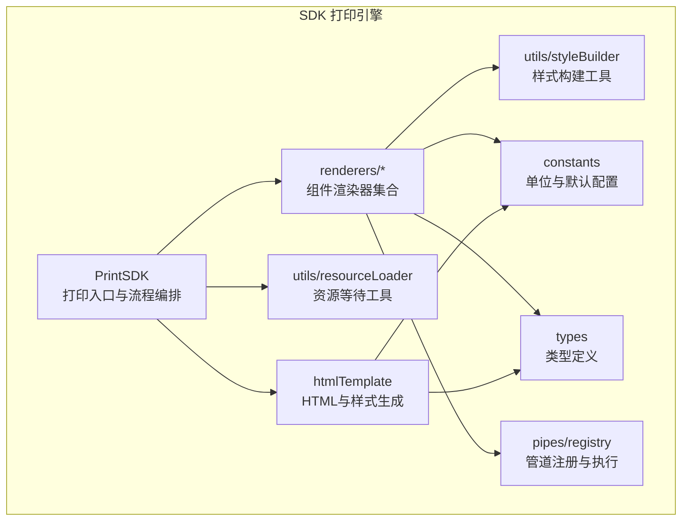
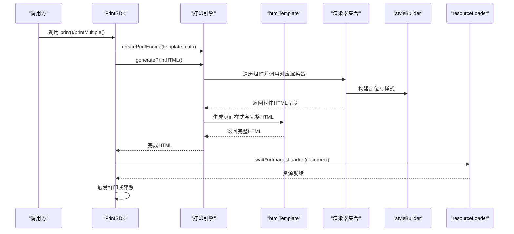
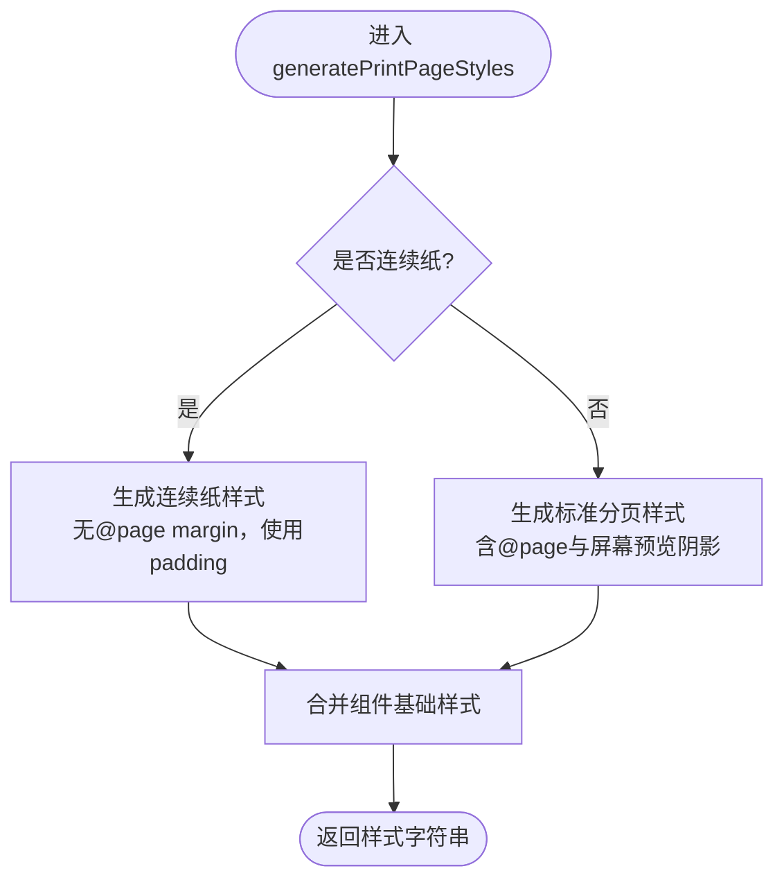
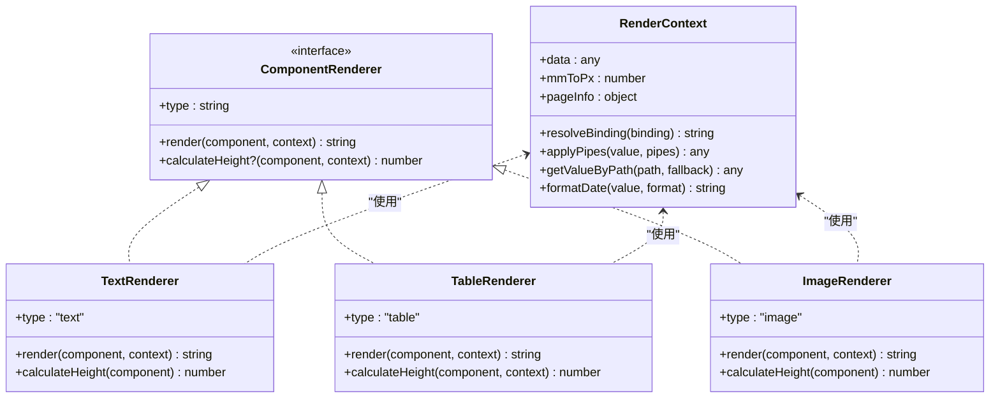
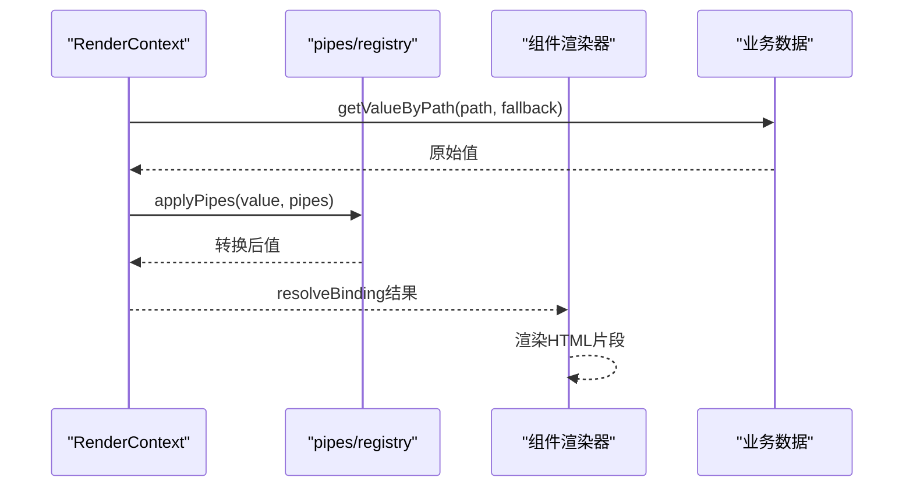
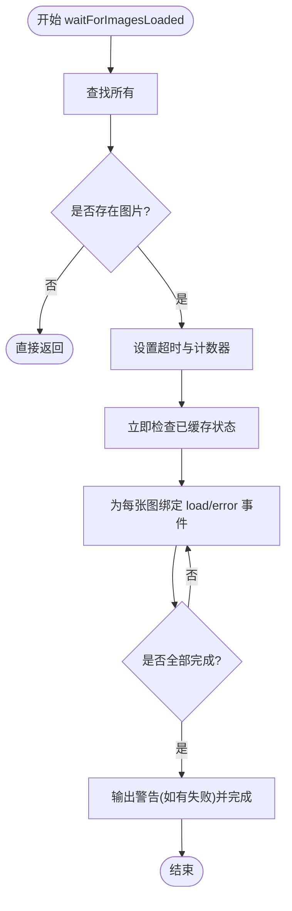
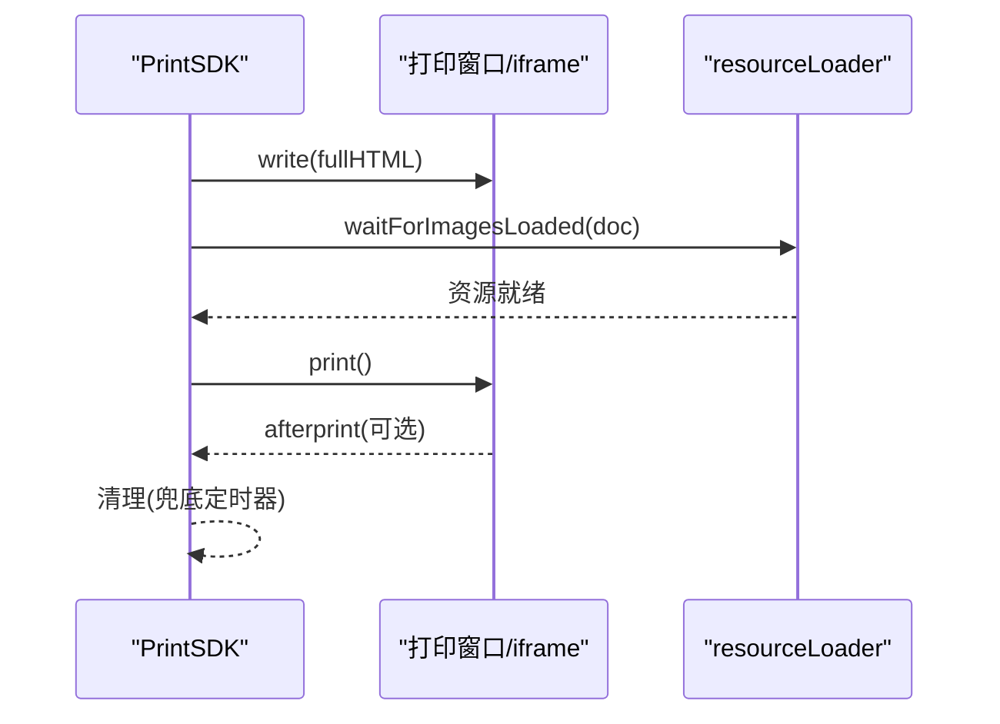
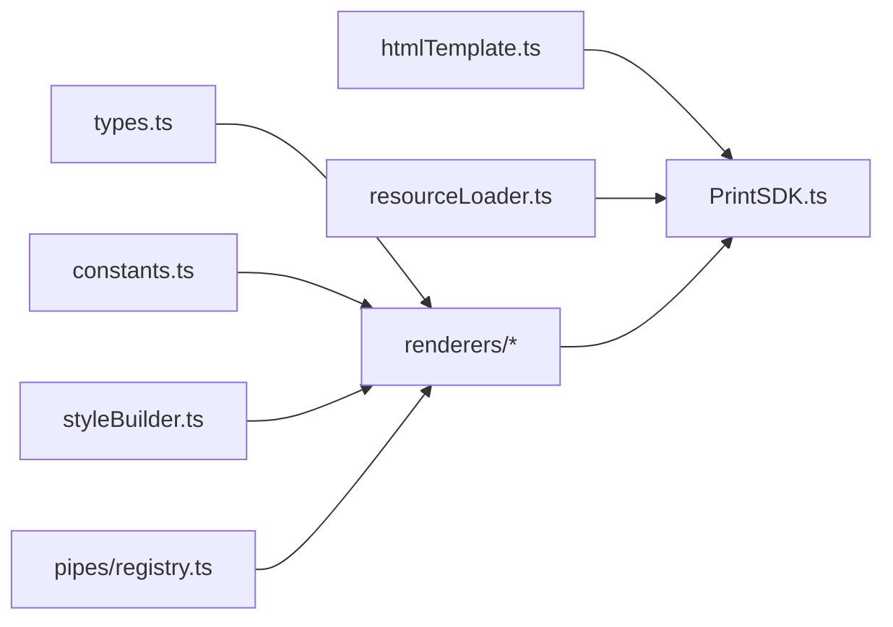

# HTML生成引擎

<cite>
**本文引用的文件**
- [sdk/src/printEngine/htmlTemplate.ts](file://sdk/src/printEngine/htmlTemplate.ts)
- [sdk/src/utils/resourceLoader.ts](file://sdk/src/utils/resourceLoader.ts)
- [sdk/src/printEngine/types.ts](file://sdk/src/printEngine/types.ts)
- [sdk/src/printEngine/constants.ts](file://sdk/src/printEngine/constants.ts)
- [sdk/src/printEngine/renderers/index.ts](file://sdk/src/printEngine/renderers/index.ts)
- [sdk/src/printEngine/renderers/TextRenderer.ts](file://sdk/src/printEngine/renderers/TextRenderer.ts)
- [sdk/src/printEngine/renderers/TableRenderer.ts](file://sdk/src/printEngine/renderers/TableRenderer.ts)
- [sdk/src/printEngine/renderers/ImageRenderer.ts](file://sdk/src/printEngine/renderers/ImageRenderer.ts)
- [sdk/src/printEngine/utils/styleBuilder.ts](file://sdk/src/printEngine/utils/styleBuilder.ts)
- [sdk/src/pipes/registry.ts](file://sdk/src/pipes/registry.ts)
- [sdk/src/PrintSDK.ts](file://sdk/src/PrintSDK.ts)
- [sdk/src/types.ts](file://sdk/src/types.ts)
- [designer/src/pages/Designer/components/Canvas/componentRenderers/TextPreview.tsx](file://designer/src/pages/Designer/components/Canvas/componentRenderers/TextPreview.tsx)
</cite>

## 目录
1. [简介](#简介)
2. [项目结构](#项目结构)
3. [核心组件](#核心组件)
4. [架构总览](#架构总览)
5. [详细组件分析](#详细组件分析)
6. [依赖关系分析](#依赖关系分析)
7. [性能考量](#性能考量)
8. [故障排查指南](#故障排查指南)
9. [结论](#结论)
10. [附录](#附录)

## 简介
本文件为HTML生成引擎的实现文档，聚焦于模板系统架构、动态内容注入机制、资源加载与管理、性能优化策略、调试与错误诊断，以及浏览器兼容与打印预览方案。目标读者既包括需要快速上手的开发者，也包括希望深入理解实现细节的技术人员。

## 项目结构
本仓库包含设计器前端与打印SDK两大部分。与HTML生成引擎直接相关的核心位于SDK目录，围绕“模板生成”“渲染器插件化”“样式与尺寸换算”“资源等待与打印控制”四个维度组织。

图表来源
- [sdk/src/PrintSDK.ts:100-172](file://sdk/src/PrintSDK.ts#L100-L172)
- [sdk/src/printEngine/htmlTemplate.ts:81-172](file://sdk/src/printEngine/htmlTemplate.ts#L81-L172)
- [sdk/src/printEngine/renderers/index.ts:1-13](file://sdk/src/printEngine/renderers/index.ts#L1-L13)
- [sdk/src/printEngine/utils/styleBuilder.ts:1-54](file://sdk/src/printEngine/utils/styleBuilder.ts#L1-L54)
- [sdk/src/utils/resourceLoader.ts:1-90](file://sdk/src/utils/resourceLoader.ts#L1-L90)
- [sdk/src/pipes/registry.ts:1-65](file://sdk/src/pipes/registry.ts#L1-L65)
- [sdk/src/printEngine/constants.ts:1-113](file://sdk/src/printEngine/constants.ts#L1-L113)
- [sdk/src/printEngine/types.ts:1-116](file://sdk/src/printEngine/types.ts#L1-L116)

章节来源
- [sdk/src/PrintSDK.ts:100-172](file://sdk/src/PrintSDK.ts#L100-L172)
- [sdk/src/printEngine/htmlTemplate.ts:1-281](file://sdk/src/printEngine/htmlTemplate.ts#L1-L281)
- [sdk/src/printEngine/renderers/index.ts:1-13](file://sdk/src/printEngine/renderers/index.ts#L1-L13)
- [sdk/src/printEngine/utils/styleBuilder.ts:1-54](file://sdk/src/printEngine/utils/styleBuilder.ts#L1-L54)
- [sdk/src/utils/resourceLoader.ts:1-90](file://sdk/src/utils/resourceLoader.ts#L1-L90)
- [sdk/src/pipes/registry.ts:1-65](file://sdk/src/pipes/registry.ts#L1-L65)
- [sdk/src/printEngine/constants.ts:1-113](file://sdk/src/printEngine/constants.ts#L1-L113)
- [sdk/src/printEngine/types.ts:1-116](file://sdk/src/printEngine/types.ts#L1-L116)

## 核心组件
- 模板生成器：负责根据页面配置生成完整的HTML文档，包含样式与主体内容。
- 渲染器插件：以接口约束的组件渲染器集合，分别处理文本、表格、图片等组件的HTML生成与高度估算。
- 样式构建器：提供统一的样式对象到CSS字符串转换与绝对定位样式构建能力。
- 资源等待器：等待页面中图片等异步资源加载完成，确保打印时机正确。
- 管道注册器：提供数据转换管道的注册与执行，支持货币、金额、日期、中文大写等。
- 常量与类型：统一单位换算、默认尺寸与样式、组件与页面配置类型。

章节来源
- [sdk/src/printEngine/htmlTemplate.ts:81-172](file://sdk/src/printEngine/htmlTemplate.ts#L81-L172)
- [sdk/src/printEngine/renderers/TextRenderer.ts:10-60](file://sdk/src/printEngine/renderers/TextRenderer.ts#L10-L60)
- [sdk/src/printEngine/renderers/TableRenderer.ts:147-327](file://sdk/src/printEngine/renderers/TableRenderer.ts#L147-L327)
- [sdk/src/printEngine/renderers/ImageRenderer.ts:10-55](file://sdk/src/printEngine/renderers/ImageRenderer.ts#L10-L55)
- [sdk/src/printEngine/utils/styleBuilder.ts:13-53](file://sdk/src/printEngine/utils/styleBuilder.ts#L13-L53)
- [sdk/src/utils/resourceLoader.ts:12-89](file://sdk/src/utils/resourceLoader.ts#L12-L89)
- [sdk/src/pipes/registry.ts:24-52](file://sdk/src/pipes/registry.ts#L24-L52)
- [sdk/src/printEngine/constants.ts:8-113](file://sdk/src/printEngine/constants.ts#L8-L113)
- [sdk/src/printEngine/types.ts:11-82](file://sdk/src/printEngine/types.ts#L11-L82)

## 架构总览
HTML生成引擎采用“模板生成 + 渲染器插件化 + 资源等待 + 管道转换”的分层架构。PrintSDK作为对外入口，负责模板组装、HTML生成、资源等待与打印调用；htmlTemplate提供页面样式与完整HTML骨架；渲染器通过统一接口将组件节点渲染为HTML字符串；styleBuilder与constants提供样式与尺寸的统一转换；resourceLoader保障图片等异步资源就绪；pipes/registry提供数据转换能力。

图表来源
- [sdk/src/PrintSDK.ts:110-172](file://sdk/src/PrintSDK.ts#L110-L172)
- [sdk/src/printEngine/htmlTemplate.ts:230-252](file://sdk/src/printEngine/htmlTemplate.ts#L230-L252)
- [sdk/src/printEngine/renderers/index.ts:5-12](file://sdk/src/printEngine/renderers/index.ts#L5-L12)
- [sdk/src/printEngine/utils/styleBuilder.ts:31-53](file://sdk/src/printEngine/utils/styleBuilder.ts#L31-L53)
- [sdk/src/utils/resourceLoader.ts:12-89](file://sdk/src/utils/resourceLoader.ts#L12-L89)

## 详细组件分析

### 模板结构与样式生成
- 页面样式生成：根据页面尺寸、页边距、连续纸等配置生成打印样式，区分预览模式与批量打印模式。
- 完整HTML生成：将样式与主体内容组合为完整的HTML文档，便于直接打印或预览。
- 页面尺寸提取：从PageConfig中提取宽度、高度与方向，支持A4/A5/CUSTOM/CONTINUOUS。

图表来源
- [sdk/src/printEngine/htmlTemplate.ts:81-172](file://sdk/src/printEngine/htmlTemplate.ts#L81-L172)

章节来源
- [sdk/src/printEngine/htmlTemplate.ts:81-172](file://sdk/src/printEngine/htmlTemplate.ts#L81-L172)
- [sdk/src/printEngine/htmlTemplate.ts:230-252](file://sdk/src/printEngine/htmlTemplate.ts#L230-L252)
- [sdk/src/printEngine/htmlTemplate.ts:257-280](file://sdk/src/printEngine/htmlTemplate.ts#L257-L280)

### 渲染器插件化架构
- 接口契约：ComponentRenderer定义type、render与可选calculateHeight，保证扩展一致性。
- 组件覆盖：文本、表格、图片、矩形、线条、二维码、条形码、页码等均有独立渲染器。
- 上下文能力：RenderContext提供数据绑定解析、管道应用、路径取值、日期格式化、mm→px换算、页面信息等。

图表来源
- [sdk/src/printEngine/types.ts:11-82](file://sdk/src/printEngine/types.ts#L11-L82)
- [sdk/src/printEngine/renderers/TextRenderer.ts:10-60](file://sdk/src/printEngine/renderers/TextRenderer.ts#L10-L60)
- [sdk/src/printEngine/renderers/TableRenderer.ts:147-327](file://sdk/src/printEngine/renderers/TableRenderer.ts#L147-L327)
- [sdk/src/printEngine/renderers/ImageRenderer.ts:10-55](file://sdk/src/printEngine/renderers/ImageRenderer.ts#L10-L55)

章节来源
- [sdk/src/printEngine/types.ts:11-82](file://sdk/src/printEngine/types.ts#L11-L82)
- [sdk/src/printEngine/renderers/TextRenderer.ts:10-60](file://sdk/src/printEngine/renderers/TextRenderer.ts#L10-L60)
- [sdk/src/printEngine/renderers/TableRenderer.ts:147-327](file://sdk/src/printEngine/renderers/TableRenderer.ts#L147-L327)
- [sdk/src/printEngine/renderers/ImageRenderer.ts:10-55](file://sdk/src/printEngine/renderers/ImageRenderer.ts#L10-L55)

### 动态内容注入机制
- 数据绑定：通过RenderContext.resolveBinding与getValueByPath从业务数据中解析值，支持管道链式转换。
- 管道系统：pipes/registry注册内置管道（日期、货币、金额、中文大写等），渲染阶段按配置执行。
- 表格数据：TableRenderer支持从绑定路径读取数组数据，按列规则渲染单元格，支持合计与额外行。

图表来源
- [sdk/src/printEngine/types.ts:14-35](file://sdk/src/printEngine/types.ts#L14-L35)
- [sdk/src/pipes/registry.ts:45-52](file://sdk/src/pipes/registry.ts#L45-L52)
- [sdk/src/printEngine/renderers/TableRenderer.ts:150-162](file://sdk/src/printEngine/renderers/TableRenderer.ts#L150-L162)

章节来源
- [sdk/src/printEngine/types.ts:14-35](file://sdk/src/printEngine/types.ts#L14-L35)
- [sdk/src/pipes/registry.ts:24-52](file://sdk/src/pipes/registry.ts#L24-L52)
- [sdk/src/printEngine/renderers/TableRenderer.ts:150-162](file://sdk/src/printEngine/renderers/TableRenderer.ts#L150-L162)

### 资源加载器工作原理
- 图片等待：遍历文档中所有元素，监听load/error事件，统计成功/失败数量，支持超时兜底。
- 资源就绪：二维码与条形码在渲染时已同步生成为base64，主要等待外部图片资源。
- 打印时机：PrintSDK在生成HTML后调用waitForImagesLoaded，确保打印前资源可用。

图表来源
- [sdk/src/utils/resourceLoader.ts:12-89](file://sdk/src/utils/resourceLoader.ts#L12-L89)

章节来源
- [sdk/src/utils/resourceLoader.ts:12-89](file://sdk/src/utils/resourceLoader.ts#L12-L89)
- [sdk/src/PrintSDK.ts:125-127](file://sdk/src/PrintSDK.ts#L125-L127)
- [sdk/src/PrintSDK.ts:146-147](file://sdk/src/PrintSDK.ts#L146-L147)

### 打印流程与预览
- 预览模式：打开新窗口写入HTML并关闭，等待资源后触发print。
- 直接打印：在隐藏iframe中写入HTML，等待资源后触发print，并监听afterprint事件清理。
- 批量打印：聚合多份HTML片段，生成统一样式后一次性打印，减少用户确认次数。
- 多模板批量：支持多模板各自绑定数据列表，统一生成并打印。

图表来源
- [sdk/src/PrintSDK.ts:286-322](file://sdk/src/PrintSDK.ts#L286-L322)
- [sdk/src/PrintSDK.ts:421-467](file://sdk/src/PrintSDK.ts#L421-L467)

章节来源
- [sdk/src/PrintSDK.ts:110-172](file://sdk/src/PrintSDK.ts#L110-L172)
- [sdk/src/PrintSDK.ts:210-322](file://sdk/src/PrintSDK.ts#L210-L322)
- [sdk/src/PrintSDK.ts:332-467](file://sdk/src/PrintSDK.ts#L332-L467)

## 依赖关系分析
- 渲染器依赖：styleBuilder提供样式构建，constants提供单位与默认值，types提供类型约束。
- 模板生成依赖：htmlTemplate依赖constants与types，生成页面样式与完整HTML。
- 打印入口依赖：PrintSDK依赖htmlTemplate、resourceLoader与渲染器集合，协调生成与打印流程。
- 管道系统：渲染器在需要时通过pipes/registry执行数据转换。

图表来源
- [sdk/src/printEngine/types.ts:1-116](file://sdk/src/printEngine/types.ts#L1-L116)
- [sdk/src/printEngine/constants.ts:1-113](file://sdk/src/printEngine/constants.ts#L1-L113)
- [sdk/src/printEngine/utils/styleBuilder.ts:1-54](file://sdk/src/printEngine/utils/styleBuilder.ts#L1-L54)
- [sdk/src/printEngine/htmlTemplate.ts:1-281](file://sdk/src/printEngine/htmlTemplate.ts#L1-L281)
- [sdk/src/PrintSDK.ts:1-477](file://sdk/src/PrintSDK.ts#L1-L477)
- [sdk/src/utils/resourceLoader.ts:1-90](file://sdk/src/utils/resourceLoader.ts#L1-L90)
- [sdk/src/pipes/registry.ts:1-65](file://sdk/src/pipes/registry.ts#L1-L65)

章节来源
- [sdk/src/printEngine/types.ts:1-116](file://sdk/src/printEngine/types.ts#L1-L116)
- [sdk/src/printEngine/constants.ts:1-113](file://sdk/src/printEngine/constants.ts#L1-L113)
- [sdk/src/printEngine/utils/styleBuilder.ts:1-54](file://sdk/src/printEngine/utils/styleBuilder.ts#L1-L54)
- [sdk/src/printEngine/htmlTemplate.ts:1-281](file://sdk/src/printEngine/htmlTemplate.ts#L1-L281)
- [sdk/src/PrintSDK.ts:1-477](file://sdk/src/PrintSDK.ts#L1-L477)
- [sdk/src/utils/resourceLoader.ts:1-90](file://sdk/src/utils/resourceLoader.ts#L1-L90)
- [sdk/src/pipes/registry.ts:1-65](file://sdk/src/pipes/registry.ts#L1-L65)

## 性能考量
- DOM操作优化
  - 预览与批量打印均通过一次性写入HTML并关闭文档，减少多次write带来的重排风险。
  - 使用绝对定位与预设尺寸，避免频繁测量布局。
- 内存使用控制
  - 打印完成后及时清理隐藏iframe，兜底定时器确保异常情况下也能回收。
  - 批量打印聚合HTML片段，减少中间DOM节点数量。
- 资源等待策略
  - 图片加载超时兜底，避免长时间阻塞；失败计数用于告警。
  - 二维码/条形码在渲染时同步生成base64，避免异步延迟。
- 样式与尺寸
  - 统一mm→px换算系数，减少重复计算。
  - 表格列宽计算采用一次性比例分配，避免逐行重算。

章节来源
- [sdk/src/PrintSDK.ts:149-171](file://sdk/src/PrintSDK.ts#L149-L171)
- [sdk/src/PrintSDK.ts:317-321](file://sdk/src/PrintSDK.ts#L317-L321)
- [sdk/src/utils/resourceLoader.ts:28-32](file://sdk/src/utils/resourceLoader.ts#L28-L32)
- [sdk/src/printEngine/constants.ts:8-8](file://sdk/src/printEngine/constants.ts#L8-L8)

## 故障排查指南
- 图片加载失败
  - 现象：控制台出现失败日志，部分图片未显示。
  - 排查：检查图片URL、CORS策略、网络状况；确认load/error事件是否触发。
  - 参考：[sdk/src/utils/resourceLoader.ts:62-66](file://sdk/src/utils/resourceLoader.ts#L62-L66)
- 表格溢出或显示异常
  - 现象：表格右侧超出页边距或宽度异常。
  - 排查：检查布局xMm与widthMm，确认是否超过右页边距；必要时降低宽度或调整x偏移。
  - 参考：[sdk/src/printEngine/renderers/TableRenderer.ts:195-208](file://sdk/src/printEngine/renderers/TableRenderer.ts#L195-L208)
- 合计计算异常
  - 现象：合计行显示“计算错误”或空值。
  - 排查：检查数据路径、数值类型与精度；查看管道执行是否抛错。
  - 参考：[sdk/src/printEngine/renderers/TableRenderer.ts:429-433](file://sdk/src/printEngine/renderers/TableRenderer.ts#L429-L433)
- 打印窗口无法弹出
  - 现象：调用printWithPreview失败。
  - 排查：检查浏览器弹窗拦截设置；确认window.open返回有效窗口句柄。
  - 参考：[sdk/src/PrintSDK.ts:116-119](file://sdk/src/PrintSDK.ts#L116-L119)
- afterprint未触发
  - 现象：用户取消打印后iframe未清理。
  - 排查：确认浏览器支持afterprint事件；设置兜底定时器清理。
  - 参考：[sdk/src/PrintSDK.ts:156-171](file://sdk/src/PrintSDK.ts#L156-L171)

章节来源
- [sdk/src/utils/resourceLoader.ts:62-66](file://sdk/src/utils/resourceLoader.ts#L62-L66)
- [sdk/src/printEngine/renderers/TableRenderer.ts:195-208](file://sdk/src/printEngine/renderers/TableRenderer.ts#L195-L208)
- [sdk/src/printEngine/renderers/TableRenderer.ts:429-433](file://sdk/src/printEngine/renderers/TableRenderer.ts#L429-L433)
- [sdk/src/PrintSDK.ts:116-119](file://sdk/src/PrintSDK.ts#L116-L119)
- [sdk/src/PrintSDK.ts:156-171](file://sdk/src/PrintSDK.ts#L156-L171)

## 结论
本HTML生成引擎通过清晰的模板生成、插件化的渲染器体系、稳健的资源等待与打印控制，实现了稳定高效的打印输出。配合统一的样式与尺寸换算、完善的类型定义与管道系统，能够在复杂业务场景下保持良好的可维护性与扩展性。建议在生产环境中结合本文的性能与故障排查建议，进一步完善监控与告警机制。

## 附录
- 设计器端组件预览：设计器Canvas中的组件预览与渲染器逻辑一致，便于所见即所得的调试与验证。
  - 参考：[designer/src/pages/Designer/components/Canvas/componentRenderers/TextPreview.tsx:10-30](file://designer/src/pages/Designer/components/Canvas/componentRenderers/TextPreview.tsx#L10-L30)