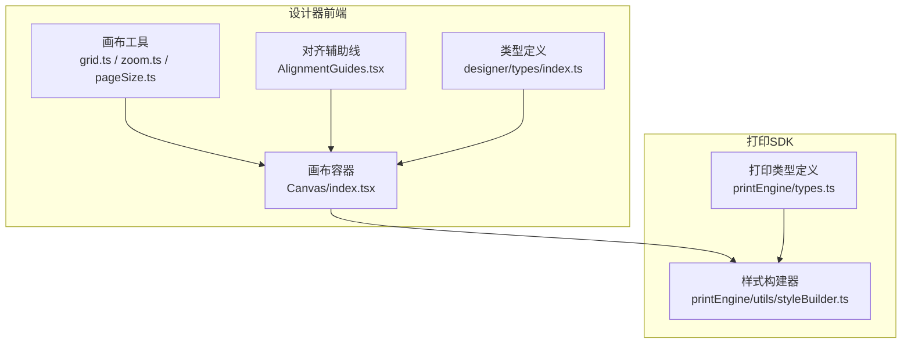
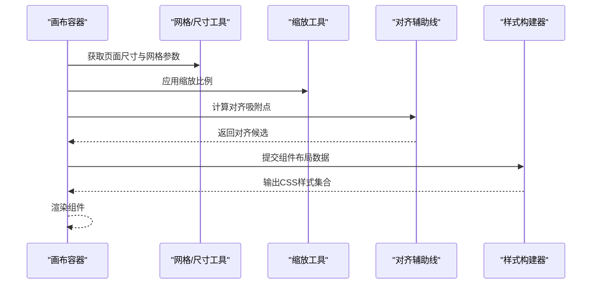
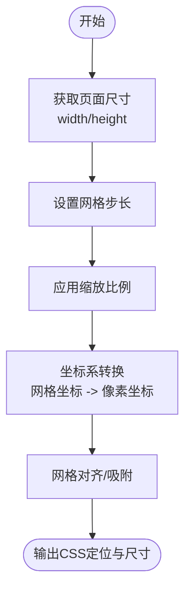
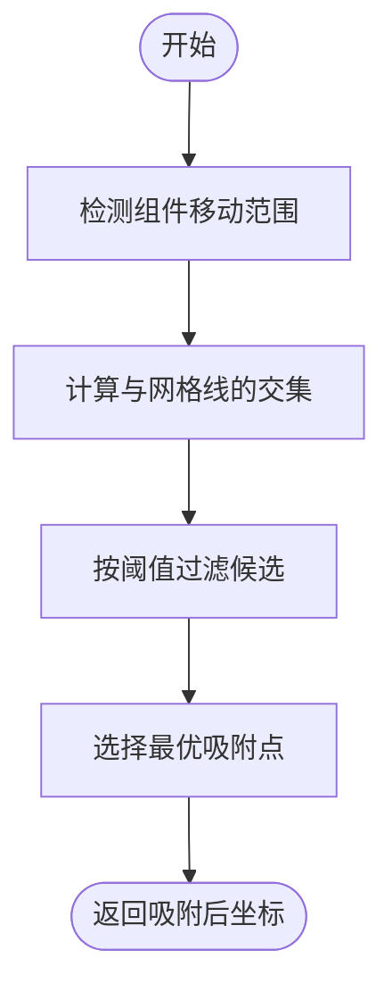
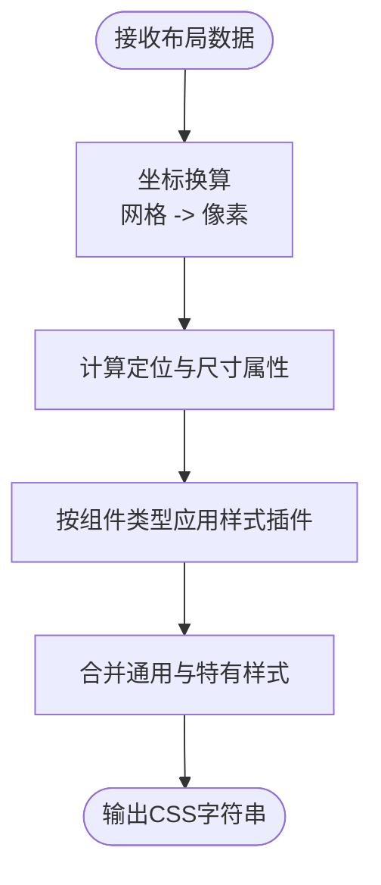
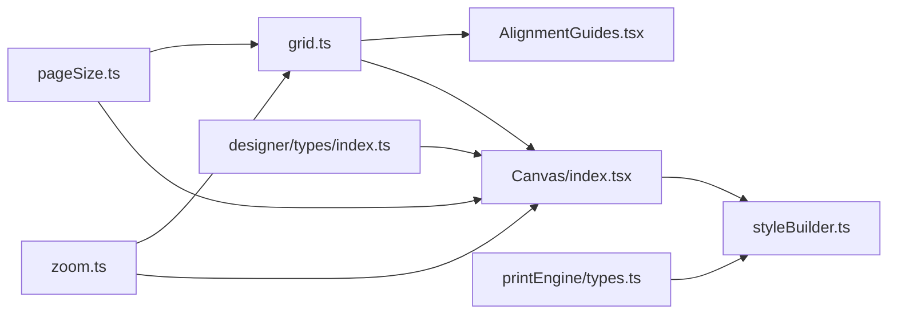

# 坐标空间模型

<cite>
**本文引用的文件**
- [grid.ts](file://designer/src/utils/grid.ts)
- [pageSize.ts](file://designer/src/utils/pageSize.ts)
- [zoom.ts](file://designer/src/utils/zoom.ts)
- [AlignmentGuides.tsx](file://designer/src/pages/Designer/components/Canvas/AlignmentGuides.tsx)
- [styleBuilder.ts](file://sdk/src/printEngine/utils/styleBuilder.ts)
- [index.tsx](file://designer/src/pages/Designer/components/Canvas/index.tsx)
- [types.ts](file://designer/src/types/index.ts)
- [types.ts](file://sdk/src/printEngine/types.ts)
</cite>

## 目录
1. [引言](#引言)
2. [项目结构](#项目结构)
3. [核心组件](#核心组件)
4. [架构总览](#架构总览)
5. [详细组件分析](#详细组件分析)
6. [依赖关系分析](#依赖关系分析)
7. [性能考虑](#性能考虑)
8. [故障排查指南](#故障排查指南)
9. [结论](#结论)
10. [附录](#附录)

## 引言
本技术文档围绕“坐标空间模型”展开，系统阐述设计器与打印引擎在页面布局、网格对齐、缩放控制以及样式构建方面的设计与实现。重点包括：
- 相对间距模型的设计理念与数学原理（坐标系转换与单位换算）
- 页面尺寸管理、网格对齐系统与缩放控制的实现方案
- 样式构建器的工作原理（CSS 属性计算与动态样式生成）
- 坐标变换的性能优化策略与精度控制方法
- 不同页面尺寸与打印设备的适配方案

## 项目结构
本仓库包含设计器前端与打印 SDK 两大部分，坐标空间模型主要分布在设计器的画布工具与打印引擎的样式构建模块中。

**图表来源**
- [grid.ts](file://designer/src/utils/grid.ts)
- [zoom.ts](file://designer/src/utils/zoom.ts)
- [pageSize.ts](file://designer/src/utils/pageSize.ts)
- [AlignmentGuides.tsx](file://designer/src/pages/Designer/components/Canvas/AlignmentGuides.tsx)
- [index.tsx](file://designer/src/pages/Designer/components/Canvas/index.tsx)
- [styleBuilder.ts](file://sdk/src/printEngine/utils/styleBuilder.ts)
- [types.ts](file://designer/src/types/index.ts)
- [types.ts](file://sdk/src/printEngine/types.ts)

**章节来源**
- [grid.ts](file://designer/src/utils/grid.ts)
- [pageSize.ts](file://designer/src/utils/pageSize.ts)
- [zoom.ts](file://designer/src/utils/zoom.ts)
- [AlignmentGuides.tsx](file://designer/src/pages/Designer/components/Canvas/AlignmentGuides.tsx)
- [index.tsx](file://designer/src/pages/Designer/components/Canvas/index.tsx)
- [styleBuilder.ts](file://sdk/src/printEngine/utils/styleBuilder.ts)
- [types.ts](file://designer/src/types/index.ts)
- [types.ts](file://sdk/src/printEngine/types.ts)

## 核心组件
- 坐标与尺寸工具：负责页面尺寸管理、网格对齐与缩放控制
- 对齐辅助线：提供视觉对齐与吸附能力
- 样式构建器：将内部布局数据转换为可渲染的 CSS 属性
- 类型系统：统一坐标、尺寸、缩放与样式字段的语义与约束

**章节来源**
- [grid.ts](file://designer/src/utils/grid.ts)
- [pageSize.ts](file://designer/src/utils/pageSize.ts)
- [zoom.ts](file://designer/src/utils/zoom.ts)
- [AlignmentGuides.tsx](file://designer/src/pages/Designer/components/Canvas/AlignmentGuides.tsx)
- [styleBuilder.ts](file://sdk/src/printEngine/utils/styleBuilder.ts)
- [types.ts](file://designer/src/types/index.ts)
- [types.ts](file://sdk/src/printEngine/types.ts)

## 架构总览
坐标空间模型贯穿“设计器 -> 打印引擎”的数据链路，从画布的网格/缩放/尺寸输入，到样式构建器输出最终的 CSS 渲染指令，形成闭环。

**图表来源**
- [index.tsx](file://designer/src/pages/Designer/components/Canvas/index.tsx)
- [grid.ts](file://designer/src/utils/grid.ts)
- [pageSize.ts](file://designer/src/utils/pageSize.ts)
- [zoom.ts](file://designer/src/utils/zoom.ts)
- [AlignmentGuides.tsx](file://designer/src/pages/Designer/components/Canvas/AlignmentGuides.tsx)
- [styleBuilder.ts](file://sdk/src/printEngine/utils/styleBuilder.ts)

## 详细组件分析

### 相对间距模型与坐标系转换
- 设计理念
  - 使用“相对间距”描述组件在页面中的位置与大小，避免绝对像素直接耦合于布局逻辑
  - 通过统一的坐标原点与单位换算，实现跨页面尺寸与缩放的一致性
- 数学原理
  - 将页面划分为以网格步长为单位的离散格点，组件位置与尺寸以“网格数”或“网格比例”表达
  - 坐标系转换：从“网格坐标系”到“像素坐标系”，再映射到“DOM 容器坐标系”
  - 单位换算：基于页面宽度/高度与缩放比例，将网格坐标换算为 CSS 像素值
- 实现要点
  - 页面尺寸管理：以标准纸张尺寸或自定义尺寸为基准，确定网格步长与画布边界
  - 缩放控制：提供放大/缩小倍率，实时影响网格步长与像素换算
  - 网格对齐：启用吸附时，将组件位置与尺寸调整至最近的网格点

**图表来源**
- [grid.ts](file://designer/src/utils/grid.ts)
- [pageSize.ts](file://designer/src/utils/pageSize.ts)
- [zoom.ts](file://designer/src/utils/zoom.ts)

**章节来源**
- [grid.ts](file://designer/src/utils/grid.ts)
- [pageSize.ts](file://designer/src/utils/pageSize.ts)
- [zoom.ts](file://designer/src/utils/zoom.ts)

### 页面尺寸管理
- 支持标准纸张尺寸与自定义尺寸
- 统一以毫米或英寸为输入，内部转换为像素
- 与网格步长联动，确保网格覆盖整个页面区域
- 与缩放控制协同，保证在不同 DPI 下的等比显示

**章节来源**
- [pageSize.ts](file://designer/src/utils/pageSize.ts)
- [grid.ts](file://designer/src/utils/grid.ts)

### 网格对齐系统
- 核心职责
  - 在拖拽/调整尺寸过程中，提供视觉对齐与吸附
  - 计算组件边缘与网格线的对齐候选，减少手绘误差
- 关键流程
  - 预测组件移动范围，计算与网格线的交集
  - 按阈值筛选近邻网格点，返回最优吸附点
  - 将吸附后的网格坐标回传给布局系统

**图表来源**
- [AlignmentGuides.tsx](file://designer/src/pages/Designer/components/Canvas/AlignmentGuides.tsx)
- [grid.ts](file://designer/src/utils/grid.ts)

**章节来源**
- [AlignmentGuides.tsx](file://designer/src/pages/Designer/components/Canvas/AlignmentGuides.tsx)
- [grid.ts](file://designer/src/utils/grid.ts)

### 缩放控制
- 功能目标
  - 在不改变布局逻辑的前提下，支持画布缩放浏览
  - 保持网格对齐与点击命中测试的准确性
- 实现方式
  - 缩放系数与网格步长成反比，确保视觉密度一致
  - 坐标换算时同时考虑缩放与滚动偏移
  - UI 层提供滑块/快捷键操作，实时更新缩放状态

**章节来源**
- [zoom.ts](file://designer/src/utils/zoom.ts)
- [index.tsx](file://designer/src/pages/Designer/components/Canvas/index.tsx)

### 样式构建器（CSS 属性计算与动态样式生成）
- 输入
  - 组件布局信息（左、上、宽、高）、边框、背景、字体、文本等
  - 页面尺寸与缩放状态
- 处理流程
  - 将网格坐标换算为像素值
  - 计算定位属性（position、left、top）与尺寸属性（width、height）
  - 根据组件类型应用差异化样式规则（如表格、线条、文本）
  - 合并通用样式与组件特有样式，生成最终 CSS 字符串
- 输出
  - 可直接注入 DOM 的内联样式或类名集合

**图表来源**
- [styleBuilder.ts](file://sdk/src/printEngine/utils/styleBuilder.ts)

**章节来源**
- [styleBuilder.ts](file://sdk/src/printEngine/utils/styleBuilder.ts)

### 类型系统与约束
- 设计目标
  - 统一坐标、尺寸、缩放与样式的字段语义
  - 通过类型约束降低布局错误与运行时异常
- 关键类型
  - 页面尺寸：宽度、高度、单位（mm/inch）
  - 布局：left、top、width、height、rotation 等
  - 缩放：scale、min/max、步进
  - 样式：颜色、字体、边框、阴影等

**章节来源**
- [types.ts](file://designer/src/types/index.ts)
- [types.ts](file://sdk/src/printEngine/types.ts)

## 依赖关系分析
- 工具层
  - grid.ts 依赖 pageSize.ts 与 zoom.ts，提供网格步长与坐标换算
  - AlignmentGuides.tsx 依赖 grid.ts 进行吸附计算
- 业务层
  - Canvas/index.tsx 聚合 grid、zoom、pageSize，并驱动样式构建器
- 打印引擎
  - styleBuilder.ts 依赖 printEngine/types.ts 中的布局与样式类型

**图表来源**
- [grid.ts](file://designer/src/utils/grid.ts)
- [pageSize.ts](file://designer/src/utils/pageSize.ts)
- [zoom.ts](file://designer/src/utils/zoom.ts)
- [AlignmentGuides.tsx](file://designer/src/pages/Designer/components/Canvas/AlignmentGuides.tsx)
- [index.tsx](file://designer/src/pages/Designer/components/Canvas/index.tsx)
- [styleBuilder.ts](file://sdk/src/printEngine/utils/styleBuilder.ts)
- [types.ts](file://designer/src/types/index.ts)
- [types.ts](file://sdk/src/printEngine/types.ts)

**章节来源**
- [grid.ts](file://designer/src/utils/grid.ts)
- [pageSize.ts](file://designer/src/utils/pageSize.ts)
- [zoom.ts](file://designer/src/utils/zoom.ts)
- [AlignmentGuides.tsx](file://designer/src/pages/Designer/components/Canvas/AlignmentGuides.tsx)
- [index.tsx](file://designer/src/pages/Designer/components/Canvas/index.tsx)
- [styleBuilder.ts](file://sdk/src/printEngine/utils/styleBuilder.ts)
- [types.ts](file://designer/src/types/index.ts)
- [types.ts](file://sdk/src/printEngine/types.ts)

## 性能考虑
- 坐标换算缓存
  - 对常用网格步长与缩放组合进行缓存，避免重复计算
- 吸附候选剪枝
  - 限制吸附搜索窗口，仅在局部范围内查找候选，降低复杂度
- 批量更新
  - 对多组件批量布局时，采用请求帧（requestAnimationFrame）分批处理，避免主线程阻塞
- 精度控制
  - 坐标与尺寸保留小数位数，统一四舍五入策略，防止累积误差导致视觉偏移
- DOM 操作最小化
  - 合并多次样式变更，减少重排与重绘

[本节为通用指导，无需列出具体文件来源]

## 故障排查指南
- 症状：组件移动时跳变或吸附不生效
  - 排查步骤：确认网格步长与缩放是否匹配；检查吸附阈值是否过大或过小
  - 相关文件：[grid.ts](file://designer/src/utils/grid.ts)、[AlignmentGuides.tsx](file://designer/src/pages/Designer/components/Canvas/AlignmentGuides.tsx)
- 症状：缩放后坐标错位
  - 排查步骤：核对缩放系数与滚动偏移的换算逻辑；验证坐标换算函数的输入参数
  - 相关文件：[zoom.ts](file://designer/src/utils/zoom.ts)、[index.tsx](file://designer/src/pages/Designer/components/Canvas/index.tsx)
- 症状：样式渲染异常或布局错乱
  - 排查步骤：检查样式构建器的坐标换算与单位换算；核对类型定义是否一致
  - 相关文件：[styleBuilder.ts](file://sdk/src/printEngine/utils/styleBuilder.ts)、[types.ts](file://sdk/src/printEngine/types.ts)

**章节来源**
- [grid.ts](file://designer/src/utils/grid.ts)
- [AlignmentGuides.tsx](file://designer/src/pages/Designer/components/Canvas/AlignmentGuides.tsx)
- [zoom.ts](file://designer/src/utils/zoom.ts)
- [index.tsx](file://designer/src/pages/Designer/components/Canvas/index.tsx)
- [styleBuilder.ts](file://sdk/src/printEngine/utils/styleBuilder.ts)
- [types.ts](file://sdk/src/printEngine/types.ts)

## 结论
坐标空间模型通过“相对间距 + 网格对齐 + 缩放控制 + 样式构建器”的协同，实现了跨页面尺寸与打印设备的一致布局体验。其核心在于：
- 明确的坐标系转换与单位换算机制
- 可配置的网格步长与吸附策略
- 高效的样式生成与类型约束
- 面向性能的缓存与剪枝策略

该模型既满足设计师的精确布局需求，也为打印引擎提供了稳定、可扩展的样式输出基础。

[本节为总结性内容，无需列出具体文件来源]

## 附录
- 术语
  - 相对间距：以网格步长为单位的组件位置与尺寸表达
  - 网格对齐：将组件吸附到最近网格点的交互行为
  - 样式构建器：将布局数据转换为 CSS 的处理器
- 建议
  - 在新增组件类型时，同步完善样式插件与类型定义
  - 对缩放与吸附参数进行 A/B 测试，平衡精度与性能

[本节为补充内容，无需列出具体文件来源]