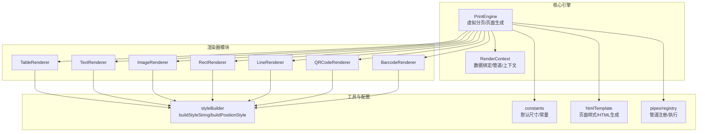
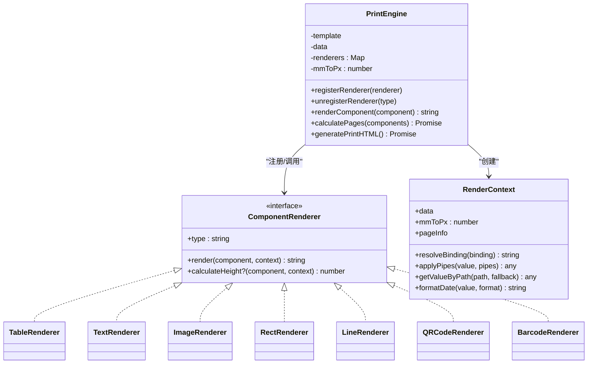
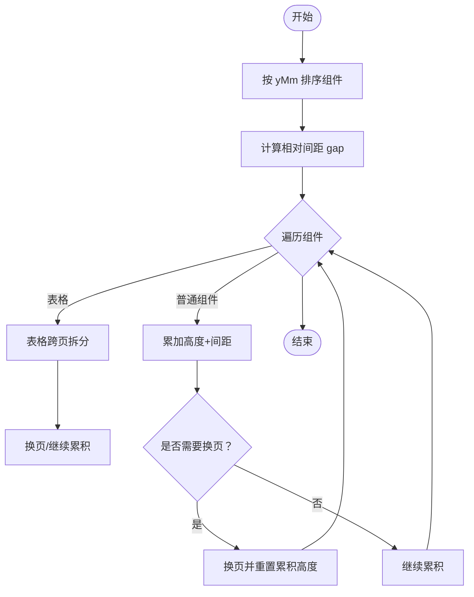
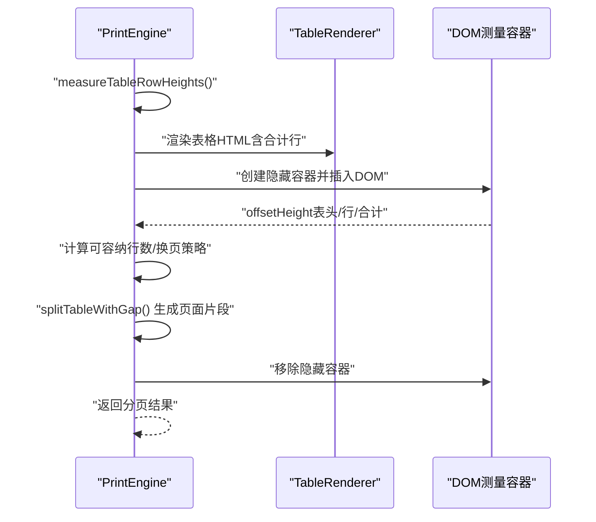
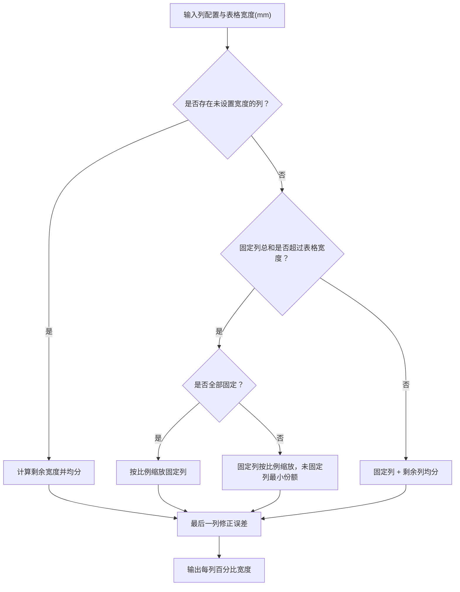
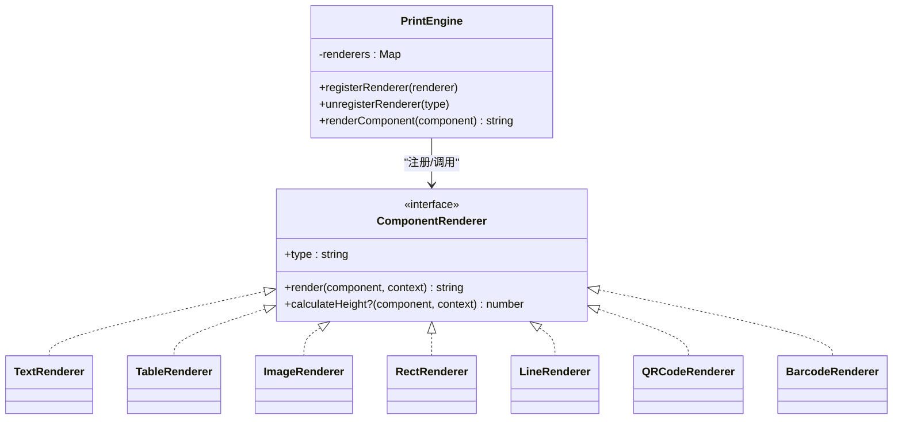
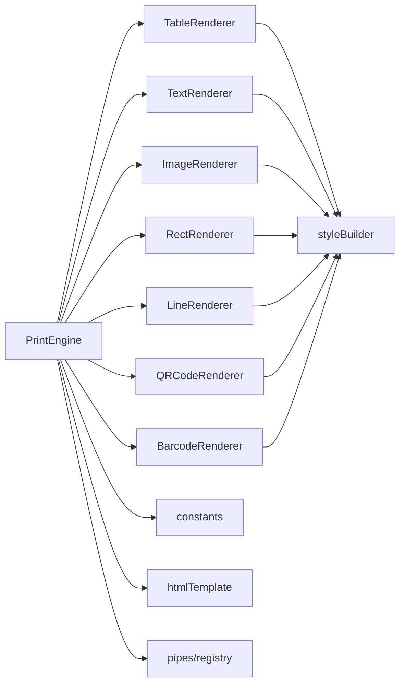

# 核心引擎设计

<cite>
**本文档引用的文件**
- [printEngine.ts](file://sdk/src/printEngine.ts)
- [TableRenderer.ts](file://sdk/src/printEngine/renderers/TableRenderer.ts)
- [renderers/index.ts](file://sdk/src/printEngine/renderers/index.ts)
- [types.ts](file://sdk/src/printEngine/types.ts)
- [constants.ts](file://sdk/src/printEngine/constants.ts)
- [styleBuilder.ts](file://sdk/src/printEngine/utils/styleBuilder.ts)
- [htmlTemplate.ts](file://sdk/src/printEngine/htmlTemplate.ts)
- [registry.ts](file://sdk/src/pipes/registry.ts)
- [CurrencyPipe.ts](file://sdk/src/pipes/executors/CurrencyPipe.ts)
- [TextRenderer.ts](file://sdk/src/printEngine/renderers/TextRenderer.ts)
- [ImageRenderer.ts](file://sdk/src/printEngine/renderers/ImageRenderer.ts)
- [RectRenderer.ts](file://sdk/src/printEngine/renderers/RectRenderer.ts)
- [LineRenderer.ts](file://sdk/src/printEngine/renderers/LineRenderer.ts)
- [QRCodeRenderer.ts](file://sdk/src/printEngine/renderers/QRCodeRenderer.ts)
- [BarcodeRenderer.ts](file://sdk/src/printEngine/renderers/BarcodeRenderer.ts)
</cite>

## 目录
1. [简介](#简介)
2. [项目结构](#项目结构)
3. [核心组件](#核心组件)
4. [架构概览](#架构概览)
5. [详细组件分析](#详细组件分析)
6. [依赖关系分析](#依赖关系分析)
7. [性能考量](#性能考量)
8. [故障排查指南](#故障排查指南)
9. [结论](#结论)
10. [附录](#附录)

## 简介
本设计文档聚焦于混合渲染引擎的核心设计理念与实现方案，系统阐述以下关键主题：
- 相对间距模型：基于设计时相对间距的流式布局与分页控制，确保组件间稳定的视觉关系。
- 表格跨页拆分：结合渲染后测量与动态行高计算，实现精确的跨页分割与表头重复策略。
- 渲染后测量：在浏览器环境下对表格行高进行真实测量，保证分页准确性与视觉一致性。
- 组件渲染器插件化架构：统一的渲染器接口与注册机制，支持扩展与定制。
- 性能指标与优化：通过防御性检查、估算回退与最小化 DOM 操作等策略提升稳定性与性能。

## 项目结构
渲染引擎位于 SDK 目录，采用“插件化 + 渲染器分离”的组织方式：
- 核心引擎：负责模板解析、数据绑定、管道转换、虚拟分页与页面生成。
- 渲染器模块：按组件类型划分，每个组件拥有独立渲染器，遵循统一接口。
- 工具与常量：样式构建、页面尺寸与默认配置、HTML 模板生成。
- 管道系统：可插拔的数据转换链路，支持货币、日期、中文大写等内置执行器。

**图表来源**
- [printEngine.ts:30-72](file://sdk/src/printEngine.ts#L30-L72)
- [renderers/index.ts:5-12](file://sdk/src/printEngine/renderers/index.ts#L5-L12)
- [styleBuilder.ts:13-53](file://sdk/src/printEngine/utils/styleBuilder.ts#L13-L53)
- [constants.ts:8-46](file://sdk/src/printEngine/constants.ts#L8-L46)
- [htmlTemplate.ts:26-75](file://sdk/src/printEngine/htmlTemplate.ts#L26-L75)
- [registry.ts:12-52](file://sdk/src/pipes/registry.ts#L12-L52)

**章节来源**
- [printEngine.ts:30-72](file://sdk/src/printEngine.ts#L30-L72)
- [renderers/index.ts:5-12](file://sdk/src/printEngine/renderers/index.ts#L5-L12)

## 核心组件
- PrintEngine：核心调度器，负责渲染器注册、数据绑定、管道执行、虚拟分页与页面生成。
- ComponentRenderer 接口：所有渲染器需实现的统一接口，包含类型标识、渲染方法与可选高度计算。
- RenderContext：渲染上下文，封装数据访问、绑定解析、管道应用、日期格式化与页面信息。
- 渲染器集合：文本、表格、图片、矩形、线条、二维码、条形码等组件渲染器。
- 管道系统：注册器与执行器，支持链式转换与扩展。

**章节来源**
- [types.ts:11-55](file://sdk/src/printEngine/types.ts#L11-L55)
- [types.ts:61-82](file://sdk/src/printEngine/types.ts#L61-L82)
- [registry.ts:12-52](file://sdk/src/pipes/registry.ts#L12-L52)

## 架构概览
渲染引擎采用“插件化渲染器 + 上下文驱动”的架构：
- 插件化：通过 Map 存储渲染器，按组件类型动态选择渲染器。
- 上下文驱动：RenderContext 将数据、绑定、管道、页面信息统一封装，供渲染器使用。
- 虚拟分页：基于相对间距的流式布局，支持表格跨页拆分与表头重复策略。
- 渲染后测量：针对表格组件，先按设计尺寸估算，再在浏览器环境中测量真实行高，提高分页精度。

**图表来源**
- [printEngine.ts:30-72](file://sdk/src/printEngine.ts#L30-L72)
- [types.ts:61-82](file://sdk/src/printEngine/types.ts#L61-L82)
- [types.ts:11-55](file://sdk/src/printEngine/types.ts#L11-L55)

## 详细组件分析

### 相对间距模型与虚拟分页
- 设计思想：以“相对间距”为核心，组件间的间距由设计时的 yMm 与高度决定，允许负间距表示重叠，从而在分页时保持视觉连续性。
- 关键流程：
  - 组件按 yMm 排序，计算相邻组件的相对间距（gap = 当前组件 yMm − 上一组件底部 yMm）。
  - 遍历组件，累加高度与间距，遇到表格时进入跨页拆分逻辑。
  - 新页面首个组件忽略 gap，其余组件按设计时相对间距继续布局。
- 页头/页脚处理：在计算可用高度时，先测量页头/页脚组件的最大底部位置，将其纳入内容区高度计算。

**图表来源**
- [printEngine.ts:418-620](file://sdk/src/printEngine.ts#L418-L620)

**章节来源**
- [printEngine.ts:418-620](file://sdk/src/printEngine.ts#L418-L620)

### 表格跨页拆分与渲染后测量
- 核心目标：在表格跨页时，确保表头重复、合计行正确显示，并避免行被截断。
- 渲染后测量：
  - 在浏览器环境创建隐藏容器，渲染完整表格（含合计行），测量表头、数据行与合计行的实际高度。
  - 若测量失败或列全部隐藏，回退到估算行高。
- 跨页策略：
  - 基于可用高度与测量行高，计算当前页最多容纳的行数。
  - total 模式仅在最后一页显示合计行；page 模式在每页显示合计行。
  - 防御性检查：当可容纳行数过少时，使用估算行高重新计算，避免极端情况。
  - 至少保留一行数据，防止空页与死循环。
- 表头重复：repeatHeader 控制跨页是否重复表头；若关闭且为首个片段，后续页不再重复表头。

**图表来源**
- [printEngine.ts:626-756](file://sdk/src/printEngine.ts#L626-L756)
- [printEngine.ts:762-998](file://sdk/src/printEngine.ts#L762-L998)
- [TableRenderer.ts:150-327](file://sdk/src/printEngine/renderers/TableRenderer.ts#L150-L327)

**章节来源**
- [printEngine.ts:626-756](file://sdk/src/printEngine.ts#L626-L756)
- [printEngine.ts:762-998](file://sdk/src/printEngine.ts#L762-L998)
- [TableRenderer.ts:150-327](file://sdk/src/printEngine/renderers/TableRenderer.ts#L150-L327)

### 列宽计算与表格样式
- 列宽策略：
  - 全部未设置 width：均分。
  - 部分设置 width：固定列按比例缩放，未设置列均分剩余空间。
  - 固定列总和超过表格宽度：全固定按比例缩放；部分固定则固定列按比例缩放，未固定列分配最小份额。
  - 最后一列吸收舍入误差，确保百分比总和为 100%。
- 表格样式：
  - 表头固定高度、数据行最小高度，合计行与额外行按需显示。
  - 合计计算使用高精度 Decimal.js，支持多种聚合类型与格式化管道。

**图表来源**
- [TableRenderer.ts:51-125](file://sdk/src/printEngine/renderers/TableRenderer.ts#L51-L125)

**章节来源**
- [TableRenderer.ts:51-125](file://sdk/src/printEngine/renderers/TableRenderer.ts#L51-L125)

### 组件渲染器插件化架构
- 统一接口：ComponentRenderer 定义 type、render 与可选 calculateHeight。
- 注册机制：PrintEngine 维护渲染器 Map，支持注册与注销。
- 渲染流程：根据组件类型查找渲染器，创建 RenderContext 并调用 render。
- 扩展机制：通过 registerRenderer 注入自定义渲染器，实现新组件类型的渲染。

**图表来源**
- [types.ts:61-82](file://sdk/src/printEngine/types.ts#L61-L82)
- [printEngine.ts:48-72](file://sdk/src/printEngine.ts#L48-L72)
- [renderers/index.ts:5-12](file://sdk/src/printEngine/renderers/index.ts#L5-L12)

**章节来源**
- [types.ts:61-82](file://sdk/src/printEngine/types.ts#L61-L82)
- [printEngine.ts:48-72](file://sdk/src/printEngine.ts#L48-L72)
- [renderers/index.ts:5-12](file://sdk/src/printEngine/renderers/index.ts#L5-L12)

### 渲染后测量方案的技术创新
- 技术要点：
  - 在浏览器环境创建隐藏容器，渲染表格并测量真实高度，显著提升分页精度。
  - 服务器端回退到估算值，保证非浏览器环境的可用性。
  - 对异常测量结果进行防御性检查与回退，避免极端情况导致的分页错误。
- 实现细节：
  - 测量容器使用绝对定位与不可见样式，避免影响页面布局。
  - 测量完成后立即清理 DOM，防止内存泄漏。
  - 合计行高度与额外行按需测量，确保合计显示的准确性。

**章节来源**
- [printEngine.ts:626-756](file://sdk/src/printEngine.ts#L626-L756)

### 管道系统与数据绑定
- 数据绑定：支持路径访问、回退值与管道链式转换。
- 管道执行：注册器集中管理执行器，支持货币、日期、中文大写等内置执行器。
- 扩展能力：通过 registerExecutor 注册自定义执行器，满足业务定制需求。

**章节来源**
- [printEngine.ts:79-125](file://sdk/src/printEngine.ts#L79-L125)
- [registry.ts:12-52](file://sdk/src/pipes/registry.ts#L12-L52)
- [CurrencyPipe.ts:7-16](file://sdk/src/pipes/executors/CurrencyPipe.ts#L7-L16)

## 依赖关系分析
- 核心引擎依赖：
  - 渲染器模块：按组件类型动态调用。
  - 工具模块：样式构建与页面尺寸计算。
  - 管道系统：数据转换链路。
- 渲染器依赖：
  - 样式构建工具：统一生成 CSS。
  - 常量配置：默认尺寸与样式参数。
  - 管道执行：表格合计与额外行的格式化。
- HTML 模板：
  - 页面样式生成：支持预览与批量打印两种模式。
  - 页面尺寸提取：从模板配置中解析尺寸与方向。

**图表来源**
- [printEngine.ts:15-24](file://sdk/src/printEngine.ts#L15-L24)
- [styleBuilder.ts:13-53](file://sdk/src/printEngine/utils/styleBuilder.ts#L13-L53)
- [constants.ts:8-46](file://sdk/src/printEngine/constants.ts#L8-L46)
- [htmlTemplate.ts:26-75](file://sdk/src/printEngine/htmlTemplate.ts#L26-L75)
- [registry.ts:12-52](file://sdk/src/pipes/registry.ts#L12-L52)

**章节来源**
- [printEngine.ts:15-24](file://sdk/src/printEngine.ts#L15-L24)

## 性能考量
- 渲染后测量的代价：
  - 浏览器环境下的 DOM 插入与测量会带来额外开销，建议在大数据量表格时谨慎使用合计行与额外行。
  - 可通过减少列数量、隐藏不必要的列来降低测量复杂度。
- 防御性检查与回退：
  - 当测量结果异常时，使用估算行高快速回退，避免长时间阻塞。
  - 对极端低容纳行数的情况，强制至少保留一行，防止死循环。
- 样式与布局：
  - 统一使用绝对定位与像素转换，减少布局抖动。
  - 表格列宽计算采用一次性百分比分配，避免多次重排。
- 管道链路：
  - 管道执行器应尽量轻量，避免在渲染热路径中执行耗时操作。
  - 对合计计算使用高精度 Decimal.js，确保数值稳定但注意性能影响。

[本节为通用性能指导，无需特定文件引用]

## 故障排查指南
- 表格宽度溢出：
  - 现象：表格右侧超出页边距，出现警告并自动调整宽度。
  - 处理：检查组件 xMm 与 widthMm 设置，确保不超过可用宽度。
- 表格高度接近页面可用高度：
  - 现象：输出警告，可能影响分页效果。
  - 处理：适当增加页边距或减少表格高度。
- 测量结果异常：
  - 现象：行数与数据长度不一致，回退到估算行高。
  - 处理：检查列配置，确保至少有一列可见；必要时禁用合计行以减少测量复杂度。
- 合计计算错误：
  - 现象：合计计算抛出异常或返回错误提示。
  - 处理：检查数据类型与管道配置，确保数值可转换；查看控制台错误日志。

**章节来源**
- [TableRenderer.ts:196-228](file://sdk/src/printEngine/renderers/TableRenderer.ts#L196-L228)
- [printEngine.ts:492-496](file://sdk/src/printEngine.ts#L492-L496)
- [printEngine.ts:806-814](file://sdk/src/printEngine.ts#L806-L814)
- [TableRenderer.ts:429-433](file://sdk/src/printEngine/renderers/TableRenderer.ts#L429-L433)

## 结论
本渲染引擎通过“相对间距模型 + 渲染后测量 + 插件化渲染器”的组合，实现了高精度、可扩展的打印布局与分页。表格跨页拆分在保证视觉一致性的同时，兼顾了性能与稳定性；管道系统与样式工具进一步提升了可定制性与易用性。未来可在以下方面持续优化：
- 对大规模表格引入虚拟滚动或分块渲染策略。
- 增强测量缓存机制，复用历史测量结果。
- 提供更丰富的布局与对齐选项，支持复杂业务场景。

[本节为总结性内容，无需特定文件引用]

## 附录
- 常用常量与默认配置：
  - mm→px 换算系数、组件默认尺寸、表格默认尺寸与样式、条形码/二维码配置。
- 页面样式生成：
  - 支持预览模式与批量打印模式，自动适配 @page 与屏幕样式。
- HTML 模板：
  - 统一的页面结构与组件基础样式，便于扩展与维护。

**章节来源**
- [constants.ts:8-113](file://sdk/src/printEngine/constants.ts#L8-L113)
- [htmlTemplate.ts:81-172](file://sdk/src/printEngine/htmlTemplate.ts#L81-L172)
- [htmlTemplate.ts:178-225](file://sdk/src/printEngine/htmlTemplate.ts#L178-L225)