# 渲染引擎核心

<cite>
**本文引用的文件**
- [renderers/index.ts](file://sdk/src/printEngine/renderers/index.ts)
- [types.ts](file://sdk/src/printEngine/types.ts)
- [constants.ts](file://sdk/src/printEngine/constants.ts)
- [styleBuilder.ts](file://sdk/src/printEngine/utils/styleBuilder.ts)
- [registry.ts](file://sdk/src/pipes/registry.ts)
- [TextRenderer.ts](file://sdk/src/printEngine/renderers/TextRenderer.ts)
- [ImageRenderer.ts](file://sdk/src/printEngine/renderers/ImageRenderer.ts)
- [TableRenderer.ts](file://sdk/src/printEngine/renderers/TableRenderer.ts)
- [QRCodeRenderer.ts](file://sdk/src/printEngine/renderers/QRCodeRenderer.ts)
- [BarcodeRenderer.ts](file://sdk/src/printEngine/renderers/BarcodeRenderer.ts)
- [RectRenderer.ts](file://sdk/src/printEngine/renderers/RectRenderer.ts)
- [LineRenderer.ts](file://sdk/src/printEngine/renderers/LineRenderer.ts)
- [PageNumberRenderer.ts](file://sdk/src/printEngine/renderers/PageNumberRenderer.ts)
- [index.ts](file://sdk/src/pipes/executors/index.ts)
- [types.ts](file://sdk/src/types.ts)
</cite>

## 目录
1. [简介](#简介)
2. [项目结构](#项目结构)
3. [核心组件](#核心组件)
4. [架构总览](#架构总览)
5. [详细组件分析](#详细组件分析)
6. [依赖关系分析](#依赖关系分析)
7. [性能考虑](#性能考虑)
8. [故障排查指南](#故障排查指南)
9. [结论](#结论)
10. [附录](#附录)

## 简介
本文件系统性阐述渲染引擎核心的插件化架构与组件渲染器实现，涵盖渲染器接口规范、注册机制、调用流程、各组件渲染算法、生命周期与错误处理、扩展开发指南以及性能优化与内存管理策略。目标是帮助开发者快速理解并高效扩展打印模板的可视化渲染能力。

## 项目结构
渲染引擎位于 SDK 的 printEngine 子目录，采用“插件化渲染器 + 管道系统”的分层设计：
- 接口与类型：定义渲染器统一接口、渲染上下文、分页与样式模型等。
- 渲染器：按组件类型实现具体渲染逻辑，遵循统一接口。
- 工具：样式构建、单位换算等通用工具。
- 管道：数据转换与格式化，贯穿渲染上下文与表格合计等场景。

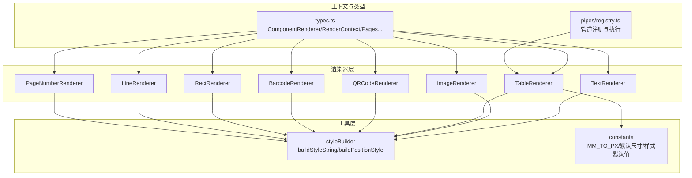

图表来源
- [renderers/index.ts:1-13](file://sdk/src/printEngine/renderers/index.ts#L1-L13)
- [types.ts:57-82](file://sdk/src/printEngine/types.ts#L57-L82)
- [styleBuilder.ts:13-53](file://sdk/src/printEngine/utils/styleBuilder.ts#L13-L53)
- [constants.ts:8-113](file://sdk/src/printEngine/constants.ts#L8-L113)
- [registry.ts:44-52](file://sdk/src/pipes/registry.ts#L44-L52)

章节来源
- [renderers/index.ts:1-13](file://sdk/src/printEngine/renderers/index.ts#L1-L13)
- [types.ts:57-82](file://sdk/src/printEngine/types.ts#L57-L82)
- [styleBuilder.ts:13-53](file://sdk/src/printEngine/utils/styleBuilder.ts#L13-L53)
- [constants.ts:8-113](file://sdk/src/printEngine/constants.ts#L8-L113)
- [registry.ts:44-52](file://sdk/src/pipes/registry.ts#L44-L52)

## 核心组件
- 组件渲染器接口 ComponentRenderer：统一的 type、render、calculateHeight 等约定，便于插件化扩展与调度。
- 渲染上下文 RenderContext：提供数据解析、管道应用、路径取值、日期格式化、单位换算等能力。
- 样式构建工具：将样式对象转换为 CSS 字符串，并生成绝对定位样式。
- 常量与默认值：统一单位换算、组件默认尺寸、表格与样式默认值、条码/二维码配置。
- 管道注册与执行：集中注册内置管道执行器，按类型执行转换，支持链式管道。

章节来源
- [types.ts:57-82](file://sdk/src/printEngine/types.ts#L57-L82)
- [types.ts:11-55](file://sdk/src/printEngine/types.ts#L11-L55)
- [styleBuilder.ts:13-53](file://sdk/src/printEngine/utils/styleBuilder.ts#L13-L53)
- [constants.ts:8-113](file://sdk/src/printEngine/constants.ts#L8-L113)
- [registry.ts:17-52](file://sdk/src/pipes/registry.ts#L17-L52)

## 架构总览
渲染器通过统一接口接入，渲染流程如下：
- 上层根据组件类型选择对应渲染器。
- 渲染器读取组件布局、样式、绑定与属性，结合 RenderContext 完成数据解析与管道应用。
- 使用样式构建工具生成最终 CSS，输出 HTML 片段。
- 可选的 calculateHeight 用于分页与高度估算。

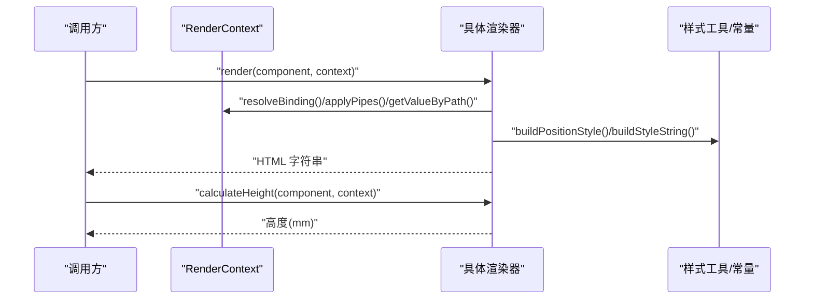

图表来源
- [types.ts:11-82](file://sdk/src/printEngine/types.ts#L11-L82)
- [styleBuilder.ts:13-53](file://sdk/src/printEngine/utils/styleBuilder.ts#L13-L53)

## 详细组件分析

### 文本组件渲染器 TextRenderer
- 功能要点
  - 解析绑定值，支持 label 前缀拼接。
  - 使用 flex 布局实现文本对齐，基于 textAlign 映射到 justifyContent。
  - 绝对定位样式，支持 mm 到 px 的单位换算。
- 关键实现路径
  - [render 方法:13-53](file://sdk/src/printEngine/renderers/TextRenderer.ts#L13-L53)
  - [calculateHeight 方法:55-58](file://sdk/src/printEngine/renderers/TextRenderer.ts#L55-L58)
- 样式与默认值
  - [默认字体与对齐:63-78](file://sdk/src/printEngine/constants.ts#L63-L78)
  - [样式构建:13-53](file://sdk/src/printEngine/utils/styleBuilder.ts#L13-L53)

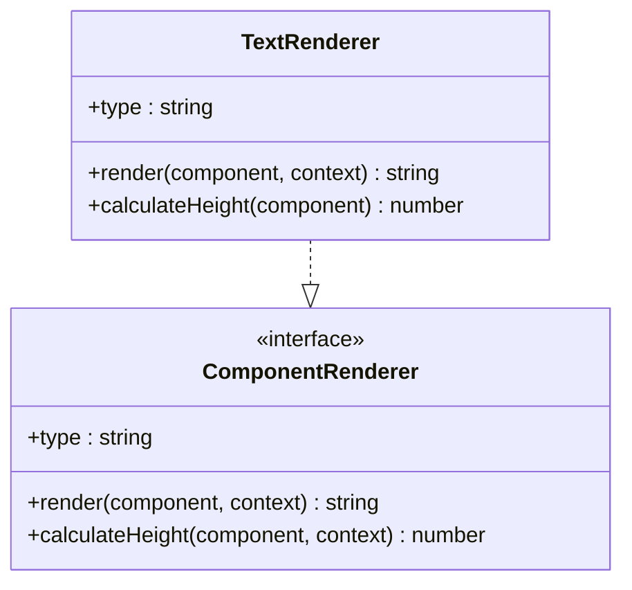

图表来源
- [TextRenderer.ts:10-59](file://sdk/src/printEngine/renderers/TextRenderer.ts#L10-L59)
- [types.ts:57-82](file://sdk/src/printEngine/types.ts#L57-L82)

章节来源
- [TextRenderer.ts:13-58](file://sdk/src/printEngine/renderers/TextRenderer.ts#L13-L58)
- [constants.ts:63-78](file://sdk/src/printEngine/constants.ts#L63-L78)
- [styleBuilder.ts:13-53](file://sdk/src/printEngine/utils/styleBuilder.ts#L13-L53)

### 图像组件渲染器 ImageRenderer
- 功能要点
  - 优先使用绑定值作为图片地址，回退到 props.src。
  - 容器使用绝对定位，img 使用 object-fit 控制填充策略。
  - 无资源时提供占位提示。
- 关键实现路径
  - [render 方法:13-49](file://sdk/src/printEngine/renderers/ImageRenderer.ts#L13-L49)
  - [calculateHeight 方法:51-53](file://sdk/src/printEngine/renderers/ImageRenderer.ts#L51-L53)

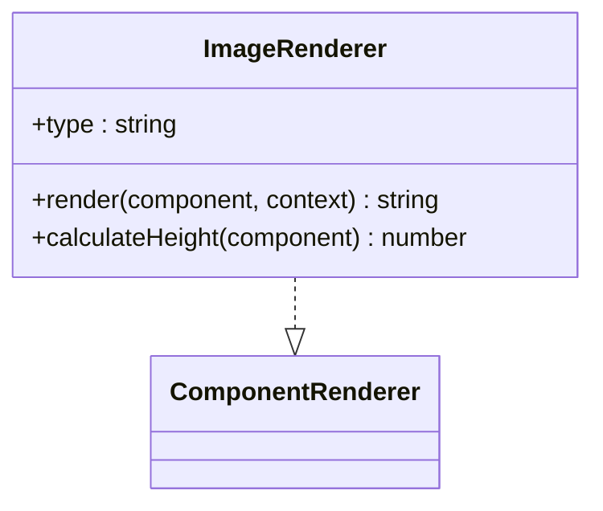

图表来源
- [ImageRenderer.ts:10-54](file://sdk/src/printEngine/renderers/ImageRenderer.ts#L10-L54)
- [types.ts:57-82](file://sdk/src/printEngine/types.ts#L57-L82)

章节来源
- [ImageRenderer.ts:13-53](file://sdk/src/printEngine/renderers/ImageRenderer.ts#L13-L53)

### 表格组件渲染器 TableRenderer
- 功能要点
  - 数据来源：优先使用分页注入的 _pageData，其次使用绑定路径的数据。
  - 列宽计算：支持全部未设宽均分、部分固定列、固定列总和超限的缩放策略，保证总和为 100%。
  - 表头/表体/合计行：支持跨页重复表头、合计模式（每页/最后一页）、合计额外行与链式管道。
  - 安全与健壮性：HTML 转义防 XSS；Decimal.js 精度计算；异常降级为占位文本。
- 关键实现路径
  - [列宽计算:51-125](file://sdk/src/printEngine/renderers/TableRenderer.ts#L51-L125)
  - [合计计算与格式化:389-463](file://sdk/src/printEngine/renderers/TableRenderer.ts#L389-L463)
  - [合计额外行:513-579](file://sdk/src/printEngine/renderers/TableRenderer.ts#L513-L579)
  - [render 主流程:150-327](file://sdk/src/printEngine/renderers/TableRenderer.ts#L150-L327)
  - [calculateHeight 估算:581-600](file://sdk/src/printEngine/renderers/TableRenderer.ts#L581-L600)
- 样式与默认值
  - [表格默认样式:83-92](file://sdk/src/printEngine/constants.ts#L83-L92)
  - [默认行高与表头高度:51-58](file://sdk/src/printEngine/constants.ts#L51-L58)

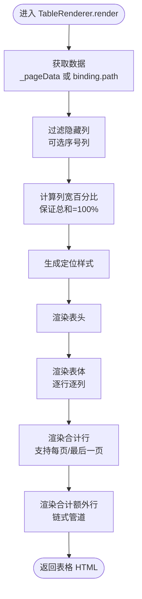

图表来源
- [TableRenderer.ts:150-327](file://sdk/src/printEngine/renderers/TableRenderer.ts#L150-L327)
- [TableRenderer.ts:51-125](file://sdk/src/printEngine/renderers/TableRenderer.ts#L51-L125)
- [TableRenderer.ts:332-385](file://sdk/src/printEngine/renderers/TableRenderer.ts#L332-L385)
- [TableRenderer.ts:513-579](file://sdk/src/printEngine/renderers/TableRenderer.ts#L513-L579)

章节来源
- [TableRenderer.ts:150-327](file://sdk/src/printEngine/renderers/TableRenderer.ts#L150-L327)
- [TableRenderer.ts:51-125](file://sdk/src/printEngine/renderers/TableRenderer.ts#L51-L125)
- [TableRenderer.ts:332-385](file://sdk/src/printEngine/renderers/TableRenderer.ts#L332-L385)
- [TableRenderer.ts:513-579](file://sdk/src/printEngine/renderers/TableRenderer.ts#L513-L579)
- [constants.ts:51-92](file://sdk/src/printEngine/constants.ts#L51-L92)

### 二维码组件渲染器 QRCodeRenderer
- 功能要点
  - 使用 qrcode 在内存 canvas 同步生成 PNG，转为 base64 直接嵌入 img。
  - 错误兜底：生成失败时返回带边框的占位容器。
- 关键实现路径
  - [render 方法:15-56](file://sdk/src/printEngine/renderers/QRCodeRenderer.ts#L15-L56)
  - [calculateHeight 方法:59-61](file://sdk/src/printEngine/renderers/QRCodeRenderer.ts#L59-L61)
- 配置
  - [默认内容与尺寸:109-112](file://sdk/src/printEngine/constants.ts#L109-L112)

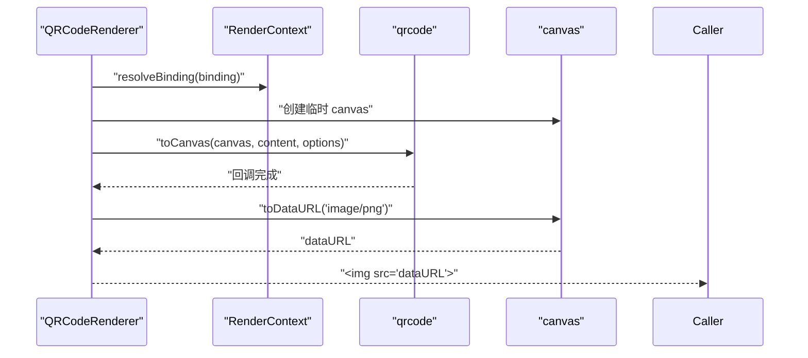

图表来源
- [QRCodeRenderer.ts:15-56](file://sdk/src/printEngine/renderers/QRCodeRenderer.ts#L15-L56)
- [constants.ts:109-112](file://sdk/src/printEngine/constants.ts#L109-L112)

章节来源
- [QRCodeRenderer.ts:15-61](file://sdk/src/printEngine/renderers/QRCodeRenderer.ts#L15-L61)
- [constants.ts:109-112](file://sdk/src/printEngine/constants.ts#L109-L112)

### 条形码组件渲染器 BarcodeRenderer
- 功能要点
  - 使用 jsbarcode 在内存 canvas 同步生成 PNG，转为 base64 直接嵌入 img。
  - 支持格式与高度比例配置。
- 关键实现路径
  - [render 方法:15-56](file://sdk/src/printEngine/renderers/BarcodeRenderer.ts#L15-L56)
  - [calculateHeight 方法:59-61](file://sdk/src/printEngine/renderers/BarcodeRenderer.ts#L59-L61)
- 配置
  - [默认格式、高度比例与默认内容:97-104](file://sdk/src/printEngine/constants.ts#L97-L104)

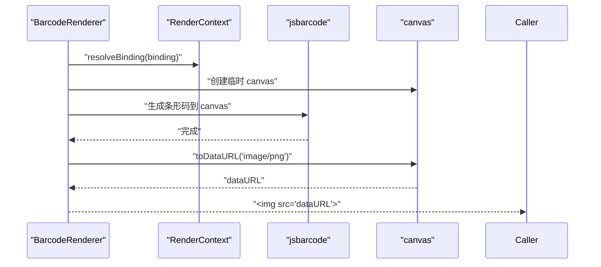

图表来源
- [BarcodeRenderer.ts:15-56](file://sdk/src/printEngine/renderers/BarcodeRenderer.ts#L15-L56)
- [constants.ts:97-104](file://sdk/src/printEngine/constants.ts#L97-L104)

章节来源
- [BarcodeRenderer.ts:15-61](file://sdk/src/printEngine/renderers/BarcodeRenderer.ts#L15-L61)
- [constants.ts:97-104](file://sdk/src/printEngine/constants.ts#L97-L104)

### 矩形组件渲染器 RectRenderer
- 功能要点
  - 绝对定位容器，支持边框与背景色。
- 关键实现路径
  - [render 方法:13-32](file://sdk/src/printEngine/renderers/RectRenderer.ts#L13-L32)
  - [calculateHeight 方法:35-37](file://sdk/src/printEngine/renderers/RectRenderer.ts#L35-L37)

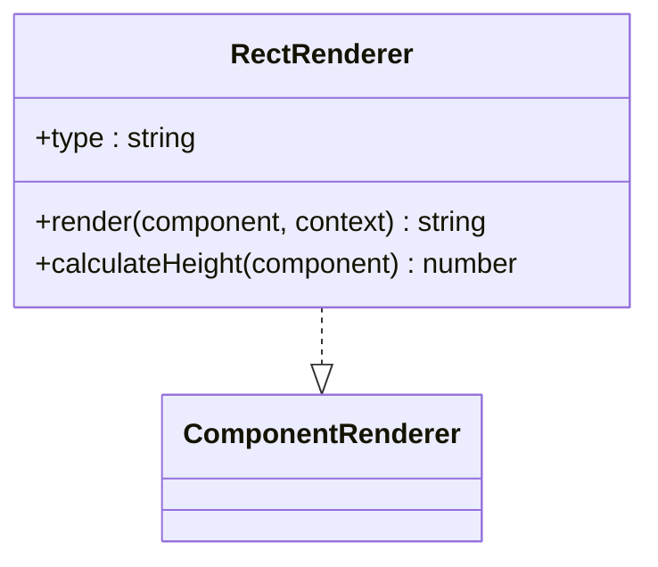

图表来源
- [RectRenderer.ts:10-38](file://sdk/src/printEngine/renderers/RectRenderer.ts#L10-L38)
- [types.ts:57-82](file://sdk/src/printEngine/types.ts#L57-L82)

章节来源
- [RectRenderer.ts:13-37](file://sdk/src/printEngine/renderers/RectRenderer.ts#L13-L37)
- [constants.ts:63-78](file://sdk/src/printEngine/constants.ts#L63-L78)

### 线条组件渲染器 LineRenderer
- 功能要点
  - 通过容器 flex 居中，内部使用 border 实现水平/垂直线条。
  - 双层结构，calculateHeight 返回容器高度。
- 关键实现路径
  - [render 方法:13-50](file://sdk/src/printEngine/renderers/LineRenderer.ts#L13-L50)
  - [calculateHeight 方法:53-57](file://sdk/src/printEngine/renderers/LineRenderer.ts#L53-L57)

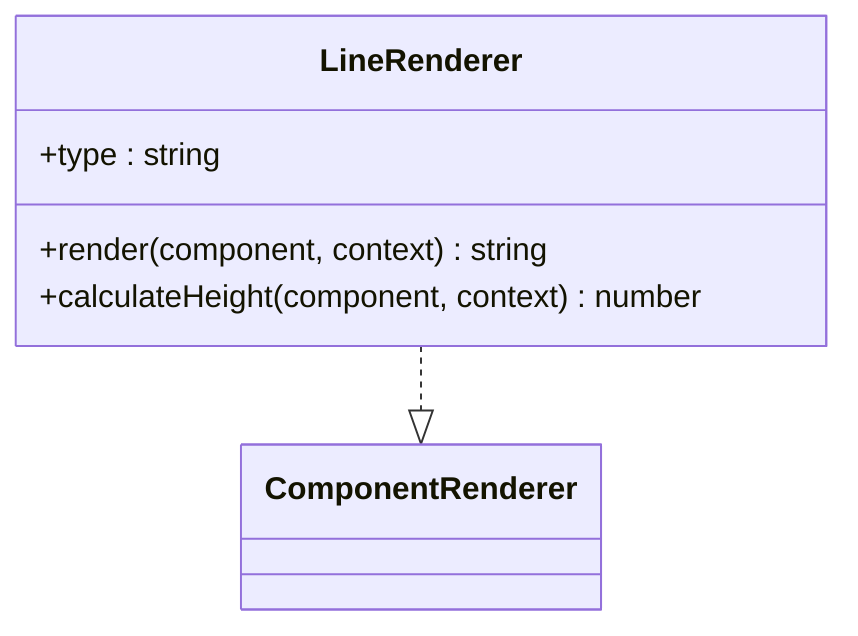

图表来源
- [LineRenderer.ts:10-58](file://sdk/src/printEngine/renderers/LineRenderer.ts#L10-L58)
- [types.ts:57-82](file://sdk/src/printEngine/types.ts#L57-L82)

章节来源
- [LineRenderer.ts:13-57](file://sdk/src/printEngine/renderers/LineRenderer.ts#L13-L57)
- [constants.ts:29-46](file://sdk/src/printEngine/constants.ts#L29-L46)

### 页码组件渲染器 PageNumberRenderer
- 功能要点
  - 支持 simple/text/slash 三种格式，可配置对齐、前后缀与分隔符。
  - 通过 _currentPage/_totalPages 注入当前页与总页数。
  - HTML 转义防止注入风险。
- 关键实现路径
  - [render 方法:17-56](file://sdk/src/printEngine/renderers/PageNumberRenderer.ts#L17-L56)
  - [formatPageNumber 方法:66-94](file://sdk/src/printEngine/renderers/PageNumberRenderer.ts#L66-L94)
  - [calculateHeight 方法:59-61](file://sdk/src/printEngine/renderers/PageNumberRenderer.ts#L59-L61)

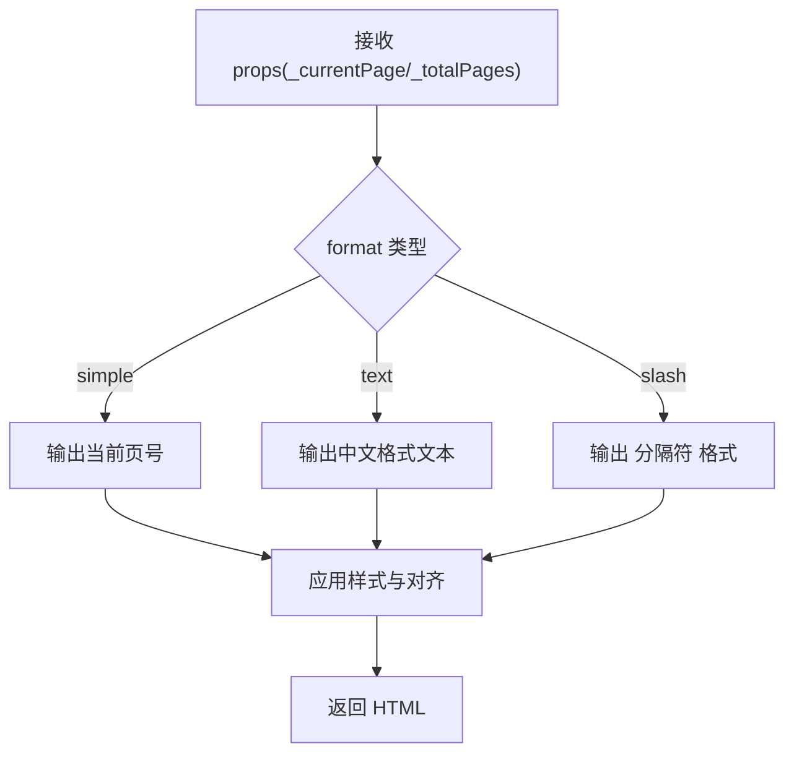

图表来源
- [PageNumberRenderer.ts:66-94](file://sdk/src/printEngine/renderers/PageNumberRenderer.ts#L66-L94)
- [PageNumberRenderer.ts:17-56](file://sdk/src/printEngine/renderers/PageNumberRenderer.ts#L17-L56)

章节来源
- [PageNumberRenderer.ts:17-104](file://sdk/src/printEngine/renderers/PageNumberRenderer.ts#L17-L104)

## 依赖关系分析
- 渲染器依赖
  - 统一接口：ComponentRenderer
  - 渲染上下文：RenderContext
  - 样式工具：buildStyleString、buildPositionStyle
  - 常量：MM_TO_PX、默认尺寸与样式默认值
  - 管道：registry 提供执行器注册与执行
- 渲染器导出
  - 通过 renderers/index.ts 汇总导出，便于上层按需引入与扩展

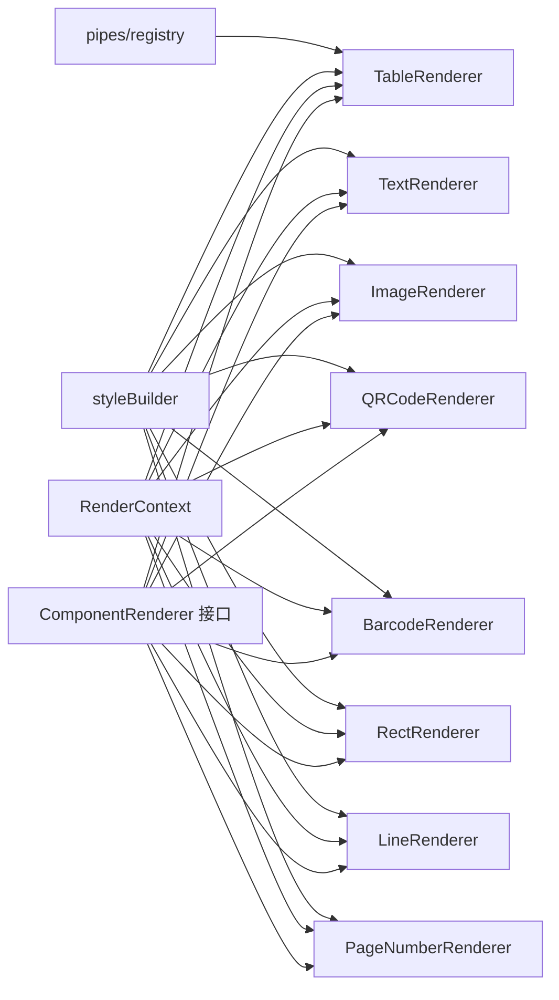

图表来源
- [renderers/index.ts:5-12](file://sdk/src/printEngine/renderers/index.ts#L5-L12)
- [types.ts:57-82](file://sdk/src/printEngine/types.ts#L57-L82)
- [styleBuilder.ts:13-53](file://sdk/src/printEngine/utils/styleBuilder.ts#L13-L53)
- [registry.ts:44-52](file://sdk/src/pipes/registry.ts#L44-L52)

章节来源
- [renderers/index.ts:5-12](file://sdk/src/printEngine/renderers/index.ts#L5-L12)
- [types.ts:57-82](file://sdk/src/printEngine/types.ts#L57-L82)
- [styleBuilder.ts:13-53](file://sdk/src/printEngine/utils/styleBuilder.ts#L13-L53)
- [registry.ts:44-52](file://sdk/src/pipes/registry.ts#L44-L52)

## 性能考虑
- 渲染器职责单一，避免在 render 中做重型计算，将复杂逻辑下沉至工具函数或分页阶段。
- 使用内存 canvas 生成二维码/条形码，避免 DOM 插入与异步等待，减少主线程阻塞。
- 表格列宽计算与合计使用 Decimal.js 保证精度，避免浮点误差累积。
- 样式构建采用对象合并与字符串拼接，尽量减少重复计算与 DOM 查询。
- 通过 calculateHeight 提供估算高度，配合分页引擎进行更精确的高度测量与裁剪。

## 故障排查指南
- 表格溢出与宽度异常
  - 现象：表格右侧超出页边距或宽度过小。
  - 处理：检查 xMm 与 widthMm 的组合，确保不超过右页边距；必要时自动调整宽度。
  - 参考路径：[宽度溢出与警告:195-234](file://sdk/src/printEngine/renderers/TableRenderer.ts#L195-L234)
- 合计计算错误
  - 现象：合计结果异常或报错。
  - 处理：确认数据路径与列定义；检查管道执行器是否存在；查看错误日志。
  - 参考路径：[合计计算与格式化:389-463](file://sdk/src/printEngine/renderers/TableRenderer.ts#L389-L463)
- 二维码/条形码生成失败
  - 现象：渲染占位图而非图片。
  - 处理：检查输入内容与格式；确认外部库可用；查看控制台错误。
  - 参考路径：[二维码渲染:32-56](file://sdk/src/printEngine/renderers/QRCodeRenderer.ts#L32-L56)、[条形码渲染:34-56](file://sdk/src/printEngine/renderers/BarcodeRenderer.ts#L34-L56)
- 管道执行缺失
  - 现象：管道类型未找到，返回原值并告警。
  - 处理：确认管道已注册；核对类型名称与选项。
  - 参考路径：[管道执行:44-52](file://sdk/src/pipes/registry.ts#L44-L52)

章节来源
- [TableRenderer.ts:195-234](file://sdk/src/printEngine/renderers/TableRenderer.ts#L195-L234)
- [TableRenderer.ts:389-463](file://sdk/src/printEngine/renderers/TableRenderer.ts#L389-L463)
- [QRCodeRenderer.ts:32-56](file://sdk/src/printEngine/renderers/QRCodeRenderer.ts#L32-L56)
- [BarcodeRenderer.ts:34-56](file://sdk/src/printEngine/renderers/BarcodeRenderer.ts#L34-L56)
- [registry.ts:44-52](file://sdk/src/pipes/registry.ts#L44-L52)

## 结论
渲染引擎以 ComponentRenderer 接口为核心，结合 RenderContext 与样式工具，实现了高度可扩展的组件渲染体系。表格渲染器在列宽计算、合计与跨页重复表头方面具备完善的工程化实现；二维码/条形码渲染器通过内存 canvas 保障同步生成与性能；管道系统贯穿数据转换，提升模板表达力。建议在扩展新组件时遵循统一接口、复用样式工具与常量配置，并在复杂场景下提供 calculateHeight 估算与健壮的错误处理。

## 附录
- 扩展开发指南
  - 新增渲染器步骤
    - 实现 ComponentRenderer 接口，定义 type 与 render/calculateHeight。
    - 在 renderers/index.ts 中导出新渲染器。
    - 如涉及样式，优先使用 styleBuilder 与 constants。
    - 如需管道支持，在 pipes/registry.ts 中注册执行器并在渲染器中调用。
  - 最佳实践
    - 渲染器保持纯函数式，避免副作用。
    - 对外暴露的属性与配置使用 types.ts 中的类型约束。
    - 对用户输入进行安全处理（如表格 HTML 转义）。
    - 为复杂计算提供单元测试与边界条件覆盖。
- 生命周期与调用流程
  - 调用方根据组件类型选择渲染器实例。
  - 渲染器读取布局、样式、绑定与属性，结合 RenderContext 完成数据解析与管道应用。
  - 输出 HTML 字符串；如需要，使用 calculateHeight 提供高度估算。
- 渲染性能优化与内存管理
  - 优先使用内存 canvas 生成图形类内容。
  - 避免在渲染循环中创建大量临时对象，复用样式构建结果。
  - 对大数据表格采用分页与延迟渲染策略，减少一次性渲染压力。