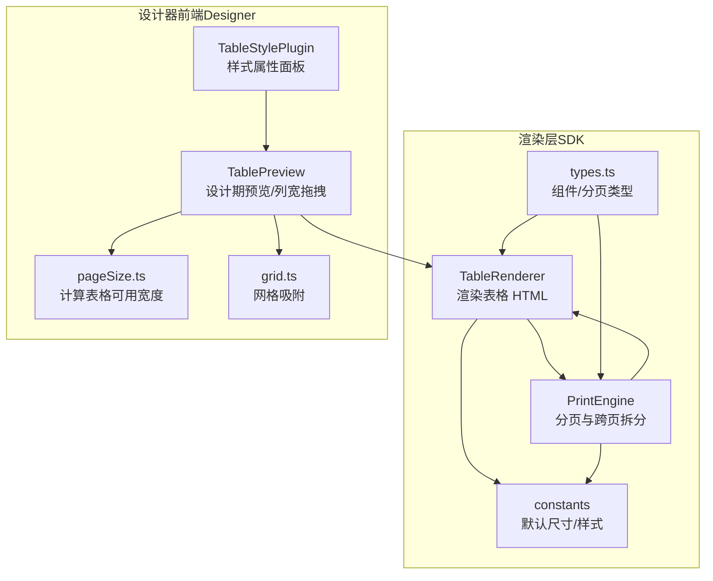
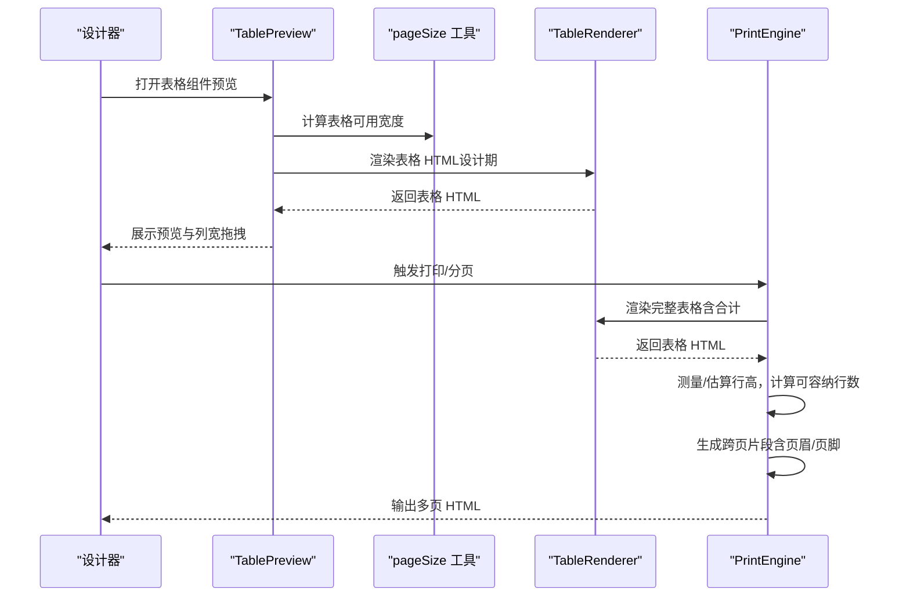
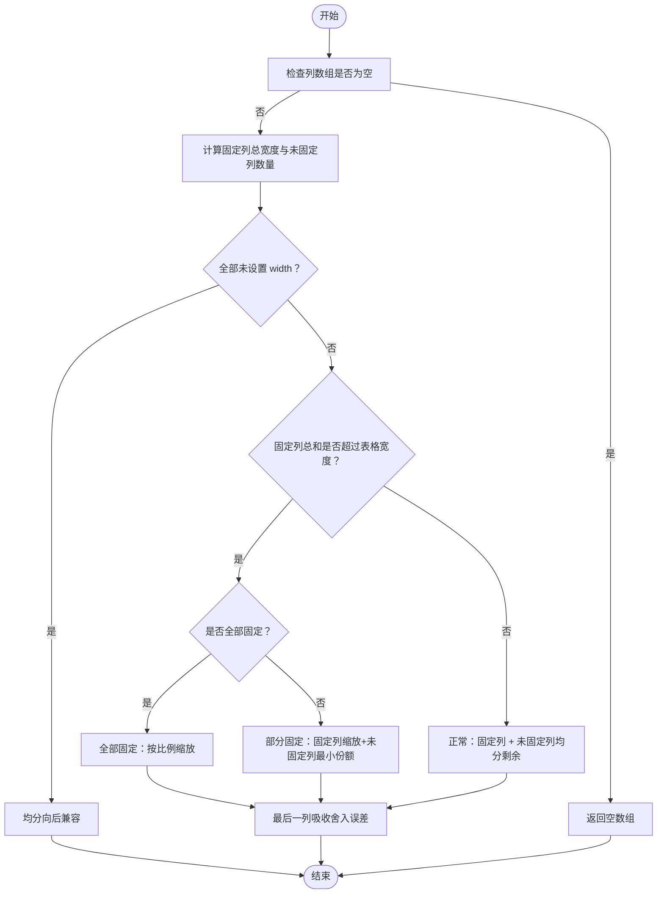
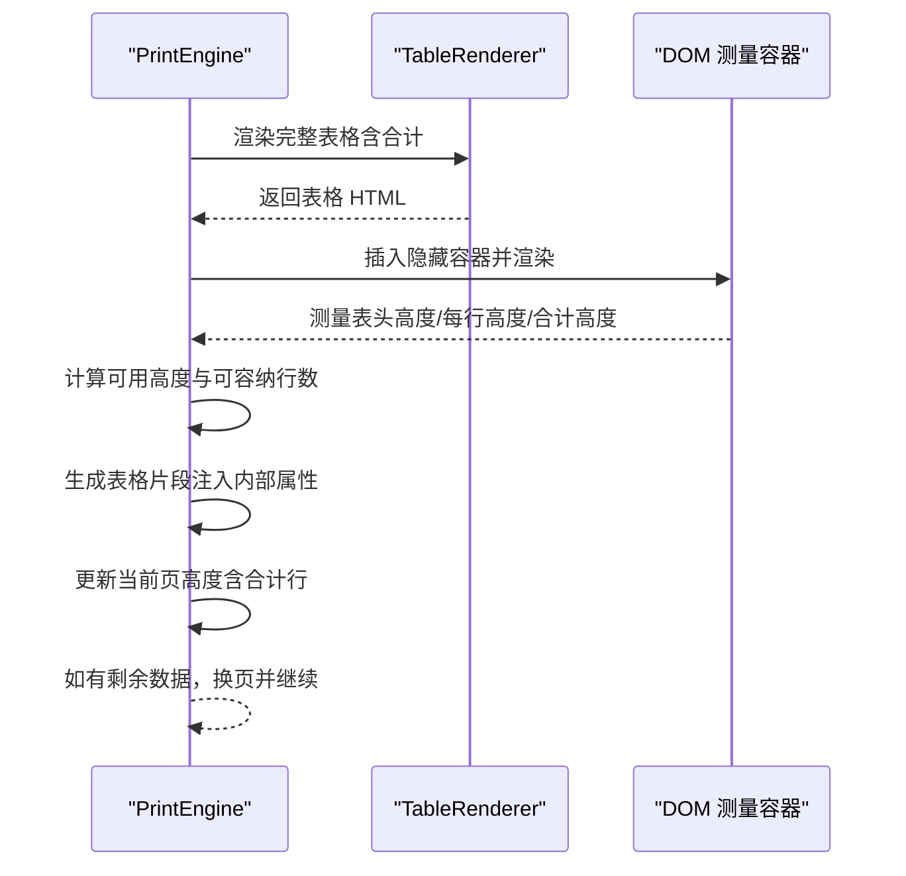
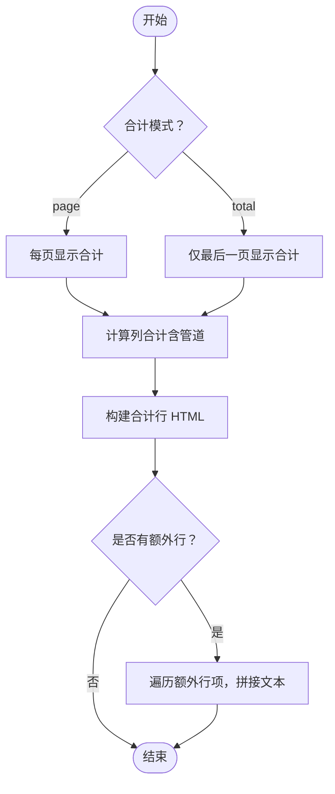
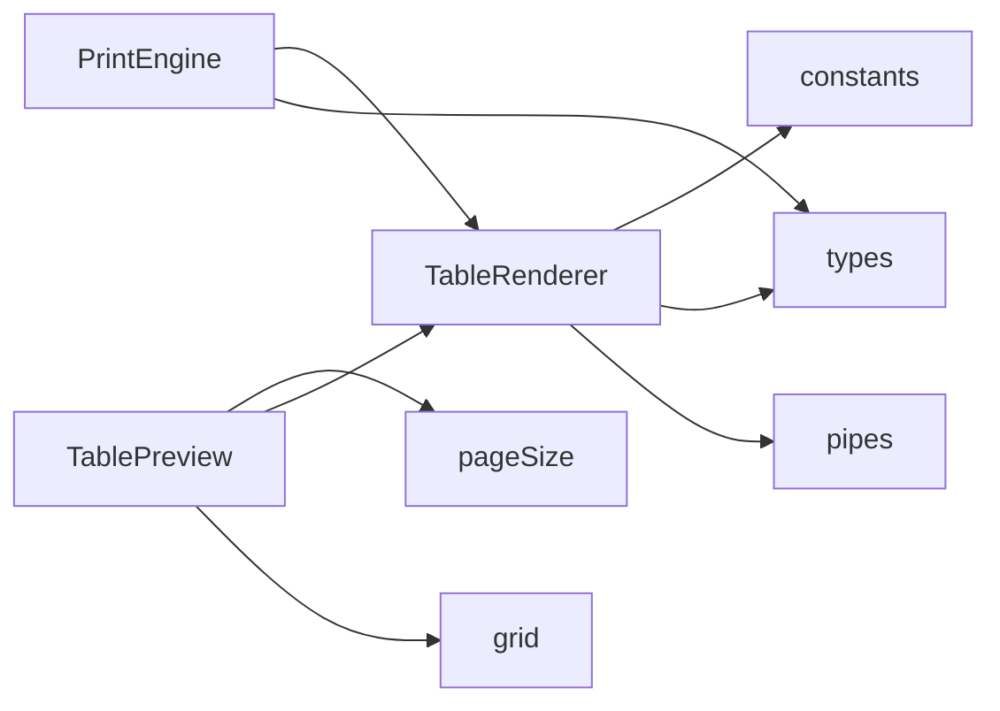

# 表格处理系统

<cite>
**本文引用的文件**
- [TableRenderer.ts](file://sdk/src/printEngine/renderers/TableRenderer.ts)
- [printEngine.ts](file://sdk/src/printEngine.ts)
- [constants.ts](file://sdk/src/printEngine/constants.ts)
- [types.ts](file://sdk/src/printEngine/types.ts)
- [types.ts](file://sdk/src/types.ts)
- [TablePreview.tsx](file://designer/src/pages/Designer/components/Canvas/componentRenderers/TablePreview.tsx)
- [TableStylePlugin.tsx](file://designer/src/pages/Designer/components/PropertyPanel/stylePlugins/TableStylePlugin.tsx)
- [pageSize.ts](file://designer/src/utils/pageSize.ts)
- [grid.ts](file://designer/src/utils/grid.ts)
</cite>

## 目录
1. [简介](#简介)
2. [项目结构](#项目结构)
3. [核心组件](#核心组件)
4. [架构总览](#架构总览)
5. [详细组件分析](#详细组件分析)
6. [依赖关系分析](#依赖关系分析)
7. [性能考量](#性能考量)
8. [故障排查指南](#故障排查指南)
9. [结论](#结论)
10. [附录](#附录)

## 简介
本文件面向“表格处理系统”，聚焦以下目标：
- 表格组件的复杂渲染逻辑：单元格布局算法、行高计算、列宽分配机制
- 表格跨页拆分：断点选择策略、内容分割算法、页眉页脚处理
- 渲染性能优化：虚拟滚动、增量渲染、缓存策略
- 样式定制与响应式设计
- 常见问题与解决方案

## 项目结构
围绕表格处理的关键模块分布如下：
- 渲染层（SDK）：TableRenderer 负责将表格组件渲染为 HTML；printEngine 负责分页与跨页拆分
- 设计器前端（Designer）：TablePreview 提供设计期预览与列宽拖拽；TableStylePlugin 提供样式属性面板
- 工具与常量：constants 定义默认尺寸与样式；types 定义组件与分页类型；pageSize/grid 提供页面宽度与网格吸附

**图表来源**
- [TableRenderer.ts:147-601](file://sdk/src/printEngine/renderers/TableRenderer.ts#L147-L601)
- [printEngine.ts:498-1096](file://sdk/src/printEngine.ts#L498-L1096)
- [constants.ts:1-113](file://sdk/src/printEngine/constants.ts#L1-L113)
- [types.ts:1-116](file://sdk/src/printEngine/types.ts#L1-L116)
- [TablePreview.tsx:1-175](file://designer/src/pages/Designer/components/Canvas/componentRenderers/TablePreview.tsx#L1-L175)
- [TableStylePlugin.tsx:1-48](file://designer/src/pages/Designer/components/PropertyPanel/stylePlugins/TableStylePlugin.tsx#L1-L48)
- [pageSize.ts:1-50](file://designer/src/utils/pageSize.ts#L1-L50)
- [grid.ts:1-36](file://designer/src/utils/grid.ts#L1-L36)

**章节来源**
- [TableRenderer.ts:147-601](file://sdk/src/printEngine/renderers/TableRenderer.ts#L147-L601)
- [printEngine.ts:498-1096](file://sdk/src/printEngine.ts#L498-L1096)
- [constants.ts:1-113](file://sdk/src/printEngine/constants.ts#L1-L113)
- [types.ts:1-116](file://sdk/src/printEngine/types.ts#L1-L116)
- [TablePreview.tsx:1-175](file://designer/src/pages/Designer/components/Canvas/componentRenderers/TablePreview.tsx#L1-L175)
- [TableStylePlugin.tsx:1-48](file://designer/src/pages/Designer/components/PropertyPanel/stylePlugins/TableStylePlugin.tsx#L1-L48)
- [pageSize.ts:1-50](file://designer/src/utils/pageSize.ts#L1-L50)
- [grid.ts:1-36](file://designer/src/utils/grid.ts#L1-L36)

## 核心组件
- 表格渲染器（TableRenderer）
  - 负责根据组件配置与数据生成表格 HTML，包含表头、表体、合计行与额外行
  - 实现列宽分配算法，支持固定宽度、自动分配与溢出缩放
  - 支持序号列、对齐方式、边框样式等
- 打印引擎（PrintEngine）
  - 负责整体分页与表格跨页拆分，使用测量与估算相结合的方式确定行高
  - 支持 repeatHeader、合计行模式（page/total）、安全边距与防御性回退
- 设计器预览（TablePreview）
  - 设计期预览表格，支持列宽拖拽与实时宽度反馈
  - 与 pageSize 工具保持表格可用宽度计算一致性
- 样式插件（TableStylePlugin）
  - 提供字体大小、对齐方式等表格样式属性编辑入口

**章节来源**
- [TableRenderer.ts:147-601](file://sdk/src/printEngine/renderers/TableRenderer.ts#L147-L601)
- [printEngine.ts:498-1096](file://sdk/src/printEngine.ts#L498-L1096)
- [TablePreview.tsx:69-175](file://designer/src/pages/Designer/components/Canvas/componentRenderers/TablePreview.tsx#L69-L175)
- [TableStylePlugin.tsx:11-47](file://designer/src/pages/Designer/components/PropertyPanel/stylePlugins/TableStylePlugin.tsx#L11-L47)

## 架构总览
表格处理系统采用“渲染器 + 引擎”的分层架构：
- 渲染器负责将组件节点渲染为 HTML 片段
- 引擎负责分页与跨页拆分，结合测量与估算策略，确保内容不溢出页面
- 设计器提供设计期预览与交互，保证设计与渲染的一致性

**图表来源**
- [TablePreview.tsx:69-175](file://designer/src/pages/Designer/components/Canvas/componentRenderers/TablePreview.tsx#L69-L175)
- [pageSize.ts:27-49](file://designer/src/utils/pageSize.ts#L27-L49)
- [TableRenderer.ts:150-327](file://sdk/src/printEngine/renderers/TableRenderer.ts#L150-L327)
- [printEngine.ts:498-1096](file://sdk/src/printEngine.ts#L498-L1096)

## 详细组件分析

### 表格列宽分配算法
- 场景与规则
  - 全部未设置 width：均分
  - 部分设置 width：固定列用 width，未设置列均分剩余空间
  - 固定列总和超表格宽度：全部固定按比例缩放；部分固定固定列按比例缩放，未固定列分配最小份额
  - 最后一列吸收舍入误差，确保总和严格等于 100%
- 关键实现要点
  - 使用 computeColWidths 计算每列百分比宽度
  - 使用 computeColumnMaxWidth 计算单列最大允许宽度（考虑其他固定列与预留宽度）

**图表来源**
- [TableRenderer.ts:51-125](file://sdk/src/printEngine/renderers/TableRenderer.ts#L51-L125)

**章节来源**
- [TableRenderer.ts:51-125](file://sdk/src/printEngine/renderers/TableRenderer.ts#L51-L125)

### 表格行高计算与列宽分配联动
- 行高策略
  - 表头行高度：固定值乘以 mm→px 比例
  - 数据行最小高度：最小行高 × 行高系数，实际高度由内容自然撑开（min-height）
- 列宽与行高的关系
  - 列宽百分比影响单元格内容排版，从而影响 offsetHeight 的测量
  - 在设计期与渲染期需保持列宽计算一致，避免预览与最终打印不一致

**章节来源**
- [TableRenderer.ts:263-267](file://sdk/src/printEngine/renderers/TableRenderer.ts#L263-L267)
- [constants.ts:51-58](file://sdk/src/printEngine/constants.ts#L51-L58)

### 表格跨页拆分与断点选择
- 流程概览
  - 使用 TableRenderer 渲染完整表格（含合计行）以进行测量
  - 测量表头高度、每行高度与合计行高度
  - 若测量失败或列全部隐藏，回退到估算行高
  - 基于可用高度与行高累加，计算当前页可容纳行数
  - 生成表格片段（tableFragment），注入 _pageData、_showHeader、_isLastPage、_totalData、_startRowIndex 等内部属性
  - 支持 repeatHeader 与合计行模式（page/total），并在必要时预留合计行高度
  - 使用安全边距（约 1mm）避免末行溢出页底
- 防御性回退
  - rowsCanFit 异常小或为 0 时，强制至少放 1 行，避免死循环
  - 若测量行高数量与数据长度不一致，回退到估算行高

**图表来源**
- [printEngine.ts:644-756](file://sdk/src/printEngine.ts#L644-L756)
- [printEngine.ts:824-998](file://sdk/src/printEngine.ts#L824-L998)
- [TableRenderer.ts:150-327](file://sdk/src/printEngine/renderers/TableRenderer.ts#L150-L327)

**章节来源**
- [printEngine.ts:644-756](file://sdk/src/printEngine.ts#L644-L756)
- [printEngine.ts:824-998](file://sdk/src/printEngine.ts#L824-L998)
- [types.ts:88-91](file://sdk/src/types.ts#L88-L91)

### 合计行与额外行渲染
- 合计行
  - 支持 sum/avg/max/min/count 等聚合类型，支持精度、前后缀与管道转换
  - 使用 Decimal.js 避免浮点精度问题
  - 支持 total/page 模式：total 仅最后一页显示，page 每页显示
- 额外行
  - 可引用列的合计值并应用管道链
  - 支持背景色、字重、对齐方式等样式定制

**图表来源**
- [TableRenderer.ts:332-579](file://sdk/src/printEngine/renderers/TableRenderer.ts#L332-L579)

**章节来源**
- [TableRenderer.ts:332-579](file://sdk/src/printEngine/renderers/TableRenderer.ts#L332-L579)

### 设计期表格预览与列宽拖拽
- 预览行为
  - 依据页面配置与组件布局计算表格可用宽度
  - 使用 computeColWidths 与 computeColumnMaxWidth 计算列宽与最大宽度
  - 支持拖拽调整列宽，实时反馈当前宽度
- 交互细节
  - 使用 useColumnResize 管理拖拽状态与提交时机
  - 通过 store.updateComponent 更新列宽，避免频繁写历史记录

**章节来源**
- [TablePreview.tsx:12-108](file://designer/src/pages/Designer/components/Canvas/componentRenderers/TablePreview.tsx#L12-L108)
- [pageSize.ts:27-49](file://designer/src/utils/pageSize.ts#L27-L49)

### 样式定制与响应式设计
- 字体大小与对齐方式
  - 通过 TableStylePlugin 提供字体大小与对齐方式编辑
- 响应式思路
  - 列宽分配基于百分比，适配不同页面宽度
  - 设计期与渲染期列宽计算保持一致，减少预览与打印差异

**章节来源**
- [TableStylePlugin.tsx:11-47](file://designer/src/pages/Designer/components/PropertyPanel/stylePlugins/TableStylePlugin.tsx#L11-L47)
- [TableRenderer.ts:261-261](file://sdk/src/printEngine/renderers/TableRenderer.ts#L261-L261)

## 依赖关系分析
- 渲染器依赖
  - constants：默认尺寸与样式
  - types：组件与分页类型定义
  - pipes：合计值管道执行
- 引擎依赖
  - TableRenderer：渲染 HTML 以进行测量
  - types：分页项与页面层级定义
- 设计器依赖
  - TablePreview：预览与交互
  - pageSize：表格可用宽度计算
  - grid：网格吸附

**图表来源**
- [TableRenderer.ts:1-11](file://sdk/src/printEngine/renderers/TableRenderer.ts#L1-L11)
- [printEngine.ts:1-20](file://sdk/src/printEngine.ts#L1-L20)
- [TablePreview.tsx:1-6](file://designer/src/pages/Designer/components/Canvas/componentRenderers/TablePreview.tsx#L1-L6)

**章节来源**
- [TableRenderer.ts:1-11](file://sdk/src/printEngine/renderers/TableRenderer.ts#L1-L11)
- [printEngine.ts:1-20](file://sdk/src/printEngine.ts#L1-L20)
- [TablePreview.tsx:1-6](file://designer/src/pages/Designer/components/Canvas/componentRenderers/TablePreview.tsx#L1-L6)

## 性能考量
- 渲染阶段
  - 列宽计算为纯数学运算，时间复杂度 O(n)，空间复杂度 O(n)
  - 表格 HTML 生成为字符串拼接，避免 DOM 操作
- 分页阶段
  - 测量阶段插入隐藏容器并渲染完整表格，随后测量 offsetHeight
  - 若测量失败或列全部隐藏，回退到估算行高，避免阻塞
  - rowsCanFit 异常时的防御性回退，防止死循环
- 交互阶段
  - 列宽拖拽仅更新本地状态，mouseup 时一次性提交，降低写历史成本

**章节来源**
- [TableRenderer.ts:51-125](file://sdk/src/printEngine/renderers/TableRenderer.ts#L51-L125)
- [printEngine.ts:644-756](file://sdk/src/printEngine.ts#L644-L756)
- [printEngine.ts:860-872](file://sdk/src/printEngine.ts#L860-L872)
- [TablePreview.tsx:36-61](file://designer/src/pages/Designer/components/Canvas/componentRenderers/TablePreview.tsx#L36-L61)

## 故障排查指南
- 表格宽度溢出
  - 现象：控制台警告“表格宽度溢出”
  - 原因：xMm + widthMm 超过右页边距
  - 处理：自动调整宽度或手动调整 x 位置
- 表格位置错误
  - 现象：控制台错误“表格位置错误：xMm 已超过右页边距”
  - 原因：xMm 不可超过右页边距
  - 处理：调整组件 x 位置
- 表格宽度过小
  - 现象：控制台警告“表格宽度过小，强制设置为最小宽度 10mm”
  - 处理：增大列宽或减少列数
- 合计计算错误
  - 现象：控制台错误“合计计算错误”或“格式化合计结果失败”
  - 处理：检查数据类型与管道配置，确保可转为数字
- 测量结果异常
  - 现象：控制台警告“表格测量结果异常：rowHeights.length != tableData.length”
  - 处理：检查列是否全部隐藏，回退到估算行高
- rowsCanFit 异常
  - 现象：rowsCanFit 异常小或为 0 导致死循环风险
  - 处理：防御性回退，强制至少放 1 行

**章节来源**
- [TableRenderer.ts:196-228](file://sdk/src/printEngine/renderers/TableRenderer.ts#L196-L228)
- [TableRenderer.ts:429-462](file://sdk/src/printEngine/renderers/TableRenderer.ts#L429-L462)
- [printEngine.ts:805-814](file://sdk/src/printEngine.ts#L805-L814)
- [printEngine.ts:860-872](file://sdk/src/printEngine.ts#L860-L872)
- [printEngine.ts:915-935](file://sdk/src/printEngine.ts#L915-L935)

## 结论
本系统通过“渲染器 + 引擎”的架构实现了：
- 精确的列宽分配与行高计算
- 稳健的跨页拆分与页眉页脚处理
- 设计期与渲染期一致性的保障
- 合计行与额外行的灵活扩展
建议在大规模数据场景下进一步引入虚拟滚动与增量渲染，以提升交互与渲染性能。

## 附录
- 关键类型与常量
  - 表格默认尺寸与样式：[constants.ts:51-92](file://sdk/src/printEngine/constants.ts#L51-L92)
  - 组件与分页类型：[types.ts:1-116](file://sdk/src/printEngine/types.ts#L1-L116), [types.ts:132-183](file://sdk/src/types.ts#L132-L183)
- 渲染与分页流程
  - 表格渲染：[TableRenderer.ts:150-327](file://sdk/src/printEngine/renderers/TableRenderer.ts#L150-L327)
  - 跨页拆分：[printEngine.ts:498-998](file://sdk/src/printEngine.ts#L498-L998)