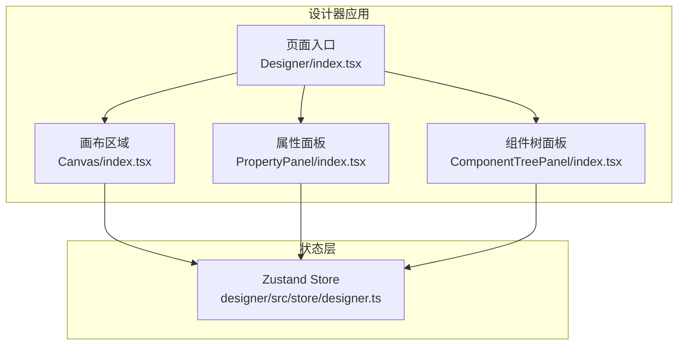
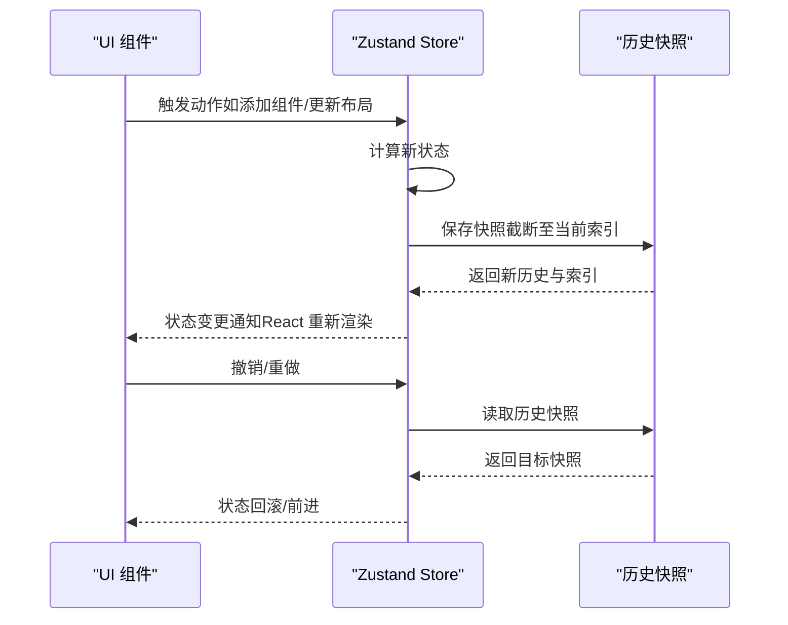
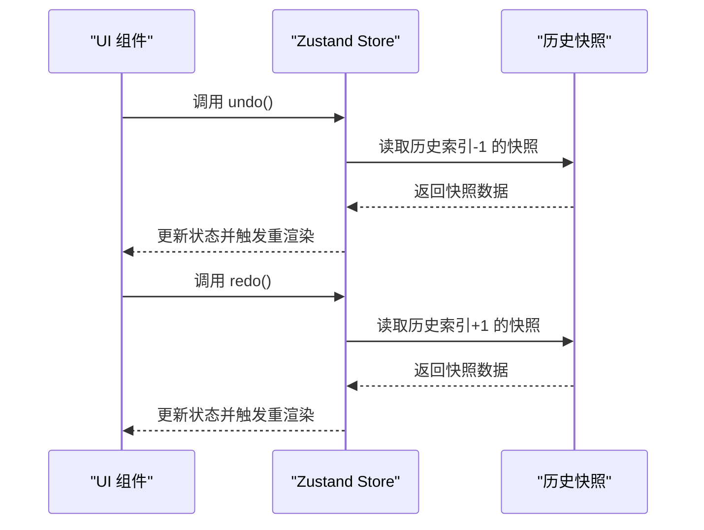
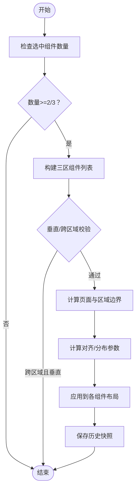
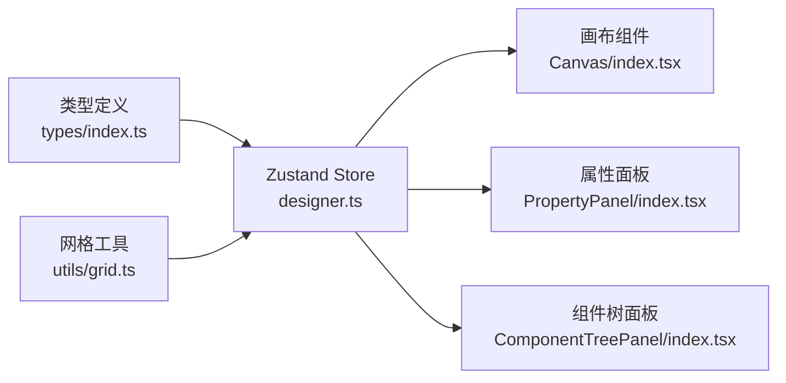

# 状态管理设计

<cite>
**本文引用的文件**
- [designer.ts](file://designer/src/store/designer.ts)
- [index.tsx](file://designer/src/pages/Designer/index.tsx)
- [index.tsx](file://designer/src/pages/Designer/components/Canvas/index.tsx)
- [index.tsx](file://designer/src/pages/Designer/components/PropertyPanel/index.tsx)
- [index.tsx](file://designer/src/pages/Designer/components/ComponentTreePanel/index.tsx)
- [index.ts](file://designer/src/types/index.ts)
- [grid.ts](file://designer/src/utils/grid.ts)
- [index.tsx](file://designer/src/pages/Designer/components/Canvas/ShortcutHint.tsx)
</cite>

## 目录
1. [引言](#引言)
2. [项目结构](#项目结构)
3. [核心组件](#核心组件)
4. [架构总览](#架构总览)
5. [详细组件分析](#详细组件分析)
6. [依赖分析](#依赖分析)
7. [性能考虑](#性能考虑)
8. [故障排查指南](#故障排查指南)
9. [结论](#结论)
10. [附录](#附录)

## 引言
本设计文档围绕设计器的状态管理进行系统性阐述，重点说明以下方面：
- Zustand 的选型理由与使用策略
- 设计器状态模型设计：组件操作状态、撤销/重做机制、网格对齐状态等
- 状态管理的模块化与分片策略
- 状态更新的响应式机制与性能优化
- 状态持久化与恢复机制的设计思路
- 最佳实践与常见问题解决方案

## 项目结构
设计器采用“单仓库多页面”的组织方式，状态管理集中于 Zustand Store，UI 组件通过 React Hooks 订阅状态变化，形成清晰的“状态-视图”映射。

图表来源
- [index.tsx:17-24](file://designer/src/pages/Designer/index.tsx#L17-L24)
- [index.tsx:22-65](file://designer/src/pages/Designer/components/Canvas/index.tsx#L22-L65)
- [index.tsx:17-24](file://designer/src/pages/Designer/components/PropertyPanel/index.tsx#L17-L24)
- [index.tsx:66-83](file://designer/src/pages/Designer/components/ComponentTreePanel/index.tsx#L66-L83)
- [designer.ts:108-106](file://designer/src/store/designer.ts#L108-L106)

章节来源
- [index.tsx:1-24](file://designer/src/pages/Designer/index.tsx#L1-L24)
- [designer.ts:108-106](file://designer/src/store/designer.ts#L108-L106)

## 核心组件
- Zustand Store：集中管理设计器全局状态，提供组件增删改、选择、复制粘贴、撤销/重做、网格/缩放、层级管理、对齐与分布等能力。
- 类型系统：通过 TypeScript 接口定义组件节点、页面配置、打印模板等核心数据结构，确保状态模型强类型约束。
- UI 组件：画布、属性面板、组件树面板等订阅 Store 并触发相应 Action。

章节来源
- [designer.ts:9-90](file://designer/src/store/designer.ts#L9-L90)
- [index.ts:303-358](file://designer/src/types/index.ts#L303-L358)

## 架构总览
Zustand 以“函数式 Store + 函数式 Action”为核心，结合“全量快照 + 历史索引”的撤销/重做机制，实现设计器复杂交互的可追踪与可恢复。

图表来源
- [designer.ts:93-106](file://designer/src/store/designer.ts#L93-L106)
- [designer.ts:511-548](file://designer/src/store/designer.ts#L511-L548)

## 详细组件分析

### Zustand 选型与使用策略
- 选型理由
  - 轻量、零样板代码：Store 以函数形式定义，Action 直接修改状态，便于快速迭代
  - 无需 Provider 包装：直接导入 Hook 使用，降低上下文复杂度
  - 与 React 生态无缝集成：自动订阅与渲染优化
- 使用策略
  - 单一 Store：将所有设计器状态收敛在一个 Store 中，避免跨 Store 同步成本
  - 动作内聚合：同一交互产生的多次状态变更在单个 set 回调中完成，保证原子性
  - 历史快照：对关键操作统一保存全量快照，简化撤销/重做的实现

章节来源
- [designer.ts:108-106](file://designer/src/store/designer.ts#L108-L106)

### 设计器状态模型设计
- 组件操作状态
  - 组件集合：内容区、页头区、页脚区三类组件列表，支持增删改查与区域间移动
  - 选择状态：单选与多选，维护选中组件 ID 与选中集合
- 撤销/重做机制
  - 全量快照：每次状态变更保存 headerComponents、components、footerComponents 的深拷贝
  - 历史索引：记录当前快照位置，支持向前/向后遍历
  - 步数限制：最多保留固定步数的历史，避免内存膨胀
- 网格与缩放
  - 网格：开关与网格步长，拖拽与复制粘贴时自动吸附
  - 缩放：百分比缩放，限制最小/最大值，提供放大/缩小/重置
- 对齐与分布
  - 对齐：左对齐、右对齐、顶部/底部对齐、水平/垂直居中
  - 分布：水平/垂直均匀分布，跨区域限制
- 层级管理
  - 置顶/置底、上移/下移，区域感知，保持同区域内的顺序一致性
- 模板与页面配置
  - 模板信息：模板 ID、名称、Schema ID
  - 页面配置：尺寸、方向、边距、页码、页头/页脚开关与高度

章节来源
- [designer.ts:9-90](file://designer/src/store/designer.ts#L9-L90)
- [designer.ts:108-772](file://designer/src/store/designer.ts#L108-L772)
- [index.ts:91-123](file://designer/src/types/index.ts#L91-L123)
- [index.ts:303-331](file://designer/src/types/index.ts#L303-L331)

### 状态分片与模块化设计
- 分片策略
  - 按功能域划分：组件集合、选择状态、模板与页面配置、网格/缩放、对齐/分布、层级、历史
  - 区域感知：headerComponents/components/footerComponents 三区分离，避免跨区误操作
- 模块化
  - Store 作为单一事实源，UI 组件通过 Hook 订阅所需字段，减少跨组件通信
  - 工具函数（如网格吸附）与 Store 解耦，便于复用与测试

章节来源
- [designer.ts:108-772](file://designer/src/store/designer.ts#L108-L772)

### 响应式机制与性能优化
- 响应式机制
  - Zustand 自动追踪依赖，仅在被订阅的状态字段变化时触发组件重渲染
  - 通过局部状态切片（如仅订阅 selectedComponentIds）降低渲染范围
- 性能优化
  - 全量快照保存：在动作内部一次性 set，避免中间态渲染
  - 历史截断：超过上限时移除最早快照，维持固定内存占用
  - 深拷贝限制：仅对需要持久化的组件列表进行 JSON 深拷贝，避免对大型对象重复拷贝
  - 网格吸附：在复制/粘贴与拖拽过程中按需计算，避免频繁重排

章节来源
- [designer.ts:93-106](file://designer/src/store/designer.ts#L93-L106)
- [designer.ts:275-307](file://designer/src/store/designer.ts#L275-L307)
- [grid.ts](file://designer/src/utils/grid.ts)

### 状态持久化与恢复机制
- 设计思路
  - 模板持久化：通过生成完整模板 JSON，包含页面配置与三区组件，便于存储与传输
  - 加载兼容：对旧模板的页头/页脚高度进行推断与兼容处理
  - 会话级 UI 状态：如快捷键提示的可见性，使用 sessionStorage 进行会话级持久化
- 恢复流程
  - 从模板加载时，重建三区组件与页面配置，并清空历史以避免与当前编辑冲突
  - 撤销/重做基于 Store 内部历史，与模板持久化解耦

章节来源
- [designer.ts:189-250](file://designer/src/store/designer.ts#L189-L250)
- [designer.ts:508-548](file://designer/src/store/designer.ts#L508-L548)
- [index.tsx:11-30](file://designer/src/pages/Designer/components/Canvas/ShortcutHint.tsx#L11-L30)

### API/服务组件调用序列（示例：撤销/重做）

图表来源
- [designer.ts:511-548](file://designer/src/store/designer.ts#L511-L548)

### 复杂逻辑组件（对齐与分布）流程图

图表来源
- [designer.ts:551-703](file://designer/src/store/designer.ts#L551-L703)
- [designer.ts:705-771](file://designer/src/store/designer.ts#L705-L771)

## 依赖分析
- Store 依赖
  - 类型定义：组件节点、页面配置、打印模板等接口
  - 工具函数：网格吸附
- UI 依赖
  - 画布：订阅组件集合、选择状态、网格/缩放、对齐/分布、层级管理
  - 属性面板：订阅选中组件与页面配置，触发更新
  - 组件树面板：订阅三区组件与选择状态，支持删除与复制

图表来源
- [index.ts:303-358](file://designer/src/types/index.ts#L303-L358)
- [designer.ts:1-4](file://designer/src/store/designer.ts#L1-L4)
- [index.tsx:22-65](file://designer/src/pages/Designer/components/Canvas/index.tsx#L22-L65)
- [index.tsx:17-24](file://designer/src/pages/Designer/components/PropertyPanel/index.tsx#L17-L24)
- [index.tsx:66-83](file://designer/src/pages/Designer/components/ComponentTreePanel/index.tsx#L66-L83)

章节来源
- [index.ts:303-358](file://designer/src/types/index.ts#L303-L358)
- [designer.ts:1-4](file://designer/src/store/designer.ts#L1-L4)
- [index.tsx:22-65](file://designer/src/pages/Designer/components/Canvas/index.tsx#L22-L65)
- [index.tsx:17-24](file://designer/src/pages/Designer/components/PropertyPanel/index.tsx#L17-L24)
- [index.tsx:66-83](file://designer/src/pages/Designer/components/ComponentTreePanel/index.tsx#L66-L83)

## 性能考虑
- 状态粒度：将三区组件拆分为独立数组，避免单一大对象导致的全量重渲染
- 历史上限：限制最大历史步数，防止内存增长
- 深拷贝范围：仅对组件列表进行深拷贝，减少序列化成本
- 渲染优化：通过局部订阅与不可变更新，降低不必要的重渲染

## 故障排查指南
- 撤销/重做无效
  - 检查历史索引是否越界；确认动作是否正确保存快照
- 跨区域对齐/分布失败
  - 垂直方向与跨区域对齐/分布被显式禁止，需在同一区域内选择多个组件
- 网格吸附异常
  - 确认网格开关与网格步长设置；检查吸附函数是否被正确调用
- 缩放异常
  - 确认缩放值在允许范围内；检查放大/缩小/重置动作是否被调用
- 模板加载后布局错乱
  - 检查旧模板兼容逻辑（页头/页脚高度推断）是否生效

章节来源
- [designer.ts:543-548](file://designer/src/store/designer.ts#L543-L548)
- [designer.ts:561-570](file://designer/src/store/designer.ts#L561-L570)
- [designer.ts:347-358](file://designer/src/store/designer.ts#L347-L358)
- [designer.ts:508-548](file://designer/src/store/designer.ts#L508-L548)
- [designer.ts:203-250](file://designer/src/store/designer.ts#L203-L250)

## 结论
本设计以 Zustand 为核心，构建了面向设计器的统一状态模型。通过区域化三区组件、全量快照撤销/重做、网格/缩放/对齐/分布等能力，实现了高可用的可视化编辑体验。配合严格的类型约束与模块化设计，状态管理具备良好的扩展性与可维护性。

## 附录
- 最佳实践
  - 将复杂交互封装为单一动作，确保状态变更原子性
  - 严格区分 UI 状态与业务状态，UI 状态使用 sessionStorage，业务状态使用 Store
  - 对历史快照进行上限控制，避免内存泄漏
- 常见问题
  - 跨区域对齐/分布：仅在同一区域内执行
  - 表格组件区域限制：表格不允许放入页头/页脚
  - 模板兼容：加载旧模板时自动推断页头/页脚高度