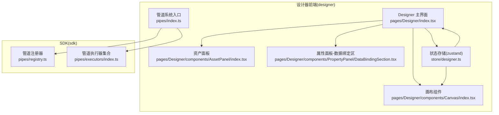
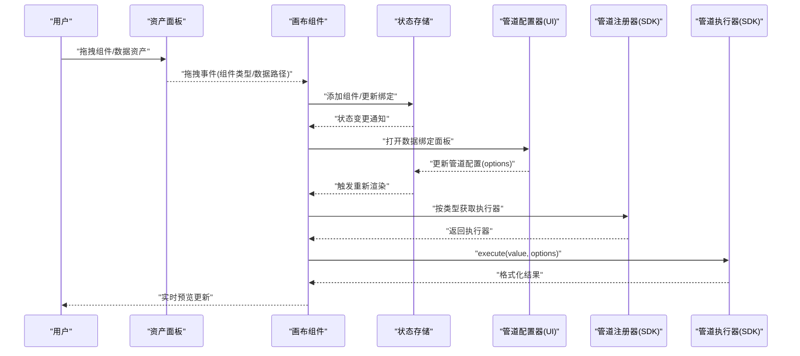
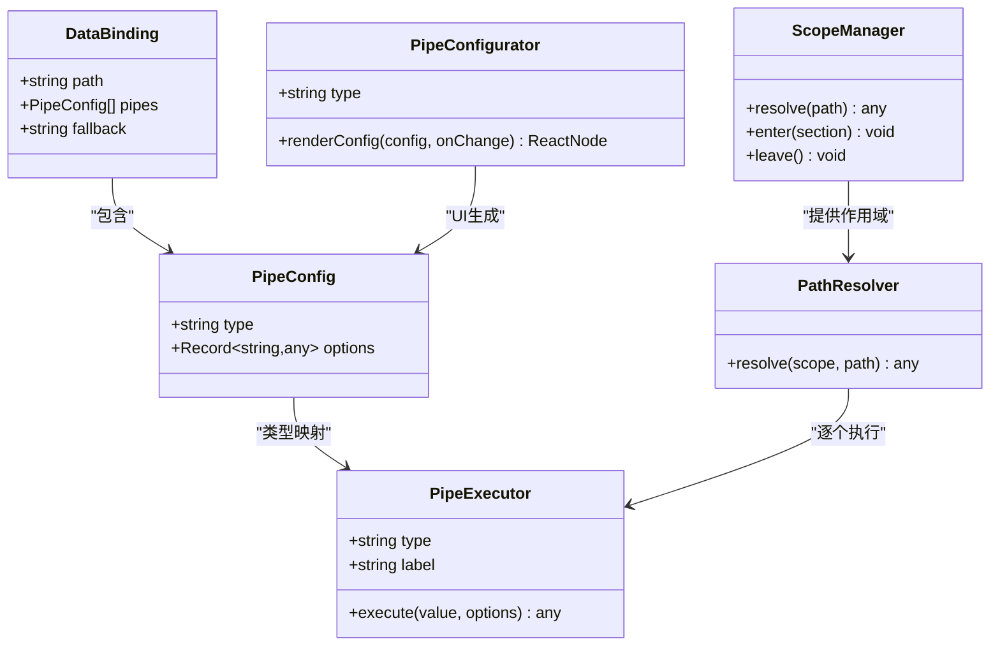
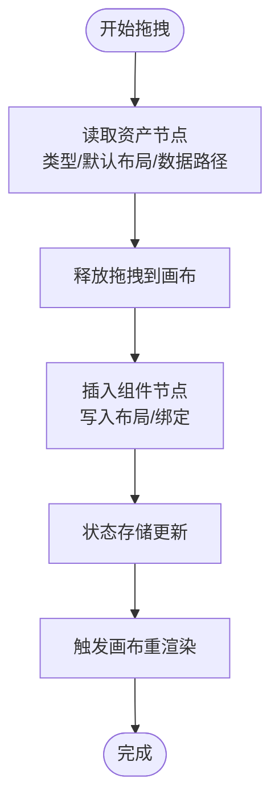
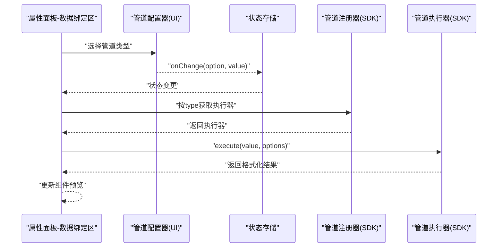
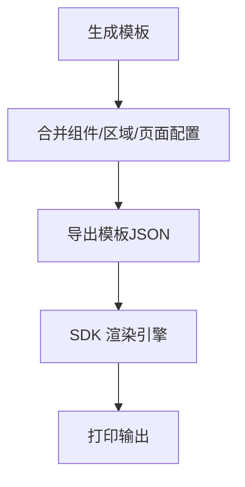
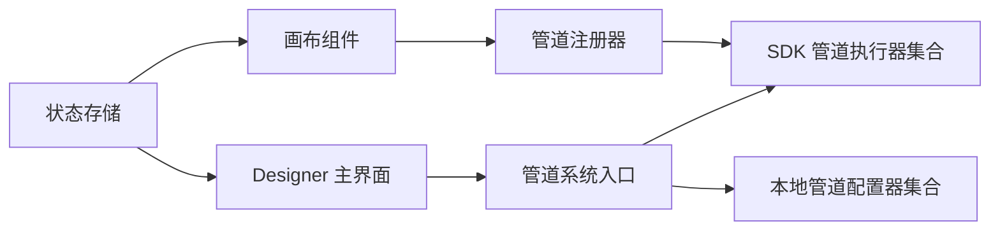

# 组件交互流程设计

<cite>
**本文引用的文件**
- [Designer 主界面](file://designer/src/pages/Designer/index.tsx)
- [设计器状态存储](file://designer/src/store/designer.ts)
- [管道系统入口](file://designer/src/pipes/index.ts)
- [管道注册器](file://sdk/src/pipes/registry.ts)
- [管道执行器集合](file://sdk/src/pipes/executors/index.ts)
- [类型定义与数据绑定模型](file://designer/src/types/index.ts)
- [资产面板](file://designer/src/pages/Designer/components/AssetPanel/index.tsx)
- [画布组件](file://designer/src/pages/Designer/components/Canvas/index.tsx)
- [属性面板-数据绑定区](file://designer/src/pages/Designer/components/PropertyPanel/DataBindingSection.tsx)
- [管道配置器集合](file://designer/src/pipes/configurators/index.tsx)
</cite>

## 目录
1. [引言](#引言)
2. [项目结构](#项目结构)
3. [核心组件](#核心组件)
4. [架构总览](#架构总览)
5. [详细组件分析](#详细组件分析)
6. [依赖分析](#依赖分析)
7. [性能考虑](#性能考虑)
8. [故障排查指南](#故障排查指南)
9. [结论](#结论)
10. [附录](#附录)

## 引言
本设计文档围绕“从资产树到画布组件”的完整数据交互流程展开，重点阐述以下方面：
- 资产树解析与拖拽绑定
- 管道注入与实时解构预览
- 数据绑定模型设计（Path Resolver、Scope Manager、Pipe Executor 的协作机制）
- 管道系统的插件化架构（执行器与配置器分离）
- 使用流程与最佳实践
- 实时更新机制与性能优化策略

## 项目结构
本项目采用“前端设计器 + SDK 打印引擎”的分层架构：
- 设计器前端（designer）：负责可视化编辑、资产面板、画布、属性面板、模板导出等
- SDK（sdk）：提供打印渲染引擎、管道执行器注册与执行、渲染器集合等能力
- 类型系统（designer/types）：统一定义模板、组件、数据绑定、管道等核心数据结构

图表来源
- [Designer 主界面:1-365](file://designer/src/pages/Designer/index.tsx#L1-L365)
- [资产面板](file://designer/src/pages/Designer/components/AssetPanel/index.tsx)
- [画布组件](file://designer/src/pages/Designer/components/Canvas/index.tsx)
- [属性面板-数据绑定区](file://designer/src/pages/Designer/components/PropertyPanel/DataBindingSection.tsx)
- [设计器状态存储:1-773](file://designer/src/store/designer.ts#L1-L773)
- [管道系统入口:1-11](file://designer/src/pipes/index.ts#L1-L11)
- [管道注册器:1-65](file://sdk/src/pipes/registry.ts#L1-L65)
- [管道执行器集合:1-45](file://sdk/src/pipes/executors/index.ts#L1-L45)

章节来源
- [Designer 主界面:1-365](file://designer/src/pages/Designer/index.tsx#L1-L365)
- [设计器状态存储:1-773](file://designer/src/store/designer.ts#L1-L773)
- [管道系统入口:1-11](file://designer/src/pipes/index.ts#L1-L11)

## 核心组件
- 资产面板：承载组件库与数据资产，支持拖拽到画布
- 画布组件：渲染模板、响应缩放与网格、处理组件层级与对齐分布
- 属性面板-数据绑定区：配置数据路径、管道链与回退值
- 状态存储：集中管理组件列表、选中状态、模板信息、历史撤销/重做
- 管道系统：执行器（SDK）与配置器（设计器 UI）分离，通过注册表协作

章节来源
- [资产面板](file://designer/src/pages/Designer/components/AssetPanel/index.tsx)
- [画布组件](file://designer/src/pages/Designer/components/Canvas/index.tsx)
- [属性面板-数据绑定区](file://designer/src/pages/Designer/components/PropertyPanel/DataBindingSection.tsx)
- [设计器状态存储:1-773](file://designer/src/store/designer.ts#L1-L773)
- [管道系统入口:1-11](file://designer/src/pipes/index.ts#L1-L11)

## 架构总览
数据从资产树到画布组件的流转分为以下阶段：
1) 解析资产树：识别组件类型与数据资产，准备拖拽源数据
2) 拖拽绑定：将资产拖拽至画布，创建组件节点并写入初始布局与绑定
3) 管道注入：根据绑定配置，构建管道链（配置器 UI -> 执行器 SDK）
4) 实时解构预览：基于当前数据上下文，调用执行器对数据进行格式化展示
5) 模板生成：将画布状态序列化为模板 JSON，供 SDK 渲染

图表来源
- [资产面板](file://designer/src/pages/Designer/components/AssetPanel/index.tsx)
- [画布组件](file://designer/src/pages/Designer/components/Canvas/index.tsx)
- [设计器状态存储:1-773](file://designer/src/store/designer.ts#L1-L773)
- [管道配置器集合:1-85](file://designer/src/pipes/configurators/index.tsx#L1-L85)
- [管道注册器:1-65](file://sdk/src/pipes/registry.ts#L1-L65)
- [管道执行器集合:1-45](file://sdk/src/pipes/executors/index.ts#L1-L45)

## 详细组件分析

### 数据绑定模型设计
数据绑定由三部分协同完成：
- Path Resolver：解析 DataBinding.path，从数据上下文提取目标值
- Scope Manager：维护当前作用域（模板数据、页头/页脚/内容区域数据）
- Pipe Executor：按顺序执行管道链，输出最终显示值

图表来源
- [类型定义与数据绑定模型:146-164](file://designer/src/types/index.ts#L146-L164)
- [管道执行器集合:1-45](file://sdk/src/pipes/executors/index.ts#L1-L45)
- [管道配置器集合:1-85](file://designer/src/pipes/configurators/index.tsx#L1-L85)

章节来源
- [类型定义与数据绑定模型:146-164](file://designer/src/types/index.ts#L146-L164)
- [管道配置器集合:1-85](file://designer/src/pipes/configurators/index.tsx#L1-L85)
- [管道执行器集合:1-45](file://sdk/src/pipes/executors/index.ts#L1-L45)

### 资产树解析与拖拽绑定
- 资产树节点包含组件类型与数据资产标识
- 拖拽开始时，记录源数据（组件类型、默认布局、可选数据路径）
- 拖拽结束时，将节点插入画布对应区域，并写入初始绑定配置
- 状态存储负责持久化组件列表与选中状态，触发画布重绘

图表来源
- [资产面板](file://designer/src/pages/Designer/components/AssetPanel/index.tsx)
- [画布组件](file://designer/src/pages/Designer/components/Canvas/index.tsx)
- [设计器状态存储:113-125](file://designer/src/store/designer.ts#L113-L125)

章节来源
- [资产面板](file://designer/src/pages/Designer/components/AssetPanel/index.tsx)
- [画布组件](file://designer/src/pages/Designer/components/Canvas/index.tsx)
- [设计器状态存储:113-125](file://designer/src/store/designer.ts#L113-L125)

### 管道注入与实时解构预览
- 管道配置器（UI）根据管道类型渲染配置输入（如日期格式、货币符号、截取区间、默认值等）
- 用户修改配置后，通过 onChange 更新 PipeConfig.options
- 画布根据当前组件绑定，调用管道注册器获取执行器，依次执行管道链
- 执行器返回格式化结果，驱动组件实时预览更新

图表来源
- [属性面板-数据绑定区](file://designer/src/pages/Designer/components/PropertyPanel/DataBindingSection.tsx)
- [管道配置器集合:1-85](file://designer/src/pipes/configurators/index.tsx#L1-L85)
- [管道注册器:24-52](file://sdk/src/pipes/registry.ts#L24-L52)
- [管道执行器集合:1-45](file://sdk/src/pipes/executors/index.ts#L1-L45)

章节来源
- [属性面板-数据绑定区](file://designer/src/pages/Designer/components/PropertyPanel/DataBindingSection.tsx)
- [管道配置器集合:1-85](file://designer/src/pipes/configurators/index.tsx#L1-L85)
- [管道注册器:24-52](file://sdk/src/pipes/registry.ts#L24-L52)
- [管道执行器集合:1-45](file://sdk/src/pipes/executors/index.ts#L1-L45)

### 模板生成与导出
- 设计器将当前状态（组件列表、页头/页脚/内容区域、页面配置、模板信息）合并为模板 JSON
- 模板包含组件绑定、布局、样式与页面参数
- 该模板可被 SDK 渲染引擎消费，生成最终打印输出

图表来源
- [设计器状态存储:189-201](file://designer/src/store/designer.ts#L189-L201)
- [Designer 主界面:48-52](file://designer/src/pages/Designer/index.tsx#L48-L52)

章节来源
- [设计器状态存储:189-201](file://designer/src/store/designer.ts#L189-L201)
- [Designer 主界面:48-52](file://designer/src/pages/Designer/index.tsx#L48-L52)

## 依赖分析
- 设计器前端通过管道系统入口统一导出 SDK 的执行器与本地配置器
- 管道注册器集中管理执行器，提供按类型检索与执行能力
- 状态存储与画布组件强耦合，保证渲染一致性
- 属性面板依赖配置器集合，实现管道配置的可视化

图表来源
- [管道系统入口:1-11](file://designer/src/pipes/index.ts#L1-L11)
- [管道注册器:1-65](file://sdk/src/pipes/registry.ts#L1-L65)
- [管道执行器集合:1-45](file://sdk/src/pipes/executors/index.ts#L1-L45)
- [设计器状态存储:1-773](file://designer/src/store/designer.ts#L1-L773)
- [画布组件](file://designer/src/pages/Designer/components/Canvas/index.tsx)

章节来源
- [管道系统入口:1-11](file://designer/src/pipes/index.ts#L1-L11)
- [管道注册器:1-65](file://sdk/src/pipes/registry.ts#L1-L65)
- [设计器状态存储:1-773](file://designer/src/store/designer.ts#L1-L773)

## 性能考虑
- 状态更新粒度：组件更新与绑定变更应尽量局部化，避免全量重渲染
- 管道执行缓存：对相同输入与配置组合的结果进行缓存，减少重复执行
- 渲染节流：缩放、拖拽、对齐等高频操作建议节流/防抖
- 撤销/重做：历史快照采用浅拷贝优化与上限控制，避免内存膨胀
- 网格与对齐：对齐/分布算法按需计算，跨区域场景提前校验，避免无效操作

## 故障排查指南
- 管道执行器缺失：当类型未注册时，注册器会返回警告并回退原值
- 数据路径错误：Path Resolver 无法解析时，使用 DataBinding.fallback
- 组件区域限制：表格组件不允许放入页头/页脚，移动时会被拒绝
- 缩放边界：缩放在 25%-200% 之间，超出范围禁用点击
- 撤销/重做：检查历史索引与快照长度，确保状态一致性

章节来源
- [管道注册器:45-52](file://sdk/src/pipes/registry.ts#L45-L52)
- [类型定义与数据绑定模型:157-164](file://designer/src/types/index.ts#L157-L164)
- [设计器状态存储:480-481](file://designer/src/store/designer.ts#L480-L481)
- [设计器状态存储:355-358](file://designer/src/store/designer.ts#L355-L358)
- [设计器状态存储:511-542](file://designer/src/store/designer.ts#L511-L542)

## 结论
本设计以“状态存储 + 管道注册器 + 配置器 UI”为核心，实现了从资产树到画布组件的完整数据交互闭环。通过插件化的管道系统与清晰的作用域管理，既保证了扩展性，又确保了实时预览的流畅体验。建议在实际使用中遵循“局部更新 + 缓存 + 节流”的最佳实践，持续优化性能与稳定性。

## 附录
- 使用流程建议
  1) 在资产面板选择组件或数据资产
  2) 拖拽到画布，确认初始布局与绑定
  3) 在属性面板配置数据路径与管道链
  4) 实时查看预览，必要时调整网格与对齐
  5) 生成模板并导出，交由 SDK 渲染引擎处理

- 最佳实践
  - 管道链顺序：先格式化（日期/货币），再结构化（截取/默认值）
  - 数据路径：优先使用明确的点号路径，配合回退值提升健壮性
  - 组件区域：表格类组件仅放置于内容区域
  - 性能：避免在渲染回调中进行重型计算，必要时引入缓存