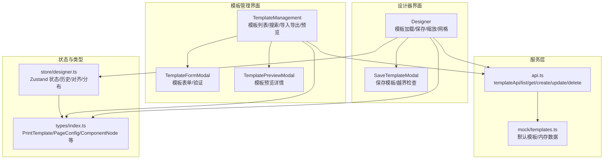
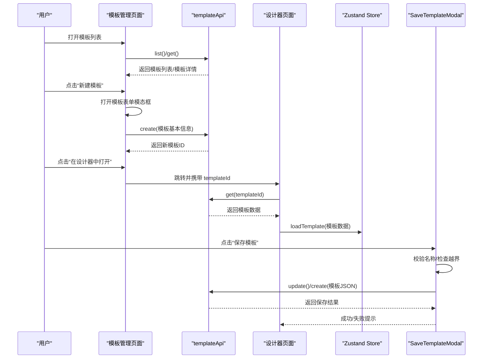
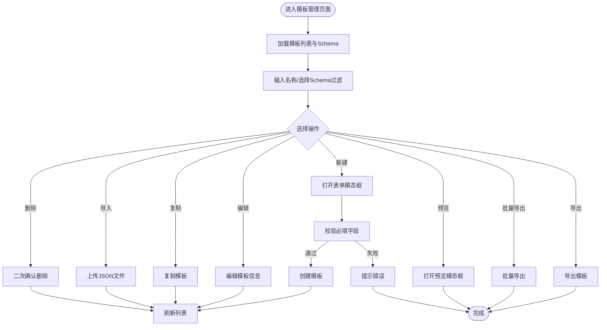
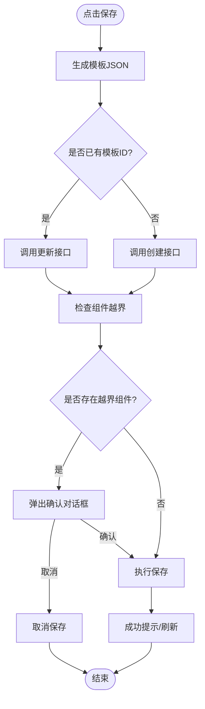
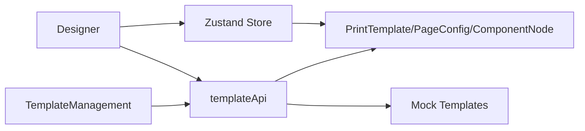

# 模板 CRUD 操作

<cite>
**本文引用的文件**
- [designer/src/pages/TemplateManagement/index.tsx](file://designer/src/pages/TemplateManagement/index.tsx)
- [designer/src/pages/TemplateManagement/components/TemplateFormModal.tsx](file://designer/src/pages/TemplateManagement/components/TemplateFormModal.tsx)
- [designer/src/pages/TemplateManagement/components/TemplatePreviewModal.tsx](file://designer/src/pages/TemplateManagement/components/TemplatePreviewModal.tsx)
- [designer/src/pages/Designer/index.tsx](file://designer/src/pages/Designer/index.tsx)
- [designer/src/pages/Designer/components/Canvas/SaveTemplateModal.tsx](file://designer/src/pages/Designer/components/Canvas/SaveTemplateModal.tsx)
- [designer/src/services/api.ts](file://designer/src/services/api.ts)
- [designer/src/store/designer.ts](file://designer/src/store/designer.ts)
- [designer/src/types/index.ts](file://designer/src/types/index.ts)
- [designer/src/services/mock/templates.ts](file://designer/src/services/mock/templates.ts)
</cite>

## 目录
1. [简介](#简介)
2. [项目结构](#项目结构)
3. [核心组件](#核心组件)
4. [架构总览](#架构总览)
5. [详细组件分析](#详细组件分析)
6. [依赖分析](#依赖分析)
7. [性能考虑](#性能考虑)
8. [故障排查指南](#故障排查指南)
9. [结论](#结论)
10. [附录](#附录)

## 简介
本文件围绕“模板 CRUD 操作”提供系统化、可操作的技术文档，覆盖模板的创建、读取、更新、删除全流程；模板表单字段与验证规则；模板预览实现原理与使用方法；模板列表展示、搜索与过滤；模板批量操作与导入导出；权限控制与安全机制；错误处理与异常场景；以及实际使用示例与常见场景。

## 项目结构
模板管理相关的核心模块位于设计器前端工程 designer 目录，主要涉及：
- 模板管理页面：负责模板列表、搜索过滤、批量导出、导入、复制、预览、删除、新建/编辑等
- 设计器页面：负责模板的可视化设计、保存、加载、缩放、网格、层级等
- API 服务层：封装真实后端或前端 Mock 的模板接口
- 类型定义：统一描述模板、页面配置、组件节点、数据绑定等结构
- 状态管理：Zustand Store 提供组件增删改、页面配置、历史撤销/重做等能力

图表来源
- [designer/src/pages/TemplateManagement/index.tsx:1-432](file://designer/src/pages/TemplateManagement/index.tsx#L1-L432)
- [designer/src/pages/Designer/index.tsx:1-365](file://designer/src/pages/Designer/index.tsx#L1-L365)
- [designer/src/pages/Designer/components/Canvas/SaveTemplateModal.tsx:1-177](file://designer/src/pages/Designer/components/Canvas/SaveTemplateModal.tsx#L1-L177)
- [designer/src/services/api.ts:1-134](file://designer/src/services/api.ts#L1-L134)
- [designer/src/store/designer.ts:1-773](file://designer/src/store/designer.ts#L1-L773)
- [designer/src/types/index.ts:337-358](file://designer/src/types/index.ts#L337-L358)
- [designer/src/services/mock/templates.ts:1-800](file://designer/src/services/mock/templates.ts#L1-L800)

章节来源
- [designer/src/pages/TemplateManagement/index.tsx:1-432](file://designer/src/pages/TemplateManagement/index.tsx#L1-L432)
- [designer/src/pages/Designer/index.tsx:1-365](file://designer/src/pages/Designer/index.tsx#L1-L365)
- [designer/src/services/api.ts:1-134](file://designer/src/services/api.ts#L1-L134)
- [designer/src/store/designer.ts:1-773](file://designer/src/store/designer.ts#L1-L773)
- [designer/src/types/index.ts:337-358](file://designer/src/types/index.ts#L337-L358)
- [designer/src/services/mock/templates.ts:1-800](file://designer/src/services/mock/templates.ts#L1-L800)

## 核心组件
- 模板管理页面：提供模板列表、搜索过滤、新建/编辑、复制、导出、批量导出、导入、预览、删除等操作入口
- 模板表单模态框：用于输入模板名称、关联 Schema、描述，并进行必填校验
- 模板预览模态框：展示模板基本信息、组件统计、组件列表与位置信息
- 设计器主页面：支持模板加载、保存、缩放、网格、对齐/分布、层级管理、撤销/重做
- 保存模板弹窗：在设计器中保存模板，包含名称必填校验与组件越界检查
- API 服务：根据环境变量选择真实后端或前端 Mock 的模板接口
- Zustand Store：维护组件列表、页面配置、历史快照、网格/缩放、对齐/分布等状态
- 类型定义：PrintTemplate、PageConfig、ComponentNode、DataBinding 等

章节来源
- [designer/src/pages/TemplateManagement/index.tsx:32-432](file://designer/src/pages/TemplateManagement/index.tsx#L32-L432)
- [designer/src/pages/TemplateManagement/components/TemplateFormModal.tsx:1-61](file://designer/src/pages/TemplateManagement/components/TemplateFormModal.tsx#L1-L61)
- [designer/src/pages/TemplateManagement/components/TemplatePreviewModal.tsx:1-136](file://designer/src/pages/TemplateManagement/components/TemplatePreviewModal.tsx#L1-L136)
- [designer/src/pages/Designer/index.tsx:17-365](file://designer/src/pages/Designer/index.tsx#L17-L365)
- [designer/src/pages/Designer/components/Canvas/SaveTemplateModal.tsx:1-177](file://designer/src/pages/Designer/components/Canvas/SaveTemplateModal.tsx#L1-L177)
- [designer/src/services/api.ts:1-134](file://designer/src/services/api.ts#L1-L134)
- [designer/src/store/designer.ts:1-773](file://designer/src/store/designer.ts#L1-L773)
- [designer/src/types/index.ts:337-358](file://designer/src/types/index.ts#L337-L358)

## 架构总览
模板 CRUD 的整体流程如下：
- 列表与搜索：模板管理页面加载模板列表，支持按名称与 Schema 过滤
- 新建/编辑：通过表单模态框完成模板基本信息的输入与校验
- 设计与保存：在设计器中完成模板设计，保存时进行名称校验与组件越界检查
- 导入导出：支持单模板导出、批量导出、JSON 文件导入
- 预览：提供模板详情预览，可直接在设计器中打开
- 删除：提供二次确认删除，防止误操作

图表来源
- [designer/src/pages/TemplateManagement/index.tsx:45-136](file://designer/src/pages/TemplateManagement/index.tsx#L45-L136)
- [designer/src/pages/Designer/index.tsx:26-46](file://designer/src/pages/Designer/index.tsx#L26-L46)
- [designer/src/pages/Designer/components/Canvas/SaveTemplateModal.tsx:96-156](file://designer/src/pages/Designer/components/Canvas/SaveTemplateModal.tsx#L96-L156)
- [designer/src/services/api.ts:67-91](file://designer/src/services/api.ts#L67-L91)
- [designer/src/store/designer.ts:203-250](file://designer/src/store/designer.ts#L203-L250)

## 详细组件分析

### 模板管理页面（CRUD 主入口）
- 列表加载：首次进入触发模板列表加载与 Schema 列表加载
- 搜索与过滤：支持按模板名称模糊搜索与按 Schema 过滤
- 新建模板：打开表单模态框，提交时进行必填校验，创建默认模板（含页面配置、布局模式等）
- 编辑模板：当前代码注释掉编辑入口，但表单字段与校验逻辑已具备
- 复制模板：去除 ID 后复制为新模板
- 导出/批量导出：将模板序列化为 JSON 并下载
- 导入：支持单模板或模板数组导入，逐条创建
- 预览：打开预览模态框，展示模板基本信息与组件列表
- 删除：二次确认删除，调用删除接口并刷新列表

图表来源
- [designer/src/pages/TemplateManagement/index.tsx:45-232](file://designer/src/pages/TemplateManagement/index.tsx#L45-L232)
- [designer/src/pages/TemplateManagement/components/TemplateFormModal.tsx:32-54](file://designer/src/pages/TemplateManagement/components/TemplateFormModal.tsx#L32-L54)

章节来源
- [designer/src/pages/TemplateManagement/index.tsx:32-432](file://designer/src/pages/TemplateManagement/index.tsx#L32-L432)
- [designer/src/pages/TemplateManagement/components/TemplateFormModal.tsx:1-61](file://designer/src/pages/TemplateManagement/components/TemplateFormModal.tsx#L1-L61)

### 模板表单与验证规则
- 字段定义：模板名称（必填）、关联 Schema（可选）、描述（可选）
- 验证规则：模板名称必填校验，其他字段为可选
- 表单提交：校验通过后根据是否存在编辑模板决定创建或更新

章节来源
- [designer/src/pages/TemplateManagement/components/TemplateFormModal.tsx:32-54](file://designer/src/pages/TemplateManagement/components/TemplateFormModal.tsx#L32-L54)
- [designer/src/pages/TemplateManagement/index.tsx:99-136](file://designer/src/pages/TemplateManagement/index.tsx#L99-L136)

### 模板预览功能
- 预览内容：模板名称、Schema、组件总数、纸张尺寸/方向、ID、描述
- 组件列表：按页头/内容/页脚分组展示组件类型、区域、位置与尺寸
- 操作：支持导出、在设计器中打开、关闭

章节来源
- [designer/src/pages/TemplateManagement/components/TemplatePreviewModal.tsx:1-136](file://designer/src/pages/TemplateManagement/components/TemplatePreviewModal.tsx#L1-L136)
- [designer/src/pages/TemplateManagement/index.tsx:219-226](file://designer/src/pages/TemplateManagement/index.tsx#L219-L226)

### 设计器中的模板保存与越界检查
- 保存流程：生成模板 JSON，区分更新或新建；新建时设置模板信息并跳转带模板参数
- 越界检查：检查组件是否超出页头/页脚/内容区域范围，若存在越界组件弹出确认对话框
- 组件越界判断：综合页面尺寸、方向、页头/页脚开关与高度、边距、组件布局等

图表来源
- [designer/src/pages/Designer/components/Canvas/SaveTemplateModal.tsx:96-156](file://designer/src/pages/Designer/components/Canvas/SaveTemplateModal.tsx#L96-L156)
- [designer/src/pages/Designer/index.tsx:224-226](file://designer/src/pages/Designer/index.tsx#L224-L226)

章节来源
- [designer/src/pages/Designer/components/Canvas/SaveTemplateModal.tsx:1-177](file://designer/src/pages/Designer/components/Canvas/SaveTemplateModal.tsx#L1-L177)
- [designer/src/pages/Designer/index.tsx:17-46](file://designer/src/pages/Designer/index.tsx#L17-L46)

### 模板列表展示与搜索过滤
- 列表字段：模板名称、Schema、组件数、纸张尺寸、描述、创建时间、操作按钮
- 搜索：名称输入框支持模糊搜索
- 过滤：Schema 下拉选择器按 ID 过滤
- 分页：Ant Design Table 默认分页，每页 10 条

章节来源
- [designer/src/pages/TemplateManagement/index.tsx:228-408](file://designer/src/pages/TemplateManagement/index.tsx#L228-L408)

### 模板批量操作与导入导出
- 单模板导出：将模板 JSON 序列化并下载
- 批量导出：将当前列表全部模板序列化并下载
- 导入：支持单模板或模板数组 JSON 文件导入，逐条创建
- 复制：去除 ID 后复制为新模板

章节来源
- [designer/src/pages/TemplateManagement/index.tsx:138-217](file://designer/src/pages/TemplateManagement/index.tsx#L138-L217)

### 权限控制与安全机制
- 认证与授权：当前代码未发现显式的权限拦截或鉴权逻辑
- 接口访问：通过环境变量切换真实后端或前端 Mock，生产环境建议配置后端鉴权
- 数据安全：导入导出均为前端操作，注意避免敏感数据泄露；建议后端增加导入白名单与校验
- 用户体验：二次确认删除、越界检查、必填校验等降低误操作风险

章节来源
- [designer/src/services/api.ts:1-134](file://designer/src/services/api.ts#L1-L134)
- [designer/src/pages/TemplateManagement/index.tsx:340-348](file://designer/src/pages/TemplateManagement/index.tsx#L340-L348)

### 错误处理与异常情况
- 列表加载失败：捕获异常并提示错误
- 保存失败：捕获异常并提示错误
- 导入失败：解析失败/格式不正确/部分导入失败均有相应提示
- 越界组件：弹出确认对话框，允许用户决定是否继续保存
- 删除失败：二次确认后仍失败时提示错误

章节来源
- [designer/src/pages/TemplateManagement/index.tsx:50-61](file://designer/src/pages/TemplateManagement/index.tsx#L50-L61)
- [designer/src/pages/TemplateManagement/index.tsx:88-97](file://designer/src/pages/TemplateManagement/index.tsx#L88-L97)
- [designer/src/pages/TemplateManagement/index.tsx:166-201](file://designer/src/pages/TemplateManagement/index.tsx#L166-L201)
- [designer/src/pages/TemplateManagement/index.tsx:11-13](file://designer/src/pages/TemplateManagement/index.tsx#L11-L13)
- [designer/src/pages/Designer/components/Canvas/SaveTemplateModal.tsx:117-123](file://designer/src/pages/Designer/components/Canvas/SaveTemplateModal.tsx#L117-L123)
- [designer/src/pages/Designer/components/Canvas/SaveTemplateModal.tsx:137-152](file://designer/src/pages/Designer/components/Canvas/SaveTemplateModal.tsx#L137-L152)

### 实际使用示例与场景
- 场景一：新建模板
  - 在模板管理页面点击“新建模板”，填写名称与可选 Schema，提交后返回新模板 ID
- 场景二：在设计器中保存模板
  - 在设计器中完成设计，点击保存，输入模板名称，系统检查越界并确认后保存
- 场景三：复制模板
  - 在模板列表中选择“复制”，系统去除 ID 后创建新模板
- 场景四：导入模板
  - 上传 JSON 文件，支持单模板或模板数组，逐条创建
- 场景五：批量导出
  - 点击“批量导出”，下载包含所有模板的 JSON 文件
- 场景六：预览模板
  - 点击“预览”，查看模板基本信息与组件列表，可直接在设计器中打开

章节来源
- [designer/src/pages/TemplateManagement/index.tsx:72-136](file://designer/src/pages/TemplateManagement/index.tsx#L72-L136)
- [designer/src/pages/Designer/index.tsx:224-226](file://designer/src/pages/Designer/index.tsx#L224-L226)
- [designer/src/pages/Designer/components/Canvas/SaveTemplateModal.tsx:96-156](file://designer/src/pages/Designer/components/Canvas/SaveTemplateModal.tsx#L96-L156)
- [designer/src/pages/TemplateManagement/index.tsx:138-217](file://designer/src/pages/TemplateManagement/index.tsx#L138-L217)

## 依赖分析
- 模板管理页面依赖模板 API 服务与 Schema API 服务，用于列表、创建、更新、删除、导入导出等
- 设计器页面依赖模板 API 服务用于加载与保存模板，依赖 Zustand Store 维护画布状态
- 类型定义贯穿前后端，确保模板结构一致性
- Mock 数据用于演示与开发阶段，真实后端通过环境变量切换

图表来源
- [designer/src/pages/TemplateManagement/index.tsx:27-70](file://designer/src/pages/TemplateManagement/index.tsx#L27-L70)
- [designer/src/pages/Designer/index.tsx:11-24](file://designer/src/pages/Designer/index.tsx#L11-L24)
- [designer/src/services/api.ts:67-91](file://designer/src/services/api.ts#L67-L91)
- [designer/src/store/designer.ts:1-773](file://designer/src/store/designer.ts#L1-L773)
- [designer/src/types/index.ts:337-358](file://designer/src/types/index.ts#L337-L358)
- [designer/src/services/mock/templates.ts:1-800](file://designer/src/services/mock/templates.ts#L1-L800)

章节来源
- [designer/src/services/api.ts:1-134](file://designer/src/services/api.ts#L1-L134)
- [designer/src/store/designer.ts:1-773](file://designer/src/store/designer.ts#L1-L773)
- [designer/src/types/index.ts:337-358](file://designer/src/types/index.ts#L337-L358)
- [designer/src/services/mock/templates.ts:1-800](file://designer/src/services/mock/templates.ts#L1-L800)

## 性能考虑
- 列表分页：Ant Design Table 默认分页，建议在大数据量场景下结合后端分页与查询参数
- 模板导出：批量导出会序列化大量模板，建议在后台进行异步导出并提供下载链接
- 导入处理：逐条创建模板，建议在后台进行批量导入以提升性能
- 预览生成：批量预览会生成多份 HTML，建议限制并发数量或采用分批生成策略

## 故障排查指南
- 模板列表加载失败
  - 检查网络与后端连通性；确认环境变量配置正确
- 保存模板失败
  - 检查模板名称是否为空；确认组件越界检查是否通过
- 导入失败
  - 检查 JSON 格式是否正确；确认文件内容是否为单模板或模板数组
- 预览生成失败
  - 检查模板结构是否完整；确认数据绑定路径是否有效

章节来源
- [designer/src/pages/TemplateManagement/index.tsx:50-61](file://designer/src/pages/TemplateManagement/index.tsx#L50-L61)
- [designer/src/pages/TemplateManagement/index.tsx:166-201](file://designer/src/pages/TemplateManagement/index.tsx#L166-L201)
- [designer/src/pages/Designer/components/Canvas/SaveTemplateModal.tsx:117-123](file://designer/src/pages/Designer/components/Canvas/SaveTemplateModal.tsx#L117-L123)

## 结论
模板 CRUD 操作在当前系统中实现了完整的生命周期管理：从列表展示、搜索过滤、表单验证，到设计器保存、越界检查、预览、导入导出与删除。建议后续增强权限控制与后端鉴权、优化大数据量场景下的导入导出性能，并完善编辑入口与权限分级，以满足更复杂的业务需求。

## 附录
- 模板数据结构要点
  - PrintTemplate：包含模板基本信息、页面配置、布局模式、组件列表、页头/页脚组件等
  - PageConfig：页面尺寸、方向、边距、页头/页脚开关与高度等
  - ComponentNode：组件类型、布局、样式、数据绑定、子组件等
- 默认模板示例
  - 系统内置多种默认模板，涵盖订单、快递面单、产品标签等场景，可作为模板设计参考

章节来源
- [designer/src/types/index.ts:337-358](file://designer/src/types/index.ts#L337-L358)
- [designer/src/services/mock/templates.ts:1-800](file://designer/src/services/mock/templates.ts#L1-L800)