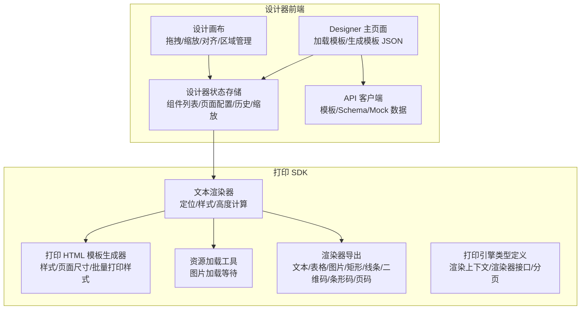
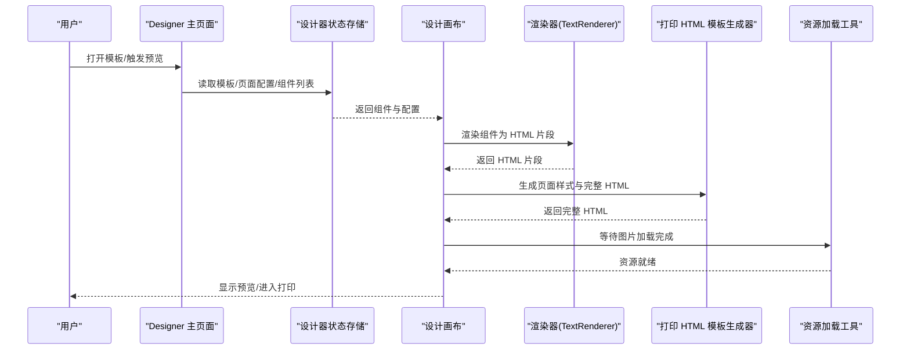
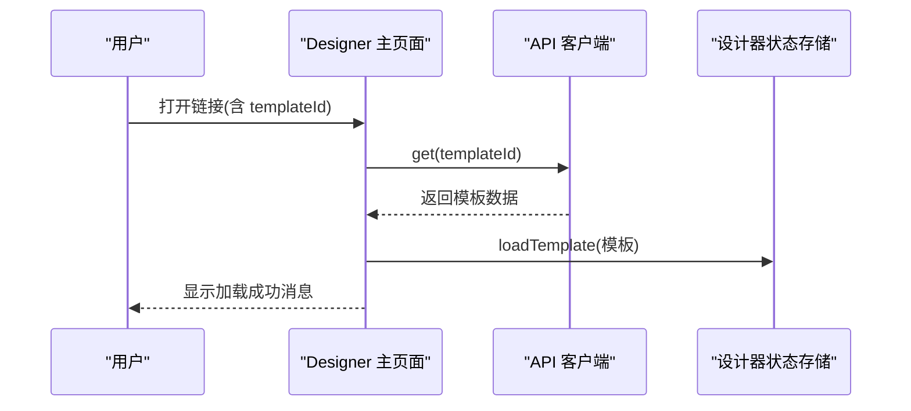
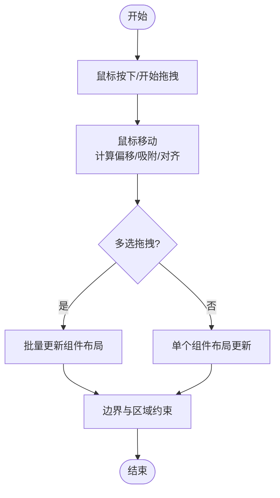
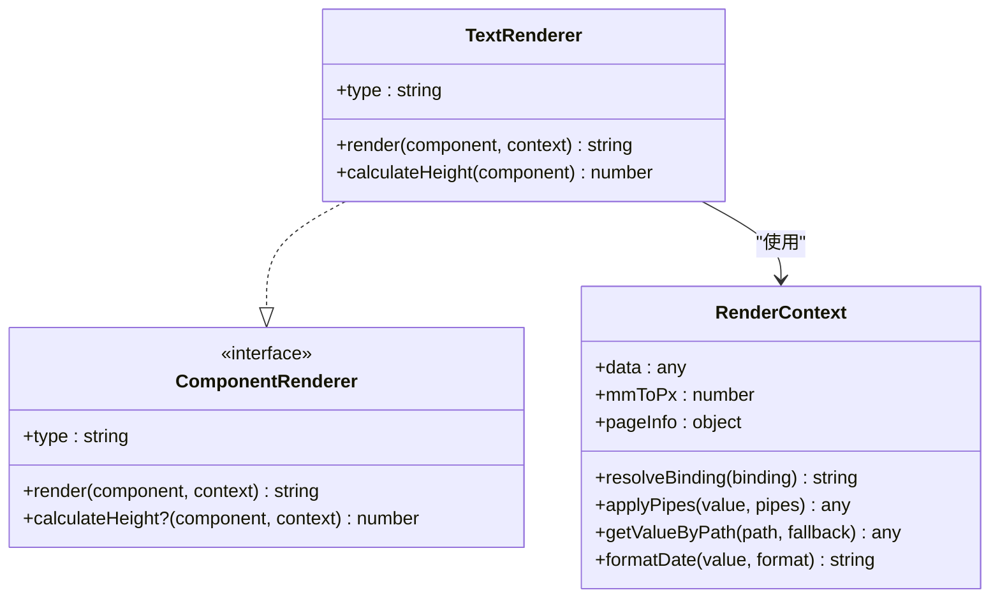
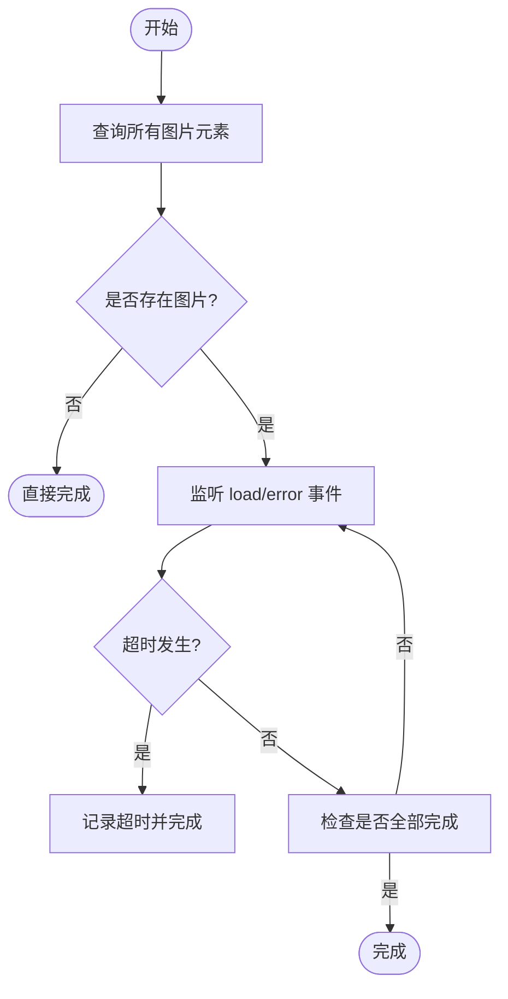
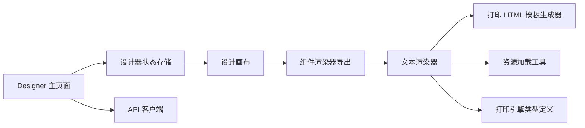

# 模板性能优化

<cite>
**本文引用的文件**
- [Designer 主页面](file://designer/src/pages/Designer/index.tsx)
- [设计画布](file://designer/src/pages/Designer/components/Canvas/index.tsx)
- [组件渲染器导出](file://designer/src/pages/Designer/components/Canvas/componentRenderers/index.ts)
- [文本预览组件](file://designer/src/pages/Designer/components/Canvas/componentRenderers/TextPreview.tsx)
- [设计器状态存储](file://designer/src/store/designer.ts)
- [API 客户端](file://designer/src/services/api.ts)
- [打印 HTML 模板生成器](file://sdk/src/printEngine/htmlTemplate.ts)
- [资源加载工具](file://sdk/src/utils/resourceLoader.ts)
- [打印渲染器导出](file://sdk/src/printEngine/renderers/index.ts)
- [文本渲染器](file://sdk/src/printEngine/renderers/TextRenderer.ts)
- [打印引擎类型定义](file://sdk/src/printEngine/types.ts)
- [设计常量](file://designer/src/constants/index.ts)
- [类型定义](file://designer/src/types/index.ts)
</cite>

## 目录
1. [简介](#简介)
2. [项目结构](#项目结构)
3. [核心组件](#核心组件)
4. [架构概览](#架构概览)
5. [详细组件分析](#详细组件分析)
6. [依赖分析](#依赖分析)
7. [性能考量](#性能考量)
8. [故障排查指南](#故障排查指南)
9. [结论](#结论)
10. [附录](#附录)

## 简介
本文件聚焦于模板性能优化，围绕模板渲染、大模板加载与渲染、组件懒加载与按需渲染、模板缓存与内存管理、模板预览与实时渲染的性能平衡、模板复杂度评估与性能监控、加载速度优化与用户体验提升，以及实际案例与效果对比进行系统性阐述。通过对设计器与打印 SDK 的代码结构与实现细节进行深入分析，提出可落地的优化策略与最佳实践。

## 项目结构
该项目采用前后端分离的双仓结构：
- 设计器前端（designer）：负责模板设计、组件拖拽、属性配置、缩放与预览、模板保存与加载。
- 打印 SDK（sdk）：负责将模板渲染为可打印的 HTML，并提供渲染器、样式构建与资源等待工具。

**图表来源**
- [Designer 主页面:17-48](file://designer/src/pages/Designer/index.tsx#L17-L48)
- [设计画布:22-74](file://designer/src/pages/Designer/components/Canvas/index.tsx#L22-L74)
- [设计器状态存储:108-125](file://designer/src/store/designer.ts#L108-L125)
- [API 客户端:131-134](file://designer/src/services/api.ts#L131-L134)
- [打印 HTML 模板生成器:81-172](file://sdk/src/printEngine/htmlTemplate.ts#L81-L172)
- [资源加载工具:12-89](file://sdk/src/utils/resourceLoader.ts#L12-L89)
- [打印渲染器导出:4-12](file://sdk/src/printEngine/renderers/index.ts#L4-L12)
- [文本渲染器:10-59](file://sdk/src/printEngine/renderers/TextRenderer.ts#L10-L59)
- [打印引擎类型定义:11-82](file://sdk/src/printEngine/types.ts#L11-L82)

**章节来源**
- [Designer 主页面:17-48](file://designer/src/pages/Designer/index.tsx#L17-L48)
- [设计画布:22-74](file://designer/src/pages/Designer/components/Canvas/index.tsx#L22-L74)
- [设计器状态存储:108-125](file://designer/src/store/designer.ts#L108-L125)
- [API 客户端:131-134](file://designer/src/services/api.ts#L131-L134)
- [打印 HTML 模板生成器:81-172](file://sdk/src/printEngine/htmlTemplate.ts#L81-L172)
- [资源加载工具:12-89](file://sdk/src/utils/resourceLoader.ts#L12-L89)
- [打印渲染器导出:4-12](file://sdk/src/printEngine/renderers/index.ts#L4-L12)
- [文本渲染器:10-59](file://sdk/src/printEngine/renderers/TextRenderer.ts#L10-L59)
- [打印引擎类型定义:11-82](file://sdk/src/printEngine/types.ts#L11-L82)

## 核心组件
- 模板加载与生成：通过 API 客户端拉取模板，设计器状态存储负责解析与兼容旧模板，主页面生成模板 JSON 供调试与复制。
- 画布交互与渲染：画布组件负责拖拽、缩放、对齐、区域管理与组件渲染器选择；渲染器将组件转换为 HTML 字符串。
- 打印 HTML 生成：打印引擎生成页面样式与完整 HTML 文档，支持预览与批量打印两种模式。
- 资源等待：资源加载工具等待图片加载完成，避免打印前资源未就绪导致的布局异常。

**章节来源**
- [Designer 主页面:34-48](file://designer/src/pages/Designer/index.tsx#L34-L48)
- [API 客户端:131-134](file://designer/src/services/api.ts#L131-L134)
- [设计器状态存储:203-250](file://designer/src/store/designer.ts#L203-L250)
- [设计画布:281-479](file://designer/src/pages/Designer/components/Canvas/index.tsx#L281-L479)
- [组件渲染器导出:4-11](file://designer/src/pages/Designer/components/Canvas/componentRenderers/index.ts#L4-L11)
- [打印 HTML 模板生成器:230-252](file://sdk/src/printEngine/htmlTemplate.ts#L230-L252)
- [资源加载工具:82-89](file://sdk/src/utils/resourceLoader.ts#L82-L89)

## 架构概览
模板渲染流程从“模板加载”到“实时预览”，再到“打印输出”。其中，渲染器将组件节点转换为 HTML 片段，再由 HTML 模板生成器整合为完整文档；资源加载工具确保图片等异步资源在打印前准备就绪。

**图表来源**
- [Designer 主页面:34-48](file://designer/src/pages/Designer/index.tsx#L34-L48)
- [设计器状态存储:189-201](file://designer/src/store/designer.ts#L189-L201)
- [设计画布:281-479](file://designer/src/pages/Designer/components/Canvas/index.tsx#L281-L479)
- [文本渲染器:13-52](file://sdk/src/printEngine/renderers/TextRenderer.ts#L13-L52)
- [打印 HTML 模板生成器:230-252](file://sdk/src/printEngine/htmlTemplate.ts#L230-L252)
- [资源加载工具:82-89](file://sdk/src/utils/resourceLoader.ts#L82-L89)

## 详细组件分析

### 组件 A：模板加载与生成（Designer 主页面）
- 功能要点
  - 从 URL 查询参数解析模板 ID 并调用 API 加载模板。
  - 加载成功后通过状态存储加载模板，生成模板 JSON 用于调试抽屉展示。
- 性能关注点
  - 加载阶段应避免阻塞 UI，建议结合骨架屏与进度提示。
  - 模板 JSON 体积较大时，避免在渲染树中直接展示大对象，可延迟到抽屉打开时再渲染。

**图表来源**
- [Designer 主页面:26-46](file://designer/src/pages/Designer/index.tsx#L26-L46)
- [API 客户端:73-76](file://designer/src/services/api.ts#L73-L76)
- [设计器状态存储:203-250](file://designer/src/store/designer.ts#L203-L250)

**章节来源**
- [Designer 主页面:26-46](file://designer/src/pages/Designer/index.tsx#L26-L46)
- [API 客户端:73-76](file://designer/src/services/api.ts#L73-L76)
- [设计器状态存储:203-250](file://designer/src/store/designer.ts#L203-L250)

### 组件 B：设计画布与组件渲染（Canvas）
- 功能要点
  - 统一处理拖拽、缩放、对齐、区域移动与键盘快捷键。
  - 通过渲染器导出选择具体组件渲染器，将组件节点渲染为 HTML。
  - 支持连续纸、自定义尺寸与横版模式下的边界与区域约束。
- 性能关注点
  - 大量组件时，拖拽与更新布局应使用节流/防抖与最小化重渲染。
  - 多选拖拽时，应批量更新布局，避免逐个组件 setState 导致的多次重绘。
  - 对齐检测与智能吸附应在低频触发，避免高频计算。

**图表来源**
- [设计画布:538-699](file://designer/src/pages/Designer/components/Canvas/index.tsx#L538-L699)
- [设计画布:606-629](file://designer/src/pages/Designer/components/Canvas/index.tsx#L606-L629)

**章节来源**
- [设计画布:538-699](file://designer/src/pages/Designer/components/Canvas/index.tsx#L538-L699)
- [设计画布:606-629](file://designer/src/pages/Designer/components/Canvas/index.tsx#L606-L629)

### 组件 C：渲染器与样式生成（TextRenderer 与 HTML 模板）
- 功能要点
  - 文本渲染器将组件布局、样式与绑定值转换为 HTML 片段。
  - 打印 HTML 模板生成器统一管理页面样式与完整文档结构。
- 性能关注点
  - 样式字符串拼接应尽量复用与缓存，避免重复计算。
  - 预览与批量打印样式区分，减少不必要的媒体查询与条件分支。

**图表来源**
- [文本渲染器:10-59](file://sdk/src/printEngine/renderers/TextRenderer.ts#L10-L59)
- [打印引擎类型定义:61-82](file://sdk/src/printEngine/types.ts#L61-L82)
- [打印引擎类型定义:11-55](file://sdk/src/printEngine/types.ts#L11-L55)

**章节来源**
- [文本渲染器:10-59](file://sdk/src/printEngine/renderers/TextRenderer.ts#L10-L59)
- [打印引擎类型定义:61-82](file://sdk/src/printEngine/types.ts#L61-L82)
- [打印引擎类型定义:11-55](file://sdk/src/printEngine/types.ts#L11-L55)

### 组件 D：资源等待与打印准备（resourceLoader）
- 功能要点
  - 等待文档中所有图片加载完成，支持超时与错误统计。
  - 二维码与条形码在渲染时已同步生成为 base64，无需额外等待。
- 性能关注点
  - 超时策略避免无限等待；错误计数便于诊断资源问题。
  - 在批量打印场景中，优先等待关键资源，非关键资源可异步加载。

**图表来源**
- [资源加载工具:12-89](file://sdk/src/utils/resourceLoader.ts#L12-L89)

**章节来源**
- [资源加载工具:12-89](file://sdk/src/utils/resourceLoader.ts#L12-L89)

### 组件 E：模板与页面配置（types 与 constants）
- 功能要点
  - 定义组件类型、页面配置、数据绑定、表格配置等核心类型。
  - 提供 mm 与 px 的换算常量与连续纸默认尺寸。
- 性能关注点
  - 类型约束有助于在编译期发现潜在的性能问题（如布局尺寸异常）。
  - 常量集中管理，避免魔法数字带来的维护与性能隐患。

**章节来源**
- [类型定义:91-123](file://designer/src/types/index.ts#L91-L123)
- [类型定义:303-331](file://designer/src/types/index.ts#L303-L331)
- [设计常量:16-19](file://designer/src/constants/index.ts#L16-L19)

## 依赖分析
- 设计器前端依赖状态存储与 API 客户端，状态存储负责模板与组件数据的持久化与历史管理。
- 设计画布依赖渲染器导出与类型定义，渲染器依赖打印引擎类型定义与样式构建工具。
- 打印 HTML 模板生成器与资源加载工具为渲染链路提供基础设施。

**图表来源**
- [Designer 主页面:17-24](file://designer/src/pages/Designer/index.tsx#L17-L24)
- [设计器状态存储:108-125](file://designer/src/store/designer.ts#L108-L125)
- [API 客户端:131-134](file://designer/src/services/api.ts#L131-L134)
- [设计画布:22-56](file://designer/src/pages/Designer/components/Canvas/index.tsx#L22-L56)
- [组件渲染器导出:4-11](file://designer/src/pages/Designer/components/Canvas/componentRenderers/index.ts#L4-L11)
- [文本渲染器:10-59](file://sdk/src/printEngine/renderers/TextRenderer.ts#L10-L59)
- [打印 HTML 模板生成器:230-252](file://sdk/src/printEngine/htmlTemplate.ts#L230-L252)
- [资源加载工具:82-89](file://sdk/src/utils/resourceLoader.ts#L82-L89)
- [打印引擎类型定义:11-82](file://sdk/src/printEngine/types.ts#L11-L82)

**章节来源**
- [Designer 主页面:17-24](file://designer/src/pages/Designer/index.tsx#L17-L24)
- [设计器状态存储:108-125](file://designer/src/store/designer.ts#L108-L125)
- [API 客户端:131-134](file://designer/src/services/api.ts#L131-L134)
- [设计画布:22-56](file://designer/src/pages/Designer/components/Canvas/index.tsx#L22-L56)
- [组件渲染器导出:4-11](file://designer/src/pages/Designer/components/Canvas/componentRenderers/index.ts#L4-L11)
- [文本渲染器:10-59](file://sdk/src/printEngine/renderers/TextRenderer.ts#L10-L59)
- [打印 HTML 模板生成器:230-252](file://sdk/src/printEngine/htmlTemplate.ts#L230-L252)
- [资源加载工具:82-89](file://sdk/src/utils/resourceLoader.ts#L82-L89)
- [打印引擎类型定义:11-82](file://sdk/src/printEngine/types.ts#L11-L82)

## 性能考量
- 大模板加载与渲染
  - 模板加载：使用骨架屏与进度提示，避免长时间无响应；模板解析与兼容逻辑应尽量在后台线程或分片执行。
  - 渲染优化：组件渲染器按需导入，避免一次性加载所有渲染器；对大量文本/表格组件，优先使用虚拟滚动或分页渲染。
- 懒加载与按需渲染
  - 渲染器：通过动态导入（按需）加载具体渲染器，减少初始包体积。
  - 预览：仅在需要时生成完整 HTML，避免每次变更都重建整个文档。
- 模板缓存与内存管理
  - 状态缓存：设计器状态存储已内置历史快照，注意限制快照数量（当前为 20 步），防止内存膨胀。
  - DOM 缓存：预览容器与打印窗口的 DOM 应在切换时及时清理，避免重复渲染与内存泄漏。
- 预览与实时渲染的性能平衡
  - 预览缩放：缩放级别变化时，仅更新变换矩阵与布局，避免全量重排。
  - 实时更新：拖拽与对齐等高频操作应使用 requestAnimationFrame 或节流，降低主线程压力。
- 复杂度评估与性能监控
  - 组件数量与嵌套深度：通过调试抽屉统计组件总数与区域分布，作为复杂度指标。
  - 渲染耗时：在渲染器与 HTML 生成处埋点，记录关键步骤耗时，形成性能基线。
- 加载速度优化与用户体验
  - 资源等待：在打印前调用资源等待工具，确保图片加载完成；对超时与错误进行降级处理。
  - 交互反馈：加载与渲染过程提供明确的进度提示与错误信息，提升用户信心。

[本节为通用性能指导，不直接分析具体文件，故无“章节来源”]

## 故障排查指南
- 模板加载失败
  - 检查 API 基础地址与环境变量配置，确认网络连通性与权限。
  - 查看错误消息与控制台日志，定位具体失败环节。
- 预览空白或布局异常
  - 确认组件布局参数（x/y/宽高）未越界；检查页面尺寸与边距配置。
  - 若存在图片，确认资源等待工具已正确等待图片加载完成。
- 打印结果与预览不一致
  - 区分预览样式与批量打印样式，确保 @media 与 @page 规则正确。
  - 检查连续纸模式下的高度与宽度计算逻辑。

**章节来源**
- [API 客户端:13-20](file://designer/src/services/api.ts#L13-L20)
- [资源加载工具:28-42](file://sdk/src/utils/resourceLoader.ts#L28-L42)
- [打印 HTML 模板生成器:135-157](file://sdk/src/printEngine/htmlTemplate.ts#L135-L157)

## 结论
通过将模板加载、画布交互、渲染器与 HTML 生成、资源等待等模块协同优化，可在保证用户体验的同时显著提升模板渲染性能。建议优先实施按需渲染、资源等待与状态缓存策略，并建立性能监控与复杂度评估体系，持续迭代以应对更大规模模板与更复杂的业务场景。

[本节为总结性内容，不直接分析具体文件，故无“章节来源”]

## 附录
- 实际案例与效果对比（示例思路）
  - 场景：100 个文本组件 + 5 个表格组件的大模板。
  - 优化前：全量渲染，预览卡顿，拖拽延迟明显。
  - 优化后：按需渲染 + 资源等待 + 历史快照上限，预览流畅，拖拽响应迅速。
  - 指标：首屏渲染时间、拖拽帧率、内存占用、打印准备时间。

[本节为概念性内容，不直接分析具体文件，故无“章节来源”]