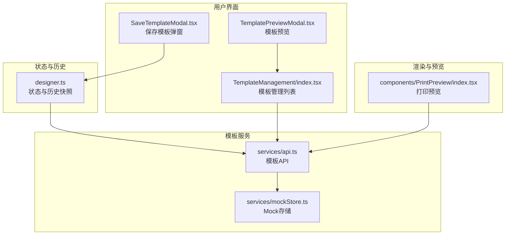
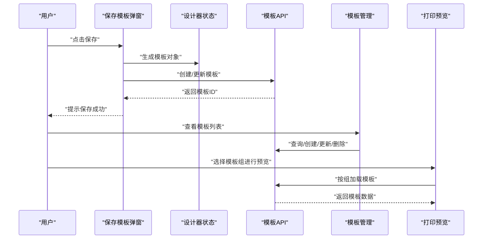
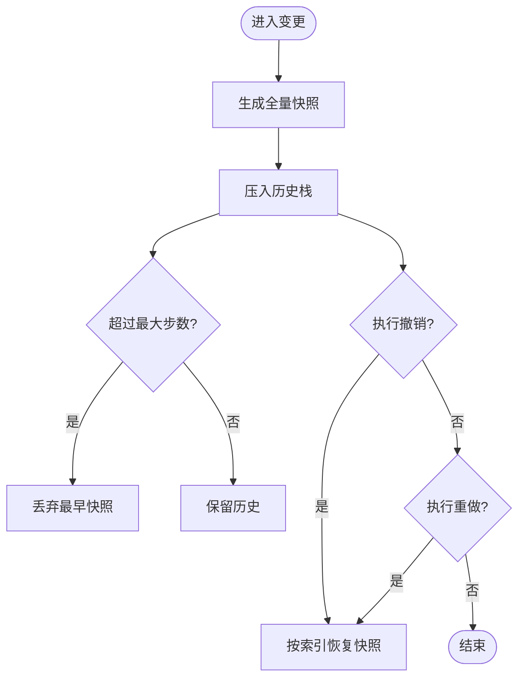
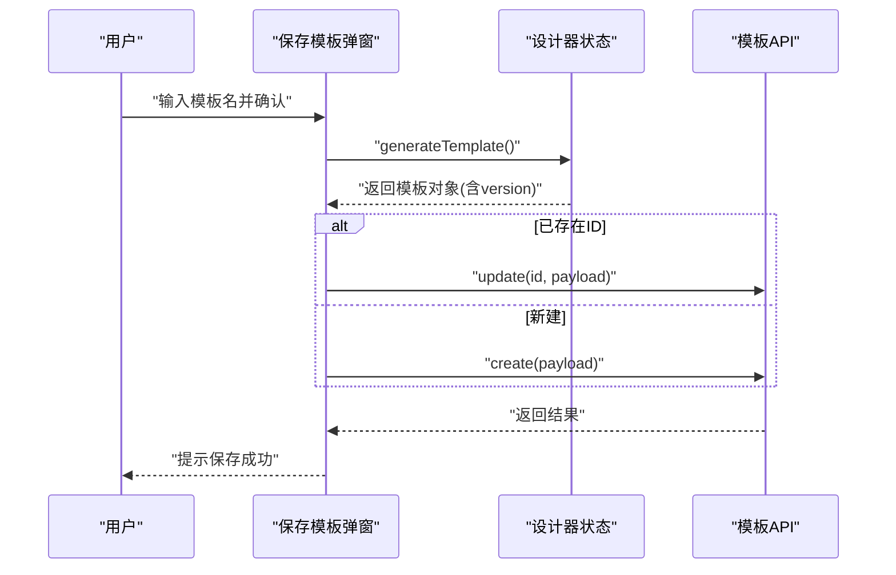
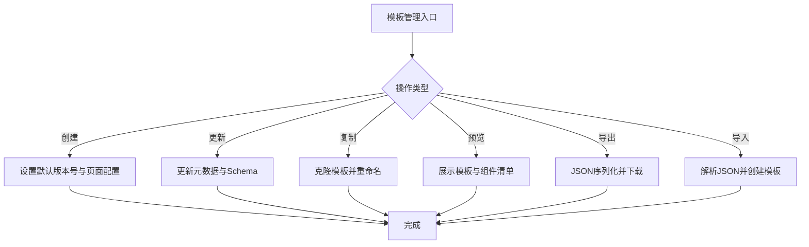
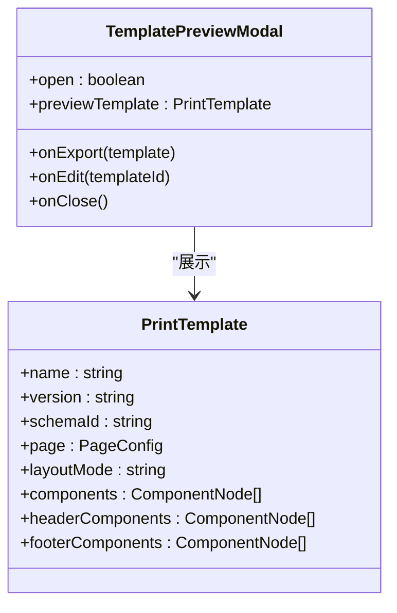
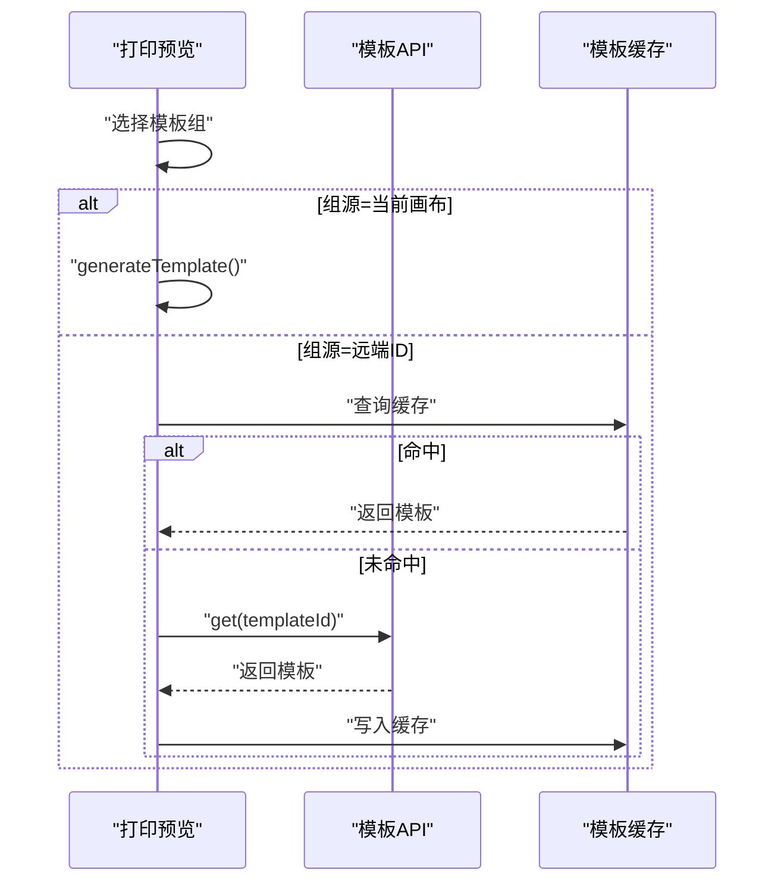
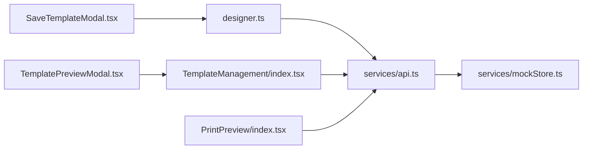

# 模板版本管理

<cite>
**本文引用的文件**
- [designer/src/store/designer.ts](file://designer/src/store/designer.ts)
- [designer/src/services/api.ts](file://designer/src/services/api.ts)
- [designer/src/services/mockStore.ts](file://designer/src/services/mockStore.ts)
- [designer/src/pages/Designer/components/Canvas/SaveTemplateModal.tsx](file://designer/src/pages/Designer/components/Canvas/SaveTemplateModal.tsx)
- [designer/src/pages/TemplateManagement/index.tsx](file://designer/src/pages/TemplateManagement/index.tsx)
- [designer/src/pages/TemplateManagement/components/TemplatePreviewModal.tsx](file://designer/src/pages/TemplateManagement/components/TemplatePreviewModal.tsx)
- [designer/src/components/PrintPreview/index.tsx](file://designer/src/components/PrintPreview/index.tsx)
- [docs/技术架构文档(仅参考).md](file://docs/技术架构文档(仅参考).md)
</cite>

## 目录
1. [引言](#引言)
2. [项目结构](#项目结构)
3. [核心组件](#核心组件)
4. [架构总览](#架构总览)
5. [详细组件分析](#详细组件分析)
6. [依赖关系分析](#依赖关系分析)
7. [性能考量](#性能考量)
8. [故障排查指南](#故障排查指南)
9. [结论](#结论)
10. [附录](#附录)

## 引言
本文件围绕“模板版本管理”主题，系统梳理代码库中与模板版本控制相关的实现机制与策略，包括版本号管理、版本历史与变更追踪、版本比较与差异分析、回滚与恢复、合并与分支管理、备份与归档、冲突解决与最佳实践，并结合实际应用场景给出使用示例与流程图。

当前代码库中的模板版本管理以“模板对象的持久化与历史快照”为核心，前端通过状态快照实现撤销/重做，后端提供模板的增删改查接口；同时具备模板导出/导入能力，便于跨环境迁移与备份。

## 项目结构
与模板版本管理直接相关的模块分布如下：
- 状态与历史：设计器状态管理与历史快照（撤销/重做）
- 模板服务：模板的增删改查与版本字段
- 用户界面：保存模板弹窗、模板管理列表与预览
- 渲染与预览：打印预览中对模板的加载与缓存

图表来源
- [designer/src/store/designer.ts:83-106](file://designer/src/store/designer.ts#L83-L106)
- [designer/src/services/api.ts:67-81](file://designer/src/services/api.ts#L67-L81)
- [designer/src/services/mockStore.ts:63-82](file://designer/src/services/mockStore.ts#L63-L82)
- [designer/src/pages/TemplateManagement/index.tsx:99-136](file://designer/src/pages/TemplateManagement/index.tsx#L99-L136)
- [designer/src/pages/TemplateManagement/components/TemplatePreviewModal.tsx:1-135](file://designer/src/pages/TemplateManagement/components/TemplatePreviewModal.tsx#L1-L135)
- [designer/src/pages/Designer/components/Canvas/SaveTemplateModal.tsx:1-176](file://designer/src/pages/Designer/components/Canvas/SaveTemplateModal.tsx#L1-L176)
- [designer/src/components/PrintPreview/index.tsx:128-160](file://designer/src/components/PrintPreview/index.tsx#L128-L160)

章节来源
- [designer/src/store/designer.ts:83-106](file://designer/src/store/designer.ts#L83-L106)
- [designer/src/services/api.ts:67-81](file://designer/src/services/api.ts#L67-L81)
- [designer/src/services/mockStore.ts:63-82](file://designer/src/services/mockStore.ts#L63-L82)
- [designer/src/pages/TemplateManagement/index.tsx:99-136](file://designer/src/pages/TemplateManagement/index.tsx#L99-L136)
- [designer/src/pages/TemplateManagement/components/TemplatePreviewModal.tsx:1-135](file://designer/src/pages/TemplateManagement/components/TemplatePreviewModal.tsx#L1-L135)
- [designer/src/pages/Designer/components/Canvas/SaveTemplateModal.tsx:1-176](file://designer/src/pages/Designer/components/Canvas/SaveTemplateModal.tsx#L1-L176)
- [designer/src/components/PrintPreview/index.tsx:128-160](file://designer/src/components/PrintPreview/index.tsx#L128-L160)

## 核心组件
- 状态与历史快照（撤销/重做）
  - 历史栈结构与索引维护，支持撤销与重做
  - 每次组件变更后生成全量快照，限制最大步数
- 模板服务
  - 提供模板列表、查询、创建、更新、删除接口
  - 支持Mock存储与真实API切换
- 用户界面
  - 保存模板弹窗：生成模板对象、校验组件边界、提交保存
  - 模板管理列表：创建/更新模板、复制、预览、导出/批量导出、导入
  - 模板预览弹窗：展示模板基本信息与组件清单
- 渲染与预览
  - 打印预览中按组加载模板，支持当前画布模板与远端模板
  - 模板缓存减少重复请求

章节来源
- [designer/src/store/designer.ts:83-106](file://designer/src/store/designer.ts#L83-L106)
- [designer/src/store/designer.ts:508-548](file://designer/src/store/designer.ts#L508-L548)
- [designer/src/services/api.ts:67-81](file://designer/src/services/api.ts#L67-L81)
- [designer/src/services/mockStore.ts:63-82](file://designer/src/services/mockStore.ts#L63-L82)
- [designer/src/pages/Designer/components/Canvas/SaveTemplateModal.tsx:96-123](file://designer/src/pages/Designer/components/Canvas/SaveTemplateModal.tsx#L96-L123)
- [designer/src/pages/TemplateManagement/index.tsx:138-222](file://designer/src/pages/TemplateManagement/index.tsx#L138-L222)
- [designer/src/pages/TemplateManagement/components/TemplatePreviewModal.tsx:1-135](file://designer/src/pages/TemplateManagement/components/TemplatePreviewModal.tsx#L1-L135)
- [designer/src/components/PrintPreview/index.tsx:128-160](file://designer/src/components/PrintPreview/index.tsx#L128-L160)

## 架构总览
模板版本管理的总体流程：
- 设计器侧通过状态快照实现本地版本（撤销/重做）
- 保存模板时生成模板对象并提交至后端
- 后端返回模板ID，前端更新路由参数与状态
- 模板管理界面支持复制、预览、导出/导入
- 打印预览按组加载模板，支持当前画布与远端模板

图表来源
- [designer/src/pages/Designer/components/Canvas/SaveTemplateModal.tsx:96-123](file://designer/src/pages/Designer/components/Canvas/SaveTemplateModal.tsx#L96-L123)
- [designer/src/store/designer.ts:189-201](file://designer/src/store/designer.ts#L189-L201)
- [designer/src/services/api.ts:67-81](file://designer/src/services/api.ts#L67-L81)
- [designer/src/pages/TemplateManagement/index.tsx:99-136](file://designer/src/pages/TemplateManagement/index.tsx#L99-L136)
- [designer/src/components/PrintPreview/index.tsx:128-160](file://designer/src/components/PrintPreview/index.tsx#L128-L160)

## 详细组件分析

### 组件A：状态与历史快照（撤销/重做）
- 数据结构
  - 历史栈：包含 headerComponents、components、footerComponents 的快照数组
  - 历史索引：指向当前快照位置
- 关键行为
  - 保存历史：每次变更后生成全量快照，超过最大步数则丢弃最早快照
  - 撤销/重做：根据索引向前/向后移动，恢复对应快照
  - 可撤销/可重做：基于索引边界判断
- 复杂度
  - 保存历史：O(n)，n为组件数量（深拷贝）
  - 撤销/重做：O(n)，恢复时深拷贝还原
- 错误处理
  - 索引越界保护
  - 最大步数限制避免内存膨胀

图表来源
- [designer/src/store/designer.ts:93-106](file://designer/src/store/designer.ts#L93-L106)
- [designer/src/store/designer.ts:508-548](file://designer/src/store/designer.ts#L508-L548)

章节来源
- [designer/src/store/designer.ts:83-106](file://designer/src/store/designer.ts#L83-L106)
- [designer/src/store/designer.ts:508-548](file://designer/src/store/designer.ts#L508-L548)

### 组件B：模板保存与版本号管理
- 版本号策略
  - 保存时模板对象包含 version 字段，默认值为固定版本字符串
  - 建议后续扩展为语义化版本号（主.次.修订），并支持自动递增
- 保存流程
  - 生成模板对象（含版本号）
  - 若存在模板ID则更新，否则创建新模板
  - 成功后刷新或更新路由参数
- 边界校验
  - 对页头/页脚/内容区组件进行边界检查，异常时弹窗确认

图表来源
- [designer/src/pages/Designer/components/Canvas/SaveTemplateModal.tsx:96-123](file://designer/src/pages/Designer/components/Canvas/SaveTemplateModal.tsx#L96-L123)
- [designer/src/store/designer.ts:189-201](file://designer/src/store/designer.ts#L189-L201)
- [designer/src/services/api.ts:67-81](file://designer/src/services/api.ts#L67-L81)

章节来源
- [designer/src/pages/Designer/components/Canvas/SaveTemplateModal.tsx:96-123](file://designer/src/pages/Designer/components/Canvas/SaveTemplateModal.tsx#L96-L123)
- [designer/src/store/designer.ts:189-201](file://designer/src/store/designer.ts#L189-L201)

### 组件C：模板管理与版本生命周期
- 生命周期操作
  - 创建：默认设置版本号与基础页面配置
  - 更新：修改名称、描述、Schema等
  - 复制：克隆模板并重命名
  - 预览：展示模板基本信息与组件清单
  - 导出/批量导出：JSON序列化
  - 导入：支持单个或批量导入
- 版本号管理建议
  - 导入时可选择保留或重写版本号
  - 导出时保留版本号以便跨环境迁移

图表来源
- [designer/src/pages/TemplateManagement/index.tsx:99-136](file://designer/src/pages/TemplateManagement/index.tsx#L99-L136)
- [designer/src/pages/TemplateManagement/index.tsx:138-222](file://designer/src/pages/TemplateManagement/index.tsx#L138-L222)
- [designer/src/pages/TemplateManagement/components/TemplatePreviewModal.tsx:1-135](file://designer/src/pages/TemplateManagement/components/TemplatePreviewModal.tsx#L1-L135)

章节来源
- [designer/src/pages/TemplateManagement/index.tsx:99-136](file://designer/src/pages/TemplateManagement/index.tsx#L99-L136)
- [designer/src/pages/TemplateManagement/index.tsx:138-222](file://designer/src/pages/TemplateManagement/index.tsx#L138-L222)
- [designer/src/pages/TemplateManagement/components/TemplatePreviewModal.tsx:1-135](file://designer/src/pages/TemplateManagement/components/TemplatePreviewModal.tsx#L1-L135)

### 组件D：模板预览与差异分析
- 预览能力
  - 展示模板名称、Schema、描述、组件列表与位置尺寸
  - 支持在设计器中打开编辑
- 差异分析建议
  - 当前未实现模板差异对比功能，建议引入模板对象深度比较算法（忽略时间戳、ID等无关字段）
  - 可提供可视化差异视图（新增/删除/修改的组件高亮）

图表来源
- [designer/src/pages/TemplateManagement/components/TemplatePreviewModal.tsx:1-135](file://designer/src/pages/TemplateManagement/components/TemplatePreviewModal.tsx#L1-L135)

章节来源
- [designer/src/pages/TemplateManagement/components/TemplatePreviewModal.tsx:1-135](file://designer/src/pages/TemplateManagement/components/TemplatePreviewModal.tsx#L1-L135)

### 组件E：打印预览与模板加载
- 加载策略
  - 当组源为“当前画布”时，直接生成模板对象
  - 当组源为“远端模板ID”时，优先使用缓存，否则请求后端并缓存
- 缓存机制
  - 使用内存缓存减少重复请求，提升预览响应速度

图表来源
- [designer/src/components/PrintPreview/index.tsx:128-160](file://designer/src/components/PrintPreview/index.tsx#L128-L160)
- [designer/src/services/api.ts:67-81](file://designer/src/services/api.ts#L67-L81)

章节来源
- [designer/src/components/PrintPreview/index.tsx:128-160](file://designer/src/components/PrintPreview/index.tsx#L128-L160)
- [designer/src/services/api.ts:67-81](file://designer/src/services/api.ts#L67-L81)

## 依赖关系分析
- 状态与历史依赖于设计器状态管理库，提供快照与索引
- 模板服务依赖API客户端，支持真实后端与Mock存储
- 用户界面组件依赖状态与服务，形成完整的版本管理闭环
- 打印预览依赖模板服务与缓存，确保加载效率

图表来源
- [designer/src/store/designer.ts:108-120](file://designer/src/store/designer.ts#L108-L120)
- [designer/src/services/api.ts:67-81](file://designer/src/services/api.ts#L67-L81)
- [designer/src/services/mockStore.ts:63-82](file://designer/src/services/mockStore.ts#L63-L82)
- [designer/src/pages/Designer/components/Canvas/SaveTemplateModal.tsx:1-176](file://designer/src/pages/Designer/components/Canvas/SaveTemplateModal.tsx#L1-L176)
- [designer/src/pages/TemplateManagement/index.tsx:99-136](file://designer/src/pages/TemplateManagement/index.tsx#L99-L136)
- [designer/src/pages/TemplateManagement/components/TemplatePreviewModal.tsx:1-135](file://designer/src/pages/TemplateManagement/components/TemplatePreviewModal.tsx#L1-L135)
- [designer/src/components/PrintPreview/index.tsx:128-160](file://designer/src/components/PrintPreview/index.tsx#L128-L160)

章节来源
- [designer/src/store/designer.ts:108-120](file://designer/src/store/designer.ts#L108-L120)
- [designer/src/services/api.ts:67-81](file://designer/src/services/api.ts#L67-L81)
- [designer/src/services/mockStore.ts:63-82](file://designer/src/services/mockStore.ts#L63-L82)
- [designer/src/pages/Designer/components/Canvas/SaveTemplateModal.tsx:1-176](file://designer/src/pages/Designer/components/Canvas/SaveTemplateModal.tsx#L1-L176)
- [designer/src/pages/TemplateManagement/index.tsx:99-136](file://designer/src/pages/TemplateManagement/index.tsx#L99-L136)
- [designer/src/pages/TemplateManagement/components/TemplatePreviewModal.tsx:1-135](file://designer/src/pages/TemplateManagement/components/TemplatePreviewModal.tsx#L1-L135)
- [designer/src/components/PrintPreview/index.tsx:128-160](file://designer/src/components/PrintPreview/index.tsx#L128-L160)

## 性能考量
- 历史快照
  - 全量快照带来内存占用与序列化成本，建议：
    - 控制最大历史步数
    - 对大模板启用增量快照或压缩存储
- 模板加载
  - 预览阶段使用内存缓存，减少网络请求
  - 对频繁访问的模板可考虑持久化缓存（IndexedDB）
- 导出/导入
  - 批量导出/导入时注意内存峰值，建议分批处理与进度反馈

## 故障排查指南
- 保存失败
  - 检查模板名称是否为空
  - 确认组件边界校验是否通过
  - 查看网络请求与后端返回
- 预览异常
  - 检查模板ID是否存在
  - 清除缓存后重试
- 撤销/重做无效
  - 确认历史索引边界
  - 检查最大历史步数限制

章节来源
- [designer/src/pages/Designer/components/Canvas/SaveTemplateModal.tsx:126-156](file://designer/src/pages/Designer/components/Canvas/SaveTemplateModal.tsx#L126-L156)
- [designer/src/components/PrintPreview/index.tsx:128-160](file://designer/src/components/PrintPreview/index.tsx#L128-L160)
- [designer/src/store/designer.ts:508-548](file://designer/src/store/designer.ts#L508-L548)

## 结论
当前实现以“状态快照+模板持久化”为基础，提供了版本化的本地编辑体验与远端模板管理能力。建议后续完善版本号策略、差异分析、回滚与合并机制，并建立标准化的备份与归档流程，以满足更复杂的版本管理需求。

## 附录

### 实际应用场景与使用示例
- 场景一：模板迭代
  - 步骤：在设计器中修改模板，使用撤销/重做验证变更；保存时生成新版本；在模板管理中复制为新版本并调整描述
- 场景二：跨环境迁移
  - 步骤：导出模板为JSON；在目标环境导入；必要时重写版本号
- 场景三：模板预览与对比
  - 步骤：在打印预览中选择不同模板组进行对比；使用预览弹窗核对组件与布局

章节来源
- [designer/src/pages/Designer/components/Canvas/SaveTemplateModal.tsx:96-123](file://designer/src/pages/Designer/components/Canvas/SaveTemplateModal.tsx#L96-L123)
- [designer/src/pages/TemplateManagement/index.tsx:138-222](file://designer/src/pages/TemplateManagement/index.tsx#L138-L222)
- [designer/src/pages/TemplateManagement/components/TemplatePreviewModal.tsx:1-135](file://designer/src/pages/TemplateManagement/components/TemplatePreviewModal.tsx#L1-L135)
- [designer/src/components/PrintPreview/index.tsx:128-160](file://designer/src/components/PrintPreview/index.tsx#L128-L160)