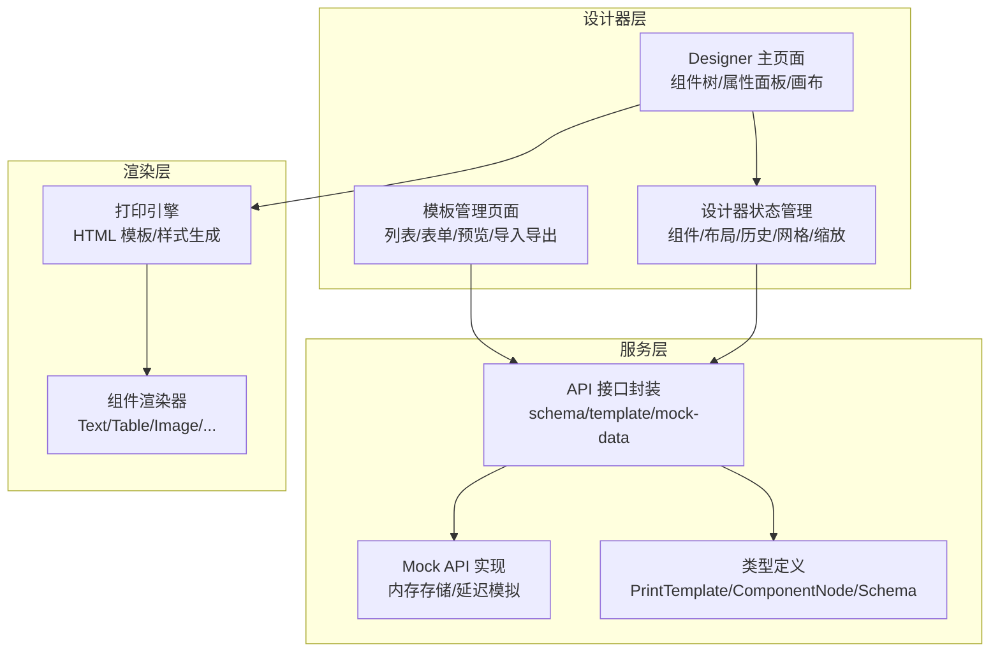
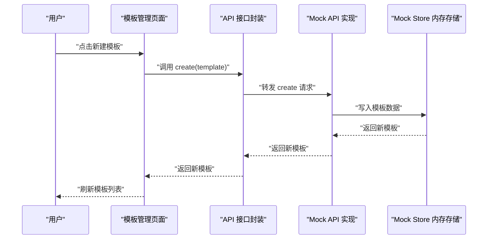
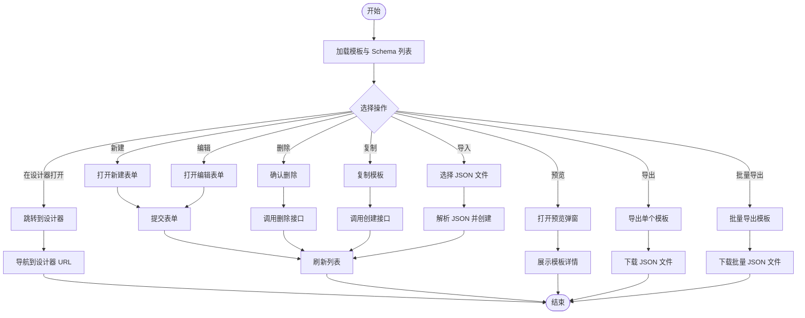
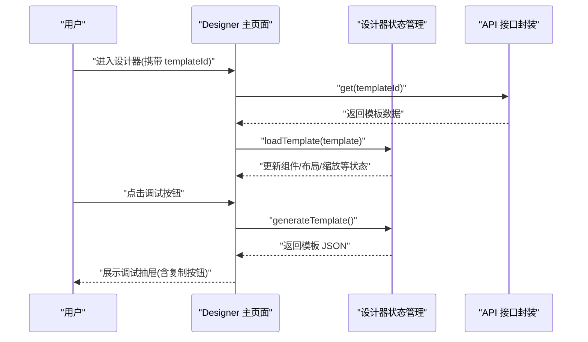
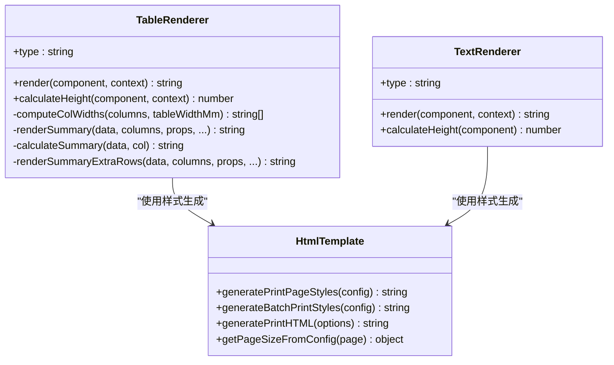
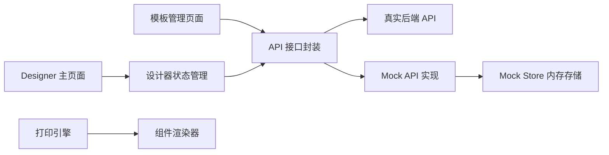

# 模板管理系统

<cite>
**本文档引用的文件**
- [Designer 主页面](file://designer/src/pages/Designer/index.tsx)
- [设计器状态管理](file://designer/src/store/designer.ts)
- [模板管理页面](file://designer/src/pages/TemplateManagement/index.tsx)
- [模板表单弹窗](file://designer/src/pages/TemplateManagement/components/TemplateFormModal.tsx)
- [模板预览弹窗](file://designer/src/pages/TemplateManagement/components/TemplatePreviewModal.tsx)
- [API 接口封装](file://designer/src/services/api.ts)
- [Mock API 实现](file://designer/src/services/mockApi.ts)
- [Mock Store 内存存储](file://designer/src/services/mockStore.ts)
- [类型定义](file://designer/src/types/index.ts)
- [打印引擎 HTML 模板](file://sdk/src/printEngine/htmlTemplate.ts)
- [表格渲染器](file://sdk/src/printEngine/renderers/TableRenderer.ts)
- [文本渲染器](file://sdk/src/printEngine/renderers/TextRenderer.ts)
</cite>

## 目录
1. [简介](#简介)
2. [项目结构](#项目结构)
3. [核心组件](#核心组件)
4. [架构概览](#架构概览)
5. [详细组件分析](#详细组件分析)
6. [依赖分析](#依赖分析)
7. [性能考虑](#性能考虑)
8. [故障排除指南](#故障排除指南)
9. [结论](#结论)
10. [附录](#附录)

## 简介
本系统是一个基于 Web 的模板管理系统，支持可视化设计打印模板、绑定数据 Schema、导出导入模板、实时预览与调试。系统采用前后端分离架构，前端使用 React + TypeScript，后端通过 Mock API 提供统一接口抽象，SDK 负责将模板渲染为可打印的 HTML。

## 项目结构
系统主要分为三层：
- 设计器层：提供可视化编辑界面，管理组件、属性、布局与历史撤销重做
- 服务层：封装 API 接口，支持真实后端与前端 Mock 两种运行模式
- 渲染层：SDK 将模板转换为可打印 HTML，支持多种组件渲染与分页

**图表来源**
- [Designer 主页面:1-365](file://designer/src/pages/Designer/index.tsx#L1-L365)
- [设计器状态管理:1-773](file://designer/src/store/designer.ts#L1-L773)
- [模板管理页面:1-432](file://designer/src/pages/TemplateManagement/index.tsx#L1-L432)
- [API 接口封装:1-134](file://designer/src/services/api.ts#L1-L134)
- [Mock API 实现:1-103](file://designer/src/services/mockApi.ts#L1-L103)
- [类型定义:1-378](file://designer/src/types/index.ts#L1-L378)
- [打印引擎 HTML 模板:1-281](file://sdk/src/printEngine/htmlTemplate.ts#L1-L281)
- [表格渲染器:1-602](file://sdk/src/printEngine/renderers/TableRenderer.ts#L1-L602)
- [文本渲染器:1-60](file://sdk/src/printEngine/renderers/TextRenderer.ts#L1-L60)

**章节来源**
- [Designer 主页面:1-365](file://designer/src/pages/Designer/index.tsx#L1-L365)
- [设计器状态管理:1-773](file://designer/src/store/designer.ts#L1-L773)
- [模板管理页面:1-432](file://designer/src/pages/TemplateManagement/index.tsx#L1-L432)
- [API 接口封装:1-134](file://designer/src/services/api.ts#L1-L134)

## 核心组件
- 模板结构与 JSON 规范
  - 模板包含页面配置、布局模式、组件列表以及可选的页头/页脚组件
  - 组件节点包含类型、布局、样式、数据绑定与特定属性
  - Schema 字典定义数据模型字段类型、枚举与格式化规则
- 模板生命周期
  - 创建：通过模板管理页面新建模板，初始化默认页面配置
  - 编辑：在设计器中添加/修改组件、调整布局与样式
  - 删除：从模板列表中删除模板
  - 复制：基于现有模板创建新模板副本
  - 导入导出：支持单个/批量 JSON 导入导出
- 数据绑定与渲染
  - 组件通过数据绑定路径从数据源取值，支持管道格式化
  - 渲染器根据组件类型生成对应的 HTML 结构与样式
- 预览与调试
  - 设计器内置调试抽屉展示当前模板 JSON，支持复制
  - 模板管理提供预览弹窗查看组件列表与页面参数

**章节来源**
- [类型定义:337-358](file://designer/src/types/index.ts#L337-L358)
- [类型定义:303-331](file://designer/src/types/index.ts#L303-L331)
- [类型定义:39-52](file://designer/src/types/index.ts#L39-L52)
- [模板管理页面:120-125](file://designer/src/pages/TemplateManagement/index.tsx#L120-L125)
- [模板管理页面:138-148](file://designer/src/pages/TemplateManagement/index.tsx#L138-L148)
- [模板管理页面:166-201](file://designer/src/pages/TemplateManagement/index.tsx#L166-L201)
- [设计器状态管理:189-201](file://designer/src/store/designer.ts#L189-L201)

## 架构概览
系统采用“前端 Mock + 真实后端”双模式，通过环境变量切换。设计器与模板管理页面通过统一 API 接口访问数据，渲染层负责将模板转换为可打印 HTML。

**图表来源**
- [模板管理页面:99-136](file://designer/src/pages/TemplateManagement/index.tsx#L99-L136)
- [API 接口封装:127-134](file://designer/src/services/api.ts#L127-L134)
- [Mock API 实现:58-69](file://designer/src/services/mockApi.ts#L58-L69)
- [Mock Store 内存存储:78-82](file://designer/src/services/mockStore.ts#L78-L82)

## 详细组件分析

### 模板管理模块
- 功能概述
  - 模板列表展示、搜索与筛选
  - 新建/编辑模板基本信息（名称、Schema、描述）
  - 删除、复制、导出、批量导出、导入
  - 预览模板详情与在设计器中打开
- 关键流程
  - 新建模板：提交表单后调用创建接口，初始化默认页面配置
  - 导入模板：支持单个或批量 JSON 文件，逐条创建
  - 复制模板：去除 ID 后以副本命名创建新模板
  - 预览模板：弹窗展示模板基本信息与组件列表

**图表来源**
- [模板管理页面:45-70](file://designer/src/pages/TemplateManagement/index.tsx#L45-L70)
- [模板管理页面:72-136](file://designer/src/pages/TemplateManagement/index.tsx#L72-L136)
- [模板管理页面:138-201](file://designer/src/pages/TemplateManagement/index.tsx#L138-L201)
- [模板管理页面:219-226](file://designer/src/pages/TemplateManagement/index.tsx#L219-L226)
- [模板表单弹窗:1-61](file://designer/src/pages/TemplateManagement/components/TemplateFormModal.tsx#L1-L61)
- [模板预览弹窗:1-136](file://designer/src/pages/TemplateManagement/components/TemplatePreviewModal.tsx#L1-L136)

**章节来源**
- [模板管理页面:1-432](file://designer/src/pages/TemplateManagement/index.tsx#L1-L432)
- [模板表单弹窗:1-61](file://designer/src/pages/TemplateManagement/components/TemplateFormModal.tsx#L1-L61)
- [模板预览弹窗:1-136](file://designer/src/pages/TemplateManagement/components/TemplatePreviewModal.tsx#L1-L136)

### 设计器模块
- 功能概述
  - 左右面板折叠、画布缩放、网格对齐、组件复制粘贴与层级管理
  - 撤销/重做（全量状态快照，最多 20 步）
  - 生成模板 JSON、加载模板、清空画布
  - 调试抽屉展示模板 JSON 与基本统计信息
- 关键流程
  - 加载模板：通过 URL 参数 templateId 获取模板并填充设计器状态
  - 生成模板：从状态中组装模板 JSON，包含页面配置与组件列表
  - 调试复制：将当前模板 JSON 复制到剪贴板

**图表来源**
- [Designer 主页面:26-46](file://designer/src/pages/Designer/index.tsx#L26-L46)
- [设计器状态管理:203-250](file://designer/src/store/designer.ts#L203-L250)
- [设计器状态管理:189-201](file://designer/src/store/designer.ts#L189-L201)
- [API 接口封装:73-76](file://designer/src/services/api.ts#L73-L76)

**章节来源**
- [Designer 主页面:1-365](file://designer/src/pages/Designer/index.tsx#L1-L365)
- [设计器状态管理:1-773](file://designer/src/store/designer.ts#L1-L773)

### 渲染引擎模块
- 功能概述
  - 生成打印页面样式（预览/批量打印两种模式）
  - 组件渲染器：文本、表格、图片、矩形、线条、二维码、条形码、页码
  - 表格渲染器支持列宽计算、合计行与额外行、跨页表头重复
- 关键流程
  - 表格渲染：根据列配置与数据动态生成表格 HTML，支持合计与格式化
  - 文本渲染：根据绑定值与样式生成文本元素
  - HTML 模板：生成完整的打印 HTML 文档，包含样式与内容

**图表来源**
- [表格渲染器:147-602](file://sdk/src/printEngine/renderers/TableRenderer.ts#L147-L602)
- [文本渲染器:10-60](file://sdk/src/printEngine/renderers/TextRenderer.ts#L10-L60)
- [打印引擎 HTML 模板:81-281](file://sdk/src/printEngine/htmlTemplate.ts#L81-L281)

**章节来源**
- [表格渲染器:1-602](file://sdk/src/printEngine/renderers/TableRenderer.ts#L1-L602)
- [文本渲染器:1-60](file://sdk/src/printEngine/renderers/TextRenderer.ts#L1-L60)
- [打印引擎 HTML 模板:1-281](file://sdk/src/printEngine/htmlTemplate.ts#L1-L281)

## 依赖分析
- 组件耦合
  - 设计器状态管理与模板管理页面通过 API 接口解耦
  - 渲染引擎与设计器通过模板 JSON 解耦
- 外部依赖
  - axios 用于 HTTP 请求
  - zustand 用于状态管理
  - antd 用于 UI 组件库
- Mock 机制
  - 通过环境变量切换真实后端或前端 Mock
  - Mock Store 提供内存数据持久化与 CRUD 操作

**图表来源**
- [API 接口封装:127-134](file://designer/src/services/api.ts#L127-L134)
- [Mock API 实现:1-103](file://designer/src/services/mockApi.ts#L1-L103)
- [Mock Store 内存存储:1-135](file://designer/src/services/mockStore.ts#L1-L135)

**章节来源**
- [API 接口封装:1-134](file://designer/src/services/api.ts#L1-L134)
- [Mock API 实现:1-103](file://designer/src/services/mockApi.ts#L1-L103)
- [Mock Store 内存存储:1-135](file://designer/src/services/mockStore.ts#L1-L135)

## 性能考虑
- 渲染性能
  - 表格渲染器使用列宽计算与最小行高估算，避免复杂 DOM 测量
  - 合计计算使用高精度库减少浮点误差
- 状态管理
  - 撤销/重做采用全量快照，限制最大步数以控制内存占用
  - 组件复制粘贴时进行深拷贝，避免引用污染
- 网络与 Mock
  - Mock API 添加异步延迟模拟真实网络，提升开发体验
  - 批量导入模板时逐条创建，避免一次性大量请求

**章节来源**
- [表格渲染器:40-463](file://sdk/src/printEngine/renderers/TableRenderer.ts#L40-L463)
- [设计器状态管理:92-106](file://designer/src/store/designer.ts#L92-L106)
- [Mock API 实现:4-7](file://designer/src/services/mockApi.ts#L4-L7)

## 故障排除指南
- 模板加载失败
  - 检查 URL 中 templateId 是否正确
  - 查看控制台错误信息，确认后端接口可达性
- 模板导入失败
  - 确认 JSON 格式正确，包含必要字段（如 name、components）
  - 批量导入时逐条创建，关注单个失败项
- 表格渲染异常
  - 检查列宽设置与数据路径，避免溢出右页边距
  - 确认合计配置与格式化管道参数正确
- Mock 数据不可用
  - 确认 Mock 模式已启用（环境变量）
  - 检查 Mock Store 中是否存在对应数据

**章节来源**
- [Designer 主页面:34-46](file://designer/src/pages/Designer/index.tsx#L34-L46)
- [模板管理页面:166-201](file://designer/src/pages/TemplateManagement/index.tsx#L166-L201)
- [表格渲染器:195-228](file://sdk/src/printEngine/renderers/TableRenderer.ts#L195-L228)
- [Mock Store 内存存储:18-23](file://designer/src/services/mockStore.ts#L18-L23)

## 结论
模板管理系统提供了完整的模板生命周期管理能力，结合可视化设计器与渲染引擎，能够高效地创建、编辑、预览与打印各类打印模板。通过清晰的类型定义与模块化设计，系统具备良好的扩展性与维护性。

## 附录

### 模板 JSON 结构规范
- 必填字段
  - id: 模板唯一标识
  - name: 模板名称
  - version: 模板版本号
  - schemaId: 关联的 Schema ID
  - page: 页面配置（尺寸、方向、边距、页码等）
  - layoutMode: 布局模式（absolute/flow）
  - components: 组件列表
- 可选字段
  - headerComponents: 页头区域组件
  - footerComponents: 页脚区域组件
  - description: 模板描述说明

**章节来源**
- [类型定义:337-358](file://designer/src/types/index.ts#L337-L358)

### Schema 绑定与数据渲染
- Schema 字典定义数据模型字段类型、枚举与格式化规则
- 组件通过数据绑定路径从数据源取值，支持管道格式化
- 渲染器根据组件类型生成对应的 HTML 结构与样式

**章节来源**
- [类型定义:39-52](file://designer/src/types/index.ts#L39-L52)
- [类型定义:157-164](file://designer/src/types/index.ts#L157-L164)
- [表格渲染器:150-162](file://sdk/src/printEngine/renderers/TableRenderer.ts#L150-L162)

### 模板导入导出使用指南
- 导出
  - 单个模板：点击导出按钮下载 JSON 文件
  - 批量导出：点击批量导出按钮下载包含所有模板的 JSON 文件
- 导入
  - 支持单个或批量 JSON 文件
  - 导入时会忽略 ID 字段并创建新模板

**章节来源**
- [模板管理页面:138-148](file://designer/src/pages/TemplateManagement/index.tsx#L138-L148)
- [模板管理页面:150-164](file://designer/src/pages/TemplateManagement/index.tsx#L150-L164)
- [模板管理页面:166-201](file://designer/src/pages/TemplateManagement/index.tsx#L166-L201)

### 预览、测试与调试方法
- 设计器调试抽屉
  - 展示模板名称、Schema ID、组件数量统计与完整模板 JSON
  - 支持一键复制模板 JSON
- 模板预览弹窗
  - 展示模板基本信息与组件列表
  - 支持在设计器中打开模板进行编辑

**章节来源**
- [Designer 主页面:317-359](file://designer/src/pages/Designer/index.tsx#L317-L359)
- [模板预览弹窗:1-136](file://designer/src/pages/TemplateManagement/components/TemplatePreviewModal.tsx#L1-L136)

### 模板设计规范与最佳实践
- 布局建议
  - 使用网格对齐与对齐工具保证组件排列整齐
  - 合理设置页面边距与页头/页脚高度
- 组件使用
  - 表格组件避免放置在页头/页脚区域
  - 文本组件支持标签前缀与多行文本
- 性能优化
  - 控制组件数量与复杂度
  - 合理使用管道格式化，避免过度计算

**章节来源**
- [设计器状态管理:469-506](file://designer/src/store/designer.ts#L469-L506)
- [文本渲染器:17-20](file://sdk/src/printEngine/renderers/TextRenderer.ts#L17-L20)

### 常见应用场景与示例
- 订单打印模板：包含订单信息、商品明细表格与合计行
- 标签打印模板：使用文本与二维码组件快速生成标签
- 报表打印模板：利用表格渲染器与合计功能生成报表

**章节来源**
- [表格渲染器:268-327](file://sdk/src/printEngine/renderers/TableRenderer.ts#L268-L327)
- [文本渲染器:13-53](file://sdk/src/printEngine/renderers/TextRenderer.ts#L13-L53)