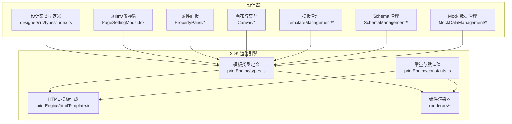
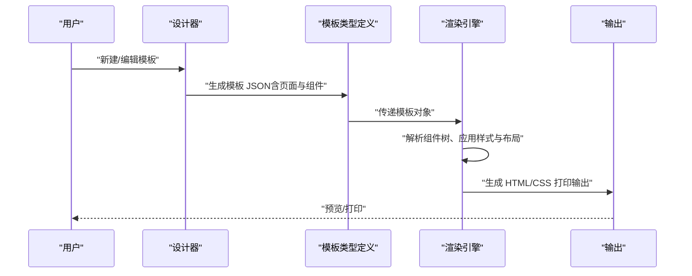
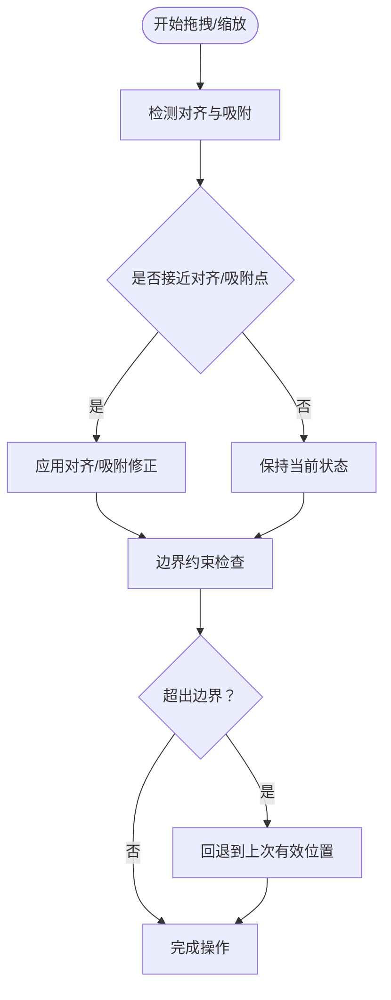
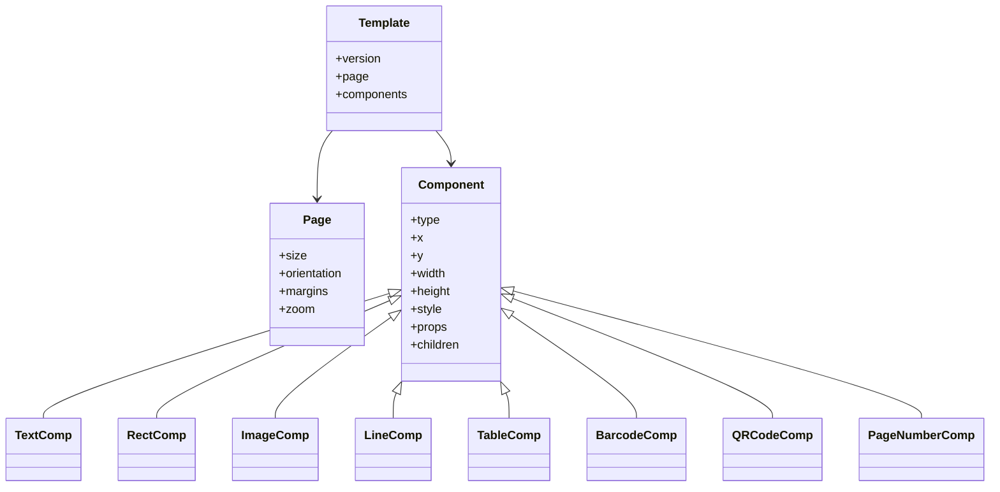
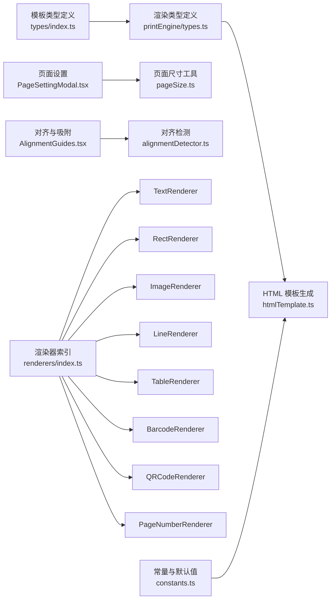

# 模板设计规范

<cite>
**本文引用的文件**
- [designer/src/types/index.ts](file://designer/src/types/index.ts)
- [sdk/src/printEngine/types.ts](file://sdk/src/printEngine/types.ts)
- [sdk/src/printEngine/constants.ts](file://sdk/src/printEngine/constants.ts)
- [sdk/src/printEngine/htmlTemplate.ts](file://sdk/src/printEngine/htmlTemplate.ts)
- [designer/src/pages/Designer/components/Canvas/PageSettingModal.tsx](file://designer/src/pages/Designer/components/Canvas/PageSettingModal.tsx)
- [designer/src/utils/pageSize.ts](file://designer/src/utils/pageSize.ts)
- [designer/src/pages/Designer/components/PropertyPanel/LayoutSection.tsx](file://designer/src/pages/Designer/components/PropertyPanel/LayoutSection.tsx)
- [designer/src/pages/Designer/components/PropertyPanel/StyleSection.tsx](file://designer/src/pages/Designer/components/PropertyPanel/StyleSection.tsx)
- [designer/src/pages/Designer/components/Canvas/AlignmentGuides.tsx](file://designer/src/pages/Designer/components/Canvas/AlignmentGuides.tsx)
- [designer/src/pages/Designer/components/Canvas/alignmentDetector.ts](file://designer/src/pages/Designer/components/Canvas/alignmentDetector.ts)
- [designer/src/pages/Designer/components/Canvas/ResizeHandles.tsx](file://designer/src/pages/Designer/components/Canvas/ResizeHandles.tsx)
- [designer/src/pages/Designer/components/Canvas/CanvasToolbar.tsx](file://designer/src/pages/Designer/components/Canvas/CanvasToolbar.tsx)
- [designer/src/pages/Designer/components/Canvas/componentRenderers/index.ts](file://designer/src/pages/Designer/components/Canvas/componentRenderers/index.ts)
- [sdk/src/printEngine/renderers/index.ts](file://sdk/src/printEngine/renderers/index.ts)
- [sdk/src/printEngine/renderers/TextRenderer.ts](file://sdk/src/printEngine/renderers/TextRenderer.ts)
- [sdk/src/printEngine/renderers/RectRenderer.ts](file://sdk/src/printEngine/renderers/RectRenderer.ts)
- [sdk/src/printEngine/renderers/ImageRenderer.ts](file://sdk/src/printEngine/renderers/ImageRenderer.ts)
- [sdk/src/printEngine/renderers/LineRenderer.ts](file://sdk/src/printEngine/renderers/LineRenderer.ts)
- [sdk/src/printEngine/renderers/TableRenderer.ts](file://sdk/src/printEngine/renderers/TableRenderer.ts)
- [sdk/src/printEngine/renderers/BarcodeRenderer.ts](file://sdk/src/printEngine/renderers/BarcodeRenderer.ts)
- [sdk/src/printEngine/renderers/QRCodeRenderer.ts](file://sdk/src/printEngine/renderers/QRCodeRenderer.ts)
- [sdk/src/printEngine/renderers/PageNumberRenderer.ts](file://sdk/src/printEngine/renderers/PageNumberRenderer.ts)
- [designer/src/services/mock/templates.ts](file://designer/src/services/mock/templates.ts)
- [designer/src/services/mock/schemas.ts](file://designer/src/services/mock/schemas.ts)
- [designer/src/services/mock/mockData.ts](file://designer/src/services/mock/mockData.ts)
- [designer/src/pages/Designer/components/TemplateManagement/components/TemplateFormModal.tsx](file://designer/src/pages/Designer/components/TemplateManagement/components/TemplateFormModal.tsx)
- [designer/src/pages/Designer/components/TemplateManagement/components/TemplatePreviewModal.tsx](file://designer/src/pages/Designer/components/TemplateManagement/components/TemplatePreviewModal.tsx)
- [designer/src/pages/Designer/components/SchemaManagement/components/SchemaFormModal.tsx](file://designer/src/pages/Designer/components/SchemaManagement/components/SchemaFormModal.tsx)
- [designer/src/pages/Designer/components/SchemaManagement/components/SchemaPreviewModal.tsx](file://designer/src/pages/Designer/components/SchemaManagement/components/SchemaPreviewModal.tsx)
- [designer/src/pages/Designer/components/MockDataManagement/components/MockDataFormModal.tsx](file://designer/src/pages/Designer/components/MockDataManagement/components/MockDataFormModal.tsx)
</cite>

## 目录
1. [引言](#引言)
2. [项目结构](#项目结构)
3. [核心组件](#核心组件)
4. [架构总览](#架构总览)
5. [详细组件分析](#详细组件分析)
6. [依赖分析](#依赖分析)
7. [性能考虑](#性能考虑)
8. [故障排查指南](#故障排查指南)
9. [结论](#结论)
10. [附录](#附录)

## 引言
本文件面向模板设计与实现人员，系统化阐述打印模板的 JSON 结构设计、字段规范、页面与组件配置、布局与对齐规则、验证与错误检查机制，以及最佳实践与示例。模板体系由“设计器”和“渲染引擎（SDK）”两部分协作完成：设计器负责可视化编辑、属性面板配置、页面设置与组件树管理；渲染引擎负责将模板 JSON 渲染为可打印的 HTML/CSS 输出。

## 项目结构
- 设计器（前端）：提供页面设置、组件属性面板、画布操作、组件库与预览等功能模块。
- SDK（渲染引擎）：提供组件渲染器、HTML 模板生成、样式构建工具与常量定义。

**图表来源**
- [designer/src/types/index.ts](file://designer/src/types/index.ts)
- [sdk/src/printEngine/types.ts](file://sdk/src/printEngine/types.ts)
- [sdk/src/printEngine/constants.ts](file://sdk/src/printEngine/constants.ts)
- [sdk/src/printEngine/htmlTemplate.ts](file://sdk/src/printEngine/htmlTemplate.ts)
- [sdk/src/printEngine/renderers/index.ts](file://sdk/src/printEngine/renderers/index.ts)

**章节来源**
- [designer/src/types/index.ts](file://designer/src/types/index.ts)
- [sdk/src/printEngine/types.ts](file://sdk/src/printEngine/types.ts)
- [sdk/src/printEngine/constants.ts](file://sdk/src/printEngine/constants.ts)
- [sdk/src/printEngine/htmlTemplate.ts](file://sdk/src/printEngine/htmlTemplate.ts)

## 核心组件
- 模板类型与字段规范：模板 JSON 的顶层字段、页面配置、组件数组及其子节点结构。
- 页面设置：纸张尺寸、方向、边距等。
- 组件类型：文本、矩形、图片、线条、表格、条码、二维码、页码等。
- 属性面板：布局、样式、数据绑定等配置项。
- 布局与对齐：网格吸附、对齐辅助线、拖拽缩放与约束检测。
- 验证与错误检查：字段必填、范围校验、类型一致性、循环引用与非法嵌套检测。
- 最佳实践：组件层级、布局策略、样式复用、性能优化与可维护性。

**章节来源**
- [designer/src/pages/Designer/components/Canvas/PageSettingModal.tsx](file://designer/src/pages/Designer/components/Canvas/PageSettingModal.tsx)
- [designer/src/pages/Designer/components/PropertyPanel/LayoutSection.tsx](file://designer/src/pages/Designer/components/PropertyPanel/LayoutSection.tsx)
- [designer/src/pages/Designer/components/PropertyPanel/StyleSection.tsx](file://designer/src/pages/Designer/components/PropertyPanel/StyleSection.tsx)
- [sdk/src/printEngine/renderers/index.ts](file://sdk/src/printEngine/renderers/index.ts)

## 架构总览
模板从“设计态”到“渲染态”的流转如下：

**图表来源**
- [designer/src/types/index.ts](file://designer/src/types/index.ts)
- [sdk/src/printEngine/types.ts](file://sdk/src/printEngine/types.ts)
- [sdk/src/printEngine/htmlTemplate.ts](file://sdk/src/printEngine/htmlTemplate.ts)

## 详细组件分析

### 模板 JSON 结构与字段规范
- 顶层字段
  - 版本号：用于兼容性控制与升级策略。
  - 页面配置：纸张尺寸、方向、边距、缩放等。
  - 组件数组：根节点集合，支持嵌套。
- 页面配置
  - 尺寸：标准纸张或自定义宽高。
  - 方向：纵向/横向。
  - 边距：上、下、左、右。
  - 缩放：整体缩放比例。
- 组件节点
  - 类型：文本、矩形、图片、线条、表格、条码、二维码、页码等。
  - 基础定位：x、y、width、height。
  - 样式：颜色、字体、对齐、边框、阴影等。
  - 行为：数据绑定、管道处理、事件等。
  - 子节点：容器类组件支持嵌套，遵循层级关系。
- 数据与 Schema
  - Schema 定义字段类型与约束。
  - Mock 数据用于预览与测试。
  - 数据绑定将组件属性与字段关联。

**章节来源**
- [designer/src/types/index.ts](file://designer/src/types/index.ts)
- [sdk/src/printEngine/types.ts](file://sdk/src/printEngine/types.ts)
- [designer/src/services/mock/schemas.ts](file://designer/src/services/mock/schemas.ts)
- [designer/src/services/mock/mockData.ts](file://designer/src/services/mock/mockData.ts)

### 页面设置与布局约束
- 页面设置弹窗提供尺寸、方向、边距与缩放配置，变更后实时反映在画布。
- 布局约束
  - 网格吸附：基于网格步进进行位置与尺寸调整。
  - 对齐辅助线：拖拽时显示对齐提示，便于精确布局。
  - 边界约束：组件不可超出页面边界。
  - 比例约束：部分组件支持等比缩放。
- 对齐规则
  - 左对齐、右对齐、水平居中、上对齐、下对齐、垂直居中。
  - 多选组件统一对齐与分布。

**图表来源**
- [designer/src/pages/Designer/components/Canvas/AlignmentGuides.tsx](file://designer/src/pages/Designer/components/Canvas/AlignmentGuides.tsx)
- [designer/src/pages/Designer/components/Canvas/alignmentDetector.ts](file://designer/src/pages/Designer/components/Canvas/alignmentDetector.ts)
- [designer/src/pages/Designer/components/Canvas/ResizeHandles.tsx](file://designer/src/pages/Designer/components/Canvas/ResizeHandles.tsx)

**章节来源**
- [designer/src/pages/Designer/components/Canvas/PageSettingModal.tsx](file://designer/src/pages/Designer/components/Canvas/PageSettingModal.tsx)
- [designer/src/utils/pageSize.ts](file://designer/src/utils/pageSize.ts)
- [designer/src/pages/Designer/components/Canvas/AlignmentGuides.tsx](file://designer/src/pages/Designer/components/Canvas/AlignmentGuides.tsx)
- [designer/src/pages/Designer/components/Canvas/alignmentDetector.ts](file://designer/src/pages/Designer/components/Canvas/alignmentDetector.ts)
- [designer/src/pages/Designer/components/Canvas/ResizeHandles.tsx](file://designer/src/pages/Designer/components/Canvas/ResizeHandles.tsx)

### 组件类型与属性设置
- 文本组件：支持多行、字体、字号、颜色、对齐、行高、字间距、换行策略、数据绑定与管道。
- 矩形组件：填充色、描边、圆角、阴影、渐变等。
- 图片组件：资源加载、裁剪模式、对齐方式、占位图与错误处理。
- 线条组件：方向、长度、粗细、颜色、虚线样式。
- 表格组件：行列数、单元格样式、表头、合并单元格、边框。
- 条码组件：编码类型、数据源、尺寸、方向、颜色。
- 二维码组件：数据源、尺寸、颜色、容错级别。
- 页码组件：格式、位置、对齐、样式。
- 公共属性：z-index、可见性、旋转、透明度、阴影、滤镜等。

**图表来源**
- [designer/src/types/index.ts](file://designer/src/types/index.ts)
- [sdk/src/printEngine/types.ts](file://sdk/src/printEngine/types.ts)

**章节来源**
- [sdk/src/printEngine/renderers/TextRenderer.ts](file://sdk/src/printEngine/renderers/TextRenderer.ts)
- [sdk/src/printEngine/renderers/RectRenderer.ts](file://sdk/src/printEngine/renderers/RectRenderer.ts)
- [sdk/src/printEngine/renderers/ImageRenderer.ts](file://sdk/src/printEngine/renderers/ImageRenderer.ts)
- [sdk/src/printEngine/renderers/LineRenderer.ts](file://sdk/src/printEngine/renderers/LineRenderer.ts)
- [sdk/src/printEngine/renderers/TableRenderer.ts](file://sdk/src/printEngine/renderers/TableRenderer.ts)
- [sdk/src/printEngine/renderers/BarcodeRenderer.ts](file://sdk/src/printEngine/renderers/BarcodeRenderer.ts)
- [sdk/src/printEngine/renderers/QRCodeRenderer.ts](file://sdk/src/printEngine/renderers/QRCodeRenderer.ts)
- [sdk/src/printEngine/renderers/PageNumberRenderer.ts](file://sdk/src/printEngine/renderers/PageNumberRenderer.ts)

### 属性面板与数据绑定
- 布局面板：定位、尺寸、对齐、间距、换行、对齐辅助线开关。
- 样式面板：颜色、字体、边框、阴影、背景、渐变、滤镜、透明度。
- 数据绑定面板：字段选择、管道链、条件渲染、占位符与回退值。
- 表格列面板：列宽、对齐、格式化、隐藏与排序。

**章节来源**
- [designer/src/pages/Designer/components/PropertyPanel/LayoutSection.tsx](file://designer/src/pages/Designer/components/PropertyPanel/LayoutSection.tsx)
- [designer/src/pages/Designer/components/PropertyPanel/StyleSection.tsx](file://designer/src/pages/Designer/components/PropertyPanel/StyleSection.tsx)

### 模板保存与预览
- 模板表单弹窗：名称、描述、分类、标签、版本与备注。
- 模板预览弹窗：以真实渲染效果展示模板，支持切换 Schema 与 Mock 数据。
- Schema 表单与预览：定义字段类型、约束与帮助信息。
- Mock 数据表单：生成与编辑测试数据，支持批量导入导出。

**章节来源**
- [designer/src/pages/Designer/components/TemplateManagement/components/TemplateFormModal.tsx](file://designer/src/pages/Designer/components/TemplateManagement/components/TemplateFormModal.tsx)
- [designer/src/pages/Designer/components/TemplateManagement/components/TemplatePreviewModal.tsx](file://designer/src/pages/Designer/components/TemplateManagement/components/TemplatePreviewModal.tsx)
- [designer/src/pages/Designer/components/SchemaManagement/components/SchemaFormModal.tsx](file://designer/src/pages/Designer/components/SchemaManagement/components/SchemaFormModal.tsx)
- [designer/src/pages/Designer/components/SchemaManagement/components/SchemaPreviewModal.tsx](file://designer/src/pages/Designer/components/SchemaManagement/components/SchemaPreviewModal.tsx)
- [designer/src/pages/Designer/components/MockDataManagement/components/MockDataFormModal.tsx](file://designer/src/pages/Designer/components/MockDataManagement/components/MockDataFormModal.tsx)

## 依赖分析
- 设计器类型定义驱动渲染引擎行为，确保模板 JSON 字段与渲染器一致。
- 页面设置与工具栏影响画布渲染与对齐检测。
- 组件渲染器按类型分发，共享样式构建与 HTML 模板生成逻辑。
- Mock 数据与 Schema 为模板开发与预览提供支撑。

**图表来源**
- [designer/src/types/index.ts](file://designer/src/types/index.ts)
- [sdk/src/printEngine/types.ts](file://sdk/src/printEngine/types.ts)
- [sdk/src/printEngine/constants.ts](file://sdk/src/printEngine/constants.ts)
- [sdk/src/printEngine/htmlTemplate.ts](file://sdk/src/printEngine/htmlTemplate.ts)
- [designer/src/pages/Designer/components/Canvas/PageSettingModal.tsx](file://designer/src/pages/Designer/components/Canvas/PageSettingModal.tsx)
- [designer/src/utils/pageSize.ts](file://designer/src/utils/pageSize.ts)
- [designer/src/pages/Designer/components/Canvas/AlignmentGuides.tsx](file://designer/src/pages/Designer/components/Canvas/AlignmentGuides.tsx)
- [designer/src/pages/Designer/components/Canvas/alignmentDetector.ts](file://designer/src/pages/Designer/components/Canvas/alignmentDetector.ts)
- [sdk/src/printEngine/renderers/index.ts](file://sdk/src/printEngine/renderers/index.ts)

**章节来源**
- [designer/src/types/index.ts](file://designer/src/types/index.ts)
- [sdk/src/printEngine/types.ts](file://sdk/src/printEngine/types.ts)
- [sdk/src/printEngine/constants.ts](file://sdk/src/printEngine/constants.ts)
- [sdk/src/printEngine/htmlTemplate.ts](file://sdk/src/printEngine/htmlTemplate.ts)
- [designer/src/pages/Designer/components/Canvas/PageSettingModal.tsx](file://designer/src/pages/Designer/components/Canvas/PageSettingModal.tsx)
- [designer/src/utils/pageSize.ts](file://designer/src/utils/pageSize.ts)
- [designer/src/pages/Designer/components/Canvas/AlignmentGuides.tsx](file://designer/src/pages/Designer/components/Canvas/AlignmentGuides.tsx)
- [designer/src/pages/Designer/components/Canvas/alignmentDetector.ts](file://designer/src/pages/Designer/components/Canvas/alignmentDetector.ts)
- [sdk/src/printEngine/renderers/index.ts](file://sdk/src/printEngine/renderers/index.ts)

## 性能考虑
- 渲染器按需加载与懒执行，避免不必要的重排与重绘。
- 使用样式构建工具统一生成 CSS，减少内联样式的重复计算。
- 组件树深度与复杂度控制，优先扁平化布局，减少嵌套层级。
- 图片与资源采用延迟加载与缓存策略，提升预览与打印效率。
- 大表格分页或虚拟滚动策略，降低渲染压力。

## 故障排查指南
- 字段缺失或类型不匹配：检查模板 JSON 是否符合类型定义，确认必填字段与类型。
- 坐标越界：检查组件 x/y/width/height 与页面边界的相对关系。
- 数据绑定异常：核对 Schema 字段是否存在，管道链是否正确，Mock 数据是否完整。
- 对齐与吸附无效：确认网格步进与吸附阈值设置，检查对齐辅助线是否启用。
- 渲染结果异常：查看渲染器映射与 HTML 模板生成逻辑，确认样式构建与常量配置。

**章节来源**
- [designer/src/types/index.ts](file://designer/src/types/index.ts)
- [sdk/src/printEngine/types.ts](file://sdk/src/printEngine/types.ts)
- [sdk/src/printEngine/htmlTemplate.ts](file://sdk/src/printEngine/htmlTemplate.ts)

## 结论
模板设计规范通过“类型定义—页面设置—组件配置—渲染输出”的闭环，确保设计态与渲染态的一致性。遵循层级清晰、布局约束明确、样式与数据解耦、验证与错误检查完善的最佳实践，可显著提升模板的可维护性与可扩展性。

## 附录

### 模板结构验证规则与错误检查机制
- 必填字段：版本号、页面配置、组件数组。
- 类型一致性：组件类型必须在渲染器注册表中存在。
- 坐标与尺寸：x/y/width/height 应为非负数值，width/height 不得为 0。
- 嵌套合法性：容器组件允许 children，叶子组件禁止 children。
- 样式与属性：颜色、字体、边框等应符合合法取值范围。
- 数据绑定：字段名需存在于 Schema，管道链顺序正确。
- 循环引用：检测组件树中的循环引用与非法父子关系。

**章节来源**
- [designer/src/types/index.ts](file://designer/src/types/index.ts)
- [sdk/src/printEngine/types.ts](file://sdk/src/printEngine/types.ts)

### 设计示例与规范模板
- 规范模板建议
  - 使用标准纸张尺寸与合适的边距，保证打印留白充足。
  - 文本组件尽量使用系统字体，避免外部字体导致的渲染差异。
  - 表格组件优先使用固定列宽，避免动态宽度带来的布局抖动。
  - 图片组件提供占位图与错误处理，确保预览稳定性。
  - 数据绑定与管道链清晰可读，避免过长链路。
- 示例场景
  - 财务票据：固定尺寸、严格对齐、金额与日期格式化、条码/二维码。
  - 标签页：小尺寸、高对比度、简洁布局、无多余装饰。
  - 报表：分页表格、页眉页脚、页码组件、条件样式。

**章节来源**
- [designer/src/services/mock/templates.ts](file://designer/src/services/mock/templates.ts)
- [designer/src/services/mock/schemas.ts](file://designer/src/services/mock/schemas.ts)
- [designer/src/services/mock/mockData.ts](file://designer/src/services/mock/mockData.ts)