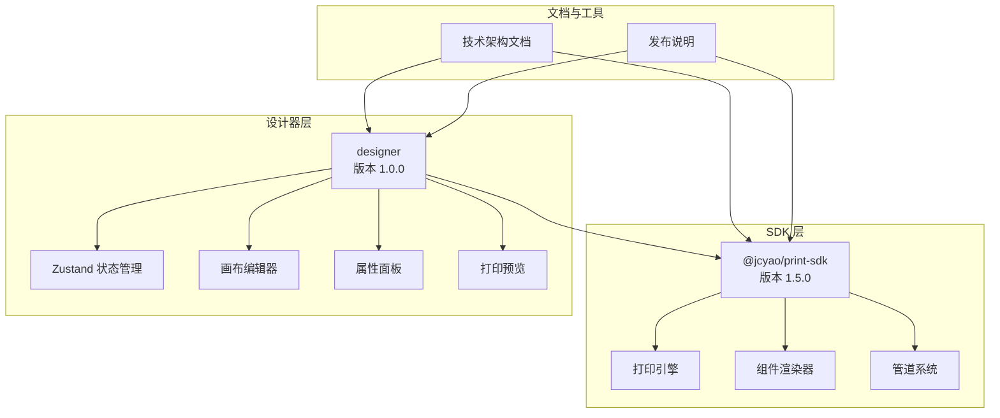
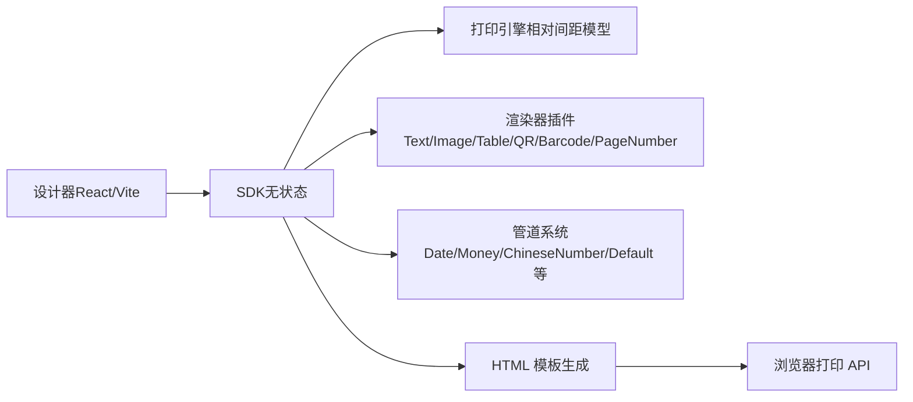
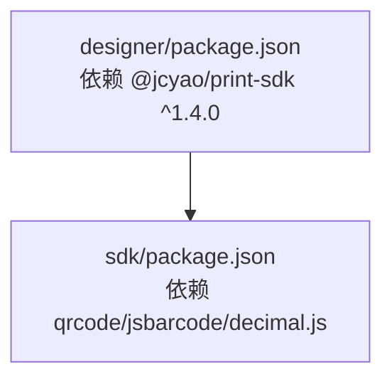

# 版本更新日志

<cite>
**本文引用的文件**
- [README.md](file://README.md)
- [sdk/README.md](file://sdk/README.md)
- [docs/技术架构文档(仅参考).md](file://docs/技术架构文档(仅参考).md)
- [designer/package.json](file://designer/package.json)
- [sdk/package.json](file://sdk/package.json)
- [designer/src/store/designer.ts](file://designer/src/store/designer.ts)
</cite>

## 目录
1. [简介](#简介)
2. [项目结构](#项目结构)
3. [核心组件](#核心组件)
4. [架构概览](#架构概览)
5. [详细版本分析](#详细版本分析)
6. [依赖关系分析](#依赖关系分析)
7. [性能考量](#性能考量)
8. [故障排查指南](#故障排查指南)
9. [结论](#结论)
10. [附录](#附录)

## 简介
本版本更新日志面向打印服务平台 v1.5.0，系统梳理各主要版本的功能演进、问题修复与兼容性变化，提供升级步骤、降级与回滚策略、最佳实践与迁移注意事项，帮助用户理解功能演进历程并选择合适版本。

## 项目结构
- SDK（独立 npm 包）：提供纯前端打印能力，支持浏览器直接打印与批量打印，无 UI 依赖。
- 设计器（可视化模板设计器）：基于 React + Vite，提供拖拽式模板设计、属性配置、打印预览与 Mock 数据管理。
- 文档与架构：包含技术架构文档与使用指南，涵盖版本历史、功能状态与未来规划。

图表来源
- [sdk/package.json:1-61](file://sdk/package.json#L1-L61)
- [designer/package.json:1-46](file://designer/package.json#L1-L46)
- [docs/技术架构文档(仅参考).md](file://docs/技术架构文档(仅参考).md#L32-L76)

章节来源
- [sdk/package.json:1-61](file://sdk/package.json#L1-L61)
- [designer/package.json:1-46](file://designer/package.json#L1-L46)
- [docs/技术架构文档(仅参考).md](file://docs/技术架构文档(仅参考).md#L32-L76)

## 核心组件
- SDK（@jcyao/print-sdk）
  - 版本：v1.5.0
  - 能力：无状态、数据驱动、批量打印、多模板打印、页头/页脚、表格高级功能、管道系统、二维码/条形码同步渲染。
- 设计器（designer）
  - 版本：v1.0.0
  - 能力：三栏布局（资产树/画布/属性）、撤销/重做、组件树、打印预览、Mock 数据管理、页头/页脚三区域画布。

章节来源
- [sdk/package.json:1-61](file://sdk/package.json#L1-L61)
- [designer/package.json:1-46](file://designer/package.json#L1-L46)

## 架构概览
- 分层架构：SDK 与 Designer 分离，SDK 无 UI 依赖，Designer 仅负责交互与调用 SDK。
- 模块化：渲染器、管道系统采用注册器模式，易于扩展。
- 相对间距模型：统一处理组件布局与分页，支持负间距、紧凑布局与表格跨页。
- 同步渲染：二维码/条形码在生成 HTML 时同步内嵌，避免异步等待。

图表来源
- [docs/技术架构文档(仅参考).md](file://docs/技术架构文档(仅参考).md#L32-L76)
- [docs/技术架构文档(仅参考).md](file://docs/技术架构文档(仅参考).md#L504-L554)

章节来源
- [docs/技术架构文档(仅参考).md](file://docs/技术架构文档(仅参考).md#L32-L76)
- [docs/技术架构文档(仅参考).md](file://docs/技术架构文档(仅参考).md#L504-L554)

## 详细版本分析

### v1.5.0（生产就绪）
- 代号：Header Master（页头大师版）
- 发布日期：2026-05-30
- 核心功能
  - 页头/页脚功能：支持独立区域、拖拽组件、跨区域拖拽、高度调整、每页重复、连续纸模式禁用、三区域独立渲染。
  - 打印引擎分页精度提升：统一使用 contentTop 坐标系，解决 marginTop 混用问题；表格分页使用 contentTop/contentBottom 边界，header/footer 高度变化后分页计算正确。
- 影响评估
  - 页头/页脚区域与现有内容区域完全解耦，不影响已有模板；但涉及坐标转换与分页计算，建议在升级后进行全面测试。
  - 分页精度提升对长文本、表格合计与跨页场景有显著改善，建议回归测试。

章节来源
- [README.md:1-547](file://README.md#L1-L547)
- [sdk/README.md:16-24](file://sdk/README.md#L16-L24)

### v1.4.0（表格增强）
- 发布日期：2026-05-19
- 核心功能
  - 表格列宽自定义：支持每列固定宽度（mm），智能列宽计算（均分/固定+均分/超出缩放/最小份额保护），最后一列吸收舍入误差。
  - 行号列宽度自定义：新增 rowNumberWidth 属性。
  - 表格边框自定义：新增 borderStyle/solid|dashed、borderColor、borderWidth。
- 影响评估
  - 列宽计算规则明确，建议在升级后验证极端场景（固定列总和超宽、百分比舍入）。
  - 行号列与边框样式为新增属性，不会破坏现有模板，但建议检查样式一致性。

章节来源
- [README.md:43-64](file://README.md#L43-L64)
- [sdk/README.md:25-31](file://sdk/README.md#L25-L31)

### v1.3.0（表格合计与稳定性）
- 发布日期：2026-05-16
- 核心功能
  - 表格合计额外行：支持在合计行下方添加自定义额外行（如金额大写、备注说明），支持绑定列合计值并通过管道格式化。
  - 表格行号列：支持显示行号列，可自定义标题。
  - 分页精度与稳定性提升：修复宽度计算公式不一致、shouldBreakPage 坐标系统一、total 模式空片段、防御检查精度混合、SSR 回退缺少额外行等问题。
- 影响评估
  - 额外行与行号列为新增功能，建议在升级后验证合计计算与跨页行为。
  - 多项分页修复显著提升稳定性，建议回归测试长表格与合计场景。

章节来源
- [README.md:65-91](file://README.md#L65-L91)
- [sdk/README.md:32-37](file://sdk/README.md#L32-L37)

### v1.2.0（管道增强）
- 发布日期：2026-05-11
- 核心功能
  - ChineseNumberPipe 增强：支持小数转换、负数、自定义连接符。
  - MoneyPipe 中文大写金额：新增 chineseUppercase 格式，遵循会计规范（元、角、分、整），支持 uppercaseMode 与自定义连接符。
  - 表格合计管道化：合计字段通过 summary.pipe 接入管道系统。
- 影响评估
  - 管道系统扩展，建议在升级后验证金额大写与中文数字转换的边界值。
  - 合计管道化为新增能力，不影响现有模板，但可提升格式化灵活性。

章节来源
- [README.md:92-108](file://README.md#L92-L108)
- [sdk/README.md:38-44](file://sdk/README.md#L38-L44)

### v1.1.3（批量打印与多模板）
- 发布日期：2026-05-07
- 核心功能
  - 多模板批量打印：SDK 新增 printMultiTemplate 方法，支持一次打印组合多个不同模板及各自对应的数据。
  - 设计器打印预览弹窗新增「多模板模式」，可自由选择模板和数据组合进行混合打印。
- 影响评估
  - 多模板打印为新增能力，建议在升级后验证混合模板的纸张尺寸一致性与打印流程。
  - 与 v1.1.0 的批量打印（同模板多数据）互补，满足「一客一模板」场景。

章节来源
- [README.md:109-134](file://README.md#L109-L134)
- [sdk/README.md:45-49](file://sdk/README.md#L45-L49)

### v1.1.2（打印内容偏移修复）
- 发布日期：2026-05-05
- 核心功能
  - 打印内容偏移修复：@media print 中 .print-page 的 margin 完全覆盖，解决打印内容偏左问题；批量打印样式增加 padding 设置，边距功能正常生效。
- 影响评估
  - 修复浏览器打印样式问题，建议在升级后验证不同浏览器的打印预览与实际输出一致性。

章节来源
- [README.md:135-144](file://README.md#L135-L144)
- [sdk/README.md:50-53](file://sdk/README.md#L50-L53)

### v1.1.1（嵌套对象与架构简化）
- 发布日期：2026-05-01
- 核心功能
  - 表格嵌套对象数据支持：表格打印支持嵌套对象格式的数据源，数据绑定时可通过路径（如 a.b）正确解析嵌套属性。
  - 服务架构简化：移除独立 server 服务，改用 Vite mock 集成，降低开发和部署复杂度。
- 影响评估
  - 嵌套对象支持提升数据绑定灵活性，建议在升级后验证复杂路径绑定的正确性。
  - 架构简化降低部署门槛，建议在升级后验证开发环境 Mock API 的可用性。

章节来源
- [README.md:145-158](file://README.md#L145-L158)
- [sdk/README.md:54-58](file://sdk/README.md#L54-L58)

### v1.1.0（分页精度革命性提升）
- 发布日期：2026-04-15
- 核心功能
  - 表格分页精度革命性提升：引入「渲染后测量」方案，将表格真实渲染到隐藏 DOM 中，测量每行实际高度，彻底解决长文本换行导致的分页截断问题。
  - 组件定位逻辑优化：支持负 gap（组件重叠），表格跨页后后续组件定位到表格实际底部。
  - 表格渲染改进：列宽均分、单元格垂直居中、使用 min-height 替代固定高度。
- 影响评估
  - 渲染后测量方案显著提升分页准确性，建议在升级后重点测试长文本与跨页场景。
  - 组件定位优化影响布局与分页，建议回归测试复杂布局与表格跨页。

章节来源
- [README.md:159-189](file://README.md#L159-L189)
- [sdk/README.md:60-66](file://sdk/README.md#L60-L66)

### v1.0.1（页码与批量预览）
- 发布日期：2026-01-22
- 核心功能
  - 分页打印页码功能：支持6种位置、3种格式、自定义样式，架构优化为页面配置模式（pageConfig.pageNumber）。
  - 批量打印预览功能：支持多份文档一次性预览和打印，自动合并 HTML 并添加分页符。
- 影响评估
  - 页码功能为页面配置，不影响组件拖拽设计，建议在升级后验证页码位置与样式。
  - 批量预览为新增能力，建议在升级后验证多文档合并与分页符显示。

章节来源
- [README.md:193-240](file://README.md#L193-L240)
- [sdk/README.md:68-73](file://sdk/README.md#L68-L73)

### v1.0.0（初始发布）
- 发布日期：2026-01-20
- 核心功能
  - 初始版本发布，包含基础模板设计器、组件库、数据绑定系统、打印引擎与 SDK。
- 影响评估
  - 作为起点版本，建议在升级到后续版本时关注功能差异与兼容性。

章节来源
- [docs/技术架构文档(仅参考).md](file://docs/技术架构文档(仅参考).md#L7-L14)

## 依赖关系分析
- 设计器依赖 SDK（@jcyao/print-sdk）版本：^1.4.0
- SDK 依赖外部库：qrcode、jsbarcode、decimal.js
- 设计器依赖：Ant Design、Monaco Editor、React、Zustand 等

图表来源
- [designer/package.json:13-30](file://designer/package.json#L13-L30)
- [sdk/package.json:49-53](file://sdk/package.json#L49-L53)

章节来源
- [designer/package.json:13-30](file://designer/package.json#L13-L30)
- [sdk/package.json:49-53](file://sdk/package.json#L49-L53)

## 性能考量
- 同步渲染：二维码/条形码在生成 HTML 时同步内嵌，避免异步等待，显著提升打印响应速度。
- 渲染后测量：表格真实渲染到隐藏 DOM 中测量行高，避免估算误差，提升分页准确性。
- 内存管理：SDK 在执行大批量预览时定期清理虚拟 DOM 节点，防止内存溢出。
- 异常隔离：数据转换错误触发回退逻辑，输出原始字段内容并标记 UI 警告。

章节来源
- [docs/技术架构文档(仅参考).md](file://docs/技术架构文档(仅参考).md#L633-L839)
- [docs/技术架构文档(仅参考).md](file://docs/技术架构文档(仅参考).md#L1303-L1309)

## 故障排查指南
- 打印内容偏移
  - 现象：打印内容偏左。
  - 处理：确认 @media print 中 .print-page 的 margin 设置是否覆盖，批量打印样式是否包含 padding。
  - 参考：v1.1.2 修复说明。
- 表格分页截断
  - 现象：长文本换行导致分页截断。
  - 处理：升级至 v1.1.0 或更高版本，启用渲染后测量方案；检查表格列宽与行高配置。
  - 参考：v1.1.0 与 v1.3.0 分页修复说明。
- 多模板打印失败
  - 现象：多模板打印报错或输出异常。
  - 处理：确保所有模板使用相同纸张尺寸；检查模板组配置与数据列表长度。
  - 参考：v1.1.3 多模板打印限制说明。
- 页头/页脚坐标异常
  - 现象：页头/页脚组件位置或分页异常。
  - 处理：确认 header/footer 高度设置与坐标转换逻辑；在连续纸模式下页头/页脚会自动禁用。
  - 参考：v1.5.0 页头/页脚功能说明。

章节来源
- [README.md:135-144](file://README.md#L135-L144)
- [README.md:159-189](file://README.md#L159-L189)
- [README.md:109-134](file://README.md#L109-L134)
- [README.md:1-547](file://README.md#L1-L547)

## 结论
- v1.5.0 引入页头/页脚与分页精度提升，是生产就绪版本，建议优先选择。
- v1.4.0 的表格列宽、行号列与边框自定义显著增强表格表现力。
- v1.3.0 的合计额外行与稳定性修复为复杂报表场景提供更强支持。
- v1.2.0 的管道增强（中文大写金额、小数/负数支持）提升金额类文档的可读性。
- v1.1.x 系列在批量打印、页码与架构简化方面持续优化，适合多场景应用。
- 建议在升级前备份模板与数据，升级后进行回归测试，重点关注分页、表格与页头/页脚功能。

## 附录

### 版本升级步骤
- 升级 SDK
  - 更新依赖：将 @jcyao/print-sdk 升级至 v1.5.0。
  - 重新安装与构建：执行安装命令并构建 SDK。
- 升级设计器
  - 更新依赖：确保依赖 @jcyao/print-sdk ^1.4.0。
  - 重启开发服务器，验证设计器与 SDK 的集成。
- 回归测试
  - 测试页头/页脚功能、表格列宽与边框、合计额外行、多模板打印、批量预览与页码。
  - 验证浏览器打印样式与跨页分页准确性。

章节来源
- [sdk/package.json:1-61](file://sdk/package.json#L1-L61)
- [designer/package.json:1-46](file://designer/package.json#L1-L46)
- [README.md:436-467](file://README.md#L436-L467)

### 兼容性说明与迁移注意事项
- 兼容性
  - v1.5.0 引入页头/页脚区域与坐标转换，建议在升级后验证现有模板的坐标与分页行为。
  - v1.4.0 的表格列宽与边框为新增属性，不会破坏现有模板，但建议检查样式一致性。
  - v1.3.0 的合计额外行与行号列为新增功能，不影响现有模板。
- 迁移注意事项
  - 从旧版本升级：参考 SDK 使用指南中的迁移示例，将模板获取与打印方式从服务端拉取改为直接传入模板数据。
  - 多模板打印：确保所有模板使用相同纸张尺寸，避免混合尺寸导致的打印异常。
  - 管道系统：升级后可利用 MoneyPipe 的 chineseUppercase 与 ChineseNumberPipe 的小数/负数支持，提升金额类文档的可读性。

章节来源
- [docs/技术架构文档(仅参考).md](file://docs/技术架构文档(仅参考).md#L1212-L1236)
- [README.md:109-134](file://README.md#L109-L134)
- [README.md:43-64](file://README.md#L43-L64)

### 降级处理方案与回滚策略
- 降级策略
  - 降级至 v1.4.0：移除页头/页脚相关配置与坐标转换逻辑；恢复表格列宽与边框的旧配置方式。
  - 降级至 v1.3.0：移除合计额外行与行号列配置；恢复旧版分页精度。
  - 降级至 v1.1.x：移除多模板打印与页码配置；恢复批量打印与页码的旧实现。
- 回滚步骤
  - 回滚 SDK：将 @jcyao/print-sdk 降级至目标版本并重新安装。
  - 回滚设计器：更新依赖并重启开发服务器。
  - 回滚测试：验证核心功能（打印、分页、表格）与浏览器兼容性。

章节来源
- [sdk/package.json:1-61](file://sdk/package.json#L1-L61)
- [designer/package.json:1-46](file://designer/package.json#L1-L46)
- [README.md:109-189](file://README.md#L109-L189)

### 新功能详细说明与最佳实践
- 页头/页脚（v1.5.0）
  - 说明：支持独立区域、拖拽组件、跨区域拖拽、高度调整、每页重复、连续纸模式禁用、三区域独立渲染。
  - 最佳实践：合理设置 header/footer 高度，避免与内容区域冲突；在连续纸模式下自动禁用以避免重复页头/页脚。
- 表格列宽自定义（v1.4.0）
  - 说明：支持每列固定宽度（mm），智能列宽计算（均分/固定+均分/超出缩放/最小份额保护），最后一列吸收舍入误差。
  - 最佳实践：优先设置关键列固定宽度，其余列均分；避免固定列总和超过表格宽度。
- 行号列宽度自定义（v1.4.0）
  - 说明：新增 rowNumberWidth 属性，支持自定义行号列宽度（mm）。
  - 最佳实践：根据数据量与列宽设置合理的行号列宽度，确保序号清晰可见。
- 表格边框自定义（v1.4.0）
  - 说明：新增 borderStyle（solid/dashed）、borderColor、borderWidth 属性。
  - 最佳实践：统一表格边框风格，避免过于复杂的边框样式影响可读性。
- 合计额外行（v1.3.0）
  - 说明：支持在合计行下方添加自定义额外行，绑定列合计值并通过管道格式化。
  - 最佳实践：使用 MoneyPipe 的 chineseUppercase 输出金额大写，结合 ChineseNumberPipe 输出数字与中文对照。
- 行号列（v1.3.0）
  - 说明：支持显示行号列，可自定义标题。
  - 最佳实践：在长表格中启用行号列，便于核对数据与跨页追踪。
- 多模板批量打印（v1.1.3）
  - 说明：支持一次打印组合多个不同模板及各自对应的数据，满足「一客一模板」场景。
  - 最佳实践：确保所有模板使用相同纸张尺寸；合理组织模板组与数据列表，监控打印进度。

章节来源
- [README.md:23-64](file://README.md#L23-L64)
- [README.md:65-134](file://README.md#L65-L134)
- [sdk/README.md:16-49](file://sdk/README.md#L16-L49)

### 版本影响评估
- v1.5.0：页头/页脚与分页精度提升显著改善复杂报表场景，建议优先升级。
- v1.4.0：表格功能增强，适合对表格表现力有较高要求的场景。
- v1.3.0：合计额外行与稳定性修复，适合财务与报表类应用。
- v1.2.0：管道系统增强，适合金额类文档与多语言场景。
- v1.1.x：批量打印、页码与架构简化，适合多文档与多模板场景。

章节来源
- [README.md:1-547](file://README.md#L1-L547)
- [sdk/README.md:1-651](file://sdk/README.md#L1-L651)