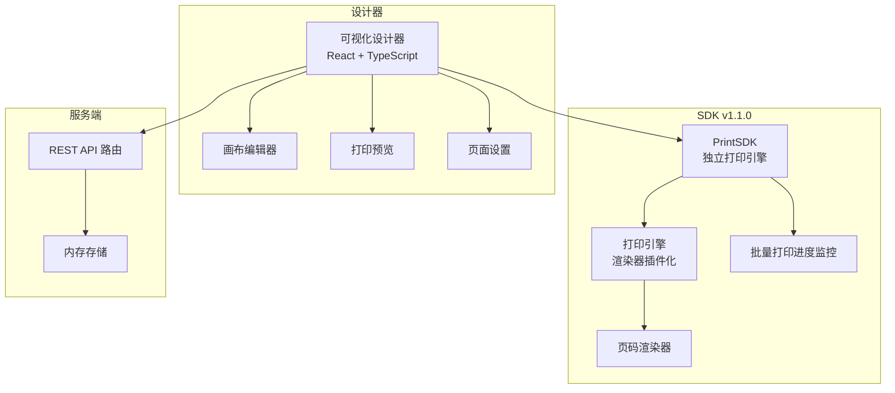
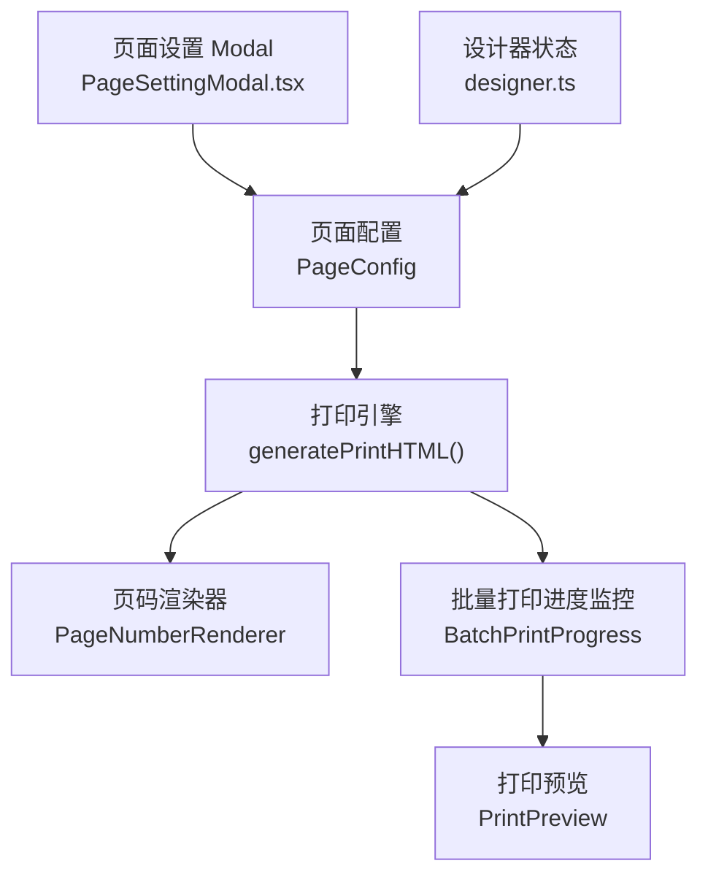
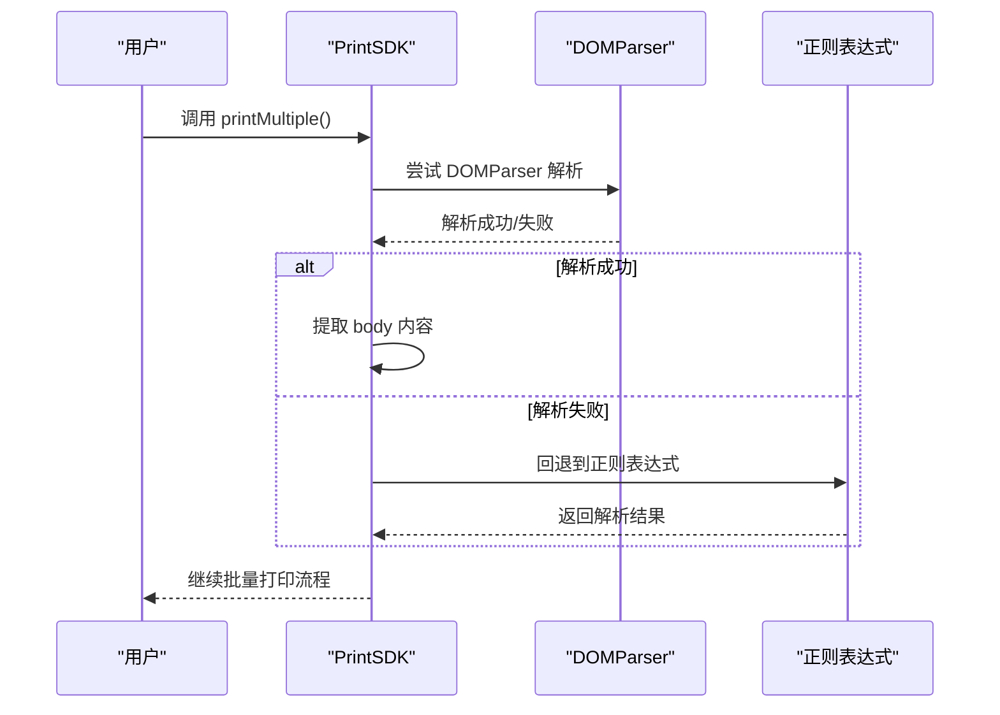
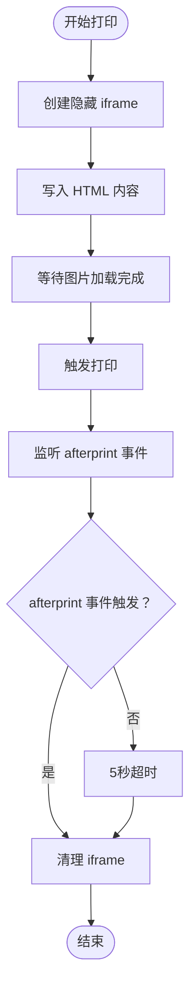
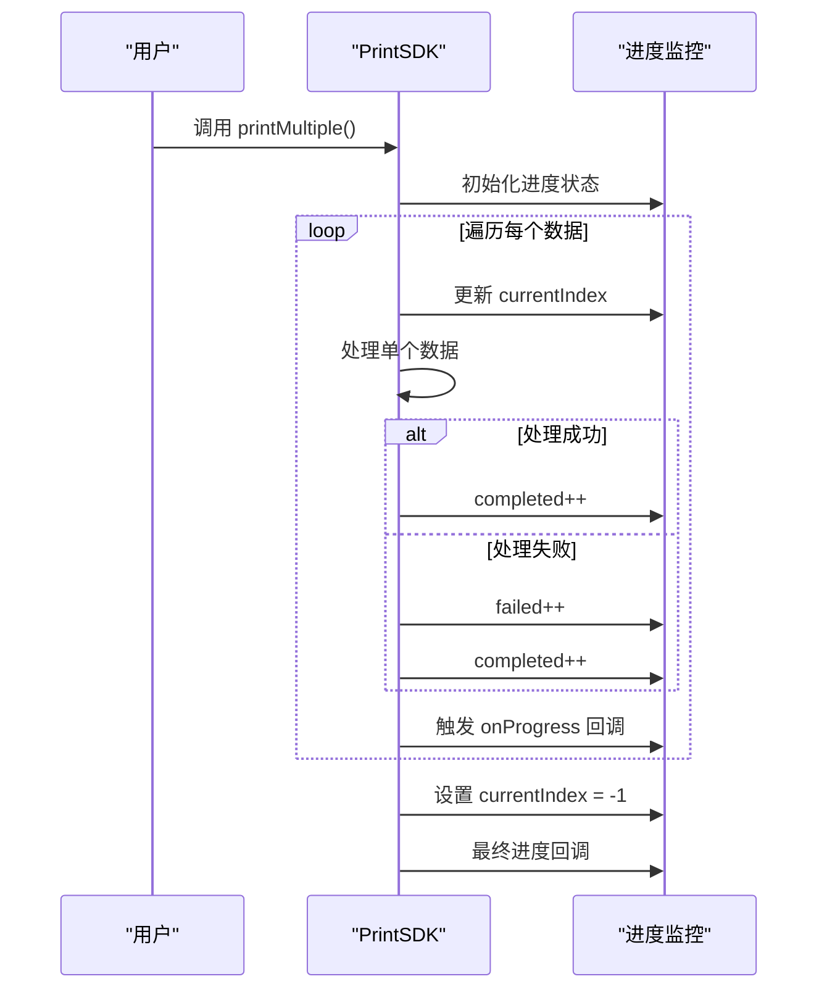
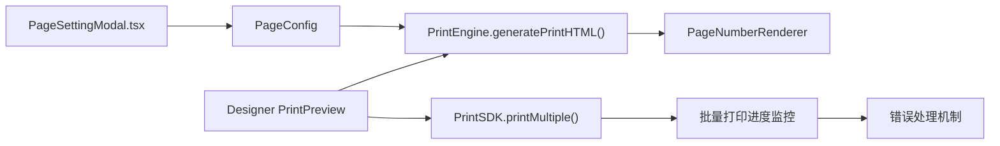

# 版本更新日志

<cite>
**本文引用的文件**
- [README.md](file://README.md)
- [SDK代码问题分析报告.md](file://SDK代码问题分析报告.md)
- [docs/TODO.md](file://docs/TODO.md)
- [test-page-number.html](file://test-page-number.html)
- [sdk/src/printEngine/renderers/PageNumberRenderer.ts](file://sdk/src/printEngine/renderers/PageNumberRenderer.ts)
- [sdk/src/printEngine/types.ts](file://sdk/src/printEngine/types.ts)
- [sdk/src/printEngine/constants.ts](file://sdk/src/printEngine/constants.ts)
- [sdk/src/types.ts](file://sdk/src/types.ts)
- [sdk/src/PrintSDK.ts](file://sdk/src/PrintSDK.ts)
- [sdk/src/printEngine/htmlTemplate.ts](file://sdk/src/printEngine/htmlTemplate.ts)
- [sdk/src/printEngine/utils/styleBuilder.ts](file://sdk/src/printEngine/utils/styleBuilder.ts)
- [designer/src/pages/Designer/components/Canvas/PageSettingModal.tsx](file://designer/src/pages/Designer/components/Canvas/PageSettingModal.tsx)
- [designer/src/pages/Designer/components/Canvas/index.tsx](file://designer/src/pages/Designer/components/Canvas/index.tsx)
- [designer/src/pages/Designer/components/Canvas/alignmentDetector.ts](file://designer/src/pages/Designer/components/Canvas/alignmentDetector.ts)
- [designer/src/pages/Designer/components/Canvas/ShortcutHint.tsx](file://designer/src/pages/Designer/components/Canvas/ShortcutHint.tsx)
- [designer/src/store/designer.ts](file://designer/src/store/designer.ts)
- [designer/src/types/index.ts](file://designer/src/types/index.ts)
- [package.json](file://sdk/package.json)
- [designer/package.json](file://designer/package.json)
- [server/package.json](file://server/package.json)
</cite>

## 更新摘要
**所做更改**
- 更新版本信息从 v1.0.1 到 v1.1.0
- 新增打印质量和可靠性提升说明
- 更新 SDK 版本号和依赖关系
- 增强打印引擎的健壮性和稳定性
- 改进批量打印的错误处理机制

## 目录
1. [简介](#简介)
2. [项目结构](#项目结构)
3. [核心组件](#核心组件)
4. [架构概览](#架构概览)
5. [详细组件分析](#详细组件分析)
6. [依赖关系分析](#依赖关系分析)
7. [性能考量](#性能考量)
8. [故障排查指南](#故障排查指南)
9. [结论](#结论)
10. [附录](#附录)

## 简介
v1.1.0 版本（代号：Print Quality Pro，打印质量专业版）在 v1.0.1 的基础上，全面提升了打印质量和系统可靠性，包含以下重要改进：

**打印质量提升**：
- HTML 解析健壮性增强：使用 DOMParser 替代正则表达式提取 body 内容，提高解析准确性
- 图片加载优化：改进 waitForImagesLoaded 函数，确保所有图片资源加载完成后再触发打印
- 打印事件监听：使用 afterprint 事件替代固定延迟，避免 iframe 提前移除问题

**系统可靠性增强**：
- 批量打印进度监控：新增 BatchPrintProgress 接口，提供详细的处理进度反馈
- 错误处理机制：改进异常捕获和错误恢复，确保批量打印过程的稳定性
- 资源清理优化：增强 iframe 生命周期管理，防止内存泄漏

**用户体验优化**：
- 打印预览增强：预览模式下更好的图片加载体验
- 批量操作改进：批量打印时的进度指示和错误提示更加友好

**章节来源**
- [README.md:1-12](file://README.md#L1-L12)
- [sdk/package.json:1-61](file://sdk/package.json#L1-L61)

## 项目结构
项目采用分层架构，包含 SDK、设计器与服务端三层：
- SDK 层：纯 TypeScript 实现，无 UI 依赖，支持浏览器打印与批量打印预览
- 设计器层：React + TypeScript，提供可视化模板设计器与打印预览
- 服务层：Node.js + Express，提供 REST API 与内存存储

**图表来源**
- [README.md:191-234](file://README.md#L191-L234)

**章节来源**
- [README.md:191-234](file://README.md#L191-L234)

## 核心组件
- 页码渲染器（PageNumberRenderer）：支持 simple/text/slash 三种格式，动态计算页码文本并应用样式
- 页面配置（PageConfig）：包含纸张尺寸、方向、页边距与页码配置（pageNumber）
- 打印引擎（PrintEngine）：负责模板到 HTML 的渲染、分页计算与页码注入
- 批量打印（PrintSDK.printMultiple）：生成包含所有数据的完整打印文档，仅需用户确认一次打印
- 批量打印进度监控：提供详细的处理进度反馈和错误统计

**章节来源**
- [sdk/src/printEngine/renderers/PageNumberRenderer.ts:1-105](file://sdk/src/printEngine/renderers/PageNumberRenderer.ts#L1-L105)
- [sdk/src/types.ts:30-62](file://sdk/src/types.ts#L30-L62)
- [sdk/src/printEngine/types.ts:11-55](file://sdk/src/printEngine/types.ts#L11-L55)
- [sdk/src/PrintSDK.ts:128-214](file://sdk/src/PrintSDK.ts#L128-L214)

## 架构概览
v1.1.0 的架构围绕"高质量打印"展开，重点增强了 HTML 解析的健壮性和打印流程的可靠性。批量打印功能得到全面改进，提供更好的用户体验和错误处理机制。

**图表来源**
- [designer/src/pages/Designer/components/Canvas/PageSettingModal.tsx:49-68](file://designer/src/pages/Designer/components/Canvas/PageSettingModal.tsx#L49-L68)
- [sdk/src/printEngine/renderers/PageNumberRenderer.ts:17-57](file://sdk/src/printEngine/renderers/PageNumberRenderer.ts#L17-L57)
- [sdk/src/printEngine/types.ts:11-55](file://sdk/src/printEngine/types.ts#L11-L55)

**章节来源**
- [designer/src/pages/Designer/components/Canvas/PageSettingModal.tsx:49-68](file://designer/src/pages/Designer/components/Canvas/PageSettingModal.tsx#L49-L68)
- [sdk/src/printEngine/renderers/PageNumberRenderer.ts:17-57](file://sdk/src/printEngine/renderers/PageNumberRenderer.ts#L17-L57)

## 详细组件分析

### HTML 解析健壮性增强
**更新** v1.1.0 版本引入了更可靠的 HTML 解析机制

- DOMParser 替代正则表达式：extractBodyContent 函数使用 DOMParser 解析 HTML，比正则表达式更健壮
- 兜底机制：如果 DOMParser 解析失败，自动回退到正则表达式提取
- 错误处理：增加 try-catch 包装，确保解析失败时不会影响整体流程

**图表来源**
- [sdk/src/PrintSDK.ts:21-42](file://sdk/src/PrintSDK.ts#L21-L42)

**章节来源**
- [sdk/src/PrintSDK.ts:21-42](file://sdk/src/PrintSDK.ts#L21-L42)

### 图片加载优化
**更新** v1.1.0 版本改进了图片加载机制

- 统一加载策略：waitForImagesLoaded 函数确保所有图片资源加载完成后再触发打印
- 外部资源处理：二维码和条形码已同步生成为 base64，主要等待外部图片资源
- 加载状态监控：提供更好的加载进度反馈

**章节来源**
- [sdk/src/PrintSDK.ts:96-118](file://sdk/src/PrintSDK.ts#L96-L118)
- [sdk/src/PrintSDK.ts:262-282](file://sdk/src/PrintSDK.ts#L262-L282)

### 打印事件监听改进
**更新** v1.1.0 版本增强了打印事件处理

- afterprint 事件优先：优先使用 afterprint 事件（现代浏览器支持）
- 兜底清理机制：如果 afterprint 事件未触发（如用户取消打印），5秒后执行清理
- iframe 生命周期管理：更好的 iframe 创建和销毁时机控制

**图表来源**
- [sdk/src/PrintSDK.ts:120-142](file://sdk/src/PrintSDK.ts#L120-L142)

**章节来源**
- [sdk/src/PrintSDK.ts:120-142](file://sdk/src/PrintSDK.ts#L120-L142)

### 批量打印进度监控
**新增** v1.1.0 版本引入了完整的进度监控机制

- BatchPrintProgress 接口：提供详细的处理进度反馈
- 实时状态更新：包括总任务数、已完成数、失败数和当前索引
- 进度回调：支持 onProgress 回调函数，提供实时进度更新
- 错误统计：自动统计处理失败的任务数量

**图表来源**
- [sdk/src/PrintSDK.ts:63-69](file://sdk/src/PrintSDK.ts#L63-L69)
- [sdk/src/PrintSDK.ts:193-232](file://sdk/src/PrintSDK.ts#L193-L232)

**章节来源**
- [sdk/src/PrintSDK.ts:63-69](file://sdk/src/PrintSDK.ts#L63-L69)
- [sdk/src/PrintSDK.ts:193-232](file://sdk/src/PrintSDK.ts#L193-L232)

### 样式构建工具增强
**更新** v1.1.0 版本优化了样式构建机制

- 驼峰命名转换：buildStyleString 函数自动将驼峰命名转换为 CSS 短横线命名
- 统一样式格式：确保生成的 CSS 样式字符串格式一致
- 性能优化：减少样式处理的计算开销

**章节来源**
- [sdk/src/printEngine/utils/styleBuilder.ts:13-21](file://sdk/src/printEngine/utils/styleBuilder.ts#L13-L21)

## 依赖关系分析
- 设计器依赖页面设置 Modal 生成 pageConfig.pageNumber
- 打印引擎依赖渲染器插件（含 PageNumberRenderer）进行渲染
- 批量打印依赖 SDK 的 printMultiple 方法与设计器的预览逻辑
- v1.1.0 版本增强了错误处理和进度监控机制

**图表来源**
- [designer/src/pages/Designer/components/Canvas/PageSettingModal.tsx:49-68](file://designer/src/pages/Designer/components/Canvas/PageSettingModal.tsx#L49-L68)
- [sdk/src/printEngine/renderers/PageNumberRenderer.ts:17-57](file://sdk/src/printEngine/renderers/PageNumberRenderer.ts#L17-L57)
- [sdk/src/PrintSDK.ts:135-214](file://sdk/src/PrintSDK.ts#L135-L214)

**章节来源**
- [designer/src/pages/Designer/components/Canvas/PageSettingModal.tsx:49-68](file://designer/src/pages/Designer/components/Canvas/PageSettingModal.tsx#L49-L68)
- [sdk/src/printEngine/renderers/PageNumberRenderer.ts:17-57](file://sdk/src/printEngine/renderers/PageNumberRenderer.ts#L17-L57)
- [sdk/src/PrintSDK.ts:135-214](file://sdk/src/PrintSDK.ts#L135-L214)

## 性能考量
**更新** v1.1.0 版本在性能方面进行了多项优化：

- HTML 解析性能：DOMParser 比正则表达式更高效，特别是在处理复杂 HTML 结构时
- 图片加载优化：改进的 waitForImagesLoaded 函数减少了不必要的重绘和回流
- 内存管理：更好的 iframe 生命周期管理，防止内存泄漏
- 错误处理：增强的错误处理机制减少了异常情况下的性能损失

**章节来源**
- [SDK代码问题分析报告.md:21-103](file://SDK代码问题分析报告.md#L21-L103)
- [SDK代码问题分析报告.md:108-152](file://SDK代码问题分析报告.md#L108-L152)
- [SDK代码问题分析报告.md:182-200](file://SDK代码问题分析报告.md#L182-L200)
- [SDK代码问题分析报告.md:131-152](file://SDK代码问题分析报告.md#L131-L152)

## 故障排查指南
**更新** v1.1.0 版本的故障排查指南：

- HTML 解析失败
  - 检查 DOMParser 是否正常工作
  - 确认正则表达式回退机制是否生效
  - 查看控制台错误日志

- 图片加载超时
  - 确认网络连接正常
  - 检查图片资源的可访问性
  - 验证 waitForImagesLoaded 函数的执行

- 打印事件未触发
  - 检查 afterprint 事件监听器
  - 确认 5秒超时清理机制
  - 验证 iframe 的生命周期管理

- 批量打印进度异常
  - 检查 BatchPrintProgress 接口的实现
  - 确认进度回调函数的调用
  - 验证错误统计的准确性

**章节来源**
- [test-page-number.html:1-117](file://test-page-number.html#L1-L117)
- [designer/src/pages/Designer/components/Canvas/index.tsx:127-201](file://designer/src/pages/Designer/components/Canvas/index.tsx#L127-L201)
- [sdk/src/PrintSDK.ts:128-214](file://sdk/src/PrintSDK.ts#L128-L214)

## 结论
v1.1.0 版本在 v1.0.1 的基础上，显著提升了打印质量和系统可靠性。通过引入更健壮的 HTML 解析机制、优化图片加载流程、增强打印事件监听和改进批量打印进度监控，为用户提供了更加稳定和高效的打印体验。建议用户在升级时关注这些改进，并结合故障排查指南进行验证。

## 附录

### 兼容性说明与迁移指南
**更新** v1.1.0 版本的兼容性说明：

- SDK 版本升级：从 v1.0.1 升级到 v1.1.0，需要更新依赖
- 批量打印 API：printMultiple 方法现在支持进度回调
- 错误处理：改进的错误处理机制可能影响现有错误处理逻辑
- 性能优化：新的 HTML 解析和图片加载机制可能影响现有性能表现

**章节来源**
- [README.md:18-63](file://README.md#L18-L63)
- [docs/TODO.md:7-18](file://docs/TODO.md#L7-L18)
- [sdk/package.json:1-61](file://sdk/package.json#L1-L61)

### 未来版本规划与路线图
**更新** v1.1+ 版本规划：

- v1.2 待实现功能：模板版本管理、批量打印优化、用户手册完善
- 功能增强：更多管道类型、更多组件类型、模板分享功能
- 性能优化：大数据表格虚拟滚动、图片懒加载与预加载、打印队列管理
- 质量保证：单元测试覆盖率提升、代码质量检查工具集成

**章节来源**
- [README.md:330-354](file://README.md#L330-L354)
- [docs/TODO.md:330-382](file://docs/TODO.md#L330-L382)