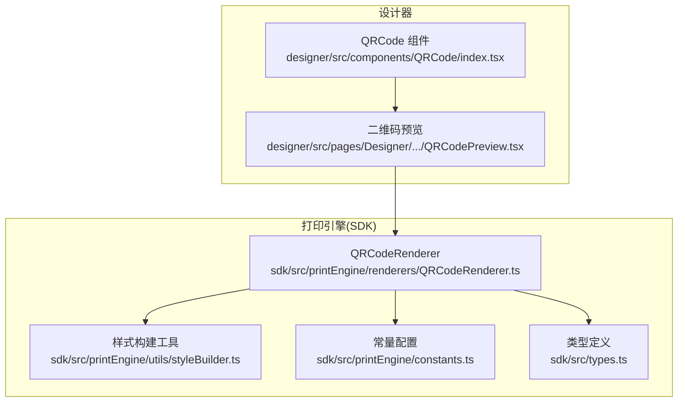
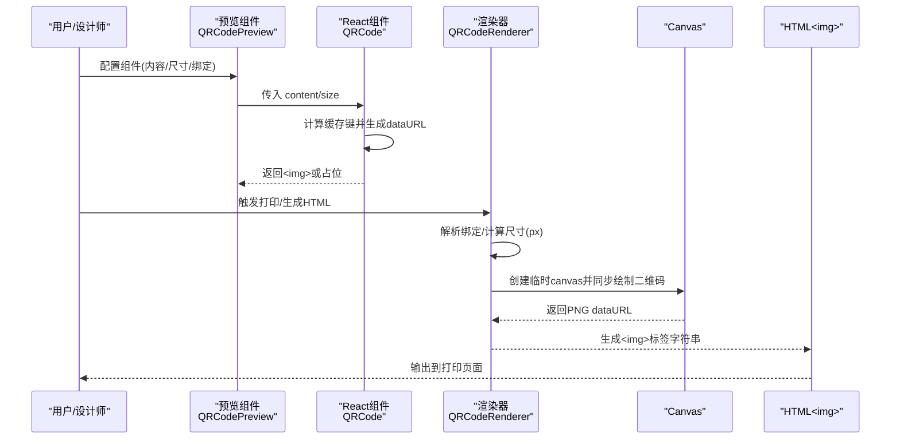
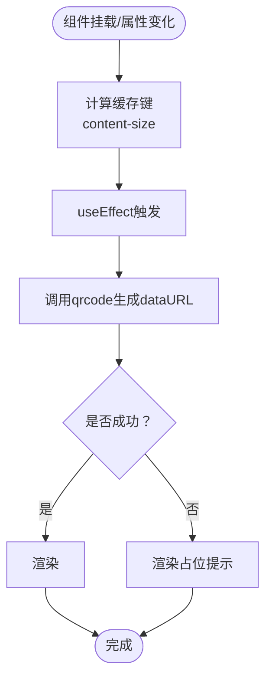
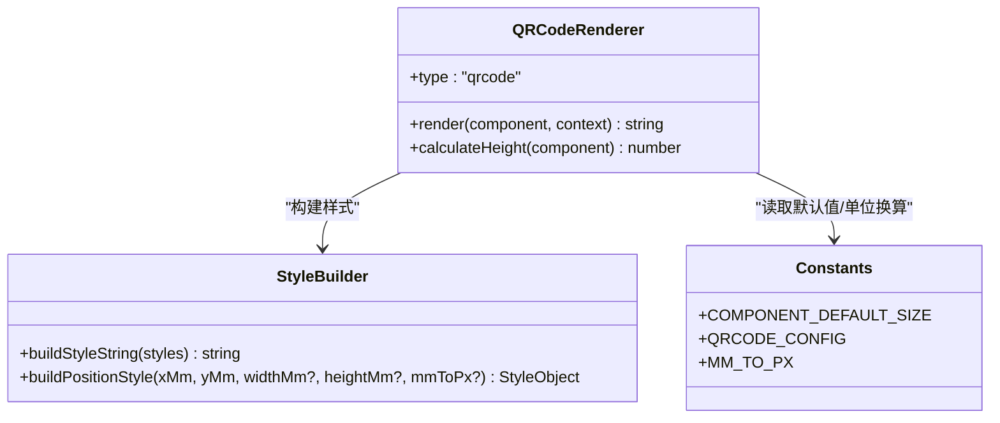
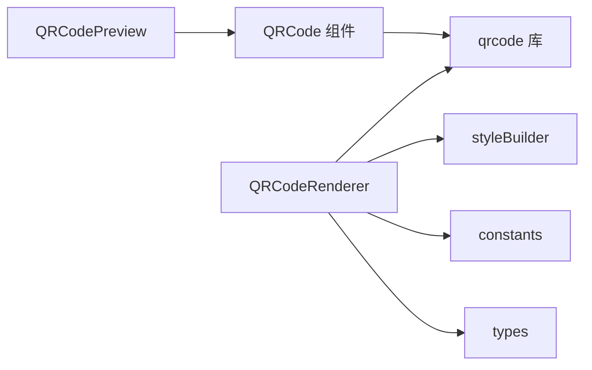

# 二维码组件

<cite>
**本文引用的文件**
- [designer/src/components/QRCode/index.tsx](file://designer/src/components/QRCode/index.tsx)
- [sdk/src/printEngine/renderers/QRCodeRenderer.ts](file://sdk/src/printEngine/renderers/QRCodeRenderer.ts)
- [designer/src/pages/Designer/components/Canvas/componentRenderers/QRCodePreview.tsx](file://designer/src/pages/Designer/components/Canvas/componentRenderers/QRCodePreview.tsx)
- [sdk/src/printEngine/constants.ts](file://sdk/src/printEngine/constants.ts)
- [sdk/src/printEngine/utils/styleBuilder.ts](file://sdk/src/printEngine/utils/styleBuilder.ts)
- [sdk/src/types.ts](file://sdk/src/types.ts)
- [designer/src/types/index.ts](file://designer/src/types/index.ts)
- [docs/技术架构文档(仅参考).md](file://docs/技术架构文档(仅参考).md)
</cite>

## 目录
1. [简介](#简介)
2. [项目结构](#项目结构)
3. [核心组件](#核心组件)
4. [架构概览](#架构概览)
5. [详细组件分析](#详细组件分析)
6. [依赖分析](#依赖分析)
7. [性能考量](#性能考量)
8. [故障排查指南](#故障排查指南)
9. [结论](#结论)
10. [附录](#附录)

## 简介
本文件为二维码组件的全面技术文档，覆盖属性配置、数据绑定与动态内容生成、编码算法与格式标准、应用场景示例、质量检测与扫描兼容性、尺寸优化与打印质量保障等方面。读者可据此快速理解并正确使用二维码组件，确保在设计与打印场景中获得稳定、高质量的二维码输出。

## 项目结构
二维码组件在设计器与打印 SDK 中分别提供“预览组件”和“渲染器”，二者协同工作：
- 设计器侧提供 React 组件用于可视化预览；
- SDK 侧提供 QRCodeRenderer，在浏览器环境中同步生成二维码并内嵌为 img 标签，直接参与打印 HTML 的生成。

图表来源
- [designer/src/components/QRCode/index.tsx:1-52](file://designer/src/components/QRCode/index.tsx#L1-L52)
- [designer/src/pages/Designer/components/Canvas/componentRenderers/QRCodePreview.tsx:1-17](file://designer/src/pages/Designer/components/Canvas/componentRenderers/QRCodePreview.tsx#L1-L17)
- [sdk/src/printEngine/renderers/QRCodeRenderer.ts:1-63](file://sdk/src/printEngine/renderers/QRCodeRenderer.ts#L1-L63)
- [sdk/src/printEngine/utils/styleBuilder.ts:1-54](file://sdk/src/printEngine/utils/styleBuilder.ts#L1-L54)
- [sdk/src/printEngine/constants.ts:1-113](file://sdk/src/printEngine/constants.ts#L1-L113)
- [sdk/src/types.ts:185-202](file://sdk/src/types.ts#L185-L202)

章节来源
- [designer/src/components/QRCode/index.tsx:1-52](file://designer/src/components/QRCode/index.tsx#L1-L52)
- [sdk/src/printEngine/renderers/QRCodeRenderer.ts:1-63](file://sdk/src/printEngine/renderers/QRCodeRenderer.ts#L1-L63)

## 核心组件
- 设计器侧 QRCode 组件：接收 content 与 size 两个属性，内部使用 qrcode 库生成 dataURL，并以  或占位提示的方式渲染。
- SDK 侧 QRCodeRenderer：在渲染上下文中解析绑定值，按布局尺寸转换像素，使用 qrcode 库同步绘制到 canvas 并导出为 PNG dataURL，最终输出为  标签字符串，参与打印 HTML 的生成。

章节来源
- [designer/src/components/QRCode/index.tsx:5-52](file://designer/src/components/QRCode/index.tsx#L5-L52)
- [sdk/src/printEngine/renderers/QRCodeRenderer.ts:12-62](file://sdk/src/printEngine/renderers/QRCodeRenderer.ts#L12-L62)

## 架构概览
二维码组件在“设计期”与“打印期”的关键交互如下：

图表来源
- [designer/src/pages/Designer/components/Canvas/componentRenderers/QRCodePreview.tsx:11-16](file://designer/src/pages/Designer/components/Canvas/componentRenderers/QRCodePreview.tsx#L11-L16)
- [designer/src/components/QRCode/index.tsx:10-49](file://designer/src/components/QRCode/index.tsx#L10-L49)
- [sdk/src/printEngine/renderers/QRCodeRenderer.ts:15-57](file://sdk/src/printEngine/renderers/QRCodeRenderer.ts#L15-L57)

## 详细组件分析

### 设计器侧 QRCode 组件
- 属性
  - content: 二维码内容字符串
  - size: 像素尺寸
- 行为
  - 使用 useMemo 缓存 content-size 组合作为依赖，避免重复生成
  - 使用 useEffect 在依赖变化时调用 qrcode.toDataURL 生成 dataURL
  - 渲染阶段根据是否存在 dataURL 决定显示二维码图片或占位提示

图表来源
- [designer/src/components/QRCode/index.tsx:10-49](file://designer/src/components/QRCode/index.tsx#L10-L49)

章节来源
- [designer/src/components/QRCode/index.tsx:5-52](file://designer/src/components/QRCode/index.tsx#L5-L52)

### 预览组件 QRCodePreview
- 作用：在设计器画布中预览二维码效果
- 关键点
  - 将组件布局宽度(mm)按 3.78 转换为像素(sizePx)
  - 优先使用绑定回退值或组件 props.content 作为内容
  - 将 content 与 size 传递给 QRCode 组件

章节来源
- [designer/src/pages/Designer/components/Canvas/componentRenderers/QRCodePreview.tsx:11-16](file://designer/src/pages/Designer/components/Canvas/componentRenderers/QRCodePreview.tsx#L11-L16)

### SDK 侧 QRCodeRenderer
- 作用：在打印 HTML 生成阶段同步渲染二维码
- 关键流程
  - 解析绑定值，若为空则回退到 props.content 或默认内容
  - 从布局宽度(mm)换算像素(px)，构建绝对定位样式
  - 使用 qrcode.toCanvas 同步绘制到临时 canvas，再导出 PNG dataURL
  - 包装为  标签字符串返回，供 HTML 模板使用
  - 发生异常时返回带错误提示的占位元素

图表来源
- [sdk/src/printEngine/renderers/QRCodeRenderer.ts:12-62](file://sdk/src/printEngine/renderers/QRCodeRenderer.ts#L12-L62)
- [sdk/src/printEngine/utils/styleBuilder.ts:13-53](file://sdk/src/printEngine/utils/styleBuilder.ts#L13-L53)
- [sdk/src/printEngine/constants.ts:8-46](file://sdk/src/printEngine/constants.ts#L8-L46)

章节来源
- [sdk/src/printEngine/renderers/QRCodeRenderer.ts:12-62](file://sdk/src/printEngine/renderers/QRCodeRenderer.ts#L12-L62)
- [sdk/src/printEngine/utils/styleBuilder.ts:13-53](file://sdk/src/printEngine/utils/styleBuilder.ts#L13-L53)
- [sdk/src/printEngine/constants.ts:8-46](file://sdk/src/printEngine/constants.ts#L8-L46)

### 数据绑定与动态内容
- 绑定解析
  - 渲染器通过 context.resolveBinding 获取绑定值
  - 若绑定值为空，则回退到 props.content
  - 最终回退到 QRCODE_CONFIG.DEFAULT_CONTENT
- 设计器预览
  - 预览组件同样支持绑定回退值 fallback，以及 props.content
- 类型支撑
  - DataBinding 接口定义了 path、pipes、fallback 等字段
  - ComponentNode 的 binding 字段用于承载绑定配置

章节来源
- [sdk/src/printEngine/renderers/QRCodeRenderer.ts:17-18](file://sdk/src/printEngine/renderers/QRCodeRenderer.ts#L17-L18)
- [designer/src/pages/Designer/components/Canvas/componentRenderers/QRCodePreview.tsx:13](file://designer/src/pages/Designer/components/Canvas/componentRenderers/QRCodePreview.tsx#L13)
- [sdk/src/types.ts:82-86](file://sdk/src/types.ts#L82-L86)
- [sdk/src/types.ts:185-202](file://sdk/src/types.ts#L185-L202)

### 属性配置与尺寸规格
- 设计器侧
  - content: 二维码内容
  - size: 像素尺寸
- SDK 侧
  - 布局尺寸以 mm 为单位，内部换算为 px
  - 默认尺寸：QRCODE_SIZE = 30mm
  - 单位换算：MM_TO_PX = 3.78（96 DPI）
- 预览侧
  - 将组件 widthMm × 3.78 转换为像素传给组件

章节来源
- [sdk/src/printEngine/constants.ts:34-35](file://sdk/src/printEngine/constants.ts#L34-L35)
- [sdk/src/printEngine/constants.ts:8](file://sdk/src/printEngine/constants.ts#L8)
- [designer/src/pages/Designer/components/Canvas/componentRenderers/QRCodePreview.tsx:12](file://designer/src/pages/Designer/components/Canvas/componentRenderers/QRCodePreview.tsx#L12)

### 编码算法与格式标准
- 算法来源
  - 使用 qrcode 库进行二维码生成
- 错误纠正等级
  - 渲染器中固定为 M 级
- 输出格式
  - 同步绘制到 canvas，导出 PNG dataURL，内嵌于  标签

章节来源
- [sdk/src/printEngine/renderers/QRCodeRenderer.ts:39-45](file://sdk/src/printEngine/renderers/QRCodeRenderer.ts#L39-L45)
- [docs/技术架构文档(仅参考).md:648-686](file://docs/技术架构文档(仅参考).md#L648-L686)

### 应用场景示例
- 产品标签：绑定商品编号或 SKU，动态生成对应二维码
- 访问链接：绑定 URL 或短链地址，便于移动端扫码跳转
- 支付码：绑定订单号或支付参数，结合业务流水号生成唯一二维码
- 调试与演示：预览组件支持默认内容，便于快速验证布局与尺寸

章节来源
- [sdk/src/printEngine/constants.ts:111](file://sdk/src/printEngine/constants.ts#L111)
- [designer/src/pages/Designer/components/Canvas/componentRenderers/QRCodePreview.tsx:13](file://designer/src/pages/Designer/components/Canvas/componentRenderers/QRCodePreview.tsx#L13)

### 质量检测与扫描兼容性
- 同步生成与内嵌
  - 二维码在渲染阶段即生成并内嵌为 dataURL，避免异步等待与 CDN 依赖
  - 降低因网络波动导致的渲染失败风险
- 错误处理
  - 渲染器捕获生成异常并返回占位提示，便于定位问题
- 扫描稳定性建议
  - 保持足够像素尺寸，避免过小导致扫描困难
  - 保证背景对比度清晰，避免与浅色背景叠加影响识别

章节来源
- [docs/技术架构文档(仅参考).md:748-768](file://docs/技术架构文档(仅参考).md#L748-L768)
- [sdk/src/printEngine/renderers/QRCodeRenderer.ts:52-56](file://sdk/src/printEngine/renderers/QRCodeRenderer.ts#L52-L56)

### 尺寸优化与打印质量保证
- 尺寸优化
  - 使用布局 mm 单位统一管理，内部按 3.78 换算为 px
  - 预览与渲染采用一致的尺寸换算逻辑，避免偏差
- 打印质量
  - 二维码为位图图像，建议在 96 DPI 下保持合理像素密度
  - 大量二维码时注意 HTML 体积增长（dataURL 增大约 33%）

章节来源
- [sdk/src/printEngine/constants.ts:8](file://sdk/src/printEngine/constants.ts#L8)
- [docs/技术架构文档(仅参考).md:830-833](file://docs/技术架构文档(仅参考).md#L830-L833)

## 依赖分析
- 组件耦合
  - QRCodeRenderer 依赖 qrcode、styleBuilder、constants、types
  - 预览组件依赖 QRCode 组件与类型定义
- 外部依赖
  - qrcode：二维码生成
  - 浏览器环境：依赖 DOM 与 Canvas API

图表来源
- [sdk/src/printEngine/renderers/QRCodeRenderer.ts:6-10](file://sdk/src/printEngine/renderers/QRCodeRenderer.ts#L6-L10)
- [sdk/src/printEngine/utils/styleBuilder.ts:5](file://sdk/src/printEngine/utils/styleBuilder.ts#L5)
- [sdk/src/printEngine/constants.ts:10](file://sdk/src/printEngine/constants.ts#L10)
- [sdk/src/types.ts:185-202](file://sdk/src/types.ts#L185-L202)

章节来源
- [sdk/src/printEngine/renderers/QRCodeRenderer.ts:6-10](file://sdk/src/printEngine/renderers/QRCodeRenderer.ts#L6-L10)
- [sdk/src/printEngine/utils/styleBuilder.ts:5](file://sdk/src/printEngine/utils/styleBuilder.ts#L5)
- [sdk/src/printEngine/constants.ts:10](file://sdk/src/printEngine/constants.ts#L10)
- [sdk/src/types.ts:185-202](file://sdk/src/types.ts#L185-L202)

## 性能考量
- 同步渲染
  - 二维码在生成 HTML 阶段同步完成，避免 CDN 加载与异步等待
- 体积与速度
  - dataURL 体积增大约 33%，大量二维码时需权衡 HTML 大小
- 代码简化
  - 移除了 CDN 引入、轮询检测与 ready 标记，显著降低复杂度

章节来源
- [docs/技术架构文档(仅参考).md:770-780](file://docs/技术架构文档(仅参考).md#L770-L780)
- [docs/技术架构文档(仅参考).md:781-800](file://docs/技术架构文档(仅参考).md#L781-L800)

## 故障排查指南
- 二维码未显示
  - 检查 content 是否为空，确认绑定值、props.content 与默认内容的优先级
  - 确认 size 是否合理（过小可能导致扫描困难）
- 打印页面出现占位提示
  - 查看控制台是否有 QRCode generation error 日志
  - 检查浏览器环境是否具备 Canvas API
- 扫码失败
  - 提高二维码像素尺寸
  - 确保背景对比度充足，避免模糊或过度压缩

章节来源
- [sdk/src/printEngine/renderers/QRCodeRenderer.ts:52-56](file://sdk/src/printEngine/renderers/QRCodeRenderer.ts#L52-L56)
- [docs/技术架构文档(仅参考).md:824-829](file://docs/技术架构文档(仅参考).md#L824-L829)

## 结论
二维码组件在设计器与 SDK 中实现了从“所见即所得”到“所见即打”的闭环：设计期通过预览组件直观呈现，打印期通过 QRCodeRenderer 同步生成并内嵌至 HTML，确保打印即时、稳定且可离线。配合合理的尺寸规划与质量把控，可在多种场景（产品标签、访问链接、支付码等）中获得可靠的二维码输出。

## 附录
- 关键配置与默认值
  - 默认二维码内容：QRCODE_CONFIG.DEFAULT_CONTENT
  - 二维码默认尺寸：COMPONENT_DEFAULT_SIZE.QRCODE_SIZE = 30mm
  - 单位换算：MM_TO_PX = 3.78
- 相关类型
  - ComponentNode、DataBinding、ComponentType 等

章节来源
- [sdk/src/printEngine/constants.ts:109-112](file://sdk/src/printEngine/constants.ts#L109-L112)
- [sdk/src/printEngine/constants.ts:34-35](file://sdk/src/printEngine/constants.ts#L34-L35)
- [sdk/src/printEngine/constants.ts:8](file://sdk/src/printEngine/constants.ts#L8)
- [sdk/src/types.ts:72](file://sdk/src/types.ts#L72)
- [sdk/src/types.ts:185-202](file://sdk/src/types.ts#L185-L202)