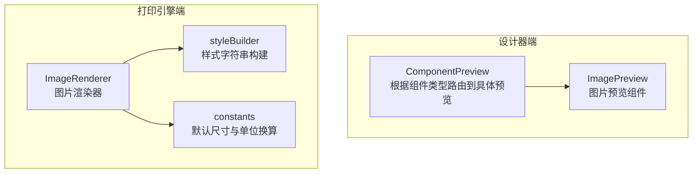
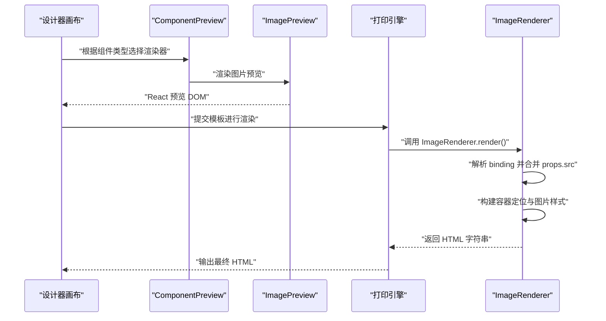
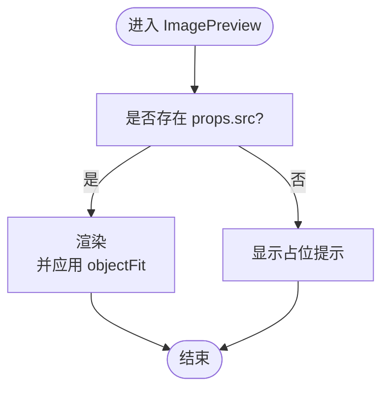
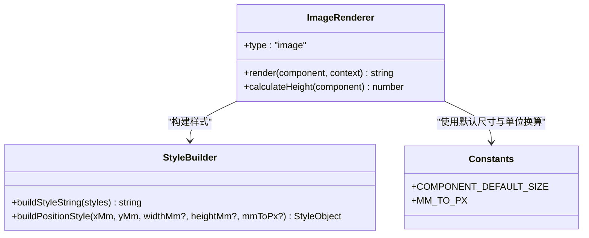
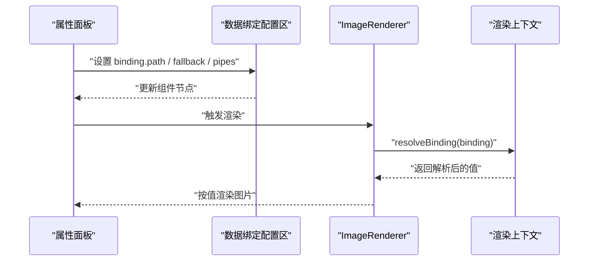
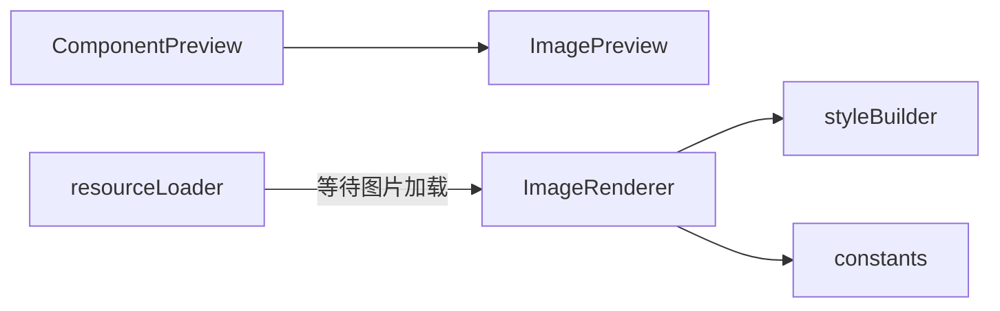

# 图像组件

<cite>
**本文引用的文件**
- [designer/src/pages/Designer/components/Canvas/componentRenderers/ImagePreview.tsx](file://designer/src/pages/Designer/components/Canvas/componentRenderers/ImagePreview.tsx)
- [sdk/src/printEngine/renderers/ImageRenderer.ts](file://sdk/src/printEngine/renderers/ImageRenderer.ts)
- [sdk/src/printEngine/utils/styleBuilder.ts](file://sdk/src/printEngine/utils/styleBuilder.ts)
- [sdk/src/printEngine/constants.ts](file://sdk/src/printEngine/constants.ts)
- [sdk/src/utils/resourceLoader.ts](file://sdk/src/utils/resourceLoader.ts)
- [designer/src/types/index.ts](file://designer/src/types/index.ts)
- [designer/src/pages/Designer/components/Canvas/ComponentPreview.tsx](file://designer/src/pages/Designer/components/Canvas/ComponentPreview.tsx)
- [designer/src/pages/Designer/components/PropertyPanel/DataBindingSection.tsx](file://designer/src/pages/Designer/components/PropertyPanel/DataBindingSection.tsx)
- [designer/src/pages/Designer/components/PropertyPanel/stylePlugins/DefaultStylePlugin.tsx](file://designer/src/pages/Designer/components/PropertyPanel/stylePlugins/DefaultStylePlugin.tsx)
- [sdk/src/printEngine.ts](file://sdk/src/printEngine.ts)
</cite>

## 目录
1. [简介](#简介)
2. [项目结构](#项目结构)
3. [核心组件](#核心组件)
4. [架构总览](#架构总览)
5. [详细组件分析](#详细组件分析)
6. [依赖分析](#依赖分析)
7. [性能考虑](#性能考虑)
8. [故障排查指南](#故障排查指南)
9. [结论](#结论)
10. [附录](#附录)

## 简介
本技术文档围绕“图像组件”展开，系统阐述其属性配置、数据绑定、加载与缓存机制、错误处理、使用场景与性能优化策略，并结合设计器与打印引擎两端的实现进行深入解析。图像组件既支持本地静态资源，也支持通过数据绑定动态加载远程资源；在设计器端提供所见即所得的预览，在打印引擎端确保按模板尺寸精确渲染。

## 项目结构
图像组件涉及两个层面：
- 设计器端（Canvas 预览）：负责在画布上实时预览组件效果，使用 React 组件进行渲染。
- 打印引擎端（HTML 输出）：负责将模板渲染为最终 HTML 字符串，严格遵循毫米到像素的单位换算与尺寸约束。

图表来源
- [designer/src/pages/Designer/components/Canvas/ComponentPreview.tsx:20-50](file://designer/src/pages/Designer/components/Canvas/ComponentPreview.tsx#L20-L50)
- [designer/src/pages/Designer/components/Canvas/componentRenderers/ImagePreview.tsx:10-33](file://designer/src/pages/Designer/components/Canvas/componentRenderers/ImagePreview.tsx#L10-L33)
- [sdk/src/printEngine/renderers/ImageRenderer.ts:13-49](file://sdk/src/printEngine/renderers/ImageRenderer.ts#L13-L49)
- [sdk/src/printEngine/utils/styleBuilder.ts:13-53](file://sdk/src/printEngine/utils/styleBuilder.ts#L13-L53)
- [sdk/src/printEngine/constants.ts:13-46](file://sdk/src/printEngine/constants.ts#L13-L46)

章节来源
- [designer/src/pages/Designer/components/Canvas/ComponentPreview.tsx:20-50](file://designer/src/pages/Designer/components/Canvas/ComponentPreview.tsx#L20-L50)
- [designer/src/pages/Designer/components/Canvas/componentRenderers/ImagePreview.tsx:10-33](file://designer/src/pages/Designer/components/Canvas/componentRenderers/ImagePreview.tsx#L10-L33)
- [sdk/src/printEngine/renderers/ImageRenderer.ts:13-49](file://sdk/src/printEngine/renderers/ImageRenderer.ts#L13-L49)
- [sdk/src/printEngine/utils/styleBuilder.ts:13-53](file://sdk/src/printEngine/utils/styleBuilder.ts#L13-L53)
- [sdk/src/printEngine/constants.ts:13-46](file://sdk/src/printEngine/constants.ts#L13-L46)

## 核心组件
- 组件类型与节点结构
  - 组件类型包含 image，用于标识图像组件。
  - 组件节点包含布局、样式、数据绑定、组件特定属性等字段。
- 图像组件属性
  - props.src：组件特定属性，用于指定图片地址。
  - style.objectFit：控制图片在容器内的裁剪与缩放模式。
- 数据绑定
  - 支持通过 binding.path 指定数据路径，支持管道链式处理与 fallback 回退值。
  - 渲染器优先使用绑定解析后的值作为图片地址，若为空则回退到 props.src。

章节来源
- [designer/src/types/index.ts:129-137](file://designer/src/types/index.ts#L129-L137)
- [designer/src/types/index.ts:303-331](file://designer/src/types/index.ts#L303-L331)
- [designer/src/pages/Designer/components/PropertyPanel/DataBindingSection.tsx:50-70](file://designer/src/pages/Designer/components/PropertyPanel/DataBindingSection.tsx#L50-L70)
- [sdk/src/printEngine.ts:155-164](file://sdk/src/printEngine.ts#L155-L164)
- [sdk/src/printEngine/renderers/ImageRenderer.ts:17-18](file://sdk/src/printEngine/renderers/ImageRenderer.ts#L17-L18)

## 架构总览
图像组件在设计器与打印引擎两端的交互流程如下：

图表来源
- [designer/src/pages/Designer/components/Canvas/ComponentPreview.tsx:20-50](file://designer/src/pages/Designer/components/Canvas/ComponentPreview.tsx#L20-L50)
- [designer/src/pages/Designer/components/Canvas/componentRenderers/ImagePreview.tsx:10-33](file://designer/src/pages/Designer/components/Canvas/componentRenderers/ImagePreview.tsx#L10-L33)
- [sdk/src/printEngine/renderers/ImageRenderer.ts:13-49](file://sdk/src/printEngine/renderers/ImageRenderer.ts#L13-L49)

## 详细组件分析

### 设计器端图像预览（ImagePreview）
- 功能要点
  - 若存在 props.src，则以  渲染，并通过 objectFit 控制裁剪模式。
  - 若不存在 src，则显示占位提示（灰色背景、12px 字体、居中）。
  - 预览样式限制图片最大宽度与高度为 100%，保证在容器内不溢出。
- 关键行为
  - 优先使用组件样式中的 objectFit；未设置时默认 contain。
  - 不设置 alt 文本，避免无障碍冗余信息。

图表来源
- [designer/src/pages/Designer/components/Canvas/componentRenderers/ImagePreview.tsx:10-33](file://designer/src/pages/Designer/components/Canvas/componentRenderers/ImagePreview.tsx#L10-L33)

章节来源
- [designer/src/pages/Designer/components/Canvas/componentRenderers/ImagePreview.tsx:10-33](file://designer/src/pages/Designer/components/Canvas/componentRenderers/ImagePreview.tsx#L10-L33)

### 打印引擎端图像渲染（ImageRenderer）
- 渲染逻辑
  - 优先使用 context.resolveBinding(binding) 的结果作为图片地址；若为空则回退到 props.src。
  - 使用 buildPositionStyle 将 mm 转换为 px，严格按模板尺寸渲染容器。
  - 图片样式固定为 100% 宽高，object-fit 采用 style.objectFit 或默认 fill。
  - 无图片时输出“暂无图片”的占位文本。
- 尺寸与默认值
  - 默认宽度与高度来自常量配置，确保组件在未显式设置尺寸时仍能正确渲染。
- 高度计算
  - calculateHeight 返回组件高度（mm），用于排版与跨页处理。

图表来源
- [sdk/src/printEngine/renderers/ImageRenderer.ts:10-54](file://sdk/src/printEngine/renderers/ImageRenderer.ts#L10-L54)
- [sdk/src/printEngine/utils/styleBuilder.ts:13-53](file://sdk/src/printEngine/utils/styleBuilder.ts#L13-L53)
- [sdk/src/printEngine/constants.ts:13-46](file://sdk/src/printEngine/constants.ts#L13-L46)

章节来源
- [sdk/src/printEngine/renderers/ImageRenderer.ts:13-49](file://sdk/src/printEngine/renderers/ImageRenderer.ts#L13-L49)
- [sdk/src/printEngine/utils/styleBuilder.ts:31-53](file://sdk/src/printEngine/utils/styleBuilder.ts#L31-L53)
- [sdk/src/printEngine/constants.ts:13-46](file://sdk/src/printEngine/constants.ts#L13-L46)

### 数据绑定与样式配置
- 数据绑定
  - 支持 path、pipes、fallback 等配置；渲染前通过 context.resolveBinding 解析。
  - 设计器属性面板提供绑定路径输入与默认值配置，便于非开发人员操作。
- 样式配置
  - 图像组件属于“装饰性/媒体组件”，默认样式插件不提供额外样式属性，仅支持 objectFit。
  - objectFit 可在设计器中通过样式面板调整，影响图片在容器内的缩放与裁剪。

图表来源
- [designer/src/pages/Designer/components/PropertyPanel/DataBindingSection.tsx:50-70](file://designer/src/pages/Designer/components/PropertyPanel/DataBindingSection.tsx#L50-L70)
- [sdk/src/printEngine.ts:155-164](file://sdk/src/printEngine.ts#L155-L164)
- [sdk/src/printEngine/renderers/ImageRenderer.ts:13-18](file://sdk/src/printEngine/renderers/ImageRenderer.ts#L13-L18)
- [designer/src/pages/Designer/components/PropertyPanel/stylePlugins/DefaultStylePlugin.tsx:9-15](file://designer/src/pages/Designer/components/PropertyPanel/stylePlugins/DefaultStylePlugin.tsx#L9-L15)

章节来源
- [designer/src/pages/Designer/components/PropertyPanel/DataBindingSection.tsx:50-70](file://designer/src/pages/Designer/components/PropertyPanel/DataBindingSection.tsx#L50-L70)
- [sdk/src/printEngine.ts:155-164](file://sdk/src/printEngine.ts#L155-L164)
- [designer/src/pages/Designer/components/PropertyPanel/stylePlugins/DefaultStylePlugin.tsx:9-15](file://designer/src/pages/Designer/components/PropertyPanel/stylePlugins/DefaultStylePlugin.tsx#L9-L15)

## 依赖分析
- 组件耦合
  - ComponentPreview 将组件类型映射到具体预览组件，ImagePreview 依赖组件节点的 props 与 style。
  - ImageRenderer 依赖渲染上下文、样式构建工具与常量配置。
- 外部依赖
  - 资源加载工具用于等待打印时的图片资源加载完成，提升渲染稳定性。
- 潜在循环依赖
  - 当前模块间为单向依赖（预览 → 渲染器），未发现循环依赖迹象。

图表来源
- [designer/src/pages/Designer/components/Canvas/ComponentPreview.tsx:20-50](file://designer/src/pages/Designer/components/Canvas/ComponentPreview.tsx#L20-L50)
- [designer/src/pages/Designer/components/Canvas/componentRenderers/ImagePreview.tsx:10-33](file://designer/src/pages/Designer/components/Canvas/componentRenderers/ImagePreview.tsx#L10-L33)
- [sdk/src/printEngine/renderers/ImageRenderer.ts:13-49](file://sdk/src/printEngine/renderers/ImageRenderer.ts#L13-L49)
- [sdk/src/printEngine/utils/styleBuilder.ts:13-53](file://sdk/src/printEngine/utils/styleBuilder.ts#L13-L53)
- [sdk/src/printEngine/constants.ts:13-46](file://sdk/src/printEngine/constants.ts#L13-L46)
- [sdk/src/utils/resourceLoader.ts:12-89](file://sdk/src/utils/resourceLoader.ts#L12-L89)

章节来源
- [sdk/src/utils/resourceLoader.ts:12-89](file://sdk/src/utils/resourceLoader.ts#L12-L89)

## 性能考虑
- 渲染精度与尺寸控制
  - 打印引擎严格按 mm 转 px 的方式构建容器尺寸，避免因自适应导致的排版漂移。
  - 图片样式固定为 100% 宽高，配合 objectFit 精确控制显示效果。
- 资源加载与并发
  - 提供等待图片资源加载完成的工具方法，支持超时与错误统计，避免长时间阻塞。
  - 二维码与条形码在渲染阶段已同步生成为 base64，减少运行时异步开销。
- 缓存策略
  - 浏览器原生缓存与 CDN 缓存可显著降低远程图片加载时间；建议使用稳定的静态资源域名与合适的缓存头。
- 建议
  - 对于大量图片的模板，建议在数据层提前压缩与格式优化（如 WebP），并在绑定阶段通过管道进行格式转换。
  - 使用懒加载策略（如视口外延迟加载）减少初始渲染压力（需结合具体场景评估）。

章节来源
- [sdk/src/printEngine/renderers/ImageRenderer.ts:36-41](file://sdk/src/printEngine/renderers/ImageRenderer.ts#L36-L41)
- [sdk/src/printEngine/utils/styleBuilder.ts:31-53](file://sdk/src/printEngine/utils/styleBuilder.ts#L31-L53)
- [sdk/src/utils/resourceLoader.ts:12-89](file://sdk/src/utils/resourceLoader.ts#L12-L89)

## 故障排查指南
- 图片不显示
  - 检查组件 props.src 是否正确设置；若使用数据绑定，请确认 binding.path 指向有效数据且未被管道过滤为空。
  - 若无数据，fallback 是否为空；必要时设置合理的回退值。
- 加载超时或部分图片失败
  - 使用资源等待工具进行调试，观察超时日志与失败计数，定位网络或资源问题。
- 显示异常（拉伸/裁切不当）
  - 调整 style.objectFit：contain 保持比例完整显示，fill/cover 会填充容器但可能裁切。
- 打印排版错位
  - 确认组件尺寸（widthMm/heightMm）是否合理；未设置时将使用默认尺寸，可能导致布局偏差。

章节来源
- [sdk/src/printEngine.ts:155-164](file://sdk/src/printEngine.ts#L155-L164)
- [sdk/src/utils/resourceLoader.ts:28-43](file://sdk/src/utils/resourceLoader.ts#L28-L43)
- [sdk/src/printEngine/renderers/ImageRenderer.ts:36-41](file://sdk/src/printEngine/renderers/ImageRenderer.ts#L36-L41)

## 结论
图像组件在本项目中实现了“设计期预览 + 渲染期精确输出”的双端一致体验。通过数据绑定与样式配置，既能满足本地静态资源需求，也能灵活对接远程数据源。配合资源等待与尺寸控制策略，可在保证排版稳定的同时兼顾性能与可用性。建议在实际使用中结合业务场景，合理设置 objectFit、fallback 与缓存策略，以获得最佳的用户体验与打印质量。

## 附录
- 使用场景示例（概念性说明）
  - Logo 展示：设置较小尺寸与 contain 裁剪，确保清晰度与比例。
  - 产品图片：根据商品主图尺寸设定容器，使用 cover 填充并裁切多余部分。
  - 二维码嵌入：通过数据绑定将订单号等动态信息注入，渲染为 base64 后与图片一同输出。
- 响应式与适配
  - 设计器端通过 max-width/max-height 与 objectFit 实现基础响应式；打印端以 mm 为基准，严格按容器尺寸渲染，避免响应式带来的排版不确定性。