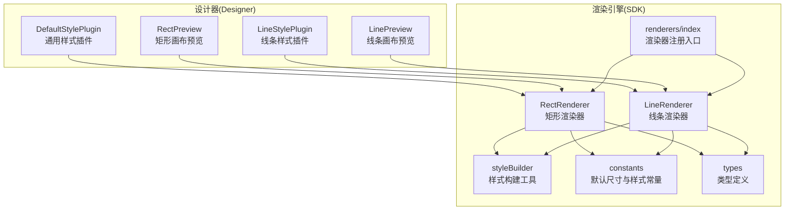
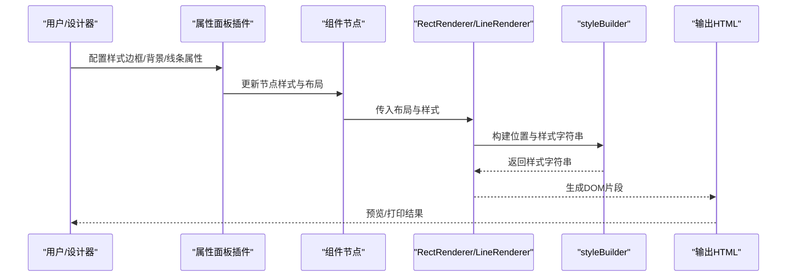
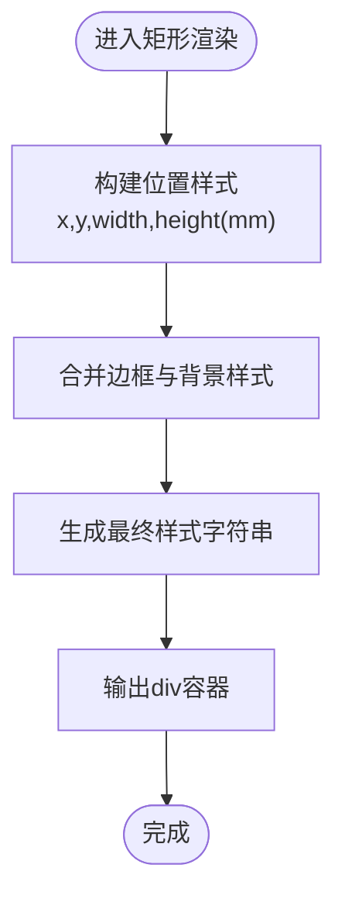
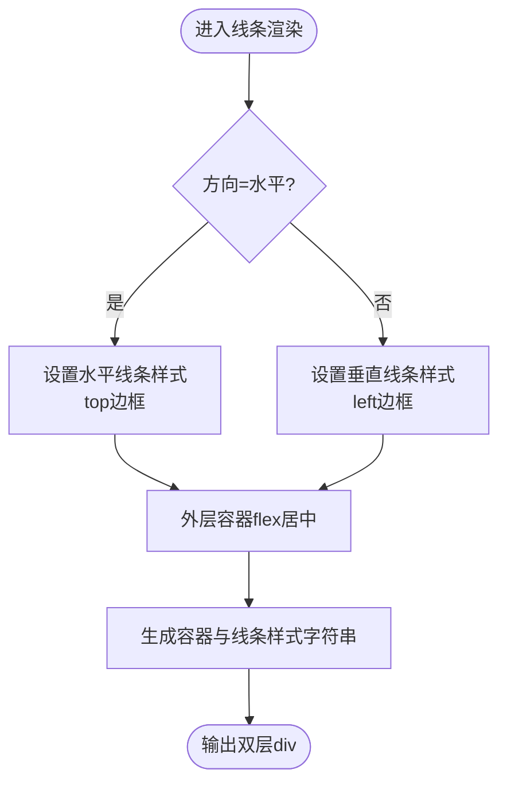
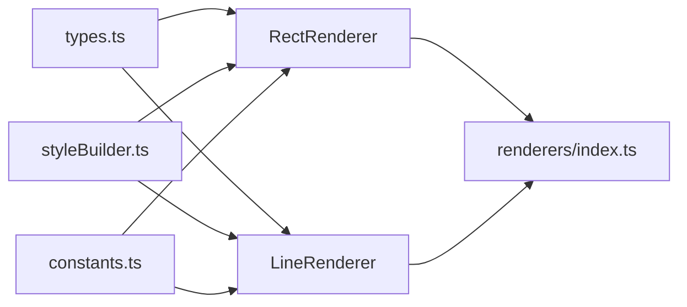

# 形状组件

<cite>
**本文引用的文件**
- [LineRenderer.ts](file://sdk/src/printEngine/renderers/LineRenderer.ts)
- [RectRenderer.ts](file://sdk/src/printEngine/renderers/RectRenderer.ts)
- [styleBuilder.ts](file://sdk/src/printEngine/utils/styleBuilder.ts)
- [constants.ts](file://sdk/src/printEngine/constants.ts)
- [types.ts](file://sdk/src/printEngine/types.ts)
- [index.ts](file://sdk/src/printEngine/renderers/index.ts)
- [LineStylePlugin.tsx](file://designer/src/pages/Designer/components/PropertyPanel/stylePlugins/LineStylePlugin.tsx)
- [DefaultStylePlugin.tsx](file://designer/src/pages/Designer/components/PropertyPanel/stylePlugins/DefaultStylePlugin.tsx)
- [RectPreview.tsx](file://designer/src/pages/Designer/components/Canvas/componentRenderers/RectPreview.tsx)
- [LinePreview.tsx](file://designer/src/pages/Designer/components/Canvas/componentRenderers/LinePreview.tsx)
</cite>

## 目录
1. [引言](#引言)
2. [项目结构](#项目结构)
3. [核心组件](#核心组件)
4. [架构总览](#架构总览)
5. [详细组件分析](#详细组件分析)
6. [依赖分析](#依赖分析)
7. [性能考虑](#性能考虑)
8. [故障排查指南](#故障排查指南)
9. [结论](#结论)
10. [附录](#附录)

## 引言
本文件聚焦于“形状组件”的技术文档，涵盖矩形组件与线条组件的属性配置、布局与渲染机制、绘制算法、样式定制与视觉优化，以及与文本、图像等其他组件的组合使用方式。目标是帮助设计师与开发者快速理解并正确使用形状组件进行页面布局与视觉表达。

## 项目结构
形状组件由两部分构成：
- 渲染引擎（SDK）：负责将组件节点转换为最终可打印或预览的 HTML/CSS 结构，并计算高度等布局参数。
- 设计器前端（Designer）：提供属性面板样式插件与画布预览渲染器，用于可视化配置与实时预览。

图表来源
- [RectRenderer.ts:1-38](file://sdk/src/printEngine/renderers/RectRenderer.ts#L1-L38)
- [LineRenderer.ts:1-58](file://sdk/src/printEngine/renderers/LineRenderer.ts#L1-L58)
- [styleBuilder.ts](file://sdk/src/printEngine/utils/styleBuilder.ts)
- [constants.ts](file://sdk/src/printEngine/constants.ts)
- [types.ts](file://sdk/src/printEngine/types.ts)
- [index.ts](file://sdk/src/printEngine/renderers/index.ts)
- [DefaultStylePlugin.tsx](file://designer/src/pages/Designer/components/PropertyPanel/stylePlugins/DefaultStylePlugin.tsx)
- [LineStylePlugin.tsx](file://designer/src/pages/Designer/components/PropertyPanel/stylePlugins/LineStylePlugin.tsx)
- [RectPreview.tsx](file://designer/src/pages/Designer/components/Canvas/componentRenderers/RectPreview.tsx)
- [LinePreview.tsx](file://designer/src/pages/Designer/components/Canvas/componentRenderers/LinePreview.tsx)

章节来源
- [RectRenderer.ts:1-38](file://sdk/src/printEngine/renderers/RectRenderer.ts#L1-L38)
- [LineRenderer.ts:1-58](file://sdk/src/printEngine/renderers/LineRenderer.ts#L1-L58)
- [styleBuilder.ts](file://sdk/src/printEngine/utils/styleBuilder.ts)
- [constants.ts](file://sdk/src/printEngine/constants.ts)
- [types.ts](file://sdk/src/printEngine/types.ts)
- [index.ts](file://sdk/src/printEngine/renderers/index.ts)
- [DefaultStylePlugin.tsx](file://designer/src/pages/Designer/components/PropertyPanel/stylePlugins/DefaultStylePlugin.tsx)
- [LineStylePlugin.tsx](file://designer/src/pages/Designer/components/PropertyPanel/stylePlugins/LineStylePlugin.tsx)
- [RectPreview.tsx](file://designer/src/pages/Designer/components/Canvas/componentRenderers/RectPreview.tsx)
- [LinePreview.tsx](file://designer/src/pages/Designer/components/Canvas/componentRenderers/LinePreview.tsx)

## 核心组件
- 矩形组件（RectRenderer）
  - 职责：根据布局与样式生成矩形 DOM，支持边框与背景色配置。
  - 关键点：位置与尺寸通过位置样式构建函数生成；边框与背景从样式对象读取，未设置时回退到默认值。
- 线条组件（LineRenderer）
  - 职责：根据方向生成水平或垂直线条，统一使用 CSS 边框实现。
  - 关键点：外层容器用于占位与居中；内层线条通过 top/left/bottom/right 边框实现，支持线宽、线型与颜色。

章节来源
- [RectRenderer.ts:10-38](file://sdk/src/printEngine/renderers/RectRenderer.ts#L10-L38)
- [LineRenderer.ts:10-58](file://sdk/src/printEngine/renderers/LineRenderer.ts#L10-L58)

## 架构总览
渲染流程分为“属性解析—样式构建—DOM 输出”三步，同时提供高度计算以参与布局系统。

图表来源
- [RectRenderer.ts:13-33](file://sdk/src/printEngine/renderers/RectRenderer.ts#L13-L33)
- [LineRenderer.ts:13-51](file://sdk/src/printEngine/renderers/LineRenderer.ts#L13-L51)
- [styleBuilder.ts](file://sdk/src/printEngine/utils/styleBuilder.ts)

章节来源
- [RectRenderer.ts:13-33](file://sdk/src/printEngine/renderers/RectRenderer.ts#L13-L33)
- [LineRenderer.ts:13-51](file://sdk/src/printEngine/renderers/LineRenderer.ts#L13-L51)
- [styleBuilder.ts](file://sdk/src/printEngine/utils/styleBuilder.ts)

## 详细组件分析

### 矩形组件（RectRenderer）
- 绘制算法与渲染机制
  - 位置与尺寸：基于布局坐标与毫米到像素的换算，生成绝对定位的样式。
  - 样式拼装：合并位置样式与边框、背景样式，输出单一 div 容器。
  - 默认回退：当样式缺失时，使用常量模块提供的默认值，确保渲染一致性。
- 布局与高度
  - 高度计算直接返回布局高度，便于上层布局系统使用。
- 可配置属性（来源于样式对象与默认常量）
  - 边框：支持四边独立或统一设置（由样式对象决定），未设置时回退默认边框。
  - 背景：支持纯色背景，未设置时回退默认背景。
  - 尺寸与位置：由布局的 x/y/width/height（毫米）控制。
- 使用场景
  - 装饰元素：作为背景块、分隔区域的底色与边框。
  - 分割线：配合线条组件实现更丰富的分隔样式。
  - 背景图形：作为复杂布局的背景容器。

图表来源
- [RectRenderer.ts:13-33](file://sdk/src/printEngine/renderers/RectRenderer.ts#L13-L33)
- [styleBuilder.ts](file://sdk/src/printEngine/utils/styleBuilder.ts)
- [constants.ts](file://sdk/src/printEngine/constants.ts)

章节来源
- [RectRenderer.ts:10-38](file://sdk/src/printEngine/renderers/RectRenderer.ts#L10-L38)
- [constants.ts](file://sdk/src/printEngine/constants.ts)
- [styleBuilder.ts](file://sdk/src/printEngine/utils/styleBuilder.ts)

### 线条组件（LineRenderer）
- 绘制算法与渲染机制
  - 方向判断：根据方向属性选择水平或垂直渲染。
  - 双层结构：外层容器用于占位与居中；内层 div 使用单边边框模拟线条。
  - 样式拼装：线宽、线型、颜色分别来自样式对象，未设置时回退默认值。
- 布局与高度
  - 高度计算返回外层容器高度，保证布局系统正确感知占用空间。
- 可配置属性（来源于样式对象与默认常量）
  - 方向：horizontal 或 vertical。
  - 线宽：对应边框宽度。
  - 线型：solid/dashed/dotted 等。
  - 线色：对应边框颜色。
  - 尺寸与位置：由布局的 x/y/width/height 控制。
- 使用场景
  - 分割线：水平/垂直分隔内容区块。
  - 装饰线：强调性分隔或引导视线。
  - 与其他组件组合：与文本/图像对齐，形成统一的视觉节奏。

图表来源
- [LineRenderer.ts:13-51](file://sdk/src/printEngine/renderers/LineRenderer.ts#L13-L51)
- [styleBuilder.ts](file://sdk/src/printEngine/utils/styleBuilder.ts)
- [constants.ts](file://sdk/src/printEngine/constants.ts)

章节来源
- [LineRenderer.ts:10-58](file://sdk/src/printEngine/renderers/LineRenderer.ts#L10-L58)
- [constants.ts](file://sdk/src/printEngine/constants.ts)
- [styleBuilder.ts](file://sdk/src/printEngine/utils/styleBuilder.ts)

### 样式插件与属性面板集成
- 通用样式插件（DefaultStylePlugin）
  - 提供通用布局与基础样式配置能力，适配矩形等基础组件。
- 线条样式插件（LineStylePlugin）
  - 专门针对线条组件的样式配置，如方向、线宽、线型、颜色等。
- 画布预览渲染器
  - RectPreview/LinePreview 在设计器画布中提供所见即所得的预览，便于实时调整。

章节来源
- [DefaultStylePlugin.tsx](file://designer/src/pages/Designer/components/PropertyPanel/stylePlugins/DefaultStylePlugin.tsx)
- [LineStylePlugin.tsx](file://designer/src/pages/Designer/components/PropertyPanel/stylePlugins/LineStylePlugin.tsx)
- [RectPreview.tsx](file://designer/src/pages/Designer/components/Canvas/componentRenderers/RectPreview.tsx)
- [LinePreview.tsx](file://designer/src/pages/Designer/components/Canvas/componentRenderers/LinePreview.tsx)

## 依赖分析
- 渲染器依赖关系
  - RectRenderer/LineRenderer 共同依赖样式构建工具与常量模块，确保一致的默认行为与样式拼装逻辑。
  - 类型模块提供组件节点、渲染上下文与样式对象的约束，保证数据结构稳定。
- 注册与入口
  - 渲染器通过统一入口导出，便于运行时按类型选择对应渲染器。

图表来源
- [types.ts](file://sdk/src/printEngine/types.ts)
- [RectRenderer.ts:5-8](file://sdk/src/printEngine/renderers/RectRenderer.ts#L5-L8)
- [LineRenderer.ts:5-8](file://sdk/src/printEngine/renderers/LineRenderer.ts#L5-L8)
- [styleBuilder.ts](file://sdk/src/printEngine/utils/styleBuilder.ts)
- [constants.ts](file://sdk/src/printEngine/constants.ts)
- [index.ts](file://sdk/src/printEngine/renderers/index.ts)

章节来源
- [RectRenderer.ts:5-8](file://sdk/src/printEngine/renderers/RectRenderer.ts#L5-L8)
- [LineRenderer.ts:5-8](file://sdk/src/printEngine/renderers/LineRenderer.ts#L5-L8)
- [styleBuilder.ts](file://sdk/src/printEngine/utils/styleBuilder.ts)
- [constants.ts](file://sdk/src/printEngine/constants.ts)
- [types.ts](file://sdk/src/printEngine/types.ts)
- [index.ts](file://sdk/src/printEngine/renderers/index.ts)

## 性能考虑
- 样式拼装复用：通过样式构建工具集中处理样式字符串生成，减少重复逻辑与拼接错误。
- 默认值集中管理：常量模块提供默认尺寸与样式，避免每次渲染都传递冗余配置。
- 双层结构权衡：线条采用外层容器+内层边框的方式，确保布局占位与视觉表现一致，但会增加一个额外的 DOM 节点，需在复杂场景下关注节点数量。
- 高度计算：渲染器提供明确的高度计算接口，有助于布局系统进行快速测量与排版。

## 故障排查指南
- 线条不可见
  - 检查方向属性是否正确，确认线宽、线型、颜色是否设置；若为空，将回退到默认值。
  - 检查布局尺寸，确保容器有足够空间显示线条。
- 矩形背景或边框不生效
  - 检查样式对象中对应字段是否正确传入；未设置时将使用默认值。
  - 确认布局尺寸与定位，避免被裁剪或覆盖。
- 预览与实际打印差异
  - 确认毫米到像素的换算是否一致；检查样式构建工具的单位换算逻辑。
  - 对比设计器与渲染器的默认常量，确保两端一致。

章节来源
- [LineRenderer.ts:13-51](file://sdk/src/printEngine/renderers/LineRenderer.ts#L13-L51)
- [RectRenderer.ts:13-33](file://sdk/src/printEngine/renderers/RectRenderer.ts#L13-L33)
- [styleBuilder.ts](file://sdk/src/printEngine/utils/styleBuilder.ts)
- [constants.ts](file://sdk/src/printEngine/constants.ts)

## 结论
形状组件通过简洁的渲染器与统一的样式构建机制，实现了对矩形与线条两类基础图形的高效渲染。结合属性面板样式插件与画布预览，能够满足从简单装饰到复杂布局的多种需求。建议在实际使用中优先利用默认常量与样式拼装工具，保持一致的视觉与性能表现。

## 附录
- 与文本、图像等组件的组合使用
  - 与文本组合：使用矩形作为背景或边框，配合文本样式实现标题块、说明框等。
  - 与图像组合：使用线条作为分隔，或用矩形作为图像的边框与背景，增强整体层次感。
  - 与表格/表单等组件：通过线条组件实现单元格分隔、表头分隔等，提升可读性与结构化程度。