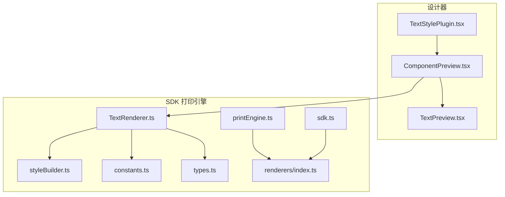
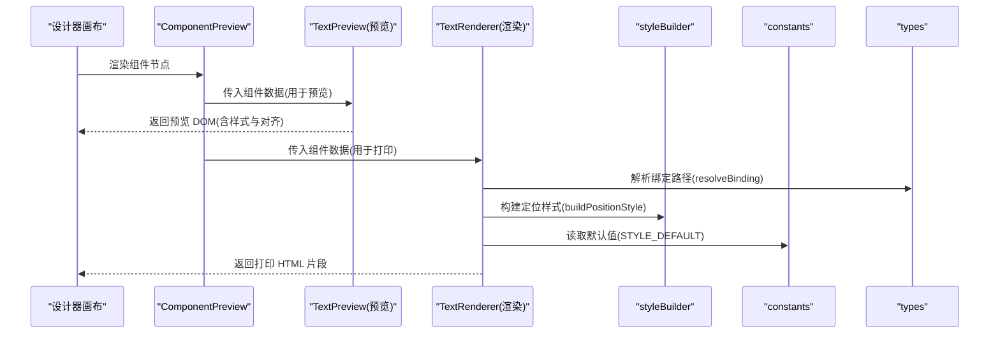
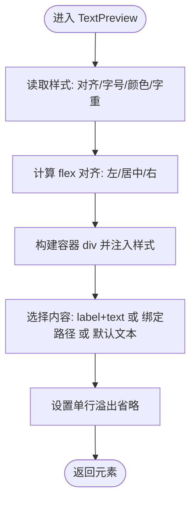
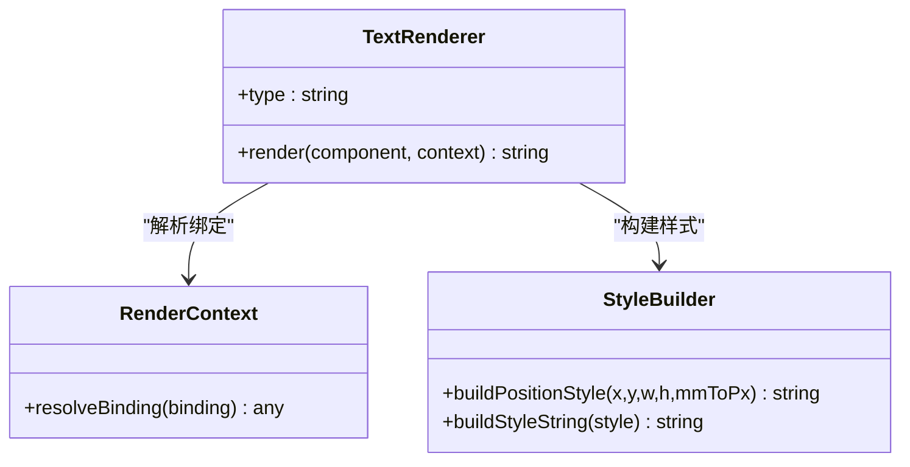
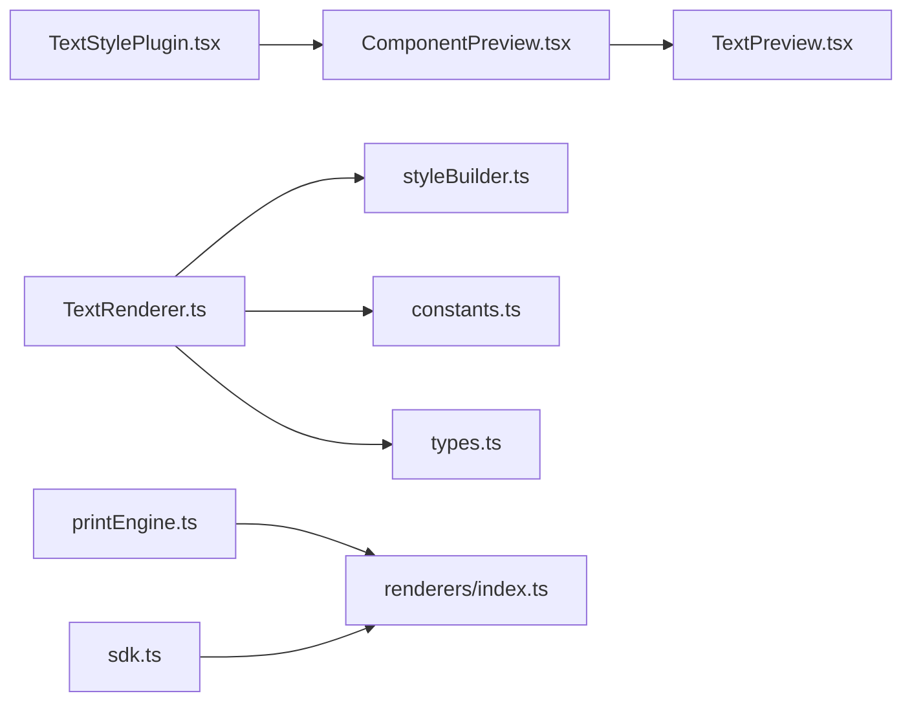

# 文本组件

<cite>
**本文引用的文件**
- [TextPreview.tsx](file://designer/src/pages/Designer/components/Canvas/componentRenderers/TextPreview.tsx)
- [TextStylePlugin.tsx](file://designer/src/pages/Designer/components/PropertyPanel/stylePlugins/TextStylePlugin.tsx)
- [TextRenderer.ts](file://sdk/src/printEngine/renderers/TextRenderer.ts)
- [styleBuilder.ts](file://sdk/src/printEngine/utils/styleBuilder.ts)
- [constants.ts](file://sdk/src/printEngine/constants.ts)
- [types.ts](file://sdk/src/printEngine/types.ts)
- [index.ts](file://sdk/src/printEngine/renderers/index.ts)
- [ComponentPreview.tsx](file://designer/src/pages/Designer/components/Canvas/ComponentPreview.tsx)
- [index.ts](file://designer/src/pages/Designer/components/Canvas/componentRenderers/index.ts)
- [index.ts](file://designer/src/pages/Designer/components/PropertyPanel/stylePlugins/index.ts)
- [printEngine.ts](file://sdk/src/printEngine.ts)
- [sdk.ts](file://sdk/src/sdk.ts)
</cite>

## 目录
1. [简介](#简介)
2. [项目结构](#项目结构)
3. [核心组件](#核心组件)
4. [架构总览](#架构总览)
5. [详细组件分析](#详细组件分析)
6. [依赖关系分析](#依赖关系分析)
7. [性能考虑](#性能考虑)
8. [故障排查指南](#故障排查指南)
9. [结论](#结论)
10. [附录](#附录)

## 简介
本文件面向“文本组件”的技术文档，系统性阐述其在设计器与打印引擎中的实现与使用方式。内容涵盖：
- 属性配置项：字体大小、颜色、对齐方式、粗细等样式设置
- 数据绑定与动态渲染：支持 label 前缀、绑定路径、默认占位文本
- 布局与换行行为：基于 flex 的对齐策略与单行省略显示
- 使用场景示例：静态文本、动态数据绑定、带前缀文本
- 性能优化建议与常见问题
- 与其他组件的组合使用方法

## 项目结构
文本组件在设计器与 SDK 中分别承担“预览渲染”和“打印渲染”的职责，并通过统一的组件类型进行协作。

图表来源
- [ComponentPreview.tsx:1-30](file://designer/src/pages/Designer/components/Canvas/ComponentPreview.tsx#L1-L30)
- [TextPreview.tsx:1-30](file://designer/src/pages/Designer/components/Canvas/componentRenderers/TextPreview.tsx#L1-L30)
- [TextStylePlugin.tsx:1-120](file://designer/src/pages/Designer/components/PropertyPanel/stylePlugins/TextStylePlugin.tsx#L1-L120)
- [TextRenderer.ts:1-120](file://sdk/src/printEngine/renderers/TextRenderer.ts#L1-L120)
- [styleBuilder.ts:1-200](file://sdk/src/printEngine/utils/styleBuilder.ts#L1-L200)
- [constants.ts:1-120](file://sdk/src/printEngine/constants.ts#L1-L120)
- [types.ts:1-200](file://sdk/src/printEngine/types.ts#L1-L200)
- [index.ts:1-60](file://sdk/src/printEngine/renderers/index.ts#L1-L60)
- [printEngine.ts:1-120](file://sdk/src/printEngine.ts#L1-L120)
- [sdk.ts:1-120](file://sdk/src/sdk.ts#L1-L120)

章节来源
- [ComponentPreview.tsx:1-30](file://designer/src/pages/Designer/components/Canvas/ComponentPreview.tsx#L1-L30)
- [TextPreview.tsx:1-30](file://designer/src/pages/Designer/components/Canvas/componentRenderers/TextPreview.tsx#L1-L30)
- [TextStylePlugin.tsx:1-120](file://designer/src/pages/Designer/components/PropertyPanel/stylePlugins/TextStylePlugin.tsx#L1-L120)
- [TextRenderer.ts:1-120](file://sdk/src/printEngine/renderers/TextRenderer.ts#L1-L120)
- [styleBuilder.ts:1-200](file://sdk/src/printEngine/utils/styleBuilder.ts#L1-L200)
- [constants.ts:1-120](file://sdk/src/printEngine/constants.ts#L1-L120)
- [types.ts:1-200](file://sdk/src/printEngine/types.ts#L1-L200)
- [index.ts:1-60](file://sdk/src/printEngine/renderers/index.ts#L1-L60)
- [printEngine.ts:1-120](file://sdk/src/printEngine.ts#L1-L120)
- [sdk.ts:1-120](file://sdk/src/sdk.ts#L1-L120)

## 核心组件
- 设计器侧预览组件：负责在画布中以视觉方式呈现文本组件，包含对齐、颜色、字号、省略等基础样式。
- SDK 侧渲染器：负责将组件节点转换为最终可打印的 HTML/CSS 片段，支持定位、文本对齐、标签前缀与数据绑定解析。

章节来源
- [TextPreview.tsx:1-30](file://designer/src/pages/Designer/components/Canvas/componentRenderers/TextPreview.tsx#L1-L30)
- [TextRenderer.ts:1-120](file://sdk/src/printEngine/renderers/TextRenderer.ts#L1-L120)

## 架构总览
文本组件从“设计时”到“打印时”的关键流程如下：

图表来源
- [ComponentPreview.tsx:1-30](file://designer/src/pages/Designer/components/Canvas/ComponentPreview.tsx#L1-L30)
- [TextPreview.tsx:1-30](file://designer/src/pages/Designer/components/Canvas/componentRenderers/TextPreview.tsx#L1-L30)
- [TextRenderer.ts:1-120](file://sdk/src/printEngine/renderers/TextRenderer.ts#L1-L120)
- [styleBuilder.ts:1-200](file://sdk/src/printEngine/utils/styleBuilder.ts#L1-L200)
- [constants.ts:1-120](file://sdk/src/printEngine/constants.ts#L1-L120)
- [types.ts:1-200](file://sdk/src/printEngine/types.ts#L1-L200)

## 详细组件分析

### 预览组件：TextPreview
- 功能要点
  - 读取组件样式中的对齐、字号、颜色、字重等属性
  - 使用 flex 布局实现水平对齐（左/居中/右），垂直居中
  - 单行文本溢出省略，避免换行
  - 内容优先级：props.label + props.text 或 binding.path，均无则显示默认提示文本

图表来源
- [TextPreview.tsx:1-30](file://designer/src/pages/Designer/components/Canvas/componentRenderers/TextPreview.tsx#L1-L30)

章节来源
- [TextPreview.tsx:1-30](file://designer/src/pages/Designer/components/Canvas/componentRenderers/TextPreview.tsx#L1-L30)

### 渲染器：TextRenderer
- 功能要点
  - 类型标识：type='text'
  - 数据绑定：通过上下文解析 binding，支持 label 前缀拼接
  - 定位样式：根据 x/y/宽/高与 mm 到 px 的换算生成定位样式
  - 文本样式：对齐映射为 flex 的 justifyContent；其余样式由样式构建工具生成
  - 输出：HTML 字符串片段，供打印引擎整合

图表来源
- [TextRenderer.ts:1-120](file://sdk/src/printEngine/renderers/TextRenderer.ts#L1-L120)
- [styleBuilder.ts:1-200](file://sdk/src/printEngine/utils/styleBuilder.ts#L1-L200)
- [types.ts:1-200](file://sdk/src/printEngine/types.ts#L1-L200)

章节来源
- [TextRenderer.ts:1-120](file://sdk/src/printEngine/renderers/TextRenderer.ts#L1-L120)
- [styleBuilder.ts:1-200](file://sdk/src/printEngine/utils/styleBuilder.ts#L1-L200)
- [constants.ts:1-120](file://sdk/src/printEngine/constants.ts#L1-L120)
- [types.ts:1-200](file://sdk/src/printEngine/types.ts#L1-L200)

### 样式插件：TextStylePlugin
- 功能要点
  - 提供文本样式的属性面板配置能力（如字体大小、颜色、对齐、粗细等）
  - 与设计器属性面板集成，驱动组件样式变更

章节来源
- [TextStylePlugin.tsx:1-120](file://designer/src/pages/Designer/components/PropertyPanel/stylePlugins/TextStylePlugin.tsx#L1-L120)
- [index.ts:1-60](file://designer/src/pages/Designer/components/PropertyPanel/stylePlugins/index.ts#L1-L60)

### 组件注册与导出
- 设计器侧：ComponentPreview 根据组件类型选择对应预览器（包含 TextPreview）
- SDK 侧：TextRenderer 注册到渲染器集合，供打印引擎调用

章节来源
- [ComponentPreview.tsx:1-30](file://designer/src/pages/Designer/components/Canvas/ComponentPreview.tsx#L1-L30)
- [index.ts:1-60](file://designer/src/pages/Designer/components/Canvas/componentRenderers/index.ts#L1-L60)
- [printEngine.ts:1-120](file://sdk/src/printEngine.ts#L1-L120)
- [sdk.ts:1-120](file://sdk/src/sdk.ts#L1-L120)

## 依赖关系分析
- 设计器侧
  - ComponentPreview 依赖 TextPreview 进行预览
  - TextStylePlugin 为属性面板提供文本样式配置
- SDK 侧
  - TextRenderer 依赖 styleBuilder 构建样式、依赖 constants 获取默认值、依赖 types 定义上下文接口
  - printEngine 与 sdk 将 TextRenderer 注册并导出

图表来源
- [ComponentPreview.tsx:1-30](file://designer/src/pages/Designer/components/Canvas/ComponentPreview.tsx#L1-L30)
- [TextPreview.tsx:1-30](file://designer/src/pages/Designer/components/Canvas/componentRenderers/TextPreview.tsx#L1-L30)
- [TextStylePlugin.tsx:1-120](file://designer/src/pages/Designer/components/PropertyPanel/stylePlugins/TextStylePlugin.tsx#L1-L120)
- [TextRenderer.ts:1-120](file://sdk/src/printEngine/renderers/TextRenderer.ts#L1-L120)
- [styleBuilder.ts:1-200](file://sdk/src/printEngine/utils/styleBuilder.ts#L1-L200)
- [constants.ts:1-120](file://sdk/src/printEngine/constants.ts#L1-L120)
- [types.ts:1-200](file://sdk/src/printEngine/types.ts#L1-L200)
- [printEngine.ts:1-120](file://sdk/src/printEngine.ts#L1-L120)
- [sdk.ts:1-120](file://sdk/src/sdk.ts#L1-L120)

章节来源
- [ComponentPreview.tsx:1-30](file://designer/src/pages/Designer/components/Canvas/ComponentPreview.tsx#L1-L30)
- [TextPreview.tsx:1-30](file://designer/src/pages/Designer/components/Canvas/componentRenderers/TextPreview.tsx#L1-L30)
- [TextStylePlugin.tsx:1-120](file://designer/src/pages/Designer/components/PropertyPanel/stylePlugins/TextStylePlugin.tsx#L1-L120)
- [TextRenderer.ts:1-120](file://sdk/src/printEngine/renderers/TextRenderer.ts#L1-L120)
- [styleBuilder.ts:1-200](file://sdk/src/printEngine/utils/styleBuilder.ts#L1-L200)
- [constants.ts:1-120](file://sdk/src/printEngine/constants.ts#L1-L120)
- [types.ts:1-200](file://sdk/src/printEngine/types.ts#L1-L200)
- [printEngine.ts:1-120](file://sdk/src/printEngine.ts#L1-L120)
- [sdk.ts:1-120](file://sdk/src/sdk.ts#L1-L120)

## 性能考虑
- 预览阶段
  - 使用单行溢出省略避免复杂排版计算，提升画布渲染性能
  - 仅在需要时更新样式，减少不必要的重绘
- 打印阶段
  - 合理使用定位样式与默认值常量，避免重复计算
  - 在 resolveBinding 失败时快速回退到默认文案，降低异常分支开销
- 通用建议
  - 控制文本长度与换行策略，避免大量长文本导致的布局抖动
  - 对频繁变更的样式采用批量更新策略

## 故障排查指南
- 文本不显示或为空
  - 检查 props.text、binding.path 是否存在，若均无则显示默认提示文本
  - 确认绑定路径是否正确，以及数据源是否可用
- 对齐不生效
  - 预览端依赖 flex 对齐；确保样式中 textAlign 设置为 left/center/right
  - 打印端需保证定位样式与文本样式正确合并
- 文本被截断
  - 预览端默认单行省略；若需多行，请结合其他组件（如表格）实现
- 样式未应用
  - 确认样式插件已注册并生效
  - 检查默认样式常量与样式构建函数是否正确

章节来源
- [TextPreview.tsx:1-30](file://designer/src/pages/Designer/components/Canvas/componentRenderers/TextPreview.tsx#L1-L30)
- [TextRenderer.ts:1-120](file://sdk/src/printEngine/renderers/TextRenderer.ts#L1-L120)
- [TextStylePlugin.tsx:1-120](file://designer/src/pages/Designer/components/PropertyPanel/stylePlugins/TextStylePlugin.tsx#L1-L120)
- [index.ts:1-60](file://designer/src/pages/Designer/components/PropertyPanel/stylePlugins/index.ts#L1-L60)

## 结论
文本组件在设计器与 SDK 中分工明确：预览侧重交互与即时反馈，渲染侧重可打印输出与样式一致性。通过统一的组件类型与样式构建机制，文本组件能够稳定地支持静态文本、动态绑定与前缀拼接等场景，并具备良好的扩展性与组合能力。

## 附录

### 属性配置清单（设计器侧）
- 字体大小：fontSize
- 颜色：color
- 对齐方式：textAlign（left/center/right）
- 字体粗细：fontWeight
- 其他：whiteSpace、overflow、textOverflow（预览端）

章节来源
- [TextPreview.tsx:1-30](file://designer/src/pages/Designer/components/Canvas/componentRenderers/TextPreview.tsx#L1-L30)
- [TextStylePlugin.tsx:1-120](file://designer/src/pages/Designer/components/PropertyPanel/stylePlugins/TextStylePlugin.tsx#L1-L120)

### 数据绑定与动态渲染
- 绑定路径：binding.path
- 文本内容：props.text
- 标签前缀：props.label
- 优先级：label + text > 绑定值 > 默认提示文本

章节来源
- [TextRenderer.ts:1-120](file://sdk/src/printEngine/renderers/TextRenderer.ts#L1-L120)
- [TextPreview.tsx:1-30](file://designer/src/pages/Designer/components/Canvas/componentRenderers/TextPreview.tsx#L1-L30)

### 布局与换行机制
- 预览：flex 布局 + 单行省略
- 打印：定位样式 + 文本样式 + 对齐映射

章节来源
- [TextPreview.tsx:1-30](file://designer/src/pages/Designer/components/Canvas/componentRenderers/TextPreview.tsx#L1-L30)
- [TextRenderer.ts:1-120](file://sdk/src/printEngine/renderers/TextRenderer.ts#L1-L120)
- [styleBuilder.ts:1-200](file://sdk/src/printEngine/utils/styleBuilder.ts#L1-L200)

### 使用场景示例（描述性）
- 静态文本：直接设置 props.text，无需绑定
- 动态数据绑定：配置 binding.path 指向数据源字段
- 带前缀文本：同时设置 props.label 与 props.text，渲染器会拼接输出
- 多行文本：当前预览与渲染器默认为单行；如需多行，请结合表格组件或其他布局方案

章节来源
- [TextRenderer.ts:1-120](file://sdk/src/printEngine/renderers/TextRenderer.ts#L1-L120)
- [TextPreview.tsx:1-30](file://designer/src/pages/Designer/components/Canvas/componentRenderers/TextPreview.tsx#L1-L30)

### 与其他组件的组合使用
- 与表格组合：在表格单元格内放置文本组件，实现复杂报表布局
- 与图像/线条等组合：在同一页面中进行图文混排
- 与属性面板联动：通过 TextStylePlugin 实时调整文本样式

章节来源
- [TextStylePlugin.tsx:1-120](file://designer/src/pages/Designer/components/PropertyPanel/stylePlugins/TextStylePlugin.tsx#L1-L120)
- [ComponentPreview.tsx:1-30](file://designer/src/pages/Designer/components/Canvas/ComponentPreview.tsx#L1-L30)