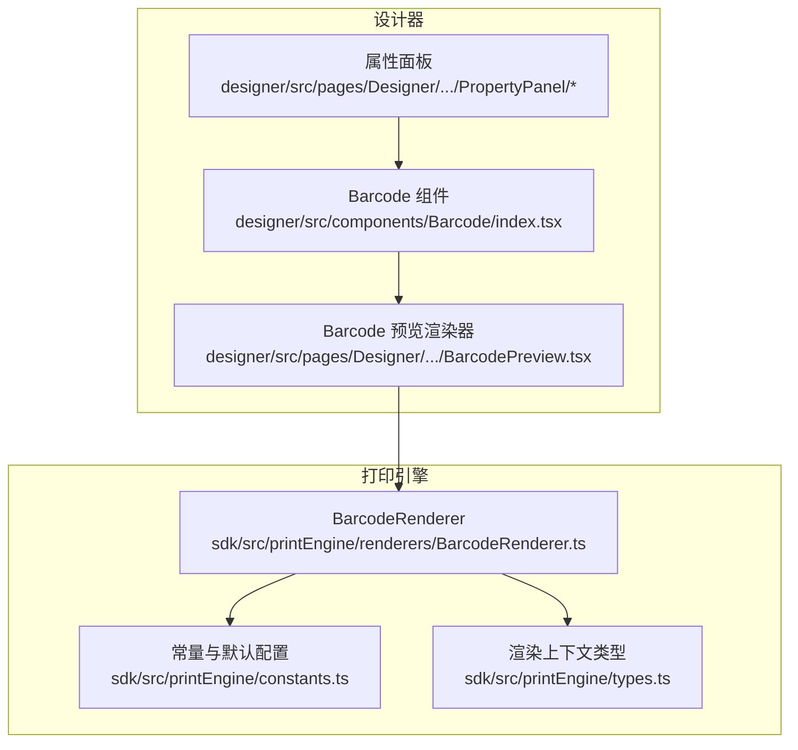
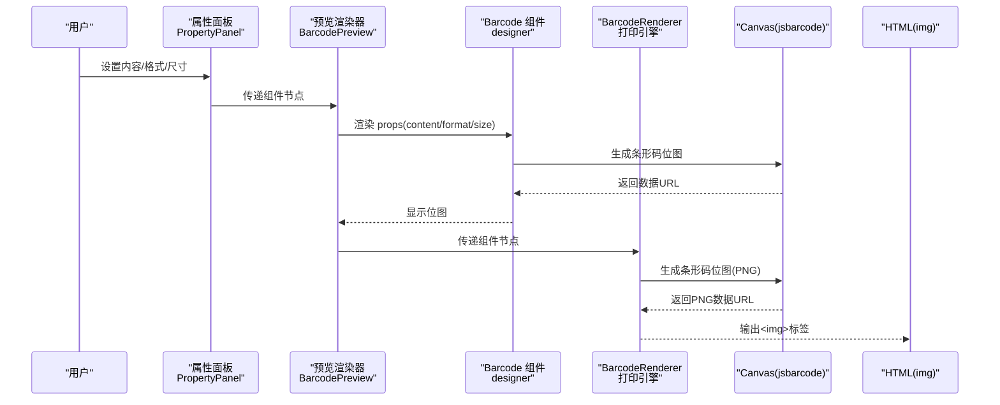
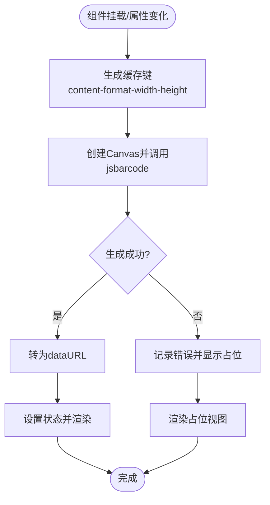
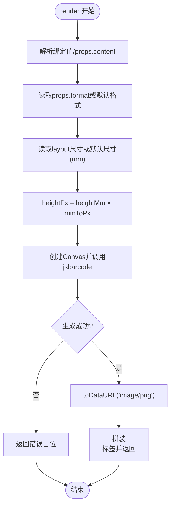
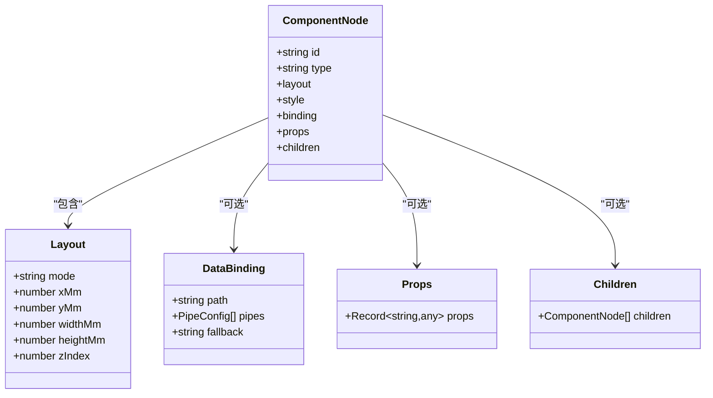
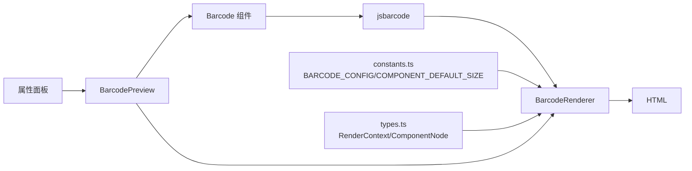

# 条形码组件

<cite>
**本文引用的文件**
- [designer/src/components/Barcode/index.tsx](file://designer/src/components/Barcode/index.tsx)
- [designer/src/pages/Designer/components/Canvas/componentRenderers/BarcodePreview.tsx](file://designer/src/pages/Designer/components/Canvas/componentRenderers/BarcodePreview.tsx)
- [sdk/src/printEngine/renderers/BarcodeRenderer.ts](file://sdk/src/printEngine/renderers/BarcodeRenderer.ts)
- [sdk/src/printEngine/constants.ts](file://sdk/src/printEngine/constants.ts)
- [sdk/src/printEngine/types.ts](file://sdk/src/printEngine/types.ts)
- [designer/src/pages/Designer/components/PropertyPanel/index.tsx](file://designer/src/pages/Designer/components/PropertyPanel/index.tsx)
- [designer/src/pages/Designer/components/PropertyPanel/LayoutSection.tsx](file://designer/src/pages/Designer/components/PropertyPanel/LayoutSection.tsx)
- [designer/src/pages/Designer/components/PropertyPanel/DataBindingSection.tsx](file://designer/src/pages/Designer/components/PropertyPanel/DataBindingSection.tsx)
- [designer/src/types/index.ts](file://designer/src/types/index.ts)
- [sdk/src/types.ts](file://sdk/src/types.ts)
- [designer/src/services/mock/templates.ts](file://designer/src/services/mock/templates.ts)
</cite>

## 目录
1. [简介](#简介)
2. [项目结构](#项目结构)
3. [核心组件](#核心组件)
4. [架构总览](#架构总览)
5. [详细组件分析](#详细组件分析)
6. [依赖关系分析](#依赖关系分析)
7. [性能考虑](#性能考虑)
8. [故障排查指南](#故障排查指南)
9. [结论](#结论)
10. [附录](#附录)

## 简介
本文件系统性梳理条形码组件的设计与实现，覆盖以下方面：
- 组件属性配置：内容、格式、尺寸、显示格式等
- 支持的标准与格式：当前默认为 CODE128，底层依赖 jsbarcode 可扩展
- 编码规则与校验：由 jsbarcode 库负责，组件层面不做二次校验
- 使用场景：商品标签、库存管理、物流追踪等
- 打印精度与质量控制：像素到毫米换算、高度比例、PNG 输出
- 读取兼容性与标准化：通过固定参数与默认值保证一致性

## 项目结构
条形码组件在设计器与打印引擎两端均有实现：
- 设计器端：提供交互式预览组件与属性面板配置入口
- 打印引擎端：在渲染阶段生成 PNG 并嵌入 HTML

**图表来源**
- [designer/src/components/Barcode/index.tsx:1-66](file://designer/src/components/Barcode/index.tsx#L1-L66)
- [designer/src/pages/Designer/components/Canvas/componentRenderers/BarcodePreview.tsx:1-26](file://designer/src/pages/Designer/components/Canvas/componentRenderers/BarcodePreview.tsx#L1-L26)
- [sdk/src/printEngine/renderers/BarcodeRenderer.ts:1-63](file://sdk/src/printEngine/renderers/BarcodeRenderer.ts#L1-L63)
- [sdk/src/printEngine/constants.ts:1-113](file://sdk/src/printEngine/constants.ts#L1-L113)
- [sdk/src/printEngine/types.ts:1-116](file://sdk/src/printEngine/types.ts#L1-L116)

**章节来源**
- [designer/src/components/Barcode/index.tsx:1-66](file://designer/src/components/Barcode/index.tsx#L1-L66)
- [designer/src/pages/Designer/components/Canvas/componentRenderers/BarcodePreview.tsx:1-26](file://designer/src/pages/Designer/components/Canvas/componentRenderers/BarcodePreview.tsx#L1-L26)
- [sdk/src/printEngine/renderers/BarcodeRenderer.ts:1-63](file://sdk/src/printEngine/renderers/BarcodeRenderer.ts#L1-L63)
- [sdk/src/printEngine/constants.ts:1-113](file://sdk/src/printEngine/constants.ts#L1-L113)
- [sdk/src/printEngine/types.ts:1-116](file://sdk/src/printEngine/types.ts#L1-L116)

## 核心组件
- 设计器端条形码组件：基于 Canvas 与 jsbarcode 生成位图，支持缓存与占位提示
- 打印引擎条形码渲染器：在渲染期同步生成 PNG，输出 img 标签
- 预览渲染器：将组件节点映射为设计器内的预览视图
- 属性面板：提供布局、数据绑定、样式与属性编辑能力

关键点：
- 内容来源：优先使用数据绑定解析值，其次使用 props.content，默认值来自常量
- 格式来源：props.format 或默认值（CODE128）
- 尺寸来源：layout.widthMm/heightMm，无则使用默认值
- 输出：PNG 数据 URL，嵌入 img 标签

**章节来源**
- [designer/src/components/Barcode/index.tsx:12-66](file://designer/src/components/Barcode/index.tsx#L12-L66)
- [sdk/src/printEngine/renderers/BarcodeRenderer.ts:15-62](file://sdk/src/printEngine/renderers/BarcodeRenderer.ts#L15-L62)
- [sdk/src/printEngine/constants.ts:97-104](file://sdk/src/printEngine/constants.ts#L97-L104)
- [designer/src/pages/Designer/components/Canvas/componentRenderers/BarcodePreview.tsx:11-25](file://designer/src/pages/Designer/components/Canvas/componentRenderers/BarcodePreview.tsx#L11-L25)

## 架构总览
条形码组件在设计器与打印引擎中的调用链如下：

**图表来源**
- [designer/src/pages/Designer/components/PropertyPanel/index.tsx:17-151](file://designer/src/pages/Designer/components/PropertyPanel/index.tsx#L17-L151)
- [designer/src/pages/Designer/components/Canvas/componentRenderers/BarcodePreview.tsx:11-25](file://designer/src/pages/Designer/components/Canvas/componentRenderers/BarcodePreview.tsx#L11-L25)
- [designer/src/components/Barcode/index.tsx:12-66](file://designer/src/components/Barcode/index.tsx#L12-L66)
- [sdk/src/printEngine/renderers/BarcodeRenderer.ts:15-62](file://sdk/src/printEngine/renderers/BarcodeRenderer.ts#L15-L62)

## 详细组件分析

### 设计器端 Barcode 组件
- 功能要点
  - 接收 content、format、width、height 四个属性
  - 使用 useMemo 缓存 key，减少重复渲染
  - 通过 Canvas + jsbarcode 生成位图，再转为 dataURL
  - 无数据时显示占位提示
- 性能与健壮性
  - 依赖缓存键避免重复生成
  - 异常捕获，防止渲染中断
- 适用场景
  - 设计阶段预览、模板调试

**图表来源**
- [designer/src/components/Barcode/index.tsx:15-34](file://designer/src/components/Barcode/index.tsx#L15-L34)

**章节来源**
- [designer/src/components/Barcode/index.tsx:12-66](file://designer/src/components/Barcode/index.tsx#L12-L66)

### 预览渲染器 BarcodePreview
- 将组件节点映射为设计器内的预览视图
- 将 mm 转换为 px（按 3.78）以适配预览
- 默认格式为 CODE128，内容优先取绑定 fallback

**章节来源**
- [designer/src/pages/Designer/components/Canvas/componentRenderers/BarcodePreview.tsx:11-25](file://designer/src/pages/Designer/components/Canvas/componentRenderers/BarcodePreview.tsx#L11-L25)

### 打印引擎 BarcodeRenderer
- 输入：组件节点与渲染上下文
- 关键流程
  - 解析绑定值或 props.content，默认值来自常量
  - 读取 props.format 或默认格式（CODE128）
  - 读取 layout.widthMm/heightMm，无则使用默认值
  - 计算高度 px = heightMm × mmToPx
  - 使用 jsbarcode 生成 PNG，立即转为 dataURL
  - 返回 img 标签字符串
- 错误处理：异常时返回带错误提示的占位 div

**图表来源**
- [sdk/src/printEngine/renderers/BarcodeRenderer.ts:15-62](file://sdk/src/printEngine/renderers/BarcodeRenderer.ts#L15-L62)
- [sdk/src/printEngine/constants.ts:97-104](file://sdk/src/printEngine/constants.ts#L97-L104)

**章节来源**
- [sdk/src/printEngine/renderers/BarcodeRenderer.ts:12-62](file://sdk/src/printEngine/renderers/BarcodeRenderer.ts#L12-L62)
- [sdk/src/printEngine/constants.ts:97-104](file://sdk/src/printEngine/constants.ts#L97-L104)

### 属性面板与数据绑定
- 属性面板支持布局、样式、数据绑定与属性编辑
- 条形码组件在“数据绑定”区域可配置：
  - 绑定路径：如 user.barcode
  - 默认值(Fallback)：当数据为空时显示
- 布局区域支持 X/Y/宽/高(mm)调整

**章节来源**
- [designer/src/pages/Designer/components/PropertyPanel/index.tsx:17-151](file://designer/src/pages/Designer/components/PropertyPanel/index.tsx#L17-L151)
- [designer/src/pages/Designer/components/PropertyPanel/LayoutSection.tsx:17-47](file://designer/src/pages/Designer/components/PropertyPanel/LayoutSection.tsx#L17-L47)
- [designer/src/pages/Designer/components/PropertyPanel/DataBindingSection.tsx:45-71](file://designer/src/pages/Designer/components/PropertyPanel/DataBindingSection.tsx#L45-L71)

### 数据模型与类型
- ComponentNode：组件节点基础结构，包含 id、type、layout、style、binding、props、children
- 布局字段：mode、xMm、yMm、widthMm、heightMm、zIndex
- 数据绑定：path、pipes、fallback
- 条形码 props：format、content（可通过 props 透传）

**图表来源**
- [designer/src/types/index.ts:303-331](file://designer/src/types/index.ts#L303-L331)
- [sdk/src/types.ts:185-202](file://sdk/src/types.ts#L185-L202)

**章节来源**
- [designer/src/types/index.ts:303-331](file://designer/src/types/index.ts#L303-L331)
- [sdk/src/types.ts:185-202](file://sdk/src/types.ts#L185-L202)

## 依赖关系分析
- 外部依赖：jsbarcode（Canvas 生成条形码）
- 内部依赖：
  - 渲染器依赖常量配置（默认格式、默认内容、高度比例）
  - 渲染器依赖渲染上下文（mmToPx、resolveBinding）
  - 预览渲染器依赖设计器组件与类型
  - 属性面板依赖组件节点类型与表单控件

**图表来源**
- [sdk/src/printEngine/renderers/BarcodeRenderer.ts:6-10](file://sdk/src/printEngine/renderers/BarcodeRenderer.ts#L6-L10)
- [sdk/src/printEngine/constants.ts:97-104](file://sdk/src/printEngine/constants.ts#L97-L104)
- [sdk/src/printEngine/types.ts:11-55](file://sdk/src/printEngine/types.ts#L11-L55)
- [designer/src/pages/Designer/components/Canvas/componentRenderers/BarcodePreview.tsx:1-26](file://designer/src/pages/Designer/components/Canvas/componentRenderers/BarcodePreview.tsx#L1-L26)
- [designer/src/components/Barcode/index.tsx:1-66](file://designer/src/components/Barcode/index.tsx#L1-L66)

**章节来源**
- [sdk/src/printEngine/renderers/BarcodeRenderer.ts:6-10](file://sdk/src/printEngine/renderers/BarcodeRenderer.ts#L6-L10)
- [sdk/src/printEngine/constants.ts:97-104](file://sdk/src/printEngine/constants.ts#L97-L104)
- [sdk/src/printEngine/types.ts:11-55](file://sdk/src/printEngine/types.ts#L11-L55)

## 性能考虑
- 生成策略
  - 设计器端：通过缓存键避免重复生成；Canvas 同步生成，内存占用低
  - 打印引擎端：同步生成 PNG，避免异步等待；高度按比例缩放，避免过度绘制
- 尺寸与分辨率
  - 1mm ≈ 3.78px（96 DPI），确保视觉与打印一致
  - 高度比例（BARCODE_CONFIG.HEIGHT_RATIO）控制条形码可视高度
- 渲染开销
  - 仅在属性变化时重建 Canvas
  - 避免 margin 等多余边距，减少像素填充

**章节来源**
- [sdk/src/printEngine/constants.ts:8](file://sdk/src/printEngine/constants.ts#L8)
- [sdk/src/printEngine/constants.ts:101](file://sdk/src/printEngine/constants.ts#L101)
- [designer/src/components/Barcode/index.tsx:15-34](file://designer/src/components/Barcode/index.tsx#L15-L34)
- [sdk/src/printEngine/renderers/BarcodeRenderer.ts:39-45](file://sdk/src/printEngine/renderers/BarcodeRenderer.ts#L39-L45)

## 故障排查指南
- 条形码无法生成
  - 检查内容是否为空或非法字符
  - 检查 format 是否受支持（默认 CODE128）
  - 查看控制台错误日志
- 预览与打印不一致
  - 确认 layout.widthMm/heightMm 设置
  - 确认 mmToPx 换算是否正确（默认 3.78）
- 读取率低或识别困难
  - 建议增大高度比例或提高分辨率
  - 避免过小字号或过窄条宽
- 数据绑定无效
  - 检查绑定路径与 fallback
  - 确保数据源存在且非空

**章节来源**
- [sdk/src/printEngine/renderers/BarcodeRenderer.ts:52-56](file://sdk/src/printEngine/renderers/BarcodeRenderer.ts#L52-L56)
- [designer/src/components/Barcode/index.tsx:31-33](file://designer/src/components/Barcode/index.tsx#L31-L33)

## 结论
条形码组件在设计器与打印引擎两端保持一致的生成逻辑：以 jsbarcode 为核心，通过 Canvas 同步生成 PNG，并以 img 标签嵌入输出。组件支持灵活的数据绑定、尺寸与格式配置，结合默认常量与类型约束，确保了易用性与一致性。在实际应用中，建议根据业务场景合理设置尺寸与格式，并关注打印精度与读取兼容性。

## 附录

### 属性与配置清单
- 组件属性（props）
  - content: 条形码内容
  - format: 条形码格式（默认 CODE128）
  - width/height: 预览尺寸（px），由 mm×3.78 转换
- 组件节点（ComponentNode）
  - layout.widthMm/heightMm: 布局尺寸（mm）
  - binding.path/fallback: 数据绑定与默认值
- 渲染常量（BARCODE_CONFIG）
  - DEFAULT_FORMAT: 默认格式（CODE128）
  - HEIGHT_RATIO: 高度比例（0.8）
  - DEFAULT_CONTENT: 默认内容（示例）
- 默认尺寸（COMPONENT_DEFAULT_SIZE）
  - BARCODE_WIDTH: 60 mm
  - BARCODE_HEIGHT: 20 mm

**章节来源**
- [sdk/src/printEngine/constants.ts:97-104](file://sdk/src/printEngine/constants.ts#L97-L104)
- [sdk/src/printEngine/constants.ts:37-46](file://sdk/src/printEngine/constants.ts#L37-L46)
- [designer/src/pages/Designer/components/Canvas/componentRenderers/BarcodePreview.tsx:12-15](file://designer/src/pages/Designer/components/Canvas/componentRenderers/BarcodePreview.tsx#L12-L15)

### 使用场景示例
- 商品标签
  - 绑定路径指向商品编号字段，格式设为 CODE128
  - 尺寸按标签空间设定，高度比例适中
- 库存管理
  - 使用数据绑定从库存数据源取值，设置 fallback 保障空值显示
- 物流追踪
  - 使用较长数字序列作为内容，确保可读性与识别稳定性

**章节来源**
- [designer/src/services/mock/templates.ts:232-249](file://designer/src/services/mock/templates.ts#L232-L249)
- [designer/src/services/mock/templates.ts:684-690](file://designer/src/services/mock/templates.ts#L684-L690)