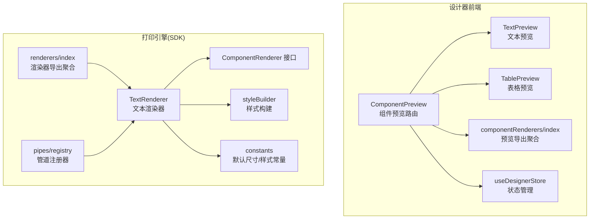
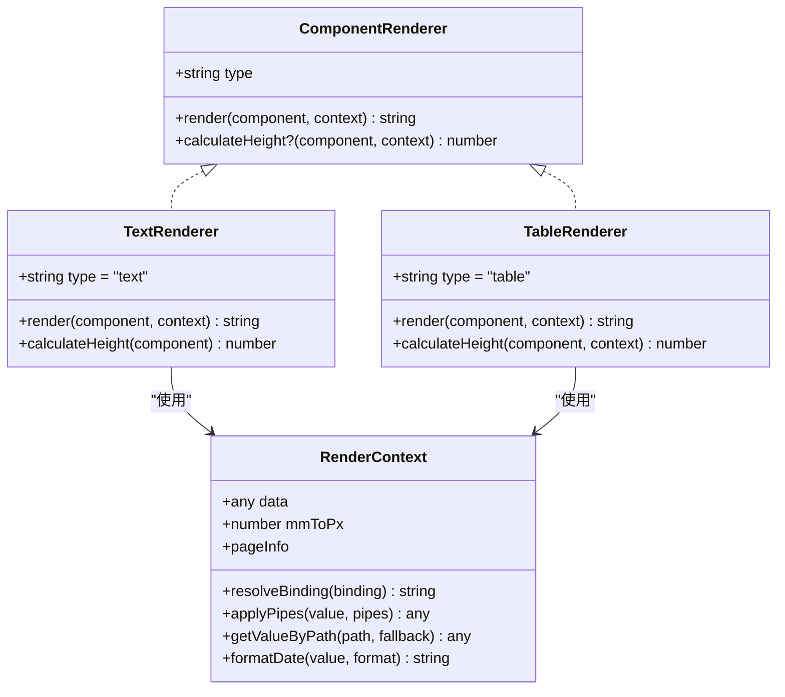
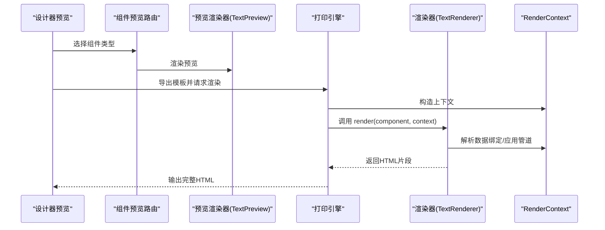
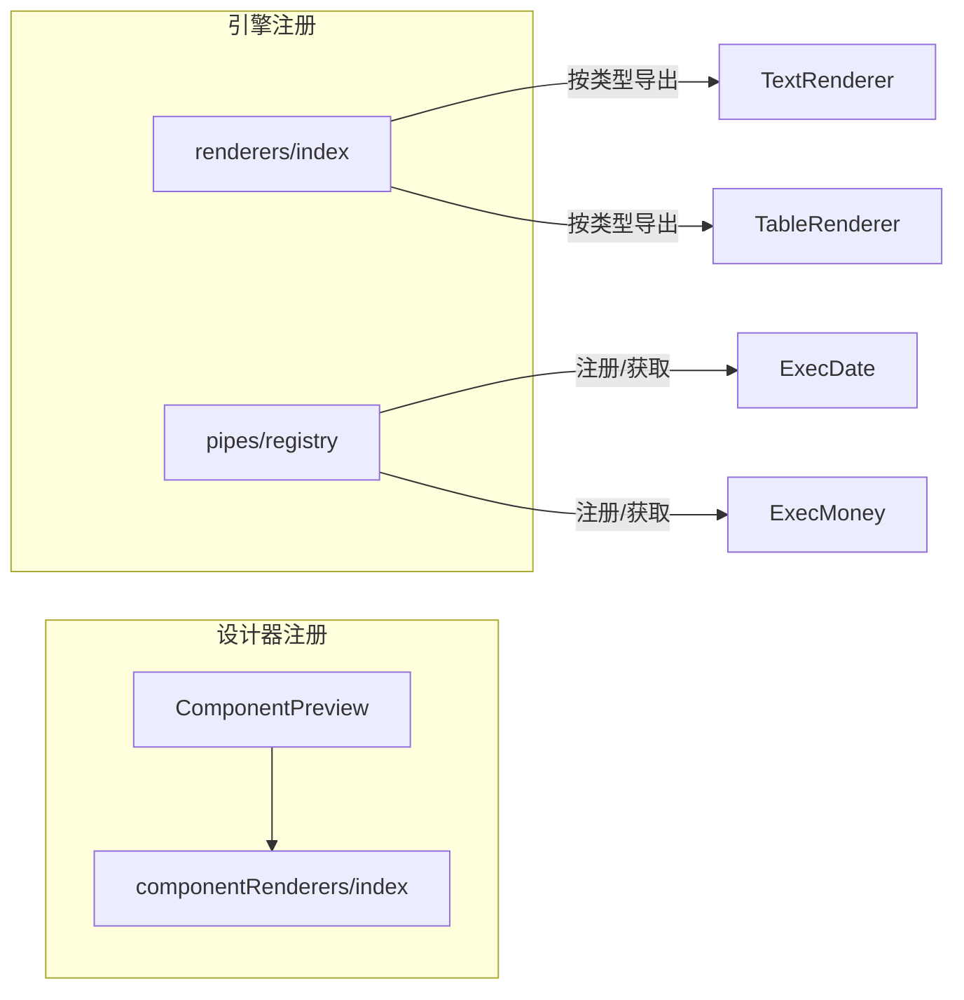
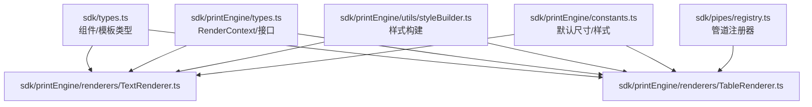
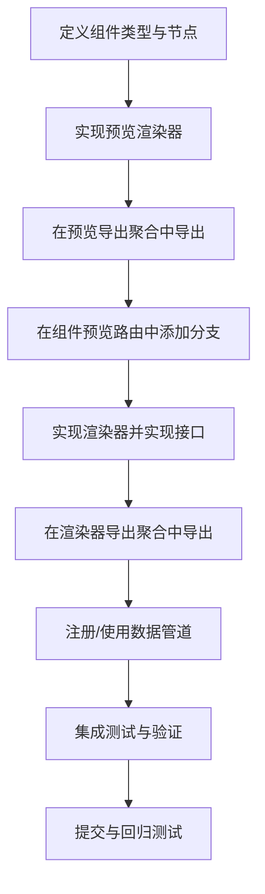

# 组件扩展开发

<cite>
**本文引用的文件**
- [designer/src/pages/Designer/components/Canvas/componentRenderers/index.ts](file://designer/src/pages/Designer/components/Canvas/componentRenderers/index.ts)
- [designer/src/pages/Designer/components/Canvas/componentRenderers/TextPreview.tsx](file://designer/src/pages/Designer/components/Canvas/componentRenderers/TextPreview.tsx)
- [designer/src/pages/Designer/components/Canvas/componentRenderers/TablePreview.tsx](file://designer/src/pages/Designer/components/Canvas/componentRenderers/TablePreview.tsx)
- [designer/src/pages/Designer/components/Canvas/ComponentPreview.tsx](file://designer/src/pages/Designer/components/Canvas/ComponentPreview.tsx)
- [designer/src/store/designer.ts](file://designer/src/store/designer.ts)
- [sdk/src/printEngine/types.ts](file://sdk/src/printEngine/types.ts)
- [sdk/src/printEngine/renderers/index.ts](file://sdk/src/printEngine/renderers/index.ts)
- [sdk/src/printEngine/renderers/TextRenderer.ts](file://sdk/src/printEngine/renderers/TextRenderer.ts)
- [sdk/src/printEngine/renderers/TableRenderer.ts](file://sdk/src/printEngine/renderers/TableRenderer.ts)
- [sdk/src/printEngine/utils/styleBuilder.ts](file://sdk/src/printEngine/utils/styleBuilder.ts)
- [sdk/src/printEngine/constants.ts](file://sdk/src/printEngine/constants.ts)
- [sdk/src/types.ts](file://sdk/src/types.ts)
- [sdk/src/pipes/types.ts](file://sdk/src/pipes/types.ts)
- [sdk/src/pipes/registry.ts](file://sdk/src/pipes/registry.ts)
</cite>

## 目录
1. [简介](#简介)
2. [项目结构](#项目结构)
3. [核心组件](#核心组件)
4. [架构总览](#架构总览)
5. [详细组件分析](#详细组件分析)
6. [依赖分析](#依赖分析)
7. [性能考量](#性能考量)
8. [故障排查指南](#故障排查指南)
9. [结论](#结论)
10. [附录](#附录)

## 简介
本指南面向需要为打印模板设计器与打印引擎添加“自定义组件”的开发者，系统讲解如何实现自定义组件渲染器、注册机制、生命周期与错误处理策略，并提供从接口实现到集成测试的完整流程。同时涵盖性能优化、调试技巧、版本管理与向后兼容性建议。

## 项目结构
- 设计器前端（React）负责组件预览与交互，通过统一的组件预览映射将不同组件类型渲染为可视化界面。
- 打印引擎（SDK）负责将模板渲染为可打印的 HTML，采用“渲染器插件化”架构，通过统一接口扩展新组件。

**图表来源**
- [designer/src/pages/Designer/components/Canvas/ComponentPreview.tsx:16-50](file://designer/src/pages/Designer/components/Canvas/ComponentPreview.tsx#L16-L50)
- [designer/src/pages/Designer/components/Canvas/componentRenderers/index.ts:1-11](file://designer/src/pages/Designer/components/Canvas/componentRenderers/index.ts#L1-L11)
- [designer/src/pages/Designer/components/Canvas/componentRenderers/TextPreview.tsx:1-31](file://designer/src/pages/Designer/components/Canvas/componentRenderers/TextPreview.tsx#L1-L31)
- [designer/src/pages/Designer/components/Canvas/componentRenderers/TablePreview.tsx:1-175](file://designer/src/pages/Designer/components/Canvas/componentRenderers/TablePreview.tsx#L1-L175)
- [sdk/src/printEngine/types.ts:58-82](file://sdk/src/printEngine/types.ts#L58-L82)
- [sdk/src/printEngine/renderers/TextRenderer.ts:10-59](file://sdk/src/printEngine/renderers/TextRenderer.ts#L10-L59)
- [sdk/src/printEngine/renderers/index.ts:1-13](file://sdk/src/printEngine/renderers/index.ts#L1-L13)
- [sdk/src/printEngine/utils/styleBuilder.ts:13-53](file://sdk/src/printEngine/utils/styleBuilder.ts#L13-L53)
- [sdk/src/printEngine/constants.ts:13-78](file://sdk/src/printEngine/constants.ts#L13-L78)
- [sdk/src/pipes/registry.ts:17-26](file://sdk/src/pipes/registry.ts#L17-L26)

**章节来源**
- [designer/src/pages/Designer/components/Canvas/ComponentPreview.tsx:16-50](file://designer/src/pages/Designer/components/Canvas/ComponentPreview.tsx#L16-L50)
- [designer/src/pages/Designer/components/Canvas/componentRenderers/index.ts:1-11](file://designer/src/pages/Designer/components/Canvas/componentRenderers/index.ts#L1-L11)
- [sdk/src/printEngine/renderers/index.ts:1-13](file://sdk/src/printEngine/renderers/index.ts#L1-L13)

## 核心组件
- 组件类型与节点定义：统一的组件类型枚举与组件节点结构，支撑设计器与引擎两端一致的数据契约。
- 渲染器接口：所有组件渲染器需实现统一接口，包含类型标识、渲染方法与可选高度计算。
- 预览渲染器：设计器侧的组件预览实现，用于画布实时预览。
- 状态与模板：设计器 Store 负责组件增删改、复制粘贴、撤销重做、区域移动等操作，并生成可序列化的模板。

**章节来源**
- [sdk/src/types.ts:72-202](file://sdk/src/types.ts#L72-L202)
- [sdk/src/printEngine/types.ts:58-82](file://sdk/src/printEngine/types.ts#L58-L82)
- [designer/src/store/designer.ts:9-90](file://designer/src/store/designer.ts#L9-L90)

## 架构总览
渲染器插件化架构通过“接口 + 注册 + 路由”的方式实现扩展：
- 接口层：ComponentRenderer 规范渲染器能力。
- 注册层：渲染器导出聚合文件集中暴露，便于按需引入与替换。
- 路由层：设计器根据组件类型选择对应的预览渲染器；引擎根据组件类型调用对应渲染器生成 HTML。
- 管道系统：数据绑定与格式化通过管道注册器统一管理，渲染器在渲染时可调用。

**图表来源**
- [sdk/src/printEngine/types.ts:58-82](file://sdk/src/printEngine/types.ts#L58-L82)
- [sdk/src/printEngine/renderers/TextRenderer.ts:10-59](file://sdk/src/printEngine/renderers/TextRenderer.ts#L10-L59)
- [sdk/src/printEngine/renderers/TableRenderer.ts:147-601](file://sdk/src/printEngine/renderers/TableRenderer.ts#L147-L601)

## 详细组件分析

### 渲染器接口规范与生命周期
- 接口职责
  - type：组件类型标识，用于路由与匹配。
  - render：将组件节点与渲染上下文转换为 HTML 字符串。
  - calculateHeight：可选，用于分页与布局估算。
- 生命周期
  - 设计器阶段：组件节点进入画布后，通过预览渲染器即时呈现。
  - 引擎阶段：渲染器在渲染时读取组件布局、样式、数据绑定与 props，输出最终 HTML。

**图表来源**
- [designer/src/pages/Designer/components/Canvas/ComponentPreview.tsx:20-50](file://designer/src/pages/Designer/components/Canvas/ComponentPreview.tsx#L20-L50)
- [designer/src/pages/Designer/components/Canvas/componentRenderers/TextPreview.tsx:10-30](file://designer/src/pages/Designer/components/Canvas/componentRenderers/TextPreview.tsx#L10-L30)
- [sdk/src/printEngine/types.ts:11-55](file://sdk/src/printEngine/types.ts#L11-L55)
- [sdk/src/printEngine/renderers/TextRenderer.ts:13-53](file://sdk/src/printEngine/renderers/TextRenderer.ts#L13-L53)

**章节来源**
- [sdk/src/printEngine/types.ts:58-82](file://sdk/src/printEngine/types.ts#L58-L82)
- [sdk/src/printEngine/renderers/TextRenderer.ts:10-59](file://sdk/src/printEngine/renderers/TextRenderer.ts#L10-L59)

### 组件注册机制与插件化架构
- 设计器侧注册
  - 预览渲染器导出聚合：集中导出各组件预览，便于路由按类型匹配。
  - 组件预览路由：根据组件类型选择对应预览组件。
- 引擎侧注册
  - 渲染器导出聚合：集中导出各组件渲染器，供引擎按类型调用。
  - 管道注册器：集中注册与获取数据管道执行器，渲染器在渲染时调用。

**图表来源**
- [designer/src/pages/Designer/components/Canvas/componentRenderers/index.ts:1-11](file://designer/src/pages/Designer/components/Canvas/componentRenderers/index.ts#L1-L11)
- [designer/src/pages/Designer/components/Canvas/ComponentPreview.tsx:20-50](file://designer/src/pages/Designer/components/Canvas/ComponentPreview.tsx#L20-L50)
- [sdk/src/printEngine/renderers/index.ts:1-13](file://sdk/src/printEngine/renderers/index.ts#L1-L13)
- [sdk/src/pipes/registry.ts:17-26](file://sdk/src/pipes/registry.ts#L17-L26)

**章节来源**
- [designer/src/pages/Designer/components/Canvas/componentRenderers/index.ts:1-11](file://designer/src/pages/Designer/components/Canvas/componentRenderers/index.ts#L1-L11)
- [sdk/src/printEngine/renderers/index.ts:1-13](file://sdk/src/printEngine/renderers/index.ts#L1-L13)
- [sdk/src/pipes/registry.ts:17-26](file://sdk/src/pipes/registry.ts#L17-L26)

### 自定义组件开发完整示例（步骤与要点）
- 步骤一：定义组件类型与节点
  - 在类型定义中增加新组件类型，并在组件节点中补充必要的 props 结构。
  - 参考：组件类型与节点定义位于类型文件中。
- 步骤二：实现预览渲染器
  - 在设计器侧新增预览组件文件，遵循现有预览组件的样式与布局约定。
  - 在预览导出聚合中导出新组件预览。
  - 在组件预览路由中添加类型分支以渲染新组件。
  - 参考：文本与表格预览组件的实现与导出聚合。
- 步骤三：实现渲染器
  - 在引擎侧新增渲染器类，实现 ComponentRenderer 接口。
  - 在渲染器中解析数据绑定、应用样式与管道、生成 HTML。
  - 在渲染器导出聚合中导出新渲染器。
  - 参考：文本渲染器与表格渲染器的实现。
- 步骤四：注册与集成
  - 在管道注册器中注册所需管道执行器（如存在数据格式化需求）。
  - 在渲染器中通过注册器获取并执行管道。
- 步骤五：集成测试
  - 在设计器中创建新组件，验证预览效果与交互。
  - 导出模板并在引擎中渲染，验证生成的 HTML 符合预期。
  - 参考：设计器 Store 的组件增删改与历史记录机制，便于回滚与对比。

**章节来源**
- [sdk/src/types.ts:72-202](file://sdk/src/types.ts#L72-L202)
- [designer/src/pages/Designer/components/Canvas/componentRenderers/TextPreview.tsx:10-30](file://designer/src/pages/Designer/components/Canvas/componentRenderers/TextPreview.tsx#L10-L30)
- [designer/src/pages/Designer/components/Canvas/componentRenderers/TablePreview.tsx:69-175](file://designer/src/pages/Designer/components/Canvas/componentRenderers/TablePreview.tsx#L69-L175)
- [designer/src/pages/Designer/components/Canvas/componentRenderers/index.ts:1-11](file://designer/src/pages/Designer/components/Canvas/componentRenderers/index.ts#L1-L11)
- [designer/src/pages/Designer/components/Canvas/ComponentPreview.tsx:20-50](file://designer/src/pages/Designer/components/Canvas/ComponentPreview.tsx#L20-L50)
- [sdk/src/printEngine/renderers/TextRenderer.ts:10-59](file://sdk/src/printEngine/renderers/TextRenderer.ts#L10-L59)
- [sdk/src/printEngine/renderers/TableRenderer.ts:147-601](file://sdk/src/printEngine/renderers/TableRenderer.ts#L147-L601)
- [sdk/src/printEngine/renderers/index.ts:1-13](file://sdk/src/printEngine/renderers/index.ts#L1-L13)
- [sdk/src/pipes/registry.ts:17-26](file://sdk/src/pipes/registry.ts#L17-L26)
- [designer/src/store/designer.ts:113-149](file://designer/src/store/designer.ts#L113-L149)

### 错误处理与健壮性
- 表格渲染器对边界条件与异常进行了处理：
  - 宽度溢出警告与自动调整。
  - 最小宽度保护与位置越界错误提示。
  - 合计计算使用高精度库并捕获异常，返回友好提示。
  - 管道执行失败时保留原始值，避免中断渲染。
- 设计器 Store 提供撤销/重做与历史快照，便于快速回滚与定位问题。

**章节来源**
- [sdk/src/printEngine/renderers/TableRenderer.ts:196-234](file://sdk/src/printEngine/renderers/TableRenderer.ts#L196-L234)
- [sdk/src/printEngine/renderers/TableRenderer.ts:429-463](file://sdk/src/printEngine/renderers/TableRenderer.ts#L429-L463)
- [sdk/src/printEngine/renderers/TableRenderer.ts:552-556](file://sdk/src/printEngine/renderers/TableRenderer.ts#L552-L556)
- [designer/src/store/designer.ts:508-548](file://designer/src/store/designer.ts#L508-L548)

## 依赖分析
- 组件类型与节点定义贯穿设计器与引擎两端，保证数据一致性。
- 渲染器依赖样式构建工具与常量配置，确保定位与默认尺寸一致。
- 管道注册器为渲染器提供数据格式化能力，增强组件表现力。

**图表来源**
- [sdk/src/types.ts:72-202](file://sdk/src/types.ts#L72-L202)
- [sdk/src/printEngine/types.ts:11-55](file://sdk/src/printEngine/types.ts#L11-L55)
- [sdk/src/printEngine/utils/styleBuilder.ts:13-53](file://sdk/src/printEngine/utils/styleBuilder.ts#L13-L53)
- [sdk/src/printEngine/constants.ts:13-78](file://sdk/src/printEngine/constants.ts#L13-L78)
- [sdk/src/printEngine/renderers/TextRenderer.ts:10-59](file://sdk/src/printEngine/renderers/TextRenderer.ts#L10-L59)
- [sdk/src/printEngine/renderers/TableRenderer.ts:147-601](file://sdk/src/printEngine/renderers/TableRenderer.ts#L147-L601)
- [sdk/src/pipes/registry.ts:17-26](file://sdk/src/pipes/registry.ts#L17-L26)

**章节来源**
- [sdk/src/types.ts:72-202](file://sdk/src/types.ts#L72-L202)
- [sdk/src/printEngine/renderers/TextRenderer.ts:10-59](file://sdk/src/printEngine/renderers/TextRenderer.ts#L10-L59)
- [sdk/src/printEngine/renderers/TableRenderer.ts:147-601](file://sdk/src/printEngine/renderers/TableRenderer.ts#L147-L601)

## 性能考量
- 预览渲染器
  - 文本预览采用简洁样式与单行省略，减少 DOM 复杂度。
  - 表格预览在拖拽列宽时仅更新本地状态，mouseup 一次性提交，降低 Store 写入频率。
- 引擎渲染器
  - 使用样式构建工具将样式对象转为 CSS 字符串，避免频繁 DOM 操作。
  - 表格渲染器对列宽计算与最小宽度保护，减少布局抖动。
  - 合计计算使用高精度库，避免浮点误差导致的布局异常。
- 管道执行
  - 管道执行器缓存于注册表，避免重复创建，提升执行效率。

**章节来源**
- [designer/src/pages/Designer/components/Canvas/componentRenderers/TextPreview.tsx:10-30](file://designer/src/pages/Designer/components/Canvas/componentRenderers/TextPreview.tsx#L10-L30)
- [designer/src/pages/Designer/components/Canvas/componentRenderers/TablePreview.tsx:36-64](file://designer/src/pages/Designer/components/Canvas/componentRenderers/TablePreview.tsx#L36-L64)
- [sdk/src/printEngine/utils/styleBuilder.ts:13-21](file://sdk/src/printEngine/utils/styleBuilder.ts#L13-L21)
- [sdk/src/printEngine/renderers/TableRenderer.ts:390-463](file://sdk/src/printEngine/renderers/TableRenderer.ts#L390-L463)
- [sdk/src/pipes/registry.ts:17-26](file://sdk/src/pipes/registry.ts#L17-L26)

## 故障排查指南
- 表格宽度溢出
  - 现象：控制台出现宽度溢出警告或表格无法显示。
  - 处理：调整表格 xMm 或减少列宽，确保 xMm + widthMm 不超过右页边距。
- 表格位置越界
  - 现象：控制台出现位置错误提示。
  - 处理：将表格 xMm 调整至右页边距以内。
- 合计计算异常
  - 现象：合计行显示“计算错误”或空白。
  - 处理：检查数据源与列数据类型，确保可转换为数字；确认管道配置正确。
- 管道执行失败
  - 现象：数据格式化未生效。
  - 处理：确认管道类型与选项正确，必要时回退到原始值。
- 预览不刷新
  - 现象：修改组件属性后预览未更新。
  - 处理：检查组件 props 更新路径与 Store 写入逻辑；利用撤销/重做对比差异。

**章节来源**
- [sdk/src/printEngine/renderers/TableRenderer.ts:196-234](file://sdk/src/printEngine/renderers/TableRenderer.ts#L196-L234)
- [sdk/src/printEngine/renderers/TableRenderer.ts:223-228](file://sdk/src/printEngine/renderers/TableRenderer.ts#L223-L228)
- [sdk/src/printEngine/renderers/TableRenderer.ts:429-463](file://sdk/src/printEngine/renderers/TableRenderer.ts#L429-L463)
- [sdk/src/printEngine/renderers/TableRenderer.ts:552-556](file://sdk/src/printEngine/renderers/TableRenderer.ts#L552-L556)
- [designer/src/store/designer.ts:508-548](file://designer/src/store/designer.ts#L508-L548)

## 结论
通过统一的组件类型定义、渲染器接口与插件化注册机制，项目实现了良好的扩展性与一致性。开发者只需遵循接口规范、完善预览与渲染实现、完成注册与测试，即可快速添加新组件。配合完善的错误处理与性能优化策略，可在复杂场景下保持稳定与高效。

## 附录

### 自定义组件开发流程图

[本图为概念性流程示意，无需图表来源]