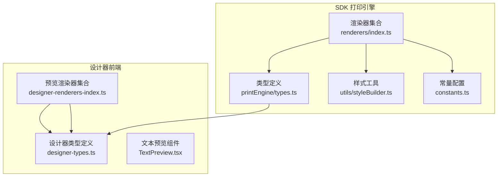
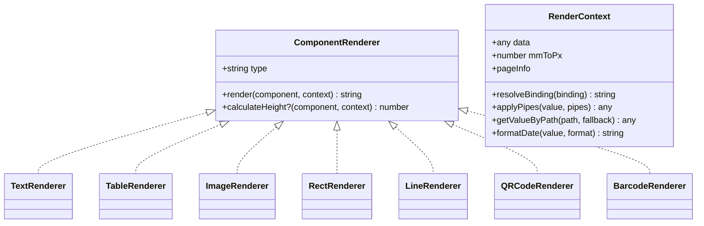
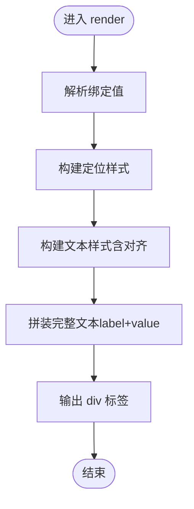
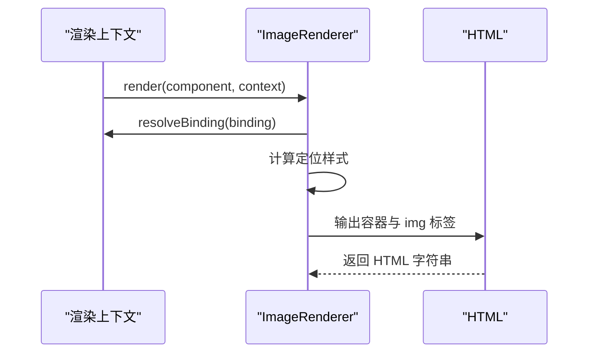
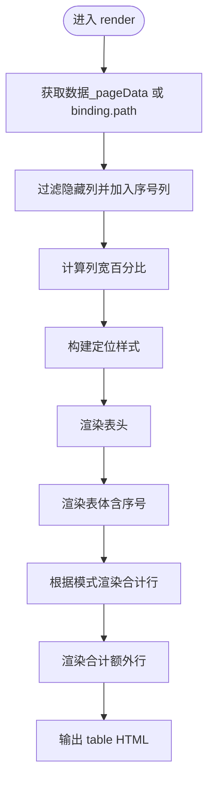
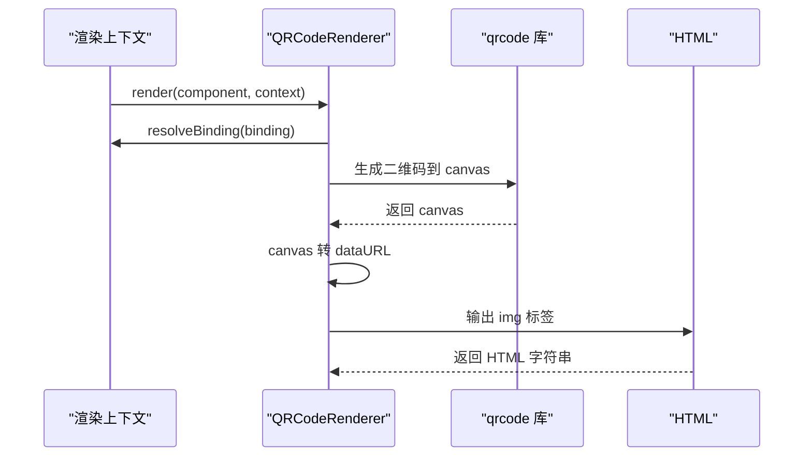
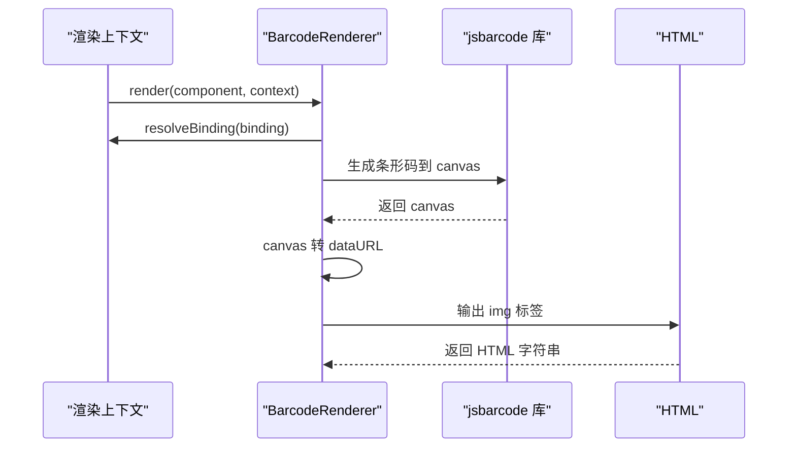
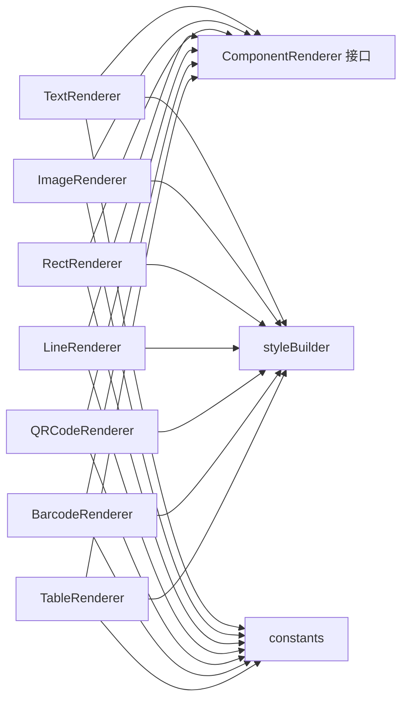

# 组件系统详解

<cite>
**本文引用的文件**
- [renderers/index.ts](file://sdk/src/printEngine/renderers/index.ts)
- [designer-renderers-index.ts](file://designer/src/pages/Designer/components/Canvas/componentRenderers/index.ts)
- [printEngine-types.ts](file://sdk/src/printEngine/types.ts)
- [designer-types.ts](file://designer/src/types/index.ts)
- [sdk-types.ts](file://sdk/src/types.ts)
- [TextRenderer.ts](file://sdk/src/printEngine/renderers/TextRenderer.ts)
- [TableRenderer.ts](file://sdk/src/printEngine/renderers/TableRenderer.ts)
- [ImageRenderer.ts](file://sdk/src/printEngine/renderers/ImageRenderer.ts)
- [RectRenderer.ts](file://sdk/src/printEngine/renderers/RectRenderer.ts)
- [LineRenderer.ts](file://sdk/src/printEngine/renderers/LineRenderer.ts)
- [QRCodeRenderer.ts](file://sdk/src/printEngine/renderers/QRCodeRenderer.ts)
- [BarcodeRenderer.ts](file://sdk/src/printEngine/renderers/BarcodeRenderer.ts)
- [styleBuilder.ts](file://sdk/src/printEngine/utils/styleBuilder.ts)
- [constants.ts](file://sdk/src/printEngine/constants.ts)
- [TextPreview.tsx](file://designer/src/pages/Designer/components/Canvas/componentRenderers/TextPreview.tsx)
</cite>

## 目录
1. [简介](#简介)
2. [项目结构](#项目结构)
3. [核心组件](#核心组件)
4. [架构总览](#架构总览)
5. [详细组件分析](#详细组件分析)
6. [依赖分析](#依赖分析)
7. [性能考量](#性能考量)
8. [故障排查指南](#故障排查指南)
9. [结论](#结论)
10. [附录](#附录)

## 简介
本技术文档面向“打印组件系统”，系统性阐述内置组件类型（文本、图像、表格、二维码、条形码、矩形、线条等）的特性、属性配置、样式设置与数据绑定方式；解释组件渲染器的工作原理与插件化架构；提供使用示例与最佳实践；介绍扩展开发方法（自定义组件渲染器）；说明组件层级关系与布局约束；并给出性能优化与调试技巧。

## 项目结构
- SDK 打印引擎位于 sdk/src/printEngine，包含渲染器、类型定义、样式工具与常量。
- 设计器前端位于 designer/src，包含组件预览渲染器、属性面板、画布等。
- 两类渲染器职责分离：SDK 渲染器负责生产 HTML；设计器预览渲染器负责可视化预览。

图表来源
- [renderers/index.ts:1-13](file://sdk/src/printEngine/renderers/index.ts#L1-L13)
- [designer-renderers-index.ts:1-11](file://designer/src/pages/Designer/components/Canvas/componentRenderers/index.ts#L1-L11)
- [printEngine-types.ts:1-116](file://sdk/src/printEngine/types.ts#L1-L116)
- [designer-types.ts:1-378](file://designer/src/types/index.ts#L1-L378)
- [styleBuilder.ts:1-54](file://sdk/src/printEngine/utils/styleBuilder.ts#L1-L54)
- [constants.ts:1-113](file://sdk/src/printEngine/constants.ts#L1-L113)
- [TextPreview.tsx:1-31](file://designer/src/pages/Designer/components/Canvas/componentRenderers/TextPreview.tsx#L1-L31)

章节来源
- [renderers/index.ts:1-13](file://sdk/src/printEngine/renderers/index.ts#L1-L13)
- [designer-renderers-index.ts:1-11](file://designer/src/pages/Designer/components/Canvas/componentRenderers/index.ts#L1-L11)
- [printEngine-types.ts:1-116](file://sdk/src/printEngine/types.ts#L1-L116)
- [designer-types.ts:1-378](file://designer/src/types/index.ts#L1-L378)
- [styleBuilder.ts:1-54](file://sdk/src/printEngine/utils/styleBuilder.ts#L1-L54)
- [constants.ts:1-113](file://sdk/src/printEngine/constants.ts#L1-L113)
- [TextPreview.tsx:1-31](file://designer/src/pages/Designer/components/Canvas/componentRenderers/TextPreview.tsx#L1-L31)

## 核心组件
- 组件类型：text、image、rect、container、table、line、qrcode、barcode
- 组件节点结构：包含 id、type、layout（mode/xMm/yMm/widthMm/heightMm/zIndex）、style、binding、props、children
- 页面配置：size/orientation/margin/pageNumber/header/footer 区域
- 数据绑定：path/pipes/fallback
- 管道：date/currency/money/chineseNumber 等（注册表驱动）

章节来源
- [designer-types.ts:129-137](file://designer/src/types/index.ts#L129-L137)
- [designer-types.ts:303-331](file://designer/src/types/index.ts#L303-L331)
- [designer-types.ts:337-358](file://designer/src/types/index.ts#L337-L358)
- [sdk-types.ts:72](file://sdk/src/types.ts#L72)
- [sdk-types.ts:185-202](file://sdk/src/types.ts#L185-L202)
- [sdk-types.ts:204-217](file://sdk/src/types.ts#L204-L217)

## 架构总览
- 插件化渲染器：所有组件渲染器实现统一接口，通过导出集合集中管理。
- 渲染上下文：提供数据解析、管道应用、路径取值、日期格式化、mm→px 转换、页面信息等能力。
- 样式构建：统一将样式对象转为 CSS 字符串，支持绝对定位与尺寸换算。
- 常量配置：默认尺寸、样式默认值、表格默认尺寸、条码/二维码配置等。

图表来源
- [printEngine-types.ts:61-82](file://sdk/src/printEngine/types.ts#L61-L82)
- [TextRenderer.ts:10-59](file://sdk/src/printEngine/renderers/TextRenderer.ts#L10-L59)
- [TableRenderer.ts:147-601](file://sdk/src/printEngine/renderers/TableRenderer.ts#L147-L601)
- [ImageRenderer.ts:10-54](file://sdk/src/printEngine/renderers/ImageRenderer.ts#L10-L54)
- [RectRenderer.ts:10-38](file://sdk/src/printEngine/renderers/RectRenderer.ts#L10-L38)
- [LineRenderer.ts:10-58](file://sdk/src/printEngine/renderers/LineRenderer.ts#L10-L58)
- [QRCodeRenderer.ts:12-62](file://sdk/src/printEngine/renderers/QRCodeRenderer.ts#L12-L62)
- [BarcodeRenderer.ts:12-62](file://sdk/src/printEngine/renderers/BarcodeRenderer.ts#L12-L62)

## 详细组件分析

### 文本组件（text）
- 属性与样式
  - 布局：xMm/yMm/widthMm/heightMm/zIndex
  - 样式：fontSize/color/fontWeight/textAlign/行高/溢出策略
  - 数据绑定：支持 label 前缀与 fallback
- 渲染逻辑
  - 使用定位样式 + flex 居中，支持左/中/右对齐映射
  - 文本内容优先来自绑定值，其次 props.text，再其次 props.label
- 高度估算：使用默认高度或布局高度

图表来源
- [TextRenderer.ts:13-53](file://sdk/src/printEngine/renderers/TextRenderer.ts#L13-L53)

章节来源
- [TextRenderer.ts:10-59](file://sdk/src/printEngine/renderers/TextRenderer.ts#L10-L59)
- [constants.ts:13-17](file://sdk/src/printEngine/constants.ts#L13-L17)
- [constants.ts:63-78](file://sdk/src/printEngine/constants.ts#L63-L78)
- [styleBuilder.ts:31-53](file://sdk/src/printEngine/utils/styleBuilder.ts#L31-L53)

### 图像组件（image）
- 属性与样式
  - 布局：xMm/yMm/widthMm/heightMm
  - 样式：objectFit（fill/cover/contain等）
  - 数据绑定：优先绑定值，其次 props.src
- 渲染逻辑
  - 容器使用定位样式，img 宽高 100%，object-fit 控制裁剪
  - 无资源时显示占位提示
- 高度估算：使用默认高度或布局高度

图表来源
- [ImageRenderer.ts:13-49](file://sdk/src/printEngine/renderers/ImageRenderer.ts#L13-L49)

章节来源
- [ImageRenderer.ts:10-54](file://sdk/src/printEngine/renderers/ImageRenderer.ts#L10-L54)
- [constants.ts:19-22](file://sdk/src/printEngine/constants.ts#L19-L22)

### 表格组件（table）
- 属性与样式
  - 列定义：dataIndex/title/width/align/hidden/summary
  - 表格：showHeader/bordered/borderStyle/borderColor/borderWidth/repeatHeader
  - 合计：showSummary/summaryMode/page 或 total；summaryLabel/summaryStyle
  - 序号：showRowNumber/rowNumberLabel/rowNumberWidth
  - 额外行：summaryExtraRows（items[label/sourceColumn/pipes]）
- 渲染逻辑
  - 自动列宽计算：支持全部未设宽、部分设宽、固定总宽超限等场景
  - 表头/表体/合计/额外行组合渲染
  - XSS 转义与空数据占位
  - 跨页：_pageData/_showHeader/_isLastPage/_totalData/_startRowIndex
- 高度估算：表头 + 行数×行高 + 合计行 + 额外行

图表来源
- [TableRenderer.ts:150-327](file://sdk/src/printEngine/renderers/TableRenderer.ts#L150-L327)
- [TableRenderer.ts:51-125](file://sdk/src/printEngine/renderers/TableRenderer.ts#L51-L125)

章节来源
- [TableRenderer.ts:147-601](file://sdk/src/printEngine/renderers/TableRenderer.ts#L147-L601)
- [designer-types.ts:196-297](file://designer/src/types/index.ts#L196-L297)
- [sdk-types.ts:104-161](file://sdk/src/types.ts#L104-L161)
- [constants.ts:51-58](file://sdk/src/printEngine/constants.ts#L51-L58)
- [constants.ts:83-92](file://sdk/src/printEngine/constants.ts#L83-L92)

### 二维码组件（qrcode）
- 属性与样式
  - 布局：xMm/yMm/widthMm/heightMm（正方形建议）
  - 数据绑定：content 优先取绑定值，其次 props.content
- 渲染逻辑
  - 使用 qrcode 在临时 canvas 上同步绘制，转为 base64 后以 img 嵌入
  - 失败时返回占位提示

图表来源
- [QRCodeRenderer.ts:15-57](file://sdk/src/printEngine/renderers/QRCodeRenderer.ts#L15-L57)

章节来源
- [QRCodeRenderer.ts:12-62](file://sdk/src/printEngine/renderers/QRCodeRenderer.ts#L12-L62)
- [constants.ts:109-112](file://sdk/src/printEngine/constants.ts#L109-L112)

### 条形码组件（barcode）
- 属性与样式
  - 布局：xMm/yMm/widthMm/heightMm
  - 数据绑定：content 优先取绑定值，其次 props.content
  - format：默认 CODE128
- 渲染逻辑
  - 使用 jsbarcode 在临时 canvas 上同步绘制，转为 base64 后以 img 嵌入
  - 失败时返回占位提示

图表来源
- [BarcodeRenderer.ts:15-57](file://sdk/src/printEngine/renderers/BarcodeRenderer.ts#L15-L57)
- [constants.ts:97-104](file://sdk/src/printEngine/constants.ts#L97-L104)

章节来源
- [BarcodeRenderer.ts:12-62](file://sdk/src/printEngine/renderers/BarcodeRenderer.ts#L12-L62)

### 矩形组件（rect）
- 属性与样式
  - 布局：xMm/yMm/widthMm/heightMm
  - 样式：border/background
- 渲染逻辑
  - 定位样式 + 边框背景
- 高度估算：使用默认高度或布局高度

章节来源
- [RectRenderer.ts:10-38](file://sdk/src/printEngine/renderers/RectRenderer.ts#L10-L38)
- [constants.ts:24-27](file://sdk/src/printEngine/constants.ts#L24-L27)
- [constants.ts:74-78](file://sdk/src/printEngine/constants.ts#L74-L78)

### 线条组件（line）
- 属性与样式
  - 布局：xMm/yMm/widthMm/heightMm
  - props.direction：horizontal/vertical
  - 样式：borderTopWidth/Color/Style
- 渲染逻辑
  - 外层容器使用 flex 居中，内层线条使用 border 实现
- 高度估算：返回外层容器高度

章节来源
- [LineRenderer.ts:10-58](file://sdk/src/printEngine/renderers/LineRenderer.ts#L10-L58)
- [constants.ts:29-33](file://sdk/src/printEngine/constants.ts#L29-L33)
- [constants.ts:74-78](file://sdk/src/printEngine/constants.ts#L74-L78)

## 依赖分析
- 渲染器依赖
  - 统一接口：ComponentRenderer
  - 渲染上下文：RenderContext
  - 样式工具：buildStyleString/buildPositionStyle
  - 常量：COMPONENT_DEFAULT_SIZE/TABLE_DEFAULT/STYLE_DEFAULT/BARCODE/QRCODE_CONFIG
- 设计器预览
  - TextPreview 与设计器类型定义联动，用于画布实时预览

图表来源
- [renderers/index.ts:5-12](file://sdk/src/printEngine/renderers/index.ts#L5-L12)
- [printEngine-types.ts:61-82](file://sdk/src/printEngine/types.ts#L61-L82)
- [styleBuilder.ts:13-53](file://sdk/src/printEngine/utils/styleBuilder.ts#L13-L53)
- [constants.ts:13-112](file://sdk/src/printEngine/constants.ts#L13-L112)

章节来源
- [renderers/index.ts:1-13](file://sdk/src/printEngine/renderers/index.ts#L1-L13)
- [printEngine-types.ts:11-55](file://sdk/src/printEngine/types.ts#L11-L55)
- [styleBuilder.ts:1-54](file://sdk/src/printEngine/utils/styleBuilder.ts#L1-L54)
- [constants.ts:1-113](file://sdk/src/printEngine/constants.ts#L1-L113)

## 性能考量
- 渲染器职责单一，避免在渲染器中做复杂计算；将计算前置到分页或数据准备阶段。
- 表格列宽计算采用一次性批量计算，减少重复遍历。
- 使用 mm→px 统一换算，避免频繁计算。
- 合计计算使用高精度库，避免浮点误差。
- 预览渲染器（设计器）与生产渲染器（SDK）分离，降低前端预览成本。
- 合理设置默认尺寸与最小尺寸，避免布局抖动。

## 故障排查指南
- 表格溢出与最小宽度
  - 当表格 xMm + widthMm 超过右页边距时会自动调整宽度并告警；若 xMm 已超过右页边距会报错。
  - 宽度过小会强制最小宽度，避免渲染异常。
- 合计计算错误
  - 计算过程中出现异常会返回“计算错误”并记录日志。
- 管道执行失败
  - 合计额外行的管道执行失败会保留原始值并记录日志。
- 二维码/条形码生成失败
  - 生成异常时返回占位提示，便于定位问题。

章节来源
- [TableRenderer.ts:196-234](file://sdk/src/printEngine/renderers/TableRenderer.ts#L196-L234)
- [TableRenderer.ts:429-463](file://sdk/src/printEngine/renderers/TableRenderer.ts#L429-L463)
- [TableRenderer.ts:547-556](file://sdk/src/printEngine/renderers/TableRenderer.ts#L547-L556)
- [QRCodeRenderer.ts:52-56](file://sdk/src/printEngine/renderers/QRCodeRenderer.ts#L52-L56)
- [BarcodeRenderer.ts:52-56](file://sdk/src/printEngine/renderers/BarcodeRenderer.ts#L52-L56)

## 结论
该组件系统采用插件化渲染器架构，通过统一接口与渲染上下文实现稳定可扩展的打印能力。内置组件覆盖常用场景，属性与样式配置清晰，数据绑定与管道机制完善。表格组件具备强大的列宽计算、跨页与合计能力。通过分离设计器预览与生产渲染，兼顾开发效率与运行性能。建议在实际项目中结合模板与数据 Schema 规范化组件使用，并遵循默认尺寸与最小尺寸约束，以获得更稳定的打印效果。

## 附录

### 使用示例与最佳实践
- 文本组件
  - 设置 textAlign 与 fontSize，使用 label 前缀增强可读性；合理设置 heightMm 防止截断。
- 图像组件
  - 明确 widthMm/heightMm，设置 objectFit 控制裁剪；为空时显示占位提示。
- 表格组件
  - 列宽优先使用固定宽度，避免动态计算导致跨页错位；开启 repeatHeader 提升可读性；合计使用高精度计算。
- 二维码/条形码
  - 保证 content 有效；二维码建议正方形尺寸；条形码注意高度与容器比例。
- 布局与层级
  - 使用 layout.mode（absolute/flow）与 zIndex 控制层级；绝对定位使用 mm 坐标，避免越界。
- 数据绑定
  - 使用 path + pipes 组合实现格式化；为关键字段提供 fallback。

### 扩展开发：自定义组件渲染器
- 实现 ComponentRenderer 接口
  - 定义 type、render(component, context)、可选 calculateHeight(component, context)
- 使用样式工具
  - 通过 buildStyleString 与 buildPositionStyle 快速生成 CSS
- 依赖常量
  - 使用 COMPONENT_DEFAULT_SIZE、STYLE_DEFAULT、TABLE_DEFAULT 等常量保持一致性
- 导出与注册
  - 在渲染器导出集合中注册新类型，确保被打印引擎识别

章节来源
- [printEngine-types.ts:61-82](file://sdk/src/printEngine/types.ts#L61-L82)
- [styleBuilder.ts:13-53](file://sdk/src/printEngine/utils/styleBuilder.ts#L13-L53)
- [constants.ts:13-112](file://sdk/src/printEngine/constants.ts#L13-L112)
- [renderers/index.ts:5-12](file://sdk/src/printEngine/renderers/index.ts#L5-L12)