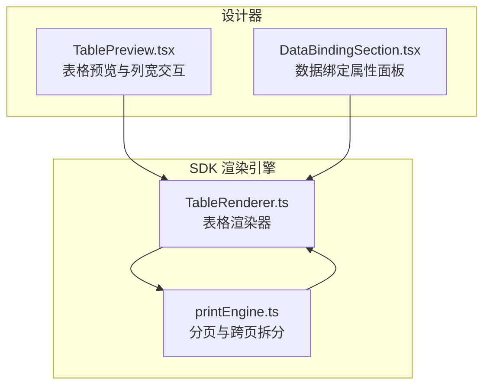
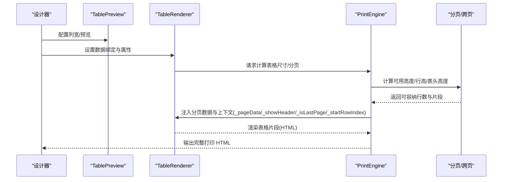
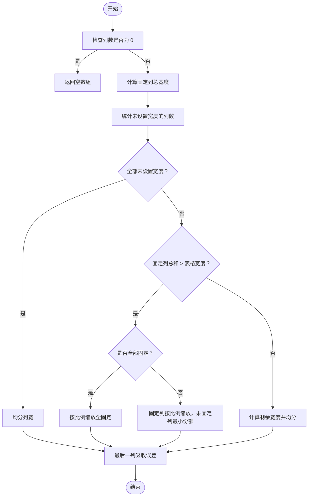
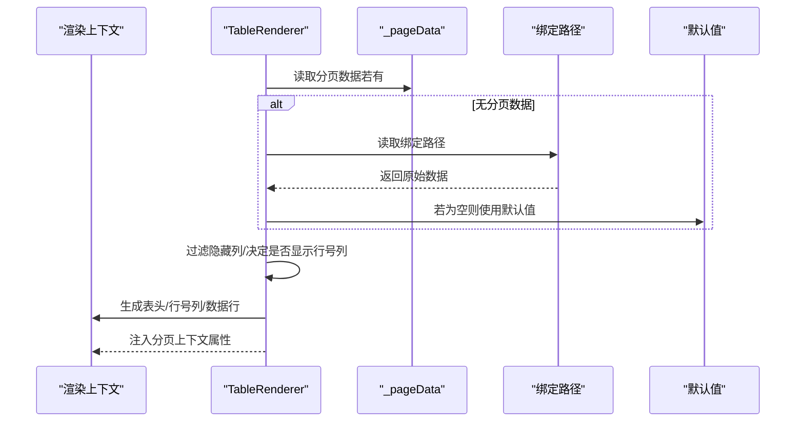
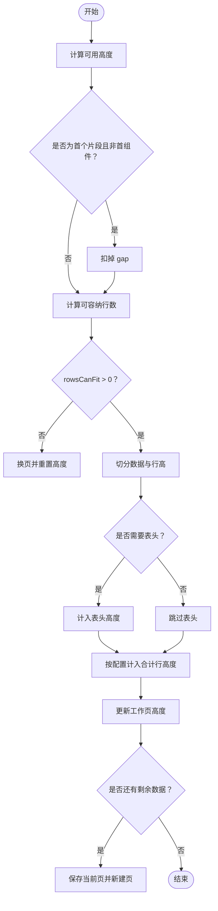
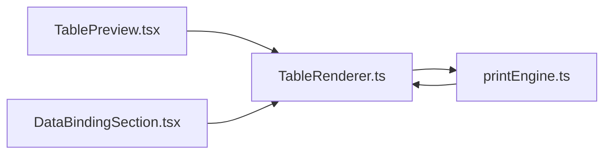

# 表格组件

<cite>
**本文引用的文件**
- [TableRenderer.ts](file://sdk/src/printEngine/renderers/TableRenderer.ts)
- [printEngine.ts](file://sdk/src/printEngine.ts)
- [TablePreview.tsx](file://designer/src/pages/Designer/components/Canvas/componentRenderers/TablePreview.tsx)
- [DataBindingSection.tsx](file://designer/src/pages/Designer/components/PropertyPanel/DataBindingSection.tsx)
- [技术架构文档(仅参考).md](file://docs/技术架构文档(仅参考).md)
</cite>

## 目录
1. [简介](#简介)
2. [项目结构](#项目结构)
3. [核心组件](#核心组件)
4. [架构概览](#架构概览)
5. [详细组件分析](#详细组件分析)
6. [依赖分析](#依赖分析)
7. [性能考量](#性能考量)
8. [故障排查指南](#故障排查指南)
9. [结论](#结论)
10. [附录](#附录)

## 简介
本技术文档围绕表格组件展开，系统阐述其复杂属性配置（行列数、单元格样式、边框控制、表头配置）、数据绑定机制（二维数组与复杂结构）、布局算法与列宽计算、自动换行与跨页处理、打印适配策略，并给出多种典型使用场景与性能优化建议。文档内容基于代码库中的渲染器实现、分页与跨页拆分逻辑以及设计器侧的预览与属性面板。

## 项目结构
表格组件涉及两个层面：
- 设计器端（前端）：提供表格预览、列宽调整交互、属性面板配置（含数据绑定）。
- SDK 端（渲染引擎）：负责表格列宽计算、跨页拆分、HTML 输出与打印样式生成。

**图示来源**
- [TablePreview.tsx:1-34](file://designer/src/pages/Designer/components/Canvas/componentRenderers/TablePreview.tsx#L1-L34)
- [DataBindingSection.tsx:45-71](file://designer/src/pages/Designer/components/PropertyPanel/DataBindingSection.tsx#L45-L71)
- [TableRenderer.ts:42-148](file://sdk/src/printEngine/renderers/TableRenderer.ts#L42-L148)
- [printEngine.ts:418-998](file://sdk/src/printEngine.ts#L418-L998)

**章节来源**
- [TablePreview.tsx:1-34](file://designer/src/pages/Designer/components/Canvas/componentRenderers/TablePreview.tsx#L1-L34)
- [DataBindingSection.tsx:45-71](file://designer/src/pages/Designer/components/PropertyPanel/DataBindingSection.tsx#L45-L71)
- [TableRenderer.ts:42-148](file://sdk/src/printEngine/renderers/TableRenderer.ts#L42-L148)
- [printEngine.ts:418-998](file://sdk/src/printEngine.ts#L418-L998)

## 核心组件
- 表格渲染器（TableRenderer）：负责列宽计算、表头与行数据渲染、边框与样式应用、跨页片段属性注入。
- 打印引擎（PrintEngine）：负责整体分页、表格跨页拆分（基于相对间距）、测量与回退策略、合计行处理、最终 HTML 生成。
- 设计器预览（TablePreview）：提供列宽拖拽、预览表格在页面中的表现。
- 数据绑定面板（DataBindingSection）：提供绑定路径与默认值配置入口。

**章节来源**
- [TableRenderer.ts:147-198](file://sdk/src/printEngine/renderers/TableRenderer.ts#L147-L198)
- [printEngine.ts:418-998](file://sdk/src/printEngine.ts#L418-L998)
- [TablePreview.tsx:1-34](file://designer/src/pages/Designer/components/Canvas/componentRenderers/TablePreview.tsx#L1-L34)
- [DataBindingSection.tsx:45-71](file://designer/src/pages/Designer/components/PropertyPanel/DataBindingSection.tsx#L45-L71)

## 架构概览
表格组件的运行链路如下：
- 设计器侧通过属性面板配置数据绑定路径与默认值；通过 TablePreview 预览列宽与布局。
- 渲染引擎在生成打印 HTML 时，先进行分页计算，遇到表格组件时调用 TableRenderer 渲染，并在必要时进行跨页拆分，将表格切分为多个片段，每个片段包含必要的上下文（如是否显示表头、是否为最后一页、起始行索引等）。
- TableRenderer 在渲染时优先使用分页片段传入的分页数据，同时根据 props 控制表头、边框、行号列等。

**图示来源**
- [TableRenderer.ts:147-198](file://sdk/src/printEngine/renderers/TableRenderer.ts#L147-L198)
- [printEngine.ts:418-998](file://sdk/src/printEngine.ts#L418-L998)

## 详细组件分析

### 表格列宽计算与布局算法
- 列宽计算规则：
  - 全部未设置宽度：各列均分。
  - 部分设置宽度：固定列按 width 分配，未设置列均分剩余空间。
  - 固定列总和超过表格宽度：
    - 全固定：按比例缩放。
    - 部分固定：固定列按比例缩放，未固定列分配最小份额。
  - 最后一列吸收舍入误差，确保百分比总和为 100%。
- 最大列宽计算：排除目标列以外的固定宽度与预留宽度，得到该列最大可用宽度。
- 表格宽度约束：若组件设置了 widthMm，需检查右侧边界是否超出页面可绘制区域，必要时进行裁剪。

**图示来源**
- [TableRenderer.ts:51-125](file://sdk/src/printEngine/renderers/TableRenderer.ts#L51-L125)

**章节来源**
- [TableRenderer.ts:42-148](file://sdk/src/printEngine/renderers/TableRenderer.ts#L42-L148)

### 表格数据绑定与渲染流程
- 数据来源优先级：
  - 若 props 中存在 _pageData，则使用分页片段数据（用于跨页渲染）。
  - 否则使用绑定路径从上下文中取值，若为空则使用 fallback。
- 表头与可见列：
  - 通过 props.columns 过滤 hidden 的列。
  - 可选显示行号列（dataIndex 为特殊标识），支持自定义标签与宽度。
- 边框与表头控制：
  - bordered 默认开启；showHeader 可显式关闭。
  - _showHeader 由分页逻辑显式传入，优先级高于 props.showHeader。
- 渲染输出：
  - 渲染表头、行号列（如有）、数据行。
  - 将分页上下文（_pageData、_showHeader、_isLastPage、_totalData、_startRowIndex）写入 props，便于模板内使用。

**图示来源**
- [TableRenderer.ts:150-198](file://sdk/src/printEngine/renderers/TableRenderer.ts#L150-L198)

**章节来源**
- [TableRenderer.ts:147-198](file://sdk/src/printEngine/renderers/TableRenderer.ts#L147-L198)

### 表格跨页拆分与打印适配
- 分页策略（基于相对间距）：
  - 计算每页可用高度（contentBottom - workingPageHeight），考虑首个片段是否需要扣除 gap。
  - 依据表头高度、行高与合计行高度，估算可容纳行数。
  - 防御性检查：若 rowsCanFit 异常小，使用估算行高回退。
  - 为每个片段创建独立的 ComponentNode，注入 _pageData、_showHeader、_isLastPage、_totalData、_startRowIndex。
- 表头重复策略：
  - repeatHeader 默认开启；若关闭且为首个片段，后续页不再重复表头。
- 合计行处理：
  - 根据配置在“页合计”或“总计”时显示合计行高度。
- 连续纸模式：
  - 不分页，单页渲染，适合连续纸张打印。

**图示来源**
- [printEngine.ts:762-998](file://sdk/src/printEngine.ts#L762-L998)
- [技术架构文档(仅参考).md](file://docs/技术架构文档(仅参考).md#L335-L413)

**章节来源**
- [printEngine.ts:418-998](file://sdk/src/printEngine.ts#L418-L998)
- [技术架构文档(仅参考).md](file://docs/技术架构文档(仅参考).md#L335-L413)

### 设计器侧预览与列宽交互
- 列宽拖拽：
  - 提供列索引、起始鼠标位置、原始宽度与最大宽度，计算当前列宽变化并回调。
  - 结合缩放级别与页面宽度，动态计算最大宽度与当前宽度。
- 预览与页面宽度：
  - 使用页面宽度工具与缩放转换函数，保证预览与实际打印一致。

**章节来源**
- [TablePreview.tsx:1-34](file://designer/src/pages/Designer/components/Canvas/componentRenderers/TablePreview.tsx#L1-L34)

### 数据绑定配置
- 绑定路径：支持 JSON 路径表达式，如 user.name、items.0.title。
- 默认值（Fallback）：当数据为空、null 或 undefined 时的占位显示。
- 与渲染器配合：渲染器优先使用分页数据，其次使用绑定路径取值，再其次使用默认值。

**章节来源**
- [DataBindingSection.tsx:45-71](file://designer/src/pages/Designer/components/PropertyPanel/DataBindingSection.tsx#L45-L71)
- [TableRenderer.ts:154-162](file://sdk/src/printEngine/renderers/TableRenderer.ts#L154-L162)

## 依赖分析
- TableRenderer 依赖：
  - 列宽计算函数（computeColWidths、computeColumnMaxWidth）。
  - 渲染上下文（RenderContext），用于读取绑定数据与页面信息。
- PrintEngine 依赖：
  - 表格渲染器（TableRenderer）进行具体渲染。
  - 页面尺寸与页边距信息，用于计算可用高度与表格宽度约束。
- 设计器预览依赖：
  - 列宽计算工具与页面宽度工具，用于预览与交互。

**图示来源**
- [TablePreview.tsx:1-34](file://designer/src/pages/Designer/components/Canvas/componentRenderers/TablePreview.tsx#L1-L34)
- [DataBindingSection.tsx:45-71](file://designer/src/pages/Designer/components/PropertyPanel/DataBindingSection.tsx#L45-L71)
- [TableRenderer.ts:42-148](file://sdk/src/printEngine/renderers/TableRenderer.ts#L42-L148)
- [printEngine.ts:418-998](file://sdk/src/printEngine.ts#L418-L998)

**章节来源**
- [TableRenderer.ts:42-148](file://sdk/src/printEngine/renderers/TableRenderer.ts#L42-L148)
- [printEngine.ts:418-998](file://sdk/src/printEngine.ts#L418-L998)
- [TablePreview.tsx:1-34](file://designer/src/pages/Designer/components/Canvas/componentRenderers/TablePreview.tsx#L1-L34)
- [DataBindingSection.tsx:45-71](file://designer/src/pages/Designer/components/PropertyPanel/DataBindingSection.tsx#L45-L71)

## 性能考量
- 虚拟滚动（建议方案）：
  - 对于超大数据集，可在渲染器外部引入虚拟滚动策略，仅渲染可视窗口内的行，减少 DOM 节点数量与重排开销。
- 分页渲染：
  - 利用分页数据（_pageData）进行分段渲染，避免一次性渲染过多行导致内存与渲染压力。
- 列宽计算优化：
  - 避免频繁重算：缓存列宽百分比与最大宽度，仅在列宽变更或页面尺寸变化时更新。
- 合计行高度估计：
  - 在无法精确测量时使用估算行高，减少测量失败带来的阻塞与回退成本。
- 连续纸模式：
  - 连续纸不分页，适合长条幅打印，避免跨页拆分的额外开销。

[本节为通用性能建议，无需特定文件引用]

## 故障排查指南
- 表格测量结果异常：
  - 现象：rowHeights 长度与数据长度不一致，可能因所有列均被隐藏。
  - 处理：回退到估算行高继续分页，确保不会中断打印流程。
- rowsCanFit 异常小：
  - 现象：可用高度不足或行高过大导致可容纳行数极小。
  - 处理：触发防御性检查，使用估算行高重新计算，避免死循环。
- 表头重复与跨页：
  - 现象：关闭 repeatHeader 后，后续页不显示表头。
  - 处理：确认分页逻辑中对 _showHeader 的传递是否正确。
- 表格溢出页面：
  - 现象：设置的宽度导致右侧越界。
  - 处理：在渲染前检查最大右侧边缘，必要时裁剪表格宽度。

**章节来源**
- [printEngine.ts:805-814](file://sdk/src/printEngine.ts#L805-L814)
- [printEngine.ts:862-872](file://sdk/src/printEngine.ts#L862-L872)
- [printEngine.ts:772-773](file://sdk/src/printEngine.ts#L772-L773)
- [TableRenderer.ts:191-198](file://sdk/src/printEngine/renderers/TableRenderer.ts#L191-L198)

## 结论
表格组件在设计与实现上兼顾了灵活性与稳定性：通过清晰的属性体系与数据绑定机制，支持多样化的表格形态；借助严谨的列宽计算与跨页拆分策略，确保在不同页面尺寸与打印介质下的稳定输出。结合虚拟滚动与分页渲染等优化手段，可在大数据量场景下保持良好的性能与用户体验。

## 附录
- 典型使用场景示例（概念性说明）：
  - 数据报表：使用二维数组数据，配置表头与列宽，启用合计行，按页展示。
  - 清单表格：启用行号列，控制边框与对齐，使用默认值处理缺失字段。
  - 统计图表：将统计结果映射为表格，结合分页与重复表头提升可读性。
- 打印适配要点：
  - 在连续纸模式下禁用分页，确保长表格一次性输出。
  - 根据纸张尺寸与页边距动态计算表格宽度，避免溢出。
  - 合理设置行高与表头高度，预留足够的空间给合计行与页码。

[本节为概念性内容，无需特定文件引用]