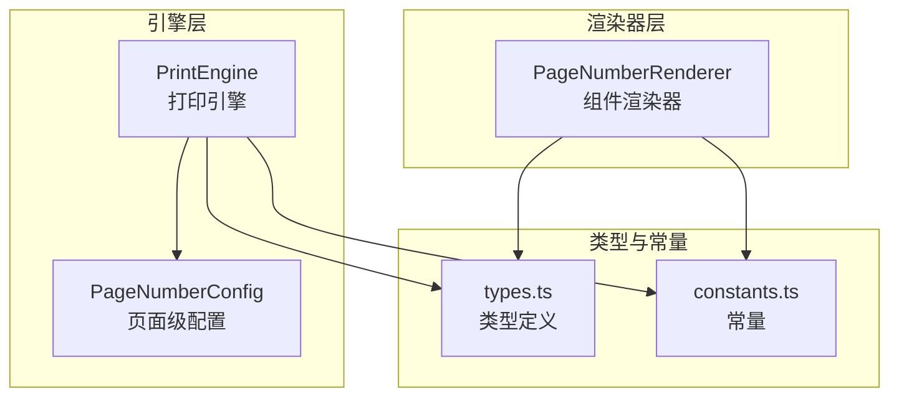
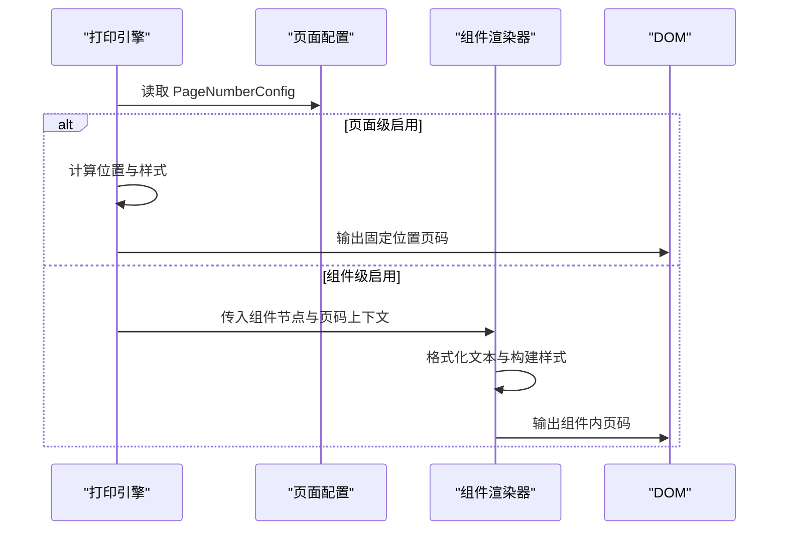

# 页码组件

<cite>
**本文引用的文件**
- [PageNumberRenderer.ts](file://sdk/src/printEngine/renderers/PageNumberRenderer.ts)
- [printEngine.ts](file://sdk/src/printEngine.ts)
- [types.ts](file://sdk/src/types.ts)
- [constants.ts](file://sdk/src/printEngine/constants.ts)
- [templates.ts](file://designer/src/services/mock/templates.ts)
</cite>

## 目录
1. [简介](#简介)
2. [项目结构](#项目结构)
3. [核心组件](#核心组件)
4. [架构概览](#架构概览)
5. [详细组件分析](#详细组件分析)
6. [依赖分析](#依赖分析)
7. [性能考虑](#性能考虑)
8. [故障排查指南](#故障排查指南)
9. [结论](#结论)
10. [附录](#附录)

## 简介
本技术文档聚焦于“页码组件”，系统性阐述其特殊属性与功能，包括页码格式、起始页设置、总页数计算、自动编号机制、数据绑定与动态更新逻辑，并结合多页文档场景给出使用建议与最佳实践。同时，文档涵盖页码组件的格式化选项、自定义样式支持，以及与其他组件的配合使用与布局注意事项。

## 项目结构
页码组件涉及两个层面：
- 渲染器层：负责将组件节点渲染为最终 HTML 片段，处理组件级的定位、样式与文本格式化。
- 引擎层：负责页面级的页码配置解析、位置计算与整体输出拼接。



图表来源
- [PageNumberRenderer.ts:14-105](file://sdk/src/printEngine/renderers/PageNumberRenderer.ts#L14-L105)
- [printEngine.ts:283-374](file://sdk/src/printEngine.ts#L283-L374)
- [types.ts:30-46](file://sdk/src/types.ts#L30-L46)
- [constants.ts:13-78](file://sdk/src/printEngine/constants.ts#L13-L78)

章节来源
- [PageNumberRenderer.ts:14-105](file://sdk/src/printEngine/renderers/PageNumberRenderer.ts#L14-L105)
- [printEngine.ts:283-374](file://sdk/src/printEngine.ts#L283-L374)
- [types.ts:30-46](file://sdk/src/types.ts#L30-L46)
- [constants.ts:13-78](file://sdk/src/printEngine/constants.ts#L13-L78)

## 核心组件
- 组件类型标识：pageNumber
- 组件属性（props）：支持格式、对齐、前后缀、分隔符，以及由引擎注入的当前页与总页数。
- 页面级配置（PageNumberConfig）：控制是否启用、位置、格式、偏移、样式等。

关键点
- 组件级属性用于“组件内”文本格式化与对齐；页面级配置用于“页面全局”位置与外观。
- 当前页与总页数由打印引擎在渲染时注入，确保多页文档的自动编号。

章节来源
- [PageNumberRenderer.ts:14-105](file://sdk/src/printEngine/renderers/PageNumberRenderer.ts#L14-L105)
- [types.ts:120-129](file://sdk/src/types.ts#L120-L129)
- [types.ts:30-46](file://sdk/src/types.ts#L30-L46)

## 架构概览
页码组件在两种场景下工作：
- 组件级渲染：组件节点被放置在页面内容中，通过组件渲染器进行定位与样式应用。
- 页面级渲染：在页面配置启用的情况下，引擎在固定位置渲染统一的页码。



图表来源
- [printEngine.ts:283-374](file://sdk/src/printEngine.ts#L283-L374)
- [PageNumberRenderer.ts:17-57](file://sdk/src/printEngine/renderers/PageNumberRenderer.ts#L17-L57)

## 详细组件分析

### 组件属性与格式化
- 支持的格式：
  - simple：纯数字序列
  - text：中文描述形式
  - slash：分隔符连接
- 可选前缀/后缀与分隔符，便于国际化与品牌化展示。
- 对齐方式：left/center/right，影响容器的 flex 对齐。

章节来源
- [PageNumberRenderer.ts:66-94](file://sdk/src/printEngine/renderers/PageNumberRenderer.ts#L66-L94)
- [types.ts:120-129](file://sdk/src/types.ts#L120-L129)

### 页面级配置与自动编号
- 页面级配置决定页码是否显示、位置、格式、偏移与样式。
- 自动编号由引擎在渲染时注入当前页与总页数，无需手动维护。
- 引擎根据页面尺寸与页边距计算绝对定位坐标，并应用字号、颜色、字重等样式。

章节来源
- [types.ts:30-46](file://sdk/src/types.ts#L30-L46)
- [printEngine.ts:283-374](file://sdk/src/printEngine.ts#L283-L374)

### 渲染流程与样式构建
- 组件级渲染：
  - 读取布局与样式，计算位置样式。
  - 根据格式化规则生成文本。
  - 构建内联样式字符串并输出容器元素。
- 页面级渲染：
  - 读取页面配置，计算绝对定位坐标。
  - 生成固定位置的容器元素，应用对齐与样式。

章节来源
- [PageNumberRenderer.ts:17-57](file://sdk/src/printEngine/renderers/PageNumberRenderer.ts#L17-L57)
- [printEngine.ts:283-374](file://sdk/src/printEngine.ts#L283-L374)
- [constants.ts:13-78](file://sdk/src/printEngine/constants.ts#L13-L78)

### 数据绑定与动态更新
- 组件级：当前页与总页数由引擎注入，组件自身不直接参与数据绑定。
- 页面级：页码文本由配置与引擎计算生成，无需外部数据绑定。
- 若需动态文案（如前缀/后缀），可通过页面级配置或外部模板参数传入。

章节来源
- [PageNumberRenderer.ts:21-23](file://sdk/src/printEngine/renderers/PageNumberRenderer.ts#L21-L23)
- [printEngine.ts:286-311](file://sdk/src/printEngine.ts#L286-L311)

### 多页文档中的自动编号机制
- 引擎在分页过程中维护当前页码与总页数，分别传递给页面级与组件级渲染。
- 页面级渲染在每页固定位置输出对应页码；组件级渲染在各自容器内输出对应页码。
- 保证跨页一致性与可读性。

章节来源
- [printEngine.ts:286-311](file://sdk/src/printEngine.ts#L286-L311)
- [PageNumberRenderer.ts:21-23](file://sdk/src/printEngine/renderers/PageNumberRenderer.ts#L21-L23)

### 使用场景与布局建议
- 报告页眉/页脚：使用页面级配置，选择顶部或底部居中/靠右等位置，避免遮挡重要信息。
- 目录页码：可在目录组件中使用组件级页码，配合对齐与样式突出显示。
- 封面页码：通常不建议在封面显示页码；若需要，可使用页面级配置并调整偏移避免与标题冲突。
- 多栏/复杂布局：优先使用页面级统一页码，减少组件级重复与定位复杂度。

章节来源
- [types.ts:30-46](file://sdk/src/types.ts#L30-L46)
- [printEngine.ts:313-374](file://sdk/src/printEngine.ts#L313-L374)

### 格式化选项与自定义样式
- 格式化选项：format、prefix、suffix、separator、align。
- 样式支持：字号、颜色、字重、字体族、行高、文本对齐等。
- 页面级样式：通过 PageNumberConfig.style 控制字号、颜色、字重。

章节来源
- [PageNumberRenderer.ts:39-52](file://sdk/src/printEngine/renderers/PageNumberRenderer.ts#L39-L52)
- [types.ts:30-46](file://sdk/src/types.ts#L30-L46)

### 与其他组件的配合与布局考虑
- 与页眉/页脚协作：页面级页码与 header/footer 区域共存时，注意页眉/页脚高度对可用空间的影响。
- 与表格协作：表格跨页时，页面级页码仍按页面输出，组件级页码随组件所在页输出。
- 与容器/绝对定位组件协作：组件级页码遵循组件布局，注意与周边元素的间距与层级关系。

章节来源
- [printEngine.ts:418-479](file://sdk/src/printEngine.ts#L418-L479)
- [types.ts:48-70](file://sdk/src/types.ts#L48-L70)

## 依赖分析
- PageNumberRenderer 依赖：
  - 类型定义：ComponentNode、PageNumberProps、ComponentRenderer、RenderContext、StyleObject
  - 常量：COMPONENT_DEFAULT_SIZE、STYLE_DEFAULT
  - 工具：样式构建函数
- PrintEngine 依赖：
  - 类型定义：PageNumberConfig、PageConfig
  - 常量：MM_TO_PX
  - 工具：HTML 转义、尺寸计算

```mermaid
classDiagram
class PageNumberRenderer {
+type : string
+render(component, context) string
+calculateHeight(component) number
-formatPageNumber(currentPage, totalPages, props) string
-escapeHtml(text) string
}
class PrintEngine {
-renderPageNumber(pageNumber, totalPages) string
-escapeHtml(text) string
}
class PageNumberConfig {
+enabled : boolean
+position : string
+format : string
+prefix : string
+suffix : string
+separator : string
+offsetX : number
+offsetY : number
+style : object
}
PageNumberRenderer --> PageNumberConfig : "不直接依赖"
PrintEngine --> PageNumberConfig : "读取配置"
PageNumberRenderer --> "类型定义" : "使用"
PrintEngine --> "类型定义" : "使用"
```

图表来源
- [PageNumberRenderer.ts:14-105](file://sdk/src/printEngine/renderers/PageNumberRenderer.ts#L14-L105)
- [printEngine.ts:283-374](file://sdk/src/printEngine.ts#L283-L374)
- [types.ts:30-46](file://sdk/src/types.ts#L30-L46)

章节来源
- [PageNumberRenderer.ts:14-105](file://sdk/src/printEngine/renderers/PageNumberRenderer.ts#L14-L105)
- [printEngine.ts:283-374](file://sdk/src/printEngine.ts#L283-L374)
- [types.ts:30-46](file://sdk/src/types.ts#L30-L46)

## 性能考虑
- 页面级页码：一次性计算位置与样式，适合全局统一页码，渲染成本低。
- 组件级页码：每个组件独立渲染，适合局部强调，但需避免过多组件导致 DOM 节点膨胀。
- 建议：
  - 大文档优先使用页面级统一页码。
  - 控制页码数量与复杂度，避免过度嵌套与重复渲染。

## 故障排查指南
- 页码未显示
  - 检查页面级配置是否启用，当前页与总页数是否正确传入。
  - 章节来源
    - [printEngine.ts:290-293](file://sdk/src/printEngine.ts#L290-L293)
- 位置异常
  - 检查页边距、偏移量与页面尺寸；确认 position 与 offsetX/offsetY 的组合。
  - 章节来源
    - [printEngine.ts:313-362](file://sdk/src/printEngine.ts#L313-L362)
- 文本格式错误
  - 检查 format、prefix/suffix、separator 设置；确认组件级与页面级配置未冲突。
  - 章节来源
    - [PageNumberRenderer.ts:66-94](file://sdk/src/printEngine/renderers/PageNumberRenderer.ts#L66-L94)
    - [printEngine.ts:297-311](file://sdk/src/printEngine.ts#L297-L311)
- 样式不生效
  - 检查字号、颜色、字重等是否被覆盖；确认容器样式与对齐设置。
  - 章节来源
    - [PageNumberRenderer.ts:39-52](file://sdk/src/printEngine/renderers/PageNumberRenderer.ts#L39-L52)
    - [constants.ts:63-78](file://sdk/src/printEngine/constants.ts#L63-L78)

## 结论
页码组件通过“组件级渲染器 + 页面级引擎”的双层设计，既满足灵活的局部页码需求，又提供统一的全局页码能力。其清晰的格式化选项与样式支持，使其适用于报告、目录、封面等多种场景。在多页文档中，引擎自动维护页码上下文，确保一致性与可维护性。

## 附录
- 设计器模板中的页码配置示例（用于参考）
  - 章节来源
    - [templates.ts:1298](file://designer/src/services/mock/templates.ts#L1298)