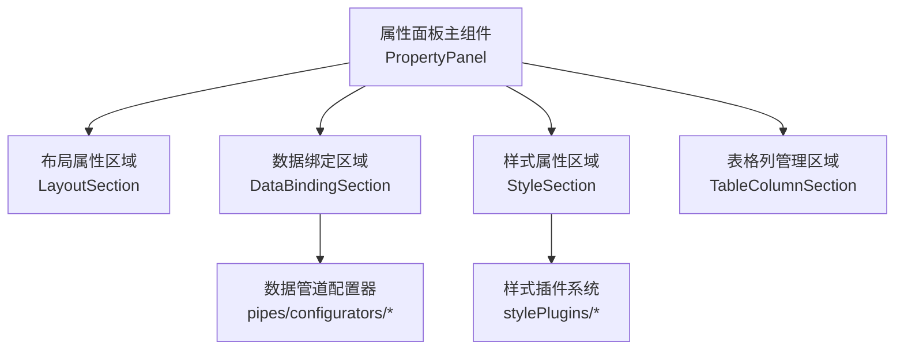
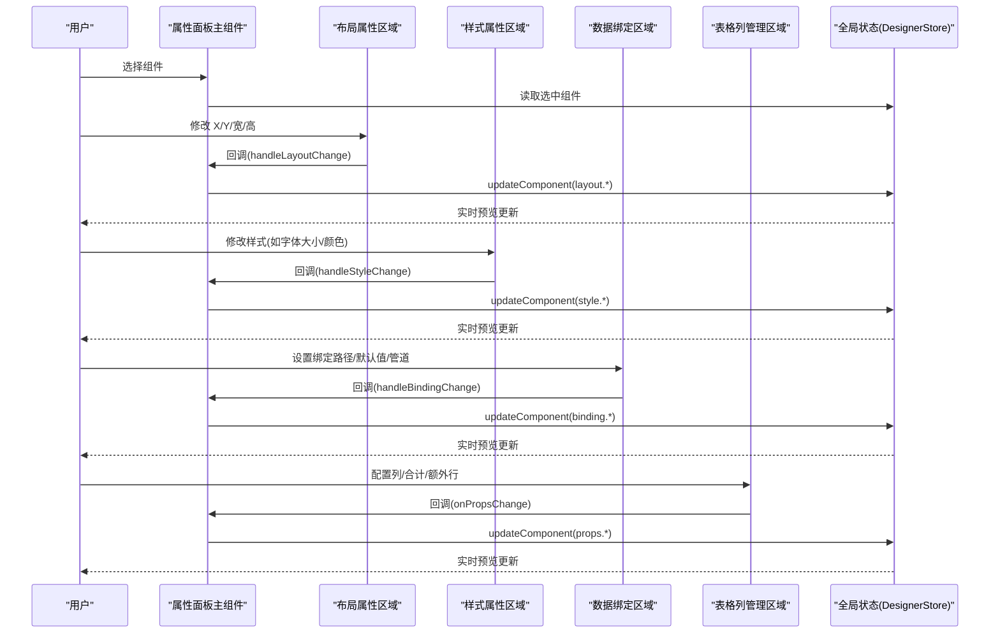
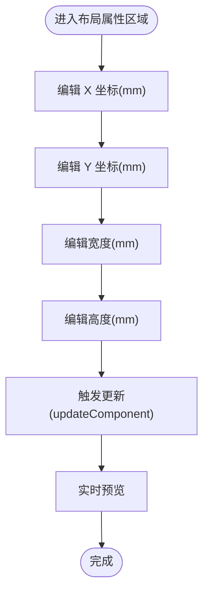
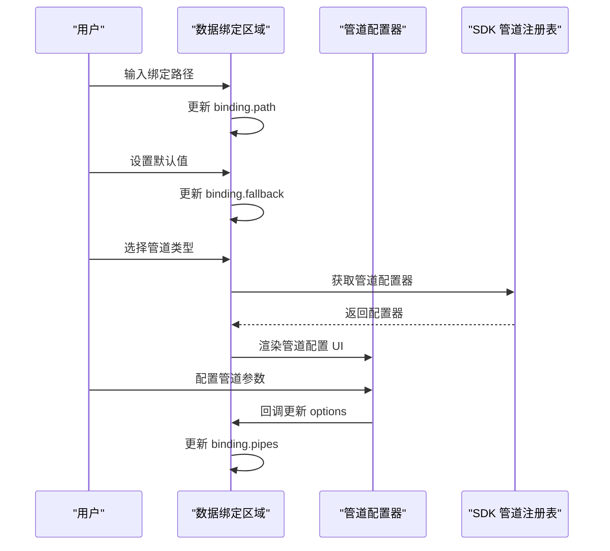
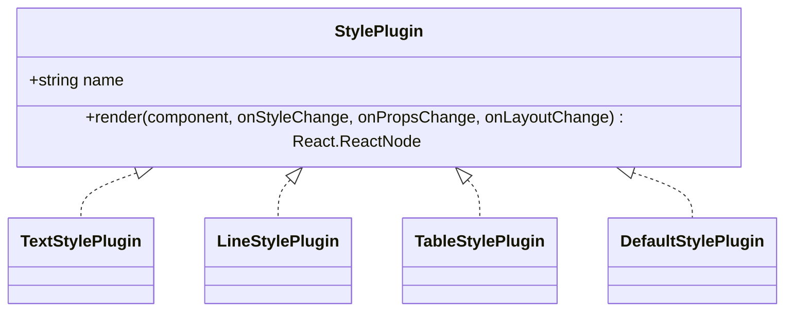
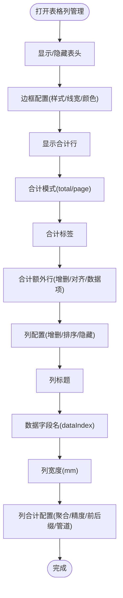
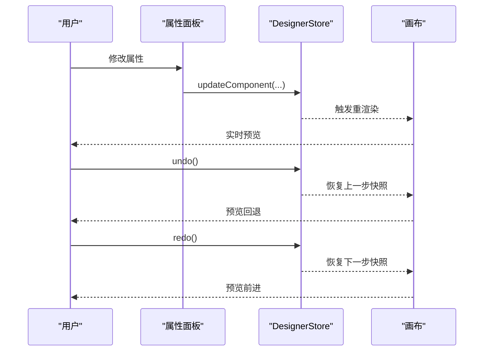
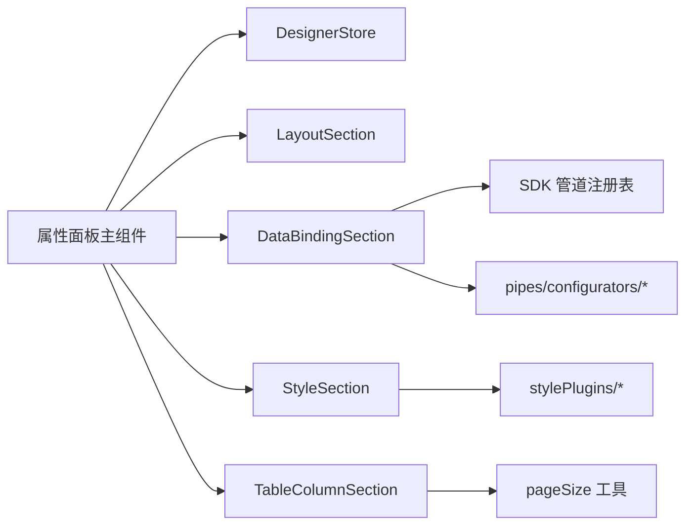

# 属性配置面板

<cite>
**本文档引用的文件**
- [designer/src/pages/Designer/components/PropertyPanel/index.tsx](file://designer/src/pages/Designer/components/PropertyPanel/index.tsx)
- [designer/src/pages/Designer/components/PropertyPanel/LayoutSection.tsx](file://designer/src/pages/Designer/components/PropertyPanel/LayoutSection.tsx)
- [designer/src/pages/Designer/components/PropertyPanel/StyleSection.tsx](file://designer/src/pages/Designer/components/PropertyPanel/StyleSection.tsx)
- [designer/src/pages/Designer/components/PropertyPanel/DataBindingSection.tsx](file://designer/src/pages/Designer/components/PropertyPanel/DataBindingSection.tsx)
- [designer/src/pages/Designer/components/PropertyPanel/TableColumnSection.tsx](file://designer/src/pages/Designer/components/PropertyPanel/TableColumnSection.tsx)
- [designer/src/pages/Designer/components/PropertyPanel/stylePlugins/index.ts](file://designer/src/pages/Designer/components/PropertyPanel/stylePlugins/index.ts)
- [designer/src/pages/Designer/components/PropertyPanel/stylePlugins/types.ts](file://designer/src/pages/Designer/components/PropertyPanel/stylePlugins/types.ts)
- [designer/src/pages/Designer/components/PropertyPanel/stylePlugins/DefaultStylePlugin.tsx](file://designer/src/pages/Designer/components/PropertyPanel/stylePlugins/DefaultStylePlugin.tsx)
- [designer/src/pages/Designer/components/PropertyPanel/stylePlugins/TextStylePlugin.tsx](file://designer/src/pages/Designer/components/PropertyPanel/stylePlugins/TextStylePlugin.tsx)
- [designer/src/pages/Designer/components/PropertyPanel/stylePlugins/LineStylePlugin.tsx](file://designer/src/pages/Designer/components/PropertyPanel/stylePlugins/LineStylePlugin.tsx)
- [designer/src/pages/Designer/components/PropertyPanel/stylePlugins/TableStylePlugin.tsx](file://designer/src/pages/Designer/components/PropertyPanel/stylePlugins/TableStylePlugin.tsx)
- [designer/src/store/designer.ts](file://designer/src/store/designer.ts)
- [designer/src/types/index.ts](file://designer/src/types/index.ts)
- [designer/src/pipes/configurators/CurrencyPipeConfigurator.tsx](file://designer/src/pipes/configurators/CurrencyPipeConfigurator.tsx)
- [designer/src/pipes/configurators/ChineseNumberPipeConfigurator.tsx](file://designer/src/pipes/configurators/ChineseNumberPipeConfigurator.tsx)
</cite>

## 目录
1. [简介](#简介)
2. [项目结构](#项目结构)
3. [核心组件](#核心组件)
4. [架构总览](#架构总览)
5. [详细组件分析](#详细组件分析)
6. [依赖分析](#依赖分析)
7. [性能考虑](#性能考虑)
8. [故障排查指南](#故障排查指南)
9. [结论](#结论)
10. [附录](#附录)

## 简介
本指南面向设计师与开发者，系统讲解“属性配置面板”的使用方法与内部机制。内容涵盖：
- 标签页结构与切换：组件树、属性配置
- 布局配置：位置坐标、尺寸大小、对齐方式、边距内边距
- 样式配置：颜色、字体、边框、背景、阴影等
- 数据绑定：Schema 字段选择、数据管道配置、动态数据绑定
- 表格组件：列配置、行配置、合计与额外行
- 样式插件系统：按组件类型定制的样式配置
- 实时预览与撤销/重做：如何即时看到效果与回溯操作
- 示例：常见组件类型的属性配置要点

## 项目结构
属性面板位于设计器页面的右侧，由主面板与若干子区域组成，采用“插件化 + 区域化”的组织方式：
- 主面板负责装配布局、样式、数据绑定、表格列等区域
- 各区域通过统一的变更回调更新组件状态
- 样式区域通过插件系统按组件类型渲染不同的配置项
- 表格列区域提供列增删改、合计与额外行等高级配置

图表来源
- [designer/src/pages/Designer/components/PropertyPanel/index.tsx:17-149](file://designer/src/pages/Designer/components/PropertyPanel/index.tsx#L17-L149)
- [designer/src/pages/Designer/components/PropertyPanel/LayoutSection.tsx:17-73](file://designer/src/pages/Designer/components/PropertyPanel/LayoutSection.tsx#L17-L73)
- [designer/src/pages/Designer/components/PropertyPanel/StyleSection.tsx:17-33](file://designer/src/pages/Designer/components/PropertyPanel/StyleSection.tsx#L17-L33)
- [designer/src/pages/Designer/components/PropertyPanel/DataBindingSection.tsx:20-125](file://designer/src/pages/Designer/components/PropertyPanel/DataBindingSection.tsx#L20-L125)
- [designer/src/pages/Designer/components/PropertyPanel/TableColumnSection.tsx:22-170](file://designer/src/pages/Designer/components/PropertyPanel/TableColumnSection.tsx#L22-L170)

章节来源
- [designer/src/pages/Designer/components/PropertyPanel/index.tsx:17-149](file://designer/src/pages/Designer/components/PropertyPanel/index.tsx#L17-L149)

## 核心组件
- 属性面板主组件：负责装配各子区域、读取当前选中组件、分发变更回调
- 布局属性区域：提供 X/Y 坐标与宽高配置
- 数据绑定区域：绑定路径、默认值、数据管道链
- 样式属性区域：插件化渲染，按组件类型显示不同样式配置
- 表格列管理区域：列增删改、合计、额外行、边框样式等

章节来源
- [designer/src/pages/Designer/components/PropertyPanel/index.tsx:17-149](file://designer/src/pages/Designer/components/PropertyPanel/index.tsx#L17-L149)
- [designer/src/pages/Designer/components/PropertyPanel/LayoutSection.tsx:17-73](file://designer/src/pages/Designer/components/PropertyPanel/LayoutSection.tsx#L17-L73)
- [designer/src/pages/Designer/components/PropertyPanel/StyleSection.tsx:17-33](file://designer/src/pages/Designer/components/PropertyPanel/StyleSection.tsx#L17-L33)
- [designer/src/pages/Designer/components/PropertyPanel/DataBindingSection.tsx:20-125](file://designer/src/pages/Designer/components/PropertyPanel/DataBindingSection.tsx#L20-L125)
- [designer/src/pages/Designer/components/PropertyPanel/TableColumnSection.tsx:22-170](file://designer/src/pages/Designer/components/PropertyPanel/TableColumnSection.tsx#L22-L170)

## 架构总览
属性面板采用“主面板 + 区域组件 + 插件系统”的分层架构：
- 主面板从全局状态中读取选中组件，并将变更回调传递给各区域
- 区域组件各自维护 UI 与交互，调用统一的更新函数
- 样式插件系统按组件类型动态渲染样式配置
- 数据绑定区域通过管道配置器渲染具体管道的配置 UI

图表来源
- [designer/src/pages/Designer/components/PropertyPanel/index.tsx:39-79](file://designer/src/pages/Designer/components/PropertyPanel/index.tsx#L39-L79)
- [designer/src/store/designer.ts:126-137](file://designer/src/store/designer.ts#L126-L137)

## 详细组件分析

### 布局属性区域（位置、尺寸、对齐）
- 功能：提供组件的 X/Y 坐标与宽高配置，支持拖拽与数值输入
- 输入精度：保留一位小数，步进 0.5
- 适用场景：绝对定位布局下的组件精确定位与尺寸调整
- 注意事项：坐标与尺寸均以毫米为单位；与网格吸附联动（由全局状态控制）

图表来源
- [designer/src/pages/Designer/components/PropertyPanel/LayoutSection.tsx:26-68](file://designer/src/pages/Designer/components/PropertyPanel/LayoutSection.tsx#L26-L68)
- [designer/src/pages/Designer/components/PropertyPanel/index.tsx:39-47](file://designer/src/pages/Designer/components/PropertyPanel/index.tsx#L39-L47)

章节来源
- [designer/src/pages/Designer/components/PropertyPanel/LayoutSection.tsx:17-73](file://designer/src/pages/Designer/components/PropertyPanel/LayoutSection.tsx#L17-L73)
- [designer/src/pages/Designer/components/PropertyPanel/index.tsx:39-47](file://designer/src/pages/Designer/components/PropertyPanel/index.tsx#L39-L47)

### 数据绑定区域（Schema 字段、管道、动态绑定）
- 绑定路径：支持点号路径，如 user.name、items.0.title
- 默认值：当数据为空、null 或 undefined 时的回退显示
- 管道链：按顺序执行，支持添加/删除/配置管道参数
- 管道配置器：通过统一注册表按类型渲染配置 UI（如货币符号、中文大写模式等）

图表来源
- [designer/src/pages/Designer/components/PropertyPanel/DataBindingSection.tsx:20-125](file://designer/src/pages/Designer/components/PropertyPanel/DataBindingSection.tsx#L20-L125)
- [designer/src/pipes/configurators/CurrencyPipeConfigurator.tsx:9-22](file://designer/src/pipes/configurators/CurrencyPipeConfigurator.tsx#L9-L22)
- [designer/src/pipes/configurators/ChineseNumberPipeConfigurator.tsx:11-57](file://designer/src/pipes/configurators/ChineseNumberPipeConfigurator.tsx#L11-L57)

章节来源
- [designer/src/pages/Designer/components/PropertyPanel/DataBindingSection.tsx:20-125](file://designer/src/pages/Designer/components/PropertyPanel/DataBindingSection.tsx#L20-L125)
- [designer/src/types/index.ts:146-164](file://designer/src/types/index.ts#L146-L164)

### 样式属性区域（插件化）
- 设计：按组件类型动态加载样式插件，未注册类型使用默认插件（不渲染样式配置）
- 文本组件：标签、静态文本、字体大小、字重、对齐、颜色
- 线条组件：线条高度（像素）、样式（实线/虚线/点线）、颜色
- 表格组件：内容字体大小、单元格对齐
- 其他装饰性组件（如图片、二维码、条形码、矩形）：默认插件不渲染样式配置

图表来源
- [designer/src/pages/Designer/components/PropertyPanel/stylePlugins/types.ts:11-30](file://designer/src/pages/Designer/components/PropertyPanel/stylePlugins/types.ts#L11-L30)
- [designer/src/pages/Designer/components/PropertyPanel/stylePlugins/TextStylePlugin.tsx:11-86](file://designer/src/pages/Designer/components/PropertyPanel/stylePlugins/TextStylePlugin.tsx#L11-L86)
- [designer/src/pages/Designer/components/PropertyPanel/stylePlugins/LineStylePlugin.tsx:11-72](file://designer/src/pages/Designer/components/PropertyPanel/stylePlugins/LineStylePlugin.tsx#L11-L72)
- [designer/src/pages/Designer/components/PropertyPanel/stylePlugins/TableStylePlugin.tsx:11-48](file://designer/src/pages/Designer/components/PropertyPanel/stylePlugins/TableStylePlugin.tsx#L11-L48)
- [designer/src/pages/Designer/components/PropertyPanel/stylePlugins/DefaultStylePlugin.tsx:9-15](file://designer/src/pages/Designer/components/PropertyPanel/stylePlugins/DefaultStylePlugin.tsx#L9-L15)

章节来源
- [designer/src/pages/Designer/components/PropertyPanel/StyleSection.tsx:17-33](file://designer/src/pages/Designer/components/PropertyPanel/StyleSection.tsx#L17-L33)
- [designer/src/pages/Designer/components/PropertyPanel/stylePlugins/index.ts:31-38](file://designer/src/pages/Designer/components/PropertyPanel/stylePlugins/index.ts#L31-L38)

### 表格列管理区域（列、合计、额外行）
- 列配置：增删改、显示/隐藏、标题、数据字段名、宽度、对齐、合计配置
- 合计：聚合类型（求和/平均/最大/最小/计数）、小数位、前缀/后缀、管道转换
- 额外行：在合计行下方添加多数据项，支持引用列合计并应用独立管道
- 边框：边框显隐、样式、线宽、颜色
- 序号列：显示/隐藏、标题、宽度
- 宽度校验：统计可见列宽度之和，超过表格可用宽度时高亮提示

图表来源
- [designer/src/pages/Designer/components/PropertyPanel/TableColumnSection.tsx:22-170](file://designer/src/pages/Designer/components/PropertyPanel/TableColumnSection.tsx#L22-L170)
- [designer/src/pages/Designer/components/PropertyPanel/TableColumnSection.tsx:172-715](file://designer/src/pages/Designer/components/PropertyPanel/TableColumnSection.tsx#L172-L715)

章节来源
- [designer/src/pages/Designer/components/PropertyPanel/TableColumnSection.tsx:22-170](file://designer/src/pages/Designer/components/PropertyPanel/TableColumnSection.tsx#L22-L170)
- [designer/src/types/index.ts:196-297](file://designer/src/types/index.ts#L196-L297)

### 撤销/重做与实时预览
- 实时预览：每次属性修改都会调用全局状态的更新函数，立即反映到画布
- 撤销/重做：基于全量状态快照，最多保留 20 步历史，支持判断可撤销/可重做

图表来源
- [designer/src/store/designer.ts:126-137](file://designer/src/store/designer.ts#L126-L137)
- [designer/src/store/designer.ts:511-548](file://designer/src/store/designer.ts#L511-L548)

章节来源
- [designer/src/store/designer.ts:83-106](file://designer/src/store/designer.ts#L83-L106)
- [designer/src/store/designer.ts:511-548](file://designer/src/store/designer.ts#L511-L548)

## 依赖分析
- 主面板依赖全局状态读取选中组件与更新组件
- 样式区域依赖样式插件注册表，按组件类型动态选择插件
- 数据绑定区域依赖 SDK 管道注册表与管道配置器
- 表格列区域依赖页面配置与工具函数计算表格可用宽度

图表来源
- [designer/src/pages/Designer/components/PropertyPanel/index.tsx:18-23](file://designer/src/pages/Designer/components/PropertyPanel/index.tsx#L18-L23)
- [designer/src/pages/Designer/components/PropertyPanel/stylePlugins/index.ts:31-38](file://designer/src/pages/Designer/components/PropertyPanel/stylePlugins/index.ts#L31-L38)
- [designer/src/pages/Designer/components/PropertyPanel/DataBindingSection.tsx:10-11](file://designer/src/pages/Designer/components/PropertyPanel/DataBindingSection.tsx#L10-L11)
- [designer/src/pages/Designer/components/PropertyPanel/TableColumnSection.tsx:13-26](file://designer/src/pages/Designer/components/PropertyPanel/TableColumnSection.tsx#L13-L26)

章节来源
- [designer/src/pages/Designer/components/PropertyPanel/stylePlugins/index.ts:31-38](file://designer/src/pages/Designer/components/PropertyPanel/stylePlugins/index.ts#L31-L38)
- [designer/src/pages/Designer/components/PropertyPanel/DataBindingSection.tsx:10-11](file://designer/src/pages/Designer/components/PropertyPanel/DataBindingSection.tsx#L10-L11)
- [designer/src/pages/Designer/components/PropertyPanel/TableColumnSection.tsx:13-26](file://designer/src/pages/Designer/components/PropertyPanel/TableColumnSection.tsx#L13-L26)

## 性能考虑
- 属性修改均为局部更新，通过统一的 updateComponent 触发重渲染，避免不必要的全量刷新
- 样式插件按需渲染，未注册类型的组件不渲染样式配置，减少 DOM 开销
- 表格列宽度校验在可见列范围内进行，避免无效计算
- 撤销/重做使用快照数组，注意内存占用，建议合理控制历史步数

## 故障排查指南
- 未选中组件：属性面板会提示“未选中组件”，请先在画布中选择一个组件
- 样式不显示：若组件类型未注册样式插件，将使用默认插件，不会渲染样式配置
- 管道配置无效：确认管道类型正确，且配置器已正确渲染参数输入
- 表格列宽溢出：当可见列宽度之和超过表格可用宽度时会高亮提示，请调整列宽或隐藏部分列
- 撤销/重做不可用：检查历史索引是否处于边界位置

章节来源
- [designer/src/pages/Designer/components/PropertyPanel/index.tsx:25-37](file://designer/src/pages/Designer/components/PropertyPanel/index.tsx#L25-L37)
- [designer/src/pages/Designer/components/PropertyPanel/stylePlugins/index.ts:33-35](file://designer/src/pages/Designer/components/PropertyPanel/stylePlugins/index.ts#L33-L35)
- [designer/src/pages/Designer/components/PropertyPanel/TableColumnSection.tsx:34-34](file://designer/src/pages/Designer/components/PropertyPanel/TableColumnSection.tsx#L34-L34)

## 结论
属性配置面板通过清晰的区域划分与插件化设计，提供了从布局、样式、数据绑定到表格列的完整配置能力。配合实时预览与撤销/重做机制，能够高效地完成复杂打印模板的设计与调试。

## 附录

### 常见组件类型属性配置要点
- 文本组件
  - 布局：X/Y 坐标、宽高
  - 样式：字体大小、字重、对齐、颜色
  - 数据绑定：绑定路径、默认值、管道链
- 线条组件
  - 布局：X/Y 坐标、宽高（高度影响线条粗细）
  - 样式：线条样式（实线/虚线/点线）、颜色
- 表格组件
  - 布局：X/Y 坐标、宽高
  - 样式：内容字体大小、单元格对齐
  - 列配置：标题、数据字段名、宽度、对齐、隐藏
  - 合计：聚合类型、小数位、前缀/后缀、管道转换
  - 额外行：多数据项、引用列合计、独立管道
  - 边框：显隐、样式、线宽、颜色
  - 序号列：显示/隐藏、标题、宽度

章节来源
- [designer/src/pages/Designer/components/PropertyPanel/LayoutSection.tsx:26-68](file://designer/src/pages/Designer/components/PropertyPanel/LayoutSection.tsx#L26-L68)
- [designer/src/pages/Designer/components/PropertyPanel/stylePlugins/TextStylePlugin.tsx:38-81](file://designer/src/pages/Designer/components/PropertyPanel/stylePlugins/TextStylePlugin.tsx#L38-L81)
- [designer/src/pages/Designer/components/PropertyPanel/stylePlugins/LineStylePlugin.tsx:26-68](file://designer/src/pages/Designer/components/PropertyPanel/stylePlugins/LineStylePlugin.tsx#L26-L68)
- [designer/src/pages/Designer/components/PropertyPanel/stylePlugins/TableStylePlugin.tsx:17-43](file://designer/src/pages/Designer/components/PropertyPanel/stylePlugins/TableStylePlugin.tsx#L17-L43)
- [designer/src/pages/Designer/components/PropertyPanel/TableColumnSection.tsx:172-715](file://designer/src/pages/Designer/components/PropertyPanel/TableColumnSection.tsx#L172-L715)