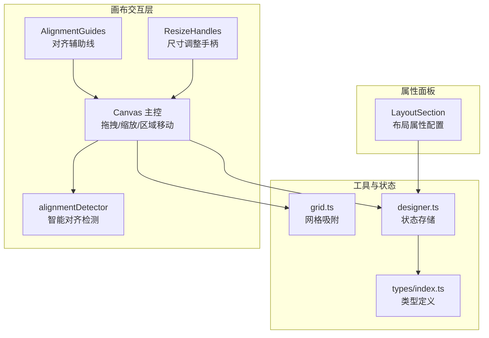
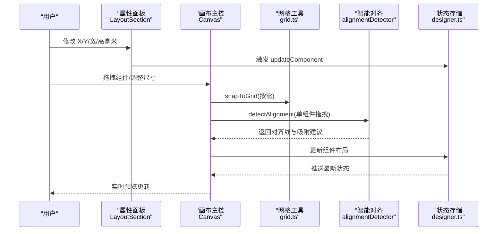
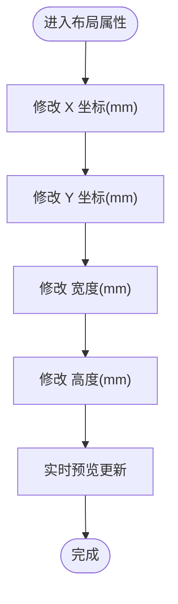
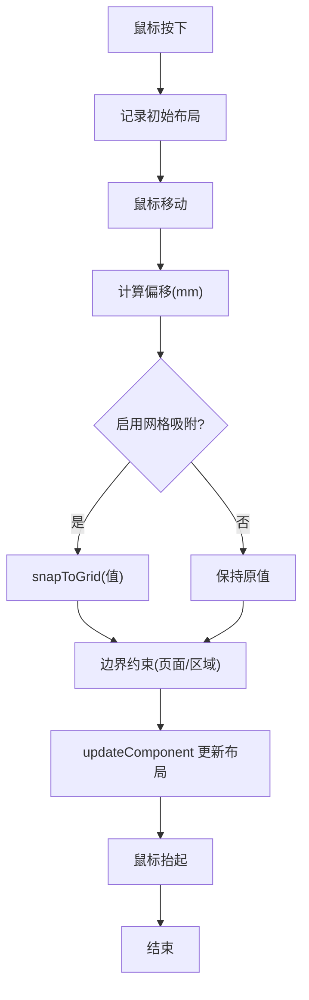
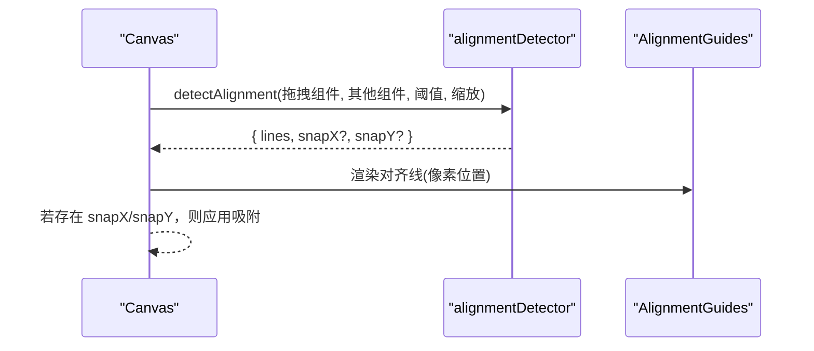
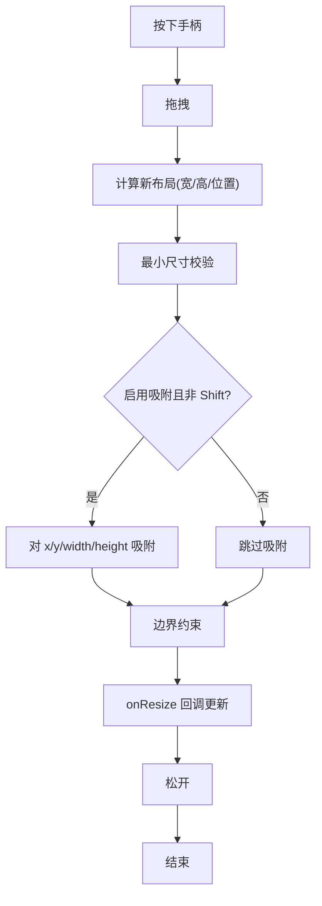
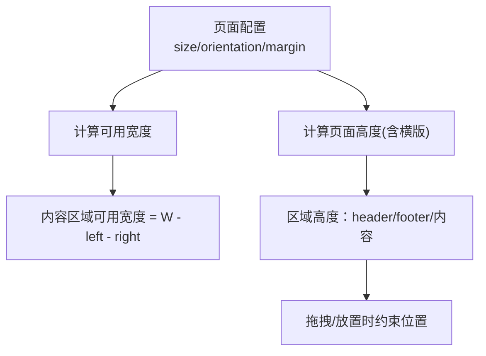
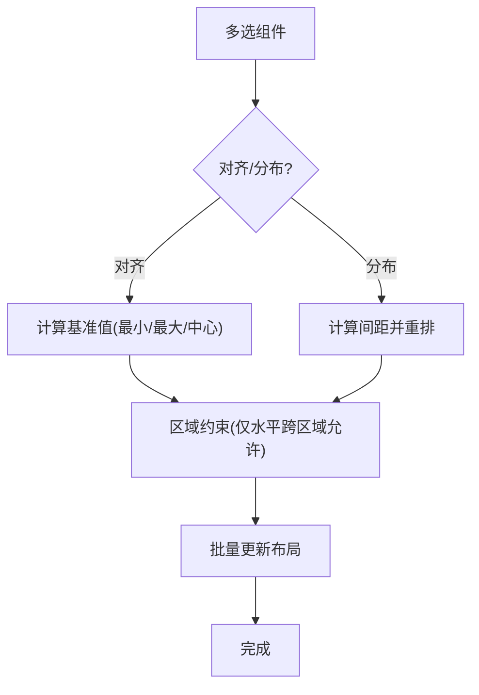
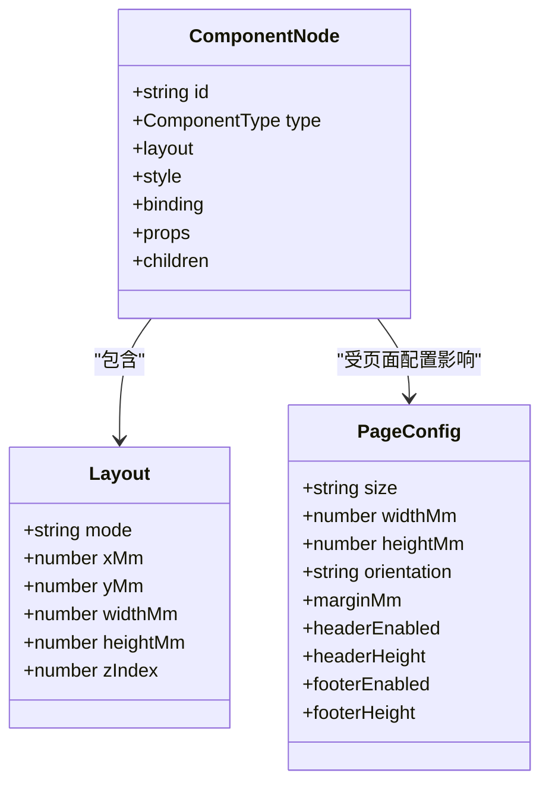
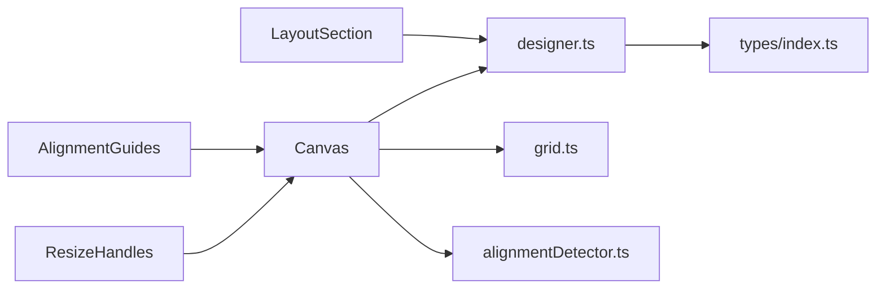

# 布局配置

<cite>
**本文引用的文件**
- [LayoutSection.tsx](file://designer/src/pages/Designer/components/PropertyPanel/LayoutSection.tsx)
- [index.tsx](file://designer/src/pages/Designer/components/Canvas/index.tsx)
- [AlignmentGuides.tsx](file://designer/src/pages/Designer/components/Canvas/AlignmentGuides.tsx)
- [ResizeHandles.tsx](file://designer/src/pages/Designer/components/Canvas/ResizeHandles.tsx)
- [alignmentDetector.ts](file://designer/src/pages/Designer/components/Canvas/alignmentDetector.ts)
- [grid.ts](file://designer/src/utils/grid.ts)
- [designer.ts](file://designer/src/store/designer.ts)
- [index.ts](file://designer/src/types/index.ts)
- [TextStylePlugin.tsx](file://designer/src/pages/Designer/components/PropertyPanel/stylePlugins/TextStylePlugin.tsx)
- [DefaultStylePlugin.tsx](file://designer/src/pages/Designer/components/PropertyPanel/stylePlugins/DefaultStylePlugin.tsx)
</cite>

## 目录
1. [简介](#简介)
2. [项目结构](#项目结构)
3. [核心组件](#核心组件)
4. [架构总览](#架构总览)
5. [详细组件分析](#详细组件分析)
6. [依赖分析](#依赖分析)
7. [性能考量](#性能考量)
8. [故障排查指南](#故障排查指南)
9. [结论](#结论)
10. [附录](#附录)

## 简介
本指南聚焦“布局配置”能力，帮助你高效完成组件的定位与尺寸控制、对齐与分布、网格吸附、智能对齐辅助线、以及响应式布局相关的页面边距与可用区域处理。文档覆盖文本、图片、表格、二维码、条形码等组件的布局配置要点，并说明属性变更的实时预览与批量调整技巧。

## 项目结构
布局系统由“画布交互层 + 属性面板 + 工具函数 + 状态存储 + 类型定义”构成，核心文件如下：
- 画布交互层：Canvas 主控、对齐辅助线、尺寸调整手柄、智能对齐检测
- 属性面板：布局属性配置区域
- 工具函数：网格吸附、像素到毫米换算
- 状态存储：页面配置、网格、缩放、组件集合与历史
- 类型定义：组件布局结构、页面配置、组件类型

**图表来源**
- [index.tsx:1-1362](file://designer/src/pages/Designer/components/Canvas/index.tsx#L1-L1362)
- [LayoutSection.tsx:1-76](file://designer/src/pages/Designer/components/PropertyPanel/LayoutSection.tsx#L1-L76)
- [AlignmentGuides.tsx:1-66](file://designer/src/pages/Designer/components/Canvas/AlignmentGuides.tsx#L1-L66)
- [ResizeHandles.tsx:1-203](file://designer/src/pages/Designer/components/Canvas/ResizeHandles.tsx#L1-L203)
- [alignmentDetector.ts:1-127](file://designer/src/pages/Designer/components/Canvas/alignmentDetector.ts#L1-L127)
- [grid.ts:1-36](file://designer/src/utils/grid.ts#L1-L36)
- [designer.ts:1-773](file://designer/src/store/designer.ts#L1-L773)
- [index.ts:1-378](file://designer/src/types/index.ts#L1-L378)

**章节来源**
- [index.tsx:1-1362](file://designer/src/pages/Designer/components/Canvas/index.tsx#L1-L1362)
- [LayoutSection.tsx:1-76](file://designer/src/pages/Designer/components/PropertyPanel/LayoutSection.tsx#L1-L76)
- [grid.ts:1-36](file://designer/src/utils/grid.ts#L1-L36)
- [designer.ts:1-773](file://designer/src/store/designer.ts#L1-L773)
- [index.ts:1-378](file://designer/src/types/index.ts#L1-L378)

## 核心组件
- 布局属性配置区域：提供 X/Y 坐标与宽/高的毫米级输入，支持拖拽与数值输入两种方式。
- 画布主控：负责组件拖拽、尺寸调整、区域移动、键盘快捷键、边界检测与吸附。
- 对齐辅助线：在拖拽时显示垂直/水平对齐参考线，提升排版精度。
- 智能对齐检测：基于毫米阈值检测组件对齐关系，提供吸附建议。
- 尺寸调整手柄：提供八方向拖拽，支持最小尺寸限制与网格吸附。
- 网格工具：统一的网格吸附与点吸附接口。
- 状态存储：集中管理页面配置（含边距）、网格、缩放、组件集合与历史。

**章节来源**
- [LayoutSection.tsx:17-76](file://designer/src/pages/Designer/components/PropertyPanel/LayoutSection.tsx#L17-L76)
- [index.tsx:101-106](file://designer/src/pages/Designer/components/Canvas/index.tsx#L101-L106)
- [AlignmentGuides.tsx:21-66](file://designer/src/pages/Designer/components/Canvas/AlignmentGuides.tsx#L21-L66)
- [alignmentDetector.ts:31-127](file://designer/src/pages/Designer/components/Canvas/alignmentDetector.ts#L31-L127)
- [ResizeHandles.tsx:24-152](file://designer/src/pages/Designer/components/Canvas/ResizeHandles.tsx#L24-L152)
- [grid.ts:12-35](file://designer/src/utils/grid.ts#L12-L35)
- [designer.ts:108-773](file://designer/src/store/designer.ts#L108-L773)

## 架构总览
布局配置贯穿“输入（属性面板/拖拽/键盘）—计算（吸附/对齐/边界）—更新（状态存储）—渲染（画布）”的闭环。

**图表来源**
- [LayoutSection.tsx:26-68](file://designer/src/pages/Designer/components/PropertyPanel/LayoutSection.tsx#L26-L68)
- [index.tsx:538-699](file://designer/src/pages/Designer/components/Canvas/index.tsx#L538-L699)
- [grid.ts:12-15](file://designer/src/utils/grid.ts#L12-L15)
- [alignmentDetector.ts:31-127](file://designer/src/pages/Designer/components/Canvas/alignmentDetector.ts#L31-L127)
- [designer.ts:126-137](file://designer/src/store/designer.ts#L126-L137)

## 详细组件分析

### 布局属性配置（X/Y/宽/高）
- 输入范围：毫米（mm），支持步进与精度设置，便于微调。
- 适用场景：快速设定组件绝对定位与尺寸，适合固定排版。
- 注意事项：拖拽与数值输入均会触发状态更新，支持撤销/重做。

**图表来源**
- [LayoutSection.tsx:26-68](file://designer/src/pages/Designer/components/PropertyPanel/LayoutSection.tsx#L26-L68)

**章节来源**
- [LayoutSection.tsx:17-76](file://designer/src/pages/Designer/components/PropertyPanel/LayoutSection.tsx#L17-L76)

### 拖拽与网格吸附
- 拖拽流程：按下 → 记录初始布局 → 鼠标移动 → 计算偏移 → 网格吸附 → 边界约束 → 更新组件。
- 网格吸附：可通过按住 Shift 临时禁用吸附；支持按住 Shift 调整尺寸时禁用吸附。
- 边界检测：区分页头/页脚/内容区域，按区域高度与页面可用高度约束组件位置。

**图表来源**
- [index.tsx:538-699](file://designer/src/pages/Designer/components/Canvas/index.tsx#L538-L699)
- [grid.ts:12-15](file://designer/src/utils/grid.ts#L12-L15)

**章节来源**
- [index.tsx:502-699](file://designer/src/pages/Designer/components/Canvas/index.tsx#L502-L699)
- [grid.ts:12-15](file://designer/src/utils/grid.ts#L12-L15)

### 智能对齐与辅助线
- 对齐检测：以毫米为单位比较组件关键点（左/右/中、上/下/中），低于阈值即产生对齐线。
- 辅助线渲染：垂直/水平两类，像素位置由缩放级别换算。
- 吸附建议：在拖拽过程中返回可选的吸附 X/Y，提升对齐精度。

**图表来源**
- [alignmentDetector.ts:31-127](file://designer/src/pages/Designer/components/Canvas/alignmentDetector.ts#L31-L127)
- [AlignmentGuides.tsx:21-66](file://designer/src/pages/Designer/components/Canvas/AlignmentGuides.tsx#L21-L66)
- [index.tsx:582-599](file://designer/src/pages/Designer/components/Canvas/index.tsx#L582-L599)

**章节来源**
- [alignmentDetector.ts:31-127](file://designer/src/pages/Designer/components/Canvas/alignmentDetector.ts#L31-L127)
- [AlignmentGuides.tsx:21-66](file://designer/src/pages/Designer/components/Canvas/AlignmentGuides.tsx#L21-L66)
- [index.tsx:582-599](file://designer/src/pages/Designer/components/Canvas/index.tsx#L582-L599)

### 尺寸调整手柄（八方向）
- 支持：四角 + 四边，同时调整宽高与位置。
- 限制：最小尺寸 5mm；超出页面范围自动约束。
- 网格吸附：按住 Shift 可临时禁用吸附。

**图表来源**
- [ResizeHandles.tsx:36-152](file://designer/src/pages/Designer/components/Canvas/ResizeHandles.tsx#L36-L152)
- [grid.ts:12-15](file://designer/src/utils/grid.ts#L12-L15)

**章节来源**
- [ResizeHandles.tsx:24-152](file://designer/src/pages/Designer/components/Canvas/ResizeHandles.tsx#L24-L152)

### 页面边距与可用区域
- 页面边距：通过页面配置的 marginMm（top/right/bottom/left）决定可用区域。
- 可用宽度：根据纸张尺寸、方向与边距计算，常用于组件默认宽度或表格铺满。
- 区域移动：组件可在页头/内容/页脚之间移动，表格组件不允许进入页头/页脚。

**图表来源**
- [index.tsx:109-129](file://designer/src/pages/Designer/components/Canvas/index.tsx#L109-L129)
- [index.tsx:333-339](file://designer/src/pages/Designer/components/Canvas/index.tsx#L333-L339)
- [designer.ts:469-506](file://designer/src/store/designer.ts#L469-L506)

**章节来源**
- [index.tsx:109-129](file://designer/src/pages/Designer/components/Canvas/index.tsx#L109-L129)
- [index.tsx:333-339](file://designer/src/pages/Designer/components/Canvas/index.tsx#L333-L339)
- [designer.ts:469-506](file://designer/src/store/designer.ts#L469-L506)

### 对齐与分布（批量）
- 对齐：左对齐、右对齐、顶部对齐、底部对齐、水平居中、垂直居中。
- 分布：水平均匀分布、垂直均匀分布。
- 跨区域限制：垂直对齐/分布不允许跨区域操作。

**图表来源**
- [designer.ts:551-703](file://designer/src/store/designer.ts#L551-L703)
- [designer.ts:705-771](file://designer/src/store/designer.ts#L705-L771)

**章节来源**
- [designer.ts:551-703](file://designer/src/store/designer.ts#L551-L703)
- [designer.ts:705-771](file://designer/src/store/designer.ts#L705-L771)

### 组件类型与布局配置要点
- 文本组件：支持标签、静态文本、字体大小、字重、对齐方式、颜色等样式配置。
- 图片/二维码/条形码/矩形：默认样式插件，无需额外样式配置，主要通过布局属性定位与尺寸控制。
- 表格组件：默认宽度通常铺满可用区域，受页面边距与方向影响。

**图表来源**
- [index.ts:303-331](file://designer/src/types/index.ts#L303-L331)
- [index.ts:91-123](file://designer/src/types/index.ts#L91-L123)

**章节来源**
- [TextStylePlugin.tsx:11-86](file://designer/src/pages/Designer/components/PropertyPanel/stylePlugins/TextStylePlugin.tsx#L11-L86)
- [DefaultStylePlugin.tsx:9-16](file://designer/src/pages/Designer/components/PropertyPanel/stylePlugins/DefaultStylePlugin.tsx#L9-L16)
- [index.ts:303-331](file://designer/src/types/index.ts#L303-L331)
- [index.ts:91-123](file://designer/src/types/index.ts#L91-L123)

## 依赖分析
- 低耦合：布局配置通过状态存储集中管理，画布与属性面板通过回调更新状态，避免直接互相依赖。
- 关键依赖链：
  - Canvas → grid.ts（网格吸附）
  - Canvas → alignmentDetector.ts（智能对齐）
  - Canvas → designer.ts（更新组件/页面配置/历史）
  - LayoutSection → designer.ts（更新组件布局）
  - AlignmentGuides → Canvas（接收对齐线）

**图表来源**
- [LayoutSection.tsx:17-76](file://designer/src/pages/Designer/components/PropertyPanel/LayoutSection.tsx#L17-L76)
- [index.tsx:1-1362](file://designer/src/pages/Designer/components/Canvas/index.tsx#L1-L1362)
- [grid.ts:1-36](file://designer/src/utils/grid.ts#L1-L36)
- [alignmentDetector.ts:1-127](file://designer/src/pages/Designer/components/Canvas/alignmentDetector.ts#L1-L127)
- [AlignmentGuides.tsx:1-66](file://designer/src/pages/Designer/components/Canvas/AlignmentGuides.tsx#L1-L66)
- [ResizeHandles.tsx:1-203](file://designer/src/pages/Designer/components/Canvas/ResizeHandles.tsx#L1-L203)
- [designer.ts:1-773](file://designer/src/store/designer.ts#L1-L773)
- [index.ts:1-378](file://designer/src/types/index.ts#L1-L378)

**章节来源**
- [designer.ts:108-773](file://designer/src/store/designer.ts#L108-L773)

## 性能考量
- 事件监听优化：拖拽与尺寸调整使用 useRef 缓存状态，避免频繁重绑监听器。
- 闭包更新：在拖拽过程中读取 ref 中的最新页面配置与组件集合，减少闭包过期导致的错误。
- 最小化重绘：对齐辅助线与尺寸提示仅在必要时渲染，避免高频更新造成卡顿。
- 历史快照：撤销/重做采用全量快照，注意历史步数上限与内存占用。

**章节来源**
- [index.tsx:78-98](file://designer/src/pages/Designer/components/Canvas/index.tsx#L78-L98)
- [index.tsx:538-699](file://designer/src/pages/Designer/components/Canvas/index.tsx#L538-L699)
- [designer.ts:92-106](file://designer/src/store/designer.ts#L92-L106)

## 故障排查指南
- 组件无法拖出页面边界
  - 检查页面尺寸与边距配置，确认内容区域高度与页头/页脚高度之和不超过页面可用高度。
  - 参考：页面尺寸计算与区域高度约束逻辑。
- 拖拽时组件“跳跃”
  - 网格吸附开启时会按网格步进，按住 Shift 可临时禁用吸附。
  - 参考：网格吸附函数与拖拽过程中的 snapToGrid 调用。
- 对齐辅助线不显示
  - 确认拖拽组件与其他组件的距离小于对齐阈值（毫米级），且缩放级别正确。
  - 参考：智能对齐检测与像素换算。
- 尺寸调整无效或过小
  - 尺寸存在最小限制（5mm），超出页面范围会被自动约束。
  - 参考：尺寸调整手柄的最小尺寸与边界约束。
- 表格组件被放入页头/页脚
  - 表格组件不允许放入页头/页脚区域，尝试移动至内容区。
  - 参考：区域移动逻辑中的表格限制。

**章节来源**
- [index.tsx:222-279](file://designer/src/pages/Designer/components/Canvas/index.tsx#L222-L279)
- [index.tsx:578-599](file://designer/src/pages/Designer/components/Canvas/index.tsx#L578-L599)
- [alignmentDetector.ts:11-15](file://designer/src/pages/Designer/components/Canvas/alignmentDetector.ts#L11-L15)
- [ResizeHandles.tsx:102-136](file://designer/src/pages/Designer/components/Canvas/ResizeHandles.tsx#L102-L136)
- [designer.ts:480-482](file://designer/src/store/designer.ts#L480-L482)

## 结论
本布局系统以毫米为统一单位，结合网格吸附、智能对齐辅助线与严格的边界约束，提供了高精度、易用的组件定位与尺寸控制体验。通过属性面板与画布交互的协同，配合对齐/分布与批量调整能力，能够快速构建复杂的打印模板布局。

## 附录
- 快捷键速查
  - 删除：Delete/Backspace
  - 复制：Ctrl/Cmd + C
  - 粘贴：Ctrl/Cmd + V
  - 克隆：Ctrl/Cmd + D
  - 撤销：Ctrl/Cmd + Z
  - 重做：Ctrl/Cmd + Shift + Z
  - 缩放：Ctrl/Cmd + “+/-/0”

**章节来源**
- [index.tsx:146-220](file://designer/src/pages/Designer/components/Canvas/index.tsx#L146-L220)