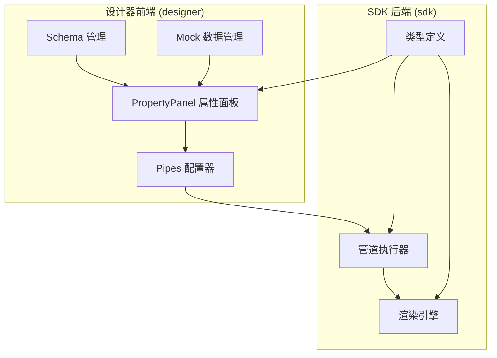
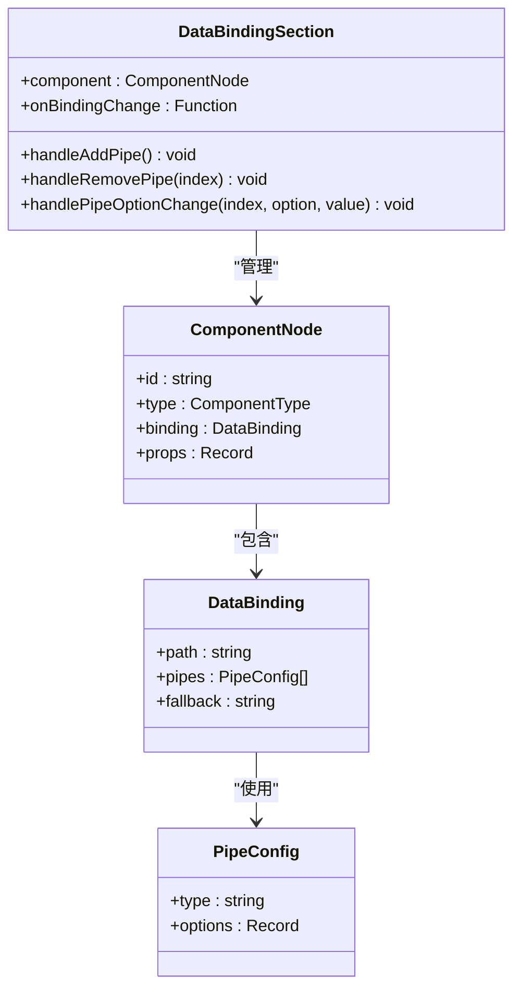
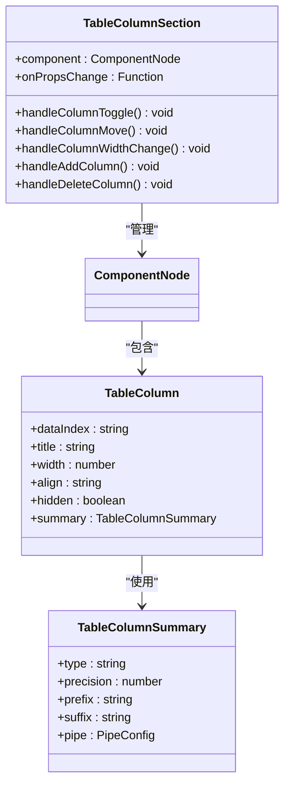
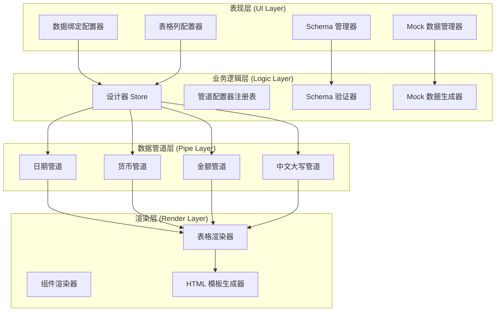
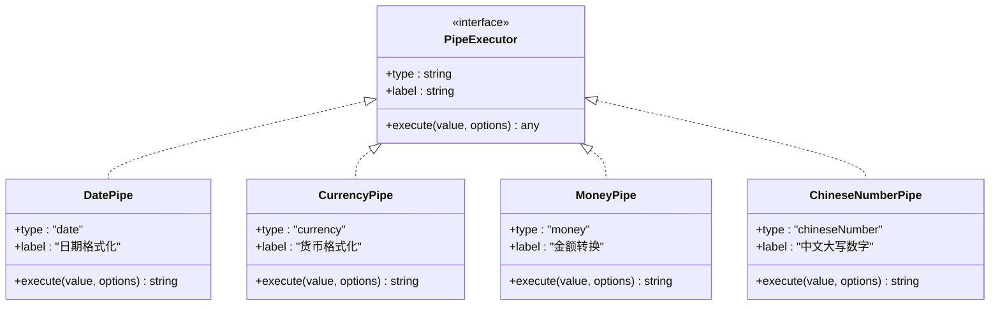
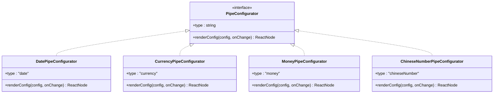
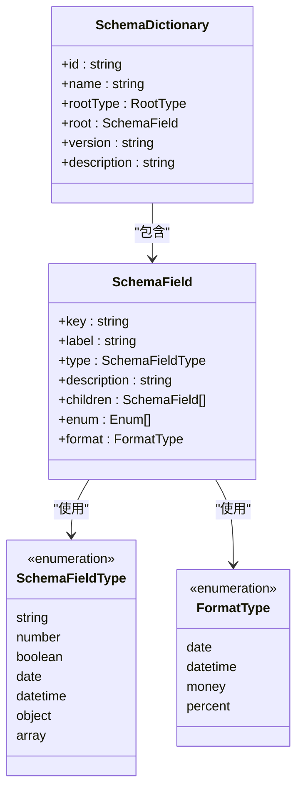
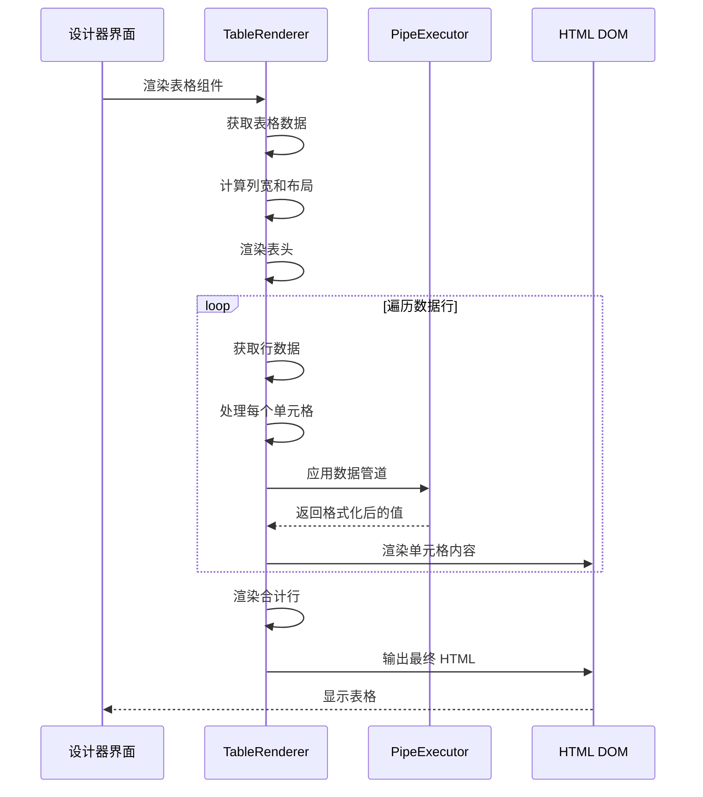
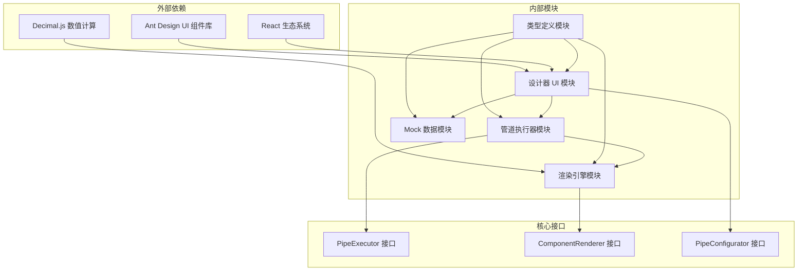

# 数据绑定配置

<cite>
**本文档引用的文件**
- [DataBindingSection.tsx](file://designer/src/pages/Designer/components/PropertyPanel/DataBindingSection.tsx)
- [TableColumnSection.tsx](file://designer/src/pages/Designer/components/PropertyPanel/TableColumnSection.tsx)
- [index.ts](file://designer/src/types/index.ts)
- [registry.ts](file://sdk/src/pipes/registry.ts)
- [DatePipe.ts](file://sdk/src/pipes/executors/DatePipe.ts)
- [CurrencyPipe.ts](file://sdk/src/pipes/executors/CurrencyPipe.ts)
- [MoneyPipe.ts](file://sdk/src/pipes/executors/MoneyPipe.ts)
- [ChineseNumberPipe.ts](file://sdk/src/pipes/executors/ChineseNumberPipe.ts)
- [TableRenderer.ts](file://sdk/src/printEngine/renderers/TableRenderer.ts)
- [schemas.ts](file://designer/src/services/mock/schemas.ts)
- [mockData.ts](file://designer/src/services/mock/mockData.ts)
- [mockDataGenerator.ts](file://designer/src/utils/mockDataGenerator.ts)
- [DatePipeConfigurator.tsx](file://designer/src/pipes/configurators/DatePipeConfigurator.tsx)
- [CurrencyPipeConfigurator.tsx](file://designer/src/pipes/configurators/CurrencyPipeConfigurator.tsx)
- [MoneyPipeConfigurator.tsx](file://designer/src/pipes/configurators/MoneyPipeConfigurator.tsx)
- [ChineseNumberPipeConfigurator.tsx](file://designer/src/pipes/configurators/ChineseNumberPipeConfigurator.tsx)
- [configurators/index.tsx](file://designer/src/pipes/configurators/index.tsx)
</cite>

## 目录
1. [简介](#简介)
2. [项目结构](#项目结构)
3. [核心组件](#核心组件)
4. [架构概览](#架构概览)
5. [详细组件分析](#详细组件分析)
6. [依赖关系分析](#依赖关系分析)
7. [性能考虑](#性能考虑)
8. [故障排除指南](#故障排除指南)
9. [结论](#结论)
10. [附录](#附录)

## 简介

数据绑定配置是打印模板设计的核心功能，它允许设计师通过可视化界面将组件与数据源建立关联，并通过数据管道对数据进行格式化和转换。本文档深入讲解了该系统的完整实现，包括Schema字段选择、数据管道配置、动态数据绑定、表格列配置以及Mock数据管理等关键功能。

该系统采用插件化的架构设计，支持多种数据管道（日期格式化、货币格式化、金额转换、中文数字等），并通过可视化配置器提供直观的操作界面。系统还提供了完整的Mock数据生成功能，帮助开发者和设计师快速测试各种数据绑定场景。

## 项目结构

该项目采用前后端分离的架构，主要分为两个核心部分：



**图表来源**
- [DataBindingSection.tsx:1-128](file://designer/src/pages/Designer/components/PropertyPanel/DataBindingSection.tsx#L1-L128)
- [registry.ts:1-65](file://sdk/src/pipes/registry.ts#L1-L65)

**章节来源**
- [DataBindingSection.tsx:1-128](file://designer/src/pages/Designer/components/PropertyPanel/DataBindingSection.tsx#L1-L128)
- [index.ts:1-378](file://designer/src/types/index.ts#L1-L378)

## 核心组件

### 数据绑定配置区域

数据绑定配置区域是设计器中最核心的功能模块，提供了完整的数据绑定管理界面：



**图表来源**
- [DataBindingSection.tsx:15-128](file://designer/src/pages/Designer/components/PropertyPanel/DataBindingSection.tsx#L15-L128)
- [index.ts:146-164](file://designer/src/types/index.ts#L146-L164)

### 表格列管理配置

表格组件提供了强大的列配置功能，支持复杂的表格布局和数据展示需求：



**图表来源**
- [TableColumnSection.tsx:17-718](file://designer/src/pages/Designer/components/PropertyPanel/TableColumnSection.tsx#L17-L718)
- [index.ts:196-209](file://designer/src/types/index.ts#L196-L209)

**章节来源**
- [DataBindingSection.tsx:20-128](file://designer/src/pages/Designer/components/PropertyPanel/DataBindingSection.tsx#L20-L128)
- [TableColumnSection.tsx:22-718](file://designer/src/pages/Designer/components/PropertyPanel/TableColumnSection.tsx#L22-L718)

## 架构概览

系统采用分层架构设计，实现了清晰的关注点分离：



**图表来源**
- [registry.ts:54-65](file://sdk/src/pipes/registry.ts#L54-L65)
- [TableRenderer.ts:147-602](file://sdk/src/printEngine/renderers/TableRenderer.ts#L147-L602)

系统的核心优势在于其插件化的设计理念，每个组件都可以独立扩展和定制，同时保持良好的性能和可维护性。

**章节来源**
- [registry.ts:1-65](file://sdk/src/pipes/registry.ts#L1-L65)
- [TableRenderer.ts:1-602](file://sdk/src/printEngine/renderers/TableRenderer.ts#L1-L602)

## 详细组件分析

### 数据管道系统

数据管道系统是整个数据绑定功能的核心，提供了丰富的数据格式化能力：

#### 管道执行器架构



**图表来源**
- [registry.ts:6-26](file://sdk/src/pipes/registry.ts#L6-L26)
- [DatePipe.ts:7-35](file://sdk/src/pipes/executors/DatePipe.ts#L7-L35)
- [CurrencyPipe.ts:7-17](file://sdk/src/pipes/executors/CurrencyPipe.ts#L7-L17)
- [MoneyPipe.ts:59-130](file://sdk/src/pipes/executors/MoneyPipe.ts#L59-L130)
- [ChineseNumberPipe.ts:99-138](file://sdk/src/pipes/executors/ChineseNumberPipe.ts#L99-L138)

#### 管道配置器系统



**图表来源**
- [configurators/index.tsx:14-85](file://designer/src/pipes/configurators/index.tsx#L14-L85)
- [DatePipeConfigurator.tsx:9-23](file://designer/src/pipes/configurators/DatePipeConfigurator.tsx#L9-L23)
- [CurrencyPipeConfigurator.tsx:9-23](file://designer/src/pipes/configurators/CurrencyPipeConfigurator.tsx#L9-L23)
- [MoneyPipeConfigurator.tsx:9-143](file://designer/src/pipes/configurators/MoneyPipeConfigurator.tsx#L9-L143)
- [ChineseNumberPipeConfigurator.tsx:11-58](file://designer/src/pipes/configurators/ChineseNumberPipeConfigurator.tsx#L11-L58)

**章节来源**
- [registry.ts:42-65](file://sdk/src/pipes/registry.ts#L42-L65)
- [configurators/index.tsx:66-85](file://designer/src/pipes/configurators/index.tsx#L66-L85)

### Schema 字段管理系统

Schema 系统提供了完整的数据模型定义和验证功能：

#### Schema 字段类型定义



**图表来源**
- [index.ts:5-52](file://designer/src/types/index.ts#L5-L52)
- [schemas.ts:6-147](file://designer/src/services/mock/schemas.ts#L6-L147)

#### 内置 Schema 示例

系统提供了多个内置的 Schema 示例，涵盖了常见的业务场景：

**章节来源**
- [index.ts:18-52](file://designer/src/types/index.ts#L18-L52)
- [schemas.ts:6-147](file://designer/src/services/mock/schemas.ts#L6-L147)

### Mock 数据管理系统

Mock 数据系统为开发和测试提供了完整的数据支持：

#### Mock 数据生成流程

```mermaid
flowchart TD
A[Schema 字段定义] --> B[generateMockData 函数]
B --> C{字段类型判断}
C --> |string| D[generateStringValue]
C --> |number| E[generateNumberValue]
C --> |boolean| F[Math.random() > 0.5]
C --> |date| G[new Date().toISOString().split('T')[0]]
C --> |object| H[generateObjectValue]
C --> |array| I[generateArrayValue]
D --> J[根据字段名推测内容]
E --> K[根据字段名推测数值范围]
H --> L[递归生成子字段]
I --> M[生成 2-5 条数据]
J --> N[返回生成的 Mock 数据]
K --> N
F --> N
G --> N
L --> N
M --> N
```

**图表来源**
- [mockDataGenerator.ts:4-113](file://designer/src/utils/mockDataGenerator.ts#L4-L113)

**章节来源**
- [mockDataGenerator.ts:1-113](file://designer/src/utils/mockDataGenerator.ts#L1-L113)
- [mockData.ts:6-639](file://designer/src/services/mock/mockData.ts#L6-L639)

### 表格渲染系统

表格渲染系统是数据绑定功能的重要组成部分，提供了强大的表格展示能力：

#### 表格渲染流程



**图表来源**
- [TableRenderer.ts:150-327](file://sdk/src/printEngine/renderers/TableRenderer.ts#L150-L327)

**章节来源**
- [TableRenderer.ts:147-602](file://sdk/src/printEngine/renderers/TableRenderer.ts#L147-L602)

## 依赖关系分析

系统采用了清晰的依赖层次结构，确保了模块间的松耦合：



**图表来源**
- [index.ts:1-378](file://designer/src/types/index.ts#L1-L378)
- [registry.ts:1-65](file://sdk/src/pipes/registry.ts#L1-L65)

系统的关键依赖包括：
- **Ant Design**: 提供了完整的 UI 组件库，支持响应式设计和国际化
- **React**: 作为前端框架，提供了组件化的开发体验
- **Decimal.js**: 用于精确的数值计算，避免浮点数精度问题
- **Zustand**: 状态管理库，提供了轻量级的状态管理解决方案

**章节来源**
- [index.ts:1-378](file://designer/src/types/index.ts#L1-L378)
- [registry.ts:1-65](file://sdk/src/pipes/registry.ts#L1-L65)

## 性能考虑

系统在设计时充分考虑了性能优化，采用了多种策略来提升运行效率：

### 渲染性能优化

1. **虚拟滚动**: 对于大量数据的表格，系统支持虚拟滚动技术，只渲染可视区域内的数据
2. **增量更新**: 通过对比算法，只更新发生变化的组件，减少不必要的重绘
3. **缓存机制**: 对于计算结果和渲染缓存，系统实现了智能缓存策略

### 内存管理

1. **组件卸载清理**: 确保组件卸载时释放所有占用的内存资源
2. **事件监听器管理**: 自动清理事件监听器，防止内存泄漏
3. **定时器清理**: 及时清理定时器和异步任务

### 网络优化

1. **懒加载**: 非关键资源采用懒加载策略，提升初始加载速度
2. **资源压缩**: 对静态资源进行压缩和优化
3. **CDN 加速**: 支持 CDN 加速，提升资源加载速度

## 故障排除指南

### 常见问题及解决方案

#### 数据绑定失效

**问题描述**: 组件无法正确显示绑定的数据

**可能原因**:
1. 数据路径配置错误
2. Schema 字段类型不匹配
3. 数据管道配置不当

**解决步骤**:
1. 检查数据路径是否正确（支持嵌套路径如 `user.profile.name`）
2. 验证 Schema 字段类型与实际数据类型一致
3. 确认数据管道的配置参数正确

#### 表格渲染异常

**问题描述**: 表格显示不正确或出现布局问题

**可能原因**:
1. 列宽设置超出表格宽度限制
2. 数据格式不符合预期
3. 管道执行错误

**解决步骤**:
1. 检查列宽总和是否超过表格可用宽度
2. 验证数据格式和类型
3. 查看浏览器控制台的错误信息

#### Mock 数据生成失败

**问题描述**: Mock 数据生成器无法生成有效的测试数据

**可能原因**:
1. Schema 定义不完整
2. 字段类型不支持
3. 生成逻辑异常

**解决步骤**:
1. 检查 Schema 字段定义是否完整
2. 确认字段类型在支持范围内
3. 查看生成器的错误日志

**章节来源**
- [TableRenderer.ts:387-463](file://sdk/src/printEngine/renderers/TableRenderer.ts#L387-L463)
- [mockDataGenerator.ts:4-113](file://designer/src/utils/mockDataGenerator.ts#L4-L113)

## 结论

数据绑定配置系统通过其模块化的设计和丰富的功能特性，为打印模板的开发提供了强大而灵活的支持。系统不仅提供了直观的可视化配置界面，还通过插件化的架构实现了高度的可扩展性。

该系统的主要优势包括：

1. **完整的数据绑定支持**: 从简单的字段绑定到复杂的数据管道链式处理
2. **强大的表格功能**: 支持复杂的表格布局、合计计算和数据格式化
3. **灵活的 Schema 管理**: 提供了完整的数据模型定义和验证机制
4. **完善的 Mock 数据系统**: 为开发和测试提供了便利的工具
5. **优秀的性能表现**: 通过多种优化策略确保了系统的高效运行

未来的发展方向可以包括：
- 增加更多的数据管道类型
- 支持更复杂的数据验证规则
- 提供更丰富的表格交互功能
- 优化大数据量场景下的性能表现

## 附录

### 快速开始指南

1. **创建 Schema**: 在 Schema 管理器中定义数据模型
2. **配置数据绑定**: 在属性面板中设置组件的数据绑定路径
3. **添加数据管道**: 根据需要添加相应的数据格式化管道
4. **生成 Mock 数据**: 创建测试数据进行验证
5. **预览和导出**: 预览效果并导出打印模板

### API 参考

#### 数据绑定配置 API

| 属性 | 类型 | 描述 | 必填 |
|------|------|------|------|
| path | string | 数据路径 | 否 |
| pipes | PipeConfig[] | 数据管道数组 | 否 |
| fallback | string | 回退值 | 否 |

#### 管道配置 API

| 属性 | 类型 | 描述 | 默认值 |
|------|------|------|------|
| type | string | 管道类型 | - |
| options | Record | 配置选项 | {} |

#### 表格列配置 API

| 属性 | 类型 | 描述 | 默认值 |
|------|------|------|------|
| dataIndex | string | 数据字段名 | - |
| title | string | 列标题 | - |
| width | number | 列宽度(mm) | 自动 |
| align | string | 对齐方式 | left |
| hidden | boolean | 是否隐藏 | false |
| summary | TableColumnSummary | 合计配置 | undefined |

**章节来源**
- [index.ts:146-297](file://designer/src/types/index.ts#L146-L297)