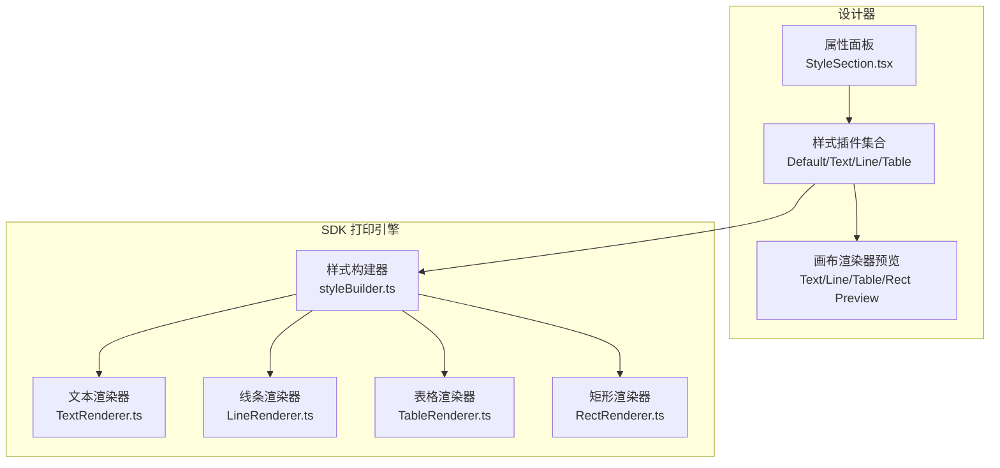
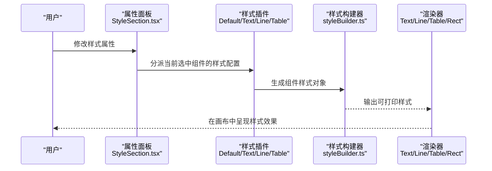
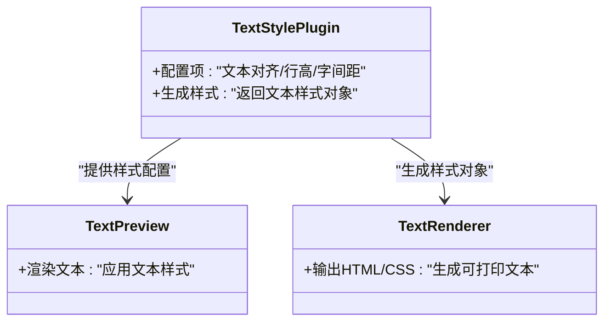
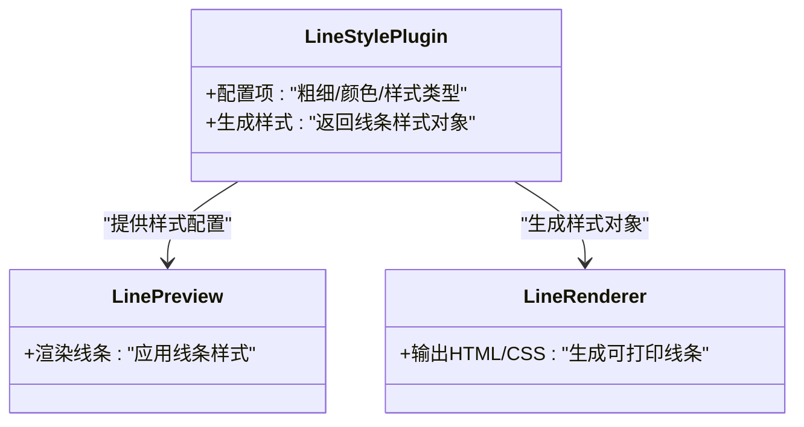
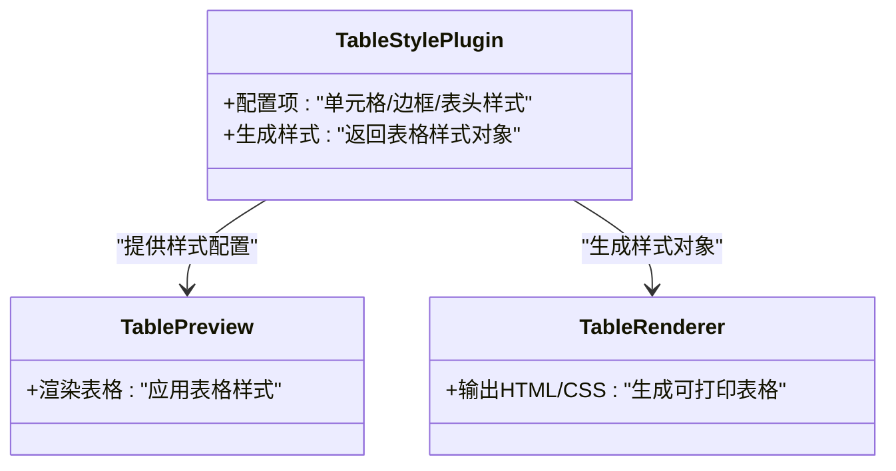
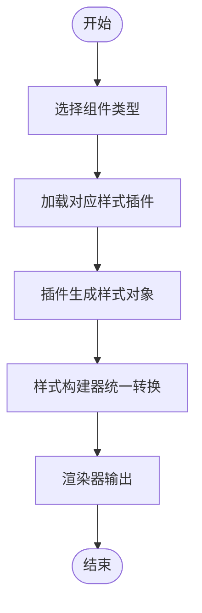
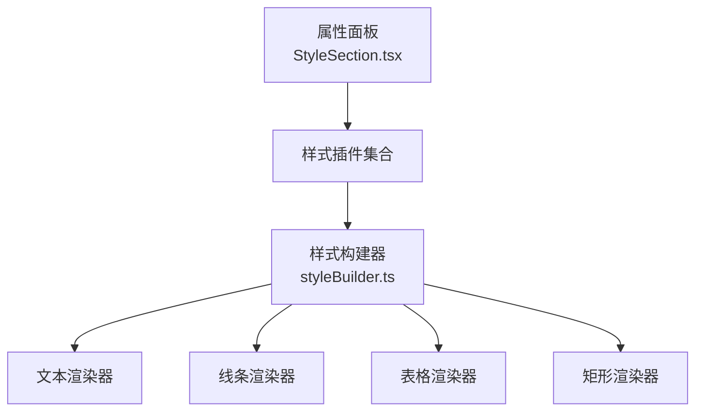

# 样式配置

<cite>
**本文引用的文件**
- [DefaultStylePlugin.tsx](file://designer/src/pages/Designer/components/PropertyPanel/stylePlugins/DefaultStylePlugin.tsx)
- [TextStylePlugin.tsx](file://designer/src/pages/Designer/components/PropertyPanel/stylePlugins/TextStylePlugin.tsx)
- [LineStylePlugin.tsx](file://designer/src/pages/Designer/components/PropertyPanel/stylePlugins/LineStylePlugin.tsx)
- [TableStylePlugin.tsx](file://designer/src/pages/Designer/components/PropertyPanel/stylePlugins/TableStylePlugin.tsx)
- [types.ts](file://designer/src/pages/Designer/components/PropertyPanel/stylePlugins/types.ts)
- [StyleSection.tsx](file://designer/src/pages/Designer/components/PropertyPanel/StyleSection.tsx)
- [TextPreview.tsx](file://designer/src/pages/Designer/components/Canvas/componentRenderers/TextPreview.tsx)
- [LinePreview.tsx](file://designer/src/pages/Designer/components/Canvas/componentRenderers/LinePreview.tsx)
- [TablePreview.tsx](file://designer/src/pages/Designer/components/Canvas/componentRenderers/TablePreview.tsx)
- [RectPreview.tsx](file://designer/src/pages/Designer/components/Canvas/componentRenderers/RectPreview.tsx)
- [styleBuilder.ts](file://sdk/src/printEngine/utils/styleBuilder.ts)
- [TextRenderer.ts](file://sdk/src/printEngine/renderers/TextRenderer.ts)
- [LineRenderer.ts](file://sdk/src/printEngine/renderers/LineRenderer.ts)
- [TableRenderer.ts](file://sdk/src/printEngine/renderers/TableRenderer.ts)
- [RectRenderer.ts](file://sdk/src/printEngine/renderers/RectRenderer.ts)
</cite>

## 目录
1. [简介](#简介)
2. [项目结构](#项目结构)
3. [核心组件](#核心组件)
4. [架构总览](#架构总览)
5. [详细组件分析](#详细组件分析)
6. [依赖关系分析](#依赖关系分析)
7. [性能考虑](#性能考虑)
8. [故障排查指南](#故障排查指南)
9. [结论](#结论)
10. [附录](#附录)

## 简介
本指南围绕设计器中的“样式配置”能力展开，覆盖通用样式属性（颜色、字体、边框）与各组件专用样式（文本、线条、表格），并深入解析样式插件系统的工作原理与扩展方法。通过阅读本指南，您将能够：
- 正确理解并配置通用样式属性与组件专用样式
- 掌握样式插件的扩展方式，以支持更多组件类型的样式配置
- 基于现有渲染器与样式构建器，实现稳定高效的打印样式输出

## 项目结构
样式配置功能主要分布在以下区域：
- 设计器属性面板：提供通用样式与组件专用样式的可视化配置入口
- 样式插件系统：按组件类型分发样式配置项与行为
- 渲染器与样式构建器：将样式配置转换为可打印的CSS/HTML

图表来源
- [StyleSection.tsx](file://designer/src/pages/Designer/components/PropertyPanel/StyleSection.tsx)
- [DefaultStylePlugin.tsx](file://designer/src/pages/Designer/components/PropertyPanel/stylePlugins/DefaultStylePlugin.tsx)
- [TextStylePlugin.tsx](file://designer/src/pages/Designer/components/PropertyPanel/stylePlugins/TextStylePlugin.tsx)
- [LineStylePlugin.tsx](file://designer/src/pages/Designer/components/PropertyPanel/stylePlugins/LineStylePlugin.tsx)
- [TableStylePlugin.tsx](file://designer/src/pages/Designer/components/PropertyPanel/stylePlugins/TableStylePlugin.tsx)
- [styleBuilder.ts](file://sdk/src/printEngine/utils/styleBuilder.ts)
- [TextRenderer.ts](file://sdk/src/printEngine/renderers/TextRenderer.ts)
- [LineRenderer.ts](file://sdk/src/printEngine/renderers/LineRenderer.ts)
- [TableRenderer.ts](file://sdk/src/printEngine/renderers/TableRenderer.ts)
- [RectRenderer.ts](file://sdk/src/printEngine/renderers/RectRenderer.ts)

章节来源
- [StyleSection.tsx](file://designer/src/pages/Designer/components/PropertyPanel/StyleSection.tsx)
- [DefaultStylePlugin.tsx](file://designer/src/pages/Designer/components/PropertyPanel/stylePlugins/DefaultStylePlugin.tsx)
- [TextStylePlugin.tsx](file://designer/src/pages/Designer/components/PropertyPanel/stylePlugins/TextStylePlugin.tsx)
- [LineStylePlugin.tsx](file://designer/src/pages/Designer/components/PropertyPanel/stylePlugins/LineStylePlugin.tsx)
- [TableStylePlugin.tsx](file://designer/src/pages/Designer/components/PropertyPanel/stylePlugins/TableStylePlugin.tsx)

## 核心组件
- 通用样式属性
  - 颜色：textColor、backgroundColor
  - 字体：fontFamily、fontSize、fontWeight
  - 边框：borderWidth、borderStyle、borderColor
- 文本组件专用样式
  - 文本对齐、行高、字间距等
- 线条组件专用样式
  - 线条粗细、颜色、样式类型
- 表格组件专用样式
  - 单元格样式、边框样式、表头样式
- 样式插件系统
  - 按组件类型分发配置项与行为，便于扩展新组件样式

章节来源
- [DefaultStylePlugin.tsx](file://designer/src/pages/Designer/components/PropertyPanel/stylePlugins/DefaultStylePlugin.tsx)
- [TextStylePlugin.tsx](file://designer/src/pages/Designer/components/PropertyPanel/stylePlugins/TextStylePlugin.tsx)
- [LineStylePlugin.tsx](file://designer/src/pages/Designer/components/PropertyPanel/stylePlugins/LineStylePlugin.tsx)
- [TableStylePlugin.tsx](file://designer/src/pages/Designer/components/PropertyPanel/stylePlugins/TableStylePlugin.tsx)
- [types.ts](file://designer/src/pages/Designer/components/PropertyPanel/stylePlugins/types.ts)

## 架构总览
样式从“属性面板”进入，经由“样式插件”生成对应组件的样式配置，再由“样式构建器”统一转换为可打印的样式表达，最终由“渲染器”输出到页面或打印。

图表来源
- [StyleSection.tsx](file://designer/src/pages/Designer/components/PropertyPanel/StyleSection.tsx)
- [DefaultStylePlugin.tsx](file://designer/src/pages/Designer/components/PropertyPanel/stylePlugins/DefaultStylePlugin.tsx)
- [TextStylePlugin.tsx](file://designer/src/pages/Designer/components/PropertyPanel/stylePlugins/TextStylePlugin.tsx)
- [LineStylePlugin.tsx](file://designer/src/pages/Designer/components/PropertyPanel/stylePlugins/LineStylePlugin.tsx)
- [TableStylePlugin.tsx](file://designer/src/pages/Designer/components/PropertyPanel/stylePlugins/TableStylePlugin.tsx)
- [styleBuilder.ts](file://sdk/src/printEngine/utils/styleBuilder.ts)
- [TextRenderer.ts](file://sdk/src/printEngine/renderers/TextRenderer.ts)
- [LineRenderer.ts](file://sdk/src/printEngine/renderers/LineRenderer.ts)
- [TableRenderer.ts](file://sdk/src/printEngine/renderers/TableRenderer.ts)
- [RectRenderer.ts](file://sdk/src/printEngine/renderers/RectRenderer.ts)

## 详细组件分析

### 通用样式属性
- 颜色设置
  - textColor：文本颜色
  - backgroundColor：背景色
- 字体配置
  - fontFamily：字体族
  - fontSize：字号
  - fontWeight：字重
- 边框设置
  - borderWidth：边框宽度
  - borderStyle：边框样式
  - borderColor：边框颜色

这些属性通常在“默认样式插件”中提供，作为所有组件的基础样式入口；同时，组件专用插件会在此基础上叠加或覆盖特定属性。

章节来源
- [DefaultStylePlugin.tsx](file://designer/src/pages/Designer/components/PropertyPanel/stylePlugins/DefaultStylePlugin.tsx)
- [types.ts](file://designer/src/pages/Designer/components/PropertyPanel/stylePlugins/types.ts)

### 文本组件样式
- 文本对齐：left/center/right/justify
- 行高：lineHeight
- 字间距：letterSpacing
- 其他：verticalAlign、textDecoration、whiteSpace 等

文本样式由“文本样式插件”集中管理，并在“文本预览”与“文本渲染器”中生效。

图表来源
- [TextStylePlugin.tsx](file://designer/src/pages/Designer/components/PropertyPanel/stylePlugins/TextStylePlugin.tsx)
- [TextPreview.tsx](file://designer/src/pages/Designer/components/Canvas/componentRenderers/TextPreview.tsx)
- [TextRenderer.ts](file://sdk/src/printEngine/renderers/TextRenderer.ts)

章节来源
- [TextStylePlugin.tsx](file://designer/src/pages/Designer/components/PropertyPanel/stylePlugins/TextStylePlugin.tsx)
- [TextPreview.tsx](file://designer/src/pages/Designer/components/Canvas/componentRenderers/TextPreview.tsx)
- [TextRenderer.ts](file://sdk/src/printEngine/renderers/TextRenderer.ts)

### 线条组件样式
- 线条粗细：strokeWidth
- 颜色：strokeColor
- 样式类型：solid/dashed/dotted 等

线条样式由“线条样式插件”管理，并在“线条预览”与“线条渲染器”中应用。

图表来源
- [LineStylePlugin.tsx](file://designer/src/pages/Designer/components/PropertyPanel/stylePlugins/LineStylePlugin.tsx)
- [LinePreview.tsx](file://designer/src/pages/Designer/components/Canvas/componentRenderers/LinePreview.tsx)
- [LineRenderer.ts](file://sdk/src/printEngine/renderers/LineRenderer.ts)

章节来源
- [LineStylePlugin.tsx](file://designer/src/pages/Designer/components/PropertyPanel/stylePlugins/LineStylePlugin.tsx)
- [LinePreview.tsx](file://designer/src/pages/Designer/components/Canvas/componentRenderers/LinePreview.tsx)
- [LineRenderer.ts](file://sdk/src/printEngine/renderers/LineRenderer.ts)

### 表格组件样式
- 单元格样式：padding、text-align、vertical-align
- 边框样式：cellBorderWidth、cellBorderStyle、cellBorderColor
- 表头样式：headerBackgroundColor、headerTextColor、headerFontWeight 等

表格样式由“表格样式插件”管理，并在“表格预览”与“表格渲染器”中应用。

图表来源
- [TableStylePlugin.tsx](file://designer/src/pages/Designer/components/PropertyPanel/stylePlugins/TableStylePlugin.tsx)
- [TablePreview.tsx](file://designer/src/pages/Designer/components/Canvas/componentRenderers/TablePreview.tsx)
- [TableRenderer.ts](file://sdk/src/printEngine/renderers/TableRenderer.ts)

章节来源
- [TableStylePlugin.tsx](file://designer/src/pages/Designer/components/PropertyPanel/stylePlugins/TableStylePlugin.tsx)
- [TablePreview.tsx](file://designer/src/pages/Designer/components/Canvas/componentRenderers/TablePreview.tsx)
- [TableRenderer.ts](file://sdk/src/printEngine/renderers/TableRenderer.ts)

### 样式插件系统工作原理与扩展
- 工作原理
  - 属性面板根据当前选中组件类型选择对应样式插件
  - 插件生成该组件的样式配置项与默认值
  - 样式构建器将插件输出的样式对象统一转换为可打印格式
- 扩展方法
  - 新增插件文件并导出类型定义
  - 在插件集合中注册新插件
  - 在渲染器中接入新的样式构建逻辑

图表来源
- [types.ts](file://designer/src/pages/Designer/components/PropertyPanel/stylePlugins/types.ts)
- [DefaultStylePlugin.tsx](file://designer/src/pages/Designer/components/PropertyPanel/stylePlugins/DefaultStylePlugin.tsx)
- [styleBuilder.ts](file://sdk/src/printEngine/utils/styleBuilder.ts)

章节来源
- [types.ts](file://designer/src/pages/Designer/components/PropertyPanel/stylePlugins/types.ts)
- [DefaultStylePlugin.tsx](file://designer/src/pages/Designer/components/PropertyPanel/stylePlugins/DefaultStylePlugin.tsx)
- [styleBuilder.ts](file://sdk/src/printEngine/utils/styleBuilder.ts)

## 依赖关系分析
- 属性面板依赖样式插件集合，以动态生成配置界面
- 样式插件依赖样式构建器，将配置转换为可打印样式
- 渲染器依赖样式构建器输出的样式对象，完成最终绘制

图表来源
- [StyleSection.tsx](file://designer/src/pages/Designer/components/PropertyPanel/StyleSection.tsx)
- [DefaultStylePlugin.tsx](file://designer/src/pages/Designer/components/PropertyPanel/stylePlugins/DefaultStylePlugin.tsx)
- [TextStylePlugin.tsx](file://designer/src/pages/Designer/components/PropertyPanel/stylePlugins/TextStylePlugin.tsx)
- [LineStylePlugin.tsx](file://designer/src/pages/Designer/components/PropertyPanel/stylePlugins/LineStylePlugin.tsx)
- [TableStylePlugin.tsx](file://designer/src/pages/Designer/components/PropertyPanel/stylePlugins/TableStylePlugin.tsx)
- [styleBuilder.ts](file://sdk/src/printEngine/utils/styleBuilder.ts)
- [TextRenderer.ts](file://sdk/src/printEngine/renderers/TextRenderer.ts)
- [LineRenderer.ts](file://sdk/src/printEngine/renderers/LineRenderer.ts)
- [TableRenderer.ts](file://sdk/src/printEngine/renderers/TableRenderer.ts)
- [RectRenderer.ts](file://sdk/src/printEngine/renderers/RectRenderer.ts)

章节来源
- [StyleSection.tsx](file://designer/src/pages/Designer/components/PropertyPanel/StyleSection.tsx)
- [styleBuilder.ts](file://sdk/src/printEngine/utils/styleBuilder.ts)

## 性能考虑
- 合理拆分样式插件，避免单个插件承担过多职责
- 使用样式构建器统一处理样式转换，减少重复计算
- 在渲染器中尽量复用已生成的样式对象，降低DOM更新成本
- 对高频变更的样式属性采用节流/防抖策略，提升交互流畅度

## 故障排查指南
- 样式不生效
  - 检查当前组件是否正确匹配到对应样式插件
  - 确认样式构建器是否成功生成目标样式对象
  - 核对渲染器是否正确应用了样式对象
- 预览与实际打印差异
  - 对比画布渲染器与打印渲染器的样式差异
  - 确认样式构建器在不同环境下的输出一致性
- 插件未生效
  - 检查插件是否在插件集合中注册
  - 确认组件类型与插件映射关系是否正确

章节来源
- [DefaultStylePlugin.tsx](file://designer/src/pages/Designer/components/PropertyPanel/stylePlugins/DefaultStylePlugin.tsx)
- [TextStylePlugin.tsx](file://designer/src/pages/Designer/components/PropertyPanel/stylePlugins/TextStylePlugin.tsx)
- [LineStylePlugin.tsx](file://designer/src/pages/Designer/components/PropertyPanel/stylePlugins/LineStylePlugin.tsx)
- [TableStylePlugin.tsx](file://designer/src/pages/Designer/components/PropertyPanel/stylePlugins/TableStylePlugin.tsx)
- [styleBuilder.ts](file://sdk/src/printEngine/utils/styleBuilder.ts)
- [TextRenderer.ts](file://sdk/src/printEngine/renderers/TextRenderer.ts)
- [LineRenderer.ts](file://sdk/src/printEngine/renderers/LineRenderer.ts)
- [TableRenderer.ts](file://sdk/src/printEngine/renderers/TableRenderer.ts)
- [RectRenderer.ts](file://sdk/src/printEngine/renderers/RectRenderer.ts)

## 结论
样式配置体系通过“属性面板 + 样式插件 + 样式构建器 + 渲染器”的分层设计，实现了通用样式与组件专用样式的统一管理与高效输出。遵循本文档的配置方法与扩展流程，您可以快速为新组件添加样式支持，并确保在设计与打印阶段保持一致的视觉效果。

## 附录
- 最佳实践
  - 优先使用通用样式属性进行基础样式设定
  - 组件专用样式在插件中集中管理，避免分散配置
  - 扩展新组件时，先完善样式插件，再接入渲染器
  - 对复杂表格样式，建议先在表头与单元格样式间建立清晰分工