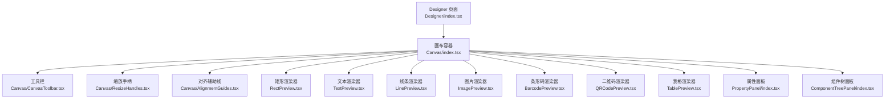
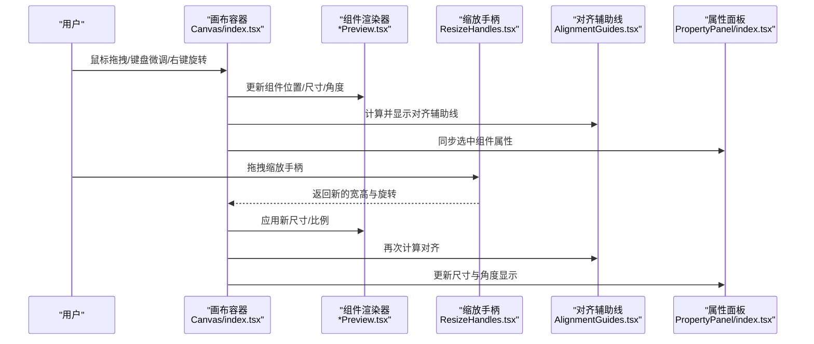
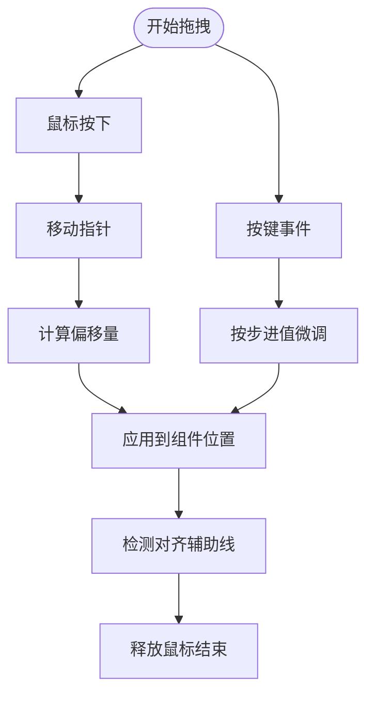
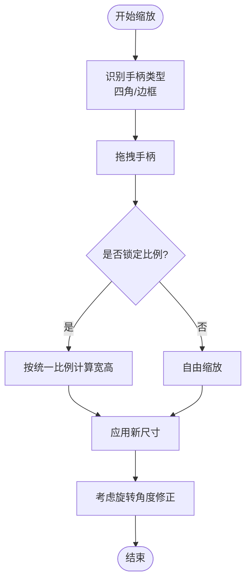
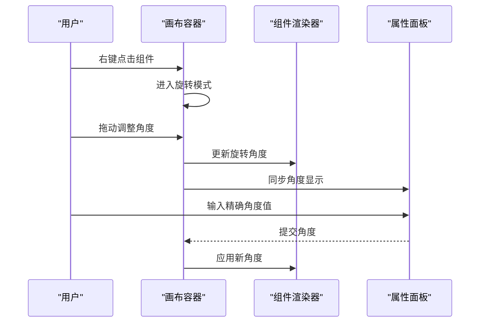
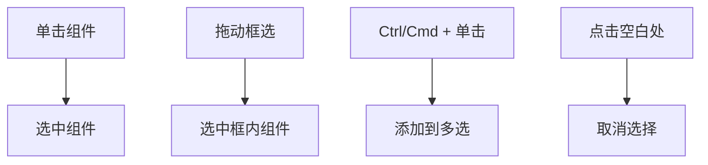
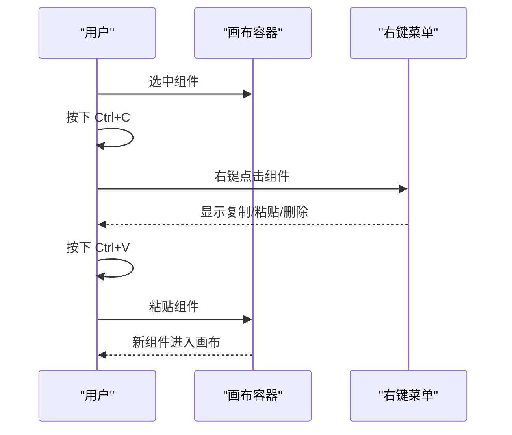
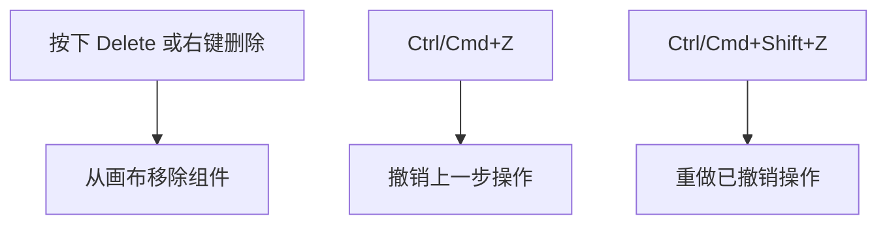
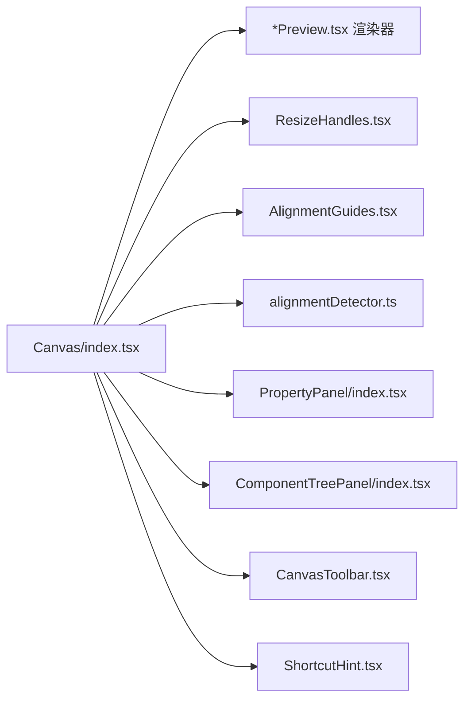

# 基础编辑操作

<cite>
**本文引用的文件**
- [index.tsx](file://designer/src/pages/Designer/components/Canvas/index.tsx)
- [ResizeHandles.tsx](file://designer/src/pages/Designer/components/Canvas/ResizeHandles.tsx)
- [AlignmentGuides.tsx](file://designer/src/pages/Designer/components/Canvas/AlignmentGuides.tsx)
- [CanvasToolbar.tsx](file://designer/src/pages/Designer/components/Canvas/CanvasToolbar.tsx)
- [ShortcutHint.tsx](file://designer/src/pages/Designer/components/Canvas/ShortcutHint.tsx)
- [alignmentDetector.ts](file://designer/src/pages/Designer/components/Canvas/alignmentDetector.ts)
- [index.tsx](file://designer/src/pages/Designer/components/Canvas/componentRenderers/RectPreview.tsx)
- [index.tsx](file://designer/src/pages/Designer/components/Canvas/componentRenderers/TextPreview.tsx)
- [index.tsx](file://designer/src/pages/Designer/components/Canvas/componentRenderers/LinePreview.tsx)
- [index.tsx](file://designer/src/pages/Designer/components/Canvas/componentRenderers/ImagePreview.tsx)
- [index.tsx](file://designer/src/pages/Designer/components/Canvas/componentRenderers/BarcodePreview.tsx)
- [index.tsx](file://designer/src/pages/Designer/components/Canvas/componentRenderers/QRCodePreview.tsx)
- [index.tsx](file://designer/src/pages/Designer/components/Canvas/componentRenderers/TablePreview.tsx)
- [index.tsx](file://designer/src/pages/Designer/components/PropertyPanel/index.tsx)
- [index.tsx](file://designer/src/pages/Designer/components/ComponentTreePanel/index.tsx)
- [index.tsx](file://designer/src/pages/Designer/index.tsx)
</cite>

## 目录
1. [简介](#简介)
2. [项目结构](#项目结构)
3. [核心组件](#核心组件)
4. [架构总览](#架构总览)
5. [详细组件分析](#详细组件分析)
6. [依赖关系分析](#依赖关系分析)
7. [性能考虑](#性能考虑)
8. [故障排除指南](#故障排除指南)
9. [结论](#结论)
10. [附录：快捷键与操作技巧](#附录：快捷键与操作技巧)

## 简介
本指南面向设计师与开发者，系统讲解画布上组件的基础编辑操作：拖拽移动（鼠标拖拽、键盘方向键微调、坐标精确定位）、缩放调整（四角/边框拖拽、统一比例缩放）、旋转（右键旋转、角度输入、旋转中心点设置）、选择机制（单击、框选、多选、取消选择）、复制粘贴（快捷键与右键菜单）、删除与撤销/重做，以及常用快捷键与操作技巧。内容基于实际代码实现进行梳理，帮助用户高效完成页面设计。

## 项目结构
围绕“画布”（Canvas）的核心模块包含以下关键文件：
- 画布容器与渲染：Canvas/index.tsx
- 缩放手柄：Canvas/ResizeHandles.tsx
- 对齐辅助线：Canvas/AlignmentGuides.tsx 与 Canvas/alignmentDetector.ts
- 工具栏与提示：Canvas/CanvasToolbar.tsx、Canvas/ShortcutHint.tsx
- 组件渲染器：Canvas/componentRenderers/*Preview.tsx（矩形、文本、线条、图片、条形码、二维码、表格）
- 属性面板与组件树：PropertyPanel/index.tsx、ComponentTreePanel/index.tsx
- 入口集成：Designer/index.tsx

**图表来源**
- [index.tsx](file://designer/src/pages/Designer/index.tsx)
- [index.tsx](file://designer/src/pages/Designer/components/Canvas/index.tsx)
- [CanvasToolbar.tsx](file://designer/src/pages/Designer/components/Canvas/CanvasToolbar.tsx)
- [ResizeHandles.tsx](file://designer/src/pages/Designer/components/Canvas/ResizeHandles.tsx)
- [AlignmentGuides.tsx](file://designer/src/pages/Designer/components/Canvas/AlignmentGuides.tsx)
- [index.tsx](file://designer/src/pages/Designer/components/Canvas/componentRenderers/RectPreview.tsx)
- [index.tsx](file://designer/src/pages/Designer/components/Canvas/componentRenderers/TextPreview.tsx)
- [index.tsx](file://designer/src/pages/Designer/components/Canvas/componentRenderers/LinePreview.tsx)
- [index.tsx](file://designer/src/pages/Designer/components/Canvas/componentRenderers/ImagePreview.tsx)
- [index.tsx](file://designer/src/pages/Designer/components/Canvas/componentRenderers/BarcodePreview.tsx)
- [index.tsx](file://designer/src/pages/Designer/components/Canvas/componentRenderers/QRCodePreview.tsx)
- [index.tsx](file://designer/src/pages/Designer/components/Canvas/componentRenderers/TablePreview.tsx)
- [index.tsx](file://designer/src/pages/Designer/components/PropertyPanel/index.tsx)
- [index.tsx](file://designer/src/pages/Designer/components/ComponentTreePanel/index.tsx)

**章节来源**
- [index.tsx](file://designer/src/pages/Designer/index.tsx)
- [index.tsx](file://designer/src/pages/Designer/components/Canvas/index.tsx)

## 核心组件
- 画布容器：承载所有可编辑组件，处理选择、拖拽、缩放、旋转等交互，并与属性面板联动。
- 缩放手柄：提供四角/边框拖拽缩放能力，支持统一比例缩放。
- 对齐辅助线：在拖拽/缩放时提供视觉对齐参考。
- 工具栏与快捷键提示：提供常用操作入口与快捷键提示。
- 组件渲染器：针对不同组件类型提供可视化预览与交互支持。
- 属性面板与组件树：用于查看与修改被选中组件的布局与样式属性。

**章节来源**
- [index.tsx](file://designer/src/pages/Designer/components/Canvas/index.tsx)
- [ResizeHandles.tsx](file://designer/src/pages/Designer/components/Canvas/ResizeHandles.tsx)
- [AlignmentGuides.tsx](file://designer/src/pages/Designer/components/Canvas/AlignmentGuides.tsx)
- [CanvasToolbar.tsx](file://designer/src/pages/Designer/components/Canvas/CanvasToolbar.tsx)
- [ShortcutHint.tsx](file://designer/src/pages/Designer/components/Canvas/ShortcutHint.tsx)
- [index.tsx](file://designer/src/pages/Designer/components/Canvas/componentRenderers/RectPreview.tsx)
- [index.tsx](file://designer/src/pages/Designer/components/Canvas/componentRenderers/TextPreview.tsx)
- [index.tsx](file://designer/src/pages/Designer/components/Canvas/componentRenderers/LinePreview.tsx)
- [index.tsx](file://designer/src/pages/Designer/components/Canvas/componentRenderers/ImagePreview.tsx)
- [index.tsx](file://designer/src/pages/Designer/components/Canvas/componentRenderers/BarcodePreview.tsx)
- [index.tsx](file://designer/src/pages/Designer/components/Canvas/componentRenderers/QRCodePreview.tsx)
- [index.tsx](file://designer/src/pages/Designer/components/Canvas/componentRenderers/TablePreview.tsx)
- [index.tsx](file://designer/src/pages/Designer/components/PropertyPanel/index.tsx)
- [index.tsx](file://designer/src/pages/Designer/components/ComponentTreePanel/index.tsx)

## 架构总览
下图展示从用户交互到组件更新的典型流程：用户在画布上进行拖拽/缩放/旋转，画布内部通过状态管理更新组件几何信息，同时属性面板与组件树实时反映变化。

**图表来源**
- [index.tsx](file://designer/src/pages/Designer/components/Canvas/index.tsx)
- [ResizeHandles.tsx](file://designer/src/pages/Designer/components/Canvas/ResizeHandles.tsx)
- [AlignmentGuides.tsx](file://designer/src/pages/Designer/components/Canvas/AlignmentGuides.tsx)
- [index.tsx](file://designer/src/pages/Designer/components/Canvas/componentRenderers/RectPreview.tsx)
- [index.tsx](file://designer/src/pages/Designer/components/PropertyPanel/index.tsx)

## 详细组件分析

### 拖拽移动（鼠标拖拽、键盘方向键微调、坐标精确定位）
- 鼠标拖拽：在画布容器中监听指针事件，记录初始位置与当前偏移，计算组件的新位置并更新状态；拖拽过程中可触发对齐辅助线以提升排版精度。
- 键盘方向键微调：监听键盘事件，按步进值对组件位置进行小幅调整，适合精细对齐。
- 坐标精确定位：通过属性面板中的布局区域输入精确的 left/top/width/height/rotate 值，立即应用到选中组件。

**图表来源**
- [index.tsx](file://designer/src/pages/Designer/components/Canvas/index.tsx)
- [AlignmentGuides.tsx](file://designer/src/pages/Designer/components/Canvas/AlignmentGuides.tsx)
- [alignmentDetector.ts](file://designer/src/pages/Designer/components/Canvas/alignmentDetector.ts)
- [index.tsx](file://designer/src/pages/Designer/components/PropertyPanel/index.tsx)

**章节来源**
- [index.tsx](file://designer/src/pages/Designer/components/Canvas/index.tsx)
- [AlignmentGuides.tsx](file://designer/src/pages/Designer/components/Canvas/AlignmentGuides.tsx)
- [alignmentDetector.ts](file://designer/src/pages/Designer/components/Canvas/alignmentDetector.ts)
- [index.tsx](file://designer/src/pages/Designer/components/PropertyPanel/index.tsx)

### 缩放调整（四角/边框拖拽、统一比例缩放）
- 四角/边框拖拽：缩放手柄位于组件边界，用户拖动任一角落或边缘改变宽高；根据拖拽方向与约束计算新的尺寸。
- 统一比例缩放：启用比例锁定后，宽高按相同比例缩放，保持组件纵横比不变。
- 旋转影响：若组件存在旋转角度，缩放需结合旋转矩阵进行坐标变换，确保手柄位置与视觉一致。

**图表来源**
- [ResizeHandles.tsx](file://designer/src/pages/Designer/components/Canvas/ResizeHandles.tsx)
- [index.tsx](file://designer/src/pages/Designer/components/Canvas/index.tsx)

**章节来源**
- [ResizeHandles.tsx](file://designer/src/pages/Designer/components/Canvas/ResizeHandles.tsx)
- [index.tsx](file://designer/src/pages/Designer/components/Canvas/index.tsx)

### 旋转操作（右键旋转、角度输入、旋转中心点设置）
- 右键旋转：在组件上右键点击，弹出旋转菜单或直接进入旋转模式，拖动以改变角度。
- 角度输入：在属性面板中直接输入角度值，支持小数与负值。
- 旋转中心点：可在属性面板设置旋转中心（如中心点、左上角等），影响旋转时的视觉效果与对齐。

**图表来源**
- [index.tsx](file://designer/src/pages/Designer/components/Canvas/index.tsx)
- [index.tsx](file://designer/src/pages/Designer/components/PropertyPanel/index.tsx)

**章节来源**
- [index.tsx](file://designer/src/pages/Designer/components/Canvas/index.tsx)
- [index.tsx](file://designer/src/pages/Designer/components/PropertyPanel/index.tsx)

### 选择机制（单击、框选、多选、取消选择）
- 单击选择：点击组件即可选中，属性面板显示该组件的属性。
- 框选：在画布上按住鼠标拖动形成矩形框，框内组件全部选中。
- 多选：按住 Ctrl/Cmd 并点击多个组件，或在框选基础上继续添加。
- 取消选择：点击空白处或再次点击已选组件可取消选择。

**图表来源**
- [index.tsx](file://designer/src/pages/Designer/components/Canvas/index.tsx)
- [index.tsx](file://designer/src/pages/Designer/components/PropertyPanel/index.tsx)

**章节来源**
- [index.tsx](file://designer/src/pages/Designer/components/Canvas/index.tsx)
- [index.tsx](file://designer/src/pages/Designer/components/PropertyPanel/index.tsx)

### 复制粘贴（快捷键与右键菜单）
- 快捷键：复制（Ctrl/Cmd+C）、剪切（Ctrl/Cmd+X）、粘贴（Ctrl/Cmd+V）。
- 右键菜单：在组件上右键打开上下文菜单，包含复制、粘贴、删除等选项。
- 粘贴位置：默认粘贴到原组件附近，可继续拖动定位。

**图表来源**
- [index.tsx](file://designer/src/pages/Designer/components/Canvas/index.tsx)

**章节来源**
- [index.tsx](file://designer/src/pages/Designer/components/Canvas/index.tsx)

### 删除与撤销/重做
- 删除：选中组件后按 Delete 键或在右键菜单中选择删除，组件从画布移除。
- 撤销/重做：通过工具栏按钮或快捷键（Ctrl/Cmd+Z / Ctrl/Cmd+Shift+Z）进行历史操作回退与恢复。

**图表来源**
- [CanvasToolbar.tsx](file://designer/src/pages/Designer/components/Canvas/CanvasToolbar.tsx)
- [index.tsx](file://designer/src/pages/Designer/components/Canvas/index.tsx)

**章节来源**
- [CanvasToolbar.tsx](file://designer/src/pages/Designer/components/Canvas/CanvasToolbar.tsx)
- [index.tsx](file://designer/src/pages/Designer/components/Canvas/index.tsx)

## 依赖关系分析
- 画布容器依赖各组件渲染器以实现可视化与交互；依赖缩放手柄与对齐辅助线提供编辑体验；依赖属性面板与组件树实现属性同步。
- 工具栏与快捷键提示为用户提供操作入口与帮助信息。
- 对齐检测器在拖拽/缩放过程中计算对齐参考线，提升排版效率。

**图表来源**
- [index.tsx](file://designer/src/pages/Designer/components/Canvas/index.tsx)
- [ResizeHandles.tsx](file://designer/src/pages/Designer/components/Canvas/ResizeHandles.tsx)
- [AlignmentGuides.tsx](file://designer/src/pages/Designer/components/Canvas/AlignmentGuides.tsx)
- [alignmentDetector.ts](file://designer/src/pages/Designer/components/Canvas/alignmentDetector.ts)
- [index.tsx](file://designer/src/pages/Designer/components/PropertyPanel/index.tsx)
- [index.tsx](file://designer/src/pages/Designer/components/ComponentTreePanel/index.tsx)
- [CanvasToolbar.tsx](file://designer/src/pages/Designer/components/Canvas/CanvasToolbar.tsx)
- [ShortcutHint.tsx](file://designer/src/pages/Designer/components/Canvas/ShortcutHint.tsx)

**章节来源**
- [index.tsx](file://designer/src/pages/Designer/components/Canvas/index.tsx)
- [ResizeHandles.tsx](file://designer/src/pages/Designer/components/Canvas/ResizeHandles.tsx)
- [AlignmentGuides.tsx](file://designer/src/pages/Designer/components/Canvas/AlignmentGuides.tsx)
- [alignmentDetector.ts](file://designer/src/pages/Designer/components/Canvas/alignmentDetector.ts)
- [index.tsx](file://designer/src/pages/Designer/components/PropertyPanel/index.tsx)
- [index.tsx](file://designer/src/pages/Designer/components/ComponentTreePanel/index.tsx)
- [CanvasToolbar.tsx](file://designer/src/pages/Designer/components/Canvas/CanvasToolbar.tsx)
- [ShortcutHint.tsx](file://designer/src/pages/Designer/components/Canvas/ShortcutHint.tsx)

## 性能考虑
- 批量更新：在拖拽/缩放过程中采用节流/防抖策略，减少频繁重绘。
- 虚拟化：对于大量组件的场景，优先考虑可视区域内的组件渲染。
- 对齐辅助线：仅在需要时计算与绘制，避免不必要的 DOM 更新。
- 属性面板：只在选中组件变化时刷新，避免重复渲染。

## 故障排除指南
- 组件无法拖拽：检查画布容器是否正确绑定指针事件，确认未被其他遮挡层拦截。
- 缩放异常：确认比例锁定状态与旋转角度设置，避免非预期的缩放行为。
- 对齐无效：检查对齐辅助线开关与网格吸附设置，确保检测逻辑正常工作。
- 属性不更新：确认组件选择状态与属性面板绑定是否正确，必要时手动刷新。
- 快捷键无响应：检查浏览器焦点与快捷键冲突，确认工具栏与提示组件未禁用相关功能。

**章节来源**
- [index.tsx](file://designer/src/pages/Designer/components/Canvas/index.tsx)
- [ResizeHandles.tsx](file://designer/src/pages/Designer/components/Canvas/ResizeHandles.tsx)
- [AlignmentGuides.tsx](file://designer/src/pages/Designer/components/Canvas/AlignmentGuides.tsx)
- [CanvasToolbar.tsx](file://designer/src/pages/Designer/components/Canvas/CanvasToolbar.tsx)
- [ShortcutHint.tsx](file://designer/src/pages/Designer/components/Canvas/ShortcutHint.tsx)

## 结论
通过画布容器与渲染器的协同、缩放手柄与对齐辅助线的配合、属性面板与组件树的联动，系统提供了完整的组件基础编辑能力。掌握拖拽、缩放、旋转、选择、复制粘贴、删除与撤销/重做的操作流程，能够显著提升页面设计效率与精度。

## 附录：快捷键与操作技巧
- 拖拽移动：鼠标拖拽；方向键微调；属性面板输入精确坐标。
- 缩放：拖拽四角/边框；启用比例锁定；结合旋转角度修正。
- 旋转：右键旋转或属性面板输入角度；设置旋转中心点。
- 选择：单击、框选、多选（Ctrl/Cmd）、取消选择（点击空白处）。
- 复制粘贴：Ctrl/Cmd+C/V；右键菜单复制/粘贴。
- 删除与撤销/重做：Delete 键或右键删除；Ctrl/Cmd+Z 撤销；Ctrl/Cmd+Shift+Z 重做。
- 操作技巧：拖拽时开启对齐辅助线；缩放前锁定比例；旋转时设置合适的中心点；批量操作建议使用框选与多选。