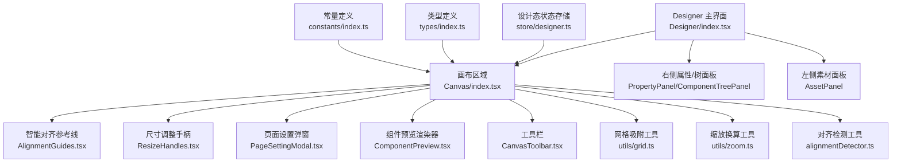
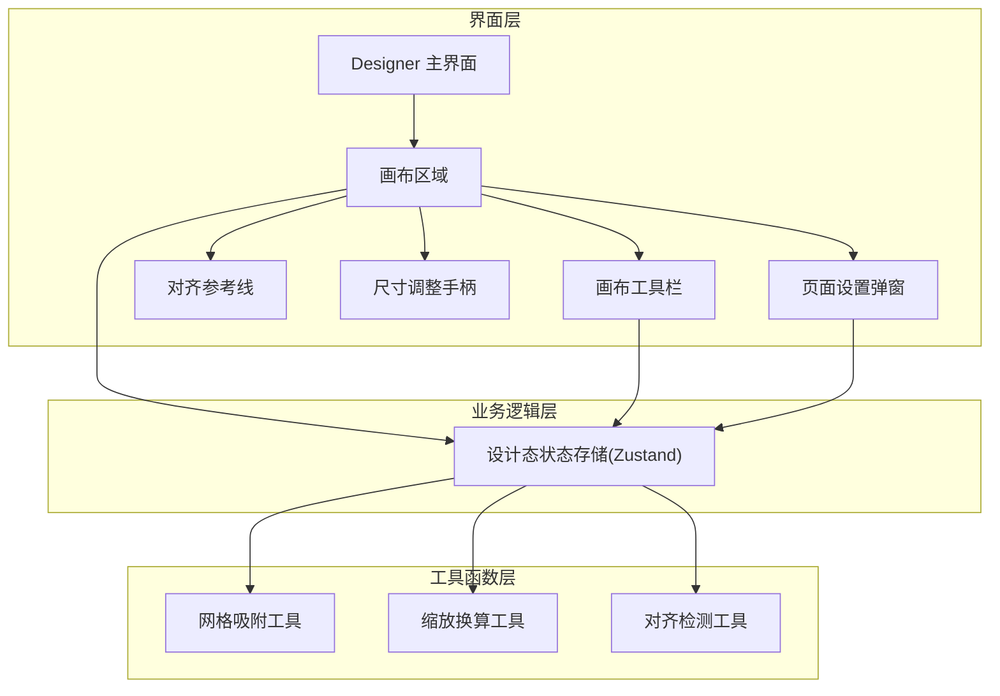
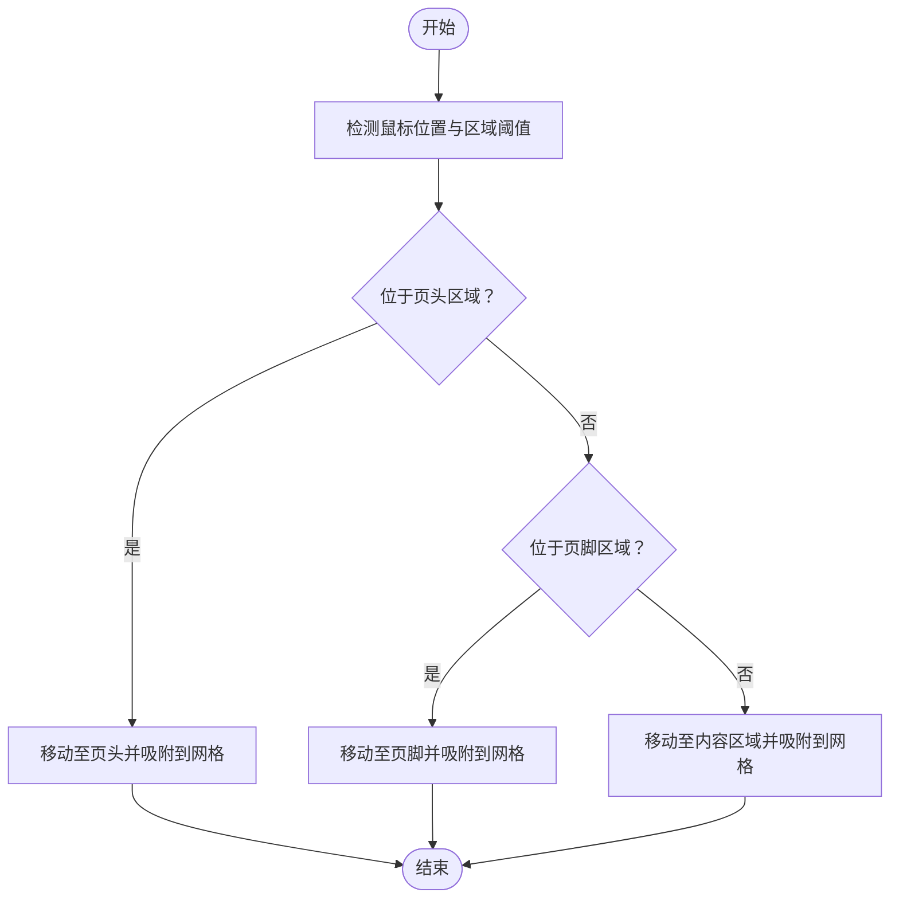
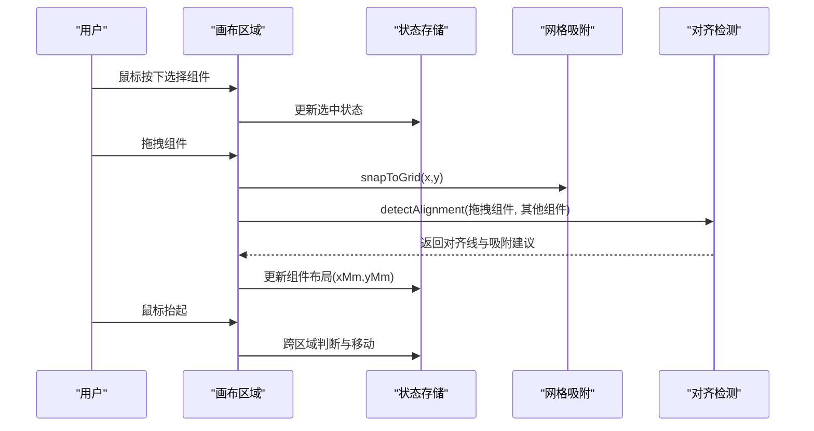
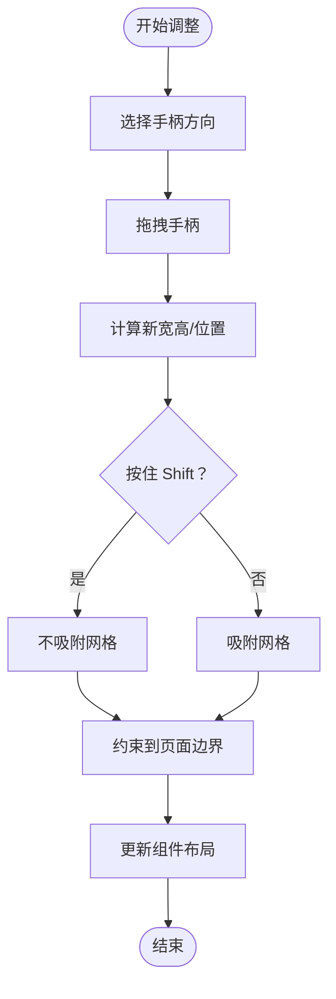
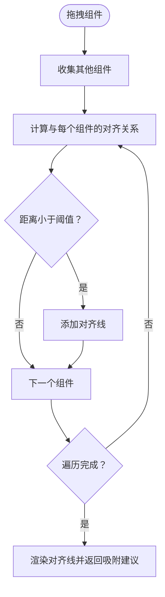
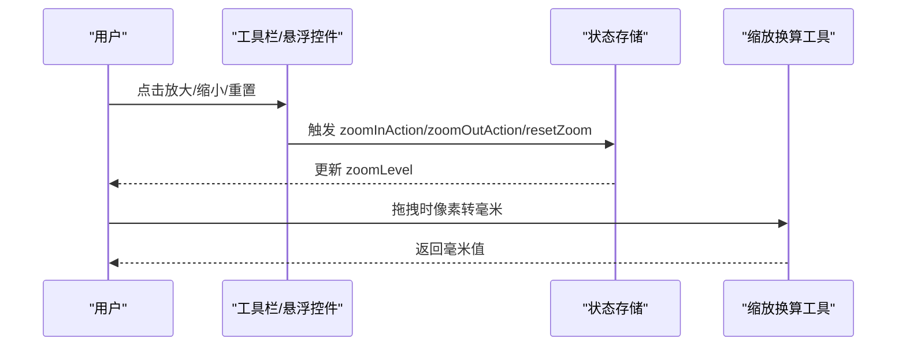
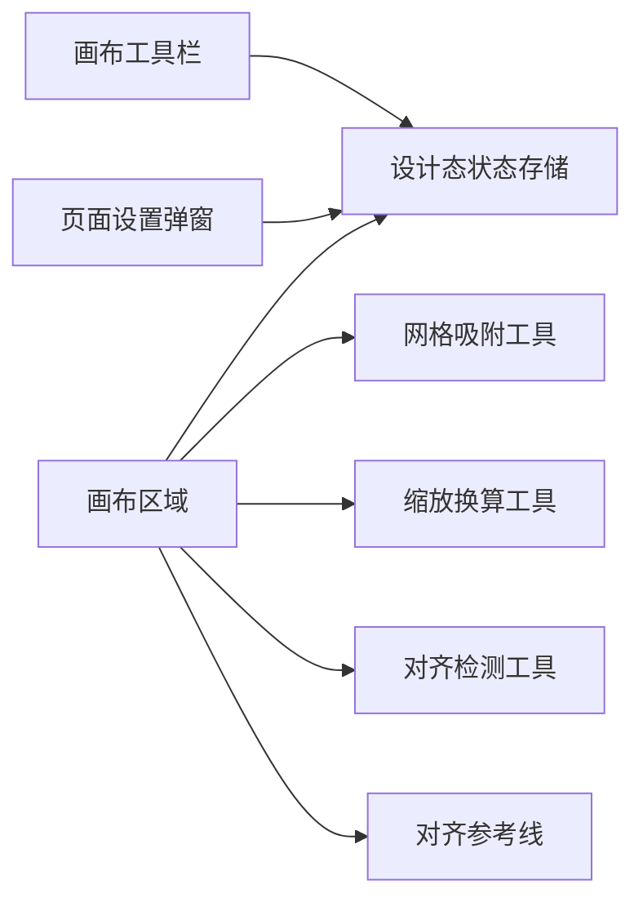

# 画布编辑器

<cite>
**本文引用的文件**
- [Designer 主界面](file://designer/src/pages/Designer/index.tsx)
- [画布区域](file://designer/src/pages/Designer/components/Canvas/index.tsx)
- [智能对齐参考线](file://designer/src/pages/Designer/components/Canvas/AlignmentGuides.tsx)
- [对齐检测工具](file://designer/src/pages/Designer/components/Canvas/alignmentDetector.ts)
- [网格吸附工具](file://designer/src/utils/grid.ts)
- [缩放换算工具](file://designer/src/utils/zoom.ts)
- [画布工具栏](file://designer/src/pages/Designer/components/Canvas/CanvasToolbar.tsx)
- [尺寸调整手柄](file://designer/src/pages/Designer/components/Canvas/ResizeHandles.tsx)
- [组件预览渲染器](file://designer/src/pages/Designer/components/Canvas/ComponentPreview.tsx)
- [页面设置弹窗](file://designer/src/pages/Designer/components/Canvas/PageSettingModal.tsx)
- [设计态状态存储](file://designer/src/store/designer.ts)
- [类型定义](file://designer/src/types/index.ts)
- [常量定义](file://designer/src/constants/index.ts)
</cite>

## 目录
1. [简介](#简介)
2. [项目结构](#项目结构)
3. [核心组件](#核心组件)
4. [架构总览](#架构总览)
5. [详细组件分析](#详细组件分析)
6. [依赖关系分析](#依赖关系分析)
7. [性能考量](#性能考量)
8. [故障排查指南](#故障排查指南)
9. [结论](#结论)
10. [附录](#附录)

## 简介
本指南面向画布编辑器使用者，系统讲解三区域画布系统（页头/内容/页脚）的设计原理与使用方法，覆盖组件拖拽移动、缩放调整、旋转操作、智能网格吸附、对齐辅助线、组件选择与多选、画布缩放、层级管理与遮挡关系处理，并提供最佳实践与技巧。

## 项目结构
- 设计器主界面负责布局、面板折叠、悬浮缩放控件、模板调试抽屉等。
- 画布区域承载三区域布局、组件拖拽、尺寸调整、对齐辅助线、页面设置、缩放控制等核心交互。
- 工具与状态层通过 Zustand 状态存储统一管理组件、页面配置、网格、缩放、历史等。
- 工具函数提供网格吸附、像素/毫米换算、对齐检测等能力。

图表来源
- [Designer 主界面:1-365](file://designer/src/pages/Designer/index.tsx#L1-L365)
- [画布区域:1-800](file://designer/src/pages/Designer/components/Canvas/index.tsx#L1-L800)
- [智能对齐参考线:1-66](file://designer/src/pages/Designer/components/Canvas/AlignmentGuides.tsx#L1-L66)
- [尺寸调整手柄:1-203](file://designer/src/pages/Designer/components/Canvas/ResizeHandles.tsx#L1-L203)
- [页面设置弹窗:1-357](file://designer/src/pages/Designer/components/Canvas/PageSettingModal.tsx#L1-L357)
- [组件预览渲染器:1-53](file://designer/src/pages/Designer/components/Canvas/ComponentPreview.tsx#L1-L53)
- [画布工具栏:1-166](file://designer/src/pages/Designer/components/Canvas/CanvasToolbar.tsx#L1-L166)
- [网格吸附工具:1-36](file://designer/src/utils/grid.ts#L1-L36)
- [缩放换算工具:1-72](file://designer/src/utils/zoom.ts#L1-L72)
- [对齐检测工具:1-127](file://designer/src/pages/Designer/components/Canvas/alignmentDetector.ts#L1-L127)
- [设计态状态存储:1-773](file://designer/src/store/designer.ts#L1-L773)
- [类型定义:1-378](file://designer/src/types/index.ts#L1-L378)
- [常量定义:1-20](file://designer/src/constants/index.ts#L1-L20)

章节来源
- [Designer 主界面:1-365](file://designer/src/pages/Designer/index.tsx#L1-L365)
- [画布区域:1-800](file://designer/src/pages/Designer/components/Canvas/index.tsx#L1-L800)

## 核心组件
- 三区域画布系统：页头（header）、内容（content）、页脚（footer）。支持开启/关闭与高度设置，连续纸模式下页头/页脚不可用。
- 组件拖拽：支持单选、多选、跨区域拖拽（页头/内容/页脚），拖拽时网格吸附与智能对齐辅助线实时显示。
- 尺寸调整：8个方向的手柄，支持按住 Shift 临时禁用网格吸附，限制最小尺寸与页面边界。
- 对齐与分布：支持左/中/右、上/中/下对齐，以及水平/垂直分布，跨区域不执行。
- 网格与缩放：网格大小可配置，缩放级别固定档位（25%/50%/75%/100%/125%/150%/200%），支持键盘与工具栏操作。
- 层级管理：置顶、置底、上移一层、下移一层，按区域感知排序。
- 页面设置：纸张尺寸（A4/A5/自定义/连续纸）、方向、边距、页头/页脚、页码配置。

章节来源
- [画布区域:1-800](file://designer/src/pages/Designer/components/Canvas/index.tsx#L1-L800)
- [设计态状态存储:1-773](file://designer/src/store/designer.ts#L1-L773)
- [类型定义:87-123](file://designer/src/types/index.ts#L87-L123)

## 架构总览
画布编辑器采用“界面层 + 业务逻辑层 + 工具函数层”的分层架构：
- 界面层：Designer 主界面、画布区域、工具栏、弹窗等。
- 业务逻辑层：Zustand 状态存储，集中管理组件、页面配置、网格、缩放、历史、对齐与分布、层级等。
- 工具函数层：网格吸附、像素/毫米换算、对齐检测等纯函数工具。

图表来源
- [Designer 主界面:1-365](file://designer/src/pages/Designer/index.tsx#L1-L365)
- [画布区域:1-800](file://designer/src/pages/Designer/components/Canvas/index.tsx#L1-L800)
- [画布工具栏:1-166](file://designer/src/pages/Designer/components/Canvas/CanvasToolbar.tsx#L1-L166)
- [智能对齐参考线:1-66](file://designer/src/pages/Designer/components/Canvas/AlignmentGuides.tsx#L1-L66)
- [尺寸调整手柄:1-203](file://designer/src/pages/Designer/components/Canvas/ResizeHandles.tsx#L1-L203)
- [页面设置弹窗:1-357](file://designer/src/pages/Designer/components/Canvas/PageSettingModal.tsx#L1-L357)
- [设计态状态存储:1-773](file://designer/src/store/designer.ts#L1-L773)
- [网格吸附工具:1-36](file://designer/src/utils/grid.ts#L1-L36)
- [缩放换算工具:1-72](file://designer/src/utils/zoom.ts#L1-L72)
- [对齐检测工具:1-127](file://designer/src/pages/Designer/components/Canvas/alignmentDetector.ts#L1-L127)

## 详细组件分析

### 三区域画布系统（页头/内容/页脚）
- 区域构成：页头、内容、页脚三部分，支持独立开关与高度设置；连续纸模式下页头/页脚不可用。
- 区域高度限制：页头/页脚最小高度 15mm，且内容区域至少保留 30mm。
- 跨区域拖拽：拖拽组件时根据鼠标位置判断目标区域，自动移动至相应区域并吸附到网格。
- 页面尺寸与方向：支持 A4/A5、自定义、连续纸；横版时宽高互换。

图表来源
- [画布区域:646-685](file://designer/src/pages/Designer/components/Canvas/index.tsx#L646-L685)

章节来源
- [画布区域:108-129](file://designer/src/pages/Designer/components/Canvas/index.tsx#L108-L129)
- [画布区域:646-685](file://designer/src/pages/Designer/components/Canvas/index.tsx#L646-L685)
- [页面设置弹窗:1-357](file://designer/src/pages/Designer/components/Canvas/PageSettingModal.tsx#L1-L357)
- [类型定义:87-123](file://designer/src/types/index.ts#L87-L123)

### 组件拖拽移动
- 单选与多选：点击选择，按住 Ctrl/Cmd 多选；拖拽时支持整体移动。
- 网格吸附：拖拽过程中实时吸附到网格，按住 Shift 可临时禁用吸附。
- 智能对齐：单个组件拖拽时检测与其他组件的对齐关系，显示对齐参考线并提供吸附建议。
- 越界保护：组件不能超出页面边界，连续纸模式仅检测宽度。

图表来源
- [画布区域:502-699](file://designer/src/pages/Designer/components/Canvas/index.tsx#L502-L699)
- [网格吸附工具:12-15](file://designer/src/utils/grid.ts#L12-L15)
- [对齐检测工具:31-126](file://designer/src/pages/Designer/components/Canvas/alignmentDetector.ts#L31-L126)
- [设计态状态存储:126-137](file://designer/src/store/designer.ts#L126-L137)

章节来源
- [画布区域:502-699](file://designer/src/pages/Designer/components/Canvas/index.tsx#L502-L699)
- [网格吸附工具:12-15](file://designer/src/utils/grid.ts#L12-L15)
- [对齐检测工具:31-126](file://designer/src/pages/Designer/components/Canvas/alignmentDetector.ts#L31-L126)
- [设计态状态存储:126-137](file://designer/src/store/designer.ts#L126-L137)

### 尺寸调整与旋转
- 尺寸调整：8个方向手柄，支持四角与四边调整；按住 Shift 可临时禁用网格吸附；限制最小尺寸与页面边界。
- 旋转：当前实现未提供旋转操作入口，如需旋转可在属性面板扩展或通过自定义渲染器实现。

图表来源
- [尺寸调整手柄:36-152](file://designer/src/pages/Designer/components/Canvas/ResizeHandles.tsx#L36-L152)
- [网格吸附工具:12-15](file://designer/src/utils/grid.ts#L12-L15)

章节来源
- [尺寸调整手柄:1-203](file://designer/src/pages/Designer/components/Canvas/ResizeHandles.tsx#L1-L203)
- [网格吸附工具:12-15](file://designer/src/utils/grid.ts#L12-L15)

### 智能网格吸附系统
- 启用/禁用：工具栏切换网格显示；按住 Shift 可临时禁用吸附。
- 网格大小：支持 5mm 等网格大小配置。
- 应用场景：拖拽移动、尺寸调整、粘贴克隆时自动偏移到最近网格点。

章节来源
- [画布工具栏:144-151](file://designer/src/pages/Designer/components/Canvas/CanvasToolbar.tsx#L144-L151)
- [设计态状态存储:348-351](file://designer/src/store/designer.ts#L348-L351)
- [网格吸附工具:12-15](file://designer/src/utils/grid.ts#L12-L15)

### 对齐辅助线与智能对齐
- 显示条件：仅在单个组件拖拽时显示，检测阈值约 0.8mm。
- 对齐类型：垂直对齐（左/右/中心）与水平对齐（上/下/中心）。
- 参考线渲染：将毫米坐标按缩放比例转换为像素位置，显示在画布上。

图表来源
- [对齐检测工具:31-126](file://designer/src/pages/Designer/components/Canvas/alignmentDetector.ts#L31-L126)
- [智能对齐参考线:21-63](file://designer/src/pages/Designer/components/Canvas/AlignmentGuides.tsx#L21-L63)

章节来源
- [对齐检测工具:11-126](file://designer/src/pages/Designer/components/Canvas/alignmentDetector.ts#L11-L126)
- [智能对齐参考线:1-66](file://designer/src/pages/Designer/components/Canvas/AlignmentGuides.tsx#L1-L66)

### 组件选择、多选与取消选择
- 单选：点击组件即可选中。
- 多选：按住 Ctrl/Cmd 点击多个组件，支持批量对齐与分布。
- 取消选择：点击画布空白处或再次点击已选中组件可清空选择。

章节来源
- [画布区域:490-500](file://designer/src/pages/Designer/components/Canvas/index.tsx#L490-L500)
- [设计态状态存储:151-168](file://designer/src/store/designer.ts#L151-L168)

### 画布缩放功能
- 缩放级别：固定档位 25%/50%/75%/100%/125%/150%/200%，支持重置为 100%。
- 操作方式：工具栏放大/缩小/重置；键盘快捷键 Ctrl++/Ctrl+/Ctrl+0；悬浮缩放控件。
- 换算关系：像素与毫米之间按缩放比例换算，保证对齐与吸附在不同缩放下一致。

图表来源
- [Designer 主界面:153-235](file://designer/src/pages/Designer/index.tsx#L153-L235)
- [设计态状态存储:354-358](file://designer/src/store/designer.ts#L354-L358)
- [缩放换算工具:30-42](file://designer/src/utils/zoom.ts#L30-L42)

章节来源
- [Designer 主界面:153-235](file://designer/src/pages/Designer/index.tsx#L153-L235)
- [设计态状态存储:354-358](file://designer/src/store/designer.ts#L354-L358)
- [缩放换算工具:1-72](file://designer/src/utils/zoom.ts#L1-L72)

### 组件层级管理与遮挡关系
- 层级操作：置顶、置底、上移一层、下移一层，均按区域感知执行。
- 遮挡关系：同一区域内后置组件在上层显示，可通过层级操作调整。

章节来源
- [设计态状态存储:360-466](file://designer/src/store/designer.ts#L360-L466)

### 对齐与分布
- 对齐：支持左/中/右、上/中/下对齐；垂直对齐不允许跨区域。
- 分布：支持水平/垂直分布，至少 3 个组件；垂直分布不允许跨区域。
- 区域约束：对齐与分布均考虑页头/页脚区域高度与内容区域可用高度。

章节来源
- [设计态状态存储:550-771](file://designer/src/store/designer.ts#L550-L771)

## 依赖关系分析
- 画布区域依赖状态存储以读取/更新组件、页面配置、网格、缩放、历史等。
- 画布区域依赖工具函数进行网格吸附与像素/毫米换算。
- 对齐检测依赖对齐参考线组件进行可视化展示。
- 页面设置弹窗负责更新页面配置，影响画布区域的尺寸、边距与区域高度。

图表来源
- [画布区域:1-800](file://designer/src/pages/Designer/components/Canvas/index.tsx#L1-L800)
- [设计态状态存储:1-773](file://designer/src/store/designer.ts#L1-L773)
- [网格吸附工具:1-36](file://designer/src/utils/grid.ts#L1-L36)
- [缩放换算工具:1-72](file://designer/src/utils/zoom.ts#L1-L72)
- [对齐检测工具:1-127](file://designer/src/pages/Designer/components/Canvas/alignmentDetector.ts#L1-L127)
- [智能对齐参考线:1-66](file://designer/src/pages/Designer/components/Canvas/AlignmentGuides.tsx#L1-L66)
- [画布工具栏:1-166](file://designer/src/pages/Designer/components/Canvas/CanvasToolbar.tsx#L1-L166)
- [页面设置弹窗:1-357](file://designer/src/pages/Designer/components/Canvas/PageSettingModal.tsx#L1-L357)

章节来源
- [画布区域:1-800](file://designer/src/pages/Designer/components/Canvas/index.tsx#L1-L800)
- [设计态状态存储:1-773](file://designer/src/store/designer.ts#L1-L773)

## 性能考量
- 事件监听优化：拖拽移动与尺寸调整使用 useRef 缓存状态，避免频繁重绑事件监听器。
- 闭包更新：通过 ref 保持最新状态引用，减少闭包过期导致的异常行为。
- 对齐检测：阈值与去重策略降低渲染开销，仅在单个组件拖拽时触发。
- 缩放一致性：像素/毫米换算统一由工具函数提供，保证不同缩放下的对齐与吸附精度。

[本节为通用指导，无需特定文件引用]

## 故障排查指南
- 组件无法拖拽：确认未处于可编辑输入框内；检查是否启用了网格吸附与 Shift 临时禁用。
- 对齐参考线不显示：仅在单个组件拖拽时显示；检查对齐阈值与组件间距。
- 跨区域移动无效：表格组件不允许放入页头/页脚；检查页面设置与区域开关。
- 缩放异常：确认键盘快捷键与工具栏操作；检查缩放级别是否在允许范围内。
- 多选失效：确认按住 Ctrl/Cmd；检查是否误触右键菜单。

章节来源
- [画布区域:146-220](file://designer/src/pages/Designer/components/Canvas/index.tsx#L146-L220)
- [对齐检测工具:31-126](file://designer/src/pages/Designer/components/Canvas/alignmentDetector.ts#L31-L126)
- [页面设置弹窗:480-481](file://designer/src/pages/Designer/components/Canvas/PageSettingModal.tsx#L480-L481)

## 结论
本画布编辑器围绕三区域画布系统，提供了完善的组件拖拽、尺寸调整、智能对齐、网格吸附、缩放与层级管理能力。通过清晰的分层架构与工具函数，确保了交互体验与开发可维护性。建议在实际使用中结合页面设置与网格配置，充分利用对齐与分布功能提升排版效率。

[本节为总结，无需特定文件引用]

## 附录

### 快捷键速查
- 删除：Delete/Backspace
- 复制：Ctrl/Cmd + C
- 粘贴：Ctrl/Cmd + V
- 撤销：Ctrl/Cmd + Z
- 重做：Ctrl/Cmd + Shift + Z
- 克隆：Ctrl/Cmd + D
- 放大：Ctrl/Cmd + +
- 缩小：Ctrl/Cmd + -
- 重置：Ctrl/Cmd + 0

章节来源
- [画布区域:146-220](file://designer/src/pages/Designer/components/Canvas/index.tsx#L146-L220)

### 最佳实践与技巧
- 使用网格与智能对齐快速实现精确布局。
- 多选组件后使用对齐与分布命令，统一视觉节奏。
- 合理设置页头/页脚高度，避免内容区域被过度压缩。
- 缩放至合适级别再进行精细调整，提高操作精度。
- 使用撤销/重做记录关键步骤，便于回溯修改。

[本节为通用指导，无需特定文件引用]