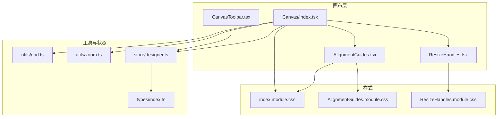
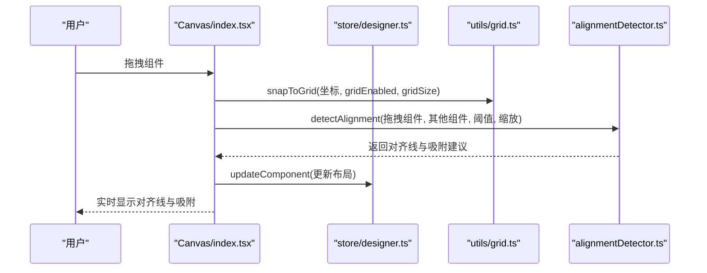
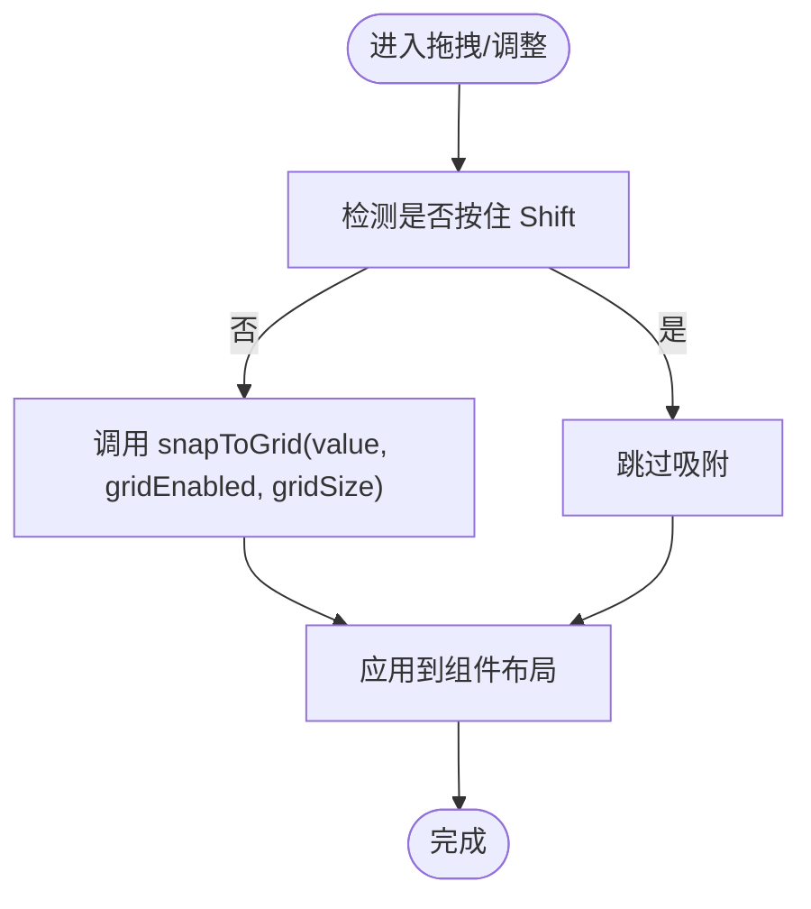
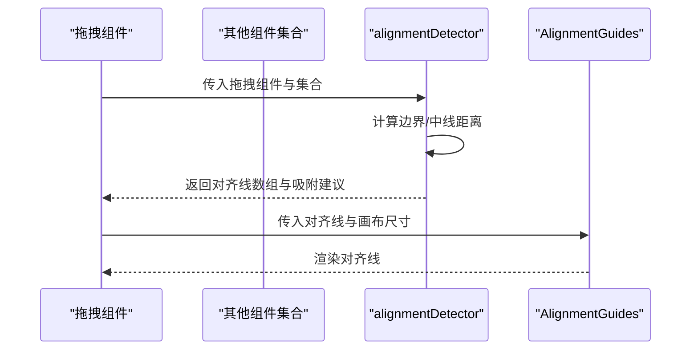
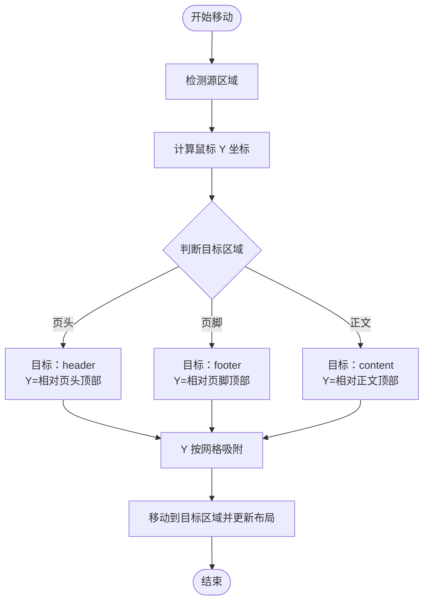
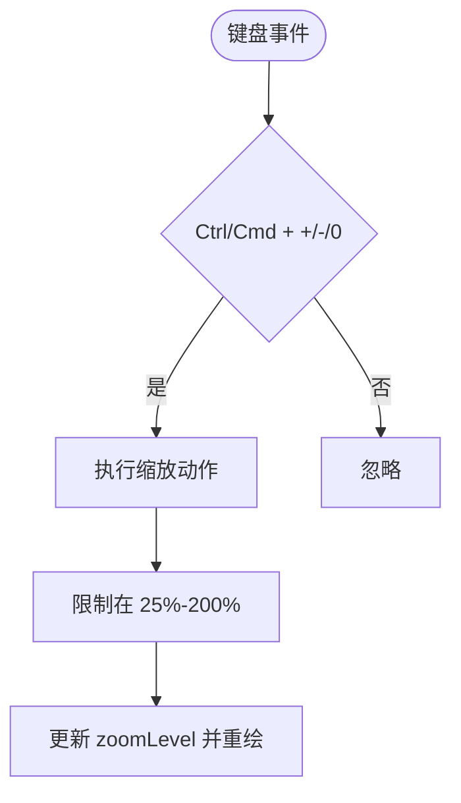
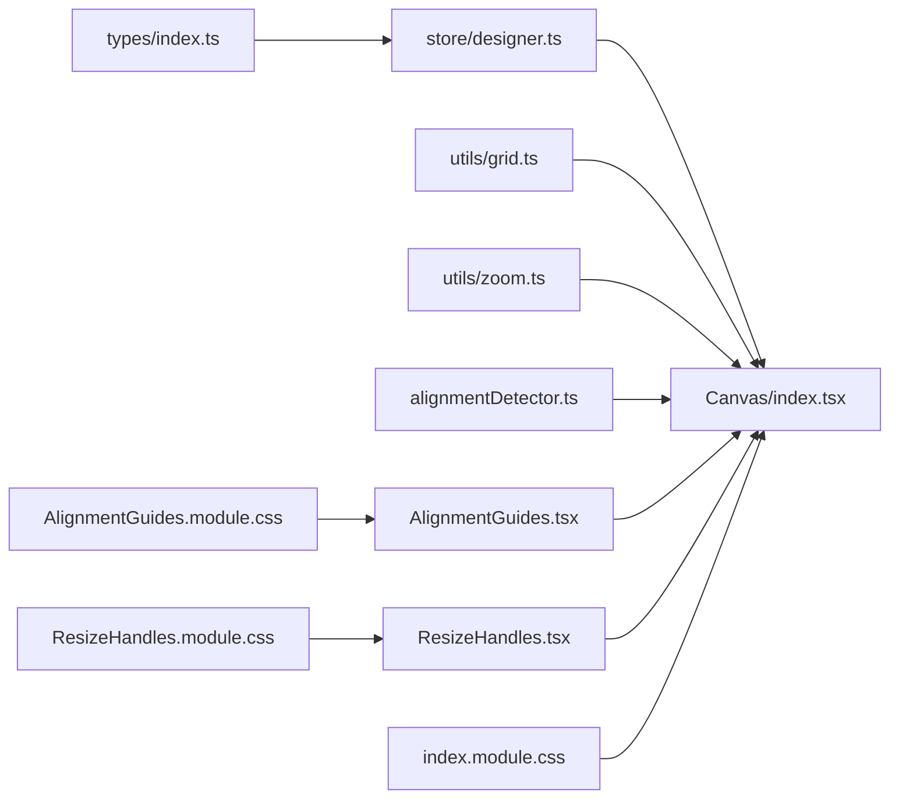

# 高级画布功能

<cite>
**本文引用的文件**
- [Canvas/index.tsx](file://designer/src/pages/Designer/components/Canvas/index.tsx)
- [grid.ts](file://designer/src/utils/grid.ts)
- [zoom.ts](file://designer/src/utils/zoom.ts)
- [AlignmentGuides.tsx](file://designer/src/pages/Designer/components/Canvas/AlignmentGuides.tsx)
- [alignmentDetector.ts](file://designer/src/pages/Designer/components/Canvas/alignmentDetector.ts)
- [CanvasToolbar.tsx](file://designer/src/pages/Designer/components/Canvas/CanvasToolbar.tsx)
- [ResizeHandles.tsx](file://designer/src/pages/Designer/components/Canvas/ResizeHandles.tsx)
- [index.module.css](file://designer/src/pages/Designer/components/Canvas/index.module.css)
- [AlignmentGuides.module.css](file://designer/src/pages/Designer/components/Canvas/AlignmentGuides.module.css)
- [ResizeHandles.module.css](file://designer/src/pages/Designer/components/Canvas/ResizeHandles.module.css)
- [designer.ts](file://designer/src/store/designer.ts)
- [types/index.ts](file://designer/src/types/index.ts)
</cite>

## 目录
1. [简介](#简介)
2. [项目结构](#项目结构)
3. [核心组件](#核心组件)
4. [架构总览](#架构总览)
5. [详细组件解析](#详细组件解析)
6. [依赖关系分析](#依赖关系分析)
7. [性能考量](#性能考量)
8. [故障排查指南](#故障排查指南)
9. [结论](#结论)
10. [附录](#附录)

## 简介
本指南面向高级用户，系统讲解设计器画布的高级功能，包括：
- 智能网格吸附系统：网格间距设置、吸附阈值、临时禁用吸附（按住 Shift）、网格显示/隐藏
- 对齐辅助线：水平对齐、垂直对齐、边距对齐、中心对齐等多维对齐
- 组件层级管理：置顶/置底、上移/下移、跨区域移动与遮挡关系
- 画布缩放：鼠标滚轮缩放、工具栏缩放按钮、键盘快捷键、缩放级别预设
- 画布滚动与视图导航
- 组件尺寸调整手柄：八向拉伸、最小尺寸约束、网格吸附
- 组件锁定与隐藏（概念性说明）

## 项目结构
画布功能主要集中在 Designer 页面的 Canvas 组件中，并通过 Zustand 状态管理器集中控制布局、缩放、网格、层级等状态。

**图表来源**
- [Canvas/index.tsx:1-1362](file://designer/src/pages/Designer/components/Canvas/index.tsx#L1-L1362)
- [CanvasToolbar.tsx:1-166](file://designer/src/pages/Designer/components/Canvas/CanvasToolbar.tsx#L1-L166)
- [AlignmentGuides.tsx:1-66](file://designer/src/pages/Designer/components/Canvas/AlignmentGuides.tsx#L1-L66)
- [ResizeHandles.tsx:1-203](file://designer/src/pages/Designer/components/Canvas/ResizeHandles.tsx#L1-L203)
- [grid.ts:1-36](file://designer/src/utils/grid.ts#L1-L36)
- [zoom.ts:1-72](file://designer/src/utils/zoom.ts#L1-L72)
- [designer.ts:1-773](file://designer/src/store/designer.ts#L1-L773)
- [types/index.ts:1-378](file://designer/src/types/index.ts#L1-L378)
- [index.module.css:1-159](file://designer/src/pages/Designer/components/Canvas/index.module.css#L1-L159)
- [AlignmentGuides.module.css:1-50](file://designer/src/pages/Designer/components/Canvas/AlignmentGuides.module.css#L1-L50)
- [ResizeHandles.module.css:1-138](file://designer/src/pages/Designer/components/Canvas/ResizeHandles.module.css#L1-L138)

**章节来源**
- [Canvas/index.tsx:1-1362](file://designer/src/pages/Designer/components/Canvas/index.tsx#L1-L1362)
- [CanvasToolbar.tsx:1-166](file://designer/src/pages/Designer/components/Canvas/CanvasToolbar.tsx#L1-L166)
- [AlignmentGuides.tsx:1-66](file://designer/src/pages/Designer/components/Canvas/AlignmentGuides.tsx#L1-L66)
- [ResizeHandles.tsx:1-203](file://designer/src/pages/Designer/components/Canvas/ResizeHandles.tsx#L1-L203)
- [grid.ts:1-36](file://designer/src/utils/grid.ts#L1-L36)
- [zoom.ts:1-72](file://designer/src/utils/zoom.ts#L1-L72)
- [designer.ts:1-773](file://designer/src/store/designer.ts#L1-L773)
- [types/index.ts:1-378](file://designer/src/types/index.ts#L1-L378)
- [index.module.css:1-159](file://designer/src/pages/Designer/components/Canvas/index.module.css#L1-L159)
- [AlignmentGuides.module.css:1-50](file://designer/src/pages/Designer/components/Canvas/AlignmentGuides.module.css#L1-L50)
- [ResizeHandles.module.css:1-138](file://designer/src/pages/Designer/components/Canvas/ResizeHandles.module.css#L1-L138)

## 核心组件
- 画布主容器与交互：Canvas/index.tsx
- 网格吸附工具：utils/grid.ts
- 缩放与像素换算：utils/zoom.ts
- 对齐辅助线渲染：AlignmentGuides.tsx
- 对齐检测算法：alignmentDetector.ts
- 画布工具栏：CanvasToolbar.tsx
- 尺寸调整手柄：ResizeHandles.tsx
- 状态与行为：store/designer.ts
- 类型定义：types/index.ts

**章节来源**
- [Canvas/index.tsx:1-1362](file://designer/src/pages/Designer/components/Canvas/index.tsx#L1-L1362)
- [grid.ts:1-36](file://designer/src/utils/grid.ts#L1-L36)
- [zoom.ts:1-72](file://designer/src/utils/zoom.ts#L1-L72)
- [AlignmentGuides.tsx:1-66](file://designer/src/pages/Designer/components/Canvas/AlignmentGuides.tsx#L1-L66)
- [alignmentDetector.ts:1-127](file://designer/src/pages/Designer/components/Canvas/alignmentDetector.ts#L1-L127)
- [CanvasToolbar.tsx:1-166](file://designer/src/pages/Designer/components/Canvas/CanvasToolbar.tsx#L1-L166)
- [ResizeHandles.tsx:1-203](file://designer/src/pages/Designer/components/Canvas/ResizeHandles.tsx#L1-L203)
- [designer.ts:1-773](file://designer/src/store/designer.ts#L1-L773)
- [types/index.ts:1-378](file://designer/src/types/index.ts#L1-L378)

## 架构总览
画布功能围绕“状态驱动 + 工具函数 + 视图组件”展开：
- 状态层：Zustand store 统一管理组件集合、选中态、页面配置、网格、缩放、层级等
- 工具层：网格吸附、像素/毫米换算、对齐检测
- 视图层：Canvas 主容器负责拖拽、放置、区域移动；AlignmentGuides 渲染对齐线；ResizeHandles 提供尺寸调整；CanvasToolbar 提供对齐/分布/网格/页面设置等入口

**图表来源**
- [Canvas/index.tsx:538-699](file://designer/src/pages/Designer/components/Canvas/index.tsx#L538-L699)
- [alignmentDetector.ts:31-126](file://designer/src/pages/Designer/components/Canvas/alignmentDetector.ts#L31-L126)
- [grid.ts:12-15](file://designer/src/utils/grid.ts#L12-L15)
- [designer.ts:126-137](file://designer/src/store/designer.ts#L126-L137)

## 详细组件解析

### 智能网格吸附系统
- 功能要点
  - 网格间距：通过状态管理器设置网格大小（单位 mm）
  - 吸附阈值：拖拽时对齐阈值（约 0.8mm），低于阈值触发吸附
  - 临时禁用：按住 Shift 键临时禁用吸附
  - 显示/隐藏：通过工具栏切换网格显示，样式由 CSS 背景网格实现
- 关键实现
  - 网格吸附工具：将数值四舍五入到最近网格点
  - 画布拖拽：在鼠标移动时调用吸附函数，并结合对齐检测返回的吸附建议
  - 尺寸调整：手柄拖拽时同样支持吸附（可按住 Shift 禁用）
  - 粘贴/克隆：粘贴与克隆时自动在网格上偏移一定距离，避免重叠

**图表来源**
- [Canvas/index.tsx:101-106](file://designer/src/pages/Designer/components/Canvas/index.tsx#L101-L106)
- [Canvas/index.tsx:578-596](file://designer/src/pages/Designer/components/Canvas/index.tsx#L578-L596)
- [ResizeHandles.tsx:118-124](file://designer/src/pages/Designer/components/Canvas/ResizeHandles.tsx#L118-L124)
- [grid.ts:12-15](file://designer/src/utils/grid.ts#L12-L15)

**章节来源**
- [Canvas/index.tsx:101-106](file://designer/src/pages/Designer/components/Canvas/index.tsx#L101-L106)
- [Canvas/index.tsx:578-596](file://designer/src/pages/Designer/components/Canvas/index.tsx#L578-L596)
- [ResizeHandles.tsx:118-124](file://designer/src/pages/Designer/components/Canvas/ResizeHandles.tsx#L118-L124)
- [CanvasToolbar.tsx:144-152](file://designer/src/pages/Designer/components/Canvas/CanvasToolbar.tsx#L144-L152)
- [index.module.css:64-69](file://designer/src/pages/Designer/components/Canvas/index.module.css#L64-L69)
- [grid.ts:12-15](file://designer/src/utils/grid.ts#L12-L15)

### 对齐辅助线与智能对齐
- 功能要点
  - 拖拽单个组件时，自动检测与其他组件的对齐关系
  - 支持垂直对齐（左/右/水平中线）与水平对齐（上/下/垂直中线）
  - 对齐线以参考线形式实时显示，吸附时自动对齐到最近对齐点
- 关键实现
  - 对齐检测：计算拖拽组件与其它组件的边界与中线距离，小于阈值则生成对齐线
  - 参考线渲染：将毫米坐标按缩放比例转换为像素位置，渲染为垂直/水平线
  - 吸附建议：返回 snapX/snapY，优先采用对齐吸附值

**图表来源**
- [alignmentDetector.ts:31-126](file://designer/src/pages/Designer/components/Canvas/alignmentDetector.ts#L31-L126)
- [AlignmentGuides.tsx:21-63](file://designer/src/pages/Designer/components/Canvas/AlignmentGuides.tsx#L21-L63)

**章节来源**
- [alignmentDetector.ts:11-126](file://designer/src/pages/Designer/components/Canvas/alignmentDetector.ts#L11-L126)
- [AlignmentGuides.tsx:9-66](file://designer/src/pages/Designer/components/Canvas/AlignmentGuides.tsx#L9-L66)
- [Canvas/index.tsx:582-599](file://designer/src/pages/Designer/components/Canvas/index.tsx#L582-L599)

### 组件层级管理（前后层级、遮挡关系、跨区域移动）
- 功能要点
  - 置顶/置底：在当前区域末尾/开头移动
  - 上移/下移：相邻交换顺序
  - 跨区域移动：根据鼠标位置判断目标区域 header/content/footer，并吸附到目标区域 Y 位置
- 关键实现
  - 区域感知：根据组件所在区域执行相应操作
  - 移动吸附：移动到目标区域时，Y 坐标按网格吸附
  - 状态持久化：每次操作均保存历史快照，支持撤销/重做

**图表来源**
- [Canvas/index.tsx:646-684](file://designer/src/pages/Designer/components/Canvas/index.tsx#L646-L684)
- [designer.ts:469-506](file://designer/src/store/designer.ts#L469-L506)

**章节来源**
- [designer.ts:360-466](file://designer/src/store/designer.ts#L360-L466)
- [designer.ts:469-506](file://designer/src/store/designer.ts#L469-L506)
- [Canvas/index.tsx:646-684](file://designer/src/pages/Designer/components/Canvas/index.tsx#L646-L684)

### 画布缩放与键盘快捷键
- 功能要点
  - 缩放级别：支持 25%/50%/75%/100%/125%/150%/200%
  - 鼠标滚轮：通过工具栏按钮或键盘快捷键放大/缩小/重置
  - 键盘快捷键：Ctrl/Cmd + “=” 或 “+” 放大；Ctrl/Cmd + “-” 缩小；Ctrl/Cmd + “0” 重置
- 关键实现
  - 缩放常量与换算：提供像素/毫米换算、缩放级别集合、步进与边界
  - 工具栏按钮：提供“放大/缩小/重置”入口
  - 键盘监听：在画布容器外监听全局键盘事件，避免焦点干扰

**图表来源**
- [Canvas/index.tsx:198-215](file://designer/src/pages/Designer/components/Canvas/index.tsx#L198-L215)
- [zoom.ts:9-72](file://designer/src/utils/zoom.ts#L9-L72)
- [CanvasToolbar.tsx:154-160](file://designer/src/pages/Designer/components/Canvas/CanvasToolbar.tsx#L154-L160)

**章节来源**
- [zoom.ts:9-72](file://designer/src/utils/zoom.ts#L9-L72)
- [Canvas/index.tsx:198-215](file://designer/src/pages/Designer/components/Canvas/index.tsx#L198-L215)
- [CanvasToolbar.tsx:154-160](file://designer/src/pages/Designer/components/Canvas/CanvasToolbar.tsx#L154-L160)

### 画布滚动与视图导航
- 功能要点
  - 画布容器使用滚动条承载超大页面或连续纸场景
  - 工具栏提供页面设置入口，支持 A4/A5/CUSTOM/CONTINUOUS 等多种尺寸与方向
- 关键实现
  - 容器样式：滚动区域、内边距与阴影
  - 页面尺寸计算：根据尺寸、方向与边距动态计算可用区域

**章节来源**
- [index.module.css:21-62](file://designer/src/pages/Designer/components/Canvas/index.module.css#L21-L62)
- [Canvas/index.tsx:109-129](file://designer/src/pages/Designer/components/Canvas/index.tsx#L109-L129)
- [CanvasToolbar.tsx:136-143](file://designer/src/pages/Designer/components/Canvas/CanvasToolbar.tsx#L136-L143)

### 组件尺寸调整手柄
- 功能要点
  - 八向拉伸：四个角与四条边共八个手柄
  - 最小尺寸：统一限制为 5mm
  - 网格吸附：默认启用，可按住 Shift 禁用
  - 页面边界约束：确保不超出页面范围
- 关键实现
  - 方向计算：根据拉伸方向计算宽高变化与位置偏移
  - 边界与吸附：在更新布局前进行最小尺寸与页面范围校验

**章节来源**
- [ResizeHandles.tsx:24-152](file://designer/src/pages/Designer/components/Canvas/ResizeHandles.tsx#L24-L152)
- [ResizeHandles.module.css:1-138](file://designer/src/pages/Designer/components/Canvas/ResizeHandles.module.css#L1-L138)

### 组件锁定与隐藏（概念性说明）
- 锁定：可通过状态扩展为“不可拖拽/调整/删除”，在交互层拦截对应事件
- 隐藏：通过 CSS 类切换或状态控制渲染与否
- 本仓库未提供现成实现，可基于当前状态与渲染机制扩展

[本节为概念性说明，不直接分析具体文件]

## 依赖关系分析

**图表来源**
- [designer.ts:1-773](file://designer/src/store/designer.ts#L1-L773)
- [Canvas/index.tsx:1-1362](file://designer/src/pages/Designer/components/Canvas/index.tsx#L1-L1362)
- [grid.ts:1-36](file://designer/src/utils/grid.ts#L1-L36)
- [zoom.ts:1-72](file://designer/src/utils/zoom.ts#L1-L72)
- [alignmentDetector.ts:1-127](file://designer/src/pages/Designer/components/Canvas/alignmentDetector.ts#L1-L127)
- [AlignmentGuides.tsx:1-66](file://designer/src/pages/Designer/components/Canvas/AlignmentGuides.tsx#L1-L66)
- [ResizeHandles.tsx:1-203](file://designer/src/pages/Designer/components/Canvas/ResizeHandles.tsx#L1-L203)
- [types/index.ts:1-378](file://designer/src/types/index.ts#L1-L378)
- [index.module.css:1-159](file://designer/src/pages/Designer/components/Canvas/index.module.css#L1-L159)
- [AlignmentGuides.module.css:1-50](file://designer/src/pages/Designer/components/Canvas/AlignmentGuides.module.css#L1-L50)
- [ResizeHandles.module.css:1-138](file://designer/src/pages/Designer/components/Canvas/ResizeHandles.module.css#L1-L138)

**章节来源**
- [designer.ts:1-773](file://designer/src/store/designer.ts#L1-L773)
- [Canvas/index.tsx:1-1362](file://designer/src/pages/Designer/components/Canvas/index.tsx#L1-L1362)

## 性能考量
- 事件监听优化：拖拽与尺寸调整使用全局 mousemove/mouseup，配合 useRef 缓存状态，避免频繁重绑
- 闭包更新：通过 useRef 保存最新 pageConfig、zoomLevel、组件集合等，减少闭包过期导致的重复计算
- 对齐检测：仅在单选拖拽时启用，且对齐线去重，降低渲染压力
- 像素/毫米换算：缩放级别变化时统一换算，避免重复计算

[本节提供一般性指导，不直接分析具体文件]

## 故障排查指南
- 组件超出边界
  - 现象：组件被标记为越界样式
  - 排查：确认页面尺寸、方向与边距设置；检查连续纸模式下的高度限制
  - 参考实现：边界检查与越界样式
- 对齐线不出现
  - 现象：拖拽时无对齐线
  - 排查：确认网格开启；检查吸附阈值是否过大；确认组件间距离是否小于阈值
  - 参考实现：对齐检测与吸附建议
- 缩放异常
  - 现象：缩放后坐标错位
  - 排查：确认像素/毫米换算与缩放级别一致；检查工具栏按钮与键盘快捷键是否冲突
  - 参考实现：缩放常量与换算
- 层级移动无效
  - 现象：跨区域移动失败或位置不对
  - 排查：确认目标区域允许的组件类型（表格不允许放入页头/页脚）；检查 Y 坐标计算与吸附
  - 参考实现：跨区域移动与吸附

**章节来源**
- [Canvas/index.tsx:222-279](file://designer/src/pages/Designer/components/Canvas/index.tsx#L222-L279)
- [alignmentDetector.ts:11-126](file://designer/src/pages/Designer/components/Canvas/alignmentDetector.ts#L11-L126)
- [zoom.ts:30-42](file://designer/src/utils/zoom.ts#L30-L42)
- [designer.ts:469-506](file://designer/src/store/designer.ts#L469-L506)

## 结论
本指南梳理了画布的高级功能实现与使用方法，涵盖网格吸附、智能对齐、层级管理、缩放与尺寸调整等核心能力。通过状态驱动与工具函数分离的设计，既保证了功能的可扩展性，也提升了开发与维护效率。建议在实际使用中结合快捷键与工具栏按钮，提升设计效率，并注意跨区域对齐与连续纸场景下的边界约束。

[本节为总结性内容，不直接分析具体文件]

## 附录
- 快捷键速查
  - 删除：Delete/Backspace
  - 复制：Ctrl/Cmd + C
  - 粘贴：Ctrl/Cmd + V
  - 撤销：Ctrl/Cmd + Z
  - 重做：Ctrl/Cmd + Shift + Z
  - 克隆：Ctrl/Cmd + D
  - 放大：Ctrl/Cmd + “=” 或 “+”
  - 缩小：Ctrl/Cmd + “-”
  - 重置：Ctrl/Cmd + “0”

**章节来源**
- [Canvas/index.tsx:146-220](file://designer/src/pages/Designer/components/Canvas/index.tsx#L146-L220)