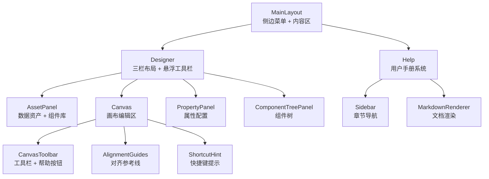
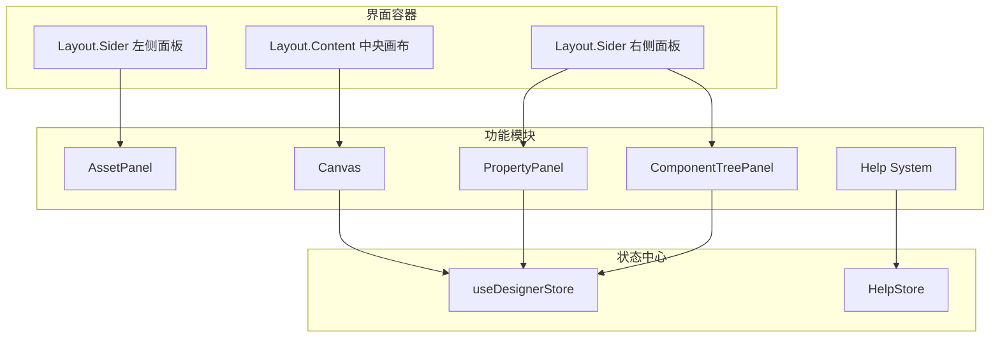
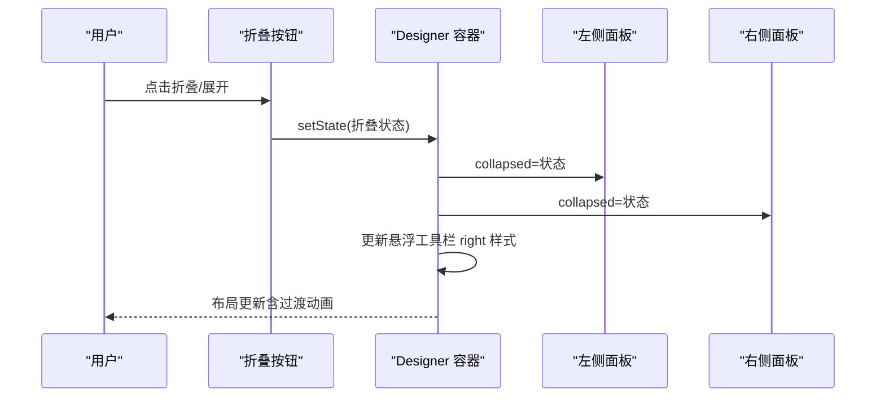
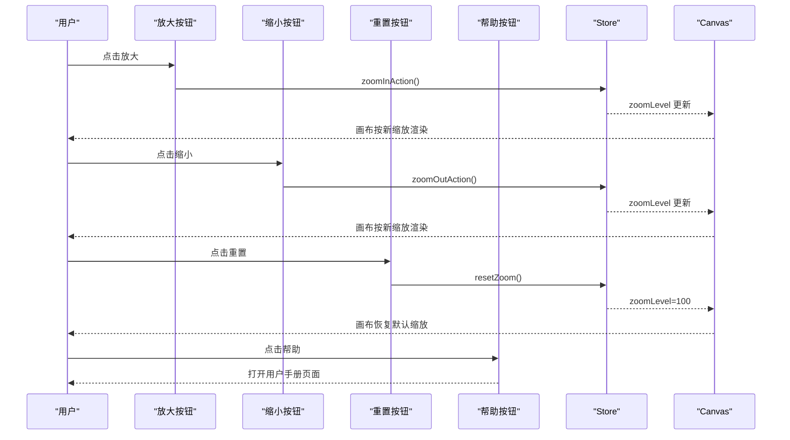
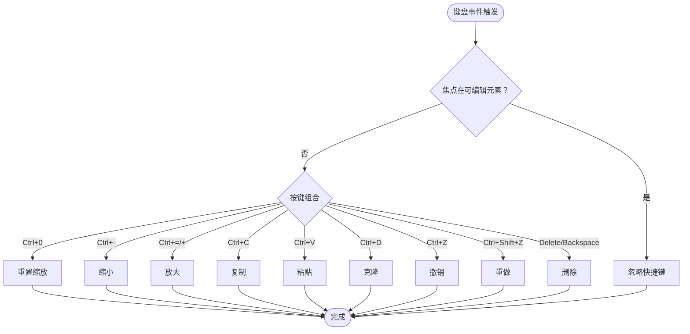
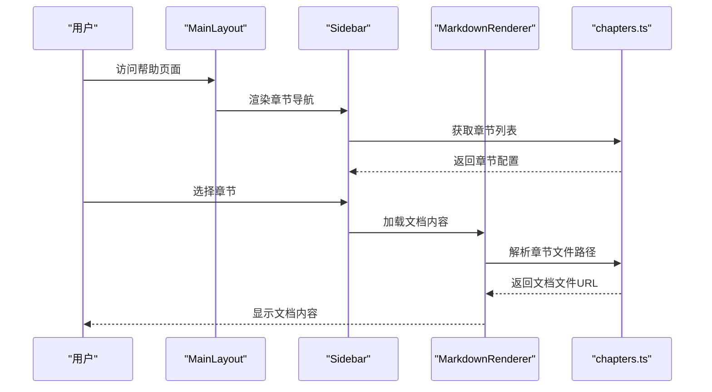
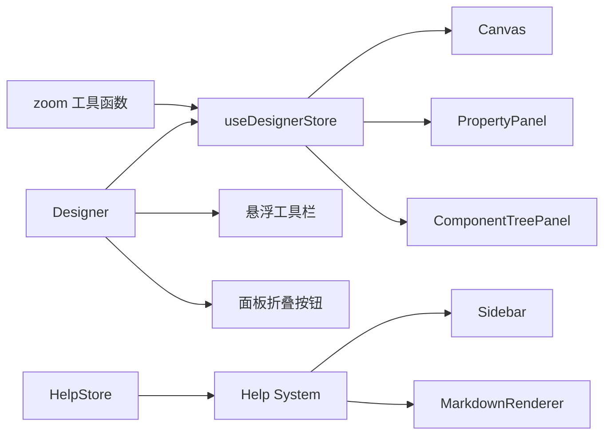

# 界面布局与导航

<cite>
**本文档引用的文件**
- [MainLayout.tsx](file://designer/src/layouts/MainLayout.tsx)
- [MainLayout.module.css](file://designer/src/layouts/MainLayout.module.css)
- [Designer/index.tsx](file://designer/src/pages/Designer/index.tsx)
- [Designer/index.module.css](file://designer/src/pages/Designer/index.module.css)
- [AssetPanel/index.tsx](file://designer/src/pages/Designer/components/AssetPanel/index.tsx)
- [AssetPanel/index.module.css](file://designer/src/pages/Designer/components/AssetPanel/index.module.css)
- [Canvas/index.tsx](file://designer/src/pages/Designer/components/Canvas/index.tsx)
- [Canvas/index.module.css](file://designer/src/pages/Designer/components/Canvas/index.module.css)
- [Canvas/CanvasToolbar.tsx](file://designer/src/pages/Designer/components/Canvas/CanvasToolbar.tsx)
- [Canvas/AlignmentGuides.tsx](file://designer/src/pages/Designer/components/Canvas/AlignmentGuides.tsx)
- [Canvas/ShortcutHint.tsx](file://designer/src/pages/Designer/components/Canvas/ShortcutHint.tsx)
- [PropertyPanel/index.tsx](file://designer/src/pages/Designer/components/PropertyPanel/index.tsx)
- [PropertyPanel/index.module.css](file://designer/src/pages/Designer/components/PropertyPanel/index.module.css)
- [ComponentTreePanel/index.tsx](file://designer/src/pages/Designer/components/ComponentTreePanel/index.tsx)
- [store/designer.ts](file://designer/src/store/designer.ts)
- [utils/zoom.ts](file://designer/src/utils/zoom.ts)
- [constants/index.ts](file://designer/src/constants/index.ts)
- [Help/index.tsx](file://designer/src/pages/Help/index.tsx)
- [Help/components/Sidebar.tsx](file://designer/src/pages/Help/components/Sidebar.tsx)
- [Help/components/MarkdownRenderer.tsx](file://designer/src/pages/Help/components/MarkdownRenderer.tsx)
- [help/chapters.ts](file://designer/src/help/chapters.ts)
</cite>

## 更新摘要
**所做更改**
- 新增帮助系统集成章节，包括用户手册入口和帮助按钮
- 更新侧边栏导航，添加帮助系统相关内容
- 增强界面布局的用户体验描述
- 完善帮助系统的技术实现细节

## 目录
1. [简介](#简介)
2. [项目结构](#项目结构)
3. [核心组件](#核心组件)
4. [架构总览](#架构总览)
5. [详细组件分析](#详细组件分析)
6. [帮助系统集成](#帮助系统集成)
7. [依赖关系分析](#依赖关系分析)
8. [性能考量](#性能考量)
9. [故障排查指南](#故障排查指南)
10. [结论](#结论)
11. [附录](#附录)

## 简介
本指南聚焦"设计器界面布局"，系统讲解三栏布局（左侧数据资产面板、中央画布编辑区、右侧属性面板）的交互逻辑与设计理念，涵盖面板折叠/展开、悬浮工具栏、键盘快捷键与鼠标滚轮缩放、面包屑导航与模板信息展示，以及界面自适应与响应式设计的技术实现。同时详细介绍新增的帮助系统集成，包括用户手册入口、帮助按钮功能以及整体UI增强带来的用户体验改善。

## 项目结构
设计器采用"布局容器 + 页面容器 + 功能模块 + 帮助系统"的分层组织方式：
- 布局层：MainLayout 提供侧边菜单与内容区容器
- 页面层：Designer 实现三栏布局与悬浮工具栏
- 功能模块：AssetPanel、Canvas、PropertyPanel、ComponentTreePanel 等
- 帮助系统：独立的帮助页面与文档渲染组件

**图表来源**
- [MainLayout.tsx:12-52](file://designer/src/layouts/MainLayout.tsx#L12-L52)
- [Designer/index.tsx:54-315](file://designer/src/pages/Designer/index.tsx#L54-L315)
- [Help/index.tsx:1-82](file://designer/src/pages/Help/index.tsx#L1-L82)
- [Help/components/Sidebar.tsx:1-46](file://designer/src/pages/Help/components/Sidebar.tsx#L1-L46)
- [Help/components/MarkdownRenderer.tsx:1-163](file://designer/src/pages/Help/components/MarkdownRenderer.tsx#L1-L163)

**章节来源**
- [MainLayout.tsx:12-52](file://designer/src/layouts/MainLayout.tsx#L12-L52)
- [Designer/index.tsx:54-315](file://designer/src/pages/Designer/index.tsx#L54-L315)
- [Help/index.tsx:1-82](file://designer/src/pages/Help/index.tsx#L1-L82)

## 核心组件
- 三栏布局容器：左侧 280px、中央自适应、右侧 320px，均支持折叠/展开，过渡动画 0.3s
- 悬浮工具栏：右下角固定，包含缩放控件（放大/缩小/重置）、返回按钮、调试面板按钮、帮助按钮
- 面板折叠按钮：左侧面板折叠按钮位于左侧 280px 外侧，右侧面板折叠按钮位于右侧 320px 外侧
- 面包屑与模板信息：页面顶部由 MainLayout 提供模板管理入口，Designer 中通过导航返回按钮回到模板管理
- 帮助系统：独立的帮助页面，提供完整的用户手册和文档查阅功能

**章节来源**
- [Designer/index.tsx:22-142](file://designer/src/pages/Designer/index.tsx#L22-L142)
- [Designer/index.tsx:144-259](file://designer/src/pages/Designer/index.tsx#L144-L259)
- [MainLayout.tsx:16-32](file://designer/src/layouts/MainLayout.tsx#L16-L32)
- [Help/components/Sidebar.tsx:32-40](file://designer/src/pages/Help/components/Sidebar.tsx#L32-L40)

## 架构总览
三栏布局通过 Ant Design Layout 组件实现，左侧与右侧 Sider 作为面板容器，Content 作为中央画布区域。Store 提供全局状态（组件、选中、缩放、网格、历史等），Canvas 与 PropertyPanel 通过 Store 驱动渲染与交互。帮助系统独立运行，通过路由与状态管理提供文档查阅功能。

**图表来源**
- [Designer/index.tsx:261-315](file://designer/src/pages/Designer/index.tsx#L261-L315)
- [store/designer.ts:108-125](file://designer/src/store/designer.ts#L108-L125)
- [Help/index.tsx:1-82](file://designer/src/pages/Help/index.tsx#L1-L82)

**章节来源**
- [Designer/index.tsx:261-315](file://designer/src/pages/Designer/index.tsx#L261-L315)
- [store/designer.ts:108-125](file://designer/src/store/designer.ts#L108-L125)
- [Help/index.tsx:1-82](file://designer/src/pages/Help/index.tsx#L1-L82)

## 详细组件分析

### 三栏布局与面板折叠/展开
- 左右面板宽度分别为 280px 与 320px，collapsed 控制折叠状态，collapsedWidth=0 实现"消失式"折叠
- 折叠按钮位置：
  - 左侧面板：固定在左侧 280px 外侧中部，折叠时显示展开按钮，展开时显示折叠按钮
  - 右侧面板：固定在右侧 320px 外侧中部，折叠时显示展开按钮，展开时显示折叠按钮
- 动画与状态：
  - 面板切换与悬浮工具栏右侧间距使用 transition: right 0.3s ease
  - 折叠状态通过 useState 管理，点击按钮切换布尔值
- 状态保持：
  - 折叠状态为组件内局部状态，刷新后默认恢复为展开；如需持久化可在 Store 中扩展

**图表来源**
- [Designer/index.tsx:57-98](file://designer/src/pages/Designer/index.tsx#L57-L98)
- [Designer/index.tsx:101-142](file://designer/src/pages/Designer/index.tsx#L101-L142)
- [Designer/index.tsx:144-151](file://designer/src/pages/Designer/index.tsx#L144-L151)

**章节来源**
- [Designer/index.tsx:22-142](file://designer/src/pages/Designer/index.tsx#L22-L142)
- [Designer/index.tsx:144-151](file://designer/src/pages/Designer/index.tsx#L144-L151)

### 悬浮工具栏与功能
- 位置与布局：固定在右下角，垂直排列，背景半透明，带模糊与阴影
- 缩放控件：
  - 放大：zoomInAction，上限 200%
  - 缩小：zoomOutAction，下限 25%
  - 重置：resetZoom，恢复 100%
  - 缩放状态通过 Store 管理，按钮根据当前 zoomLevel 禁用/高亮
- 返回按钮：导航至模板管理路径
- 调试面板：Drawer 展示模板 JSON 与统计信息，支持复制 JSON
- **帮助按钮**：新增的帮助按钮，点击打开用户手册，提供设计器使用指导

**图表来源**
- [Designer/index.tsx:166-235](file://designer/src/pages/Designer/index.tsx#L166-L235)
- [store/designer.ts:354-358](file://designer/src/store/designer.ts#L354-L358)
- [utils/zoom.ts:24-51](file://designer/src/utils/zoom.ts#L24-L51)

**章节来源**
- [Designer/index.tsx:144-259](file://designer/src/pages/Designer/index.tsx#L144-L259)
- [store/designer.ts:354-358](file://designer/src/store/designer.ts#L354-L358)
- [utils/zoom.ts:24-51](file://designer/src/utils/zoom.ts#L24-L51)

### 键盘快捷键与鼠标滚轮缩放
- 键盘快捷键（画布区域生效，且焦点不在输入框/文本域/可编辑元素）：
  - Ctrl/Cmd + =/+：放大
  - Ctrl/Cmd + -：缩小
  - Ctrl/Cmd + 0：重置缩放
  - Ctrl/Cmd + C：复制
  - Ctrl/Cmd + V：粘贴
  - Ctrl/Cmd + D：克隆
  - Ctrl/Cmd + Z：撤销
  - Ctrl/Cmd + Shift + Z：重做
  - Delete/Backspace：删除选中组件
- 鼠标滚轮缩放：Canvas 监听键盘事件，统一调用 Store 的缩放动作
- 快捷键提示：Canvas 顶部显示快捷键提示，支持本次会话隐藏/显示

**图表来源**
- [Canvas/index.tsx:146-220](file://designer/src/pages/Designer/components/Canvas/index.tsx#L146-L220)
- [Canvas/ShortcutHint.tsx:13-30](file://designer/src/pages/Designer/components/Canvas/ShortcutHint.tsx#L13-L30)

**章节来源**
- [Canvas/index.tsx:146-220](file://designer/src/pages/Designer/components/Canvas/index.tsx#L146-L220)
- [Canvas/ShortcutHint.tsx:13-30](file://designer/src/pages/Designer/components/Canvas/ShortcutHint.tsx#L13-L30)

### 面包屑导航与模板信息
- 面包屑：MainLayout 提供模板管理、Schema 字典、Mock 数据、用户手册的导航入口
- 模板信息：Designer 顶部通过返回按钮回到模板管理；调试抽屉展示模板名称、Schema ID、组件数量与 JSON 预览

**章节来源**
- [MainLayout.tsx:16-32](file://designer/src/layouts/MainLayout.tsx#L16-L32)
- [Designer/index.tsx:317-359](file://designer/src/pages/Designer/index.tsx#L317-L359)

### 左侧数据资产面板
- 结构：Tab 页签"数据资产"与"组件库"
- 数据资产：支持将数据字段拖拽到画布生成对应组件
- 组件库：拖拽组件到画布，自动计算有效宽度与默认布局

**章节来源**
- [AssetPanel/index.tsx:7-28](file://designer/src/pages/Designer/components/AssetPanel/index.tsx#L7-L28)
- [AssetPanel/index.module.css:1-14](file://designer/src/pages/Designer/components/AssetPanel/index.module.css#L1-L14)

### 中央画布编辑区
- 画布容器：支持网格吸附、智能对齐、拖拽、尺寸调整、区域移动（页头/内容/页脚）
- 工具栏：CanvasToolbar 提供撤销/重做、对齐、分布、网格、页面设置、快速打印、保存/重置、帮助按钮
- 对齐参考线：AlignmentGuides 在拖拽时显示对齐辅助线
- 快捷键提示：ShortcutHint 提示常用快捷键

**章节来源**
- [Canvas/index.tsx:22-75](file://designer/src/pages/Designer/components/Canvas/index.tsx#L22-L75)
- [Canvas/index.tsx:281-479](file://designer/src/pages/Designer/components/Canvas/index.tsx#L281-L479)
- [Canvas/CanvasToolbar.tsx:37-53](file://designer/src/pages/Designer/components/Canvas/CanvasToolbar.tsx#L37-L53)
- [Canvas/AlignmentGuides.tsx:21-63](file://designer/src/pages/Designer/components/Canvas/AlignmentGuides.tsx#L21-L63)
- [Canvas/ShortcutHint.tsx:13-30](file://designer/src/pages/Designer/components/Canvas/ShortcutHint.tsx#L13-L30)

### 右侧属性面板与组件树
- 属性面板：根据选中组件类型动态展示布局、样式、数据绑定、表格列等配置项
- 组件树：按页头/内容/页脚分组展示，支持右键菜单复制/删除、点击选中并滚动定位

**章节来源**
- [PropertyPanel/index.tsx:17-37](file://designer/src/pages/Designer/components/PropertyPanel/index.tsx#L17-L37)
- [PropertyPanel/index.tsx:120-147](file://designer/src/pages/Designer/components/PropertyPanel/index.tsx#L120-L147)
- [ComponentTreePanel/index.tsx:66-155](file://designer/src/pages/Designer/components/ComponentTreePanel/index.tsx#L66-L155)

## 帮助系统集成

### 用户手册入口
- **侧边栏集成**：MainLayout 侧边栏新增"用户手册"入口，提供帮助系统访问
- **章节导航**：帮助页面包含完整的文档目录，支持章节快速跳转
- **文档分类**：涵盖平台概述、快速入门、设计器基础、组件使用、数据绑定、表格配置、页面设置、打印预览、快捷键等主题

### 帮助页面架构
- **页面结构**：采用左右布局，左侧为章节导航，右侧为文档内容区域
- **内容渲染**：使用 MarkdownRenderer 组件渲染文档内容，支持 GFM 格式
- **响应式设计**：文档内容区域具有最大宽度限制，确保阅读体验

### 文档渲染组件
- **标题样式**：支持 h1-h3 标题，提供统一的字体大小和颜色方案
- **列表支持**：支持有序和无序列表，提供适当的间距和样式
- **代码块**：支持行内代码和代码块，提供语法高亮和滚动支持
- **表格渲染**：表格自动适配容器宽度，提供清晰的视觉层次
- **图片处理**：支持相对路径图片解析，确保部署后的图片正常显示

### 章节管理系统
- **章节配置**：通过 chapters.ts 文件管理所有帮助文档的元数据
- **动态加载**：根据 URL hash 动态加载对应的文档内容
- **状态管理**：维护当前激活章节的状态，支持章节间的快速切换

**图表来源**
- [Help/index.tsx:14-55](file://designer/src/pages/Help/index.tsx#L14-L55)
- [Help/components/Sidebar.tsx:12-40](file://designer/src/pages/Help/components/Sidebar.tsx#L12-L40)
- [Help/components/MarkdownRenderer.tsx:10-160](file://designer/src/pages/Help/components/MarkdownRenderer.tsx#L10-L160)
- [help/chapters.ts:7-63](file://designer/src/help/chapters.ts#L7-L63)

**章节来源**
- [Help/index.tsx:1-82](file://designer/src/pages/Help/index.tsx#L1-L82)
- [Help/components/Sidebar.tsx:1-46](file://designer/src/pages/Help/components/Sidebar.tsx#L1-L46)
- [Help/components/MarkdownRenderer.tsx:1-163](file://designer/src/pages/Help/components/MarkdownRenderer.tsx#L1-L163)
- [help/chapters.ts:1-64](file://designer/src/help/chapters.ts#L1-L64)

## 依赖关系分析
- 设计器容器依赖 Store 管理全局状态（组件、选中、缩放、网格、历史）
- Canvas 与 PropertyPanel 通过 Store 驱动渲染与交互
- 悬浮工具栏与面板折叠按钮通过状态驱动布局变化
- 缩放相关逻辑集中在 Store 与工具函数中，Canvas 与工具栏共同消费
- 帮助系统独立运行，通过路由和状态管理提供文档查阅功能

**图表来源**
- [store/designer.ts:108-125](file://designer/src/store/designer.ts#L108-L125)
- [Designer/index.tsx:144-151](file://designer/src/pages/Designer/index.tsx#L144-L151)
- [utils/zoom.ts:24-51](file://designer/src/utils/zoom.ts#L24-L51)
- [Help/index.tsx:1-82](file://designer/src/pages/Help/index.tsx#L1-L82)

**章节来源**
- [store/designer.ts:108-125](file://designer/src/store/designer.ts#L108-L125)
- [Designer/index.tsx:144-151](file://designer/src/pages/Designer/index.tsx#L144-L151)
- [utils/zoom.ts:24-51](file://designer/src/utils/zoom.ts#L24-L51)
- [Help/index.tsx:1-82](file://designer/src/pages/Help/index.tsx#L1-L82)

## 性能考量
- 拖拽与缩放：
  - Canvas 使用 useRef 缓存 Store 状态与回调，避免频繁重绑事件监听器
  - 缩放与像素换算通过工具函数集中处理，减少重复计算
- 网格与吸附：
  - snapToGrid 与 Shift 临时禁用吸附逻辑，降低不必要的重绘
- 历史与撤销：
  - Store 以全量快照记录历史，限制最大步数，避免内存膨胀
- **帮助系统优化**：
  - 文档内容采用懒加载策略，按需加载章节内容
  - Markdown 渲染组件使用 React.memo 优化重新渲染
  - 图片资源支持缓存，避免重复请求

**章节来源**
- [Canvas/index.tsx:78-98](file://designer/src/pages/Designer/components/Canvas/index.tsx#L78-L98)
- [Canvas/index.tsx:538-699](file://designer/src/pages/Designer/components/Canvas/index.tsx#L538-L699)
- [store/designer.ts:92-106](file://designer/src/store/designer.ts#L92-L106)
- [Help/components/MarkdownRenderer.tsx:10-160](file://designer/src/pages/Help/components/MarkdownRenderer.tsx#L10-L160)

## 故障排查指南
- 缩放无效或异常
  - 检查 Store 的 zoomLevel 是否在 25%-200% 范围内
  - 确认键盘事件未被输入框捕获（需在非可编辑元素中触发）
- 组件拖拽越界高亮
  - 检查页面尺寸与页头/页脚高度配置，确认组件未超出有效区域
- 网格吸附不生效
  - 按住 Shift 可临时禁用吸附；确认 gridEnabled 与 gridSize 设置
- 面板折叠后悬浮工具栏位置异常
  - 检查 Designer 的 right 样式是否随面板折叠状态正确更新
- **帮助系统问题**
  - 文档加载失败：检查章节文件路径配置，确认文件存在
  - 章节导航不显示：验证 chapters.ts 配置是否正确
  - Markdown 渲染异常：检查文档格式是否符合 GFM 规范

**章节来源**
- [store/designer.ts:354-358](file://designer/src/store/designer.ts#L354-L358)
- [Canvas/index.tsx:146-220](file://designer/src/pages/Designer/components/Canvas/index.tsx#L146-L220)
- [Canvas/index.tsx:222-279](file://designer/src/pages/Designer/components/Canvas/index.tsx#L222-L279)
- [Designer/index.tsx:144-151](file://designer/src/pages/Designer/index.tsx#L144-L151)
- [Help/index.tsx:24-43](file://designer/src/pages/Help/index.tsx#L24-L43)

## 结论
该设计器采用清晰的三栏布局与状态驱动架构，结合 Store 管理全局状态、Canvas 提供丰富的交互能力、PropertyPanel 与 ComponentTreePanel 实现可视化配置，辅以悬浮工具栏与快捷键提升效率。新增的帮助系统进一步完善了用户体验，通过用户手册提供全面的使用指导。面板折叠/展开与缩放机制完善，具备良好的可维护性与扩展性。

## 附录

### 响应式与界面自适应要点
- 容器高度：vh 单位保证占满视口
- 三栏宽度：固定像素值 + collapsedWidth=0 的折叠策略
- 悬浮工具栏：固定定位 + right 动态计算，随面板折叠自动调整
- 网格显示：基于背景图像实现，随缩放比例平滑显示
- **帮助页面**：采用响应式布局，文档内容区域具有最大宽度限制，确保在不同设备上的良好阅读体验

**章节来源**
- [Designer/index.module.css:1-23](file://designer/src/pages/Designer/index.module.css#L1-L23)
- [Designer/index.tsx:261-284](file://designer/src/pages/Designer/index.tsx#L261-L284)
- [Canvas/index.module.css:64-69](file://designer/src/pages/Designer/components/Canvas/index.module.css#L64-L69)
- [Help/components/MarkdownRenderer.tsx:154-159](file://designer/src/pages/Help/components/MarkdownRenderer.tsx#L154-L159)