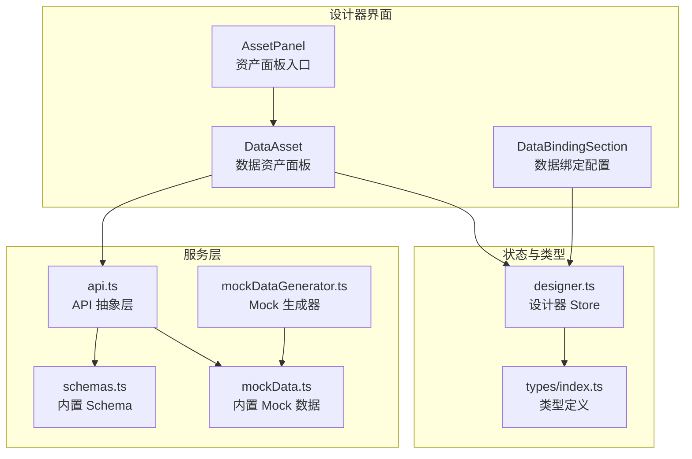
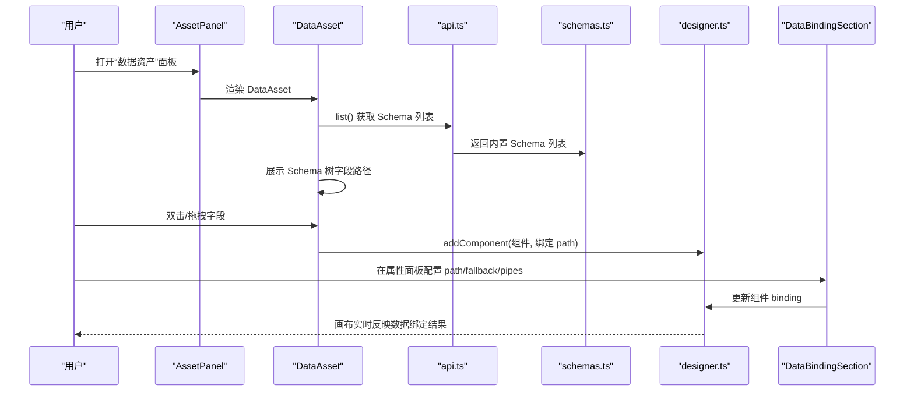
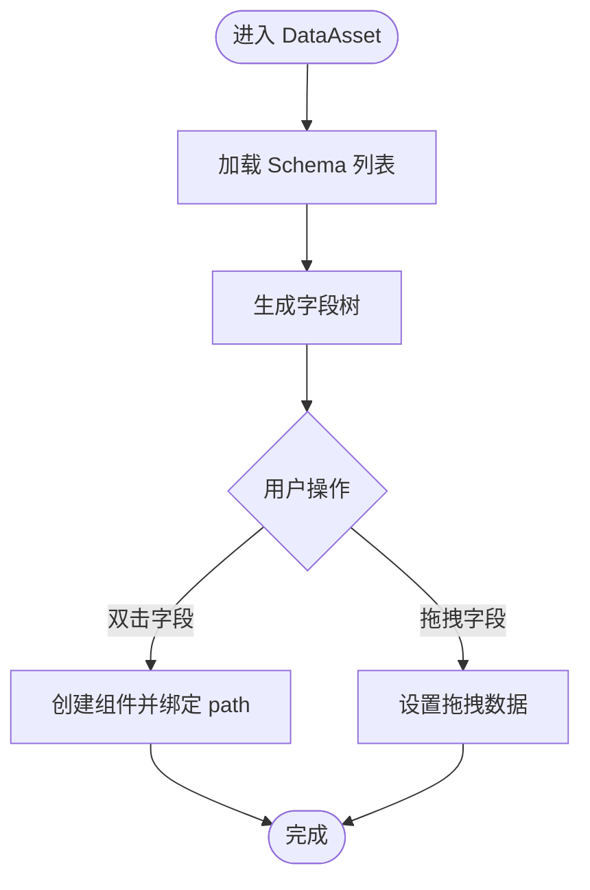
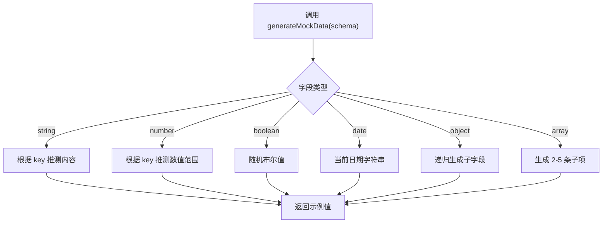
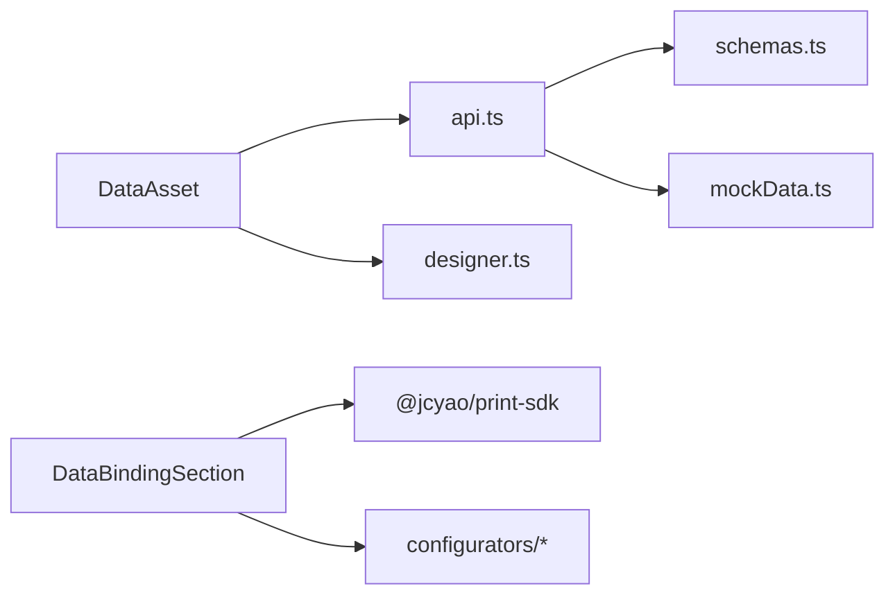

# 数据资产管理

<cite>
**本文引用的文件**
- [designer/src/pages/Designer/components/AssetPanel/index.tsx](file://designer/src/pages/Designer/components/AssetPanel/index.tsx)
- [designer/src/pages/Designer/components/AssetPanel/DataAsset/index.tsx](file://designer/src/pages/Designer/components/AssetPanel/DataAsset/index.tsx)
- [designer/src/services/api.ts](file://designer/src/services/api.ts)
- [designer/src/services/mock/schemas.ts](file://designer/src/services/mock/schemas.ts)
- [designer/src/services/mock/mockData.ts](file://designer/src/services/mock/mockData.ts)
- [designer/src/utils/mockDataGenerator.ts](file://designer/src/utils/mockDataGenerator.ts)
- [designer/src/types/index.ts](file://designer/src/types/index.ts)
- [designer/src/store/designer.ts](file://designer/src/store/designer.ts)
- [designer/src/pages/Designer/components/PropertyPanel/DataBindingSection.tsx](file://designer/src/pages/Designer/components/PropertyPanel/DataBindingSection.tsx)
</cite>

## 目录
1. [简介](#简介)
2. [项目结构](#项目结构)
3. [核心组件](#核心组件)
4. [架构总览](#架构总览)
5. [详细组件分析](#详细组件分析)
6. [依赖分析](#依赖分析)
7. [性能考虑](#性能考虑)
8. [故障排查指南](#故障排查指南)
9. [结论](#结论)
10. [附录](#附录)

## 简介
本指南面向“数据资产管理”模块，围绕设计器中的“数据资产面板”展开，帮助用户完成以下目标：
- 选择与绑定 Schema 字典，驱动组件数据绑定
- 管理与使用 Mock 数据（内置示例与自动生成）
- 在设计器中通过拖拽/双击将字段快速添加到画布
- 配置数据绑定路径、默认值与数据管道（格式化）
- 了解数据资产与组件之间的关联关系与数据流向

## 项目结构
数据资产管理相关的核心文件集中在设计器页面与服务层：
- 资产面板入口与数据资产面板实现
- Schema 与 Mock 数据的默认内置数据
- API 抽象层（真实后端或前端 Mock）
- 设计器 Store（模板与组件状态）
- 数据绑定配置区域（PropertyPanel）

图表来源
- [designer/src/pages/Designer/components/AssetPanel/index.tsx:1-32](file://designer/src/pages/Designer/components/AssetPanel/index.tsx#L1-L32)
- [designer/src/pages/Designer/components/AssetPanel/DataAsset/index.tsx:1-350](file://designer/src/pages/Designer/components/AssetPanel/DataAsset/index.tsx#L1-L350)
- [designer/src/services/api.ts:1-134](file://designer/src/services/api.ts#L1-L134)
- [designer/src/services/mock/schemas.ts:1-147](file://designer/src/services/mock/schemas.ts#L1-L147)
- [designer/src/services/mock/mockData.ts:1-639](file://designer/src/services/mock/mockData.ts#L1-L639)
- [designer/src/utils/mockDataGenerator.ts:1-113](file://designer/src/utils/mockDataGenerator.ts#L1-L113)
- [designer/src/store/designer.ts:1-773](file://designer/src/store/designer.ts#L1-L773)
- [designer/src/types/index.ts:1-378](file://designer/src/types/index.ts#L1-L378)

章节来源
- [designer/src/pages/Designer/components/AssetPanel/index.tsx:1-32](file://designer/src/pages/Designer/components/AssetPanel/index.tsx#L1-L32)
- [designer/src/pages/Designer/components/AssetPanel/DataAsset/index.tsx:1-350](file://designer/src/pages/Designer/components/AssetPanel/DataAsset/index.tsx#L1-L350)
- [designer/src/services/api.ts:1-134](file://designer/src/services/api.ts#L1-L134)
- [designer/src/services/mock/schemas.ts:1-147](file://designer/src/services/mock/schemas.ts#L1-L147)
- [designer/src/services/mock/mockData.ts:1-639](file://designer/src/services/mock/mockData.ts#L1-L639)
- [designer/src/utils/mockDataGenerator.ts:1-113](file://designer/src/utils/mockDataGenerator.ts#L1-L113)
- [designer/src/store/designer.ts:1-773](file://designer/src/store/designer.ts#L1-L773)
- [designer/src/types/index.ts:1-378](file://designer/src/types/index.ts#L1-L378)

## 核心组件
- 数据资产面板（DataAsset）
  - 加载 Schema 列表，展示 Schema 字段树
  - 支持双击/拖拽将字段添加到画布
  - 自动设置模板 SchemaId 并更新 Store
- API 抽象层（api.ts）
  - 根据环境变量切换真实后端或前端 Mock
  - 提供 Schema、模板、Mock 数据的 CRUD 接口
- 设计器 Store（designer.ts）
  - 统一管理组件、选中状态、页面配置、历史撤销/重做
  - 提供生成完整模板 JSON 的能力
- 数据绑定配置（DataBindingSection）
  - 配置绑定路径、默认值、数据管道（Pipes）
  - 动态增删管道并传入选项

章节来源
- [designer/src/pages/Designer/components/AssetPanel/DataAsset/index.tsx:1-350](file://designer/src/pages/Designer/components/AssetPanel/DataAsset/index.tsx#L1-L350)
- [designer/src/services/api.ts:1-134](file://designer/src/services/api.ts#L1-L134)
- [designer/src/store/designer.ts:1-773](file://designer/src/store/designer.ts#L1-L773)
- [designer/src/pages/Designer/components/PropertyPanel/DataBindingSection.tsx:1-128](file://designer/src/pages/Designer/components/PropertyPanel/DataBindingSection.tsx#L1-L128)

## 架构总览
数据资产与组件之间的关系如下：
- 用户在“数据资产面板”选择 Schema
- 通过拖拽/双击将字段映射为组件（文本/表格）
- 组件的 DataBinding.path 指向 Schema 字段路径
- PropertyPanel 的 Pipes 对数据进行格式化
- Store 统一维护模板与组件状态

图表来源
- [designer/src/pages/Designer/components/AssetPanel/DataAsset/index.tsx:1-350](file://designer/src/pages/Designer/components/AssetPanel/DataAsset/index.tsx#L1-L350)
- [designer/src/services/api.ts:1-134](file://designer/src/services/api.ts#L1-L134)
- [designer/src/services/mock/schemas.ts:1-147](file://designer/src/services/mock/schemas.ts#L1-L147)
- [designer/src/store/designer.ts:1-773](file://designer/src/store/designer.ts#L1-L773)
- [designer/src/pages/Designer/components/PropertyPanel/DataBindingSection.tsx:1-128](file://designer/src/pages/Designer/components/PropertyPanel/DataBindingSection.tsx#L1-L128)

## 详细组件分析

### 数据资产面板（DataAsset）
- 功能要点
  - 加载 Schema 列表并默认选中第一个
  - 将 SchemaField 转换为树形结构，支持对象/数组/基础类型
  - 双击字段：根据类型创建文本或表格组件，并自动绑定 path
  - 拖拽字段：设置拖拽数据（字段路径、类型、children 等）
  - 禁止拖拽/双击对象类型与数组子字段（数组子字段需通过表格列使用）
- 关键流程
  - 选择 Schema -> 更新模板 schemaId -> 生成树 -> 双击/拖拽 -> 添加组件 -> 选中组件
- 交互限制
  - 对象类型不可直接添加
  - 数组子字段禁用拖拽与双击，需通过表格列使用

图表来源
- [designer/src/pages/Designer/components/AssetPanel/DataAsset/index.tsx:1-350](file://designer/src/pages/Designer/components/AssetPanel/DataAsset/index.tsx#L1-L350)

章节来源
- [designer/src/pages/Designer/components/AssetPanel/DataAsset/index.tsx:1-350](file://designer/src/pages/Designer/components/AssetPanel/DataAsset/index.tsx#L1-L350)

### Schema 字典管理
- 内置 Schema
  - 销售出库单（包含客户、明细、汇总等字段）
  - 嵌套对象 Schema（演示表格列使用嵌套路径）
- Schema 结构
  - 根类型（object/array）
  - 字段类型（string/number/date/boolean/object/array）
  - 子字段 children
  - 枚举 enum 与格式 format
- 使用建议
  - 为业务实体设计清晰的根对象与字段层级
  - 对需要表格展示的数组字段，优先使用表格组件

章节来源
- [designer/src/services/mock/schemas.ts:1-147](file://designer/src/services/mock/schemas.ts#L1-L147)
- [designer/src/types/index.ts:1-378](file://designer/src/types/index.ts#L1-L378)

### Mock 数据管理
- 内置 Mock 数据
  - 标准样例、大数据量、批量打印、嵌套对象、不同纸张模板等
- 生成策略
  - 基于字段 key 的语义推测生成合理示例
  - 数字/字符串/布尔/日期/对象/数组分别采用不同策略
- 导入导出与批量
  - 通过 API 抽象层统一管理（真实后端或前端 Mock）
  - 支持按 SchemaId/模板Id 过滤查询

图表来源
- [designer/src/utils/mockDataGenerator.ts:1-113](file://designer/src/utils/mockDataGenerator.ts#L1-L113)
- [designer/src/services/mock/mockData.ts:1-639](file://designer/src/services/mock/mockData.ts#L1-L639)

章节来源
- [designer/src/services/mock/mockData.ts:1-639](file://designer/src/services/mock/mockData.ts#L1-L639)
- [designer/src/utils/mockDataGenerator.ts:1-113](file://designer/src/utils/mockDataGenerator.ts#L1-L113)

### 数据绑定与格式化
- 绑定路径（path）
  - 支持点号路径（如 user.name、items.0.title）
  - 可从数据资产面板拖拽或手动输入
- 默认值（fallback）
  - 当数据为空、null 或 undefined 时显示
- 数据管道（pipes）
  - 支持按顺序执行的格式化器（如日期、货币、中文大写等）
  - 通过插件化配置器渲染配置 UI

章节来源
- [designer/src/pages/Designer/components/PropertyPanel/DataBindingSection.tsx:1-128](file://designer/src/pages/Designer/components/PropertyPanel/DataBindingSection.tsx#L1-L128)
- [designer/src/types/index.ts:1-378](file://designer/src/types/index.ts#L1-L378)

### 设计器 Store 与模板
- Store 能力
  - 组件增删改、复制粘贴、层级管理、对齐与分布
  - 页面配置（尺寸、方向、边距、页眉页脚）
  - 历史撤销/重做（最多 20 步）
  - 生成完整模板 JSON（包含页面配置与组件列表）
- 与数据资产的联动
  - 选择 Schema 后自动设置模板 schemaId
  - 添加组件时自动填充 binding.path

章节来源
- [designer/src/store/designer.ts:1-773](file://designer/src/store/designer.ts#L1-L773)

## 依赖分析
- 组件耦合
  - DataAsset 依赖 api.ts 与 schemas.ts，同时与 designer.ts Store 交互
  - DataBindingSection 依赖 SDK 的管道注册器与 configurators
- 外部依赖
  - axios（HTTP 客户端）
  - antd（UI 组件库）
  - @jcyao/print-sdk（管道注册与配置器）
- 可能的循环依赖
  - 当前文件间为单向依赖（UI -> 服务层 -> Store），无明显循环

图表来源
- [designer/src/pages/Designer/components/AssetPanel/DataAsset/index.tsx:1-350](file://designer/src/pages/Designer/components/AssetPanel/DataAsset/index.tsx#L1-L350)
- [designer/src/services/api.ts:1-134](file://designer/src/services/api.ts#L1-L134)
- [designer/src/services/mock/schemas.ts:1-147](file://designer/src/services/mock/schemas.ts#L1-L147)
- [designer/src/services/mock/mockData.ts:1-639](file://designer/src/services/mock/mockData.ts#L1-L639)
- [designer/src/pages/Designer/components/PropertyPanel/DataBindingSection.tsx:1-128](file://designer/src/pages/Designer/components/PropertyPanel/DataBindingSection.tsx#L1-L128)

章节来源
- [designer/src/pages/Designer/components/AssetPanel/DataAsset/index.tsx:1-350](file://designer/src/pages/Designer/components/AssetPanel/DataAsset/index.tsx#L1-L350)
- [designer/src/services/api.ts:1-134](file://designer/src/services/api.ts#L1-L134)
- [designer/src/pages/Designer/components/PropertyPanel/DataBindingSection.tsx:1-128](file://designer/src/pages/Designer/components/PropertyPanel/DataBindingSection.tsx#L1-L128)

## 性能考虑
- 前端 Mock 模式
  - 通过环境变量启用，避免网络请求开销，适合演示与开发
- 大数据量表格
  - 内置 Mock 数据包含大量明细项，用于测试表格渲染与分页
- 组件渲染
  - Store 采用快照历史机制，避免深层状态对比带来的性能问题
- 建议
  - 在生产环境使用真实后端 API
  - 对超大表格数据进行虚拟滚动或分页优化（由 SDK 打印引擎负责）

## 故障排查指南
- 无法加载 Schema 列表
  - 检查环境变量 USE_MOCK 与 API 基础地址
  - 确认后端接口 /api/schemas 可访问
- 拖拽/双击无效
  - 对象类型与数组子字段被禁止拖拽/双击，需通过表格列使用
- 绑定路径错误
  - 确认路径与 Schema 字段层级一致，支持点号路径
- 数据为空显示默认值
  - 在 DataBindingSection 中设置 fallback
- 管道配置不生效
  - 确认管道类型正确，且配置器渲染正常

章节来源
- [designer/src/services/api.ts:1-134](file://designer/src/services/api.ts#L1-L134)
- [designer/src/pages/Designer/components/AssetPanel/DataAsset/index.tsx:1-350](file://designer/src/pages/Designer/components/AssetPanel/DataAsset/index.tsx#L1-L350)
- [designer/src/pages/Designer/components/PropertyPanel/DataBindingSection.tsx:1-128](file://designer/src/pages/Designer/components/PropertyPanel/DataBindingSection.tsx#L1-L128)

## 结论
数据资产管理模块通过“Schema 字典 + Mock 数据 + 组件绑定”的方式，实现了从数据模型到可视化组件的高效映射。配合设计器 Store 的状态管理与 PropertyPanel 的绑定配置，用户可以快速完成复杂打印模板的设计与调试。

## 附录

### Schema 字典与 Mock 数据一览
- 内置 Schema
  - 销售出库单（根类型 object，包含客户、明细、汇总等）
  - 采购订单（嵌套对象，演示表格列嵌套路径）
- 内置 Mock 数据
  - 标准样例、大数据量、批量打印、嵌套对象、不同纸张模板等

章节来源
- [designer/src/services/mock/schemas.ts:1-147](file://designer/src/services/mock/schemas.ts#L1-L147)
- [designer/src/services/mock/mockData.ts:1-639](file://designer/src/services/mock/mockData.ts#L1-L639)