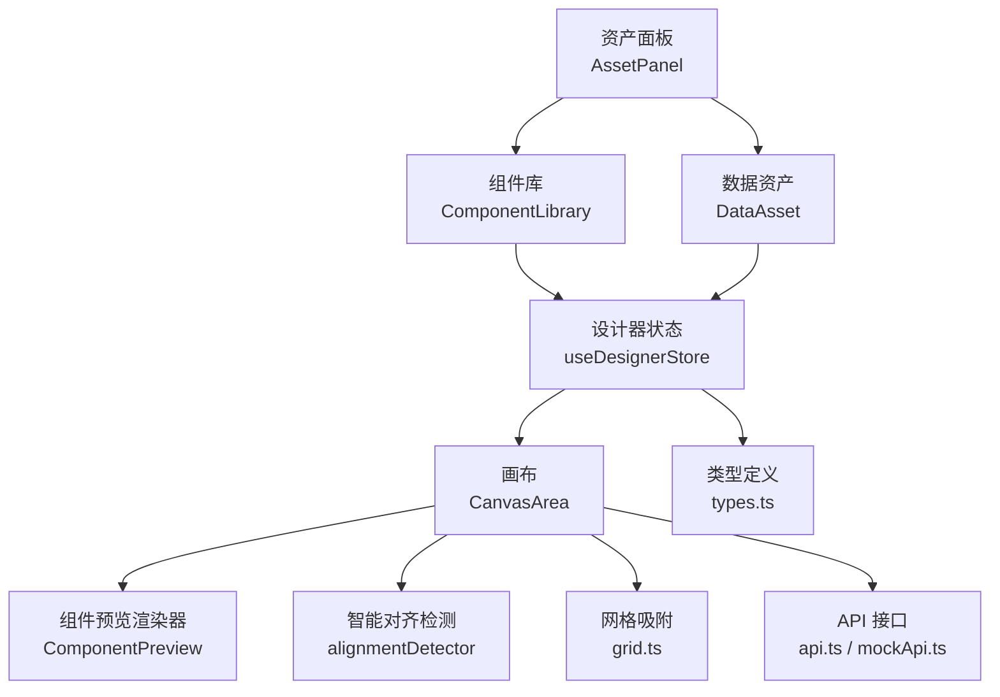
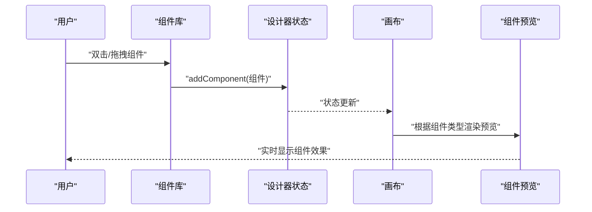
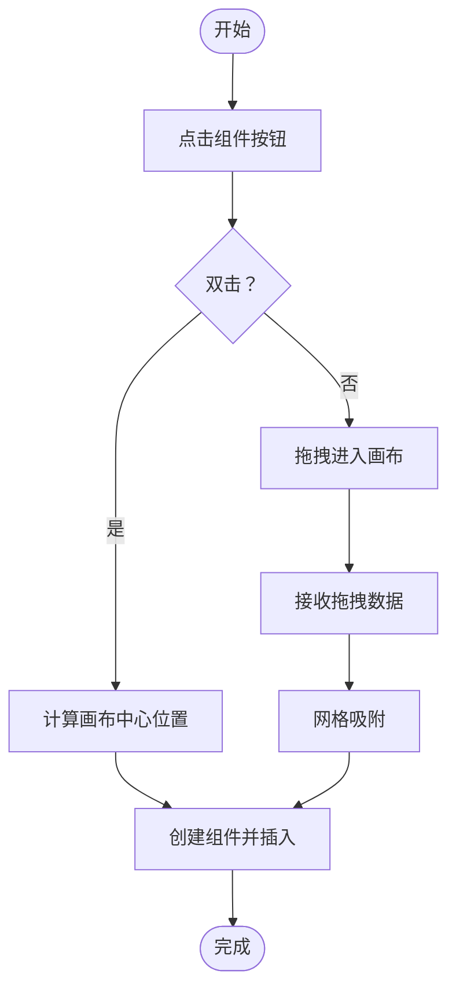
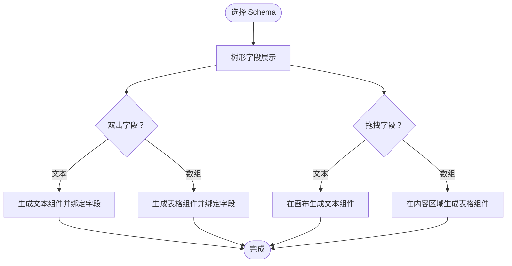
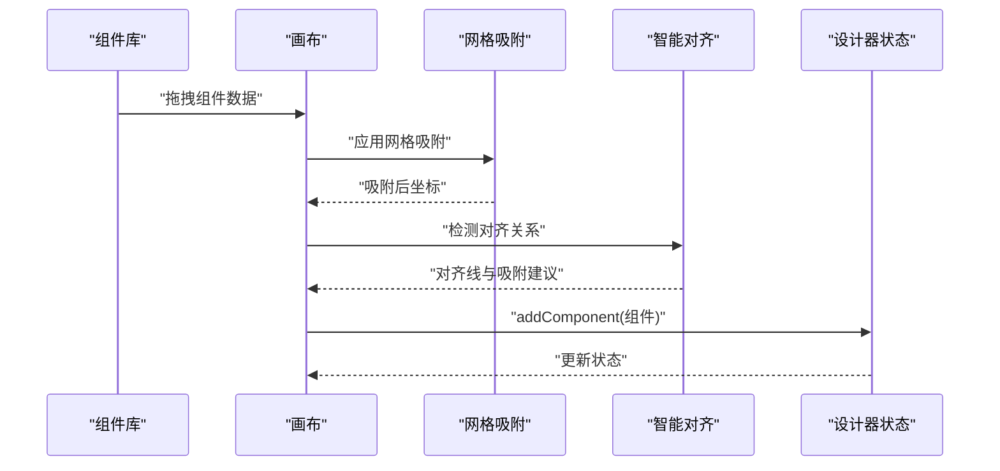
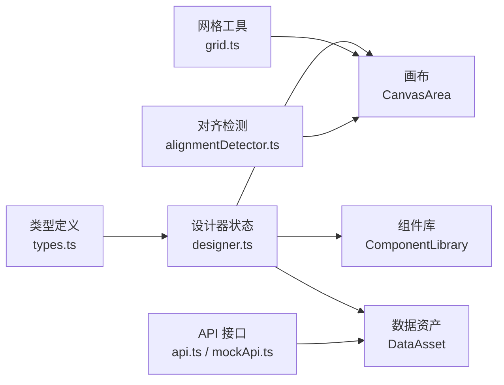

# 组件库与数据资产

<cite>
**本文引用的文件**
- [designer/src/pages/Designer/components/AssetPanel/index.tsx](file://designer/src/pages/Designer/components/AssetPanel/index.tsx)
- [designer/src/pages/Designer/components/AssetPanel/ComponentLibrary/index.tsx](file://designer/src/pages/Designer/components/AssetPanel/ComponentLibrary/index.tsx)
- [designer/src/pages/Designer/components/AssetPanel/DataAsset/index.tsx](file://designer/src/pages/Designer/components/AssetPanel/DataAsset/index.tsx)
- [designer/src/pages/Designer/components/Canvas/index.tsx](file://designer/src/pages/Designer/components/Canvas/index.tsx)
- [designer/src/pages/Designer/components/Canvas/ComponentPreview.tsx](file://designer/src/pages/Designer/components/Canvas/ComponentPreview.tsx)
- [designer/src/pages/Designer/components/Canvas/alignmentDetector.ts](file://designer/src/pages/Designer/components/Canvas/alignmentDetector.ts)
- [designer/src/pages/Designer/components/PropertyPanel/index.tsx](file://designer/src/pages/Designer/components/PropertyPanel/index.tsx)
- [designer/src/store/designer.ts](file://designer/src/store/designer.ts)
- [designer/src/types/index.ts](file://designer/src/types/index.ts)
- [designer/src/services/api.ts](file://designer/src/services/api.ts)
- [designer/src/services/mockApi.ts](file://designer/src/services/mockApi.ts)
- [designer/src/utils/grid.ts](file://designer/src/utils/grid.ts)
- [designer/src/components/Barcode/index.tsx](file://designer/src/components/Barcode/index.tsx)
- [designer/src/components/QRCode/index.tsx](file://designer/src/components/QRCode/index.tsx)
</cite>

## 目录
1. [简介](#简介)
2. [项目结构](#项目结构)
3. [核心组件](#核心组件)
4. [架构总览](#架构总览)
5. [详细组件分析](#详细组件分析)
6. [依赖分析](#依赖分析)
7. [性能考量](#性能考量)
8. [故障排查指南](#故障排查指南)
9. [结论](#结论)
10. [附录](#附录)

## 简介
本指南围绕“组件库”与“数据资产”两大模块，提供从入门到进阶的完整使用说明。内容涵盖：
- 组件库的分类与组织结构（文本、图像、表格、二维码、条形码、矩形、线条等）
- 拖拽添加组件到画布的全流程（拖拽预览、放置位置、智能吸附）
- 双击快速添加组件的使用方法与适用场景
- 数据资产面板的功能（Schema 字典的选择与绑定、Mock 数据的管理与使用）
- 组件的可选属性与默认值设置
- 组件库的搜索与筛选功能使用方法
- 提供实际的组件添加与配置示例

## 项目结构
组件库与数据资产位于设计器页面的左侧资产面板，右侧为画布与属性面板。整体采用模块化组织，Store 管理状态，API 提供数据访问。

图表来源
- [designer/src/pages/Designer/components/AssetPanel/index.tsx:1-32](file://designer/src/pages/Designer/components/AssetPanel/index.tsx#L1-L32)
- [designer/src/pages/Designer/components/AssetPanel/ComponentLibrary/index.tsx:1-238](file://designer/src/pages/Designer/components/AssetPanel/ComponentLibrary/index.tsx#L1-L238)
- [designer/src/pages/Designer/components/AssetPanel/DataAsset/index.tsx:1-350](file://designer/src/pages/Designer/components/AssetPanel/DataAsset/index.tsx#L1-L350)
- [designer/src/pages/Designer/components/Canvas/index.tsx:1-800](file://designer/src/pages/Designer/components/Canvas/index.tsx#L1-L800)
- [designer/src/pages/Designer/components/Canvas/ComponentPreview.tsx:1-53](file://designer/src/pages/Designer/components/Canvas/ComponentPreview.tsx#L1-L53)
- [designer/src/pages/Designer/components/Canvas/alignmentDetector.ts:1-127](file://designer/src/pages/Designer/components/Canvas/alignmentDetector.ts#L1-L127)
- [designer/src/store/designer.ts:1-773](file://designer/src/store/designer.ts#L1-L773)
- [designer/src/services/api.ts:1-134](file://designer/src/services/api.ts#L1-L134)
- [designer/src/services/mockApi.ts:1-103](file://designer/src/services/mockApi.ts#L1-L103)
- [designer/src/utils/grid.ts:1-36](file://designer/src/utils/grid.ts#L1-L36)
- [designer/src/types/index.ts:1-378](file://designer/src/types/index.ts#L1-L378)

章节来源
- [designer/src/pages/Designer/components/AssetPanel/index.tsx:1-32](file://designer/src/pages/Designer/components/AssetPanel/index.tsx#L1-L32)
- [designer/src/pages/Designer/components/AssetPanel/ComponentLibrary/index.tsx:1-238](file://designer/src/pages/Designer/components/AssetPanel/ComponentLibrary/index.tsx#L1-L238)
- [designer/src/pages/Designer/components/AssetPanel/DataAsset/index.tsx:1-350](file://designer/src/pages/Designer/components/AssetPanel/DataAsset/index.tsx#L1-L350)
- [designer/src/pages/Designer/components/Canvas/index.tsx:1-800](file://designer/src/pages/Designer/components/Canvas/index.tsx#L1-L800)

## 核心组件
- 组件库（ComponentLibrary）
  - 分类：基础组件（文本、图片、表格）、装饰组件（线条、矩形）、编码组件（二维码、条形码）
  - 默认属性：各组件提供 getDefaultProps，包含布局（绝对定位 x/y/宽/高）、样式、props 等
  - 双击快速添加：组件按钮支持双击触发插入
  - 拖拽添加：组件按钮支持拖拽，Canvas 接收并创建组件
- 数据资产（DataAsset）
  - Schema 字典选择与树形展示：按字段类型显示图标，支持双击/拖拽添加
  - 字段类型限制：对象类型禁止直接添加；数组子字段仅允许拖拽到表格
  - 自动计算表格列：数组字段生成表格列定义
- 画布（CanvasArea）
  - 拖拽接收：支持组件库与数据资产两种来源
  - 网格吸附：按 5mm 步长吸附，可临时按住 Shift 禁用
  - 智能对齐：检测相邻组件，绘制对齐参考线并提供吸附
  - 区域移动：组件可在页头/内容/页脚间拖拽移动
- 属性面板（PropertyPanel）
  - 布局、样式、数据绑定、表格列管理等区域化展示
  - 针对不同组件类型显示相应配置项

章节来源
- [designer/src/pages/Designer/components/AssetPanel/ComponentLibrary/index.tsx:15-180](file://designer/src/pages/Designer/components/AssetPanel/ComponentLibrary/index.tsx#L15-L180)
- [designer/src/pages/Designer/components/AssetPanel/DataAsset/index.tsx:192-287](file://designer/src/pages/Designer/components/AssetPanel/DataAsset/index.tsx#L192-L287)
- [designer/src/pages/Designer/components/Canvas/index.tsx:281-479](file://designer/src/pages/Designer/components/Canvas/index.tsx#L281-L479)
- [designer/src/pages/Designer/components/PropertyPanel/index.tsx:17-149](file://designer/src/pages/Designer/components/PropertyPanel/index.tsx#L17-L149)

## 架构总览
组件库与数据资产通过 Store 驱动画布渲染，Canvas 与预览渲染器配合，实现所见即所得的组件可视化。

图表来源
- [designer/src/pages/Designer/components/AssetPanel/ComponentLibrary/index.tsx:152-180](file://designer/src/pages/Designer/components/AssetPanel/ComponentLibrary/index.tsx#L152-L180)
- [designer/src/store/designer.ts:113-125](file://designer/src/store/designer.ts#L113-L125)
- [designer/src/pages/Designer/components/Canvas/index.tsx:281-386](file://designer/src/pages/Designer/components/Canvas/index.tsx#L281-L386)
- [designer/src/pages/Designer/components/Canvas/ComponentPreview.tsx:20-50](file://designer/src/pages/Designer/components/Canvas/ComponentPreview.tsx#L20-L50)

## 详细组件分析

### 组件库：分类与默认属性
- 分类与组件
  - 基础组件：文本、图片、表格
  - 装饰组件：线条、矩形
  - 编码组件：二维码、条形码
- 默认属性与布局
  - 绝对定位：xMm/yMm/widthMm/heightMm
  - 样式：字体、颜色、边框、背景等
  - props：组件特有参数（如文本内容、图片 src、表格列、二维码/条形码参数等）
- 双击与拖拽
  - 双击：在画布中心插入组件
  - 拖拽：在 Canvas 中按网格吸附落点插入

图表来源
- [designer/src/pages/Designer/components/AssetPanel/ComponentLibrary/index.tsx:152-180](file://designer/src/pages/Designer/components/AssetPanel/ComponentLibrary/index.tsx#L152-L180)
- [designer/src/pages/Designer/components/Canvas/index.tsx:281-386](file://designer/src/pages/Designer/components/Canvas/index.tsx#L281-L386)

章节来源
- [designer/src/pages/Designer/components/AssetPanel/ComponentLibrary/index.tsx:26-128](file://designer/src/pages/Designer/components/AssetPanel/ComponentLibrary/index.tsx#L26-L128)
- [designer/src/pages/Designer/components/AssetPanel/ComponentLibrary/index.tsx:137-180](file://designer/src/pages/Designer/components/AssetPanel/ComponentLibrary/index.tsx#L137-L180)

### 数据资产：Schema 与字段绑定
- Schema 选择
  - 通过下拉框选择 Schema，树形展示字段
  - 字段图标区分类型（字符串、数字、布尔、日期、数组、对象）
- 双击添加
  - 文本字段：在画布中心插入带标签的文本组件，并绑定字段路径
  - 数组字段：生成表格组件，列来自子字段
- 拖拽添加
  - 文本字段：拖拽到画布生成文本组件
  - 数组字段：拖拽到内容区域生成表格组件，禁止放入页头/页脚
- 字段类型限制
  - 对象类型禁止直接添加
  - 数组子字段仅表格列使用，禁止直接添加

图表来源
- [designer/src/pages/Designer/components/AssetPanel/DataAsset/index.tsx:206-287](file://designer/src/pages/Designer/components/AssetPanel/DataAsset/index.tsx#L206-L287)
- [designer/src/pages/Designer/components/AssetPanel/DataAsset/index.tsx:313-343](file://designer/src/pages/Designer/components/AssetPanel/DataAsset/index.tsx#L313-L343)

章节来源
- [designer/src/pages/Designer/components/AssetPanel/DataAsset/index.tsx:19-57](file://designer/src/pages/Designer/components/AssetPanel/DataAsset/index.tsx#L19-L57)
- [designer/src/pages/Designer/components/AssetPanel/DataAsset/index.tsx:59-130](file://designer/src/pages/Designer/components/AssetPanel/DataAsset/index.tsx#L59-L130)
- [designer/src/pages/Designer/components/AssetPanel/DataAsset/index.tsx:132-190](file://designer/src/pages/Designer/components/AssetPanel/DataAsset/index.tsx#L132-L190)

### 画布：拖拽、吸附与智能对齐
- 拖拽接收
  - 组件库拖拽：根据类型生成默认组件
  - 数据资产拖拽：根据字段类型生成文本或表格组件
- 网格吸附
  - 默认 5mm 步长；按住 Shift 可临时禁用
- 智能对齐
  - 拖拽时检测相邻组件，绘制对齐参考线并提供吸附
- 区域移动
  - 组件可在页头/内容/页脚间拖拽移动，表格禁止放入页头/页脚

图表来源
- [designer/src/pages/Designer/components/Canvas/index.tsx:281-479](file://designer/src/pages/Designer/components/Canvas/index.tsx#L281-L479)
- [designer/src/utils/grid.ts:12-15](file://designer/src/utils/grid.ts#L12-L15)
- [designer/src/pages/Designer/components/Canvas/alignmentDetector.ts:31-126](file://designer/src/pages/Designer/components/Canvas/alignmentDetector.ts#L31-L126)

章节来源
- [designer/src/pages/Designer/components/Canvas/index.tsx:99-106](file://designer/src/pages/Designer/components/Canvas/index.tsx#L99-L106)
- [designer/src/pages/Designer/components/Canvas/index.tsx:538-699](file://designer/src/pages/Designer/components/Canvas/index.tsx#L538-L699)
- [designer/src/pages/Designer/components/Canvas/alignmentDetector.ts:31-126](file://designer/src/pages/Designer/components/Canvas/alignmentDetector.ts#L31-L126)

### 属性面板：组件配置与绑定
- 显示规则
  - 未选中组件：提示“请在画布中选择一个组件”
  - 选中组件：显示组件类型与 ID
- 可配置区域
  - 布局属性：绝对定位坐标与尺寸
  - 样式属性：通过样式插件化管理（文本、表格、线条、默认）
  - 数据绑定：仅对文本、图片、二维码、条形码、表格等展示
  - 表格列管理：仅表格组件显示
- 组件类型映射：用于显示组件类型名称

章节来源
- [designer/src/pages/Designer/components/PropertyPanel/index.tsx:17-149](file://designer/src/pages/Designer/components/PropertyPanel/index.tsx#L17-L149)

### 编码组件：二维码与条形码
- 二维码
  - 依赖 qrcode，生成 dataURL 并渲染
  - 缓存 content 与 size 组合作为 key，避免重复生成
- 条形码
  - 依赖 jsbarcode，生成 canvas 并转为 dataURL
  - 缓存 content、format、width、height 组合

章节来源
- [designer/src/components/QRCode/index.tsx:10-51](file://designer/src/components/QRCode/index.tsx#L10-L51)
- [designer/src/components/Barcode/index.tsx:12-65](file://designer/src/components/Barcode/index.tsx#L12-L65)

## 依赖分析
- 组件库与数据资产依赖 Store 管理组件集合、选中状态、页面配置
- 画布依赖网格与智能对齐工具，以及 API/Mock API 提供 Schema/模板/数据
- 类型定义贯穿全链路，保证组件节点、页面配置、数据绑定等结构一致

图表来源
- [designer/src/types/index.ts:1-378](file://designer/src/types/index.ts#L1-L378)
- [designer/src/store/designer.ts:108-773](file://designer/src/store/designer.ts#L108-L773)
- [designer/src/pages/Designer/components/Canvas/index.tsx:1-800](file://designer/src/pages/Designer/components/Canvas/index.tsx#L1-L800)
- [designer/src/services/api.ts:1-134](file://designer/src/services/api.ts#L1-L134)
- [designer/src/services/mockApi.ts:1-103](file://designer/src/services/mockApi.ts#L1-L103)
- [designer/src/utils/grid.ts:1-36](file://designer/src/utils/grid.ts#L1-L36)
- [designer/src/pages/Designer/components/Canvas/alignmentDetector.ts:1-127](file://designer/src/pages/Designer/components/Canvas/alignmentDetector.ts#L1-L127)

章节来源
- [designer/src/store/designer.ts:108-773](file://designer/src/store/designer.ts#L108-L773)
- [designer/src/services/api.ts:131-134](file://designer/src/services/api.ts#L131-L134)
- [designer/src/services/mockApi.ts:19-42](file://designer/src/services/mockApi.ts#L19-L42)

## 性能考量
- 组件渲染缓存
  - 二维码与条形码使用 useMemo 缓存生成结果，降低重复计算
- 状态快照与撤销/重做
  - Store 保存历史快照，限制最大步数，避免内存膨胀
- 网格与对齐
  - 网格吸附与对齐检测在拖拽过程中高频调用，建议保持默认 5mm 步长以平衡精度与性能

章节来源
- [designer/src/components/QRCode/index.tsx:13-20](file://designer/src/components/QRCode/index.tsx#L13-L20)
- [designer/src/components/Barcode/index.tsx:15-19](file://designer/src/components/Barcode/index.tsx#L15-L19)
- [designer/src/store/designer.ts:92-106](file://designer/src/store/designer.ts#L92-L106)
- [designer/src/utils/grid.ts:12-15](file://designer/src/utils/grid.ts#L12-L15)

## 故障排查指南
- 组件无法拖入页头/页脚
  - 表格组件不支持放入页头/页脚区域，拖拽时会提示
- 对象类型字段不可直接添加
  - 双击/拖拽对象类型字段会被拒绝，请选择其子字段
- 数组子字段不可直接添加
  - 双击/拖拽数组子字段会被拒绝，请通过拖拽到表格的方式添加
- 网格吸附与智能对齐冲突
  - 按住 Shift 可临时禁用网格吸附；对齐吸附与网格吸附同时存在时，优先满足吸附条件
- Mock 模式与真实接口切换
  - 通过环境变量控制，前端 Mock 模式下使用内存数据，真实模式下走 HTTP 请求

章节来源
- [designer/src/pages/Designer/components/Canvas/index.tsx:298-302](file://designer/src/pages/Designer/components/Canvas/index.tsx#L298-L302)
- [designer/src/pages/Designer/components/AssetPanel/DataAsset/index.tsx:211-221](file://designer/src/pages/Designer/components/AssetPanel/DataAsset/index.tsx#L211-L221)
- [designer/src/pages/Designer/components/AssetPanel/DataAsset/index.tsx:317-324](file://designer/src/pages/Designer/components/AssetPanel/DataAsset/index.tsx#L317-L324)
- [designer/src/pages/Designer/components/Canvas/index.tsx:101-106](file://designer/src/pages/Designer/components/Canvas/index.tsx#L101-L106)
- [designer/src/services/api.ts:13-20](file://designer/src/services/api.ts#L13-L20)
- [designer/src/services/mockApi.ts:19-42](file://designer/src/services/mockApi.ts#L19-L42)

## 结论
本指南梳理了组件库与数据资产的使用流程与技术要点。通过分类明确、默认属性清晰、拖拽与双击结合、网格与智能对齐协同，用户可以高效地完成模板设计。数据资产与 Schema 的强绑定，使组件具备数据驱动能力，提升模板复用性与灵活性。

## 附录

### 组件库使用示例
- 快速添加文本组件
  - 在组件库中双击“文本”，组件插入画布中心
- 拖拽添加表格组件
  - 从组件库拖拽“表格”到画布，组件按可用宽度铺满
- 快速添加二维码
  - 双击“二维码”，组件插入画布中心，可在属性面板配置内容与尺寸

章节来源
- [designer/src/pages/Designer/components/AssetPanel/ComponentLibrary/index.tsx:152-180](file://designer/src/pages/Designer/components/AssetPanel/ComponentLibrary/index.tsx#L152-L180)
- [designer/src/pages/Designer/components/Canvas/index.tsx:315-374](file://designer/src/pages/Designer/components/Canvas/index.tsx#L315-L374)

### 数据资产使用示例
- 选择 Schema 并双击字段
  - 双击字符串字段：生成带标签的文本组件并绑定字段
  - 双击数组字段：生成表格组件并绑定字段
- 拖拽字段到画布
  - 文本字段：拖拽到画布生成文本组件
  - 数组字段：拖拽到内容区域生成表格组件

章节来源
- [designer/src/pages/Designer/components/AssetPanel/DataAsset/index.tsx:206-287](file://designer/src/pages/Designer/components/AssetPanel/DataAsset/index.tsx#L206-L287)
- [designer/src/pages/Designer/components/AssetPanel/DataAsset/index.tsx:313-343](file://designer/src/pages/Designer/components/AssetPanel/DataAsset/index.tsx#L313-L343)