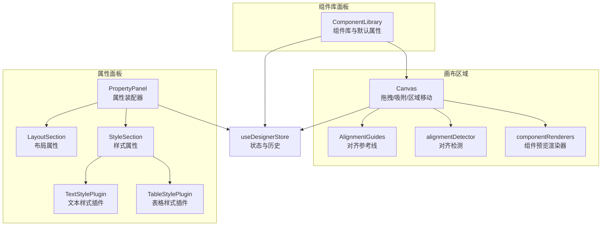
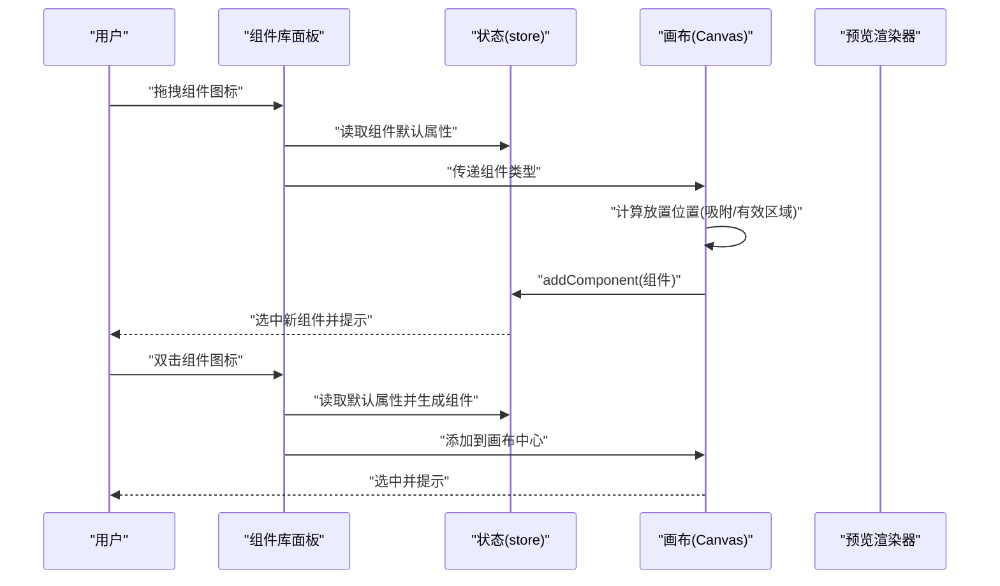
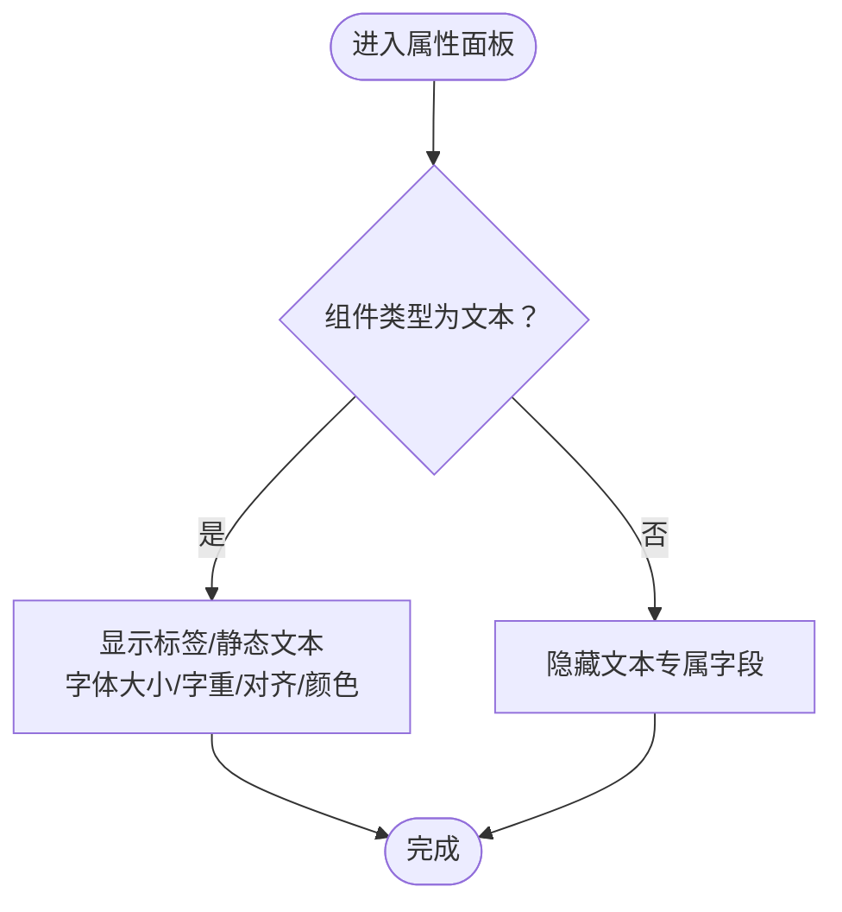
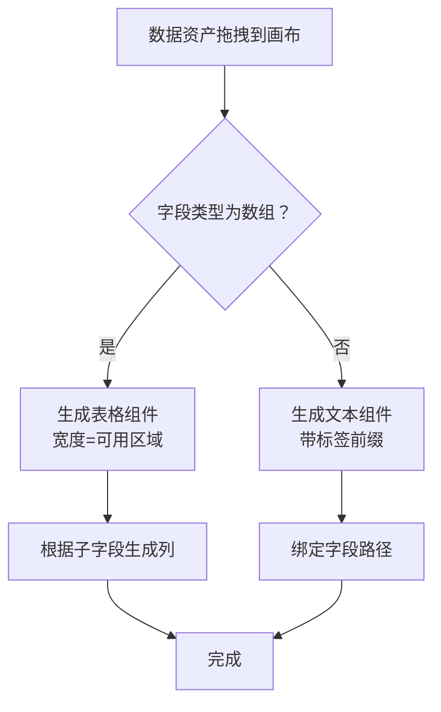
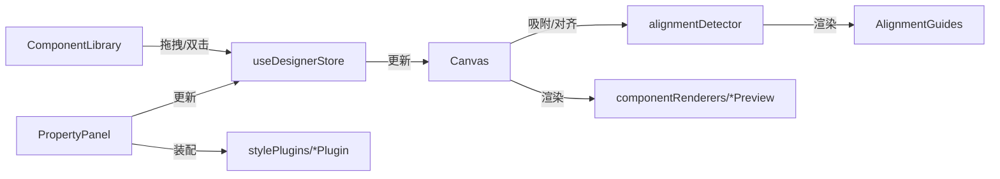

# 组件库使用指南

<cite>
**本文引用的文件**
- [designer/src/pages/Designer/components/AssetPanel/ComponentLibrary/index.tsx](file://designer/src/pages/Designer/components/AssetPanel/ComponentLibrary/index.tsx)
- [designer/src/pages/Designer/components/Canvas/index.tsx](file://designer/src/pages/Designer/components/Canvas/index.tsx)
- [designer/src/pages/Designer/components/Canvas/AlignmentGuides.tsx](file://designer/src/pages/Designer/components/Canvas/AlignmentGuides.tsx)
- [designer/src/pages/Designer/components/Canvas/alignmentDetector.ts](file://designer/src/pages/Designer/components/Canvas/alignmentDetector.ts)
- [designer/src/pages/Designer/components/Canvas/componentRenderers/index.ts](file://designer/src/pages/Designer/components/Canvas/componentRenderers/index.ts)
- [designer/src/pages/Designer/components/Canvas/componentRenderers/TextPreview.tsx](file://designer/src/pages/Designer/components/Canvas/componentRenderers/TextPreview.tsx)
- [designer/src/pages/Designer/components/Canvas/componentRenderers/TablePreview.tsx](file://designer/src/pages/Designer/components/Canvas/componentRenderers/TablePreview.tsx)
- [designer/src/pages/Designer/components/Canvas/componentRenderers/ImagePreview.tsx](file://designer/src/pages/Designer/components/Canvas/componentRenderers/ImagePreview.tsx)
- [designer/src/pages/Designer/components/PropertyPanel/index.tsx](file://designer/src/pages/Designer/components/PropertyPanel/index.tsx)
- [designer/src/pages/Designer/components/PropertyPanel/LayoutSection.tsx](file://designer/src/pages/Designer/components/PropertyPanel/LayoutSection.tsx)
- [designer/src/pages/Designer/components/PropertyPanel/StyleSection.tsx](file://designer/src/pages/Designer/components/PropertyPanel/StyleSection.tsx)
- [designer/src/pages/Designer/components/PropertyPanel/stylePlugins/TextStylePlugin.tsx](file://designer/src/pages/Designer/components/PropertyPanel/stylePlugins/TextStylePlugin.tsx)
- [designer/src/pages/Designer/components/PropertyPanel/stylePlugins/TableStylePlugin.tsx](file://designer/src/pages/Designer/components/PropertyPanel/stylePlugins/TableStylePlugin.tsx)
- [designer/src/store/designer.ts](file://designer/src/store/designer.ts)
- [designer/src/types/index.ts](file://designer/src/types/index.ts)
</cite>

## 目录
1. [简介](#简介)
2. [项目结构](#项目结构)
3. [核心组件](#核心组件)
4. [架构总览](#架构总览)
5. [详细组件分析](#详细组件分析)
6. [依赖关系分析](#依赖关系分析)
7. [性能考量](#性能考量)
8. [故障排查指南](#故障排查指南)
9. [结论](#结论)
10. [附录](#附录)

## 简介
本指南面向使用组件库进行打印模板设计的用户与开发者，系统讲解组件库的分类体系、属性配置、拖拽添加与智能吸附、双击快速添加、属性面板（布局/样式/数据绑定）以及各组件的典型使用场景与最佳实践。

## 项目结构
组件库位于设计器前端工程中，主要由“组件库面板”、“画布区域”、“属性面板”三大部分组成，配合状态管理与类型定义，形成完整的可视化设计体验。

**图表来源**
- [designer/src/pages/Designer/components/AssetPanel/ComponentLibrary/index.tsx:26-238](file://designer/src/pages/Designer/components/AssetPanel/ComponentLibrary/index.tsx#L26-L238)
- [designer/src/pages/Designer/components/Canvas/index.tsx:1-1362](file://designer/src/pages/Designer/components/Canvas/index.tsx#L1-L1362)
- [designer/src/pages/Designer/components/Canvas/AlignmentGuides.tsx:1-66](file://designer/src/pages/Designer/components/Canvas/AlignmentGuides.tsx#L1-L66)
- [designer/src/pages/Designer/components/Canvas/alignmentDetector.ts:1-127](file://designer/src/pages/Designer/components/Canvas/alignmentDetector.ts#L1-L127)
- [designer/src/pages/Designer/components/Canvas/componentRenderers/index.ts:1-11](file://designer/src/pages/Designer/components/Canvas/componentRenderers/index.ts#L1-L11)
- [designer/src/pages/Designer/components/PropertyPanel/index.tsx:1-152](file://designer/src/pages/Designer/components/PropertyPanel/index.tsx#L1-L152)
- [designer/src/pages/Designer/components/PropertyPanel/LayoutSection.tsx:1-76](file://designer/src/pages/Designer/components/PropertyPanel/LayoutSection.tsx#L1-L76)
- [designer/src/pages/Designer/components/PropertyPanel/StyleSection.tsx:1-36](file://designer/src/pages/Designer/components/PropertyPanel/StyleSection.tsx#L1-L36)
- [designer/src/pages/Designer/components/PropertyPanel/stylePlugins/TextStylePlugin.tsx:1-86](file://designer/src/pages/Designer/components/PropertyPanel/stylePlugins/TextStylePlugin.tsx#L1-L86)
- [designer/src/pages/Designer/components/PropertyPanel/stylePlugins/TableStylePlugin.tsx:1-48](file://designer/src/pages/Designer/components/PropertyPanel/stylePlugins/TableStylePlugin.tsx#L1-L48)
- [designer/src/store/designer.ts:1-773](file://designer/src/store/designer.ts#L1-L773)

**章节来源**
- [designer/src/pages/Designer/components/AssetPanel/ComponentLibrary/index.tsx:26-238](file://designer/src/pages/Designer/components/AssetPanel/ComponentLibrary/index.tsx#L26-L238)
- [designer/src/pages/Designer/components/Canvas/index.tsx:1-1362](file://designer/src/pages/Designer/components/Canvas/index.tsx#L1-L1362)
- [designer/src/store/designer.ts:108-773](file://designer/src/store/designer.ts#L108-L773)

## 核心组件
组件库共支持七种核心组件类型，按用途分为三大类：

- 基础组件（basic）
  - 文本（text）：支持标签前缀、静态文本、数据绑定与格式化；默认布局在画布中心附近，样式含字号、字重、对齐、颜色。
  - 图片（image）：支持本地/远程图片；默认尺寸适中，便于后续裁剪与排版。
  - 表格（table）：支持数组数据绑定，列配置、边框、表头显示、跨页重复表头等；默认宽度占满可用区域。

- 装饰组件（decoration）
  - 线条（line）：水平/垂直分割线，支持边框样式；默认宽度占满页面可用宽度。
  - 矩形（rect）：矩形边框，用于强调区域；默认透明背景与细实线边框。

- 编码组件（encoding）
  - 二维码（qrcode）：支持URL/文本编码；默认正方形尺寸。
  - 条形码（barcode）：支持多种编码格式；默认宽度适配常用条码长度。

组件默认属性与分类均在组件库面板中集中定义，便于统一管理与扩展。

**章节来源**
- [designer/src/pages/Designer/components/AssetPanel/ComponentLibrary/index.tsx:30-128](file://designer/src/pages/Designer/components/AssetPanel/ComponentLibrary/index.tsx#L30-L128)
- [designer/src/types/index.ts:129-137](file://designer/src/types/index.ts#L129-L137)

## 架构总览
组件库采用“状态驱动 + 插件化样式”的架构：
- 状态层：使用轻量状态库维护组件集合、选中状态、页面配置、历史记录等。
- 视图层：组件库面板负责拖拽与双击快速添加；画布负责拖拽放置、网格吸附、智能对齐、区域移动；属性面板按组件类型动态装配样式插件。
- 类型层：统一的组件节点与页面配置类型，保证数据结构一致性。

**图表来源**
- [designer/src/pages/Designer/components/AssetPanel/ComponentLibrary/index.tsx:152-180](file://designer/src/pages/Designer/components/AssetPanel/ComponentLibrary/index.tsx#L152-L180)
- [designer/src/pages/Designer/components/Canvas/index.tsx:281-479](file://designer/src/pages/Designer/components/Canvas/index.tsx#L281-L479)
- [designer/src/store/designer.ts:113-125](file://designer/src/store/designer.ts#L113-L125)

## 详细组件分析

### 文本组件（Text）
- 默认属性
  - 布局：绝对定位，初始尺寸较小，便于扩展。
  - 样式：默认字号、颜色、字重。
  - 属性：支持标签前缀与静态文本，便于组合“标签：值”形式。
- 使用场景
  - 显示固定文案、动态数据（通过数据绑定）。
  - 与图片/表格配合，形成图文混排或报表头部说明。
- 属性面板
  - 布局属性：X/Y/宽/高。
  - 样式属性：字体大小、字重、对齐、颜色。
  - 数据绑定：支持路径、管道、回退值。

**图表来源**
- [designer/src/pages/Designer/components/PropertyPanel/stylePlugins/TextStylePlugin.tsx:11-86](file://designer/src/pages/Designer/components/PropertyPanel/stylePlugins/TextStylePlugin.tsx#L11-L86)
- [designer/src/pages/Designer/components/PropertyPanel/index.tsx:127-132](file://designer/src/pages/Designer/components/PropertyPanel/index.tsx#L127-L132)

**章节来源**
- [designer/src/pages/Designer/components/AssetPanel/ComponentLibrary/index.tsx:30-43](file://designer/src/pages/Designer/components/AssetPanel/ComponentLibrary/index.tsx#L30-L43)
- [designer/src/pages/Designer/components/Canvas/componentRenderers/TextPreview.tsx:10-31](file://designer/src/pages/Designer/components/Canvas/componentRenderers/TextPreview.tsx#L10-L31)
- [designer/src/pages/Designer/components/PropertyPanel/stylePlugins/TextStylePlugin.tsx:11-86](file://designer/src/pages/Designer/components/PropertyPanel/stylePlugins/TextStylePlugin.tsx#L11-L86)

### 图片组件（Image）
- 默认属性
  - 布局：绝对定位，适中尺寸。
  - 属性：支持图片地址，预览为空时显示占位提示。
- 使用场景
  - Logo、水印、品牌图片等装饰性元素。
  - 与文本/表格组合，提升可读性。
- 属性面板
  - 布局属性：X/Y/宽/高。
  - 样式属性：object-fit 等（可通过扩展插件补充）。
  - 数据绑定：支持图片地址绑定。

**章节来源**
- [designer/src/pages/Designer/components/AssetPanel/ComponentLibrary/index.tsx:44-55](file://designer/src/pages/Designer/components/AssetPanel/ComponentLibrary/index.tsx#L44-L55)
- [designer/src/pages/Designer/components/Canvas/componentRenderers/ImagePreview.tsx:10-34](file://designer/src/pages/Designer/components/Canvas/componentRenderers/ImagePreview.tsx#L10-L34)
- [designer/src/pages/Designer/components/PropertyPanel/index.tsx:127-132](file://designer/src/pages/Designer/components/PropertyPanel/index.tsx#L127-L132)

### 表格组件（Table）
- 默认属性
  - 布局：宽度占满页面可用区域，高度适中。
  - 样式：默认字号。
  - 属性：默认显示表头、带边框；支持列配置、跨页重复表头等。
- 使用场景
  - 列表数据展示、统计汇总、明细清单。
  - 与数据资产拖拽结合，自动填充列定义。
- 属性面板
  - 布局属性：X/Y/宽/高。
  - 样式属性：字体大小、对齐。
  - 数据绑定：绑定数组字段，自动推导列。
  - 列管理：增删列、列宽、隐藏、合计等（独立区域）。

**图表来源**
- [designer/src/pages/Designer/components/Canvas/index.tsx:415-479](file://designer/src/pages/Designer/components/Canvas/index.tsx#L415-L479)
- [designer/src/pages/Designer/components/Canvas/componentRenderers/TablePreview.tsx:69-175](file://designer/src/pages/Designer/components/Canvas/componentRenderers/TablePreview.tsx#L69-L175)

**章节来源**
- [designer/src/pages/Designer/components/AssetPanel/ComponentLibrary/index.tsx:56-73](file://designer/src/pages/Designer/components/AssetPanel/ComponentLibrary/index.tsx#L56-L73)
- [designer/src/pages/Designer/components/Canvas/index.tsx:415-479](file://designer/src/pages/Designer/components/Canvas/index.tsx#L415-L479)
- [designer/src/pages/Designer/components/Canvas/componentRenderers/TablePreview.tsx:69-175](file://designer/src/pages/Designer/components/Canvas/componentRenderers/TablePreview.tsx#L69-L175)
- [designer/src/pages/Designer/components/PropertyPanel/stylePlugins/TableStylePlugin.tsx:11-48](file://designer/src/pages/Designer/components/PropertyPanel/stylePlugins/TableStylePlugin.tsx#L11-L48)

### 二维码组件（QRCode）
- 默认属性
  - 布局：正方形，尺寸适中。
  - 属性：内容与尺寸。
- 使用场景
  - 产品包装、票据、宣传物料上的扫码入口。
- 属性面板
  - 布局属性：X/Y/宽/高。
  - 数据绑定：支持内容绑定。
  - 样式属性：可扩展（如边距、内边距等）。

**章节来源**
- [designer/src/pages/Designer/components/AssetPanel/ComponentLibrary/index.tsx:92-103](file://designer/src/pages/Designer/components/AssetPanel/ComponentLibrary/index.tsx#L92-L103)
- [designer/src/pages/Designer/components/PropertyPanel/index.tsx:127-132](file://designer/src/pages/Designer/components/PropertyPanel/index.tsx#L127-L132)

### 条形码组件（Barcode）
- 默认属性
  - 布局：适中高度与宽度。
  - 属性：内容与编码格式。
- 使用场景
  - 商品标签、物流面单、资产管理等。
- 属性面板
  - 布局属性：X/Y/宽/高。
  - 数据绑定：支持内容绑定。
  - 样式属性：可扩展（如字号、颜色等）。

**章节来源**
- [designer/src/pages/Designer/components/AssetPanel/ComponentLibrary/index.tsx:104-115](file://designer/src/pages/Designer/components/AssetPanel/ComponentLibrary/index.tsx#L104-L115)
- [designer/src/pages/Designer/components/PropertyPanel/index.tsx:127-132](file://designer/src/pages/Designer/components/PropertyPanel/index.tsx#L127-L132)

### 线条组件（Line）
- 默认属性
  - 布局：默认水平线，宽度占满页面可用宽度。
  - 样式：默认上边框线宽、颜色、实线样式。
- 使用场景
  - 分割线、页眉页脚分隔、报表分区。
- 属性面板
  - 布局属性：X/Y/宽/高。
  - 样式属性：边框相关（宽度、颜色、样式）。
  - 数据绑定：装饰性组件通常无需绑定。

**章节来源**
- [designer/src/pages/Designer/components/AssetPanel/ComponentLibrary/index.tsx:74-91](file://designer/src/pages/Designer/components/AssetPanel/ComponentLibrary/index.tsx#L74-L91)
- [designer/src/pages/Designer/components/PropertyPanel/index.tsx:127-132](file://designer/src/pages/Designer/components/PropertyPanel/index.tsx#L127-L132)

### 矩形组件（Rect）
- 默认属性
  - 布局：绝对定位，适中尺寸。
  - 样式：默认细实线边框、透明背景。
- 使用场景
  - 区域框选、强调块状内容。
- 属性面板
  - 布局属性：X/Y/宽/高。
  - 样式属性：边框与背景色等。
  - 数据绑定：装饰性组件通常无需绑定。

**章节来源**
- [designer/src/pages/Designer/components/AssetPanel/ComponentLibrary/index.tsx:116-128](file://designer/src/pages/Designer/components/AssetPanel/ComponentLibrary/index.tsx#L116-L128)
- [designer/src/pages/Designer/components/PropertyPanel/index.tsx:127-132](file://designer/src/pages/Designer/components/PropertyPanel/index.tsx#L127-L132)

## 依赖关系分析
- 组件库面板与画布通过“组件类型”建立松耦合关联，前者提供默认属性，后者负责放置与约束。
- 画布与状态管理通过统一接口交互，保证撤销/重做、复制/粘贴、层级管理等功能的一致性。
- 属性面板采用插件化样式插件，按组件类型动态装配，降低耦合度与维护成本。
- 智能对齐依赖对齐检测工具与参考线组件，两者在拖拽过程中协同工作。

**图表来源**
- [designer/src/pages/Designer/components/AssetPanel/ComponentLibrary/index.tsx:152-180](file://designer/src/pages/Designer/components/AssetPanel/ComponentLibrary/index.tsx#L152-L180)
- [designer/src/pages/Designer/components/Canvas/index.tsx:281-479](file://designer/src/pages/Designer/components/Canvas/index.tsx#L281-L479)
- [designer/src/pages/Designer/components/Canvas/alignmentDetector.ts:31-126](file://designer/src/pages/Designer/components/Canvas/alignmentDetector.ts#L31-L126)
- [designer/src/pages/Designer/components/Canvas/AlignmentGuides.tsx:21-63](file://designer/src/pages/Designer/components/Canvas/AlignmentGuides.tsx#L21-L63)
- [designer/src/pages/Designer/components/PropertyPanel/index.tsx:17-149](file://designer/src/pages/Designer/components/PropertyPanel/index.tsx#L17-L149)
- [designer/src/store/designer.ts:108-773](file://designer/src/store/designer.ts#L108-L773)

**章节来源**
- [designer/src/pages/Designer/components/Canvas/alignmentDetector.ts:1-127](file://designer/src/pages/Designer/components/Canvas/alignmentDetector.ts#L1-L127)
- [designer/src/pages/Designer/components/Canvas/AlignmentGuides.tsx:1-66](file://designer/src/pages/Designer/components/Canvas/AlignmentGuides.tsx#L1-L66)
- [designer/src/pages/Designer/components/PropertyPanel/stylePlugins/TextStylePlugin.tsx:1-86](file://designer/src/pages/Designer/components/PropertyPanel/stylePlugins/TextStylePlugin.tsx#L1-L86)
- [designer/src/pages/Designer/components/PropertyPanel/stylePlugins/TableStylePlugin.tsx:1-48](file://designer/src/pages/Designer/components/PropertyPanel/stylePlugins/TableStylePlugin.tsx#L1-L48)

## 性能考量
- 拖拽过程中的吸附与对齐计算以毫米为基准，避免缩放带来的误差，同时将参考线位置换算为像素用于渲染，兼顾精度与性能。
- 列宽拖拽采用“移动时本地预览 + 释放时一次性提交”，减少状态写入频率，避免历史记录膨胀。
- 状态快照限制在固定步数，防止内存占用持续增长。

[本节为通用指导，不直接分析具体文件]

## 故障排查指南
- 组件无法拖入页头/页脚
  - 表格组件不支持放入页头/页脚区域，拖拽时会收到提示。
- 组件超出画布边界
  - 画布会检测组件右/底部是否越界；连续纸模式仅检测宽度，不检测高度。
- 智能对齐无效
  - 对齐阈值为毫米级，若组件间距过大则不会吸附；按住 Shift 可临时禁用网格吸附。
- 属性面板不显示数据绑定
  - 仅文本、图片、二维码、条形码、表格等具备数据展示需求的组件才显示数据绑定区域。

**章节来源**
- [designer/src/pages/Designer/components/Canvas/index.tsx:298-302](file://designer/src/pages/Designer/components/Canvas/index.tsx#L298-L302)
- [designer/src/pages/Designer/components/Canvas/index.tsx:222-279](file://designer/src/pages/Designer/components/Canvas/index.tsx#L222-L279)
- [designer/src/pages/Designer/components/Canvas/alignmentDetector.ts:11-127](file://designer/src/pages/Designer/components/Canvas/alignmentDetector.ts#L11-L127)
- [designer/src/pages/Designer/components/PropertyPanel/index.tsx:127-132](file://designer/src/pages/Designer/components/PropertyPanel/index.tsx#L127-L132)

## 结论
组件库通过清晰的分类、统一的默认属性、完善的拖拽与吸附机制、可插拔的样式面板，为打印模板设计提供了高效、直观的工具链。遵循本文档的使用方法与最佳实践，可在保证一致性的前提下快速构建高质量的打印模板。

## 附录

### 操作流程速览
- 拖拽添加组件到画布
  - 从组件库面板拖拽组件图标至画布，系统自动计算吸附位置与有效区域，生成组件并选中。
- 双击快速添加
  - 双击组件图标，组件被添加到画布中心附近，适合快速布局。
- 智能吸附与对齐
  - 拖拽时自动显示对齐参考线，接近阈值即吸附；支持按住 Shift 临时禁用吸附。
- 属性面板
  - 选中组件后，按需调整布局、样式与数据绑定；表格组件还支持列管理。

**章节来源**
- [designer/src/pages/Designer/components/AssetPanel/ComponentLibrary/index.tsx:152-180](file://designer/src/pages/Designer/components/AssetPanel/ComponentLibrary/index.tsx#L152-L180)
- [designer/src/pages/Designer/components/Canvas/index.tsx:281-479](file://designer/src/pages/Designer/components/Canvas/index.tsx#L281-L479)
- [designer/src/pages/Designer/components/Canvas/alignmentDetector.ts:31-126](file://designer/src/pages/Designer/components/Canvas/alignmentDetector.ts#L31-L126)
- [designer/src/pages/Designer/components/PropertyPanel/index.tsx:17-149](file://designer/src/pages/Designer/components/PropertyPanel/index.tsx#L17-L149)