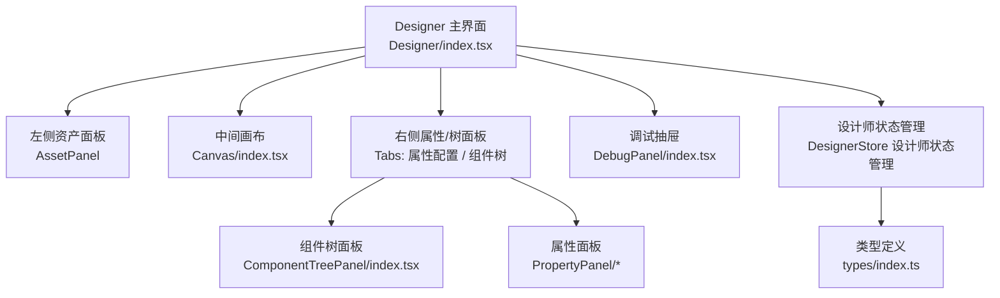
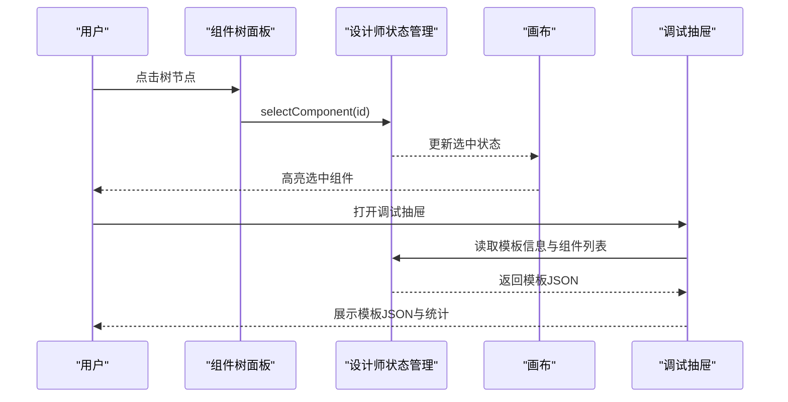
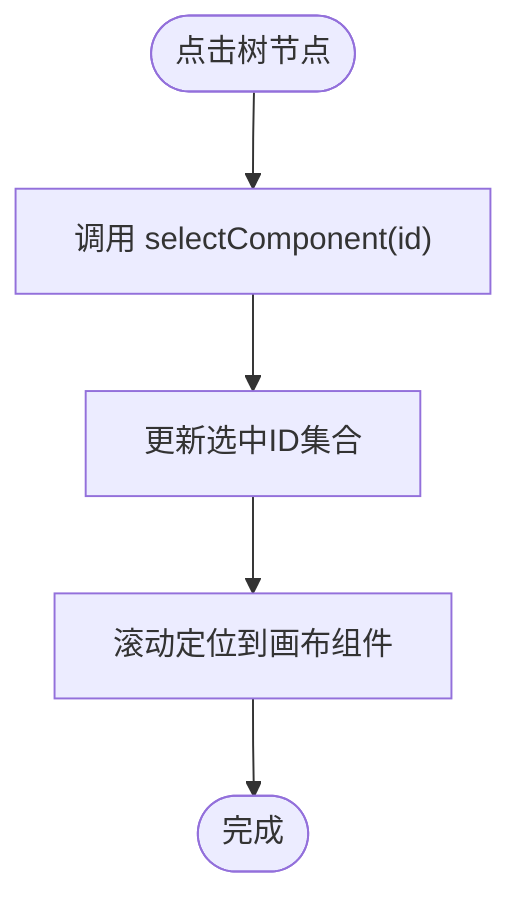
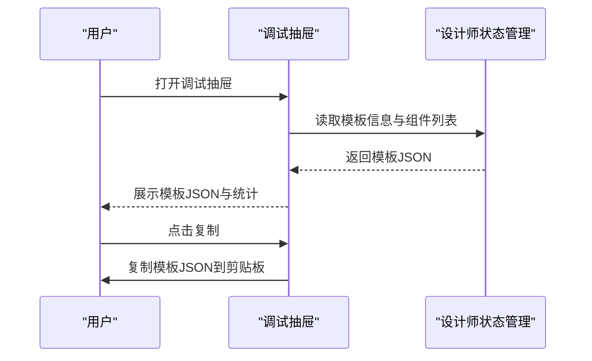
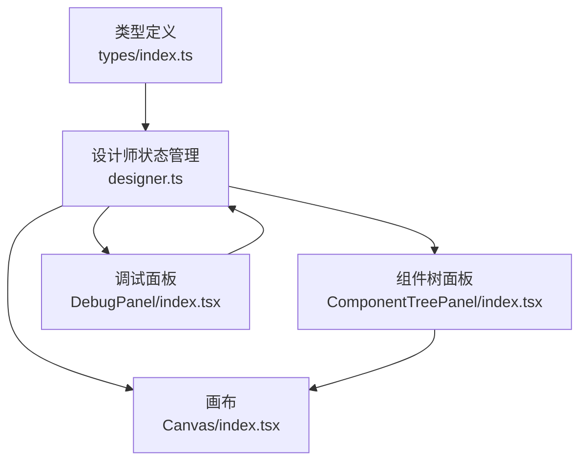

# 组件树与调试

<cite>
**本文引用的文件**
- [ComponentTreePanel/index.tsx](file://designer/src/pages/Designer/components/ComponentTreePanel/index.tsx)
- [DebugPanel/index.tsx](file://designer/src/pages/Designer/components/DebugPanel/index.tsx)
- [Designer/index.tsx](file://designer/src/pages/Designer/index.tsx)
- [DesignerStore 设计师状态管理](file://designer/src/store/designer.ts)
- [类型定义](file://designer/src/types/index.ts)
- [Canvas 画布](file://designer/src/pages/Designer/components/Canvas/index.tsx)
</cite>

## 目录
1. [简介](#简介)
2. [项目结构](#项目结构)
3. [核心组件](#核心组件)
4. [架构总览](#架构总览)
5. [组件详解](#组件详解)
6. [依赖关系分析](#依赖关系分析)
7. [性能与交互特性](#性能与交互特性)
8. [故障排查与常见问题](#故障排查与常见问题)
9. [结论](#结论)
10. [附录：使用技巧与最佳实践](#附录使用技巧与最佳实践)

## 简介
本指南聚焦“组件树面板”和“调试面板”的使用与原理，帮助你高效完成以下任务：
- 通过组件树面板查看模板的层次结构，理解组件的父子关系、嵌套结构与组件ID标识。
- 在组件树中进行组件选择、定位、删除等操作，并结合画布实现联动。
- 了解组件树的排序与重组能力（通过画布拖拽实现层级调整与区域迁移）。
- 使用调试面板实时查看模板JSON、复制导出、辅助模板结构分析与Schema绑定状态核验。
- 掌握调试信息的解读方法与常见问题的诊断思路。

## 项目结构
组件树与调试功能位于设计器页面中，采用“左侧资产面板 + 中间画布 + 右侧属性/树面板”的布局。组件树与调试分别作为右侧面板的两个Tab页与独立抽屉存在。

图表来源
- [Designer/index.tsx:261-315](file://designer/src/pages/Designer/index.tsx#L261-L315)
- [ComponentTreePanel/index.tsx:66-156](file://designer/src/pages/Designer/components/ComponentTreePanel/index.tsx#L66-L156)
- [DebugPanel/index.tsx:9-76](file://designer/src/pages/Designer/components/DebugPanel/index.tsx#L9-L76)
- [DesignerStore 设计师状态管理:108-773](file://designer/src/store/designer.ts#L108-L773)
- [类型定义:303-358](file://designer/src/types/index.ts#L303-L358)

章节来源
- [Designer/index.tsx:261-315](file://designer/src/pages/Designer/index.tsx#L261-L315)

## 核心组件
- 组件树面板：以“页头/内容/页脚”三区域分组展示组件，支持组件选择、右键菜单（复制、删除）、滚动定位到画布。
- 调试面板：右侧抽屉，展示模板名称、Schema ID、组件数量统计与完整模板JSON，支持一键复制。
- 设计师状态管理：集中管理组件列表、选中状态、模板信息、页面配置、撤销/重做、层级调整、区域迁移等。
- 类型定义：统一定义组件节点、页面配置、打印模板等核心数据结构。

章节来源
- [ComponentTreePanel/index.tsx:66-156](file://designer/src/pages/Designer/components/ComponentTreePanel/index.tsx#L66-L156)
- [DebugPanel/index.tsx:9-76](file://designer/src/pages/Designer/components/DebugPanel/index.tsx#L9-L76)
- [DesignerStore 设计师状态管理:9-90](file://designer/src/store/designer.ts#L9-L90)
- [类型定义:303-358](file://designer/src/types/index.ts#L303-L358)

## 架构总览
组件树与调试均依赖于“设计师状态管理”，通过状态变更驱动UI更新；组件树与画布之间通过组件ID建立强关联，实现点击树项跳转到画布并高亮选中。

图表来源
- [ComponentTreePanel/index.tsx:77-83](file://designer/src/pages/Designer/components/ComponentTreePanel/index.tsx#L77-L83)
- [DesignerStore 设计师状态管理:151-168](file://designer/src/store/designer.ts#L151-L168)
- [Designer/index.tsx:318-359](file://designer/src/pages/Designer/index.tsx#L318-L359)

## 组件详解

### 组件树面板
- 展示区域：页头区域、内容区域、页脚区域，分别统计各区域组件数量。
- 展示内容：组件图标、组件类型名称、索引序号、数据绑定路径（若存在）。
- 交互能力：
  - 点击树节点：选中对应组件并在画布中滚动定位。
  - 右键菜单：复制组件、删除组件。
- 组件ID与定位：树节点key即组件ID，点击后通过DOM查询与滚动定位到画布对应组件。

图表来源
- [ComponentTreePanel/index.tsx:77-83](file://designer/src/pages/Designer/components/ComponentTreePanel/index.tsx#L77-L83)

章节来源
- [ComponentTreePanel/index.tsx:66-156](file://designer/src/pages/Designer/components/ComponentTreePanel/index.tsx#L66-L156)

### 调试面板
- 功能概览：
  - 展示模板名称、Schema ID、组件总数与三区域细分数量。
  - 展示完整模板JSON，支持一键复制。
- 数据来源：从状态管理读取模板信息与组件列表，生成模板JSON。
- 与组件树联动：调试抽屉内也提供复制按钮，便于快速导出。

图表来源
- [DebugPanel/index.tsx:9-76](file://designer/src/pages/Designer/components/DebugPanel/index.tsx#L9-L76)
- [Designer/index.tsx:318-359](file://designer/src/pages/Designer/index.tsx#L318-L359)

章节来源
- [DebugPanel/index.tsx:9-76](file://designer/src/pages/Designer/components/DebugPanel/index.tsx#L9-L76)
- [Designer/index.tsx:318-359](file://designer/src/pages/Designer/index.tsx#L318-L359)

### 画布与组件树联动
- 组件树与画布共享同一份组件数据源，组件ID即树节点key。
- 画布支持组件拖拽、尺寸调整、智能对齐、区域迁移（页头/内容/页脚）。
- 画布右键菜单提供复制、克隆、删除、层级调整等操作，与组件树右键菜单一致。

图表来源
- [Canvas 画布:22-56](file://designer/src/pages/Designer/components/Canvas/index.tsx#L22-L56)
- [DesignerStore 设计师状态管理:108-773](file://designer/src/store/designer.ts#L108-L773)
- [ComponentTreePanel/index.tsx:66-156](file://designer/src/pages/Designer/components/ComponentTreePanel/index.tsx#L66-L156)

章节来源
- [Canvas 画布:22-56](file://designer/src/pages/Designer/components/Canvas/index.tsx#L22-L56)
- [DesignerStore 设计师状态管理:108-773](file://designer/src/store/designer.ts#L108-L773)

### 组件树的排序与重组
- 组件树本身不直接支持拖拽排序，但可通过画布拖拽实现：
  - 在画布中拖拽组件到不同区域（页头/内容/页脚），实现区域重组。
  - 在区域内拖拽组件实现层级调整（置顶、置底、上下移动一层）。
  - 画布右键菜单提供“层级”子菜单，支持置顶、上移一层、下移一层、置底。
- 多选与批量操作：
  - 在画布中按住 Ctrl/Cmd 多选组件，统一拖拽移动与调整。
  - 右键菜单支持复制、克隆、删除，配合 Ctrl+C/V 实现批量复制粘贴。

章节来源
- [Canvas 画布:752-859](file://designer/src/pages/Designer/components/Canvas/index.tsx#L752-L859)
- [DesignerStore 设计师状态管理:360-466](file://designer/src/store/designer.ts#L360-L466)

### 组件树的组件选择、定位、删除
- 选择：点击树节点触发选中，画布高亮对应组件。
- 定位：点击树节点后自动滚动到画布对应组件位置。
- 删除：树右键菜单提供删除选项，或在画布中按 Delete 键删除选中组件。

章节来源
- [ComponentTreePanel/index.tsx:77-83](file://designer/src/pages/Designer/components/ComponentTreePanel/index.tsx#L77-L83)
- [Canvas 画布:146-220](file://designer/src/pages/Designer/components/Canvas/index.tsx#L146-L220)

### 调试信息的解读与模板验证
- 模板名称与Schema ID：用于确认当前模板与Schema绑定状态。
- 组件数量统计：页头/内容/页脚三区域数量，便于快速核对布局。
- 模板JSON：完整模板结构，可用于导出、对比、二次加工或SDK校验。
- 复制导出：一键复制模板JSON，便于分享或集成到其他系统。

章节来源
- [DebugPanel/index.tsx:9-76](file://designer/src/pages/Designer/components/DebugPanel/index.tsx#L9-L76)
- [DesignerStore 设计师状态管理:189-201](file://designer/src/store/designer.ts#L189-L201)

## 依赖关系分析
- 组件树依赖状态管理中的组件列表与选中状态，渲染树节点与右键菜单。
- 调试面板依赖状态管理中的模板信息与组件列表，生成模板JSON。
- 画布与组件树共享同一数据源，二者通过组件ID保持一致性。
- 类型定义为组件树、画布、调试面板提供统一的数据契约。

图表来源
- [类型定义:303-358](file://designer/src/types/index.ts#L303-L358)
- [DesignerStore 设计师状态管理:108-773](file://designer/src/store/designer.ts#L108-L773)
- [ComponentTreePanel/index.tsx:66-156](file://designer/src/pages/Designer/components/ComponentTreePanel/index.tsx#L66-L156)
- [DebugPanel/index.tsx:9-76](file://designer/src/pages/Designer/components/DebugPanel/index.tsx#L9-L76)
- [Canvas 画布:22-56](file://designer/src/pages/Designer/components/Canvas/index.tsx#L22-L56)

章节来源
- [类型定义:303-358](file://designer/src/types/index.ts#L303-L358)
- [DesignerStore 设计师状态管理:108-773](file://designer/src/store/designer.ts#L108-L773)

## 性能与交互特性
- 组件树渲染：按区域生成树节点，避免一次性渲染大量节点导致卡顿。
- 画布拖拽：使用 useRef 缓存状态，减少事件监听器重绑，提升拖拽流畅度。
- 智能对齐：单组件拖拽时检测对齐，降低布局误差。
- 网格吸附：支持按住 Shift 临时禁用吸附，兼顾精确微调。
- 撤销/重做：全量状态快照，最多保留固定步数，保障可逆性。

章节来源
- [Canvas 画布:78-98](file://designer/src/pages/Designer/components/Canvas/index.tsx#L78-L98)
- [DesignerStore 设计师状态管理:92-106](file://designer/src/store/designer.ts#L92-L106)

## 故障排查与常见问题
- 组件树无响应或无法定位：
  - 检查组件ID是否正确传递至树节点key。
  - 确认状态管理中的选中ID与组件ID一致。
- 右键菜单无效：
  - 确保组件处于选中状态后再右键。
  - 检查画布右键菜单与组件树右键菜单的触发条件。
- 拖拽无效或组件越界：
  - 检查页面尺寸、边距与区域高度配置。
  - 确认组件未超出页头/页脚区域限制（表格组件不可放入页头/页脚）。
- 调试面板无法复制：
  - 确认浏览器允许剪贴板访问。
  - 检查模板JSON是否为空或生成异常。
- 模板结构异常：
  - 使用调试面板复制JSON，比对关键字段（名称、Schema ID、组件列表、区域配置）。
  - 若Schema ID为空，需先绑定Schema再导出。

章节来源
- [ComponentTreePanel/index.tsx:77-83](file://designer/src/pages/Designer/components/ComponentTreePanel/index.tsx#L77-L83)
- [Canvas 画布:281-479](file://designer/src/pages/Designer/components/Canvas/index.tsx#L281-L479)
- [DesignerStore 设计师状态管理:189-201](file://designer/src/store/designer.ts#L189-L201)

## 结论
组件树面板与调试面板共同构成了模板设计与验证的核心工具链：前者负责结构化浏览与快速定位，后者负责模板输出与结构核验。通过画布的拖拽与右键菜单，可以高效完成组件的排序、重组与批量操作。建议在设计过程中结合调试面板进行结构校验与导出，确保模板质量与可复用性。

## 附录：使用技巧与最佳实践
- 使用组件树快速定位组件：点击树节点即可在画布中定位并高亮选中。
- 通过画布拖拽实现区域迁移：将组件拖拽到页头/内容/页脚区域，实现布局重组。
- 多选与批量操作：按住 Ctrl/Cmd 多选组件，统一拖拽与调整，提高效率。
- 利用调试面板导出模板：复制模板JSON，便于分享、归档或集成到SDK。
- 绑定Schema：在调试面板确认Schema ID，确保数据绑定正确。
- 合理使用网格与对齐：开启网格与智能对齐，提升布局精度与一致性。
- 撤销/重做：频繁操作时注意使用撤销/重做，避免误操作带来的损失。