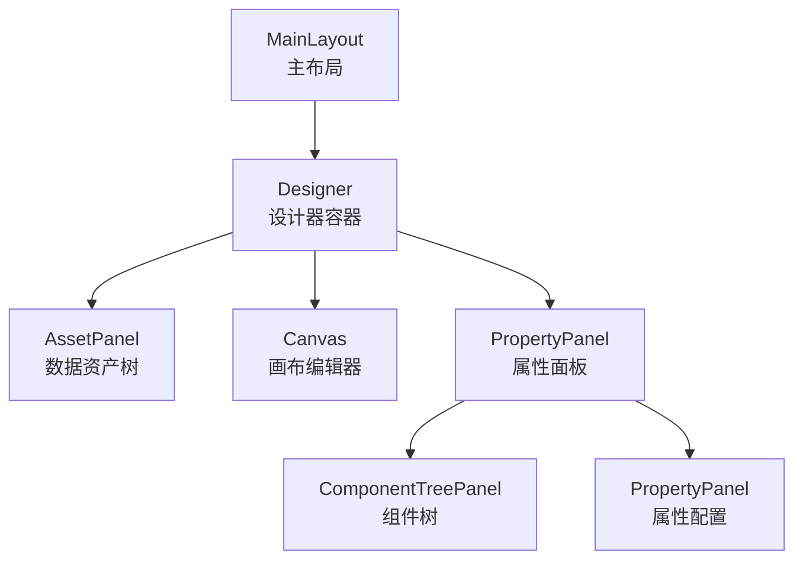
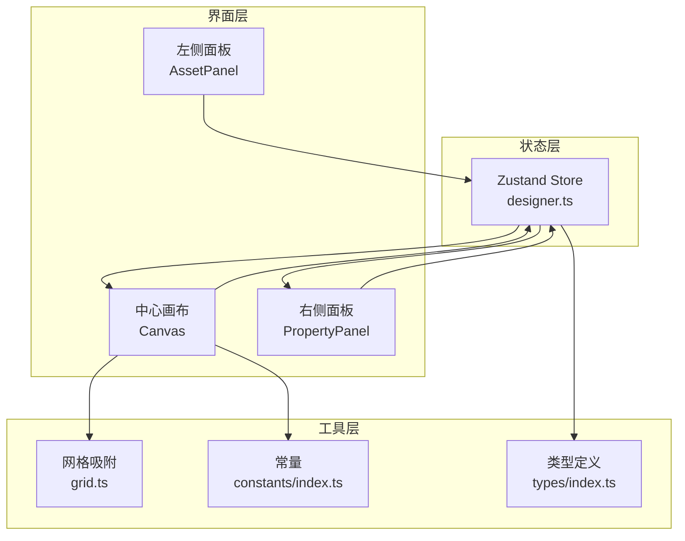
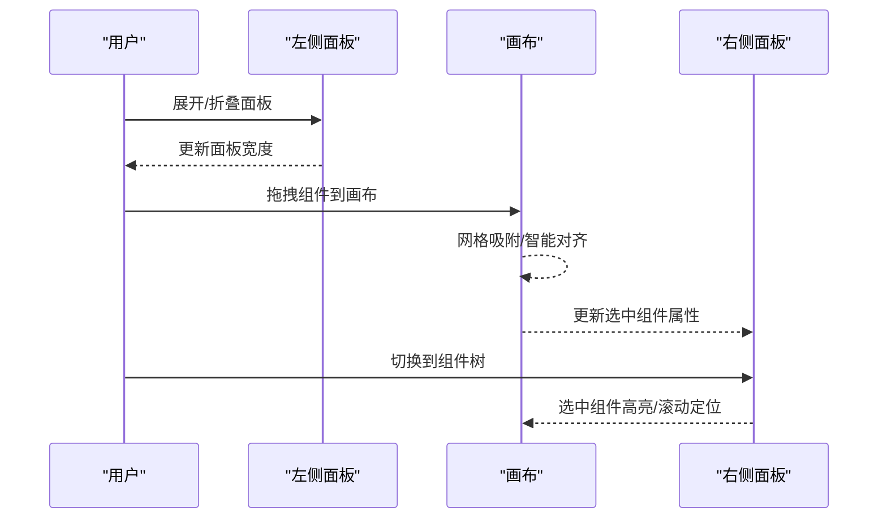
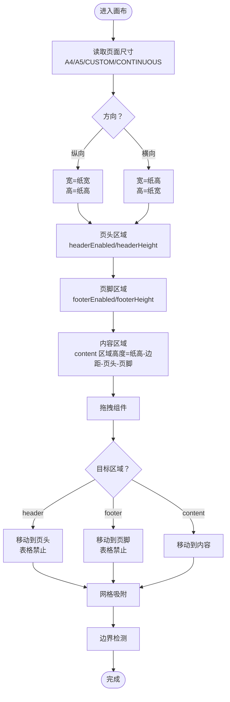
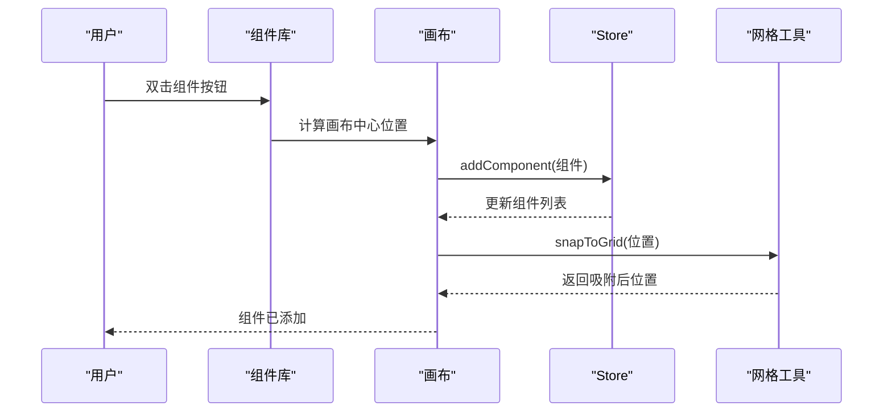
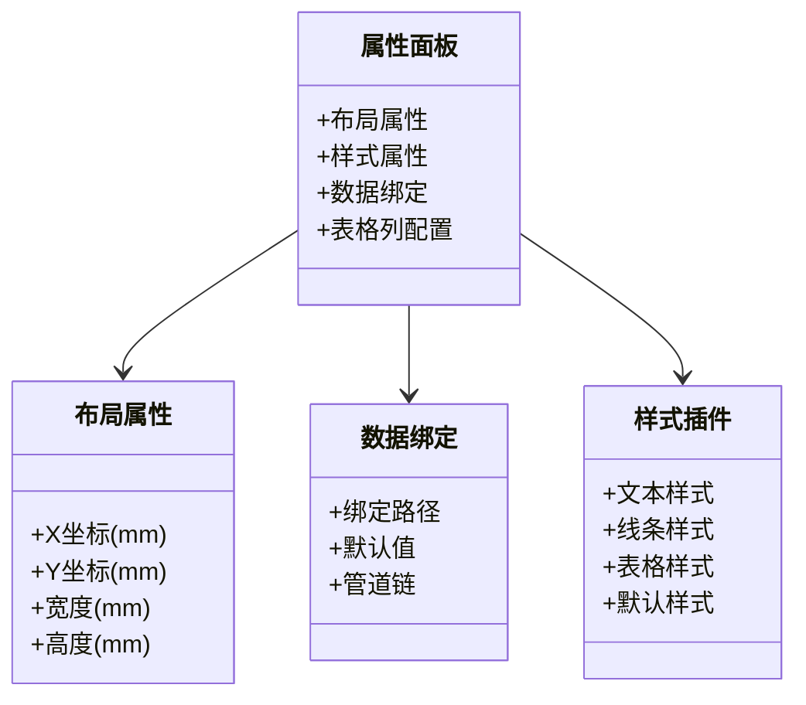
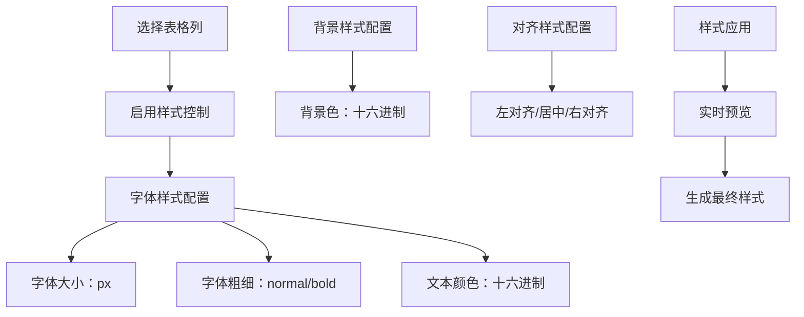
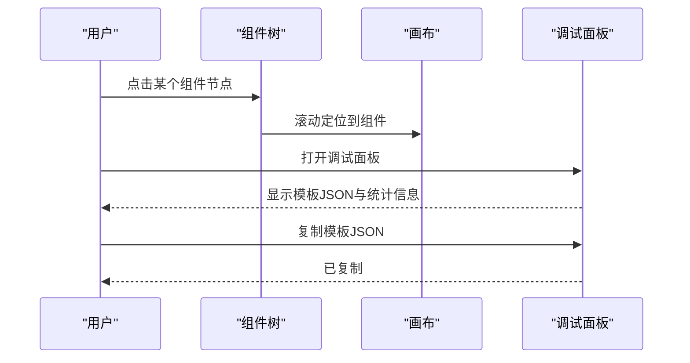
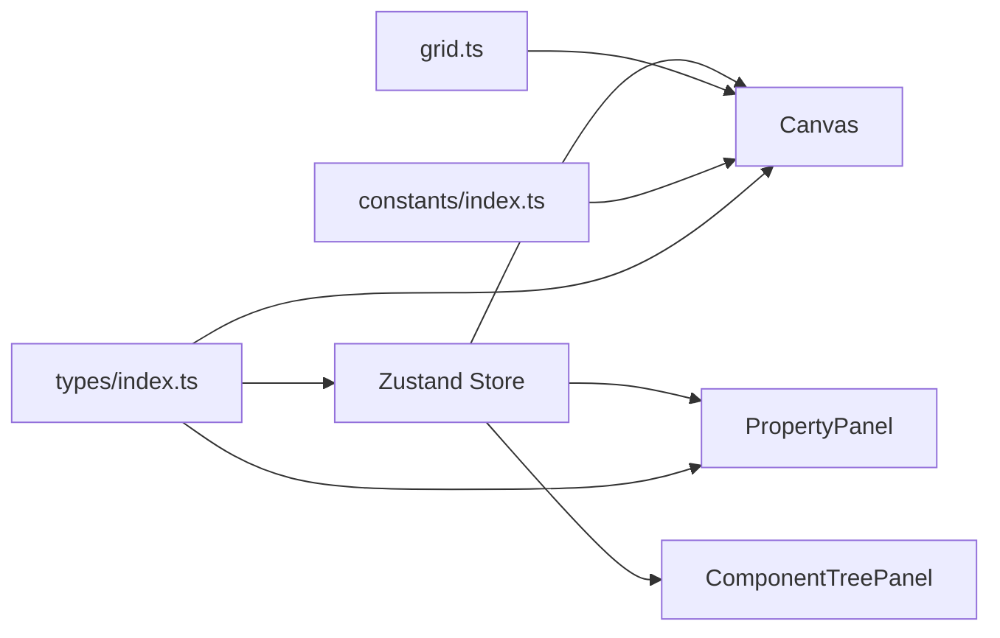

# 设计器使用指南

<cite>
**本文档引用的文件**
- [designer/README.md](file://designer/README.md)
- [Designer/index.tsx](file://designer/src/pages/Designer/index.tsx)
- [MainLayout.tsx](file://designer/src/layouts/MainLayout.tsx)
- [designer.ts](file://designer/src/store/designer.ts)
- [index.ts](file://designer/src/types/index.ts)
- [AssetPanel/index.tsx](file://designer/src/pages/Designer/components/AssetPanel/index.tsx)
- [Canvas/index.tsx](file://designer/src/pages/Designer/components/Canvas/index.tsx)
- [PropertyPanel/index.tsx](file://designer/src/pages/Designer/components/PropertyPanel/index.tsx)
- [ComponentTreePanel/index.tsx](file://designer/src/pages/Designer/components/ComponentTreePanel/index.tsx)
- [ComponentLibrary/index.tsx](file://designer/src/pages/Designer/components/AssetPanel/ComponentLibrary/index.tsx)
- [LayoutSection.tsx](file://designer/src/pages/Designer/components/PropertyPanel/LayoutSection.tsx)
- [DataBindingSection.tsx](file://designer/src/pages/Designer/components/PropertyPanel/DataBindingSection.tsx)
- [ComponentPreview.tsx](file://designer/src/pages/Designer/components/Canvas/ComponentPreview.tsx)
- [DebugPanel/index.tsx](file://designer/src/pages/Designer/components/DebugPanel/index.tsx)
- [grid.ts](file://designer/src/utils/grid.ts)
- [constants/index.ts](file://designer/src/constants/index.ts)
- [stylePlugins/index.ts](file://designer/src/pages/Designer/components/PropertyPanel/stylePlugins/index.ts)
- [configurators/index.tsx](file://designer/src/pipes/configurators/index.tsx)
- [TableColumnSection.tsx](file://designer/src/pages/Designer/components/PropertyPanel/TableColumnSection.tsx)
- [TableStylePlugin.tsx](file://designer/src/pages/Designer/components/PropertyPanel/stylePlugins/TableStylePlugin.tsx)
- [TableRenderer.ts](file://sdk/src/printEngine/renderers/TableRenderer.ts)
</cite>

## 更新摘要
**所做更改**
- 新增表格列级样式配置章节，详细介绍表格样式面板新增的列级样式功能
- 更新表格样式配置部分，包含字体、颜色、对齐等样式控制的具体使用方法
- 新增表格列样式配置的实际操作流程和最佳实践建议

## 目录
1. [简介](#简介)
2. [技术架构](#技术架构)
3. [项目结构](#项目结构)
4. [核心组件](#核心组件)
5. [架构总览](#架构总览)
6. [详细组件分析](#详细组件分析)
7. [依赖分析](#依赖分析)
8. [性能考虑](#性能考虑)
9. [故障排除指南](#故障排除指南)
10. [结论](#结论)
11. [附录](#附录)

## 简介
本指南面向可视化打印模板设计器的使用者，帮助您快速掌握三栏布局（数据资产树、画布编辑器、属性面板）、三区域画布系统（页头/内容/页脚）、组件库拖拽与双击添加、智能网格吸附、属性面板配置（样式、数据绑定、管道）、组件树面板与调试工具的使用方法，并提供设计工作流程与最佳实践建议。

**更新** 新增表格样式面板的列级样式配置功能，支持对表格每一列进行独立的字体、颜色、对齐等样式控制。

## 技术架构

### 技术栈概览
设计器基于现代化前端技术栈构建，采用 React 18 + TypeScript 开发，配合 Vite 5 进行构建，使用 Zustand 5 进行状态管理，Ant Design 6 作为 UI 组件库，Monaco Editor 0.55 提供代码编辑能力。

| 类别 | 选型 |
|------|------|
| 框架 | React 18 + TypeScript |
| 构建 | Vite 5 |
| 路由 | react-router-dom 7 |
| 状态管理 | Zustand 5 |
| UI 组件库 | Ant Design 6 |
| 代码编辑 | Monaco Editor 0.55 |
| 打印 SDK | `@jcyao/print-sdk`（本地 workspace 别名） |

### 路由系统
设计器采用多页面架构，支持完整的路由导航：

| 路径 | 页面 | 说明 |
|------|------|------|
| `/templates` | TemplateManagement | 模板管理（默认首页） |
| `/schemas` | SchemaManagement | Schema 字典管理 |
| `/mock-data` | MockDataManagement | Mock 数据管理 |
| `/designer` | Designer | 可视化设计器（全屏） |

### 目录结构
```
designer/
├── mock/                   # Mock API 数据源（Schema/模板/MockData）
├── src/
│   ├── pages/
│   │   ├── Designer/             # 设计器主页面
│   │   │   └── components/
│   │   │       ├── AssetPanel/       # 左侧资产面板（数据资产 + 组件库）
│   │   │       ├── Canvas/           # 画布编辑器（拖拽、对齐、吸附）
│   │   │       ├── PropertyPanel/    # 右侧属性面板（样式插件）
│   │   │       ├── ComponentTreePanel/  # 组件树
│   │   │       └── DebugPanel/       # 调试面板
│   │   ├── TemplateManagement/   # 模板管理
│   │   ├── SchemaManagement/     # Schema 管理
│   │   └── MockDataManagement/   # Mock 数据管理
│   ├── components/           # 通用组件（PrintPreview、Barcode、QRCode）
│   ├── layouts/              # 主布局（MainLayout）
│   ├── pipes/configurators/  # 管道 UI 配置器
│   ├── services/             # API 层（mockApi + mockStore）
│   ├── store/                # Zustand 全局状态
│   ├── types/                # 设计器内部类型
│   └── utils/                # 工具函数（grid、zoom、pageSize）
└── vite.config.ts            # Vite 配置（含 SDK 别名）
```

### 关联包
- **SDK**：`../sdk/`（npm: `@jcyao/print-sdk`）
- **SDK CHANGELOG**：`../sdk/CHANGELOG.md`
- **根目录**：`../README.md`（项目整体介绍）

> 本地开发时（`npm run dev`），Vite 会自动将 `@jcyao/print-sdk` 别名指向 `../sdk/src/index.ts` 源码，无需预先 build SDK。生产构建时则使用 npm 安装的版本。

**章节来源**
- [designer/README.md:7-81](file://designer/README.md#L7-L81)

## 项目结构
设计器采用三栏布局：
- 左侧：数据资产树（包含"数据资产"和"组件库"两个标签页）
- 中央：画布编辑器（支持拖拽、缩放、智能对齐、区域移动）
- 右侧：属性面板（组件树 + 属性配置）



**图表来源**
- [MainLayout.tsx:12-52](file://designer/src/layouts/MainLayout.tsx#L12-L52)
- [Designer/index.tsx:261-315](file://designer/src/pages/Designer/index.tsx#L261-L315)

**章节来源**
- [Designer/index.tsx:54-361](file://designer/src/pages/Designer/index.tsx#L54-L361)
- [MainLayout.tsx:12-52](file://designer/src/layouts/MainLayout.tsx#L12-L52)

## 核心组件
- 设计器容器：负责三栏布局、面板折叠、悬浮缩放控件、调试抽屉、模板加载与导出。
- 画布编辑器：支持组件拖拽、多选拖拽、网格吸附、智能对齐、区域高度拖拽、键盘快捷键、上下文菜单。
- 属性面板：布局、样式、数据绑定、表格列配置等。
- 组件树面板：三区域（页头/内容/页脚）分组展示，支持滚动定位、右键菜单。
- 数据资产树：包含"数据资产"和"组件库"，组件库支持双击快速添加与拖拽添加。
- 调试面板：查看模板 JSON、复制模板、统计组件数量与区域分布。

**章节来源**
- [Designer/index.tsx:17-361](file://designer/src/pages/Designer/index.tsx#L17-L361)
- [Canvas/index.tsx:22-750](file://designer/src/pages/Designer/components/Canvas/index.tsx#L22-L750)
- [PropertyPanel/index.tsx:17-149](file://designer/src/pages/Designer/components/PropertyPanel/index.tsx#L17-L149)
- [ComponentTreePanel/index.tsx:66-155](file://designer/src/pages/Designer/components/ComponentTreePanel/index.tsx#L66-L155)
- [AssetPanel/index.tsx:7-29](file://designer/src/pages/Designer/components/AssetPanel/index.tsx#L7-L29)
- [DebugPanel/index.tsx:9-74](file://designer/src/pages/Designer/components/DebugPanel/index.tsx#L9-L74)

## 架构总览
设计器采用状态集中管理（Zustand Store），通过统一的状态驱动画布、属性面板、组件树联动更新。组件库与数据资产树通过拖拽将组件或数据字段注入画布，画布内部完成网格吸附、智能对齐、区域移动等交互。



**图表来源**
- [designer.ts:108-772](file://designer/src/store/designer.ts#L108-L772)
- [Canvas/index.tsx:22-750](file://designer/src/pages/Designer/components/Canvas/index.tsx#L22-L750)
- [grid.ts:12-15](file://designer/src/utils/grid.ts#L12-L15)
- [constants/index.ts:13-19](file://designer/src/constants/index.ts#L13-L19)
- [index.ts:303-358](file://designer/src/types/index.ts#L303-L358)

**章节来源**
- [designer.ts:108-772](file://designer/src/store/designer.ts#L108-L772)
- [index.ts:303-358](file://designer/src/types/index.ts#L303-L358)

## 详细组件分析

### 三栏布局与交互
- 左侧面板：支持折叠/展开，包含"数据资产"和"组件库"两个标签页。
- 中央画布：支持组件拖拽、多选拖拽、键盘快捷键、上下文菜单、区域高度拖拽。
- 右侧面板：支持折叠/展开，包含"组件树"和"属性配置"两个标签页。
- 悬浮控件：缩放（放大/缩小/重置）、返回模板管理、调试面板。



**图表来源**
- [Designer/index.tsx:261-315](file://designer/src/pages/Designer/index.tsx#L261-L315)
- [Canvas/index.tsx:281-479](file://designer/src/pages/Designer/components/Canvas/index.tsx#L281-L479)
- [ComponentTreePanel/index.tsx:77-83](file://designer/src/pages/Designer/components/ComponentTreePanel/index.tsx#L77-L83)

**章节来源**
- [Designer/index.tsx:54-361](file://designer/src/pages/Designer/index.tsx#L54-L361)

### 三区域画布系统（页头/内容/页脚）
- 页面配置：支持 A4/A5/CUSTOM/CONTINUOUS 尺寸、方向、边距、页码配置、页头/页脚开关与高度。
- 三区域：headerComponents/contentComponents/footerComponents，组件可跨区域移动（表格组件不允许放入页头/页脚）。
- 区域高度拖拽：通过页头/页脚区域底部/顶部拖拽手柄调整高度，支持网格吸附与最小高度约束。
- 边界检测：组件超出画布边界时给出提示或限制。



**图表来源**
- [Canvas/index.tsx:109-129](file://designer/src/pages/Designer/components/Canvas/index.tsx#L109-L129)
- [Canvas/index.tsx:281-479](file://designer/src/pages/Designer/components/Canvas/index.tsx#L281-L479)
- [Canvas/index.tsx:672-684](file://designer/src/pages/Designer/components/Canvas/index.tsx#L672-L684)
- [designer.ts:469-506](file://designer/src/store/designer.ts#L469-L506)

**章节来源**
- [Canvas/index.tsx:22-750](file://designer/src/pages/Designer/components/Canvas/index.tsx#L22-L750)
- [designer.ts:173-249](file://designer/src/store/designer.ts#L173-L249)

### 组件库使用（拖拽添加、双击快速添加、智能网格吸附）
- 组件库分类：基础组件、装饰组件、编码组件。
- 双击快速添加：双击组件按钮在画布中心插入默认组件。
- 拖拽添加：拖拽组件到画布，自动吸附到网格，表格组件宽度适配可用区域。
- 智能对齐：单个组件拖拽时检测对齐线，吸附到对齐位置。
- 网格吸附：支持按住 Shift 临时禁用吸附，网格大小可配置。



**图表来源**
- [ComponentLibrary/index.tsx:153-180](file://designer/src/pages/Designer/components/AssetPanel/ComponentLibrary/index.tsx#L153-L180)
- [Canvas/index.tsx:281-479](file://designer/src/pages/Designer/components/Canvas/index.tsx#L281-L479)
- [grid.ts:12-15](file://designer/src/utils/grid.ts#L12-L15)

**章节来源**
- [ComponentLibrary/index.tsx:26-235](file://designer/src/pages/Designer/components/AssetPanel/ComponentLibrary/index.tsx#L26-L235)
- [Canvas/index.tsx:281-479](file://designer/src/pages/Designer/components/Canvas/index.tsx#L281-L479)

### 属性面板配置（样式设置、数据绑定、管道配置）
- 布局属性：X/Y/宽/高数值输入，支持实时更新。
- 样式属性：通过插件化样式插件（文本/线条/表格/默认）配置组件样式。
- 数据绑定：绑定路径、默认值、管道链（可添加/删除/配置管道参数）。
- 表格列配置：表格组件专用，支持列定义、合计配置、额外行等。



**图表来源**
- [PropertyPanel/index.tsx:17-149](file://designer/src/pages/Designer/components/PropertyPanel/index.tsx#L17-L149)
- [LayoutSection.tsx:17-73](file://designer/src/pages/Designer/components/PropertyPanel/LayoutSection.tsx#L17-L73)
- [DataBindingSection.tsx:20-125](file://designer/src/pages/Designer/components/PropertyPanel/DataBindingSection.tsx#L20-L125)

**章节来源**
- [PropertyPanel/index.tsx:17-149](file://designer/src/pages/Designer/components/PropertyPanel/index.tsx#L17-L149)
- [LayoutSection.tsx:17-73](file://designer/src/pages/Designer/components/PropertyPanel/LayoutSection.tsx#L17-L73)
- [DataBindingSection.tsx:20-125](file://designer/src/pages/Designer/components/PropertyPanel/DataBindingSection.tsx#L20-L125)

### 表格列级样式配置（新增功能）
**更新** 设计器现已支持表格列级样式配置功能，允许用户对表格的每一列进行独立的样式控制。

#### 功能概述
表格列级样式配置位于属性面板的"表格列配置"区域，支持以下样式控制：
- 字体大小：支持 px 单位的字体尺寸设置
- 字体粗细：支持 normal/bold 等标准字体粗细设置
- 文本颜色：支持十六进制颜色值的颜色选择
- 背景色：支持单元格背景色设置
- 文本对齐：支持左对齐、居中、右对齐三种对齐方式

#### 使用方法
1. **选择表格组件**：在画布中点击选中表格组件
2. **打开表格配置**：在右侧属性面板中切换到"表格列配置"标签
3. **选择列**：在列列表中选择要配置的列
4. **应用样式**：勾选相应的样式选项，使用颜色选择器或数值输入框进行配置
5. **实时预览**：样式更改会实时反映在表格预览中

#### 样式字段映射
表格列级样式通过以下字段映射到 CSS 属性：
- fontSize → font-size（单位自动转换为 px）
- fontWeight → font-weight
- color → color
- backgroundColor → background-color
- textAlign → text-align



**图表来源**
- [TableColumnSection.tsx:841-898](file://designer/src/pages/Designer/components/PropertyPanel/TableColumnSection.tsx#L841-L898)
- [TableRenderer.ts:42-73](file://sdk/src/printEngine/renderers/TableRenderer.ts#L42-L73)

**章节来源**
- [TableColumnSection.tsx:606-898](file://designer/src/pages/Designer/components/PropertyPanel/TableColumnSection.tsx#L606-L898)
- [TableStylePlugin.tsx](file://designer/src/pages/Designer/components/PropertyPanel/stylePlugins/TableStylePlugin.tsx)
- [TableRenderer.ts:42-73](file://sdk/src/printEngine/renderers/TableRenderer.ts#L42-L73)

### 组件树面板与调试工具
- 组件树：三区域分组展示，支持右键菜单（复制/删除），点击节点在画布中滚动定位。
- 调试面板：打开后显示模板名称、Schema ID、组件数量与区域分布，支持复制模板 JSON。



**图表来源**
- [ComponentTreePanel/index.tsx:77-83](file://designer/src/pages/Designer/components/ComponentTreePanel/index.tsx#L77-L83)
- [DebugPanel/index.tsx:9-74](file://designer/src/pages/Designer/components/DebugPanel/index.tsx#L9-L74)

**章节来源**
- [ComponentTreePanel/index.tsx:66-155](file://designer/src/pages/Designer/components/ComponentTreePanel/index.tsx#L66-L155)
- [DebugPanel/index.tsx:9-74](file://designer/src/pages/Designer/components/DebugPanel/index.tsx#L9-L74)

## 依赖分析
- 状态依赖：画布、属性面板、组件树均依赖 Zustand Store 提供的统一状态与动作。
- 工具依赖：网格吸附依赖工具函数，常量依赖尺寸与像素换算。
- 类型依赖：组件节点、页面配置、数据绑定、管道配置等类型定义贯穿界面与状态层。



**图表来源**
- [designer.ts:108-772](file://designer/src/store/designer.ts#L108-L772)
- [Canvas/index.tsx:22-750](file://designer/src/pages/Designer/components/Canvas/index.tsx#L22-L750)
- [grid.ts:12-15](file://designer/src/utils/grid.ts#L12-L15)
- [constants/index.ts:13-19](file://designer/src/constants/index.ts#L13-L19)
- [index.ts:303-358](file://designer/src/types/index.ts#L303-L358)

**章节来源**
- [designer.ts:108-772](file://designer/src/store/designer.ts#L108-L772)
- [index.ts:303-358](file://designer/src/types/index.ts#L303-L358)

## 性能考虑
- 状态快照与撤销/重做：最多保存 20 步全量历史，注意在复杂模板中合理使用撤销/重做。
- 多选拖拽：批量更新组件布局，避免逐项重渲染带来的抖动。
- 网格吸附与智能对齐：在大量组件场景下建议关闭智能对齐以提升拖拽流畅度。
- 缩放与像素换算：缩放级别影响像素换算精度，建议在需要精确定位时适当提高缩放。
- **表格样式性能**：列级样式配置会增加样式的计算复杂度，建议在大量列的表格中谨慎使用复杂的样式组合。

## 故障排除指南
- 组件无法拖入页头/页脚：表格组件不支持放入页头/页脚区域，需放入内容区域。
- 组件超出边界：检查页面尺寸、方向与边距设置，确保组件尺寸与位置在允许范围内。
- 网格吸附无效：确认网格开关已开启，按住 Shift 可临时禁用吸附。
- 键盘快捷键冲突：确保焦点不在输入框或文本域内，避免快捷键被浏览器默认行为拦截。
- 调试面板复制失败：检查浏览器剪贴板权限与安全策略。
- **表格样式不生效**：检查样式字段是否正确配置，确认颜色值格式为十六进制，字体大小为数字值。

**章节来源**
- [Canvas/index.tsx:298-302](file://designer/src/pages/Designer/components/Canvas/index.tsx#L298-L302)
- [Canvas/index.tsx:222-279](file://designer/src/pages/Designer/components/Canvas/index.tsx#L222-L279)
- [Canvas/index.tsx:101-106](file://designer/src/pages/Designer/components/Canvas/index.tsx#L101-L106)
- [Designer/index.tsx:146-259](file://designer/src/pages/Designer/index.tsx#L146-L259)
- [DebugPanel/index.tsx:15-17](file://designer/src/pages/Designer/components/DebugPanel/index.tsx#L15-L17)

## 结论
本设计器通过清晰的三栏布局与三区域画布系统，结合组件库的拖拽与双击添加、智能网格吸附与对齐、完善的属性面板与组件树面板，以及便捷的调试工具，为用户提供了高效、直观的打印模板设计体验。**新增的表格列级样式配置功能进一步增强了表格的视觉表现力，用户可以对表格的每一列进行精细化的样式控制，满足复杂的打印需求。** 遵循本文提供的工作流程与最佳实践，可显著提升设计效率与质量。

## 附录
- 快速上手流程
  1) 在左侧"组件库"选择组件，双击快速添加或拖拽到画布。
  2) 在右侧"属性面板"配置布局、样式、数据绑定与管道。
  3) **对于表格组件，可在"表格列配置"中设置列级样式**。
  4) 使用"组件树"定位与管理组件层级。
  5) 通过"页头/页脚"区域高度拖拽手柄调整区域大小。
  6) 使用"调试面板"导出模板 JSON 进行验证或分享。
- 最佳实践
  - 设计前先设置页面尺寸、方向与边距，确保组件布局符合打印设备规格。
  - 合理使用网格吸附与智能对齐，保持组件排列整齐。
  - 表格组件尽量放在内容区域，避免跨区域导致的渲染问题。
  - 使用数据绑定与管道实现动态内容，减少静态文本硬编码。
  - **表格列级样式应保持一致性，避免过度复杂的样式组合影响性能**。
  - 定期使用调试面板核对模板结构，确保 Schema 与组件匹配。
  - **在大批量数据表格中，优先使用简洁的样式配置，重点关注可读性而非视觉效果**。