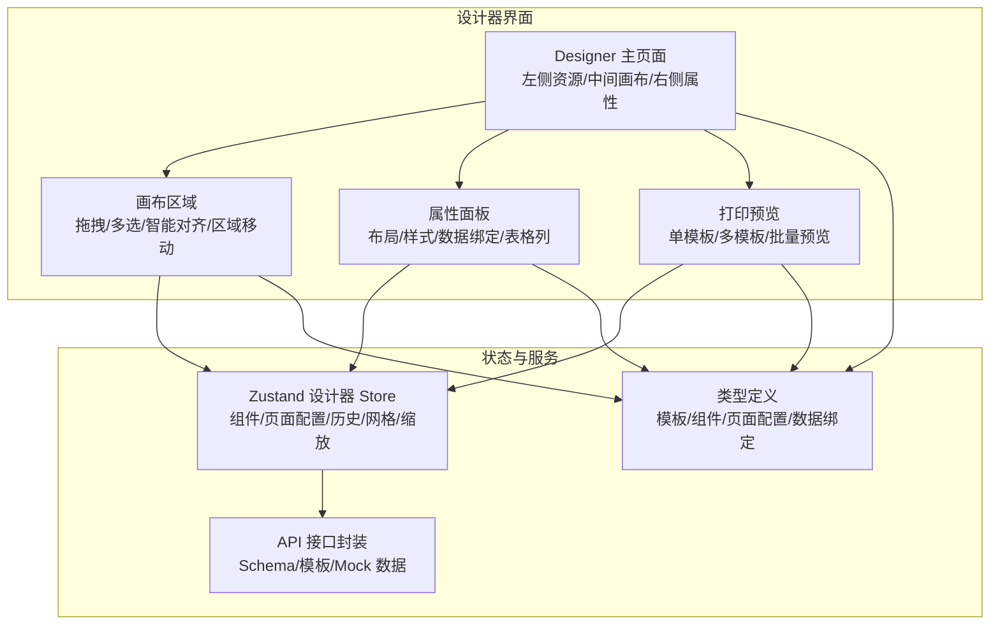
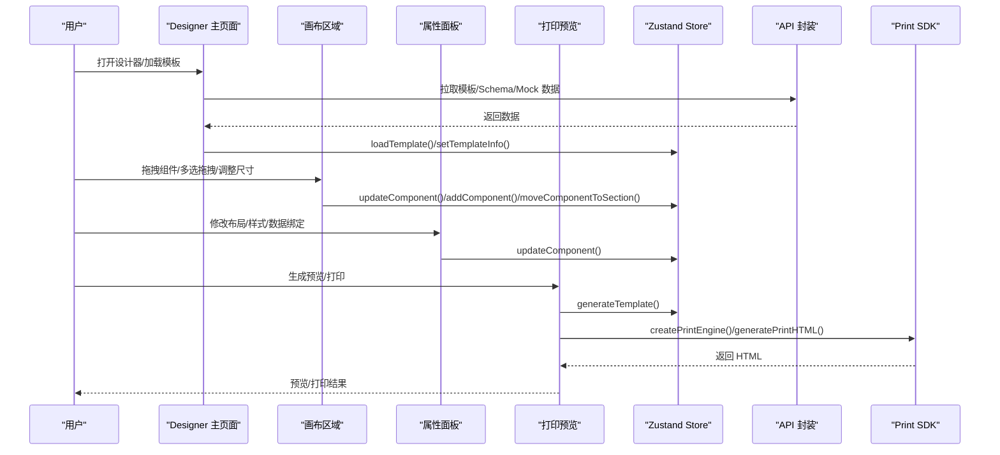
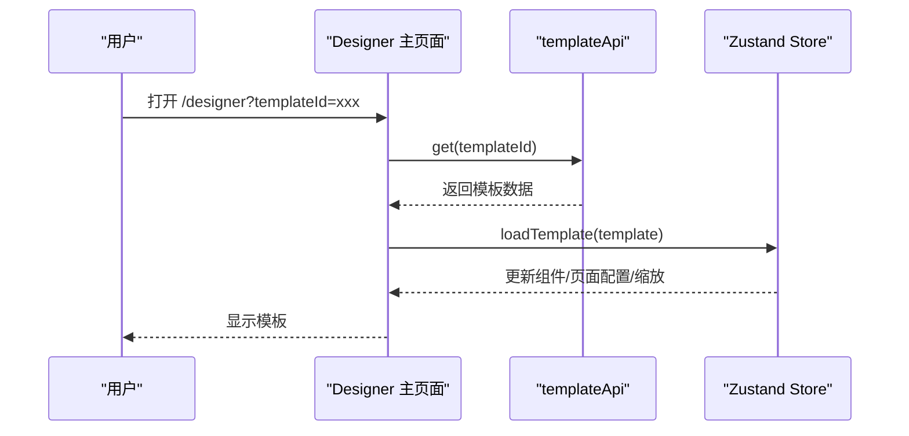
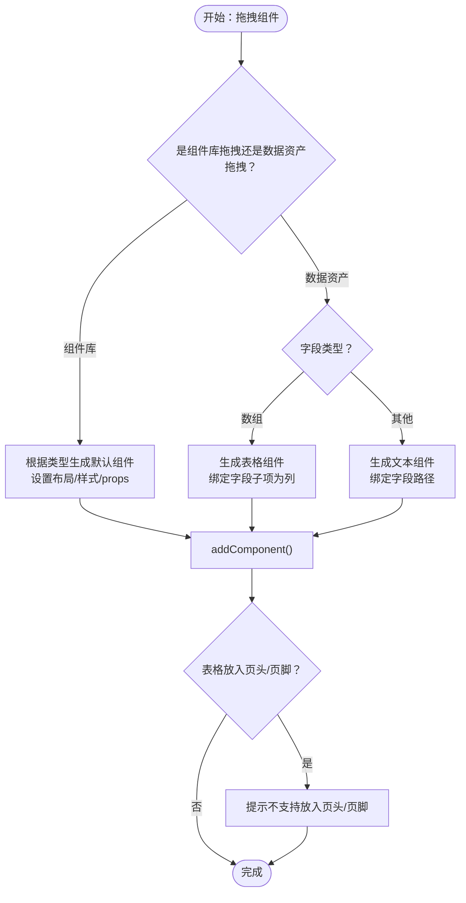
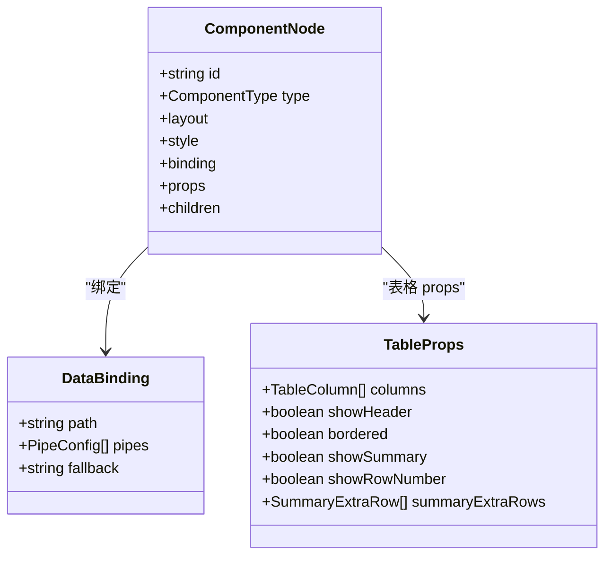
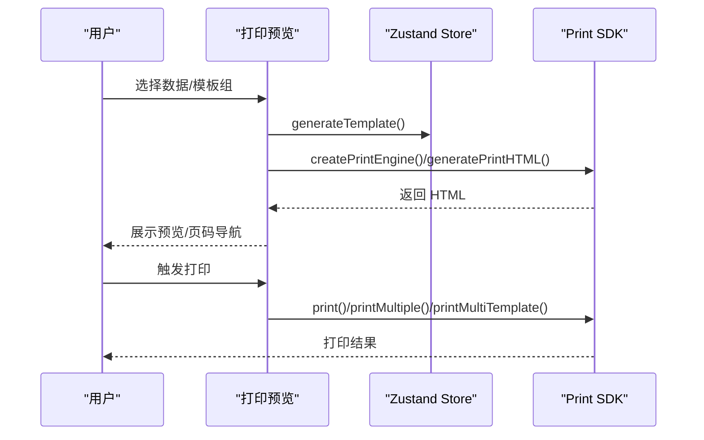
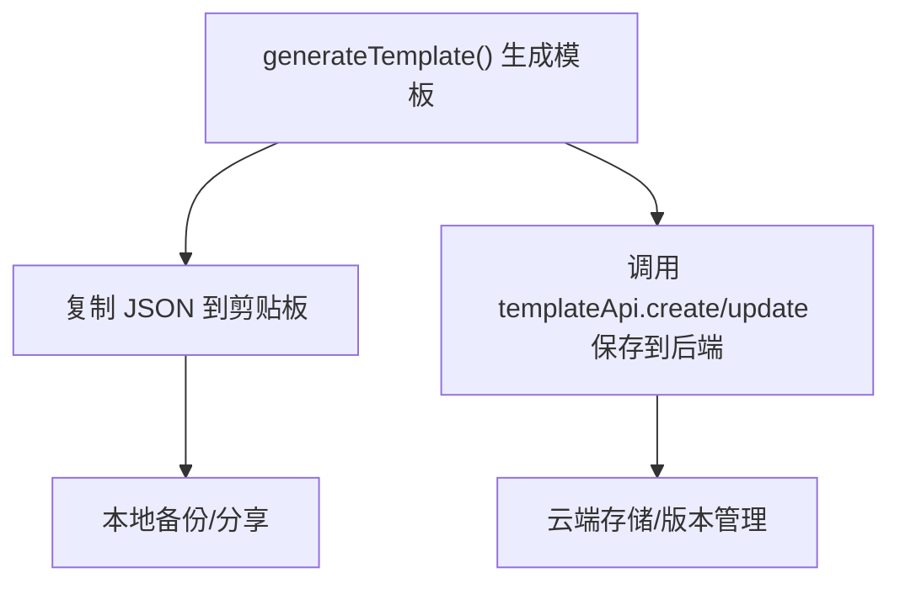
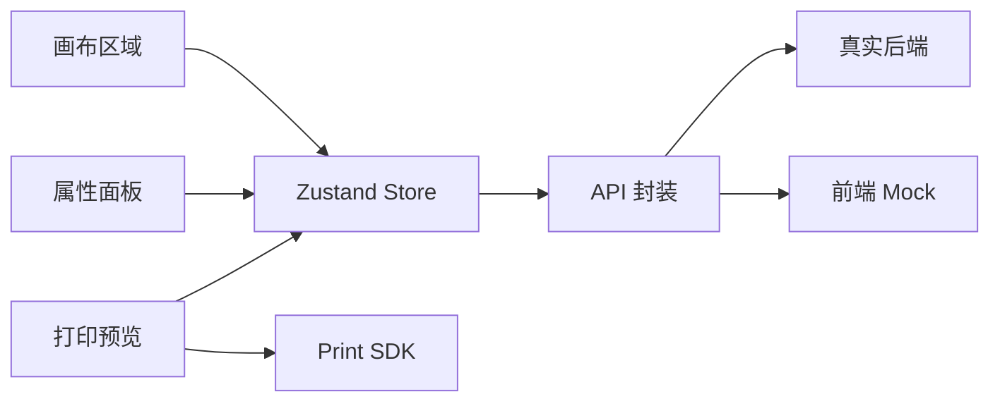

# 设计工作流程

<cite>
**本文档引用的文件**
- [Designer 主页面](file://designer/src/pages/Designer/index.tsx)
- [设计器 Store](file://designer/src/store/designer.ts)
- [API 接口封装](file://designer/src/services/api.ts)
- [类型定义](file://designer/src/types/index.ts)
- [打印预览组件](file://designer/src/components/PrintPreview/index.tsx)
- [画布区域](file://designer/src/pages/Designer/components/Canvas/index.tsx)
- [属性面板](file://designer/src/pages/Designer/components/PropertyPanel/index.tsx)
- [Mock API 实现](file://designer/src/services/mockApi.ts)
- [组件渲染器导出](file://designer/src/pages/Designer/components/Canvas/componentRenderers/index.ts)
</cite>

## 目录
1. [引言](#引言)
2. [项目结构](#项目结构)
3. [核心组件](#核心组件)
4. [架构总览](#架构总览)
5. [详细组件分析](#详细组件分析)
6. [依赖分析](#依赖分析)
7. [性能考量](#性能考量)
8. [故障排查指南](#故障排查指南)
9. [结论](#结论)
10. [附录](#附录)

## 引言
本指南面向打印模板设计师，提供从创建新模板到完成设计的完整工作流程，涵盖 Schema 字典准备、模板初始化、组件添加、属性配置、数据绑定、预览调试、保存与管理、导出与分享、最佳实践与常见场景等内容。系统采用前端状态管理与 SDK 渲染引擎结合的方式，支持本地保存、Mock 数据驱动的预览与打印测试，并提供多模板组合预览能力。

## 项目结构
- 设计器页面由左侧资源面板、中央画布、右侧属性面板组成，支持缩放、折叠、调试抽屉等交互。
- 画布区域负责组件拖拽、多选拖拽、智能对齐、区域移动、尺寸调整、快捷键等。
- 属性面板根据选中组件动态展示布局、样式、数据绑定、表格列等配置。
- 打印预览组件支持单模板/多模板模式，批量数据预览与打印，以及页码导航。
- 全局状态通过 Zustand 管理，包含组件集合、页面配置、网格/缩放、历史撤销重做、层级管理等。

**图表来源**
- [Designer 主页面:1-365](file://designer/src/pages/Designer/index.tsx#L1-L365)
- [画布区域:1-800](file://designer/src/pages/Designer/components/Canvas/index.tsx#L1-L800)
- [属性面板:1-152](file://designer/src/pages/Designer/components/PropertyPanel/index.tsx#L1-L152)
- [打印预览组件:1-624](file://designer/src/components/PrintPreview/index.tsx#L1-L624)
- [设计器 Store:1-773](file://designer/src/store/designer.ts#L1-L773)
- [API 接口封装:1-134](file://designer/src/services/api.ts#L1-L134)
- [类型定义:1-378](file://designer/src/types/index.ts#L1-L378)

**章节来源**
- [Designer 主页面:1-365](file://designer/src/pages/Designer/index.tsx#L1-L365)
- [画布区域:1-800](file://designer/src/pages/Designer/components/Canvas/index.tsx#L1-L800)
- [属性面板:1-152](file://designer/src/pages/Designer/components/PropertyPanel/index.tsx#L1-L152)
- [打印预览组件:1-624](file://designer/src/components/PrintPreview/index.tsx#L1-L624)
- [设计器 Store:1-773](file://designer/src/store/designer.ts#L1-L773)
- [API 接口封装:1-134](file://designer/src/services/api.ts#L1-L134)
- [类型定义:1-378](file://designer/src/types/index.ts#L1-L378)

## 核心组件
- 设计器主页面：承载布局、面板折叠、悬浮工具、调试抽屉、模板加载与 JSON 导出。
- 画布区域：组件拖拽、多选拖拽、智能对齐、区域移动（页头/内容/页脚）、尺寸调整、快捷键支持。
- 属性面板：按组件类型动态展示布局、样式、数据绑定、表格列配置。
- 打印预览：单模板/多模板模式，批量数据预览与打印，页码导航。
- Zustand Store：集中管理组件集合、页面配置、网格/缩放、历史、层级、复制粘贴、撤销重做等。
- API 封装：根据环境变量切换真实后端或前端 Mock，统一 Schema/模板/Mock 数据接口。
- 类型定义：标准化模板、组件、页面配置、数据绑定、表格列等类型。

**章节来源**
- [设计器 Store:1-773](file://designer/src/store/designer.ts#L1-L773)
- [API 接口封装:1-134](file://designer/src/services/api.ts#L1-L134)
- [类型定义:1-378](file://designer/src/types/index.ts#L1-L378)

## 架构总览
系统采用“前端状态 + 渲染引擎”的架构：
- 前端状态：Zustand Store 管理模板状态与操作行为。
- 渲染引擎：通过 Print SDK 将模板与数据渲染为可打印 HTML，支持预览与打印。
- 数据来源：Mock 数据用于开发与演示，生产环境可切换至真实后端。
- 组件渲染器：按组件类型映射到对应的预览渲染器，保证设计与渲染一致性。

**图表来源**
- [Designer 主页面:1-365](file://designer/src/pages/Designer/index.tsx#L1-L365)
- [画布区域:1-800](file://designer/src/pages/Designer/components/Canvas/index.tsx#L1-L800)
- [属性面板:1-152](file://designer/src/pages/Designer/components/PropertyPanel/index.tsx#L1-L152)
- [打印预览组件:1-624](file://designer/src/components/PrintPreview/index.tsx#L1-L624)
- [设计器 Store:1-773](file://designer/src/store/designer.ts#L1-L773)
- [API 接口封装:1-134](file://designer/src/services/api.ts#L1-L134)

## 详细组件分析

### 1) 模板初始化与加载
- URL 参数解析：从查询参数读取模板 ID，调用模板 API 获取模板并加载到 Store。
- Store 加载：兼容旧模板的页头/页脚高度推断，设置页面配置与组件集合。
- 调试抽屉：可复制当前模板的 JSON，便于调试与分享。

**图表来源**
- [Designer 主页面:26-46](file://designer/src/pages/Designer/index.tsx#L26-L46)
- [设计器 Store:203-250](file://designer/src/store/designer.ts#L203-L250)
- [API 接口封装:73-76](file://designer/src/services/api.ts#L73-L76)

**章节来源**
- [Designer 主页面:26-46](file://designer/src/pages/Designer/index.tsx#L26-L46)
- [设计器 Store:203-250](file://designer/src/store/designer.ts#L203-L250)
- [API 接口封装:73-76](file://designer/src/services/api.ts#L73-L76)

### 2) 组件添加与数据绑定
- 组件库拖拽：支持文本、图片、表格、线条、二维码、条形码、矩形等组件拖入画布，自动吸附网格并设置默认布局与样式。
- 数据资产拖拽：根据 Schema 字段类型生成文本或表格组件，自动绑定数据路径。
- 表格限制：表格组件不允许放入页头/页脚区域。
- 数据绑定：通过 DataBinding 配置 path、pipes、fallback 等。

**图表来源**
- [画布区域:281-479](file://designer/src/pages/Designer/components/Canvas/index.tsx#L281-L479)
- [类型定义:157-164](file://designer/src/types/index.ts#L157-L164)
- [类型定义:256-297](file://designer/src/types/index.ts#L256-L297)

**章节来源**
- [画布区域:281-479](file://designer/src/pages/Designer/components/Canvas/index.tsx#L281-L479)
- [类型定义:157-164](file://designer/src/types/index.ts#L157-L164)
- [类型定义:256-297](file://designer/src/types/index.ts#L256-L297)

### 3) 属性配置与样式管理
- 布局配置：支持 x/y/宽/高/zIndex 等绝对定位布局参数。
- 样式配置：通过 StyleSection 动态更新组件样式，部分组件提供专用样式插件（文本/线条/表格/文本）。
- 数据绑定：支持设置数据路径、管道（日期/货币/中文大写等）、回退值。
- 表格列：表格组件支持列定义、边框、合计、序号列、额外合计行等配置。

**图表来源**
- [类型定义:303-331](file://designer/src/types/index.ts#L303-L331)
- [类型定义:157-164](file://designer/src/types/index.ts#L157-L164)
- [类型定义:256-297](file://designer/src/types/index.ts#L256-L297)

**章节来源**
- [属性面板:1-152](file://designer/src/pages/Designer/components/PropertyPanel/index.tsx#L1-L152)
- [类型定义:303-331](file://designer/src/types/index.ts#L303-L331)
- [类型定义:157-164](file://designer/src/types/index.ts#L157-L164)
- [类型定义:256-297](file://designer/src/types/index.ts#L256-L297)

### 4) 预览与打印流程
- 单模板模式：选择 Mock 数据，生成预览 HTML 并在 iframe 中展示，支持批量数据的合并预览。
- 多模板模式：可配置多个模板组（模板来源可为当前画布或已保存模板），每组绑定一份数据，最终合并输出。
- 打印：通过 Print SDK 发起打印，支持预览模式与直接打印。
- 页码与分页：由渲染引擎根据模板与数据自动分页，预览中可翻页查看。

**图表来源**
- [打印预览组件:174-304](file://designer/src/components/PrintPreview/index.tsx#L174-L304)
- [打印预览组件:339-418](file://designer/src/components/PrintPreview/index.tsx#L339-L418)
- [设计器 Store:189-201](file://designer/src/store/designer.ts#L189-L201)

**章节来源**
- [打印预览组件:174-304](file://designer/src/components/PrintPreview/index.tsx#L174-L304)
- [打印预览组件:339-418](file://designer/src/components/PrintPreview/index.tsx#L339-L418)
- [设计器 Store:189-201](file://designer/src/store/designer.ts#L189-L201)

### 5) 保存与管理（本地/云端/版本）
- 本地保存：设计器 Store 提供 generateTemplate 生成模板 JSON，Designer 主页面提供复制 JSON 功能，便于本地备份与分享。
- 云端同步：API 封装支持真实后端（通过环境变量切换），提供模板 CRUD 接口，可与后端协同管理。
- 版本控制：模板包含版本号字段，可在后端实现版本管理与差异对比。
- Mock 数据：支持按 Schema 或模板关联 Mock 数据，便于离线调试与演示。

**图表来源**
- [设计器 Store:189-201](file://designer/src/store/designer.ts#L189-L201)
- [Designer 主页面:50-52](file://designer/src/pages/Designer/index.tsx#L50-L52)
- [API 接口封装:78-91](file://designer/src/services/api.ts#L78-L91)
- [类型定义:337-358](file://designer/src/types/index.ts#L337-L358)

**章节来源**
- [设计器 Store:189-201](file://designer/src/store/designer.ts#L189-L201)
- [Designer 主页面:50-52](file://designer/src/pages/Designer/index.tsx#L50-L52)
- [API 接口封装:78-91](file://designer/src/services/api.ts#L78-L91)
- [类型定义:337-358](file://designer/src/types/index.ts#L337-L358)

### 6) 导出与分享
- JSON 导出：调试抽屉支持一键复制模板 JSON，便于分享与导入。
- 模板预览：打印预览组件支持单模板/多模板模式，批量数据预览。
- 打印测试：通过 SDK 预览打印效果，确认布局与数据绑定正确性。

**章节来源**
- [Designer 主页面:318-359](file://designer/src/pages/Designer/index.tsx#L318-L359)
- [打印预览组件:174-304](file://designer/src/components/PrintPreview/index.tsx#L174-L304)

### 7) 最佳实践
- 组件复用：优先使用表格组件承载数组数据，减少重复文本组件；通过 Schema 字典统一字段定义。
- 样式统一：集中管理字体、字号、颜色等样式，避免分散修改；利用样式插件统一格式。
- 数据绑定规范：明确数据路径与管道链，设置合理的回退值；表格列定义清晰，合计与额外行配置一致。
- 区域管理：合理使用页头/页脚区域，避免表格进入页头/页脚；连续纸模式注意宽度限制。
- 撤销重做：充分利用撤销/重做功能，保持设计迭代的可控性。

### 8) 常见场景案例
- 发票模板：使用表格组件展示明细，页脚区域放置合计与附加信息；数据绑定使用金额/日期管道。
- 标签模板：使用矩形/线条组件绘制分割线，文本组件绑定产品信息；连续纸模式适配标签宽度。
- 报表模板：多模板组合预览，分别展示不同维度的报表；批量数据预览验证分页与页码。

### 9) 效率提升技巧
- 快捷键：支持 Ctrl/Cmd+C/V/D/Z 等常用快捷键，提高操作效率。
- 智能对齐：拖拽时自动检测对齐线，快速实现组件对齐。
- 网格吸附：开启网格并设置合适间距，保证布局规整。
- 批量预览：多模板/批量数据预览，一次性验证多种场景。
- 组件渲染器：组件预览渲染器与实际渲染一致，降低设计与实现偏差。

## 依赖分析
- 组件耦合：画布区域与属性面板均依赖 Store；打印预览依赖 Store 生成模板并调用 SDK。
- 外部依赖：Axios 用于 HTTP 请求，Print SDK 用于渲染与打印；Zustand 用于状态管理。
- 环境切换：通过环境变量切换 Mock 与真实后端，保证开发与生产的灵活性。

**图表来源**
- [画布区域:1-800](file://designer/src/pages/Designer/components/Canvas/index.tsx#L1-L800)
- [属性面板:1-152](file://designer/src/pages/Designer/components/PropertyPanel/index.tsx#L1-L152)
- [打印预览组件:1-624](file://designer/src/components/PrintPreview/index.tsx#L1-L624)
- [设计器 Store:1-773](file://designer/src/store/designer.ts#L1-L773)
- [API 接口封装:1-134](file://designer/src/services/api.ts#L1-L134)
- [Mock API 实现:1-103](file://designer/src/services/mockApi.ts#L1-L103)

**章节来源**
- [API 接口封装:1-134](file://designer/src/services/api.ts#L1-L134)
- [Mock API 实现:1-103](file://designer/src/services/mockApi.ts#L1-L103)

## 性能考量
- Store 历史快照：最多保存固定步数的历史，避免内存膨胀；全量快照保证撤销/重做的准确性。
- 渲染优化：打印预览组件合并多页 HTML 并重新编号，避免过多 DOM 节点导致滚动卡顿。
- 网格与吸附：网格吸附与智能对齐在拖拽过程中实时计算，建议合理设置网格大小以平衡精度与性能。
- 批量数据：批量预览与打印时分批生成 HTML，减少单次渲染压力。

## 故障排查指南
- 模板加载失败：检查模板 ID 是否正确，确认后端接口可用；查看控制台错误信息。
- 组件无法拖入页头/页脚：表格组件不支持放入页头/页脚区域，需调整到内容区域。
- 预览空白：确认已选择有效的 Mock 数据；检查数据结构与 Schema 字段是否匹配。
- 打印异常：检查浏览器打印权限与打印机设置；尝试预览模式确认 HTML 正常。
- Mock 模式切换：通过环境变量切换 Mock 与真实后端，确保接口路径与权限配置正确。

**章节来源**
- [API 接口封装:1-134](file://designer/src/services/api.ts#L1-L134)
- [打印预览组件:174-304](file://designer/src/components/PrintPreview/index.tsx#L174-L304)
- [画布区域:298-302](file://designer/src/pages/Designer/components/Canvas/index.tsx#L298-L302)

## 结论
本工作流程围绕“Schema 字典—模板初始化—组件添加—属性配置—数据绑定—预览调试—保存管理—导出分享”展开，结合 Store 状态管理与 SDK 渲染引擎，提供了高效、可视化的打印模板设计体验。通过最佳实践与常见场景案例，可帮助设计师快速上手并产出高质量的打印模板。

## 附录
- 组件渲染器导出：统一导出各组件预览渲染器，保证设计与渲染一致性。
- 类型定义：标准化模板、组件、页面配置、数据绑定、表格列等类型，便于前后端协作与扩展。

**章节来源**
- [组件渲染器导出:1-11](file://designer/src/pages/Designer/components/Canvas/componentRenderers/index.ts#L1-L11)
- [类型定义:1-378](file://designer/src/types/index.ts#L1-L378)