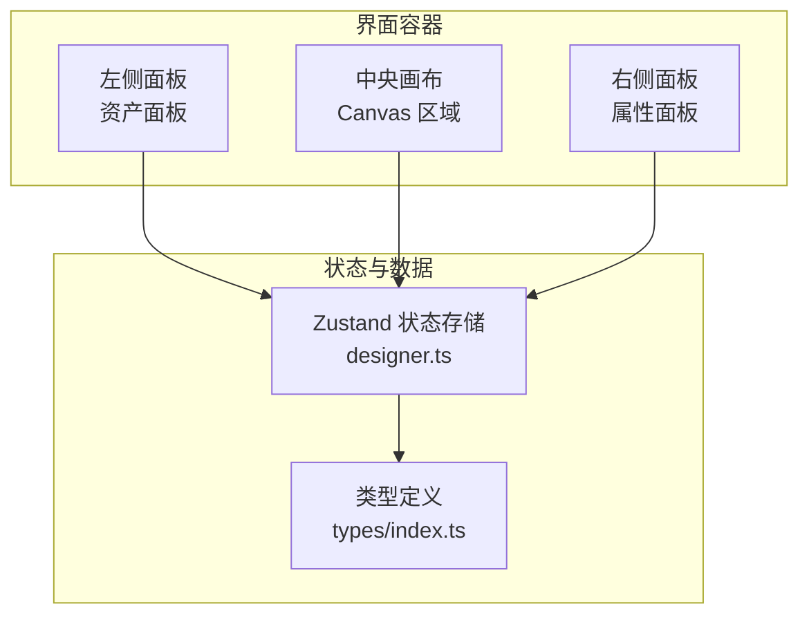
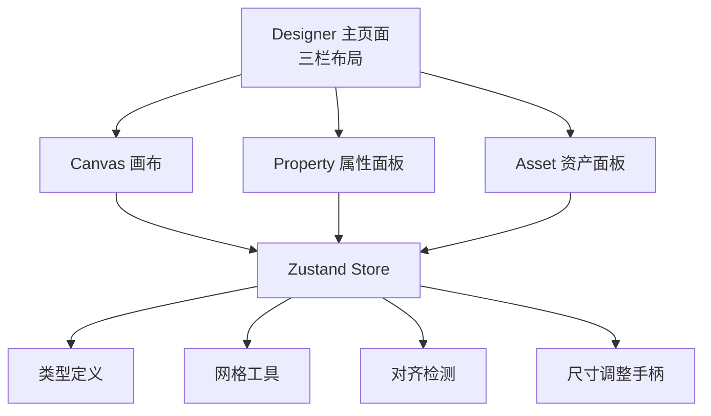
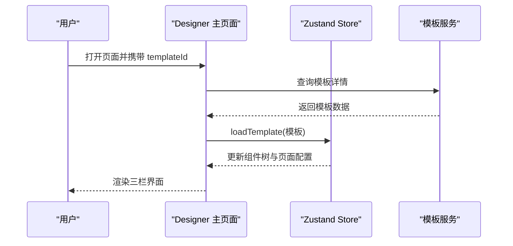
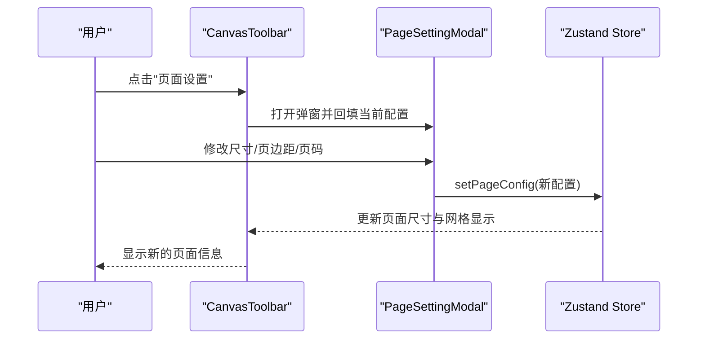
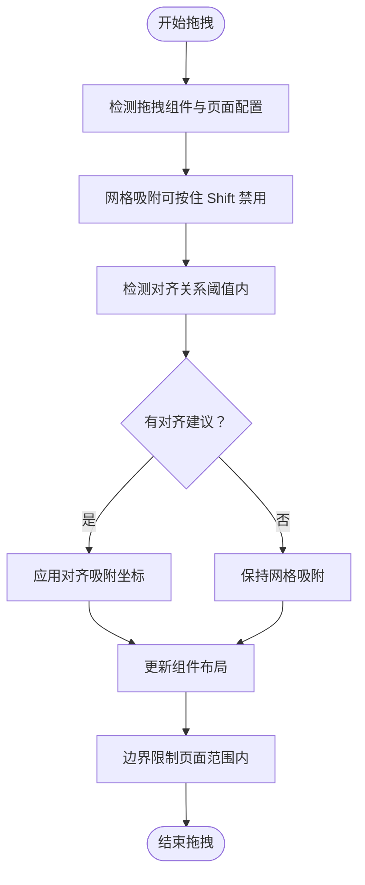
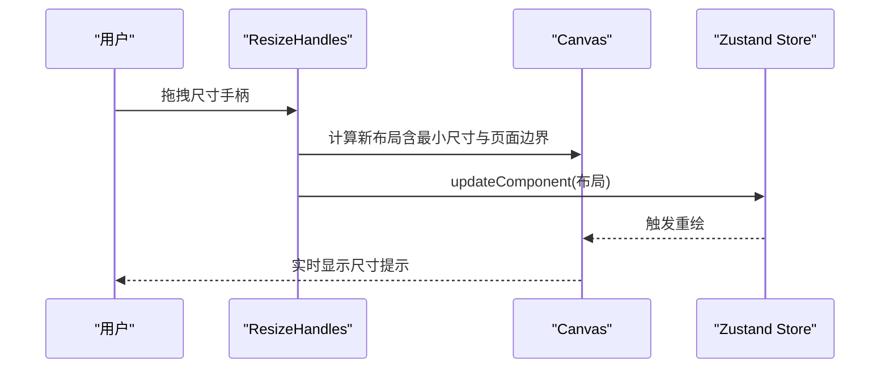
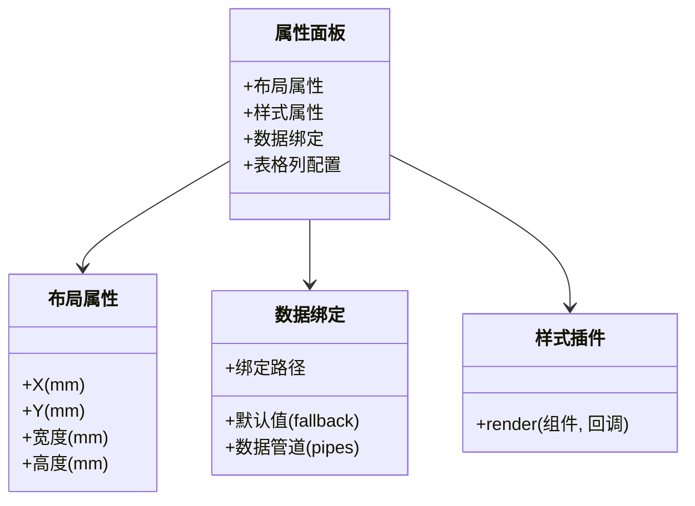
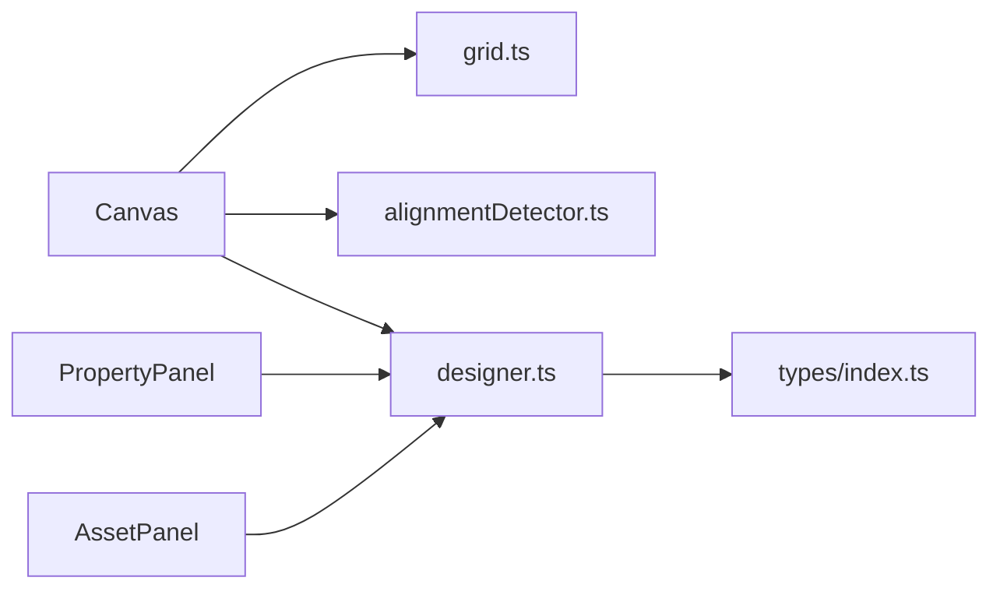

# 可视化设计界面

<cite>
**本文引用的文件**
- [Designer 主页面](file://designer/src/pages/Designer/index.tsx)
- [画布区域](file://designer/src/pages/Designer/components/Canvas/index.tsx)
- [属性面板](file://designer/src/pages/Designer/components/PropertyPanel/index.tsx)
- [资产面板](file://designer/src/pages/Designer/components/AssetPanel/index.tsx)
- [设计器状态存储](file://designer/src/store/designer.ts)
- [智能对齐参考线](file://designer/src/pages/Designer/components/Canvas/AlignmentGuides.tsx)
- [对齐检测工具](file://designer/src/pages/Designer/components/Canvas/alignmentDetector.ts)
- [尺寸调整手柄](file://designer/src/pages/Designer/components/Canvas/ResizeHandles.tsx)
- [网格工具](file://designer/src/utils/grid.ts)
- [类型定义](file://designer/src/types/index.ts)
- [布局属性配置](file://designer/src/pages/Designer/components/PropertyPanel/LayoutSection.tsx)
- [数据绑定配置](file://designer/src/pages/Designer/components/PropertyPanel/DataBindingSection.tsx)
- [样式属性配置](file://designer/src/pages/Designer/components/PropertyPanel/StyleSection.tsx)
- [画布工具栏](file://designer/src/pages/Designer/components/Canvas/CanvasToolbar.tsx)
- [页面设置弹窗](file://designer/src/pages/Designer/components/Canvas/PageSettingModal.tsx)
</cite>

## 更新摘要
**变更内容**
- 工具栏布局优化：保存和重置按钮移动到右侧，提升工作流效率
- 工具栏按钮分组重新排列，提高操作便捷性

## 目录
1. [简介](#简介)
2. [项目结构](#项目结构)
3. [核心组件](#核心组件)
4. [架构总览](#架构总览)
5. [详细组件分析](#详细组件分析)
6. [依赖关系分析](#依赖关系分析)
7. [性能考量](#性能考量)
8. [故障排查指南](#故障排查指南)
9. [结论](#结论)
10. [附录](#附录)

## 简介
本文件面向"可视化设计界面"的使用者与开发者，系统性阐述三栏布局（数据资产树、画布编辑器、属性面板）的设计与实现，深入解析拖拽式设计流程、智能网格吸附、对齐参考线、尺寸调整、组件选择与层级管理、数据绑定与样式配置等核心交互特性，并提供可操作的使用示例与最佳实践。

## 项目结构
该设计界面采用三栏布局：
- 左侧：资产面板（组件库与数据资产）
- 中央：画布编辑器（拖拽、选择、对齐、吸附、尺寸调整、预览）
- 右侧：属性面板（布局、样式、数据绑定、表格列配置）

**图表来源**
- [Designer 主页面:17-279](file://designer/src/pages/Designer/index.tsx#L17-L279)
- [资产面板:1-32](file://designer/src/pages/Designer/components/AssetPanel/index.tsx#L1-L32)
- [画布区域:20-1006](file://designer/src/pages/Designer/components/Canvas/index.tsx#L20-L1006)
- [属性面板:1-129](file://designer/src/pages/Designer/components/PropertyPanel/index.tsx#L1-L129)
- [设计器状态存储:85-539](file://designer/src/store/designer.ts#L85-L539)
- [类型定义:1-160](file://designer/src/types/index.ts#L1-L160)

**章节来源**
- [Designer 主页面:17-279](file://designer/src/pages/Designer/index.tsx#L17-L279)
- [资产面板:1-32](file://designer/src/pages/Designer/components/AssetPanel/index.tsx#L1-L32)
- [属性面板:1-129](file://designer/src/pages/Designer/components/PropertyPanel/index.tsx#L1-L129)
- [设计器状态存储:85-539](file://designer/src/store/designer.ts#L85-L539)
- [类型定义:1-160](file://designer/src/types/index.ts#L1-L160)

## 核心组件
- 三栏布局容器：负责面板折叠、抽屉调试、路由跳转与模板加载。
- 画布编辑器：拖拽组件、多选、对齐、分布、网格吸附、尺寸调整、快捷键、上下文菜单、页面设置、快速打印。
- 属性面板：布局、样式、数据绑定、表格列配置；支持插件化样式面板。
- 资产面板：组件库与数据资产双标签页，支持从数据资产拖拽生成组件。
- 状态存储：统一管理组件集合、选中状态、历史记录、页面配置、网格与层级操作。

**章节来源**
- [Designer 主页面:17-279](file://designer/src/pages/Designer/index.tsx#L17-L279)
- [画布区域:20-1006](file://designer/src/pages/Designer/components/Canvas/index.tsx#L20-L1006)
- [属性面板:1-129](file://designer/src/pages/Designer/components/PropertyPanel/index.tsx#L1-L129)
- [资产面板:1-32](file://designer/src/pages/Designer/components/AssetPanel/index.tsx#L1-L32)
- [设计器状态存储:85-539](file://designer/src/store/designer.ts#L85-L539)

## 架构总览
整体采用"状态集中 + 插件化 UI"的架构：
- 状态层：Zustand store 统一维护组件树、选中状态、历史、页面配置、网格与层级。
- 视图层：三栏布局组件通过 store 派发动作，驱动画布与属性面板联动更新。
- 工具层：网格吸附、对齐检测、尺寸调整手柄等工具函数独立封装，便于复用与测试。

**图表来源**
- [Designer 主页面:17-279](file://designer/src/pages/Designer/index.tsx#L17-L279)
- [画布区域:20-1006](file://designer/src/pages/Designer/components/Canvas/index.tsx#L20-L1006)
- [属性面板:1-129](file://designer/src/pages/Designer/components/PropertyPanel/index.tsx#L1-L129)
- [资产面板:1-32](file://designer/src/pages/Designer/components/AssetPanel/index.tsx#L1-L32)
- [设计器状态存储:85-539](file://designer/src/store/designer.ts#L85-L539)
- [网格工具:1-36](file://designer/src/utils/grid.ts#L1-L36)
- [对齐检测工具:1-158](file://designer/src/pages/Designer/components/Canvas/alignmentDetector.ts#L1-L158)
- [尺寸调整手柄:1-201](file://designer/src/pages/Designer/components/Canvas/ResizeHandles.tsx#L1-L201)

## 详细组件分析

### 三栏布局设计与交互
- 左侧面板折叠/展开：通过固定按钮控制，支持记忆折叠状态。
- 右侧面板折叠/展开：包含"组件树"和"属性配置"两个标签页。
- 抽屉调试：展示模板 JSON，支持复制，便于开发调试。
- 模板加载：支持通过 URL 参数加载指定模板，加载成功后自动填充画布。

**图表来源**
- [Designer 主页面:26-46](file://designer/src/pages/Designer/index.tsx#L26-L46)
- [设计器状态存储:150-159](file://designer/src/store/designer.ts#L150-L159)

**章节来源**
- [Designer 主页面:17-279](file://designer/src/pages/Designer/index.tsx#L17-L279)

### 画布工具栏与页面设置
- 工具栏功能：重置、保存、撤销/重做、对齐、分布、页面设置、网格开关、快速打印。
- 工具栏布局优化：保存和重置按钮移动到右侧，提升工作流效率。
- 页面设置弹窗：支持 A4/A5、自定义尺寸、连续纸（不限高度），页边距、页码配置（位置、格式、样式）。

**图表来源**
- [画布工具栏:37-166](file://designer/src/pages/Designer/components/Canvas/CanvasToolbar.tsx#L37-L166)
- [页面设置弹窗:24-69](file://designer/src/pages/Designer/components/Canvas/PageSettingModal.tsx#L24-L69)
- [设计器状态存储:136-136](file://designer/src/store/designer.ts#L136-L136)

**章节来源**
- [画布工具栏:1-166](file://designer/src/pages/Designer/components/Canvas/CanvasToolbar.tsx#L1-L166)
- [页面设置弹窗:1-206](file://designer/src/pages/Designer/components/Canvas/PageSettingModal.tsx#L1-L206)
- [设计器状态存储:130-136](file://designer/src/store/designer.ts#L130-L136)

### 画布编辑器：拖拽、吸附与对齐
- 组件拖拽：
  - 组件库拖拽：根据类型生成默认组件，自动吸附到网格。
  - 数据资产拖拽：根据字段类型生成文本或表格组件，自动吸附并应用绑定路径。
- 智能网格吸附：支持按住 Shift 临时禁用吸附；支持按住 Shift 调整尺寸时禁用吸附。
- 智能对齐参考线：拖拽时检测与其它组件的对齐关系，显示对齐参考线并提供吸附建议。
- 多选拖拽：同时移动多个组件，自动限制在页面范围内。
- 边界检查：超出页面范围的组件会被限制在有效区域内。
- 快捷键：Delete/Backspace 删除、Ctrl+C/V/D 拷贝/粘贴/克隆、Ctrl+Z/Shift+Z 撤销/重做。
- 上下文菜单：支持复制、克隆、层级操作与删除。

**图表来源**
- [画布区域:434-562](file://designer/src/pages/Designer/components/Canvas/index.tsx#L434-L562)
- [对齐检测工具:24-158](file://designer/src/pages/Designer/components/Canvas/alignmentDetector.ts#L24-L158)
- [网格工具:12-15](file://designer/src/utils/grid.ts#L12-L15)

**章节来源**
- [画布区域:195-562](file://designer/src/pages/Designer/components/Canvas/index.tsx#L195-L562)
- [智能对齐参考线:21-66](file://designer/src/pages/Designer/components/Canvas/AlignmentGuides.tsx#L21-L66)
- [对齐检测工具:1-158](file://designer/src/pages/Designer/components/Canvas/alignmentDetector.ts#L1-L158)
- [网格工具:1-36](file://designer/src/utils/grid.ts#L1-L36)

### 画布编辑器：尺寸调整与预览
- 尺寸调整手柄：提供8个拖拽点，支持四角与四边调整，自动限制最小尺寸与页面范围。
- 尺寸提示：拖拽过程中实时显示宽高（单位 mm）。
- 预览与打印：支持快速打印预览，前置条件为画布非空。

**图表来源**
- [尺寸调整手柄:34-150](file://designer/src/pages/Designer/components/Canvas/ResizeHandles.tsx#L34-L150)
- [画布区域:98-109](file://designer/src/pages/Designer/components/Canvas/index.tsx#L98-L109)

**章节来源**
- [尺寸调整手柄:1-201](file://designer/src/pages/Designer/components/Canvas/ResizeHandles.tsx#L1-L201)
- [画布区域:98-109](file://designer/src/pages/Designer/components/Canvas/index.tsx#L98-L109)

### 属性面板：布局、样式与数据绑定
- 布局属性：X/Y 坐标、宽高，支持直接输入与拖拽。
- 样式属性：插件化样式面板，按组件类型动态渲染。
- 数据绑定：绑定路径、默认值（fallback）、数据管道（可配置参数）。
- 表格列配置：仅表格组件显示，支持列标题、宽度、对齐、隐藏、汇总等。

**图表来源**
- [属性面板:16-126](file://designer/src/pages/Designer/components/PropertyPanel/index.tsx#L16-L126)
- [布局属性配置:17-68](file://designer/src/pages/Designer/components/PropertyPanel/LayoutSection.tsx#L17-L68)
- [数据绑定配置:20-128](file://designer/src/pages/Designer/components/PropertyPanel/DataBindingSection.tsx#L20-L128)
- [样式属性配置:17-32](file://designer/src/pages/Designer/components/PropertyPanel/StyleSection.tsx#L17-L32)

**章节来源**
- [属性面板:1-129](file://designer/src/pages/Designer/components/PropertyPanel/index.tsx#L1-L129)
- [布局属性配置:1-68](file://designer/src/pages/Designer/components/PropertyPanel/LayoutSection.tsx#L1-L68)
- [数据绑定配置:1-128](file://designer/src/pages/Designer/components/PropertyPanel/DataBindingSection.tsx#L1-L128)
- [样式属性配置:1-32](file://designer/src/pages/Designer/components/PropertyPanel/StyleSection.tsx#L1-L32)

### 资产面板：组件库与数据资产
- 组件库：拖拽组件到画布，自动吸附并选中。
- 数据资产：拖拽字段到画布，自动生成文本或表格组件并绑定路径。

**章节来源**
- [资产面板:1-32](file://designer/src/pages/Designer/components/AssetPanel/index.tsx#L1-L32)
- [画布区域:195-378](file://designer/src/pages/Designer/components/Canvas/index.tsx#L195-L378)

## 依赖关系分析
- 状态依赖：画布与属性面板均依赖 Zustand store 的组件树与页面配置。
- 工具依赖：网格吸附与对齐检测作为纯函数被画布区域调用。
- 类型依赖：所有组件共享 types/index.ts 中的类型定义，保证数据结构一致性。

**图表来源**
- [画布区域:6-18](file://designer/src/pages/Designer/components/Canvas/index.tsx#L6-L18)
- [网格工具:1-36](file://designer/src/utils/grid.ts#L1-L36)
- [对齐检测工具:1-158](file://designer/src/pages/Designer/components/Canvas/alignmentDetector.ts#L1-L158)
- [设计器状态存储:1-7](file://designer/src/store/designer.ts#L1-L7)
- [类型定义:1-160](file://designer/src/types/index.ts#L1-L160)

**章节来源**
- [画布区域:1-1006](file://designer/src/pages/Designer/components/Canvas/index.tsx#L1-L1006)
- [设计器状态存储:1-539](file://designer/src/store/designer.ts#L1-L539)
- [类型定义:1-160](file://designer/src/types/index.ts#L1-L160)

## 性能考量
- 状态更新粒度：store 使用原子更新，避免不必要的重渲染。
- 历史记录上限：最多保存 20 步，防止内存膨胀。
- 事件监听：拖拽与尺寸调整采用局部 window 事件，及时清理避免泄漏。
- 对齐检测：阈值与去重策略减少冗余参考线绘制。
- 网格吸附：按需启用，Shift 临时禁用，兼顾灵活性与性能。

## 故障排查指南
- 无法拖拽组件到画布
  - 检查数据资产拖拽时的字段类型与路径是否正确。
  - 确认画布区域的拖放事件处理与网格吸附逻辑。
- 对齐参考线不出现
  - 确认拖拽距离阈值内且非自身组件。
  - 检查对齐检测工具返回的 lines 是否为空。
- 尺寸调整无效或越界
  - 检查最小尺寸限制与页面范围限制逻辑。
  - 确认按住 Shift 时吸附被禁用。
- 快捷键无响应
  - 确认焦点不在输入框、文本域等可编辑元素中。
  - 检查键盘事件监听与组合键判断。
- 撤销/重做不可用
  - 确认历史索引与 canUndo/canRedo 的判断逻辑。

**章节来源**
- [画布区域:112-161](file://designer/src/pages/Designer/components/Canvas/index.tsx#L112-L161)
- [对齐检测工具:9-158](file://designer/src/pages/Designer/components/Canvas/alignmentDetector.ts#L9-L158)
- [尺寸调整手柄:100-150](file://designer/src/pages/Designer/components/Canvas/ResizeHandles.tsx#L100-L150)
- [设计器状态存储:298-331](file://designer/src/store/designer.ts#L298-L331)

## 结论
该可视化设计界面通过清晰的三栏布局与完善的交互机制，实现了从"数据资产"到"画布组件"的高效映射，结合智能网格吸附、对齐参考线与尺寸调整手柄，显著提升了设计效率与准确性。最新的工具栏布局优化将保存和重置按钮移动到右侧，进一步提升了工作流效率。属性面板的插件化样式与数据绑定能力进一步增强了可扩展性。建议在实际使用中充分利用快捷键与页面设置，配合调试抽屉进行快速迭代与验证。

## 附录

### 使用示例与操作指南
- 新建模板并加载
  - 在模板管理页面创建模板，复制链接中的 templateId，粘贴到设计器地址栏。
- 添加组件
  - 从"组件库"拖拽到画布，或从"数据资产"拖拽生成文本/表格组件。
- 移动与对齐
  - 拖拽组件，按住 Shift 可临时禁用吸附；多选组件后使用工具栏对齐/分布。
- 调整尺寸
  - 点击组件边框手柄，拖拽调整宽高；按住 Shift 可临时禁用吸附。
- 配置属性
  - 在右侧"属性配置"中设置布局、样式、数据绑定与表格列。
- 页面设置
  - 使用工具栏"页面设置"按钮，配置纸张尺寸、页边距与页码。
- 快速打印
  - 确保画布非空，点击"测试打印"打开预览。
- 保存与重置
  - 使用工具栏右侧的"保存"和"重置"按钮，提升工作流效率。