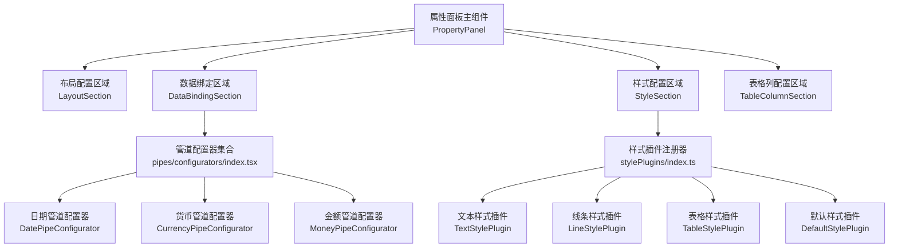
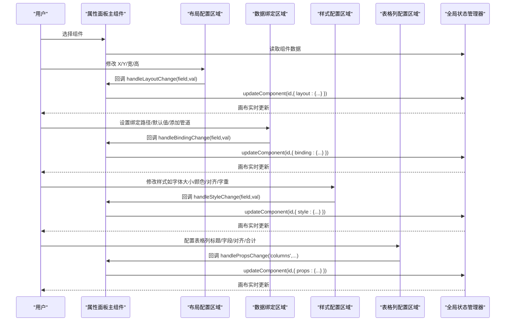
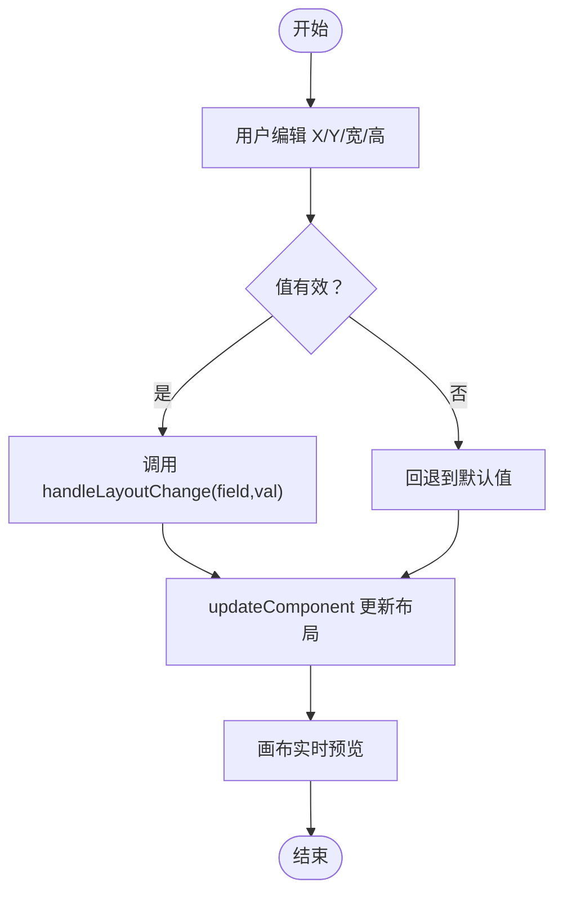
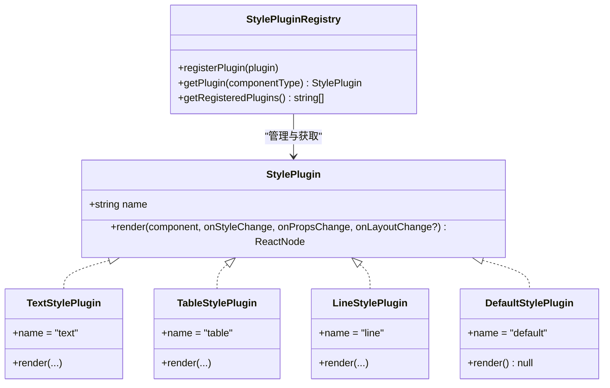
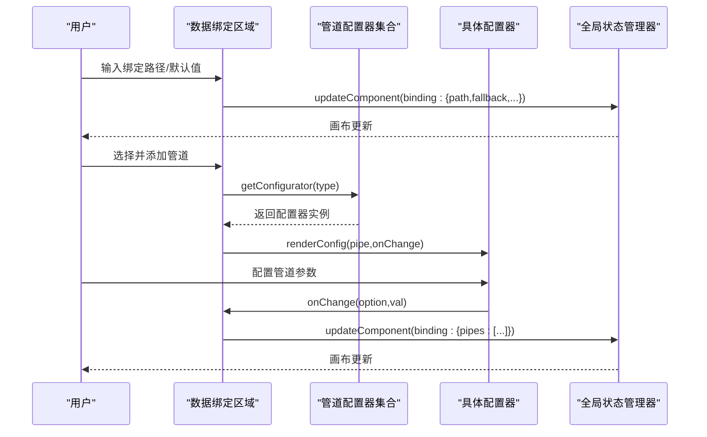
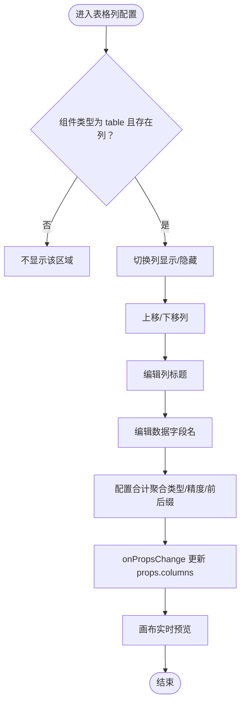
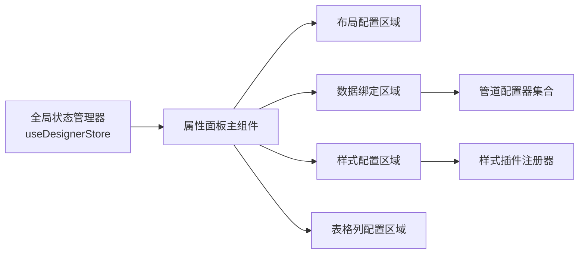

# 属性面板

<cite>
**本文引用的文件**
- [index.tsx](file://designer/src/pages/Designer/components/PropertyPanel/index.tsx)
- [LayoutSection.tsx](file://designer/src/pages/Designer/components/PropertyPanel/LayoutSection.tsx)
- [StyleSection.tsx](file://designer/src/pages/Designer/components/PropertyPanel/StyleSection.tsx)
- [DataBindingSection.tsx](file://designer/src/pages/Designer/components/PropertyPanel/DataBindingSection.tsx)
- [TableColumnSection.tsx](file://designer/src/pages/Designer/components/PropertyPanel/TableColumnSection.tsx)
- [stylePlugins/index.ts](file://designer/src/pages/Designer/components/PropertyPanel/stylePlugins/index.ts)
- [stylePlugins/types.ts](file://designer/src/pages/Designer/components/PropertyPanel/stylePlugins/types.ts)
- [DefaultStylePlugin.tsx](file://designer/src/pages/Designer/components/PropertyPanel/stylePlugins/DefaultStylePlugin.tsx)
- [TextStylePlugin.tsx](file://designer/src/pages/Designer/components/PropertyPanel/stylePlugins/TextStylePlugin.tsx)
- [LineStylePlugin.tsx](file://designer/src/pages/Designer/components/PropertyPanel/stylePlugins/LineStylePlugin.tsx)
- [TableStylePlugin.tsx](file://designer/src/pages/Designer/components/PropertyPanel/stylePlugins/TableStylePlugin.tsx)
- [index.tsx](file://designer/src/pipes/configurators/index.tsx)
- [DatePipeConfigurator.tsx](file://designer/src/pipes/configurators/DatePipeConfigurator.tsx)
- [CurrencyPipeConfigurator.tsx](file://designer/src/pipes/configurators/CurrencyPipeConfigurator.tsx)
- [MoneyPipeConfigurator.tsx](file://designer/src/pipes/configurators/MoneyPipeConfigurator.tsx)
- [index.ts](file://designer/src/store/designer.ts)
- [index.ts](file://designer/src/types/index.ts)
</cite>

## 更新摘要
**所做更改**
- 更新了条件渲染逻辑改进部分，反映属性面板主组件的条件渲染优化
- 重构了默认样式插件系统，简化装饰性组件的样式处理
- 增强了样式插件注册系统，改进插件管理和回退机制
- 修复了线条预览渲染问题，优化线条组件的样式配置体验

## 目录
1. [简介](#简介)
2. [项目结构](#项目结构)
3. [核心组件](#核心组件)
4. [架构总览](#架构总览)
5. [详细组件分析](#详细组件分析)
6. [依赖关系分析](#依赖关系分析)
7. [性能考虑](#性能考虑)
8. [故障排查指南](#故障排查指南)
9. [结论](#结论)
10. [附录](#附录)

## 简介
属性面板是设计器中用于配置当前选中组件的可视化界面，覆盖以下能力：
- 布局配置：位置（X/Y）、尺寸（宽/高）等页面坐标系属性
- 样式配置：字体、颜色、对齐、边框等视觉属性；通过插件化系统支持不同组件类型
- 数据绑定：绑定路径、默认值、数据管道链式处理
- 表格列配置：列标题、字段、对齐、显示/隐藏、移动、删除、合计配置等
- 实时预览与状态管理：通过全局状态驱动画布即时更新
- 扩展机制：样式插件与数据管道配置器均支持注册扩展

## 项目结构
属性面板位于设计器页面的右侧，由主入口组件负责组织各子区域，并通过全局状态管理器进行数据更新。

**图表来源**
- [index.tsx:17-149](file://designer/src/pages/Designer/components/PropertyPanel/index.tsx#L17-L149)
- [LayoutSection.tsx:17-76](file://designer/src/pages/Designer/components/PropertyPanel/LayoutSection.tsx#L17-L76)
- [StyleSection.tsx:17-36](file://designer/src/pages/Designer/components/PropertyPanel/StyleSection.tsx#L17-L36)
- [DataBindingSection.tsx:20-128](file://designer/src/pages/Designer/components/PropertyPanel/DataBindingSection.tsx#L20-L128)
- [TableColumnSection.tsx:22-718](file://designer/src/pages/Designer/components/PropertyPanel/TableColumnSection.tsx#L22-L718)
- [stylePlugins/index.ts:16-52](file://designer/src/pages/Designer/components/PropertyPanel/stylePlugins/index.ts#L16-L52)
- [index.tsx:72-85](file://designer/src/pipes/configurators/index.tsx#L72-L85)

**章节来源**
- [index.tsx:17-149](file://designer/src/pages/Designer/components/PropertyPanel/index.tsx#L17-L149)
- [index.ts:85-100](file://designer/src/store/designer.ts#L85-L100)

## 核心组件
- 属性面板主组件：负责装配布局、数据绑定、样式、表格列四个区域，并将变更回调传递给子组件
- 布局配置区域：提供 X/Y 坐标与宽/高的数值输入，单位为毫米
- 数据绑定区域：提供绑定路径、默认值、管道链与配置器 UI
- 样式配置区域：通过插件系统按组件类型渲染对应样式控件
- 表格列配置区域：针对表格组件提供列增删改、显示/隐藏、排序、合计配置等

**章节来源**
- [index.tsx:17-149](file://designer/src/pages/Designer/components/PropertyPanel/index.tsx#L17-L149)
- [LayoutSection.tsx:17-76](file://designer/src/pages/Designer/components/PropertyPanel/LayoutSection.tsx#L17-L76)
- [DataBindingSection.tsx:20-128](file://designer/src/pages/Designer/components/PropertyPanel/DataBindingSection.tsx#L20-L128)
- [StyleSection.tsx:17-36](file://designer/src/pages/Designer/components/PropertyPanel/StyleSection.tsx#L17-L36)
- [TableColumnSection.tsx:22-718](file://designer/src/pages/Designer/components/PropertyPanel/TableColumnSection.tsx#L22-L718)

## 架构总览
属性面板采用"主容器 + 子区域 + 插件系统"的分层架构：
- 主容器负责状态读取与变更分发
- 子区域各自封装 UI 与业务逻辑
- 插件系统以注册表形式扩展样式与管道配置器

**图表来源**
- [index.tsx:39-79](file://designer/src/pages/Designer/components/PropertyPanel/index.tsx#L39-L79)
- [index.ts:93-100](file://designer/src/store/designer.ts#L93-L100)

## 详细组件分析

### 布局配置区域（位置、尺寸）
- 支持的属性
  - X 坐标（毫米）
  - Y 坐标（毫米）
  - 宽度（毫米）
  - 高度（毫米）
- 输入控件：数值输入框，支持直接输入与拖拽调整
- 变更流程：子组件触发 onChange，主组件统一调用 handleLayoutChange，最终通过全局状态更新

**图表来源**
- [LayoutSection.tsx:26-69](file://designer/src/pages/Designer/components/PropertyPanel/LayoutSection.tsx#L26-L69)
- [index.tsx:39-47](file://designer/src/pages/Designer/components/PropertyPanel/index.tsx#L39-L47)
- [index.ts:93-100](file://designer/src/store/designer.ts#L93-L100)

**章节来源**
- [LayoutSection.tsx:17-76](file://designer/src/pages/Designer/components/PropertyPanel/LayoutSection.tsx#L17-L76)
- [index.tsx:39-47](file://designer/src/pages/Designer/components/PropertyPanel/index.tsx#L39-L47)

### 样式配置区域（字体、颜色、对齐、边框等）
- 设计要点
  - 插件化：按组件类型动态选择样式插件
  - 通用与特有：部分样式适用于多种组件，部分为组件特有
- 已内置插件
  - 文本样式插件：标签、静态文本、字体大小、颜色、**字重**、对齐
  - 表格样式插件：字体大小、对齐
  - 线条样式插件：线条高度（同步更新布局高度）、样式、颜色
  - 默认样式插件：装饰性组件（如 image、qrcode、barcode、rect）无需样式配置
- 扩展机制
  - 通过注册器注册新插件，键为组件类型，值为实现 render 的插件对象
  - 未匹配类型时回退到默认插件

**更新** 默认样式插件已重构为纯函数实现，装饰性组件不再显示样式区块

**图表来源**
- [stylePlugins/types.ts:11-31](file://designer/src/pages/Designer/components/PropertyPanel/stylePlugins/types.ts#L11-L31)
- [stylePlugins/index.ts:16-52](file://designer/src/pages/Designer/components/PropertyPanel/stylePlugins/index.ts#L16-L52)
- [TextStylePlugin.tsx:11-86](file://designer/src/pages/Designer/components/PropertyPanel/stylePlugins/TextStylePlugin.tsx#L11-L86)
- [TableStylePlugin.tsx:11-48](file://designer/src/pages/Designer/components/PropertyPanel/stylePlugins/TableStylePlugin.tsx#L11-L48)
- [LineStylePlugin.tsx:11-72](file://designer/src/pages/Designer/components/PropertyPanel/stylePlugins/LineStylePlugin.tsx#L11-L72)
- [DefaultStylePlugin.tsx:9-16](file://designer/src/pages/Designer/components/PropertyPanel/stylePlugins/DefaultStylePlugin.tsx#L9-L16)

**章节来源**
- [StyleSection.tsx:17-36](file://designer/src/pages/Designer/components/PropertyPanel/StyleSection.tsx#L17-L36)
- [stylePlugins/index.ts:16-52](file://designer/src/pages/Designer/components/PropertyPanel/stylePlugins/index.ts#L16-L52)
- [TextStylePlugin.tsx:11-86](file://designer/src/pages/Designer/components/PropertyPanel/stylePlugins/TextStylePlugin.tsx#L11-L86)
- [TableStylePlugin.tsx:11-48](file://designer/src/pages/Designer/components/PropertyPanel/stylePlugins/TableStylePlugin.tsx#L11-L48)
- [LineStylePlugin.tsx:11-72](file://designer/src/pages/Designer/components/PropertyPanel/stylePlugins/LineStylePlugin.tsx#L11-L72)
- [DefaultStylePlugin.tsx:9-16](file://designer/src/pages/Designer/components/PropertyPanel/stylePlugins/DefaultStylePlugin.tsx#L9-L16)

### 数据绑定配置区域（字段、管道、空值）
- 绑定路径：支持 JSON Path，可从数据资产面板拖拽
- 默认值：当数据为空、null 或 undefined 时显示
- 管道链：按顺序执行，支持添加/删除/配置
- 管道配置器
  - 日期：格式化字符串
  - 货币：货币符号
  - 金额：转换模式（分→元/元→分/不转换）、精度、符号、千分位
  - 截取：起始/结束位置
  - 默认值：默认值字符串

**图表来源**
- [DataBindingSection.tsx:20-128](file://designer/src/pages/Designer/components/PropertyPanel/DataBindingSection.tsx#L20-L128)
- [index.tsx:72-85](file://designer/src/pipes/configurators/index.tsx#L72-L85)
- [DatePipeConfigurator.tsx:9-23](file://designer/src/pipes/configurators/DatePipeConfigurator.tsx#L9-L23)
- [CurrencyPipeConfigurator.tsx:9-23](file://designer/src/pipes/configurators/CurrencyPipeConfigurator.tsx#L9-L23)
- [MoneyPipeConfigurator.tsx:9-143](file://designer/src/pipes/configurators/MoneyPipeConfigurator.tsx#L9-L143)
- [index.ts:93-100](file://designer/src/store/designer.ts#L93-L100)

**章节来源**
- [DataBindingSection.tsx:20-128](file://designer/src/pages/Designer/components/PropertyPanel/DataBindingSection.tsx#L20-L128)
- [index.tsx:72-85](file://designer/src/pipes/configurators/index.tsx#L72-L85)
- [DatePipeConfigurator.tsx:9-23](file://designer/src/pipes/configurators/DatePipeConfigurator.tsx#L9-L23)
- [CurrencyPipeConfigurator.tsx:9-23](file://designer/src/pipes/configurators/CurrencyPipeConfigurator.tsx#L9-L23)
- [MoneyPipeConfigurator.tsx:9-143](file://designer/src/pipes/configurators/MoneyPipeConfigurator.tsx#L9-L143)

### 表格组件列配置区域（列宽、对齐、显示条件、合计）
- 功能概览
  - 显示/隐藏列
  - 移动列顺序
  - 修改列标题与数据字段名
  - 合计行开关与模式（每页合计/最后一页合计）
  - 合计标签、聚合类型（求和/平均/最大/最小/计数）、精度、前后缀
- 交互细节
  - 仅在组件类型为 table 且存在列配置时显示
  - 合计配置使用折叠面板，按需展开
  - 列标题与字段输入支持禁用以避免隐藏列被编辑

**图表来源**
- [TableColumnSection.tsx:167-170](file://designer/src/pages/Designer/components/PropertyPanel/TableColumnSection.tsx#L167-L170)

**章节来源**
- [TableColumnSection.tsx:22-718](file://designer/src/pages/Designer/components/PropertyPanel/TableColumnSection.tsx#L22-L718)

### 样式插件系统设计与扩展
- 接口定义：StylePlugin 提供 name 与 render 方法
- 注册器：以 Map 存储插件，按组件类型获取，未命中回退默认插件
- 扩展步骤
  - 实现新的 StylePlugin
  - 在注册器中注册
  - 确保组件 type 与插件 name 匹配

**更新** 样式插件注册系统已增强，改进了插件管理和回退机制

**章节来源**
- [stylePlugins/types.ts:11-31](file://designer/src/pages/Designer/components/PropertyPanel/stylePlugins/types.ts#L11-L31)
- [stylePlugins/index.ts:16-52](file://designer/src/pages/Designer/components/PropertyPanel/stylePlugins/index.ts#L16-L52)

### 数据管道配置器系统设计与扩展
- 接口定义：PipeConfigurator 提供 type 与 renderConfig
- 注册器：以 Map 存储配置器，按管道类型获取
- 扩展步骤
  - 实现新的 PipeConfigurator
  - 在注册器中注册
  - 在管道选择器中提供选项

**章节来源**
- [index.tsx:17-85](file://designer/src/pipes/configurators/index.tsx#L17-L85)

### 条件渲染逻辑改进
- 属性面板主组件实现了智能条件渲染，仅在必要时显示相应区域
- 数据绑定区域仅对有数据展示需求的组件显示（text、image、qrcode、barcode、table）
- 样式区域根据插件返回内容决定是否显示
- 表格列配置区域仅在表格组件且存在列配置时激活

**更新** 条件渲染逻辑已优化，提高了性能和用户体验

**章节来源**
- [index.tsx:105-149](file://designer/src/pages/Designer/components/PropertyPanel/index.tsx#L105-L149)

### 线条预览渲染修复
- 线条组件的样式配置已优化，线条高度变化时同步更新布局高度
- 修复了线条预览渲染问题，确保样式变更即时反映在画布上
- 改进了线条样式的交互体验，提供更好的视觉反馈

**更新** 线条预览渲染已修复，提升了线条组件的配置体验

**章节来源**
- [LineStylePlugin.tsx:14-72](file://designer/src/pages/Designer/components/PropertyPanel/stylePlugins/LineStylePlugin.tsx#L14-L72)

## 依赖关系分析
- 属性面板主组件依赖全局状态管理器，用于读取选中组件与更新组件
- 样式配置区域依赖样式插件注册器，按组件类型动态加载插件
- 数据绑定区域依赖管道配置器集合，按管道类型动态加载配置器
- 表格列配置区域仅在表格组件类型下激活

**图表来源**
- [index.ts:85-100](file://designer/src/store/designer.ts#L85-L100)
- [index.tsx:17-149](file://designer/src/pages/Designer/components/PropertyPanel/index.tsx#L17-L149)
- [stylePlugins/index.ts:16-52](file://designer/src/pages/Designer/components/PropertyPanel/stylePlugins/index.ts#L16-L52)
- [index.tsx:72-85](file://designer/src/pipes/configurators/index.tsx#L72-L85)

**章节来源**
- [index.ts:85-100](file://designer/src/store/designer.ts#L85-L100)
- [index.tsx:17-149](file://designer/src/pages/Designer/components/PropertyPanel/index.tsx#L17-L149)

## 性能考虑
- 状态更新粒度：每次变更仅更新对应字段，避免全量重渲染
- 插件与配置器按需加载：通过注册表查找，减少不必要的初始化
- 条件渲染优化：仅在必要时渲染相应区域，提升整体性能
- 默认样式插件简化：装饰性组件不再占用渲染资源
- 数值输入：使用受控组件与默认值回退，降低无效计算

## 故障排查指南
- 无组件选中
  - 现象：属性面板显示"未选中组件"
  - 处理：在画布中选择一个组件
- 样式不生效
  - 现象：修改样式后画布无变化
  - 处理：确认组件类型与插件匹配；检查 onStyleChange 回调是否正确传递；核对全局状态更新
- 数据绑定无效
  - 现象：绑定路径或默认值未生效
  - 处理：检查绑定路径是否为合法 JSON Path；确认管道配置器选项正确；核对全局状态更新
- 表格列配置异常
  - 现象：列标题/字段无法编辑或合计不显示
  - 处理：确保组件类型为 table 且存在列配置；检查隐藏状态与禁用态；确认合计开关与模式设置
- 线条样式问题
  - 现象：线条高度变化不影响布局或预览不更新
  - 处理：检查线条样式插件的同步更新逻辑；确认 onLayoutChange 回调正常工作

**章节来源**
- [index.tsx:25-37](file://designer/src/pages/Designer/components/PropertyPanel/index.tsx#L25-L37)
- [index.ts:93-100](file://designer/src/store/designer.ts#L93-L100)

## 结论
属性面板通过清晰的区域划分与插件化扩展机制，提供了布局、样式、数据绑定与表格列配置的完整能力。其与全局状态管理器的解耦设计保证了实时预览与可维护性，适合进一步扩展更多组件类型与管道配置器。最新的重构改进了条件渲染逻辑、默认样式插件系统和样式插件注册机制，提升了整体性能和用户体验。

## 附录

### 组件类型与样式插件映射
- 文本组件：TextStylePlugin
- 表格组件：TableStylePlugin
- 线条组件：LineStylePlugin
- 装饰性组件：DefaultStylePlugin（无样式配置）

**章节来源**
- [stylePlugins/index.ts:47-52](file://designer/src/pages/Designer/components/PropertyPanel/stylePlugins/index.ts#L47-L52)
- [TextStylePlugin.tsx:11-86](file://designer/src/pages/Designer/components/PropertyPanel/stylePlugins/TextStylePlugin.tsx#L11-L86)
- [TableStylePlugin.tsx:11-48](file://designer/src/pages/Designer/components/PropertyPanel/stylePlugins/TableStylePlugin.tsx#L11-L48)
- [LineStylePlugin.tsx:11-72](file://designer/src/pages/Designer/components/PropertyPanel/stylePlugins/LineStylePlugin.tsx#L11-L72)
- [DefaultStylePlugin.tsx:9-16](file://designer/src/pages/Designer/components/PropertyPanel/stylePlugins/DefaultStylePlugin.tsx#L9-L16)

### 数据绑定与管道配置器一览
- 管道类型
  - date：格式化字符串
  - currency：货币符号
  - money：转换模式/精度/符号/千分位
  - slice：起始/结束位置
  - default：默认值字符串

**章节来源**
- [index.tsx:72-85](file://designer/src/pipes/configurators/index.tsx#L72-L85)
- [DatePipeConfigurator.tsx:9-23](file://designer/src/pipes/configurators/DatePipeConfigurator.tsx#L9-L23)
- [CurrencyPipeConfigurator.tsx:9-23](file://designer/src/pipes/configurators/CurrencyPipeConfigurator.tsx#L9-L23)
- [MoneyPipeConfigurator.tsx:9-143](file://designer/src/pipes/configurators/MoneyPipeConfigurator.tsx#L9-L143)

### 文本样式配置详解
**更新** 文本样式插件现已支持字重配置

文本样式插件提供完整的文本组件样式配置能力：

- **标签**：设置文本组件的显示标签
- **静态文本**：设置不绑定数据时的默认显示文本
- **字体大小**：设置文本字体大小（默认14px）
- **字体颜色**：设置文本颜色，支持颜色选择器和文本输入
- ****字重**：**新增** 设置文本字重，支持"常规"和"加粗"两种选项
- **对齐方式**：设置文本对齐方式，支持左对齐、居中、右对齐

字重配置使用下拉选择器，提供直观的中文选项：
- 常规：normal（默认）
- 加粗：bold

**章节来源**
- [TextStylePlugin.tsx:48-59](file://designer/src/pages/Designer/components/PropertyPanel/stylePlugins/TextStylePlugin.tsx#L48-L59)
- [TextStylePlugin.tsx:50-58](file://designer/src/pages/Designer/components/PropertyPanel/stylePlugins/TextStylePlugin.tsx#L50-L58)