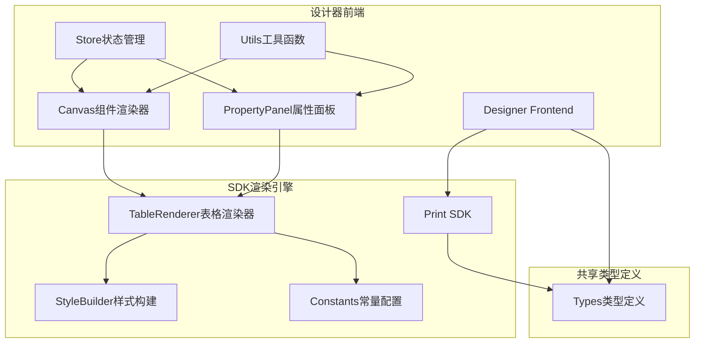
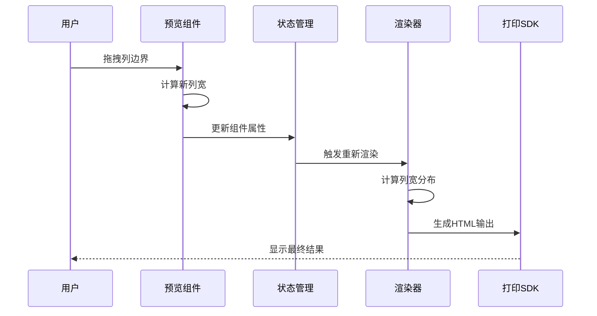
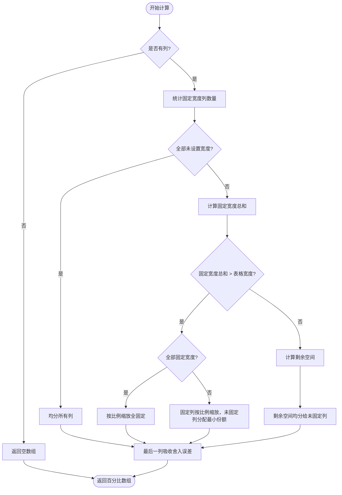
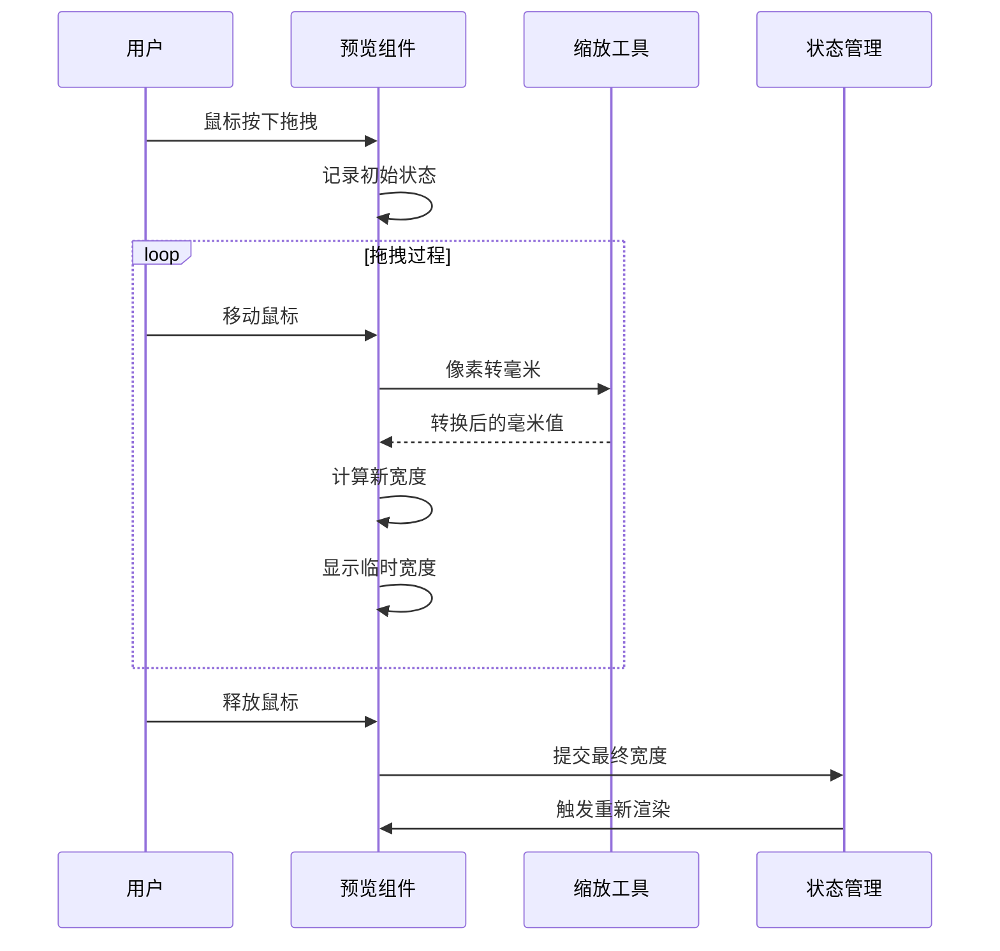
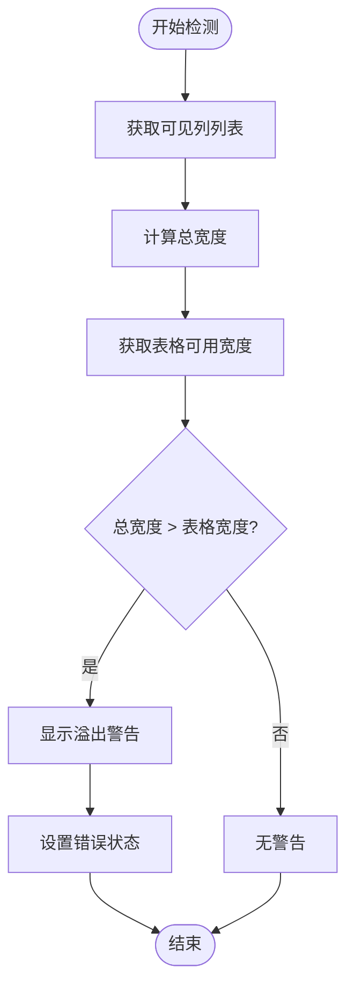
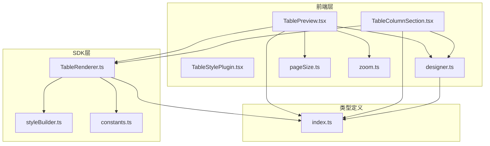

# 表格列宽管理系统

<cite>
**本文档引用的文件**
- [TablePreview.tsx](file://designer/src/pages/Designer/components/Canvas/componentRenderers/TablePreview.tsx)
- [TableColumnSection.tsx](file://designer/src/pages/Designer/components/PropertyPanel/TableColumnSection.tsx)
- [TableStylePlugin.tsx](file://designer/src/pages/Designer/components/PropertyPanel/stylePlugins/TableStylePlugin.tsx)
- [TableRenderer.ts](file://sdk/src/printEngine/renderers/TableRenderer.ts)
- [index.ts](file://designer/src/types/index.ts)
- [pageSize.ts](file://designer/src/utils/pageSize.ts)
- [zoom.ts](file://designer/src/utils/zoom.ts)
- [designer.ts](file://designer/src/store/designer.ts)
- [styleBuilder.ts](file://sdk/src/printEngine/utils/styleBuilder.ts)
- [constants.ts](file://sdk/src/printEngine/constants.ts)
- [index.ts](file://designer/src/pages/Designer/components/Canvas/componentRenderers/index.ts)
- [index.ts](file://designer/src/pages/Designer/components/PropertyPanel/stylePlugins/index.ts)
</cite>

## 目录
1. [简介](#简介)
2. [项目结构](#项目结构)
3. [核心组件](#核心组件)
4. [架构概览](#架构概览)
5. [详细组件分析](#详细组件分析)
6. [依赖关系分析](#依赖关系分析)
7. [性能考量](#性能考量)
8. [故障排除指南](#故障排除指南)
9. [结论](#结论)

## 简介

表格列宽管理系统是一个完整的打印模板设计解决方案，专注于提供精确的表格列宽控制功能。该系统通过可视化拖拽、属性面板配置和智能算法计算，实现了从设计到渲染的完整列宽管理流程。

系统采用前后端分离架构，前端负责交互设计和实时预览，后端SDK负责最终的打印渲染。核心特性包括：
- 实时拖拽调整列宽
- 智能列宽计算算法
- 表格溢出检测和警告
- 跨页面表格渲染支持
- 完整的撤销重做机制

## 项目结构

该项目采用模块化的组织方式，主要分为两个核心部分：

**图表来源**
- [TablePreview.tsx:1-175](file://designer/src/pages/Designer/components/Canvas/componentRenderers/TablePreview.tsx#L1-L175)
- [TableRenderer.ts:1-602](file://sdk/src/printEngine/renderers/TableRenderer.ts#L1-L602)
- [index.ts:1-378](file://designer/src/types/index.ts#L1-L378)

**章节来源**
- [TablePreview.tsx:1-175](file://designer/src/pages/Designer/components/Canvas/componentRenderers/TablePreview.tsx#L1-L175)
- [TableColumnSection.tsx:1-718](file://designer/src/pages/Designer/components/PropertyPanel/TableColumnSection.tsx#L1-L718)
- [TableRenderer.ts:1-602](file://sdk/src/printEngine/renderers/TableRenderer.ts#L1-L602)

## 核心组件

### 表格预览组件 (TablePreview)

表格预览组件是用户交互的核心界面，提供了直观的列宽调整功能：

- **拖拽调整机制**：通过鼠标拖拽列边界实现精确的列宽控制
- **实时预览**：拖拽过程中实时显示当前列宽（以毫米为单位）
- **智能约束**：自动计算并应用最大允许宽度限制
- **缩放适配**：根据当前画布缩放级别准确转换像素到毫米

### 属性面板组件 (TableColumnSection)

属性面板提供了全面的表格列配置选项：

- **列管理**：添加、删除、排序表格列
- **列宽控制**：手动输入列宽或使用拖拽调整
- **可见性控制**：动态显示/隐藏表格列
- **溢出检测**：实时检测列宽总和是否超过表格宽度
- **合计配置**：为特定列配置统计功能

### 渲染器组件 (TableRenderer)

渲染器负责将设计的表格转换为最终的打印输出：

- **智能列宽计算**：根据固定宽度和剩余空间智能分配列宽
- **溢出处理**：当列宽总和超过限制时的自动调整策略
- **跨页面支持**：处理表格跨页时的渲染逻辑
- **样式一致性**：确保设计时和渲染时的样式保持一致

**章节来源**
- [TablePreview.tsx:69-175](file://designer/src/pages/Designer/components/Canvas/componentRenderers/TablePreview.tsx#L69-L175)
- [TableColumnSection.tsx:22-718](file://designer/src/pages/Designer/components/PropertyPanel/TableColumnSection.tsx#L22-L718)
- [TableRenderer.ts:147-602](file://sdk/src/printEngine/renderers/TableRenderer.ts#L147-L602)

## 架构概览

系统采用分层架构设计，确保了良好的可维护性和扩展性：

**图表来源**
- [TablePreview.tsx:12-64](file://designer/src/pages/Designer/components/Canvas/componentRenderers/TablePreview.tsx#L12-L64)
- [designer.ts:125-136](file://designer/src/store/designer.ts#L125-L136)
- [TableRenderer.ts:150-327](file://sdk/src/printEngine/renderers/TableRenderer.ts#L150-L327)

系统架构的关键特点：

1. **双向数据流**：用户操作通过状态管理器影响渲染器，渲染器的结果又反馈到预览界面
2. **算法一致性**：设计器和SDK使用相同的列宽计算算法，确保设计与渲染的一致性
3. **实时响应**：拖拽操作采用事件驱动的方式，提供流畅的用户体验
4. **错误预防**：通过溢出检测和约束验证，防止出现不可预期的布局问题

## 详细组件分析

### 列宽计算算法

列宽计算是整个系统的核心算法，需要处理多种复杂场景：

**图表来源**
- [TableRenderer.ts:51-125](file://sdk/src/printEngine/renderers/TableRenderer.ts#L51-L125)

算法的三个主要分支：

1. **均分模式**：当所有列都未设置宽度时，系统会将表格宽度平均分配给所有列
2. **固定宽度模式**：当存在固定宽度列时，系统会先计算固定宽度列的占用空间，然后将剩余空间分配给未固定列
3. **溢出处理模式**：当固定宽度列的总和超过表格宽度时，系统会采用不同的策略：
   - 全固定：按比例缩放所有固定宽度列
   - 部分固定：固定列按比例缩放，未固定列分配最小份额

### 拖拽调整机制

拖拽调整机制提供了直观的用户交互体验：

**图表来源**
- [TablePreview.tsx:12-64](file://designer/src/pages/Designer/components/Canvas/componentRenderers/TablePreview.tsx#L12-L64)
- [zoom.ts:30-42](file://designer/src/utils/zoom.ts#L30-L42)

拖拽机制的关键特性：

- **实时预览**：拖拽过程中显示当前列宽，帮助用户精确控制
- **缩放适配**：考虑到不同缩放级别的准确性，使用像素到毫米的精确转换
- **边界约束**：确保列宽不会小于最小值或超过最大允许值
- **性能优化**：只在鼠标释放时才更新状态，避免频繁的状态变更

### 溢出检测系统

系统内置了完善的溢出检测机制，防止出现布局问题：

**图表来源**
- [TableColumnSection.tsx:28-34](file://designer/src/pages/Designer/components/PropertyPanel/TableColumnSection.tsx#L28-L34)

溢出检测的应用场景：

1. **列宽输入验证**：当用户手动输入列宽时，实时检查是否会导致溢出
2. **最大宽度限制**：动态计算每列的最大允许宽度，防止用户输入超出限制的值
3. **视觉反馈**：通过颜色变化和工具提示提供清晰的用户反馈

**章节来源**
- [TablePreview.tsx:12-64](file://designer/src/pages/Designer/components/Canvas/componentRenderers/TablePreview.tsx#L12-L64)
- [TableColumnSection.tsx:28-549](file://designer/src/pages/Designer/components/PropertyPanel/TableColumnSection.tsx#L28-L549)
- [TableRenderer.ts:51-125](file://sdk/src/printEngine/renderers/TableRenderer.ts#L51-L125)

## 依赖关系分析

系统各组件之间的依赖关系体现了清晰的分层架构：

**图表来源**
- [TablePreview.tsx:1-6](file://designer/src/pages/Designer/components/Canvas/componentRenderers/TablePreview.tsx#L1-L6)
- [TableRenderer.ts:1-11](file://sdk/src/printEngine/renderers/TableRenderer.ts#L1-L11)
- [index.ts:1-378](file://designer/src/types/index.ts#L1-L378)

主要依赖关系：

1. **算法一致性依赖**：前端和SDK共享相同的列宽计算逻辑，确保设计与渲染的一致性
2. **工具函数依赖**：前端组件依赖通用的工具函数进行页面尺寸计算和缩放转换
3. **类型定义依赖**：所有组件都依赖统一的类型定义，确保数据结构的一致性
4. **状态管理依赖**：前端组件通过状态管理器协调数据流，实现组件间的通信

**章节来源**
- [TablePreview.tsx:1-6](file://designer/src/pages/Designer/components/Canvas/componentRenderers/TablePreview.tsx#L1-L6)
- [TableRenderer.ts:1-11](file://sdk/src/printEngine/renderers/TableRenderer.ts#L1-L11)
- [index.ts:1-378](file://designer/src/types/index.ts#L1-L378)

## 性能考量

系统在设计时充分考虑了性能优化：

### 算法复杂度
- **列宽计算**：时间复杂度 O(n)，其中 n 是列的数量
- **拖拽事件处理**：O(1) 的常数时间复杂度
- **溢出检测**：O(n) 的线性时间复杂度

### 内存优化
- **状态管理**：使用轻量级的状态管理模式，避免不必要的状态复制
- **事件监听**：及时清理事件监听器，防止内存泄漏
- **组件卸载**：在组件卸载时自动清理相关的DOM事件

### 渲染优化
- **虚拟滚动**：对于大量数据的表格，采用虚拟滚动技术减少DOM节点数量
- **批量更新**：将多次状态更新合并为单次批量更新
- **防抖处理**：对高频事件（如窗口大小变化）使用防抖技术

## 故障排除指南

### 常见问题及解决方案

#### 1. 列宽拖拽不准确
**症状**：拖拽时列宽显示与实际不符
**原因**：缩放级别或像素到毫米转换不正确
**解决方法**：
- 检查当前缩放级别设置
- 验证像素到毫米的转换系数
- 确认浏览器的DPI设置

#### 2. 表格溢出警告频繁出现
**症状**：即使手动输入的列宽看起来合理，仍出现溢出警告
**原因**：列宽总和计算包含隐藏列或序号列
**解决方法**：
- 检查所有列的可见性状态
- 确认序号列的宽度设置
- 验证表格可用宽度计算

#### 3. 渲染结果与预览不一致
**症状**：设计时显示的布局与最终打印效果不同
**原因**：设计器和SDK使用了不同的列宽计算算法
**解决方法**：
- 确保使用相同的列宽计算函数
- 检查版本兼容性
- 验证数据传递的完整性

#### 4. 性能问题
**症状**：拖拽响应缓慢或界面卡顿
**原因**：事件监听器过多或状态更新过于频繁
**解决方法**：
- 检查事件监听器的清理
- 实施防抖和节流机制
- 优化状态更新策略

**章节来源**
- [TablePreview.tsx:36-61](file://designer/src/pages/Designer/components/Canvas/componentRenderers/TablePreview.tsx#L36-L61)
- [TableColumnSection.tsx:28-34](file://designer/src/pages/Designer/components/PropertyPanel/TableColumnSection.tsx#L28-L34)
- [TableRenderer.ts:67-102](file://sdk/src/printEngine/renderers/TableRenderer.ts#L67-L102)

## 结论

表格列宽管理系统通过精心设计的架构和算法，成功解决了打印模板设计中的列宽控制难题。系统的主要优势包括：

1. **用户体验优秀**：直观的拖拽操作和实时预览提供了流畅的交互体验
2. **算法精确可靠**：经过充分测试的列宽计算算法确保了布局的准确性
3. **扩展性强**：模块化的架构设计便于功能扩展和维护
4. **性能优异**：优化的算法和状态管理确保了系统的高效运行

该系统不仅满足了当前的功能需求，还为未来的功能扩展奠定了坚实的基础。通过持续的优化和完善，相信能够为用户提供更加优秀的表格设计体验。