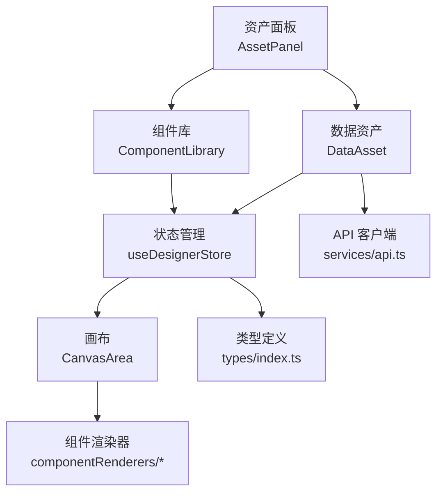
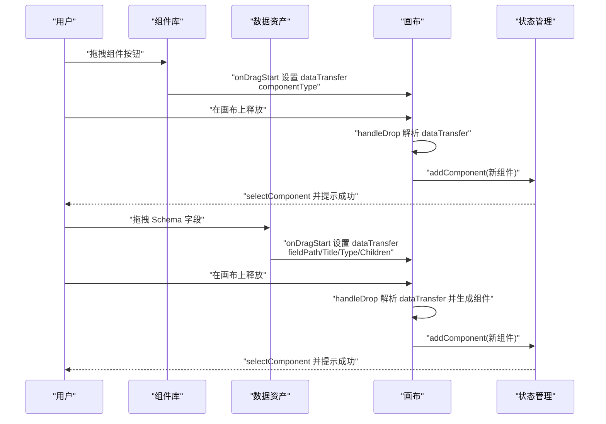
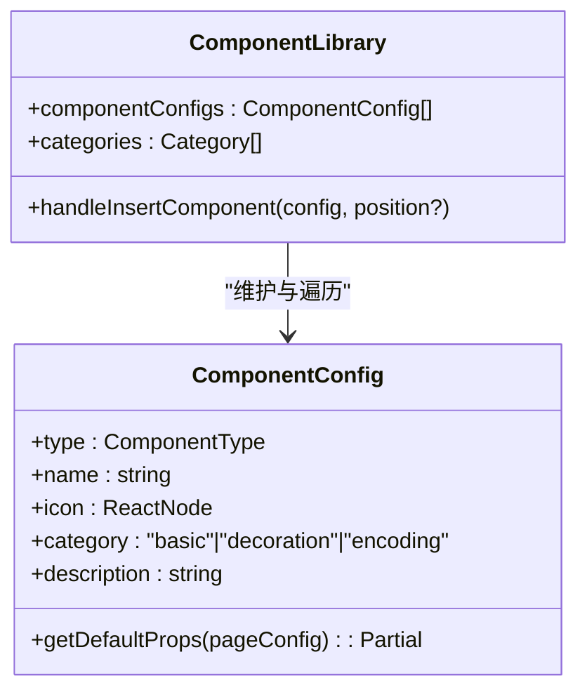
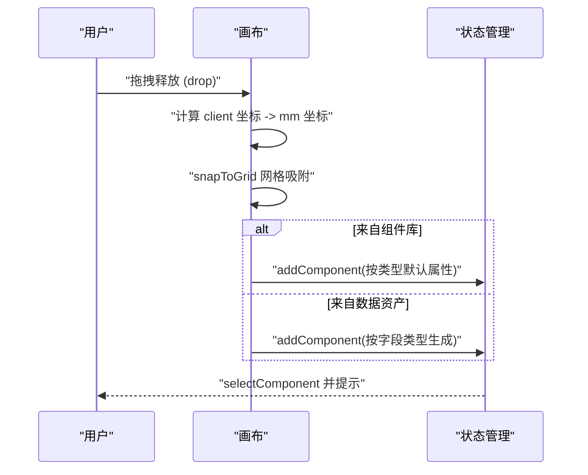
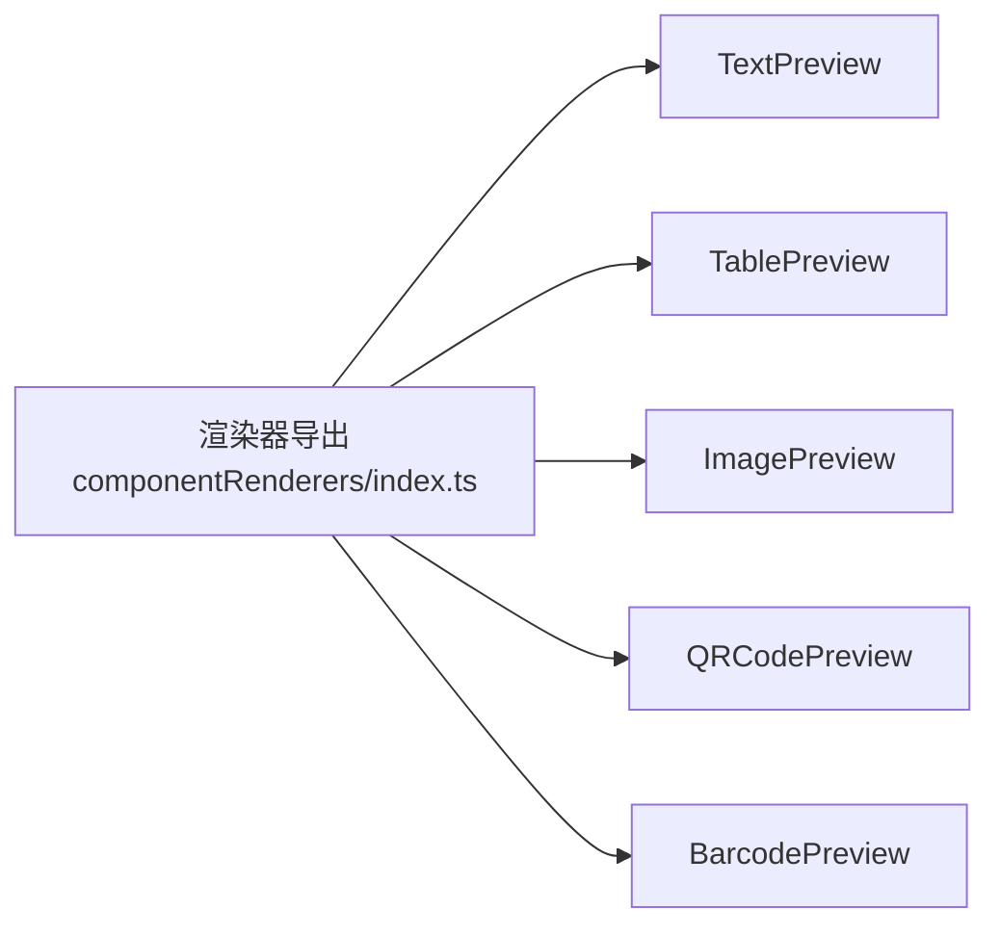
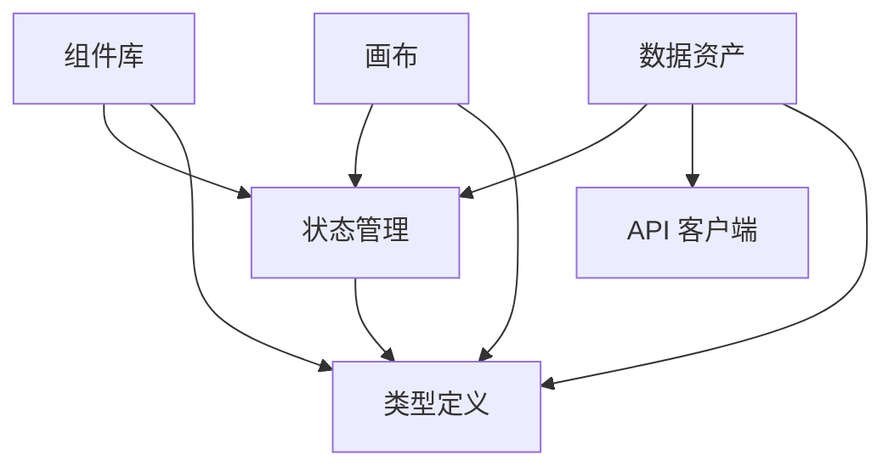

# 数据资产面板

<cite>
**本文引用的文件**   
- [designer/src/pages/Designer/components/AssetPanel/index.tsx](file://designer/src/pages/Designer/components/AssetPanel/index.tsx)
- [designer/src/pages/Designer/components/AssetPanel/DataAsset/index.tsx](file://designer/src/pages/Designer/components/AssetPanel/DataAsset/index.tsx)
- [designer/src/pages/Designer/components/AssetPanel/ComponentLibrary/index.tsx](file://designer/src/pages/Designer/components/AssetPanel/ComponentLibrary/index.tsx)
- [designer/src/pages/Designer/components/Canvas/index.tsx](file://designer/src/pages/Designer/components/Canvas/index.tsx)
- [designer/src/store/designer.ts](file://designer/src/store/designer.ts)
- [designer/src/types/index.ts](file://designer/src/types/index.ts)
- [designer/src/services/api.ts](file://designer/src/services/api.ts)
- [designer/src/pages/Designer/components/Canvas/componentRenderers/index.ts](file://designer/src/pages/Designer/components/Canvas/componentRenderers/index.ts)
- [designer/src/pages/Designer/components/Canvas/componentRenderers/TextPreview.tsx](file://designer/src/pages/Designer/components/Canvas/componentRenderers/TextPreview.tsx)
- [designer/src/pages/Designer/components/Canvas/componentRenderers/TablePreview.tsx](file://designer/src/pages/Designer/components/Canvas/componentRenderers/TablePreview.tsx)
- [designer/src/pages/Designer/components/Canvas/componentRenderers/ImagePreview.tsx](file://designer/src/pages/Designer/components/Canvas/componentRenderers/ImagePreview.tsx)
- [designer/src/pages/Designer/components/Canvas/componentRenderers/QRCodePreview.tsx](file://designer/src/pages/Designer/components/Canvas/componentRenderers/QRCodePreview.tsx)
- [designer/src/pages/Designer/components/Canvas/componentRenderers/BarcodePreview.tsx](file://designer/src/pages/Designer/components/Canvas/componentRenderers/BarcodePreview.tsx)
- [designer/src/pages/AssetManagement/index.tsx](file://designer/src/pages/AssetManagement/index.tsx)
</cite>

## 目录
1. [简介](#简介)
2. [项目结构](#项目结构)
3. [核心组件](#核心组件)
4. [架构总览](#架构总览)
5. [详细组件分析](#详细组件分析)
6. [依赖关系分析](#依赖关系分析)
7. [性能考量](#性能考量)
8. [故障排查指南](#故障排查指南)
9. [结论](#结论)
10. [附录](#附录)

## 简介
本文件面向“数据资产面板”的功能与实现，系统性梳理组件库（7种基础组件：文本、表格、图片、二维码、条形码、线条、矩形）的展示与管理，详解组件从组件库或数据资产区拖拽到画布的机制与事件处理流程，阐述数据资产区域的 Schema 管理与 Mock 数据管理界面设计，并解释组件库的搜索与分类能力。文档还覆盖组件预览、拖拽反馈与放置区域高亮的技术细节，给出组件库扩展与自定义组件添加方法，以及实际使用示例与操作流程。

## 项目结构
数据资产面板位于设计器前端模块中，主要由以下部分组成：
- 资产面板容器：切换“数据资产”和“组件库”两个标签页
- 数据资产区：基于 Schema 的字段树，支持双击/拖拽添加到画布
- 组件库：7种基础组件的分类展示与拖拽插入
- 画布：接收来自组件库与数据资产的拖拽，执行布局、吸附、对齐、层级与撤销重做等交互
- 状态管理：集中管理组件集合、选中状态、页面配置、历史记录等
- 类型定义：Schema、组件节点、页面配置、打印模板等强类型
- API 客户端：Schema、模板、Mock 数据的增删改查接口封装



图表来源
- [designer/src/pages/Designer/components/AssetPanel/index.tsx:1-32](file://designer/src/pages/Designer/components/AssetPanel/index.tsx#L1-L32)
- [designer/src/pages/Designer/components/AssetPanel/DataAsset/index.tsx:1-350](file://designer/src/pages/Designer/components/AssetPanel/DataAsset/index.tsx#L1-L350)
- [designer/src/pages/Designer/components/AssetPanel/ComponentLibrary/index.tsx:1-238](file://designer/src/pages/Designer/components/AssetPanel/ComponentLibrary/index.tsx#L1-L238)
- [designer/src/pages/Designer/components/Canvas/index.tsx:1-1006](file://designer/src/pages/Designer/components/Canvas/index.tsx#L1-L1006)
- [designer/src/store/designer.ts:1-539](file://designer/src/store/designer.ts#L1-L539)
- [designer/src/types/index.ts:1-160](file://designer/src/types/index.ts#L1-L160)
- [designer/src/services/api.ts:1-97](file://designer/src/services/api.ts#L1-L97)

章节来源
- [designer/src/pages/Designer/components/AssetPanel/index.tsx:1-32](file://designer/src/pages/Designer/components/AssetPanel/index.tsx#L1-L32)
- [designer/src/pages/Designer/components/AssetPanel/DataAsset/index.tsx:1-350](file://designer/src/pages/Designer/components/AssetPanel/DataAsset/index.tsx#L1-L350)
- [designer/src/pages/Designer/components/AssetPanel/ComponentLibrary/index.tsx:1-238](file://designer/src/pages/Designer/components/AssetPanel/ComponentLibrary/index.tsx#L1-L238)
- [designer/src/pages/Designer/components/Canvas/index.tsx:1-1006](file://designer/src/pages/Designer/components/Canvas/index.tsx#L1-L1006)
- [designer/src/store/designer.ts:1-539](file://designer/src/store/designer.ts#L1-L539)
- [designer/src/types/index.ts:1-160](file://designer/src/types/index.ts#L1-L160)
- [designer/src/services/api.ts:1-97](file://designer/src/services/api.ts#L1-L97)

## 核心组件
- 资产面板容器：提供“数据资产”和“组件库”两个标签页，分别挂载对应子组件
- 数据资产区：加载 Schema 列表，将 Schema 字段树可视化，支持双击/拖拽添加到画布
- 组件库：7 种基础组件按“基础组件/装饰组件/编码组件”分类展示，支持双击快速添加与拖拽精确放置
- 画布：统一接收拖拽事件，区分组件库与数据资产两类来源，生成组件节点并写入状态管理
- 状态管理：提供组件增删改、选中、复制粘贴、撤销重做、层级管理、网格与对齐等能力
- 类型定义：约束 Schema、组件节点、页面配置、打印模板等结构
- API 客户端：封装 Schema、模板、Mock 数据的 REST 接口

章节来源
- [designer/src/pages/Designer/components/AssetPanel/index.tsx:1-32](file://designer/src/pages/Designer/components/AssetPanel/index.tsx#L1-L32)
- [designer/src/pages/Designer/components/AssetPanel/DataAsset/index.tsx:1-350](file://designer/src/pages/Designer/components/AssetPanel/DataAsset/index.tsx#L1-L350)
- [designer/src/pages/Designer/components/AssetPanel/ComponentLibrary/index.tsx:1-238](file://designer/src/pages/Designer/components/AssetPanel/ComponentLibrary/index.tsx#L1-L238)
- [designer/src/pages/Designer/components/Canvas/index.tsx:1-1006](file://designer/src/pages/Designer/components/Canvas/index.tsx#L1-L1006)
- [designer/src/store/designer.ts:1-539](file://designer/src/store/designer.ts#L1-L539)
- [designer/src/types/index.ts:1-160](file://designer/src/types/index.ts#L1-L160)
- [designer/src/services/api.ts:1-97](file://designer/src/services/api.ts#L1-L97)

## 架构总览
数据资产面板采用“标签页容器 + 子面板 + 画布 + 状态管理 + 类型与 API”的分层架构。组件库与数据资产均通过拖拽事件进入画布，画布负责坐标换算、网格吸附、智能对齐、边界约束与组件更新；状态管理负责持久化组件集合与历史记录，支撑撤销重做与批量操作；类型与 API 提供强类型约束与后端交互。



图表来源
- [designer/src/pages/Designer/components/AssetPanel/ComponentLibrary/index.tsx:219-225](file://designer/src/pages/Designer/components/AssetPanel/ComponentLibrary/index.tsx#L219-L225)
- [designer/src/pages/Designer/components/Canvas/index.tsx:195-378](file://designer/src/pages/Designer/components/Canvas/index.tsx#L195-L378)
- [designer/src/store/designer.ts:87-106](file://designer/src/store/designer.ts#L87-L106)

## 详细组件分析

### 组件库（7种基础组件）
- 组件类型与分类：文本、表格、图片、二维码、条形码、线条、矩形，按 basic/decoration/encoding 分类
- 默认属性：每种组件提供 getDefaultProps(pageConfig)，结合页面尺寸与边距计算默认布局
- 拖拽行为：按钮 draggable，onDragStart 设置 componentType，支持精确放置
- 双击行为：onClick(e.detail===2) 触发快速添加，位置为画布中心



图表来源
- [designer/src/pages/Designer/components/AssetPanel/ComponentLibrary/index.tsx:15-128](file://designer/src/pages/Designer/components/AssetPanel/ComponentLibrary/index.tsx#L15-L128)

章节来源
- [designer/src/pages/Designer/components/AssetPanel/ComponentLibrary/index.tsx:1-238](file://designer/src/pages/Designer/components/AssetPanel/ComponentLibrary/index.tsx#L1-L238)

### 数据资产区（Schema 与 Mock 数据）
- Schema 列表加载：首次挂载时调用 API 获取列表，设置默认选中与模板信息
- 字段树构建：将 SchemaField 转为 Ant Design Tree 的 DataNode，支持对象/数组/普通字段的图标与禁用策略
- 双击添加：禁止 object/array 类型直接添加；数组类型生成表格；普通字段生成文本
- 拖拽添加：onDragStart 设置 fieldPath/Title/Type/Children；onDragEnd 在画布上生成组件
- 辅助工具：findFieldByPath、isArrayChildField、convertSchemaToTree 等

```mermaid
flowchart TD
Start(["开始"]) --> Load["加载 Schema 列表"]
Load --> BuildTree["将 Schema 转为 Tree 数据"]
BuildTree --> Wait["等待用户操作"]
Wait --> |双击字段| CheckType{"字段类型？"}
CheckType --> |object|array 子字段| Warn["提示不可直接添加"]
CheckType --> |array| CreateTable["生成表格组件"]
CheckType --> |其他| CreateText["生成文本组件"]
Wait --> |拖拽字段| DragStart["设置 dataTransfer"]
DragStart --> DropOnCanvas["在画布上释放"]
DropOnCanvas --> GenComp["根据类型生成组件"]
CreateTable --> AddStore["addComponent 并 selectComponent"]
CreateText --> AddStore
GenComp --> AddStore
AddStore --> End(["结束"])
```

图表来源
- [designer/src/pages/Designer/components/AssetPanel/DataAsset/index.tsx:31-287](file://designer/src/pages/Designer/components/AssetPanel/DataAsset/index.tsx#L31-L287)

章节来源
- [designer/src/pages/Designer/components/AssetPanel/DataAsset/index.tsx:1-350](file://designer/src/pages/Designer/components/AssetPanel/DataAsset/index.tsx#L1-L350)
- [designer/src/services/api.ts:14-38](file://designer/src/services/api.ts#L14-L38)

### 画布（拖拽、吸附、对齐与放置）
- 拖拽入口：handleDrop 统一处理两类来源
  - 组件库来源：解析 componentType，按默认属性生成组件
  - 数据资产来源：解析 fieldPath/Title/Type/Children，生成文本或表格
- 坐标换算：client 像素坐标转 mm 坐标（除以换算系数），应用网格吸附与边界约束
- 智能对齐：单选拖拽时检测对齐，优先应用对齐吸附
- 多选拖拽：同步更新所有选中组件布局
- 放置区域高亮：通过 dragOver 状态控制容器样式



图表来源
- [designer/src/pages/Designer/components/Canvas/index.tsx:195-378](file://designer/src/pages/Designer/components/Canvas/index.tsx#L195-L378)
- [designer/src/store/designer.ts:87-106](file://designer/src/store/designer.ts#L87-L106)

章节来源
- [designer/src/pages/Designer/components/Canvas/index.tsx:1-1006](file://designer/src/pages/Designer/components/Canvas/index.tsx#L1-L1006)

### 组件预览与渲染器
- 统一导出：componentRenderers/index.ts 汇总各组件预览渲染器
- 文本预览：支持字号、颜色、字重与对齐
- 表格预览：支持表头显示、边框、列可见性与占位文案
- 图片预览：支持 objectFit 与占位提示
- 二维码/条形码预览：根据布局尺寸转换像素，使用内置组件渲染



图表来源
- [designer/src/pages/Designer/components/Canvas/componentRenderers/index.ts:1-11](file://designer/src/pages/Designer/components/Canvas/componentRenderers/index.ts#L1-L11)
- [designer/src/pages/Designer/components/Canvas/componentRenderers/TextPreview.tsx:1-31](file://designer/src/pages/Designer/components/Canvas/componentRenderers/TextPreview.tsx#L1-L31)
- [designer/src/pages/Designer/components/Canvas/componentRenderers/TablePreview.tsx:1-56](file://designer/src/pages/Designer/components/Canvas/componentRenderers/TablePreview.tsx#L1-L56)
- [designer/src/pages/Designer/components/Canvas/componentRenderers/ImagePreview.tsx:1-34](file://designer/src/pages/Designer/components/Canvas/componentRenderers/ImagePreview.tsx#L1-L34)
- [designer/src/pages/Designer/components/Canvas/componentRenderers/QRCodePreview.tsx:1-17](file://designer/src/pages/Designer/components/Canvas/componentRenderers/QRCodePreview.tsx#L1-L17)
- [designer/src/pages/Designer/components/Canvas/componentRenderers/BarcodePreview.tsx:1-26](file://designer/src/pages/Designer/components/Canvas/componentRenderers/BarcodePreview.tsx#L1-L26)

章节来源
- [designer/src/pages/Designer/components/Canvas/componentRenderers/index.ts:1-11](file://designer/src/pages/Designer/components/Canvas/componentRenderers/index.ts#L1-L11)
- [designer/src/pages/Designer/components/Canvas/componentRenderers/TextPreview.tsx:1-31](file://designer/src/pages/Designer/components/Canvas/componentRenderers/TextPreview.tsx#L1-L31)
- [designer/src/pages/Designer/components/Canvas/componentRenderers/TablePreview.tsx:1-56](file://designer/src/pages/Designer/components/Canvas/componentRenderers/TablePreview.tsx#L1-L56)
- [designer/src/pages/Designer/components/Canvas/componentRenderers/ImagePreview.tsx:1-34](file://designer/src/pages/Designer/components/Canvas/componentRenderers/ImagePreview.tsx#L1-L34)
- [designer/src/pages/Designer/components/Canvas/componentRenderers/QRCodePreview.tsx:1-17](file://designer/src/pages/Designer/components/Canvas/componentRenderers/QRCodePreview.tsx#L1-L17)
- [designer/src/pages/Designer/components/Canvas/componentRenderers/BarcodePreview.tsx:1-26](file://designer/src/pages/Designer/components/Canvas/componentRenderers/BarcodePreview.tsx#L1-L26)

### 数据资产管理（Schema 与 Mock 数据）
- 页面入口：AssetManagement 标签页包含“Schema 字典”和“Mock 数据”
- 数据资产区：DataAsset 中的 Schema 列表与 Tree 构建逻辑，配合 API 客户端进行 CRUD

章节来源
- [designer/src/pages/AssetManagement/index.tsx:1-35](file://designer/src/pages/AssetManagement/index.tsx#L1-L35)
- [designer/src/pages/Designer/components/AssetPanel/DataAsset/index.tsx:1-350](file://designer/src/pages/Designer/components/AssetPanel/DataAsset/index.tsx#L1-L350)
- [designer/src/services/api.ts:14-96](file://designer/src/services/api.ts#L14-L96)

## 依赖关系分析
- 组件库与数据资产均依赖状态管理进行组件增删改与选中
- 画布依赖状态管理进行组件更新与布局变更
- 数据资产依赖 API 客户端获取 Schema 列表
- 类型定义贯穿于组件库、数据资产、画布与状态管理
- 渲染器依赖类型定义与组件节点结构



图表来源
- [designer/src/pages/Designer/components/AssetPanel/ComponentLibrary/index.tsx:1-238](file://designer/src/pages/Designer/components/AssetPanel/ComponentLibrary/index.tsx#L1-L238)
- [designer/src/pages/Designer/components/AssetPanel/DataAsset/index.tsx:1-350](file://designer/src/pages/Designer/components/AssetPanel/DataAsset/index.tsx#L1-L350)
- [designer/src/pages/Designer/components/Canvas/index.tsx:1-1006](file://designer/src/pages/Designer/components/Canvas/index.tsx#L1-L1006)
- [designer/src/store/designer.ts:1-539](file://designer/src/store/designer.ts#L1-L539)
- [designer/src/types/index.ts:1-160](file://designer/src/types/index.ts#L1-L160)
- [designer/src/services/api.ts:1-97](file://designer/src/services/api.ts#L1-L97)

章节来源
- [designer/src/pages/Designer/components/AssetPanel/ComponentLibrary/index.tsx:1-238](file://designer/src/pages/Designer/components/AssetPanel/ComponentLibrary/index.tsx#L1-L238)
- [designer/src/pages/Designer/components/AssetPanel/DataAsset/index.tsx:1-350](file://designer/src/pages/Designer/components/AssetPanel/DataAsset/index.tsx#L1-L350)
- [designer/src/pages/Designer/components/Canvas/index.tsx:1-1006](file://designer/src/pages/Designer/components/Canvas/index.tsx#L1-L1006)
- [designer/src/store/designer.ts:1-539](file://designer/src/store/designer.ts#L1-L539)
- [designer/src/types/index.ts:1-160](file://designer/src/types/index.ts#L1-L160)
- [designer/src/services/api.ts:1-97](file://designer/src/services/api.ts#L1-L97)

## 性能考量
- 状态更新批量化：状态管理在组件增删改时统一保存历史快照，避免频繁重渲染
- 网格吸附与对齐：在拖拽过程中按需计算，避免不必要的重排
- 渲染器轻量：预览渲染器仅做样式映射，不引入复杂计算
- 大量组件场景：建议限制一次性选中数量，减少多选拖拽的批量更新频率

## 故障排查指南
- 拖拽无效
  - 检查组件库按钮是否设置 draggable 与 onDragStart
  - 检查画布 drop 事件是否正确解析 dataTransfer
- 组件越界
  - 检查页面尺寸与方向，确认边界约束逻辑
  - 检查连续纸模式下的高度计算
- 对齐/吸附异常
  - 检查网格开关与吸附阈值
  - 检查智能对齐检测是否在单选状态下启用
- 数据资产无法拖拽
  - 检查 Tree 的 draggable 返回值与 onDragStart 设置
  - 检查字段类型过滤（object/array 子字段）

章节来源
- [designer/src/pages/Designer/components/AssetPanel/ComponentLibrary/index.tsx:219-225](file://designer/src/pages/Designer/components/AssetPanel/ComponentLibrary/index.tsx#L219-L225)
- [designer/src/pages/Designer/components/Canvas/index.tsx:195-378](file://designer/src/pages/Designer/components/Canvas/index.tsx#L195-L378)
- [designer/src/pages/Designer/components/AssetPanel/DataAsset/index.tsx:313-342](file://designer/src/pages/Designer/components/AssetPanel/DataAsset/index.tsx#L313-L342)

## 结论
数据资产面板通过清晰的分层设计实现了“Schema 驱动的字段可视化 + 组件库的即插即用”，并以统一的画布作为承载层完成拖拽、吸附、对齐与层级管理。状态管理与类型定义保证了数据一致性与可扩展性，API 客户端提供了与后端的稳定交互。整体方案具备良好的可维护性与扩展性，便于后续新增组件与功能增强。

## 附录

### 组件库扩展与自定义组件添加
- 新增组件步骤
  - 在组件库配置中添加新的 ComponentConfig，指定 type、name、icon、category、description、getDefaultProps
  - 在画布的 handleDrop 中增加对该类型的分支处理，生成默认布局与 props
  - 在渲染器目录新增对应的预览组件，并在导出索引中注册
  - 在类型定义中扩展 ComponentType 与相应 props 接口
- 注意事项
  - 保持 getDefaultProps 与页面配置联动，考虑边距与可用宽度
  - 预览组件应尽量轻量，避免复杂计算
  - 对于需要数据绑定的组件，补充 binding 字段与 fallback 逻辑

章节来源
- [designer/src/pages/Designer/components/AssetPanel/ComponentLibrary/index.tsx:15-128](file://designer/src/pages/Designer/components/AssetPanel/ComponentLibrary/index.tsx#L15-L128)
- [designer/src/pages/Designer/components/Canvas/index.tsx:217-290](file://designer/src/pages/Designer/components/Canvas/index.tsx#L217-L290)
- [designer/src/pages/Designer/components/Canvas/componentRenderers/index.ts:1-11](file://designer/src/pages/Designer/components/Canvas/componentRenderers/index.ts#L1-L11)
- [designer/src/types/index.ts:64-138](file://designer/src/types/index.ts#L64-L138)

### 实际使用示例与操作流程
- 添加基础组件
  - 打开“组件库”，在目标分类中点击组件按钮，双击或拖拽至画布；组件自动居中或按拖拽位置放置
- 从数据资产添加
  - 打开“数据资产”，在 Schema 列表中选择目标 Schema；在字段树中双击普通字段或拖拽字段到画布；数组字段会生成表格组件
- 组件管理
  - 在画布中点击组件选中，按 Delete 或右键菜单删除；支持复制、粘贴、克隆；支持撤销/重做
- 页面设置
  - 通过画布工具栏打开页面设置，调整纸张尺寸、方向与页边距；支持连续纸模式与自定义尺寸

章节来源
- [designer/src/pages/Designer/components/AssetPanel/ComponentLibrary/index.tsx:152-180](file://designer/src/pages/Designer/components/AssetPanel/ComponentLibrary/index.tsx#L152-L180)
- [designer/src/pages/Designer/components/AssetPanel/DataAsset/index.tsx:206-287](file://designer/src/pages/Designer/components/AssetPanel/DataAsset/index.tsx#L206-L287)
- [designer/src/pages/Designer/components/Canvas/index.tsx:564-671](file://designer/src/pages/Designer/components/Canvas/index.tsx#L564-L671)
- [designer/src/store/designer.ts:87-106](file://designer/src/store/designer.ts#L87-L106)