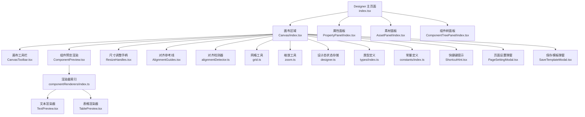
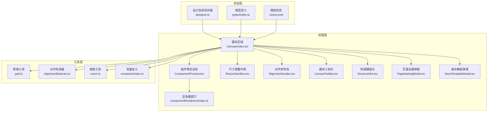
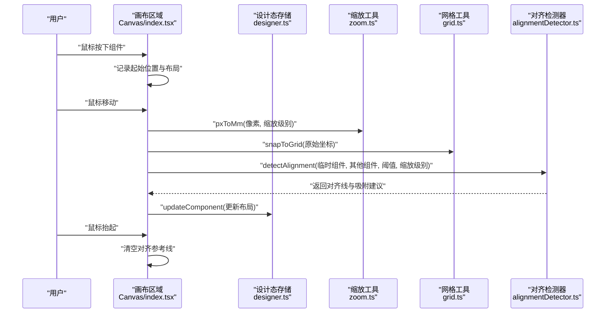
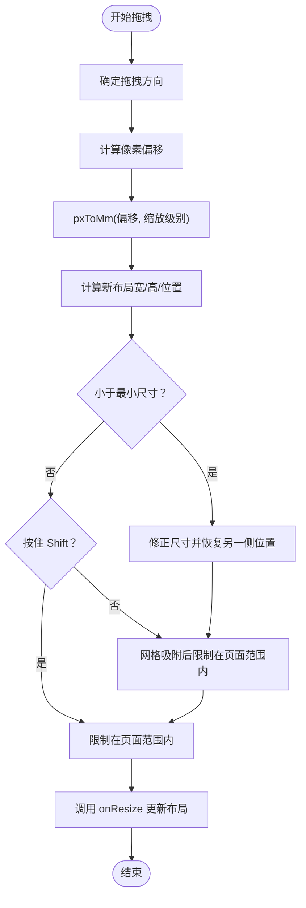
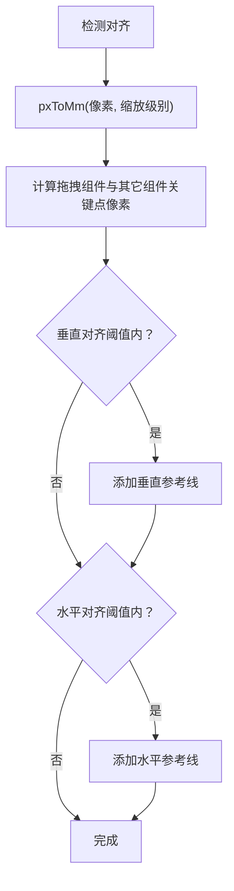
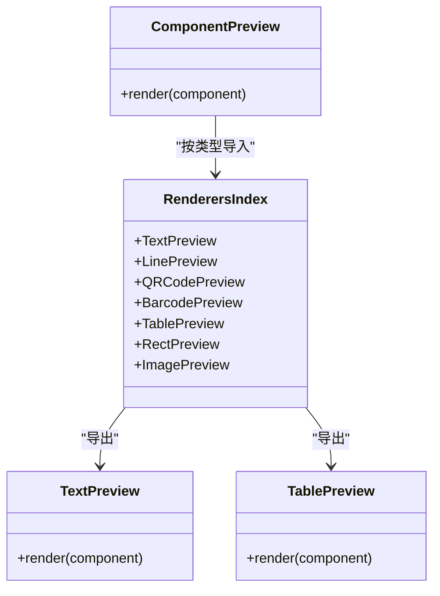
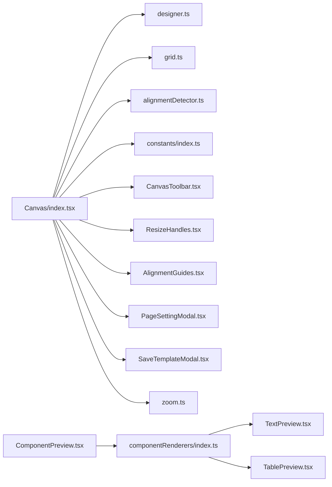

# 画布编辑器

<cite>
**本文引用的文件**
- [Designer 主页面](file://designer/src/pages/Designer/index.tsx)
- [画布区域](file://designer/src/pages/Designer/components/Canvas/index.tsx)
- [画布工具栏](file://designer/src/pages/Designer/components/Canvas/CanvasToolbar.tsx)
- [尺寸调整手柄](file://designer/src/pages/Designer/components/Canvas/ResizeHandles.tsx)
- [智能对齐参考线](file://designer/src/pages/Designer/components/Canvas/AlignmentGuides.tsx)
- [对齐检测器](file://designer/src/pages/Designer/components/Canvas/alignmentDetector.ts)
- [网格工具](file://designer/src/utils/grid.ts)
- [缩放工具](file://designer/src/utils/zoom.ts)
- [组件预览渲染器索引](file://designer/src/pages/Designer/components/Canvas/componentRenderers/index.ts)
- [文本预览渲染器](file://designer/src/pages/Designer/components/Canvas/componentRenderers/TextPreview.tsx)
- [表格预览渲染器](file://designer/src/pages/Designer/components/Canvas/componentRenderers/TablePreview.tsx)
- [组件预览内容渲染](file://designer/src/pages/Designer/components/Canvas/ComponentPreview.tsx)
- [设计态状态存储](file://designer/src/store/designer.ts)
- [类型定义](file://designer/src/types/index.ts)
- [常量定义](file://designer/src/constants/index.ts)
- [快捷键提示](file://designer/src/pages/Designer/components/Canvas/ShortcutHint.tsx)
- [页面设置弹窗](file://designer/src/pages/Designer/components/Canvas/PageSettingModal.tsx)
- [保存模板弹窗](file://designer/src/pages/Designer/components/Canvas/SaveTemplateModal.tsx)
</cite>

## 更新摘要
**变更内容**
- 新增画布缩放功能，包括浮动按钮组、键盘快捷键支持、缩放级别管理
- 更新画布坐标系统以支持缩放变换
- 扩展尺寸调整手柄以适配缩放环境
- 增强对齐检测器以考虑缩放级别影响
- 完善状态管理以支持缩放状态持久化

## 目录
1. [简介](#简介)
2. [项目结构](#项目结构)
3. [核心组件](#核心组件)
4. [架构总览](#架构总览)
5. [详细组件分析](#详细组件分析)
6. [依赖分析](#依赖分析)
7. [性能考虑](#性能考虑)
8. [故障排查指南](#故障排查指南)
9. [结论](#结论)
10. [附录](#附录)

## 简介
本文件面向画布编辑器的功能与实现，围绕组件拖拽、选择、移动、缩放、旋转、智能网格吸附与对齐参考线、工具栏与快捷操作、尺寸调整手柄与边界检测、组件渲染器注册与调用、画布坐标系统与事件处理、以及性能优化策略进行系统化说明，并提供可定位到源码路径的示例与使用指南。

**更新** 新增画布缩放功能，包括浮动按钮组、键盘快捷键支持、缩放级别管理等新特性，显著提升了用户体验和编辑精度。

## 项目结构
画布编辑器位于设计器模块中，采用"页面-组件-工具"的分层组织：
- 页面入口负责布局与面板控制
- 画布区域承载组件渲染、交互与状态
- 工具栏与快捷提示提供操作入口
- 渲染器模块负责组件预览渲染
- 状态管理集中于设计态存储，提供撤销/重做、对齐/分布、层级管理、缩放管理等能力

**图表来源**
- [Designer 主页面:1-362](file://designer/src/pages/Designer/index.tsx#L1-L362)
- [画布区域:1-1030](file://designer/src/pages/Designer/components/Canvas/index.tsx#L1-L1030)
- [画布工具栏:1-166](file://designer/src/pages/Designer/components/Canvas/CanvasToolbar.tsx#L1-L166)
- [尺寸调整手柄:1-203](file://designer/src/pages/Designer/components/Canvas/ResizeHandles.tsx#L1-L203)
- [智能对齐参考线:1-66](file://designer/src/pages/Designer/components/Canvas/AlignmentGuides.tsx#L1-L66)
- [对齐检测器:1-158](file://designer/src/pages/Designer/components/Canvas/alignmentDetector.ts#L1-L158)
- [网格工具:1-36](file://designer/src/utils/grid.ts#L1-L36)
- [缩放工具:1-72](file://designer/src/utils/zoom.ts#L1-L72)
- [组件预览渲染器索引:1-11](file://designer/src/pages/Designer/components/Canvas/componentRenderers/index.ts#L1-L11)
- [组件预览内容渲染:1-53](file://designer/src/pages/Designer/components/Canvas/ComponentPreview.tsx#L1-L53)
- [设计态状态存储:1-553](file://designer/src/store/designer.ts#L1-L553)
- [类型定义:1-317](file://designer/src/types/index.ts#L1-L317)
- [常量定义:1-20](file://designer/src/constants/index.ts#L1-L20)
- [快捷键提示:1-86](file://designer/src/pages/Designer/components/Canvas/ShortcutHint.tsx#L1-L86)
- [页面设置弹窗:1-206](file://designer/src/pages/Designer/components/Canvas/PageSettingModal.tsx#L1-L206)
- [保存模板弹窗:1-148](file://designer/src/pages/Designer/components/Canvas/SaveTemplateModal.tsx#L1-L148)

**章节来源**
- [Designer 主页面:1-362](file://designer/src/pages/Designer/index.tsx#L1-L362)
- [画布区域:1-1030](file://designer/src/pages/Designer/components/Canvas/index.tsx#L1-L1030)

## 核心组件
- 画布区域：负责拖拽、移动、缩放、对齐、吸附、边界检测、键盘快捷键、右键菜单、页面设置与打印预览等交互。
- 画布工具栏：提供重置、保存、撤销/重做、对齐、分布、页面设置、网格开关、快速打印、缩放控制等操作入口。
- 尺寸调整手柄：支持8个方向的拖拽调整，含最小尺寸限制、网格吸附、页面范围约束，现支持缩放级别适配。
- 智能对齐参考线与检测器：基于像素阈值检测对齐关系，提供垂直/水平参考线与吸附建议，考虑缩放级别影响。
- 组件预览渲染器：按组件类型渲染预览效果，统一由预览内容组件调度。
- 设计态状态存储：集中管理组件集合、选中状态、网格、页面配置、撤销/重做、对齐/分布、层级管理、缩放级别等。
- 快捷键提示：提供 Shift+拖拽禁用吸附、复制/粘贴/克隆/撤销/删除、缩放快捷键等快捷键提示。
- 页面设置弹窗与保存模板弹窗：配置页面尺寸/方向/边距/页码，保存模板并处理越界组件提示。

**更新** 新增缩放功能相关组件和状态管理，包括浮动按钮组、键盘快捷键支持、缩放级别管理等。

**章节来源**
- [画布区域:1-1030](file://designer/src/pages/Designer/components/Canvas/index.tsx#L1-L1030)
- [画布工具栏:1-166](file://designer/src/pages/Designer/components/Canvas/CanvasToolbar.tsx#L1-L166)
- [尺寸调整手柄:1-203](file://designer/src/pages/Designer/components/Canvas/ResizeHandles.tsx#L1-L203)
- [智能对齐参考线:1-66](file://designer/src/pages/Designer/components/Canvas/AlignmentGuides.tsx#L1-L66)
- [对齐检测器:1-158](file://designer/src/pages/Designer/components/Canvas/alignmentDetector.ts#L1-L158)
- [组件预览渲染器索引:1-11](file://designer/src/pages/Designer/components/Canvas/componentRenderers/index.ts#L1-L11)
- [组件预览内容渲染:1-53](file://designer/src/pages/Designer/components/Canvas/ComponentPreview.tsx#L1-L53)
- [设计态状态存储:1-553](file://designer/src/store/designer.ts#L1-L553)
- [快捷键提示:1-86](file://designer/src/pages/Designer/components/Canvas/ShortcutHint.tsx#L1-L86)
- [页面设置弹窗:1-206](file://designer/src/pages/Designer/components/Canvas/PageSettingModal.tsx#L1-L206)
- [保存模板弹窗:1-148](file://designer/src/pages/Designer/components/Canvas/SaveTemplateModal.tsx#L1-L148)

## 架构总览
画布编辑器采用"状态驱动 + 事件驱动"的交互架构：
- 状态层：设计态存储集中维护组件、选中、网格、页面配置、历史记录、缩放级别等。
- 视图层：画布区域渲染组件、渲染器、尺寸手柄、对齐参考线；工具栏与弹窗提供操作入口。
- 交互层：鼠标/键盘事件驱动拖拽、移动、缩放、对齐、吸附、边界检测；工具栏按钮触发状态变更。
- 工具层：网格工具、对齐检测器、坐标换算常量、缩放工具等提供通用能力。

**图表来源**
- [设计态状态存储:1-553](file://designer/src/store/designer.ts#L1-L553)
- [画布区域:1-1030](file://designer/src/pages/Designer/components/Canvas/index.tsx#L1-L1030)
- [组件预览内容渲染:1-53](file://designer/src/pages/Designer/components/Canvas/ComponentPreview.tsx#L1-L53)
- [组件预览渲染器索引:1-11](file://designer/src/pages/Designer/components/Canvas/componentRenderers/index.ts#L1-L11)
- [尺寸调整手柄:1-203](file://designer/src/pages/Designer/components/Canvas/ResizeHandles.tsx#L1-L203)
- [智能对对齐参考线:1-66](file://designer/src/pages/Designer/components/Canvas/AlignmentGuides.tsx#L1-L66)
- [画布工具栏:1-166](file://designer/src/pages/Designer/components/Canvas/CanvasToolbar.tsx#L1-L166)
- [快捷键提示:1-86](file://designer/src/pages/Designer/components/Canvas/ShortcutHint.tsx#L1-L86)
- [页面设置弹窗:1-206](file://designer/src/pages/Designer/components/Canvas/PageSettingModal.tsx#L1-L206)
- [保存模板弹窗:1-148](file://designer/src/pages/Designer/components/Canvas/SaveTemplateModal.tsx#L1-L148)
- [网格工具:1-36](file://designer/src/utils/grid.ts#L1-L36)
- [对齐检测器:1-158](file://designer/src/pages/Designer/components/Canvas/alignmentDetector.ts#L1-L158)
- [缩放工具:1-72](file://designer/src/utils/zoom.ts#L1-L72)
- [常量定义:1-20](file://designer/src/constants/index.ts#L1-L20)

## 详细组件分析

### 画布区域：拖拽、移动、缩放、吸附与边界检测
- 拖拽与移动
  - 组件点击与按下：区分 Ctrl/Cmd 多选与左键拖拽；记录起始位置与布局，保存多选拖拽的初始布局映射。
  - 全局鼠标移动：计算像素偏移并换算为毫米，应用网格吸附与智能对齐；多选时同步移动所有选中组件；单选时限制在页面范围内。
  - 鼠标抬起：清理拖拽状态与对齐参考线。
- 网格吸附
  - 支持按住 Shift 临时禁用吸附；吸附函数来自通用网格工具，可批量吸附坐标。
- 智能对齐
  - 单个组件拖拽时，构建临时组件，调用对齐检测器，生成参考线并给出吸附建议；对齐优先级高于网格吸附。
- 边界检测
  - 连续纸模式仅检测宽度越界；普通纸张检测宽高越界；越界组件在保存模板时给出提示。
- 键盘快捷键
  - Delete/Backspace 删除选中组件；Ctrl/Cmd+C/V 复制/粘贴；Ctrl/Cmd+Z/Shift+Z 撤销/重做；Ctrl/Cmd+D 克隆组件；Ctrl++ 放大；Ctrl+- 缩小；Ctrl+0 重置缩放。
- 右键菜单
  - 支持复制、克隆、层级操作（置顶/上移一层/下移一层/置底）、删除等。
- 页面设置与打印预览
  - 打开页面设置弹窗配置尺寸/方向/边距/页码；快速打印直接打开预览弹窗。

**更新** 新增缩放功能支持，包括键盘快捷键（Ctrl++、Ctrl+-、Ctrl+0）和鼠标滚轮缩放。

**图表来源**
- [画布区域:160-182](file://designer/src/pages/Designer/components/Canvas/index.tsx#L160-L182)
- [画布区域:459-500](file://designer/src/pages/Designer/components/Canvas/index.tsx#L459-L500)
- [缩放工具:30-42](file://designer/src/utils/zoom.ts#L30-L42)
- [网格工具:12-15](file://designer/src/utils/grid.ts#L12-L15)
- [对齐检测器:24-157](file://designer/src/pages/Designer/components/Canvas/alignmentDetector.ts#L24-L157)
- [设计态状态存储:100-106](file://designer/src/store/designer.ts#L100-L106)

**章节来源**
- [画布区域:160-182](file://designer/src/pages/Designer/components/Canvas/index.tsx#L160-L182)
- [画布区域:459-500](file://designer/src/pages/Designer/components/Canvas/index.tsx#L459-L500)
- [网格工具:1-36](file://designer/src/utils/grid.ts#L1-L36)
- [对齐检测器:1-158](file://designer/src/pages/Designer/components/Canvas/alignmentDetector.ts#L1-L158)
- [设计态状态存储:1-553](file://designer/src/store/designer.ts#L1-L553)

### 画布工具栏：按钮与快捷操作
- 功能按钮
  - 重置：清空画布并提示。
  - 保存：打开保存模板弹窗。
  - 撤销/重做：调用状态存储的撤销/重做方法。
  - 对齐：左/水平居中/右/上/垂直居中/下对齐，需至少两个组件选中。
  - 分布：水平/垂直分布，需至少三个组件选中。
  - 页面设置：打开页面设置弹窗，显示当前尺寸/方向/网格大小。
  - 网格：切换网格显示与大小。
  - 测试打印：打开打印预览。
  - **新增** 缩放控制：放大、缩小、重置缩放按钮，支持浮动按钮组显示。
- 快捷提示
  - 工具栏按钮旁显示"按住 Shift 可临时禁用吸附"。
  - **新增** 显示当前缩放级别百分比。

**更新** 新增缩放控制按钮组，包括放大、缩小、重置缩放功能，支持浮动显示和状态指示。

**章节来源**
- [画布工具栏:1-166](file://designer/src/pages/Designer/components/Canvas/CanvasToolbar.tsx#L1-L166)
- [保存模板弹窗:1-148](file://designer/src/pages/Designer/components/Canvas/SaveTemplateModal.tsx#L1-L148)
- [页面设置弹窗:1-206](file://designer/src/pages/Designer/components/Canvas/PageSettingModal.tsx#L1-L206)

### 尺寸调整手柄：8向拖拽与边界检测
- 手柄布局
  - 四角（nw/ne/sw/se）与四边（n/s/w/e）共8个手柄，分别对应不同方向的尺寸调整。
- 拖拽逻辑
  - 记录起始位置与布局；根据方向计算新的宽高与位置；应用最小尺寸限制（5mm）；按住 Shift 可禁用网格吸附；限制在页面范围内。
- 参考线与提示
  - 拖拽过程中显示尺寸提示（宽×高），便于精确调整。
- **新增** 缩放适配
  - 使用 pxToMm 函数将像素偏移转换为毫米，考虑当前缩放级别影响。
  - 支持缩放级别的实时调整和边界检测。

**更新** 新增缩放级别适配功能，确保尺寸调整在不同缩放下保持准确的比例关系。

**图表来源**
- [尺寸调整手柄:50-152](file://designer/src/pages/Designer/components/Canvas/ResizeHandles.tsx#L50-L152)
- [缩放工具:30-32](file://designer/src/utils/zoom.ts#L30-L32)

**章节来源**
- [尺寸调整手柄:1-203](file://designer/src/pages/Designer/components/Canvas/ResizeHandles.tsx#L1-L203)
- [缩放工具:1-72](file://designer/src/utils/zoom.ts#L1-L72)

### 智能网格吸附与对齐参考线
- 网格吸附
  - 通过通用网格工具将坐标吸附到网格；支持按住 Shift 临时禁用吸附。
- 对齐检测
  - 基于像素阈值（默认3像素）检测拖拽组件与其它组件的对齐关系，生成垂直/水平参考线与吸附建议；去重后展示。
  - **更新** 考虑缩放级别影响，使用缩放级别参数调整阈值计算。
- 参考线渲染
  - 根据参考线类型与位置渲染垂直/水平线，并可选显示标签。

**更新** 对齐检测器现在支持缩放级别参数，确保在不同缩放下保持准确的对齐检测效果。

**图表来源**
- [对齐检测器:24-157](file://designer/src/pages/Designer/components/Canvas/alignmentDetector.ts#L24-L157)
- [智能对齐参考线:21-63](file://designer/src/pages/Designer/components/Canvas/AlignmentGuides.tsx#L21-L63)
- [缩放工具:30-32](file://designer/src/utils/zoom.ts#L30-L32)

**章节来源**
- [网格工具:1-36](file://designer/src/utils/grid.ts#L1-L36)
- [对齐检测器:1-158](file://designer/src/pages/Designer/components/Canvas/alignmentDetector.ts#L1-L158)
- [智能对齐参考线:1-66](file://designer/src/pages/Designer/components/Canvas/AlignmentGuides.tsx#L1-L66)
- [缩放工具:1-72](file://designer/src/utils/zoom.ts#L1-L72)

### 组件渲染器：注册与调用流程
- 注册与导出
  - 渲染器索引统一导出各组件渲染器（文本、线条、二维码、条形码、表格、矩形、图片）。
- 预览渲染
  - 组件预览内容渲染根据组件类型分发到对应渲染器；默认回退显示组件类型字符串。
- 渲染器职责
  - 文本渲染器：根据样式对齐与省略策略渲染文本。
  - 表格渲染器：根据列配置渲染表头与占位数据。

**图表来源**
- [组件预览内容渲染:20-50](file://designer/src/pages/Designer/components/Canvas/ComponentPreview.tsx#L20-L50)
- [组件预览渲染器索引:1-11](file://designer/src/pages/Designer/components/Canvas/componentRenderers/index.ts#L1-L11)
- [文本预览渲染器:10-30](file://designer/src/pages/Designer/components/Canvas/componentRenderers/TextPreview.tsx#L10-L30)
- [表格预览渲染器:10-55](file://designer/src/pages/Designer/components/Canvas/componentRenderers/TablePreview.tsx#L10-L55)

**章节来源**
- [组件预览渲染器索引:1-11](file://designer/src/pages/Designer/components/Canvas/componentRenderers/index.ts#L1-L11)
- [组件预览内容渲染:1-53](file://designer/src/pages/Designer/components/Canvas/ComponentPreview.tsx#L1-L53)
- [文本预览渲染器:1-31](file://designer/src/pages/Designer/components/Canvas/componentRenderers/TextPreview.tsx#L1-L31)
- [表格预览渲染器:1-56](file://designer/src/pages/Designer/components/Canvas/componentRenderers/TablePreview.tsx#L1-L56)

### 画布坐标系统与事件处理
- 坐标系统
  - 使用毫米（mm）作为内部布局单位；通过常量换算为像素（约 3.78 px/mm）。
  - 页面尺寸支持 A4/A5、自定义、连续纸三种模式；横竖向切换时宽高互换。
  - **更新** 新增缩放级别支持，所有坐标转换考虑缩放级别影响。
- 事件处理
  - 组件拖拽：鼠标按下记录起始布局，移动时计算偏移并更新；抬起时清理状态。
  - 尺寸调整：鼠标按下记录起始布局，移动时按方向计算新布局并限制范围。
  - 键盘事件：监听 Delete/Backspace 删除、Ctrl/Cmd+C/V/D 复制/粘贴/克隆、Ctrl/Cmd+Z/Shift+Z 撤销/重做、Ctrl++ 放大、Ctrl+- 缩小、Ctrl+0 重置缩放。
  - 右键菜单：针对选中组件提供复制、克隆、层级与删除操作。
- 页面设置
  - 弹窗配置尺寸、方向、边距与页码；保存后更新状态并提示。

**更新** 新增缩放相关的事件处理，包括键盘快捷键和鼠标滚轮缩放支持。

**章节来源**
- [画布区域:76-96](file://designer/src/pages/Designer/components/Canvas/index.tsx#L76-L96)
- [画布区域:160-182](file://designer/src/pages/Designer/components/Canvas/index.tsx#L160-L182)
- [常量定义:1-20](file://designer/src/constants/index.ts#L1-L20)
- [页面设置弹窗:24-69](file://designer/src/pages/Designer/components/Canvas/PageSettingModal.tsx#L24-L69)

### 性能优化策略
- 事件监听范围控制
  - 拖拽阶段仅在全局窗口注册 mousemove/mouseup，避免频繁重绘；抬起后及时移除监听。
- 状态更新批量化
  - 设计态存储使用历史快照机制，合并多次更新后一次性写入，减少渲染抖动。
- 参考线去重
  - 对齐检测器对相同位置的参考线去重，降低 DOM 渲染压力。
- 最小尺寸与范围约束
  - 尺寸调整手柄与拖拽移动均设置最小尺寸与页面范围约束，减少无效布局计算。
- 会话级快捷键提示
  - 快捷键提示组件使用 sessionStorage 控制显示/隐藏，避免重复渲染。
- **新增** 缩放性能优化
  - 缩放级别变化时使用 transform 缩放而非重新计算所有坐标，提升渲染性能。
  - 缩放级别缓存，避免重复计算缩放转换。

**更新** 新增缩放相关的性能优化策略，包括 transform 缩放和缓存机制。

**章节来源**
- [画布区域:546-562](file://designer/src/pages/Designer/components/Canvas/index.tsx#L546-L562)
- [对齐检测器:142-150](file://designer/src/pages/Designer/components/Canvas/alignmentDetector.ts#L142-L150)
- [尺寸调整手柄:100-135](file://designer/src/pages/Designer/components/Canvas/ResizeHandles.tsx#L100-L135)
- [快捷键提示:13-31](file://designer/src/pages/Designer/components/Canvas/ShortcutHint.tsx#L13-L31)

## 依赖分析
- 组件间依赖
  - 画布区域依赖设计态存储、网格工具、对齐检测器、常量定义、工具栏、弹窗、缩放工具等。
  - 组件预览渲染依赖渲染器索引与具体渲染器。
  - 工具栏依赖设计态存储提供的动作方法。
- 外部依赖
  - Ant Design 组件库（按钮、表单、模态框、分隔线等）。
  - Zustand 状态管理库。

**图表来源**
- [画布区域:1-1030](file://designer/src/pages/Designer/components/Canvas/index.tsx#L1-L1030)
- [设计态状态存储:1-553](file://designer/src/store/designer.ts#L1-L553)
- [网格工具:1-36](file://designer/src/utils/grid.ts#L1-L36)
- [对齐检测器:1-158](file://designer/src/pages/Designer/components/Canvas/alignmentDetector.ts#L1-L158)
- [常量定义:1-20](file://designer/src/constants/index.ts#L1-L20)
- [画布工具栏:1-166](file://designer/src/pages/Designer/components/Canvas/CanvasToolbar.tsx#L1-L166)
- [尺寸调整手柄:1-203](file://designer/src/pages/Designer/components/Canvas/ResizeHandles.tsx#L1-L203)
- [智能对齐参考线:1-66](file://designer/src/pages/Designer/components/Canvas/AlignmentGuides.tsx#L1-L66)
- [页面设置弹窗:1-206](file://designer/src/pages/Designer/components/Canvas/PageSettingModal.tsx#L1-L206)
- [保存模板弹窗:1-148](file://designer/src/pages/Designer/components/Canvas/SaveTemplateModal.tsx#L1-L148)
- [缩放工具:1-72](file://designer/src/utils/zoom.ts#L1-L72)
- [组件预览内容渲染:1-53](file://designer/src/pages/Designer/components/Canvas/ComponentPreview.tsx#L1-L53)
- [组件预览渲染器索引:1-11](file://designer/src/pages/Designer/components/Canvas/componentRenderers/index.ts#L1-L11)
- [文本预览渲染器:1-31](file://designer/src/pages/Designer/components/Canvas/componentRenderers/TextPreview.tsx#L1-L31)
- [表格预览渲染器:1-56](file://designer/src/pages/Designer/components/Canvas/componentRenderers/TablePreview.tsx#L1-L56)

## 性能考虑
- 事件节流与去抖
  - 拖拽移动事件在全局窗口注册，建议在高频移动场景下结合 requestAnimationFrame 优化重绘节奏。
- 布局计算缓存
  - 对齐检测结果可缓存至当前拖拽周期，避免重复计算。
- 渲染器复用
  - 预览渲染器按类型复用，减少不必要的组件实例化。
- 状态粒度
  - 将布局更新与对齐/吸附逻辑解耦，仅在必要时触发状态更新。
- **新增** 缩放性能优化
  - 使用 CSS transform 进行缩放而非重新计算所有坐标，提升渲染性能。
  - 缩放级别变化时避免重新渲染整个画布，仅更新必要的元素。

**更新** 新增缩放相关的性能优化建议，包括 transform 缩放和增量更新策略。

## 故障排查指南
- 组件无法拖拽
  - 检查是否处于 Ctrl/Cmd 多选模式导致未进入拖拽；确认组件是否被选中。
- 网格吸附无效
  - 检查网格开关与网格大小；按住 Shift 可临时禁用吸附。
- 对齐参考线不出现
  - 确认组件间距是否小于阈值（默认3像素）；多选时不会显示对齐参考线。
- 组件越界
  - 连续纸模式仅检测宽度；普通纸张检测宽高；保存模板时会提示越界组件。
- 快捷键无效
  - 确认焦点不在输入框、文本域或可编辑元素中；检查浏览器组合键冲突。
- **新增** 缩放功能问题
  - 检查缩放级别是否在有效范围内（25%-200%）；确认缩放按钮状态是否正确。
  - 缩放后坐标计算异常时，检查 pxToMm 和 mmToPx 函数的缩放级别参数传递。

**更新** 新增缩放功能相关的故障排查指导。

**章节来源**
- [画布区域:112-161](file://designer/src/pages/Designer/components/Canvas/index.tsx#L112-L161)
- [对齐检测器:9-157](file://designer/src/pages/Designer/components/Canvas/alignmentDetector.ts#L9-L157)
- [保存模板弹窗:38-67](file://designer/src/pages/Designer/components/Canvas/SaveTemplateModal.tsx#L38-L67)

## 结论
画布编辑器通过清晰的状态与视图分离、事件驱动的交互模型、通用的网格与对齐工具，实现了组件拖拽、移动、缩放、吸附与对齐、尺寸调整与边界检测、以及丰富的工具栏与快捷操作。配合渲染器体系与性能优化策略，能够在保证易用性的同时维持良好的交互流畅度。

**更新** 新增的画布缩放功能进一步提升了编辑精度和用户体验，包括浮动按钮组、键盘快捷键支持、缩放级别管理等特性，使用户能够更精细地控制画布显示比例和编辑精度。

## 附录
- 使用指南
  - 新建/重置：点击工具栏"重置"清空画布。
  - 添加组件：从素材面板拖拽组件到画布；或从数据资产面板拖拽字段生成组件。
  - 移动与吸附：点击并拖拽组件；按住 Shift 可临时禁用吸附；靠近其他组件时出现对齐参考线。
  - 调整尺寸：点击组件出现尺寸手柄，拖拽角或边进行调整；按住 Shift 可禁用吸附。
  - 对齐与分布：选中多个组件后使用工具栏对齐/分布按钮；也可通过右键菜单进行层级管理。
  - 页面设置：点击工具栏"页面设置"配置尺寸、方向、边距与页码。
  - 保存模板：点击"保存"，输入模板名称；若存在越界组件将提示确认。
  - 快速打印：点击"测试打印"打开预览弹窗。
  - **新增** 缩放操作：使用工具栏放大/缩小按钮或快捷键 Ctrl++/Ctrl+- 进行缩放；Ctrl+0 重置缩放；支持鼠标滚轮缩放。

**更新** 新增缩放功能使用指南，包括各种缩放操作方式和快捷键说明。

**章节来源**
- [画布工具栏:57-160](file://designer/src/pages/Designer/components/Canvas/CanvasToolbar.tsx#L57-L160)
- [页面设置弹窗:72-201](file://designer/src/pages/Designer/components/Canvas/PageSettingModal.tsx#L72-L201)
- [保存模板弹窗:99-147](file://designer/src/pages/Designer/components/Canvas/SaveTemplateModal.tsx#L99-L147)
- [快捷键提示:67-82](file://designer/src/pages/Designer/components/Canvas/ShortcutHint.tsx#L67-L82)
- [Designer 主页面:166-234](file://designer/src/pages/Designer/index.tsx#L166-L234)