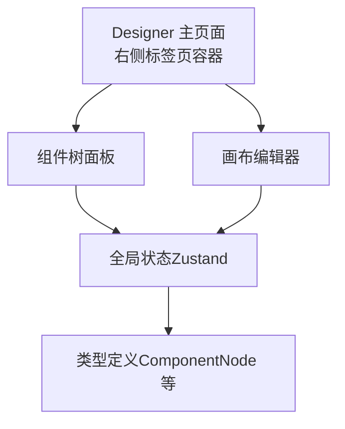
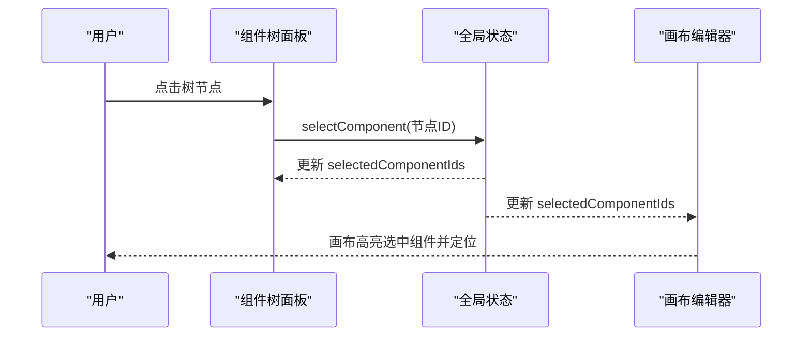
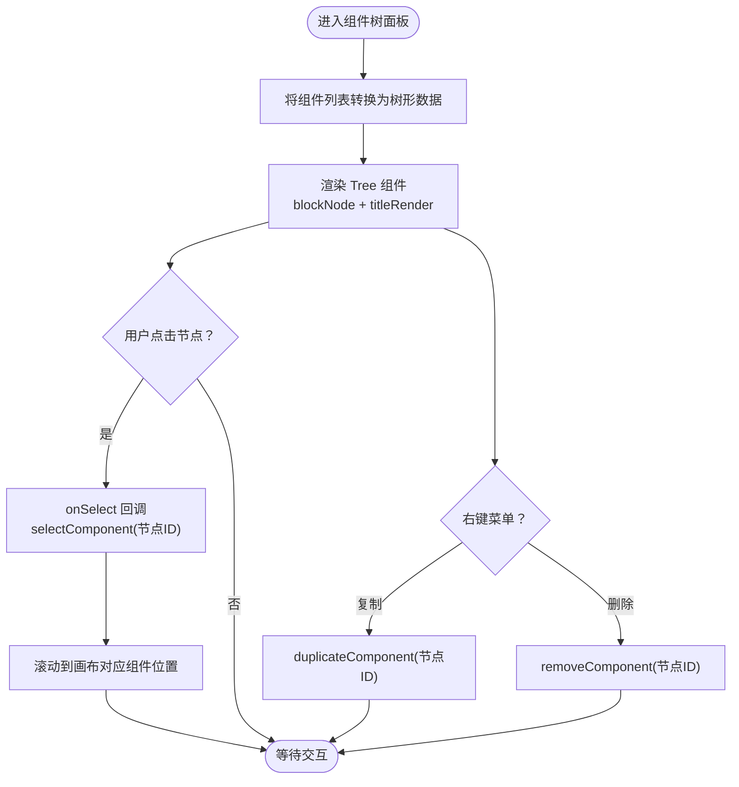
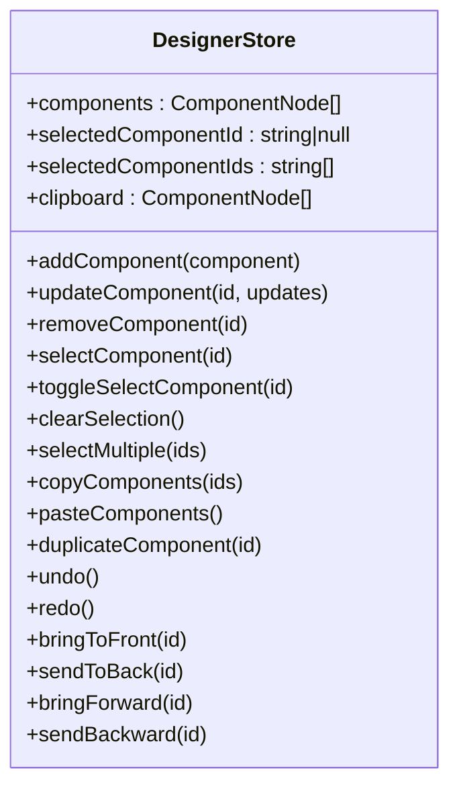
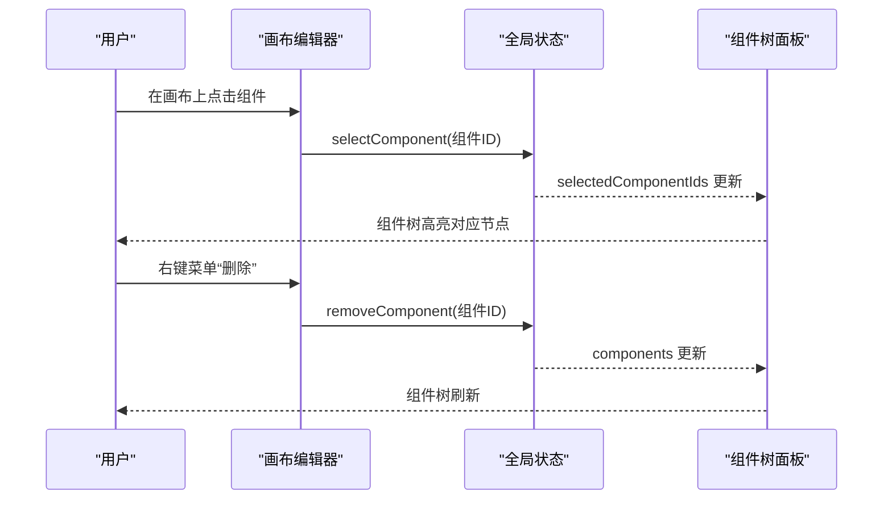
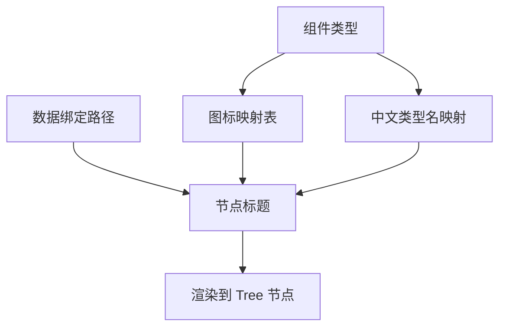
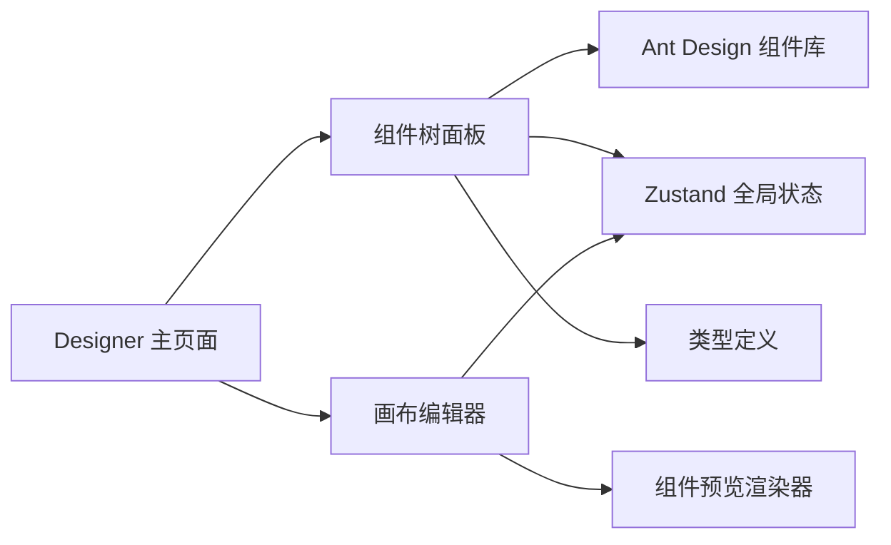

# 组件树面板

<cite>
**本文引用的文件**
- [index.tsx](file://designer/src/pages/Designer/components/ComponentTreePanel/index.tsx)
- [index.module.css](file://designer/src/pages/Designer/components/ComponentTreePanel/index.module.css)
- [designer.ts](file://designer/src/store/designer.ts)
- [index.tsx](file://designer/src/pages/Designer/components/Canvas/index.tsx)
- [index.tsx](file://designer/src/pages/Designer/index.tsx)
- [index.tsx](file://designer/src/pages/Designer/components/Canvas/ComponentPreview.tsx)
- [RectPreview.tsx](file://designer/src/pages/Designer/components/Canvas/componentRenderers/RectPreview.tsx)
- [index.ts](file://designer/src/types/index.ts)
</cite>

## 目录
1. [简介](#简介)
2. [项目结构](#项目结构)
3. [核心组件](#核心组件)
4. [架构总览](#架构总览)
5. [详细组件分析](#详细组件分析)
6. [依赖分析](#依赖分析)
7. [性能考虑](#性能考虑)
8. [故障排查指南](#故障排查指南)
9. [结论](#结论)
10. [附录](#附录)

## 简介
组件树面板用于展示画布上所有组件的层级结构，提供选中定位、右键菜单（复制、删除）、以及组件名称与图标显示能力。它与画布编辑器通过全局状态进行双向联动：选中组件树中的节点会同步到画布并自动定位；在画布中选中组件也会同步更新组件树的选中状态。本功能文档将系统性地阐述组件树的层级结构展示、父子与兄弟关系维护、展开收起与选中切换、拖拽排序能力现状、与画布的同步机制、右键菜单功能、图标与状态指示、性能优化策略及使用示例。

## 项目结构
组件树位于“设计器”页面的右侧面板中，作为“组件树”标签页的内容存在。其与画布编辑器共享同一 Zustand 全局状态，确保两者之间的状态一致。

图示来源
- [index.tsx:204-231](file://designer/src/pages/Designer/index.tsx#L204-L231)
- [index.tsx:74-76](file://designer/src/pages/Designer/components/ComponentTreePanel/index.tsx#L74-L76)
- [designer.ts:85-125](file://designer/src/store/designer.ts#L85-L125)
- [index.tsx:123-138](file://designer/src/types/index.ts#L123-L138)

章节来源
- [index.tsx:204-231](file://designer/src/pages/Designer/index.tsx#L204-L231)
- [index.tsx:74-76](file://designer/src/pages/Designer/components/ComponentTreePanel/index.tsx#L74-L76)
- [designer.ts:85-125](file://designer/src/store/designer.ts#L85-L125)
- [index.ts:123-138](file://designer/src/types/index.ts#L123-L138)

## 核心组件
- 组件树面板：负责将组件列表转换为树形结构，渲染节点标题（含图标、类型名、序号、数据绑定路径），处理选中与右键菜单。
- 全局状态（Zustand）：集中管理组件列表、选中状态、复制/粘贴、撤销/重做、层级管理等。
- 画布编辑器：负责组件的拖放、选中、拖拽移动、尺寸调整、右键菜单等交互，并与全局状态联动。
- 类型定义：统一描述组件节点结构（含布局、样式、绑定、子节点等）。

章节来源
- [index.tsx:54-72](file://designer/src/pages/Designer/components/ComponentTreePanel/index.tsx#L54-L72)
- [designer.ts:85-125](file://designer/src/store/designer.ts#L85-L125)
- [index.tsx:20-50](file://designer/src/pages/Designer/components/Canvas/index.tsx#L20-L50)
- [index.ts:123-138](file://designer/src/types/index.ts#L123-L138)

## 架构总览
组件树与画布通过全局状态实现解耦的同步机制：组件树读取组件列表与选中集合，画布同样读取这些状态并在用户交互时写回状态。组件树的右键菜单调用全局状态提供的复制/删除方法，从而实现跨面板的一致行为。

图示来源
- [index.tsx:82-93](file://designer/src/pages/Designer/components/ComponentTreePanel/index.tsx#L82-L93)
- [designer.ts:108-125](file://designer/src/store/designer.ts#L108-L125)
- [index.tsx:390-399](file://designer/src/pages/Designer/components/Canvas/index.tsx#L390-L399)

章节来源
- [index.tsx:82-93](file://designer/src/pages/Designer/components/ComponentTreePanel/index.tsx#L82-L93)
- [designer.ts:108-125](file://designer/src/store/designer.ts#L108-L125)
- [index.tsx:390-399](file://designer/src/pages/Designer/components/Canvas/index.tsx#L390-L399)

## 详细组件分析

### 组件树面板（组件树面板）
- 展示逻辑
  - 将组件列表转换为树形数据，每个节点包含 key（组件ID）、title（图标 + 类型名 + 序号 + 绑定路径）。
  - 使用 Ant Design 的 Tree 组件渲染，blockNode 提升交互体验。
- 选中与定位
  - onSelect 回调中调用全局状态的 selectComponent，并在画布中滚动到对应组件所在区域。
- 右键菜单
  - 通过 Dropdown 包裹每个节点标题，触发方式为 contextMenu，提供“复制组件”“删除组件”两个操作。
  - 复制调用 duplicateComponent，删除调用 removeComponent。
- 空态与提示
  - 当组件为空时显示 Empty 占位与说明文字。
  - 顶部显示组件总数与提示信息。

图示来源
- [index.tsx:54-72](file://designer/src/pages/Designer/components/ComponentTreePanel/index.tsx#L54-L72)
- [index.tsx:82-93](file://designer/src/pages/Designer/components/ComponentTreePanel/index.tsx#L82-L93)
- [index.tsx:96-117](file://designer/src/pages/Designer/components/ComponentTreePanel/index.tsx#L96-L117)
- [index.tsx:120-130](file://designer/src/pages/Designer/components/ComponentTreePanel/index.tsx#L120-L130)

章节来源
- [index.tsx:54-72](file://designer/src/pages/Designer/components/ComponentTreePanel/index.tsx#L54-L72)
- [index.tsx:82-93](file://designer/src/pages/Designer/components/ComponentTreePanel/index.tsx#L82-L93)
- [index.tsx:96-117](file://designer/src/pages/Designer/components/ComponentTreePanel/index.tsx#L96-L117)
- [index.tsx:120-130](file://designer/src/pages/Designer/components/ComponentTreePanel/index.tsx#L120-L130)
- [index.module.css:1-29](file://designer/src/pages/Designer/components/ComponentTreePanel/index.module.css#L1-L29)

### 全局状态（Zustand）
- 组件与选中
  - 组件列表、新增、更新、删除；单选与多选状态；清空画布。
- 复制/粘贴/克隆
  - 复制多个组件到剪贴板；粘贴时生成新ID并偏移位置；克隆单个组件。
- 撤销/重做
  - 历史记录最多保存固定步数，支持 undo/redo。
- 层级管理
  - 置顶、置底、上移一层、下移一层。
- 与画布联动
  - 画布侧也提供相同接口，保证组件树与画布状态一致。

图示来源
- [designer.ts:8-71](file://designer/src/store/designer.ts#L8-L71)
- [designer.ts:85-539](file://designer/src/store/designer.ts#L85-L539)

章节来源
- [designer.ts:8-71](file://designer/src/store/designer.ts#L8-L71)
- [designer.ts:85-539](file://designer/src/store/designer.ts#L85-L539)

### 画布编辑器（与组件树联动）
- 选中与定位
  - 画布中点击组件或按住 Ctrl/Cmd 多选，均通过全局状态更新选中集合；组件树同步选中。
- 右键菜单
  - 画布侧提供右键菜单，包含复制、粘贴、删除等；组件树侧提供复制、删除。
- 拖拽与层级
  - 画布支持拖拽移动与尺寸调整；组件树当前未提供拖拽排序功能。
- 键盘快捷键
  - Delete/Backspace 删除；Ctrl/Cmd+C/V 复制/粘贴；Ctrl/Cmd+Z 撤销/重做；Ctrl/Cmd+D 克隆。

图示来源
- [index.tsx:390-399](file://designer/src/pages/Designer/components/Canvas/index.tsx#L390-L399)
- [designer.ts:108-125](file://designer/src/store/designer.ts#L108-L125)
- [index.tsx:113-116](file://designer/src/pages/Designer/components/ComponentTreePanel/index.tsx#L113-L116)

章节来源
- [index.tsx:390-399](file://designer/src/pages/Designer/components/Canvas/index.tsx#L390-L399)
- [designer.ts:108-125](file://designer/src/store/designer.ts#L108-L125)
- [index.tsx:113-116](file://designer/src/pages/Designer/components/ComponentTreePanel/index.tsx#L113-L116)

### 图标与状态指示
- 图标映射
  - 文本、图片、二维码、条形码、表格、矩形、线条分别映射不同 Ant Design 图标，并带颜色区分。
- 类型名称
  - 中文类型名映射，便于用户识别。
- 绑定路径
  - 若组件绑定了数据路径，将在标题后以次级文字显示，帮助用户快速定位数据来源。
- 选中状态
  - 画布中选中组件高亮；组件树中选中节点高亮；两者通过全局状态保持一致。

图示来源
- [index.tsx:26-51](file://designer/src/pages/Designer/components/ComponentTreePanel/index.tsx#L26-L51)
- [index.tsx:54-72](file://designer/src/pages/Designer/components/ComponentTreePanel/index.tsx#L54-L72)

章节来源
- [index.tsx:26-51](file://designer/src/pages/Designer/components/ComponentTreePanel/index.tsx#L26-L51)
- [index.tsx:54-72](file://designer/src/pages/Designer/components/ComponentTreePanel/index.tsx#L54-L72)

### 右键菜单功能
- 组件树右键菜单
  - 复制组件：调用 duplicateComponent，生成新ID并偏移位置。
  - 删除组件：调用 removeComponent，从组件列表中移除。
- 画布右键菜单
  - 提供复制、粘贴、删除等操作，与全局状态保持一致。

章节来源
- [index.tsx:96-117](file://designer/src/pages/Designer/components/ComponentTreePanel/index.tsx#L96-L117)
- [designer.ts:174-229](file://designer/src/store/designer.ts#L174-L229)

### 展开收起与选中状态切换
- 展开收起
  - Ant Design Tree 默认支持展开/收起子节点；组件树当前仅展示一维列表，未体现层级父子关系。
- 选中状态
  - 组件树通过 selectedKeys 与全局状态的 selectedComponentIds 同步；画布通过鼠标点击与键盘多选切换。

章节来源
- [index.tsx:162-169](file://designer/src/pages/Designer/components/ComponentTreePanel/index.tsx#L162-L169)
- [designer.ts:108-125](file://designer/src/store/designer.ts#L108-L125)

### 拖拽排序能力现状
- 组件树
  - 当前未实现拖拽排序功能。
- 画布
  - 支持拖拽移动与尺寸调整，但未暴露到组件树面板。

章节来源
- [index.tsx:162-169](file://designer/src/pages/Designer/components/ComponentTreePanel/index.tsx#L162-L169)
- [index.tsx:401-431](file://designer/src/pages/Designer/components/Canvas/index.tsx#L401-L431)

### 与画布编辑器的同步机制
- 选中同步
  - 组件树 onSelect -> selectComponent -> 全局状态 -> 画布选中状态 -> 画布高亮与定位。
- 删除同步
  - 组件树右键删除 -> removeComponent -> 全局状态 -> 画布组件列表更新。
- 复制/粘贴同步
  - 组件树右键复制 -> duplicateComponent -> 全局状态 -> 画布新增组件。
- 数据绑定路径显示
  - 组件树标题中显示绑定路径，辅助用户理解数据来源。

章节来源
- [index.tsx:82-93](file://designer/src/pages/Designer/components/ComponentTreePanel/index.tsx#L82-L93)
- [index.tsx:113-116](file://designer/src/pages/Designer/components/ComponentTreePanel/index.tsx#L113-L116)
- [designer.ts:108-125](file://designer/src/store/designer.ts#L108-L125)
- [index.tsx:390-399](file://designer/src/pages/Designer/components/Canvas/index.tsx#L390-L399)

## 依赖分析
- 组件树依赖
  - Ant Design Tree、Dropdown、Typography、Empty、Tooltip。
  - 全局状态（Zustand）：selectComponent、removeComponent、duplicateComponent。
  - 类型定义：ComponentNode。
- 画布依赖
  - 全局状态：selectComponent、removeComponent、duplicateComponent、updateComponent。
  - 组件预览：根据组件类型渲染预览效果。
- 设计器主页面
  - 将组件树作为右侧标签页之一，与属性面板并列。

图示来源
- [index.tsx:6-21](file://designer/src/pages/Designer/components/ComponentTreePanel/index.tsx#L6-L21)
- [designer.ts:85-125](file://designer/src/store/designer.ts#L85-L125)
- [index.tsx:20-50](file://designer/src/pages/Designer/components/Canvas/ComponentPreview.tsx#L20-L50)
- [index.tsx:204-231](file://designer/src/pages/Designer/index.tsx#L204-L231)

章节来源
- [index.tsx:6-21](file://designer/src/pages/Designer/components/ComponentTreePanel/index.tsx#L6-L21)
- [designer.ts:85-125](file://designer/src/store/designer.ts#L85-L125)
- [index.tsx:20-50](file://designer/src/pages/Designer/components/Canvas/ComponentPreview.tsx#L20-L50)
- [index.tsx:204-231](file://designer/src/pages/Designer/index.tsx#L204-L231)

## 性能考虑
- 渲染优化
  - Tree 组件使用 blockNode 提升视觉与交互体验；titleRender 返回的节点内容包含图标与绑定路径，建议避免在 title 中执行复杂计算。
- 大数据量策略
  - 当组件数量较多时，建议：
    - 仅在必要时重新计算 treeData（例如组件列表变化时再转换）。
    - 使用稳定 key 与受控 selectedKeys，减少不必要的重渲染。
    - 对于超大模板，可考虑虚拟化 Tree（若 Ant Design Tree 支持）或分页/分组展示。
- 状态更新
  - 全局状态的批量更新（如复制/粘贴）应尽量一次性提交，避免频繁触发 UI 重绘。
- 画布联动
  - 选中与定位操作仅在组件树中触发，不会直接改变组件列表，因此对性能影响较小。

章节来源
- [index.tsx:54-72](file://designer/src/pages/Designer/components/ComponentTreePanel/index.tsx#L54-L72)
- [index.tsx:162-169](file://designer/src/pages/Designer/components/ComponentTreePanel/index.tsx#L162-L169)
- [designer.ts:174-229](file://designer/src/store/designer.ts#L174-L229)

## 故障排查指南
- 组件树不显示任何节点
  - 检查全局状态 components 是否为空；确认 Designer 主页面已正确挂载组件树标签页。
- 点击树节点无法定位到画布
  - 检查组件树 onSelect 是否调用 selectComponent；检查画布中是否存在对应 DOM（组件需有唯一 ID）。
- 右键菜单无效
  - 确认 Dropdown 的 trigger 设置为 contextMenu；确认菜单项 onClick 调用了正确的全局状态方法。
- 删除后画布未更新
  - 确认 removeComponent 是否被调用；检查全局状态是否更新了 components。
- 复制/粘贴异常
  - 确认 duplicateComponent/pasteComponents 是否正确生成新 ID 并偏移位置；检查 grid 吸附是否生效。

章节来源
- [index.tsx:82-93](file://designer/src/pages/Designer/components/ComponentTreePanel/index.tsx#L82-L93)
- [index.tsx:113-116](file://designer/src/pages/Designer/components/ComponentTreePanel/index.tsx#L113-L116)
- [designer.ts:101-106](file://designer/src/store/designer.ts#L101-L106)
- [designer.ts:206-229](file://designer/src/store/designer.ts#L206-L229)

## 结论
组件树面板提供了直观的组件层级浏览与基础交互能力，通过全局状态与画布编辑器实现高效同步。当前版本未实现拖拽排序，但具备完善的选中联动、右键菜单、图标与绑定路径显示能力。针对大数据量场景，建议采用受控渲染与必要的虚拟化策略，以维持流畅体验。

## 附录

### 使用示例与操作指南
- 打开组件树
  - 在右侧标签页中选择“组件树”，即可看到所有组件的列表。
- 选中组件
  - 点击树节点，画布中对应组件将高亮并自动定位到可视区域。
- 复制组件
  - 在组件树右键菜单中选择“复制组件”，新组件将出现在画布中并被选中。
- 删除组件
  - 在组件树右键菜单中选择“删除组件”，组件将从画布与组件树中移除。
- 画布侧操作
  - 在画布中右键组件可执行复制、粘贴、删除等操作；按 Delete/Backspace 可删除选中组件；按 Ctrl/Cmd+D 可克隆组件。

章节来源
- [index.tsx:82-93](file://designer/src/pages/Designer/components/ComponentTreePanel/index.tsx#L82-L93)
- [index.tsx:96-117](file://designer/src/pages/Designer/components/ComponentTreePanel/index.tsx#L96-L117)
- [index.tsx:112-161](file://designer/src/pages/Designer/components/Canvas/index.tsx#L112-L161)